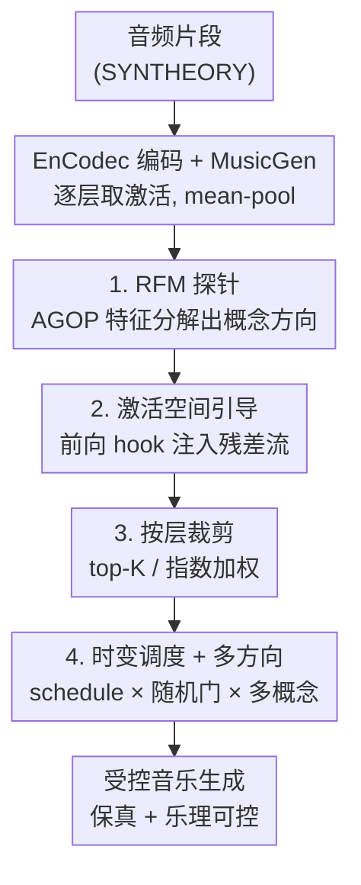

# Steering Autoregressive Music Generation with Recursive Feature Machines

**会议**: ICLR 2026  
**OpenReview**: [https://openreview.net/forum?id=NaHzPMaCY9](https://openreview.net/forum?id=NaHzPMaCY9)  
**代码**: https://github.com/astradzhao/music-rfm  
**领域**: 音频/音乐生成  
**关键词**: 可控音乐生成、激活空间引导、递归特征机、概念方向、MusicGen

## 一句话总结
本文提出 MusicRFM，用递归特征机（RFM）在 MusicGen 的隐藏激活里抽出对应音符、和弦、调式等乐理概念的「概念方向」，推理时把这些方向直接注入残差流来实时引导生成——无需重训也无需逐步优化，就能把目标音符的命中率从 0.23 拉到 0.82，而文本对齐（CLAP）几乎不掉（与基线相差约 0.02）。

## 研究背景与动机
**领域现状**：以 MusicGen 为代表的自回归（AR）文本到音乐（TTM）模型，靠神经音频编解码器（EnCodec）把音频量化成离散 token，再用 Transformer 自回归预测，已经能生成保真度和连贯性都不错的音乐。围绕「时变控制」也有不少工作，比如控制力度、复音旋律、钢琴卷帘。

**现有痛点**：要在生成过程中精细控制细粒度乐理内容（具体音高、和弦质量、调式、节拍随时间变化），现有路线要么需要在基座模型上做重度微调——哪怕参数高效微调，每加一种控制也要几十到上百 GPU 小时，且微调数据选不好会破坏模型本身的生成能力；要么走推理期逐步优化（per-step optimization），代价高昂。

**核心矛盾**：控制力和生成质量之间存在 trade-off。强行干预内部表示能提高控制精度，但容易引入可听的失真、破坏对文本提示的忠实度；而温和的、基于提示词的控制（prompt engineering）对乐理概念几乎无效——实验显示纯提示词在多数类别上只能做到接近随机猜测的准确率。

**本文目标**：在**冻结**的预训练音乐模型上，实现细粒度、可解释、且不牺牲音质的乐理控制；进一步支持随时间变化的调度和多概念同时控制。

**切入角度**：作者主张更直接的可控性来自**激活空间干预**——如果能在模型隐藏态里找到稳定对应「音高/和弦/速度」等人类可理解概念的方向，就能沿这些轴引导生成，既不重训也不改解码流程。关键问题变成：怎么稳健、可解释地发现这些语义方向？

**核心 idea**：用递归特征机（RFM）来回答这个问题。RFM 通过轻量探针构造平均梯度外积（AGOP）矩阵，做特征值分解后给出一组正交、按敏感度排序的概念方向；把这些方向反向注入激活，就能把冻结模型偏向目标属性。本文把这套范式首次搬到 AR 音乐生成，并补上 layer / time / multi-direction 三套控制机制。

## 方法详解

### 整体框架
MusicRFM 的目标是：拿一个冻结的 MusicGen-Large（48 个 decoder block），不动它一根权重，就能让生成的音乐朝指定乐理概念（某个音符、某种和弦、慢/快速度）偏移，同时还忠实于文本提示。整条管线分两阶段：**离线训练探针**（在 SYNTHEORY 合成数据上逐层训 RFM 探针，抽出概念方向）→ **在线注入引导**（推理时通过前向 hook 把概念方向加到残差流上）。为了把音质和控制精度的 trade-off 处理好，作者在注入环节又叠了三套机制：按层裁剪、随时间调度、多方向并行。

整体数据流如下：

### 关键设计

**1. RFM 探针：用平均梯度外积抽出可解释的概念方向**

要在激活空间引导生成，前提是先找到「哪个方向代表 C# 音、哪个方向代表大三和弦」。本文用递归特征机（RFM）来发现这些方向。给定训练数据 $\{(x_i, y_i)\}$ 和一个轻量预测器 $f$，对每个样本求梯度 $g_i = \nabla_x f(x_i)$，构造平均梯度外积矩阵（AGOP）：

$$M = \frac{1}{n}\sum_{i=1}^{n} g_i g_i^\top \in \mathbb{R}^{d\times d}.$$

$M$ 是半正定的，做特征分解 $M = Q\Lambda Q^\top$ 后，正交特征向量 $\{q_j\}$ 就是模型对该概念最敏感的主轴，特征值 $\lambda_j = q_j^\top M q_j$ 度量敏感度大小。RFM 通过迭代「训练基学习器（核岭回归）→ 算 AGOP → 用 $T=Q\Lambda^\alpha Q^\top$ 重新加权特征」来做特征学习，整个过程**无需反向传播**。具体到音乐：作者在 SYNTHEORY 合成数据集（涵盖 tempo、notes、和弦进行、和弦类型、调式、音程、拍号 7 类乐理概念，有干净的细粒度监督）上，对 MusicGen 每一层激活分别训 15 轮 RFM 探针，保留验证指标最优的那个，得到的特征向量 $q_{\ell,j}$ 就是该层、该概念的可解释引导轴。相比 FFN 探针，RFM 天然产出正交、按特征值排序的方向，特别适合拿来做注入式引导——这是它比普通线性/FFN 探针更适合 steering 的根本原因。

**2. 激活空间引导：把概念方向加回残差流**

有了概念方向，推理时就在选定的层集合 $S$ 上注册前向 hook，给每个残差流加上一个广播的控制向量：

$$h'_{t,\ell} = h_{t,\ell} + \eta_\ell(t)\, q_{\ell,j^\star},$$

其中 $q_{\ell,j^\star}$ 是该层概念方向的最高分量（reshape 成 $(1,1,d_\ell)$ 广播到所有 token），$\eta_\ell(t)$ 是控制强度系数。这一步完全在推理期完成，不改模型权重、不改解码流程，因此是「冻结模型 + 实时引导」。一个工程细节是特征提取用 **mean-pool**（对所有 token 的激活取平均）而非文本 RFM 里常用的 last-token pooling——因为音乐是连续、固定采样率的时序信号，把信息压到单个末位 token 不合理，均值池化能更好捕捉时序结构，对 tempo、和弦进行、调式这类时序属性的探针性能提升明显。

**3. 按层裁剪：只在信息量高的层注入，换回音质**

如果像原始 RFM 论文那样，在全部 48 层、每一步都均匀注入，会明显劣化音质、削弱文本对齐——因为低分层产出的方向噪声大、会把生成推偏。本文在推理期引入两种按层裁剪策略来「抓重点、压噪声」：**top-K 选择**按各层验证探针性能 $\text{AUC}_\ell$ 排序，只在 top-K 层注入；**指数加权**则不做硬裁剪，而是把各层探针分数 $s_\ell$ 归一化为 $\hat s_\ell\in[0,1]$，定义层权重 $w_\ell = w_0 \cdot \hat s_\ell^{1/\kappa}$（$\kappa\in(0,1)$），把引导强度集中到高性能层、压低低分层的贡献。这一步直接服务于「控制力 vs 保真度」的核心矛盾——不是注入越多越好，而是注入在对的层上。

**4. 时变调度 + 多方向控制：让控制随时间、随概念灵活组合**

为了支持更丰富的控制，作者把强度系数写成 $\eta_\ell(t) = \eta_0\, w_\ell\, \phi(t)\, \psi_p(t)$：$\eta_0$ 是全局系数，$w_\ell$ 是上面的层权重，$\phi(t)$ 是确定性调度（线性/逻辑斯蒂上升、线性/指数衰减、正弦调制，可以让某概念随时间淡入淡出或周期性增强），$\psi_p(t)$ 是可选的随机门（每步以概率 $p$ 的伯努利采样决定是否施加控制，类似 dropout，能减少过度引导和累积失真，同时保持对目标属性的期望偏置）。在此之上，**多方向引导**把 $M$ 个概念向量并行注入：$h'_{t,\ell} = h_{t,\ell} + \sum_{m=1}^{M}\big(\eta_{0,m} w_\ell \phi_m(t)\psi_p(t)\big) q_{\ell,j_m}$，每个方向有独立系数和调度，从而既能**同时**强制多个属性（如音符 + 速度），也能**错峰**控制（如开头强制速度、后段渐入和声结构）。

## 实验关键数据

### 主实验

**探针分类能力（vs SYNTHEORY 原始 FFN 探针，Table 1）**——验证 RFM 抽出的方向确实捕获了乐理概念：

| 模型 | Notes | Intervals | Scales | Chords | Prog. | Time Sig. | Tempos | 平均 |
|------|-------|-----------|--------|--------|-------|-----------|--------|------|
| MusicRFM（mean-pool，本文） | 0.850 | 0.975 | 0.956 | 0.984 | 0.943 | 0.900 | 0.985 | **0.942** |
| RFM（last-token） | 0.734 | 0.743 | 0.546 | 0.866 | 0.811 | 0.771 | 0.959 | 0.776 |
| 线性探针 | 0.761 | 0.618 | 0.158 | 0.834 | 0.725 | 0.729 | 0.972 | 0.685 |
| SYNTHEORY FFN | 0.866 | 0.972 | 0.905 | 0.989 | 0.901 | 0.905 | 0.965 | 0.929 |

（Tempos 列为 $R^2$，其余为准确率。）mean-pool 的 MusicRFM 平均分（0.942）超过原始 FFN（0.929），且在 scales、progressions、intervals 准确率和 tempo 的 $R^2$ 上领先；mean-pool 明显优于 last-token（0.942 vs 0.776）。

**单方向引导（Table 2，notes 类）**——核心 trade-off 结论：随控制系数 $\eta_0$ 从 0.15 升到 0.60，探针准确率单调上升，notes 从 **0.23 → 0.82**；同时 CLAP 文本对齐基本持平（约 0.30~0.34，基线 MusicGen-Large 为 0.332），相差约 0.02；而分布距离 FD/MMD 随 $\eta_0$ 增大而升高（越强引导越偏离参考分布）。纯提示词基线（prompt-only）除 notes 外几乎只有随机水平，说明这种控制无法靠提示工程实现；prompt + RFM 组合在 notes 上准确率可超 95%。

### 消融实验

**听感测试（Table 3，12 名被试，1~100 评分均值±标准差）**：

| 引导方式 | Chords | Intervals | Notes | Tempo |
|---------|--------|-----------|-------|-------|
| 无引导（基线） | 59.71 | 54.75 | 57.08 | 55.75 |
| Naïve RFM（全层均匀注入） | 69.21 | 62.58 | 68.13 | 73.33 |
| MusicRFM（最优层/时调度） | **73.46** | **70.33** | **72.88** | **73.38** |

最优配置统一用随机门 $p=0.3$ + 指数层加权（$w_0=1, \kappa=0.95$）。Naïve 和 MusicRFM 都显著优于基线，MusicRFM 在所有属性上评分最高；和弦、音程从层裁剪中获益最大，tempo 相对基线提升幅度最大。

### 关键发现
- **mean-pool 是探针有效的关键**：last-token 假设模型把全部乐理信息压到单个 token，对时序属性（tempo、和弦进行、调式）不成立；改用均值池化后这些类别提升最明显（scales 0.546 → 0.956）。
- **层裁剪决定音质上限**：全层均匀注入（Naïve）会劣化音质，按层加权/裁剪把强度集中到高分层后，听感分数从 Naïve 进一步提升，且 chords/intervals 获益最大。
- **RFM 提供 prompt 给不了的控制**：纯提示词对多数乐理概念接近随机；RFM 注入带来清晰的、随 $\eta_0$ 单调变化的可控性。
- **真实音乐迁移有效但有衰减**：在 MusicBench 真实音乐上，RFM 探针 notes 准确率 75.3%、keys 67.5%，但 tempo 回归较难（MSE 0.862）；steering 趋势与合成数据一致——适度系数保文本忠实、过激系数会破坏生成。
- **探针准确率是相对指标**：探针在合成的 SYNTHEORY 上训练，对自然 MusicGen 输出未必完美泛化，作者明确提示应看趋势而非绝对值。

## 亮点与洞察
- **把 LLM 的激活引导范式干净地搬到音频自回归模型**：核心洞察是「乐理概念在隐藏态里有稳定的线性方向」，RFM 用 AGOP 特征分解把这些方向可解释地挖出来——这套思路（找方向 → 注残差流）可迁移到任何冻结的 Transformer 生成器。
- **AGOP 的正交+特征值排序结构天生适合 steering**：相比 FFN/线性探针，RFM 给的是一组正交、按敏感度排序的轴，注入时干扰小、可解释性强；这是「为什么用 RFM 而不是随便训个探针」的关键答案。
- **三套机制把『控制 vs 保真』trade-off 拆成可调旋钮**：层裁剪管「在哪注」、时变调度管「何时注多强」、多方向管「注几个概念」，三者正交组合，工程上非常实用。
- **零训练成本的控制**：只需训练极轻量探针，基座模型完全冻结，推理期也无逐步优化——相比动辄几十上百 GPU 小时的微调式控制，成本优势巨大。

## 局限与展望
- **探针训练依赖合成数据**：SYNTHEORY 的乐理属性是简化的，对自然音乐泛化有限；tempo 这类连续属性在真实数据上回归困难（MusicBench MSE 0.862）。
- **强引导仍会破坏分布**：$\eta_0$ 过大时 FD/MMD 显著升高、CLAP 下降，控制和保真的 trade-off 没有被消除，只是被推到更有利的区间，仍需手调系数。
- **评估指标自身有噪声**：探针准确率受合成训练数据限制，作者自己也只把它当相对趋势；和弦的外部评估在 prompt+RFM 组合下反而退化（因为提示词本身和弦准确率低，组合会推偏）。
- **改进方向**：在真实音乐上训练/校准探针、给系数 $\eta_0$ 设计自适应调度、把外部波形评估器纳入闭环来自动选最优层与强度。

## 相关工作与启发
- **vs 微调式可控 TTM（如 piano-roll 控制、参数高效微调）**：他们改基座模型权重，每加一种控制要几十~上百 GPU 小时且可能破坏生成能力；本文冻结模型、只训轻量探针、推理期注入，成本和风险都低得多。
- **vs LLM 激活引导（ActAdd / CAA / Beaglehole 等的 RFM steering）**：它们在语言模型上用对比提示或 RFM 方向做风格/情感引导；本文首次把 RFM 引导扩展到 AR 音乐，并针对音频的连续、定采样率特性补上 mean-pool、按层裁剪、时变调度、多方向四项改造。
- **vs 推理期逐步优化控制**：那类方法每步都要优化，代价高；本文是「一次性注入预先发现的方向」，无逐步优化。

## 评分
- 新颖性: ⭐⭐⭐⭐⭐ 首次把 RFM 激活引导范式系统地迁移到自回归音乐生成，并补齐 layer/time/multi-direction 三套音频专属机制。
- 实验充分度: ⭐⭐⭐⭐ 覆盖分类探针、单/多方向引导、时变调度、听感测试、真实音乐迁移，指标全面；但被试仅 12 人、探针绝对值依赖合成数据。
- 写作质量: ⭐⭐⭐⭐ 动机与方法链条清晰，公式与机制讲得透；表格密集需要对照原文细看。
- 价值: ⭐⭐⭐⭐⭐ 提供了零训练成本、可解释、保真的乐理控制方案，对可控音乐生成和激活引导研究都有实用与启发价值。

<!-- RELATED:START -->

## 相关论文

- [\[ICLR 2026\] Discovering and Steering Interpretable Concepts in Large Generative Music Models](discovering_and_steering_interpretable_concepts_in_large_generative_music_models.md)
- [\[ICLR 2026\] SyncTrack: Rhythmic Stability and Synchronization in Multi-Track Music Generation](synctrack_rhythmic_stability_and_synchronization_in_multi-track_music_generation.md)
- [\[ICLR 2026\] YuE: Scaling Open Foundation Models for Long-Form Music Generation](yue_scaling_open_foundation_models_for_long-form_music_generation.md)
- [\[ICML 2026\] Towards Streaming Synchronized Spatial Audio Generation via Autoregressive Diffusion Transformer](../../ICML2026/audio_speech/towards_streaming_synchronized_spatial_audio_generation_via_autoregressive_diffu.md)
- [\[CVPR 2026\] FoleyDirector: Fine-Grained Temporal Steering for Video-to-Audio Generation via Structured Scripts](../../CVPR2026/audio_speech/foleydirector_fine-grained_temporal_steering_for_video-to-audio_generation_via_s.md)

<!-- RELATED:END -->
