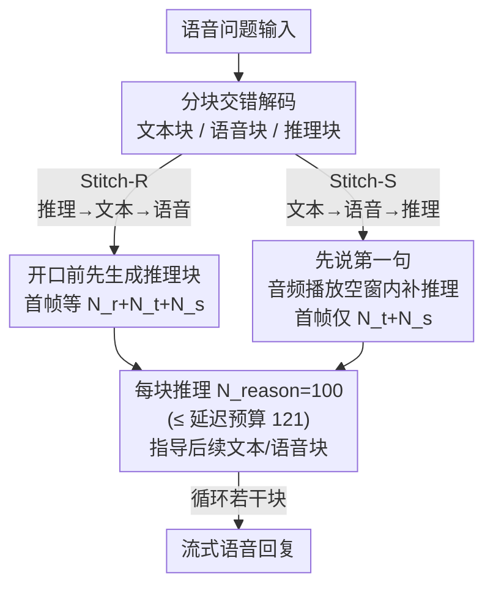

# Stitch: Simultaneous Thinking and Talking with Chunked Reasoning for Spoken Language Models

**会议**: ICLR 2026  
**arXiv**: [2507.15375](https://arxiv.org/abs/2507.15375)  
**代码**: [https://d223302.github.io/STITCH](https://d223302.github.io/STITCH)  
**领域**: 音频语音  
**关键词**: 口语模型, 思维链, 同步思考说话, 分块推理, 延迟优化

## 一句话总结
提出 Stitch，在口语语言模型中实现"边想边说"——将无声推理 token 与语音 token 交替分块生成，利用音频播放期间的空闲算力完成推理。Stitch-S 首帧延迟与无推理基线一致，数学推理准确率提升约 15 个百分点。

## 研究背景与动机

当前主流口语语言模型（SLM，如 GLM-4-Voice、Qwen-2.5-Omni）的输出流程是：先生成一段文本 token（作为即将说出内容的转写），再生成一段 speech token（由声码器合成波形），两者交替进行（interleaved decoding）。这种"交错文本-语音"设计使 SLM 可以流式输出语音，但模型在说话之前并不做额外的内部推理——直接把想到的答案说出来。

人类在回答复杂问题时往往先在脑中默默推导，然后才把精炼的答案说出来。这有两个好处：①答案更准确，②表述更简洁。将类似的"无声思维链（unspoken CoT）"引入 SLM 是自然的想法，但面临延迟问题。

最朴素的方案是 TBS（Think Before Speaking）：先完整生成一段文本推理 $\mathbf{z}$，再生成语音回复 $\mathbf{y}$。实验证明 TBS 确实大幅提升了数学推理质量（平均 79.1% vs 无推理 63.0%），但推理可以任意长（GSM8K 上推理 token 可达 360），导致用户等待首帧语音的延迟不可控。

Stitch 的核心观察是：一段 $N_{speech}=26$ 个 speech token 合成后的音频时长约 2 秒，而在 A100 上以 80 tps 的速度仅需约 0.49 秒生成 39 个 text+speech token，剩余约 1.5 秒的播放时间是"空闲"的。Stitch 把这段空闲时间用来生成下一轮的推理 token，从而实现"说话的同时思考"——理论上限为 $80 \times 2 - 39 = 121$ 个推理 token/块，实际设置 $N_{reason}=100$。

## 方法详解

### 整体框架
Stitch 在 SLM 原有的 text token 与 speech token 之外引入第三种 token——reasoning token（无声推理），三者按块交替排列。推理 token 被特殊标记 [SOPR]/[EOPR] 包裹，只参与思考、不送进声码器合成语音。关键想法是把这段推理塞进"上一块语音正在播放"的空窗里：模型一边播音频一边算下一轮推理，于是思考几乎不占用用户能感知的等待时间。论文给出两种块序——Stitch-R 先想再说、Stitch-S 先说后想——并用一条延迟预算不等式约束每块推理长度，训练数据则由现成的 TBS 数据机械切块得到。

### 关键设计

**1. Stitch-R（推理优先）：先想再说，但首帧仍要等一段推理**

最直接的交错排法是让每一轮都"先推理、再转写、再合成"，生成顺序为推理块、文本块、语音块循环往复。这样模型在开口前已经想好了第一句，质量更有保障，但代价是用户听到第一帧语音前要等 $N_{reason}+N_{text}+N_{speech}$ 个 token 的生成时间。相比 TBS 把整段推理（GSM8K 上可达 360 token）一次性算完，Stitch-R 把推理切成每块 $N_{reason}=100$，首帧延迟已经大幅压缩，但第一段推理仍躲不掉，属于"可行但还没把空窗用满"的中间形态。

**2. Stitch-S（说话优先）：把推理藏进音频播放的空窗，首帧零额外延迟**

Stitch-S 调换块序，让生成顺序变成文本块、语音块、推理块循环：模型先把第一句话直接说出来（这一句不带推理），等第一段音频开始播放时才在后台生成推理，再用它指导后面几句。这样首帧延迟只剩 $N_{text}+N_{speech}$，与完全不做推理的原始基线一模一样——推理的算力开销被音频播放时间"吸收"掉了。这个空窗确实存在且足够大：一块 $N_{speech}=26$ 的语音合成后约 2 秒，而 A100 上以 80 tps 生成一块 $N_{text}+N_{speech}=39$ 个 token 只需约 0.49 秒，剩下约 1.5 秒纯属空闲，正好拿来思考。

**3. 延迟预算：用 token 生成速率反推 $N_{reason}$ 的上界**

要保证推理"不拖慢嘴"，每块推理必须在前一块音频播完之前算完。按 A100 的 80 tps、音频时长 $t_{chunk}\approx 2$s、每块还要顺带产出 $N_{text}+N_{speech}=39$ 个非推理 token 计算，留给推理的预算约为 $80\times 2 - 39 = 121$ 个 token。论文据此把 $N_{reason}$ 设为 100，留出安全余量。这条不等式也说明 Stitch 的优势依赖硬件：在 token 生成更慢的弱 GPU 上，必须相应调小 $N_{reason}$，否则推理会反过来拖出延迟。

**4. 训练数据构建：把 TBS 数据机械切块就能复用**

Stitch 不需要新标注，直接从 TBS 的三元组 $(\mathbf{x},\mathbf{z},\mathbf{y})$ 转换而来：把完整推理 $\mathbf{z}$ 按 $N_{reason}=100$ 切块，再与已对齐的 text-speech 对按目标块序交错拼接即可。唯一的过滤规则是——若某样本切出来的推理块数超过文本块数（意味着"想得比说得慢"，空窗装不下），就整条丢弃，从数据层面杜绝推理拖慢语音。数据覆盖通用对话（VoiceAssistant400K）、数学推理（Tulu-3）和知识问答（NQ/TriviaQA），其中推理 CoT 由 GPT-4o 生成。

### 损失函数 / 训练策略
训练目标就是标准的语言建模交叉熵，对约 400K 条交错样本做全量微调 GLM-4-Voice-9B backbone，冻结 speech encoder 与 decoder。推理 CoT 由 GPT-4o 生成、语音由 GPT-4o-mini-TTS 合成，推理与评测均在 A100-80G 上用 vLLM 完成。

## 实验关键数据

### 主实验（数学推理 5 个数据集平均）

| 方法 | AddSub | MultiArith | SinglEq | SVAMP | GSM8K | 平均 | 延迟类型 |
|------|--------|-----------|---------|-------|-------|------|---------|
| GLM-4-Voice | 59.4 | 62.0 | 71.0 | 44.0 | 29.0 | 53.1 | $N_t+N_s$ |
| No reasoning | 66.1 | 70.7 | 78.0 | 64.4 | 35.7 | 63.0 | $N_t+N_s$ |
| TBS | 79.8 | 85.6 | 89.9 | 75.3 | 64.9 | 79.1 | $N_{full}+N_t+N_s$ |
| Stitch-R | 78.9 | 88.5 | 93.6 | 73.8 | 58.7 | 78.7 | $N_r+N_t+N_s$ |
| **Stitch-S** | **81.7** | **87.9** | **91.7** | 72.2 | 56.7 | **78.0** | $N_t+N_s$ |

Stitch-S 的延迟与不做推理的基线完全一致（均为 $N_{text}+N_{speech}$），但数学推理平均准确率高出 15 个百分点。

### 非推理任务

Stitch-S 在非推理任务上表现与基线持平，证明推理能力不以对话质量为代价。

| 方法 | Llama Q | TriviaQA | WebQ | AlpacaEval | 平均 |
|------|---------|---------|------|-----------|------|
| GLM-4-Voice | 74.3 | 47.1 | 51.0 | 48.6 | 55.2 |
| TBS | 74.3 | 51.5 | 52.2 | 56.3 | 58.6 |
| Stitch-S | 72.0 | 49.3 | 49.0 | 56.1 | 56.6 |

### 消融实验

| 配置 | 数学平均 | 说明 |
|------|---------|------|
| Full model (Stitch-S) | 78.0 | 零延迟推理 |
| Mix reasoning (无推理推断) | 67.4 | 训练含推理但推断不用，仍有 +4.4% 提升 |
| Mix reasoning (有推理推断) | 77.5 | 与 TBS 接近 |
| Stitch-S | 78.0 | 同延迟但更好 |

### 关键发现
- Stitch-S 在**零额外延迟**下达到接近 TBS 的推理性能（78.0 vs 79.1），比无推理基线高 15 个百分点
- 非推理任务上，Stitch-S 与基线表现持平（56.6 vs 55.2），说明推理能力不以牺牲对话质量为代价
- 训练时见过推理数据即使推断不用推理也能提升性能（Mix reasoning 无推理: 67.4 vs No reasoning: 63.0）
- TBS 的推理 token 在 GSM8K 上可达 360 个，时间开销约 4.5 秒；而 Stitch 控制在 100 以内/块，无额外等待
- Stitch-R 和 Stitch-S 的性能差异很小（78.7 vs 78.0），但 Stitch-S 的首帧延迟显著更低

## 亮点与洞察
- 首次在 SLM 中引入"无声推理"概念，类比人类"想好再说"的认知过程
- Stitch-S 是一个优雅的系统设计：利用音频播放时间这一"免费"计算窗口，实现零延迟推理——任何 SLM 都存在这个窗口，但此前从未被利用
- 首帧延迟的数学推导清晰，给出了 A100 上 $N_{reason}$ 的精确上界 121——实际选 100 留有安全余量
- TBS→Stitch-R→Stitch-S 的设计递进体现了从"可行"到"高效"到"零开销"的工程思维
- 训练数据从 TBS 数据机械转换为 Stitch 数据的方法极其简洁——仅需将推理切块并插入

## 局限与展望
- 基于 GLM-4-Voice（9B），未在更大模型或 thinker-talker 架构上验证
- $N_{reason}=100$ 是固定值，自适应分配推理预算可能更优——简单问题无需大量推理，复杂问题可能需要更多
- 推理质量受限于训练数据中 GPT-4o 生成的 CoT 质量——CoT 数据的多样性和准确性直接影响上限
- 仅在数学推理上有显著提升，代码生成、逻辑推理、科学问答等任务待探索
- 若推理 token 生成速度慢于音频播放速度（如在较弱 GPU 上），Stitch 的延迟优势将消失
- 当前评估仅使用文本 token 的准确率，未系统评估语音质量（如 MOS、自然度）

## 相关工作与启发
- **vs Qwen-2.5-Omni 的 thinker-talker**：thinker-talker 用两个模型分工（thinker 生成文本、talker 生成语音），Stitch 在单模型内交错推理；两种范式互补
- **vs 文本域 CoT（如 o1）**：文本域 CoT 的延迟等于推理 + 回复的 token 总数，但在 SLM 中音频播放时间 >> token 生成时间，这为 Stitch 创造了独特的"免费计算窗口"
- **启发**：任何"生成快、消费慢"的场景都可以类似地利用消费端的空闲时间做额外计算（如视频渲染、3D 模型流式传输）

## 评分
- 新颖性: ⭐⭐⭐⭐ 首次为 SLM 引入无声推理概念，Stitch-S 的零延迟设计巧妙
- 实验充分度: ⭐⭐⭐⭐ 5 个数学 + 4 个非推理数据集，延迟分析详尽，但仅在一种 SLM 上验证
- 写作质量: ⭐⭐⭐⭐⭐ 时序图、对比图清晰，方法阐述由浅入深，TBS→Stitch-R→Stitch-S 的递进设计优雅
- 价值: ⭐⭐⭐⭐ 实用导向，可直接集成到现有 SLM 推理管线

<!-- RELATED:START -->

## 相关论文

- [\[ICLR 2026\] OWL: Geometry-Aware Spatial Reasoning for Audio Large Language Models](owl_geometry-aware_spatial_reasoning_for_audio_large_language_models.md)
- [\[ICLR 2026\] MMSU: A Massive Multi-task Spoken Language Understanding and Reasoning Benchmark](mmsu_a_massive_multi-task_spoken_language_understanding_and_reasoning_benchmark.md)
- [\[ICLR 2026\] ParaS2S: Benchmarking and Aligning Spoken Language Models for Paralinguistic-Aware Speech-to-Speech Interaction](paras2s_benchmarking_and_aligning_spoken_language_models_for_paralinguistic-awar.md)
- [\[ICLR 2026\] UALM: Unified Audio Language Model for Understanding, Generation and Reasoning](ualm_unified_audio_language_model_for_understanding_generation_and_reasoning.md)
- [\[ICLR 2026\] TASTE: Text-Aligned Speech Tokenization and Embedding for Spoken Language Modeling](taste_text-aligned_speech_tokenization_and_embedding_for_spoken_language_modelin.md)

<!-- RELATED:END -->
