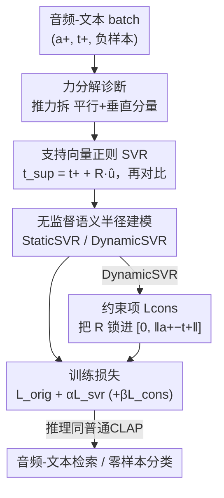

# SupCLAP: Controlling Optimization Trajectory Drift in Audio-Text Contrastive Learning with Support Vector Regularization

**会议**: ICLR 2026  
**OpenReview**: [https://openreview.net/forum?id=S1CW6PLsqS](https://openreview.net/forum?id=S1CW6PLsqS)  
**代码**: 无  
**领域**: 音频语音 / 多模态对比学习  
**关键词**: CLAP, 对比学习, 优化轨迹漂移, 支持向量正则化, 语义半径

## 一句话总结
本文把对比学习的梯度拆成"拉力"和"推力"，发现负样本推力中垂直于拉力的分量虽含丰富信息但不受控、会导致优化轨迹漂移，于是提出支持向量正则化（SVR）：构造一个朝正样本偏移的文本支持向量，用语义半径 $R$ 自适应压制这个垂直分量，在不加任何推理开销的前提下让 InfoNCE / SigLIP 在音频-文本检索和零样本分类上都涨点。

## 研究背景与动机
**领域现状**：CLAP（Contrastive Language-Audio Pretraining）通过把配对的音频-文本拉近、不配对的推远，学一个统一的音频-文本嵌入空间，是跨模态检索乃至多模态大模型的底座。主流训练目标是基于 InfoNCE 的对称对比损失。

**现有痛点**：标准 InfoNCE 训出来的表征远非理想——音频事件的时序对齐差、多语言对齐不一致。作者把视角切到优化过程本身，发现一个被普遍忽视的现象：**优化轨迹漂移**。把对比学习看成正样本"拉力" $F_\text{pull}$ 和负样本"推力" $F_\text{push}$ 的博弈，作者证明推力一般**不与拉力共线**，于是推力可分解为平行分量 $f_{\|}$ 和垂直分量 $f_{\perp}$。平行分量只影响收敛速度、信息和拉力重复；垂直分量则携带了负样本独有的补充信息，但它的幅度**不受任何约束**。

**核心矛盾**：这个垂直分量是把双刃剑——方向上有用（区分负样本的额外信号），但幅度失控就会持续把文本嵌入推离"理想直线轨迹"。作者进一步把它拆成两层：**全局垂直分量**（即便看到全数据集负样本，其合力方向也几乎不会和某个正样本的拉力共线，造成系统性偏移）和**局部垂直分量**（mini-batch 每步只采到负样本的随机子集，方向和幅度每步剧烈抖动，造成高频震荡）。两者叠加既拖慢收敛，又限制最终对齐精度。

**本文目标**：在**保留**垂直分量信息的同时**压制**它失控的幅度，而且不能引入额外训练数据或推理开销。

**切入角度**：既然问题出在"垂直分量幅度不可控"，那能不能用一个辅助正则项，定向地、只缩放这个垂直分量、而不动平行分量？

**核心 idea**：构造一个把原文本嵌入沿"拉力方向"偏移了语义半径 $R$ 的**文本支持向量** $t_\text{sup}$，让它和音频再做一次对比，由此在梯度上给垂直分量乘上一个可控的收缩因子 $(1-\frac{R}{\|a^+-t^+\|})$，实现"留信息、抑漂移"。

## 方法详解

### 整体框架
SupCLAP 在标准对称 CLAP 训练目标 $L_\text{orig}$（text-to-audio 与 audio-to-text 两个 InfoNCE 项之和）之上，加一个支持向量正则项 $L_\text{svr}$，总目标为 $L_\text{SupCLAP}=L_\text{orig}+\alpha L_\text{svr}$。SVR 的做法是：取拉力单位方向 $\hat{u}=\frac{a^+-t^+}{\|a^+-t^+\|}$，把文本嵌入沿它偏移得到支持向量 $t_\text{sup}=t^+ + R\hat{u}$，再让 $t_\text{sup}$ 和音频嵌入做一遍对比损失。这一项的梯度恰好只缩放负样本推力的垂直分量，从而控制漂移。整个 SVR 的成败系于语义半径 $R$，由于数据集没有 $R$ 的监督信号，作者把它建成一个无监督问题，给出 StaticSVR（全局可学标量）和 DynamicSVR（逐样本预测）两种建模，并为 DynamicSVR 配一个约束项保证 $R$ 落在合理区间。**推理阶段和普通 CLAP 完全一样**——只靠排序音频-文本嵌入相似度，不需要计算任何支持向量，所以零额外推理开销。

### 关键设计

**1. 力分解诊断：把"训不好"归因到推力的垂直分量**

这是全文的诊断起点，也是后续所有设计的依据。对 text-to-audio 的 InfoNCE，对文本嵌入 $t^+$ 求梯度可得 $\nabla_t L_\text{orig}=\frac{1}{\tau}\big[(P^+-1)a^+ + \sum_j P^-_j a^-_j\big]$，其中 $P^+,P^-_j$ 是 softmax 概率。第一项 $F_\text{pull}=\frac{1}{\tau}(P^+-1)a^+$ 因 $P^+-1<0$、在梯度下降下等价于把 $t^+$ 拉向正音频 $a^+$；第二项 $F_\text{push}=\frac{1}{\tau}\sum_j P^-_j a^-_j$ 是所有负样本的加权平均、把 $t^+$ 推开。关键观察是：单个负样本推力 $f_{\text{push},j}=\frac{P^-_j}{\tau}a^-_j$ 沿拉力方向 $\hat{u}$ 分解为平行 $f_{\|,j}=(f_{\text{push},j}\cdot\hat{u})\hat{u}$ 和垂直 $f_{\perp,j}=f_{\text{push},j}(I-\hat{u}\hat{u}^\top)$ 两部分。平行分量和拉力同向、只改变收敛速度、不带新信息；**垂直分量才是负样本独有信息的载体，但它幅度不受控**，全局上造成系统性偏移、局部上（mini-batch 随机性）造成高频震荡。作者用"更新向量与拉力向量的余弦相似度"度量漂移（相似度越高漂移越小），实验证实 InfoNCE 确实存在显著漂移。把矛头精确指向"垂直分量幅度失控"，正则项才有的放矢。

**2. 支持向量正则化 SVR：用一个辅助对比项定向收缩垂直分量**

针对设计 1 诊断出的痛点，SVR 不去碰拉力、也不粗暴砍掉推力，而是构造文本支持向量 $t_\text{sup}=t^+ + R\hat{u}$——把文本嵌入沿拉力方向往正音频挪 $R$，然后加一项辅助对比损失 $L_\text{svr}=-\log\frac{\exp(s(t_\text{sup},a^+))}{\sum_j \exp(s(t_\text{sup},a^-_j))}$，总损失 $L_\text{SupCLAP}=L_\text{orig}+\alpha L_\text{svr}$。它为什么能定向起作用？作者推导出加入 SVR 后，第 $j$ 个负样本推力的平行分量变为 $\big(\frac{P^-_j}{\tau}+\alpha\frac{P^-_{\text{sup},j}}{\tau}\big)a^-_{\|,j}$、被原样保留，而垂直分量变为

$$F_{\perp,\text{push},j}=\Big(\frac{P^-_j}{\tau}+\alpha\frac{P^-_{\text{sup},j}}{\tau}\Big)\Big(1-\frac{R}{\|a^+-t^+\|}\Big)a^-_{\perp,j}.$$

关键就在这个**只乘在垂直分量上的收缩因子** $(1-\frac{R}{\|a^+-t^+\|})$：平行分量不被缩放、信息无损，垂直分量被按 $R$ 的大小选择性压制，$R$ 越大压得越狠。于是 SVR 在"留住负样本补充信息"和"抑制轨迹漂移"之间做到了可控权衡，而不是一刀切。实验上双向（a2t 与 t2a 都加）比单向更好。

**3. 无监督语义半径建模：StaticSVR 治全局漂移，DynamicSVR 治局部漂移**

收缩因子的强弱全看 $R$，但数据集没有 $R$ 的真值，于是作者把它当无监督建模问题，给出两条路、分别对应设计 1 里的两层漂移。**StaticSVR** 把 $R$ 建成一个全局共享的可学标量，随其它参数一起优化以最小化 $L_\text{SupCLAP}$——它对应压制**全局**垂直分量，优点是简单稳定，缺点是"所有样本共用一个常数半径"过于理想，无法适配不同音频-文本对的对齐难度差异。**DynamicSVR** 则上一个轻量 3 层 MLP 预测器 $f_\theta:\mathbb{R}^N\to\mathbb{R}$，输入是局部相似度向量 $S=[s(t^+,a^+),s(t^+,a^-_1),\dots,s(t^+,a^-_{N-1})]$、输出实例级半径 $R=f_\theta(S)$——它对应压制**局部**垂直分量，因为 $S$ 刻画了当前 mini-batch 的局部几何（比如和某个负样本相似度高就意味着漂移风险大），预测器据此给出定制半径。代价是它的效果高度依赖 $R$ 的预测精度，数据噪声或弱预训练模型下预测不准时，反而可能不如更简单的 StaticSVR。

**4. DynamicSVR 的约束项 $L_\text{cons}$：把预测半径锁进合理区间**

DynamicSVR 的预测器若不加约束会有两种失效：一是**幅度过大**，$R\gg\|a^+-t^+\|$ 使收缩因子变负、垂直分量方向被反转，负样本信息反被破坏、训练不稳；二是**方向相反**，预测器输出 $R<0$ 使因子大于 1，反而放大垂直分量、加剧漂移。作者用一个铰链式约束项同时堵住两头：

$$L_\text{cons}=\mathrm{ReLU}(R-\|a^+-t^+\|)+\mathrm{ReLU}(-R).$$

前一项惩罚 $R$ 超过 $\|a^+-t^+\|$ 防止过冲，后一项惩罚 $R<0$ 鼓励半径与拉力同向；总损失变为 $L_\text{orig}+\alpha L_\text{svr}+\beta L_\text{cons}$，默认 $\beta=0.01$ 只施加轻微惩罚、把 $R$ 限制在 $[0,\|a^+-t^+\|]$ 这个合理区间而不喧宾夺主。消融显示加约束后 DynamicSVR 的半径建模更准、效果进一步提升。

### 损失函数 / 训练策略
最终目标为 $L_\text{SupCLAP-Cons}=L_\text{orig}+\alpha L_\text{svr}+\beta L_\text{cons}$，默认 $\alpha=1$、$\beta=0.01$。音频编码器用 CED-Base，文本编码器用多语言 SONAR-TE，半径预测器是 3 层 MLP。所有模型从预训练权重初始化、在单张 H800 上训 10 epoch，Adam、学习率 $5\times10^{-5}$、batch size 24、温度 $\tau=0.07$；选测试集 recall 最高的 checkpoint 评估。SVR 不需要额外数据、推理零开销，训练开销可忽略。

## 实验关键数据

### 主实验
在 AudioCaps 和 Clotho 上做单语音频-文本检索（R@1 / R@10）。SVR 同时给 InfoNCE 和 SigLIP 两个基线涨点，bi-DynamicSVR 最强：

| 数据集/方向 | 指标 | InfoNCE | +bi-StaticSVR | +bi-DynamicSVR |
|------|------|------|------|------|
| AudioCaps T2A | R@1 | 41.87 | 43.89 | **44.16** |
| AudioCaps A2T | R@1 | 56.72 | 57.77 | **59.66** |
| AudioCaps A2T | R@10 | 92.33 | 92.75 | **93.49** |
| Clotho T2A | R@1 | 18.67 | 19.50 | **19.75** |
| Clotho A2T | R@1 | 22.61 | 24.93 | **25.31** |

对 SigLIP 基线同样有效（AudioCaps T2A R@1：36.74 → 42.54 → 43.09）。零样本分类上 bi-DynamicSVR 也最佳：ESC-50 89.6→92.1、US8K 81.63→83.74、VGGSound 24.57→25.11。作者还指出 InfoNCE 整体优于 SigLIP，因为 Softmax 竞争机制在含大量难负样本的音频数据上提供了更强的判别梯度。

### 消融实验
AudioCaps 单语 T2A / A2T 检索上拆解 SVR 各组件（R@1）：

| ID | 配置 | T2A R@1 | A2T R@1 | 说明 |
|------|------|------|------|------|
| 0 | InfoNCE | 41.87 | 56.72 | 基线 |
| 1 | bi-DynamicSVR | **44.16** | **59.66** | 完整模型 |
| 2 | bi-DynamicSVR w/o constraints | 44.01 | 59.24 | 去约束项掉点 |
| 3 | uni-DynamicSVR | 43.63 | 58.51 | 单向 |
| 5 | bi-StaticSVR | 43.89 | 57.77 | 全局半径 |
| 6 | uni-StaticSVR | 43.28 | 57.56 | 单向+全局 |

### 关键发现
- **双向 > 单向、Dynamic > Static、有约束 > 无约束**：三个维度叠加，bi-DynamicSVR（带约束）最优；单向 SVR 已超基线，双向进一步放大增益。
- **约束项确有用**：去掉 $L_\text{cons}$（ID 2）相比完整模型在 T2A/A2T 上都掉点，印证约束能提升半径预测精度。
- **语义半径随训练递减**：StaticSVR 和 DynamicSVR 的 $R$ 都随 epoch 下降，说明无监督建模学到了"压制垂直分量"与"保留负样本信息"的权衡；StaticSVR 曲线更平滑（全局稳定），DynamicSVR 因逐 batch 局部建模而波动更大。
- **超参与开销**：$\alpha=1$ 最佳，不同 batch size 下 SVR 都能提升；额外训练时间和显存开销可忽略，推理零开销。

## 亮点与洞察
- **从优化动力学而非数据/架构入手**：大多数 CLAP 改进在堆数据或换编码器，本文回到梯度本身，把"训不好"归因到一个可解析的几何量——推力垂直分量，诊断清晰、改法精准。
- **"留信息 + 抑漂移"的可控权衡**：收缩因子 $(1-\frac{R}{\|a^+-t^+\|})$ 只作用在垂直分量、平行分量无损，这种"定向缩放"比直接削弱推力或加噪声优雅得多，且物理意义明确。
- **支持向量的构造很巧**：把文本嵌入沿拉力方向平移 $R$ 再做对比，等价于在梯度层面引入可调收缩，几乎零成本（推理时根本不算 $t_\text{sup}$），这种"训练时正则、推理时透明"的设计很值得迁移到其它对比学习场景（如 CLIP 图文）。
- **全局/局部两层漂移对应两种半径建模**：把问题分层后，StaticSVR 治全局、DynamicSVR 治局部，理论与方法一一对应，逻辑自洽。

## 局限与展望
- **增益偏温和**：多数指标提升在 1-3 个点量级，且未与最强的 Cacophony 等专门方法在同一训练设定下全面比较（主表里 Cacophony 的 A2T R@1 仍高于本文若干配置），SVR 更像一个通用即插即用正则而非 SOTA 刷榜利器。
- **DynamicSVR 依赖预测精度**：作者自己承认噪声数据或弱预训练模型下 DynamicSVR 可能不如 StaticSVR，预测器的鲁棒性是隐患。
- **理论基于若干简化假设**：推导假设所有嵌入 L2 归一化、用缩放余弦相似度，垂直分量分析也在单向 SVR 下展开，实际多模态分布更复杂，结论的紧致性有待更广验证。
- **只在音频-文本上验证**：方法本身与模态无关，但能否在图文（CLIP）、视频-文本等大规模对比学习上同样涨点尚未给出，是自然的扩展方向。

## 相关工作与启发
- **vs InfoNCE**：本文不替换 InfoNCE，而是在其上加 SVR 正则；InfoNCE 提供主对齐信号，SVR 专门收拾它遗留的垂直分量漂移问题，二者互补。
- **vs SigLIP**：SigLIP 用 sigmoid 成对损失避开 softmax 归一化，本文实验显示在含大量难负样本的音频数据上 InfoNCE 的 softmax 竞争机制反而判别更强；SVR 对两者都能加成，说明漂移问题是对比学习的共性而非某个损失独有。
- **vs 标准 CLAP / 大数据路线**：CompA-CLAP、LAION-CLAP、Cacophony 等多靠更大数据或更强编码器提升，本文走"优化过程正则化"的正交路线，零额外数据、零推理开销，可与这些方法叠加。

## 评分
- 新颖性: ⭐⭐⭐⭐ 从力分解视角提出"优化轨迹漂移"并给出可解析的收缩因子，角度新颖、机理清楚。
- 实验充分度: ⭐⭐⭐⭐ 覆盖检索+分类、单语+多语、双向/动态/约束的完整消融，但与最强专用方法的同设定对比略欠。
- 写作质量: ⭐⭐⭐⭐ 理论推导和动机串联流畅，全局/局部分层讲得清楚。
- 价值: ⭐⭐⭐⭐ 即插即用、零推理开销的通用对比学习正则，易迁移到 CLIP 等场景，实用价值高。

<!-- RELATED:START -->

## 相关论文

- [\[ECCV 2024\] CoLeaF: A Contrastive-Collaborative Learning Framework for Weakly Supervised Audio-Visual Video Parsing](../../ECCV2024/audio_speech/coleaf_a_contrastive-collaborative_learning_framework_for_weakly_supervised_audi.md)
- [\[ICLR 2026\] PACE: Pretrained Audio Continual Learning](pace_pretrained_audio_continual_learning.md)
- [\[ICLR 2026\] AVERE: Improving Audiovisual Emotion Reasoning with Preference Optimization](avere_improving_audiovisual_emotion_reasoning_with_preference_optimization.md)
- [\[ACL 2026\] Data-efficient Targeted Token-level Preference Optimization for LLM-based Text-to-Speech](../../ACL2026/audio_speech/data-efficient_targeted_token-level_preference_optimization_for_llm-based_text-t.md)
- [\[ICLR 2026\] Physics-Informed Audio-Geometry-Grid Representation Learning for Universal Sound Source Localization](physics-informed_audio-geometry-grid_representation_learning_for_universal_sound.md)

<!-- RELATED:END -->
