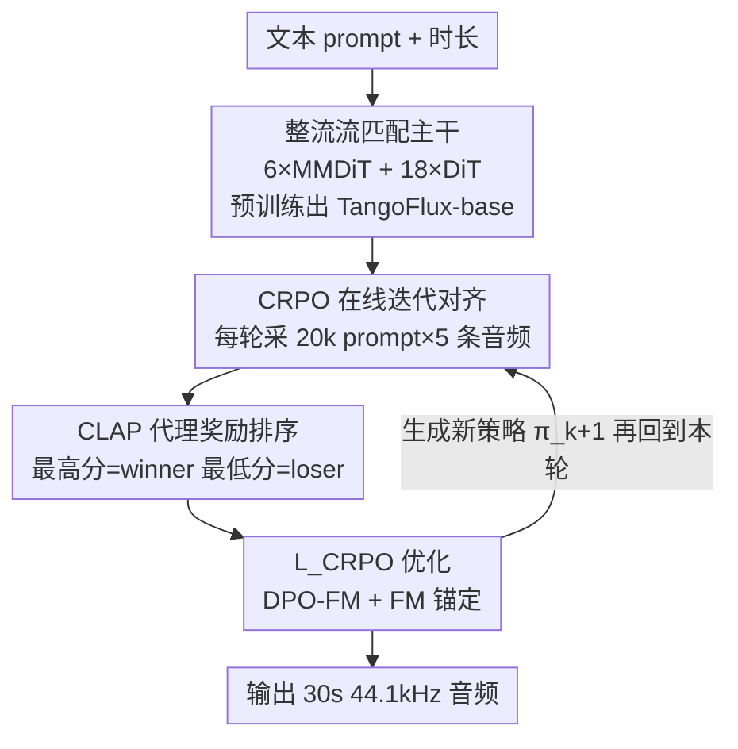

# TangoFlux: 用流匹配与 CLAP 排序偏好优化实现超快且忠实的文本到音频生成

**会议**: ICLR 2026  
**OpenReview**: [https://openreview.net/forum?id=qgNs5NmQB7](https://openreview.net/forum?id=qgNs5NmQB7)  
**代码**: https://tangoflux.github.io/ (有，含生成样例)  
**领域**: 音频生成 / 文本到音频 / 流匹配 / 偏好优化  
**关键词**: 文本到音频、整流流匹配、偏好优化、CLAP、在线自迭代对齐

## 一句话总结
TangoFlux 用一个 515M 参数的整流流匹配（rectified flow matching）模型，在 A40 上 3.7 秒就能生成 30 秒 44.1kHz 音频；并提出 CRPO——用 CLAP 作代理奖励、每轮在线生成自己的偏好对来做对齐，让小模型在客观与主观指标上都拿到文本到音频生成的 SOTA。

## 研究背景与动机

**领域现状**：文本到音频（TTA）生成近年进展很快，能直接从文字描述生成音效、配乐、播客等音频内容。主流路线大多基于扩散模型（如 Tango、AudioLDM 2、Stable Audio Open），靠多步去噪逐渐把噪声还原成音频。

**现有痛点**：扩散类 TTA 有两个老大难。其一是**慢**——为了出一段像样的音频往往需要上百步去噪，AudioLDM 2-large 推理一次要 24.8 秒，Tango 2 要 22.8 秒，计算开销大。其二是**不忠实**——模型经常抓不全复杂 prompt 里的细节，尤其是包含多个事件、事件之间有时序关系的描述（如"鸟叫之后打雷"），结果要么漏掉某个事件、要么把事件顺序搞错，甚至凭空生成 prompt 里没提到的"幻觉"音频。

**核心矛盾**：要把模型"对齐"到人类偏好（生成更忠实的音频），自然想到用 RLHF/DPO 这类偏好优化。但 TTA 域有个结构性缺口：**做偏好对太难**。LLM 对齐有现成的奖励模型、人类反馈数据或可验证的标准答案，而音频域既没有靠谱的现成音频奖励模型，人工标注（如 BATON 让标注员给每条音频打 0/1 标签）又贵到难以规模化；音频语言模型给的反馈则太嘈杂，不适合直接拿来构造偏好对。

**本文目标**：（1）造一个又快、又小、还忠实的开源 TTA 模型；（2）解决"偏好对从哪来"这个对齐的卡点。

**切入角度**：作者注意到 CLAP 这种文本-音频联合嵌入模型，能算文本与音频的余弦相似度——这恰好可以当作一个"音频和描述对不对得上"的代理奖励信号。既然没有现成奖励模型，那就让模型**自己生成候选音频、用 CLAP 排序、自己造偏好对**，像自我改进算法一样一轮轮迭代。

**核心 idea**：用整流流匹配换掉多步扩散把生成做快，再用 CLAP 排序的在线偏好优化（CRPO）让模型自迭代地把自己对齐得越来越忠实。

## 方法详解

### 整体框架

TangoFlux 的主干是 FluxTransformer（6 个 MMDiT 块 + 18 个 DiT 块），在一个冻结的 Stable Audio Open VAE 的潜空间里，学一条从高斯噪声到目标音频潜表示的**整流流轨迹**；条件包括 FLAN-T5 文本编码和一个时长嵌入（控制 30 秒固定长潜空间里有多少是真音频、多少是静音）。

整个训练分两大阶段。**阶段一·预训练**：在 WavCaps + AudioCaps 上用流匹配损失 $\mathcal{L}_{\text{FM}}$ 训出基座 TangoFlux-base。**阶段二·CRPO 在线迭代对齐**：把 base 当作初始策略 $\pi_0$，然后反复做一个三步循环——采样生成、CLAP 排序造偏好对、用 $\mathcal{L}_{\text{CRPO}}$ 把 $\pi_k$ 微调成 $\pi_{k+1}$。关键是每轮迭代开始时都**重新在线生成**新的合成数据，而不是反复啃同一批静态数据。

### 关键设计

**1. 整流流匹配 + 混合 MMDiT/DiT 主干：把"忠实生成"和"快"同时拿下**

针对扩散类 TTA 又慢又对噪声调度敏感的痛点，TangoFlux 改用**整流流（rectified flow）**作为生成框架。流匹配通过学一个随时间变化的向量场，把简单先验分布（高斯）映射到复杂目标分布；相比扩散对噪声调度器选择很敏感，流匹配更鲁棒。而整流流进一步把这条路径取成**从噪声到分布的直线**（最短路径），推理时只需从 $\tilde{x}_0\sim\mathcal{N}(0,I)$ 出发、用 Euler 解算器按模型预测的速度场 $u(\cdot;\theta)$ 逐步积分即可。直线路径让所需步数大幅减少，TangoFlux 只用 50 步、3.7 秒就能出 30 秒音频，而扩散基线动辄上百步、二十多秒。

主干借鉴图像生成里 FLUX 的成功经验，用**混合架构**：MMDiT 块（多模态扩散 Transformer）表现强，但把一部分简化成单流 DiT 块能提升可扩展性和参数效率，于是定为 6 个 MMDiT + 18 个 DiT，每块 8 个注意力头、宽 128、总宽 1024，合计 515M 参数——比 Tango 2（866M）、AudioX（1.1B）小不少却更强。

**2. CRPO 在线迭代对齐：让模型自己造偏好数据、一轮轮自我改进**

这一设计直击"音频偏好对难造"的核心矛盾。以往做法（Tango 2 的 Audio-Alpaca、BATON）都依赖**静态**偏好数据集——一次造好就固定不变，这会限制对齐的泛化性和适应性。CRPO 反其道而行，采用**动态在线**策略：每轮迭代开始时用当前策略 $\pi_k$ 现场生成全新的合成偏好对。具体地，从 45k AudioCaps prompt 库里随机采 20k 个 prompt，每个 prompt 用 $\pi_k$ 生成 5 条音频，再用 CLAP 排序构造 20k 个偏好对 $\mathcal{D}_k=\{(x_i^w, x_i^l, y_i)\}$，然后把 $\pi_k$ 微调成 $\pi_{k+1}$，循环往复。

这个"生成自己的训练数据→对齐→再生成"的回路本质上是一个**自我改进算法**，灵感来自 STaR、Self-Rewarding LLM 等 LLM 对齐工作，但作者强调两点区别：对齐的是整流流而非自回归语言模型；且音频域没有现成奖励模型，得靠 CLAP 顶上。实验（图 2）证明在线生成是关键：如果反复用同一批离线数据迭代，CLAPscore 在第二轮后就开始掉、KLpasst 飙升、IS 下降，到最后一轮还不如第一轮；而每轮在线换新数据则能让 CLAPscore 一路涨到第 4 轮、KLpasst 稳定下降。作者把离线退化归因于**奖励过优化**——参考模型在 DPO 里起正则作用，反复用同一数据更新会破坏这个正则。

**3. CLAP 作代理奖励模型：用文本-音频相似度替代缺失的音频奖励器**

既然音频域没有像 LLM 那样的现成奖励模型，CRPO 的可行性全压在"CLAP 能不能当奖励"上。CLAP 是文本-音频联合嵌入模型，其奖励分定义为**文本嵌入与音频嵌入的余弦相似度**——相似度越高，说明音频越贴合描述。CRPO 用它给每个 prompt 的 5 条候选音频打分排序，选最高分的当 winner $x_i^w$、最低分的当 loser $x_i^l$，从而把"哪条音频更忠实"这个判断自动化。作者在附录里验证了用 CLAP 做 best-of-N 选择确实能提升客观指标，佐证它是个合理的代理奖励。这一步把昂贵的人工标注（BATON）替换成了零成本、可规模化的自动排序，是整个自迭代回路能跑起来的前提。

**4. $\mathcal{L}_{\text{CRPO}}$ 损失：给 DPO-FM 加一项流匹配锚，防止"赢家也变差"的过优化**

把 DPO 搬到整流流上会遇到一个隐患。DPO 优化的是 winner 相对 loser 的**相对**似然，理论上即便两者绝对似然都下降、只要拉大 margin 就能降低损失。作者把 DPO-Diffusion 损失通过 $\epsilon_\theta$ 与速度场 $u(\cdot;\theta)$ 的等价关系改写成流匹配版 $\mathcal{L}_{\text{DPO-FM}}$（含 winning loss、losing loss 及对应的 reference loss 四项，见原文式 (2)）。问题在于：$\mathcal{L}_{\text{DPO-FM}}$ 同样可能靠"赢家和输家的损失都增大、只要 margin 拉大"来被最小化——也就是说 winner 的生成质量本身可能在退化。

为此 CRPO 在目标里**直接补上 winner 的流匹配损失**作为锚：

$$\mathcal{L}_{\text{CRPO}} := \mathcal{L}_{\text{DPO-FM}} + \mathcal{L}_{\text{FM}}$$

其中 $\mathcal{L}_{\text{FM}}$ 是在 winning 音频上算的流匹配损失。它把模型钉在高质量 winner 的属性上，防止单靠 DPO 导致 winner 的语义和结构保真度漂移、输出偏离目标分布。实验（图 3、图 4）显示：虽然两种损失的 winning/losing loss 都随迭代上升，但 $\mathcal{L}_{\text{CRPO}}$ 在 CLAPscore 上更优，起到了稳定训练、保住赢家质量的正则作用。

### 损失函数 / 训练策略
预训练在 WavCaps 上跑 80 epoch，AdamW（$\beta_1=0.9$, $\beta_2=0.95$），最大学习率 $5\times10^{-4}$；对齐阶段同样用 AdamW，总 batch size 48，最大学习率 $10^{-5}$。训练数据约 40 万条 WavCaps + 4.5 万条 AudioCaps，全部开源数据；不足 30 秒的音频补静音、超过的中心裁剪到 30 秒，单声道复制成伪立体声以适配 VAE。推理用 CFG scale 4.5、50 步。

## 实验关键数据

### 主实验

AudioCaps 测试集（886 样本）客观对比，TangoFlux 在几乎所有客观指标上超过此前所有基线（除了 Tango 2 在 KLpasst 和 FDP 上更好——作者归因于 FDP 在 16kHz 下要把 TangoFlux 的高频细节降采样掉）：

| 模型 | 参数量 | 时长 | 步数 | FDopenl3 ↓ | KLpasst ↓ | CLAPscore ↑ | IS ↑ | 推理时间(s) |
|--------|--------|------|------|-----------|-----------|-------------|------|-----------|
| AudioLDM 2-large | 712M | 10s | 200 | 108.3 | 1.81 | 0.419 | 7.9 | 24.8 |
| Tango 2 | 866M | 10s | 200 | 108.4 | 1.11 | 0.447 | 9.0 | 22.8 |
| Stable Audio Open | 1056M | 47s | 100 | 89.2 | 2.58 | 0.291 | 9.9 | 8.6 |
| AudioX | 1.1B | 10s | 250 | 77.6 | 1.56 | 0.380 | 10.0 | 9.6 |
| GenAU-Full-L | 1.25B | 10s | 100 | 93.2 | 1.37 | 0.447 | 12.0 | 5.3 |
| TangoFlux-base | 516M | 30s | 50 | 80.2 | 1.22 | 0.431 | 11.7 | **3.7** |
| **TangoFlux** | 516M | 30s | 50 | **75.1** | 1.15 | **0.480** | **12.2** | **3.7** |

参数量只有竞品的一半甚至更少，推理却最快（3.7s），CLAPscore（忠实度）最高。主观人评（50 个 OOD 挑战 prompt）上 TangoFlux 也全面领先：OVL z-score 0.2486、REL z-score 0.6919，Elo 分别 1501/1628，均排第一；REL 的平均排名 1.1、众数 1，说明在"和 prompt 对得上"这点上优势尤其明显。

### 消融实验

CRPO vs 静态偏好数据集（都在 TangoFlux-base 上做一轮对齐）：

| 配置 | FDopenl3 ↓ | CLAPscore ↑ | KLpasst ↓ | OVL Elo | REL Elo |
|------|-----------|-------------|-----------|---------|---------|
| TangoFlux（多轮 CRPO） | **75.1** | **0.480** | **1.15** | **1546** | **1520** |
| TangoFlux-crpo-1（CRPO 单轮） | 79.1 | 0.453 | 1.18 | 1446 | 1467 |
| TangoFlux-alpaca（Audio-Alpaca 静态） | 80.0 | 0.448 | 1.20 | 1428 | 1366 |
| TangoFlux-baton（BATON 静态） | 80.5 | 0.437 | 1.20 | 1253 | 1392 |
| TangoFlux-base（未对齐） | 80.2 | 0.431 | 1.22 | 1325 | 1253 |

### 关键发现
- **在线迭代是 CRPO 的命门**：离线（反复用同一批数据）在第 2 轮后就因奖励过优化退化，CLAPscore 下降、KLpasst 上升、IS 下降；在线每轮换新数据则持续改进到第 4 轮。
- **CRPO > 静态数据集**：单轮 CRPO 就已优于 Audio-Alpaca 和 BATON，多轮迭代（完整 TangoFlux）又显著优于单轮，证明自迭代过程本身有增益。
- **$\mathcal{L}_{\text{CRPO}}$ 的 FM 锚有效**：$\mathcal{L}_{\text{DPO-FM}}$ 单用会出现"赢家损失也增大"的过优化苗头；加上 winning 的 $\mathcal{L}_{\text{FM}}$ 后 CLAPscore 更优、训练更稳。

## 亮点与洞察
- **把"自我改进"从 LLM 搬到音频生成**：CRPO 的"生成自己的偏好数据→对齐→再生成"回路，本质是把 STaR/Self-Rewarding 那套自迭代思想迁移到整流流上，且巧妙地用 CLAP 补上了音频域缺失的奖励模型这块拼图。
- **小而快还更强**：515M 参数、50 步、3.7 秒，却在客观+主观上压过 1B 级别的扩散模型，说明整流流 + 偏好对齐这条路在 TTA 上性价比很高。
- **可迁移的 trick**：给 DPO 加一项"赢家"的生成损失作锚（$\mathcal{L}_{\text{DPO-FM}}+\mathcal{L}_{\text{FM}}$）以抑制相对似然优化下的绝对质量漂移，这个思路对任何用 DPO 做生成模型对齐的任务都有借鉴意义。

## 局限与展望
- **依赖 CLAP 的判别能力**：整个偏好对的质量取决于 CLAP 能否真把"更忠实"的音频排在前面，CLAP 自身的偏差/盲区会直接传导进对齐结果。
- **在线生成成本**：每轮迭代要采 20k prompt × 5 条音频并排序，虽然推理快，但累计的生成+排序开销仍不小。
- **迭代有上限**：在线 CRPO 也只持续提升到第 4 轮左右，之后增益趋缓，说明自迭代并非可以无限刷分。
- **评测局限**：受资源限制，作者未能对所有模型做人评；主观评测仅 50 个 prompt，样本规模有限。

## 相关工作与启发
- **vs Tango 2 / Audio-Alpaca**: Tango 2 通过 prompt 扰动一次性造好**静态**偏好集再做 DPO；TangoFlux 的 CRPO 则**在线动态**地每轮重新生成偏好对，实验证明这避免了静态数据导致的过优化退化，且单轮就已超过 Audio-Alpaca。
- **vs BATON**: BATON 靠人工给音频打 0/1 二值标签造偏好对，贵且难规模化；CRPO 用 CLAP 自动排序替代人工，零标注成本即可大规模生成偏好数据。
- **vs 扩散类 TTA（AudioLDM 2 / Stable Audio Open）**: 它们靠多步去噪、对噪声调度敏感且慢；TangoFlux 用整流流的直线最短路径把步数和时间砍到 50 步/3.7s，同时更忠实。

## 评分
- 新颖性: ⭐⭐⭐⭐⭐ 首次把 CLAP 代理奖励 + 在线自迭代偏好优化用到整流流音频生成，并给出 DPO-FM 过优化的解法。
- 实验充分度: ⭐⭐⭐⭐⭐ 客观五指标 + 主观 z-score/Elo + 在线vs离线/CRPO损失多组消融，论证扎实。
- 写作质量: ⭐⭐⭐⭐ 方法与动机讲得清楚，公式与设计动机对应明确。
- 价值: ⭐⭐⭐⭐⭐ 开源、小而快还 SOTA，且 CRPO 框架对其他生成模型对齐有迁移价值。

<!-- RELATED:START -->

## 相关论文

- [\[ICLR 2026\] AVERE: Improving Audiovisual Emotion Reasoning with Preference Optimization](avere_improving_audiovisual_emotion_reasoning_with_preference_optimization.md)
- [\[ICLR 2026\] SupCLAP: Controlling Optimization Trajectory Drift in Audio-Text Contrastive Learning with Support Vector Regularization](supclap_controlling_optimization_trajectory_drift_in_audio-text_contrastive_lear.md)
- [\[ICLR 2026\] UniSS: Unified Expressive Speech-to-Speech Translation with Your Voice](uniss_unified_expressive_speech-to-speech_translation_with_your_voice.md)
- [\[ICLR 2026\] VibeVoice: Expressive Podcast Generation with Next-Token Diffusion](vibevoice_expressive_podcast_generation_with_next-token_diffusion.md)
- [\[ICLR 2026\] TripleSumm: Adaptive Triple-Modality Fusion for Video Summarization](triplesumm_adaptive_triple-modality_fusion_for_video_summarization.md)

<!-- RELATED:END -->
