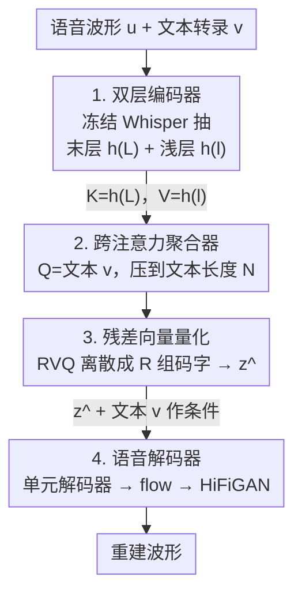

# TASTE: Text-Aligned Speech Tokenization and Embedding for Spoken Language Modeling

**会议**: ICLR 2026  
**arXiv**: [2504.07053](https://arxiv.org/abs/2504.07053)  
**代码**: [GitHub](https://mtkresearch.github.io/TASTE-SpokenLM.github.io)  
**领域**: LLM预训练  
**关键词**: speech tokenization, spoken language model, text-speech alignment, joint modeling, speech reconstruction

## 一句话总结

提出 TASTE（Text-Aligned Speech Tokenization and Embedding），通过跨注意力机制将语音 token 与文本转录对齐，实现极低比特率（~150 bps）下的高质量语音重建，并使文本-语音联合建模变得直接高效，1.3B 参数的 TASLM 超越 7B 预训练 SLM。

## 研究背景与动机

口语语言模型（Spoken Language Model, SLM）的核心挑战在于语音 token 化。现有方法存在两大问题：

**长度不匹配**：语音 token 序列通常比对应文本长 10-50 倍（典型 50 Hz vs ~3 Hz），导致联合建模困难

**信息冗余**：现有语音 token（SSL 量化或 codec）独立于文本提取，不可避免地与文本 token 编码重叠信息

常见的缓解策略包括：
- token 交错（Spirit LM）
- 填充同步序列长度（Moshi, MiniOmni）
- 额外对齐训练阶段

这些方案都增加了复杂性，且本质上是在 token 化之后补救。

TASTE 的核心思想是：**在 token 化阶段就解决对齐问题**。语音 token 应该：
1. 避免冗余编码文本内容（已由文本 token 携带），专注于副语言信息
2. 与文本 token 一一对应，使联合建模无需启发式规则或显式对齐

## 方法详解

### 整体框架

TASTE 想解决的核心矛盾是：语音 token 序列通常比对应文本长 10–50 倍，让文本-语音联合建模举步维艰，而过去的做法都是在 token 化之后再去补齐长度。TASTE 反过来在 token 化阶段就根治——让语音 token 的数量从一开始就跟文本 token 一一对应。

整套系统分成两半。前半是**文本对齐语音 tokenizer**：先用一个冻结的 Whisper 编码器从语音里同时抽出"对齐线索"和"声学细节"两层表征，再用一个**跨注意力聚合器**以文本转录 $\mathbf{v}$ 为查询，把高频语音表征压缩到与文本等长，最后用**残差向量量化**把这串连续向量离散成可建模的 token。后半是**语音解码器**：它吃下量化后的语音 token 和文本 token，把波形重建回来。因为长度对齐和"语义归文本、副语言归语音 token"的分工在 token 化阶段就定好了，下游的联合语言模型不再需要任何交错或填充技巧。

### 关键设计

**1. 双层编码器：把对齐线索和声学细节分开取**

Tokenizer 的第一部件是一个冻结的 Whisper ASR 编码器。痛点在于：单取编码器某一层的输出，要么对齐能力强但丢了声学细节，要么反过来。TASTE 的做法是从不同深度同时抽两层隐藏表征——最后层 $\mathbf{h}^{(L)}$ 经过完整 ASR 通路、富含语音与文本的对齐线索（其注意力权重矩阵甚至可当软词对齐图用），浅层 $\mathbf{h}^{(l)}$（取前半部分的层）则保留了更多支撑高质量重建的声学细节。一层负责"对得齐"、一层负责"听得清"，这正是下一步聚合器能各取所需的前提。

**2. 跨注意力聚合器：用文本转录当查询，自然压到文本长度**

这是 TASTE 的核心创新，直接化解了语音比文本长 10–50 倍这一痛点。聚合器是一个跨注意力，三个角色的分工是：

$$Q = \mathbf{v}\ (\text{文本转录}), \quad K = \mathbf{h}^{(L)}\ (\text{末层}), \quad V = \mathbf{h}^{(l)}\ (\text{浅层})$$

直觉是用末层的对齐线索当 Key 去引导注意力分配，从浅层 Value 里聚合声学信息，而输出长度跟随作为 Query 的文本转录。于是输出 $\mathbf{z}\in\mathbb{R}^{N\times d_z}$ 的长度天然就等于文本 token 数 $N$，把约 50 Hz 的语音序列直接降到约 3 Hz，无需任何启发式对齐或填充。K/V 分离让对齐先验和声学内容各司其职——这也是消融里"浅层作 Value（0.88）明显优于仅用末层（0.78）"的来源。

**3. 残差向量量化：把对齐后的连续向量离散成可建模 token**

聚合器输出的还是连续向量 $\mathbf{z}$，要喂给语言模型就得离散化。TASTE 用残差向量量化（RVQ）做粗到细的逐层量化，得到 $R$ 组码字与重构向量：

$$\mathbf{q}, \hat{\mathbf{z}} = \text{Quantizer}(\mathbf{z}), \quad \mathbf{q} = [\mathbf{q}^{(1)}, \ldots, \mathbf{q}^{(R)}], \quad \hat{\mathbf{z}} = \sum_{r=1}^R \hat{\mathbf{z}}^{(r)}$$

这里取 $R=4$ 层 RVQ、码本大小 512、码本维度 256。码字序列和重构向量 $\hat{\mathbf{z}}$ 都保持文本对齐、长度仍为 $N$。关键洞察是：文本已经携带了绝大部分语义内容，量化器只需编码词级的副语言"残差"（时长、语调等），因此即使比特率压到 ~150 bps（同类方法常需上千 bps），量化后的重建准确率仍远高于 text-only 基线（0.76 vs 0.65）。

**4. 语音解码器：以文本和语音 token 为条件还原波形**

解码端由单元解码器和声码器两部分组成。一个 Transformer 单元解码器吃下重构向量 $\hat{\mathbf{z}}$ 和文本 token $\mathbf{v}$，自回归预测语音单元 $\mathbf{y}=\text{UnitDecoder}(\hat{\mathbf{z}}, \mathbf{v})$，再接 flow model 与 HiFiGAN 合成最终波形。文本 token 在这里一并作为条件输入，保证了"语义内容由文本承载、副语言信息由语音 token 补充"的分工在解码时仍然成立。

### 损失函数 / 训练策略

Tokenizer 的训练目标是重建损失与量化损失之和 $\mathcal{L}_{\text{taste}} = \mathcal{L}_{\text{ce}} + \mathcal{L}_{\text{rvq}}$。其中重建项是单元解码器在目标语音单元上的自回归交叉熵

$$\mathcal{L}_{\text{ce}}(\theta) = \frac{1}{|T'|} \sum_{t=1}^{T'} -\log p_\theta(y_t^{\text{target}} \mid \hat{\mathbf{z}}, \mathbf{v}; \mathbf{y}_{<t}^{\text{target}})$$

量化项是 RVQ 各层的承诺损失

$$\mathcal{L}_{\text{rvq}}(\theta) = \sum_{r=1}^R \|\mathbf{z}^{(r)} - \hat{\mathbf{z}}^{(r)}\|$$

在此之上做文本-语音联合语言模型训练时有两种变体：Token 模式 $\text{TASLM}_{\text{token}}$ 用多头预测，同时预测下一个文本 token 和 $R$ 层 RVQ codes；Embedding 模式 $\text{TASLM}_{\text{emb}}$ 则预测连续嵌入的 $\mu_i, \sigma_i$，并加上正则化与 KL 散度损失。两种变体都只用 LoRA 微调基座 LLM，因此 1.3B 的 TASLM 才能在如此低的训练成本下超越 7B 全参数训练的基线。

## 实验关键数据

### 主实验

**语音重建质量**（LibriSpeech test-clean）：

| 方法 | 频率 | 比特率 | WER↓ | UTMOS | DNSMOS | ViSQOL | 时长一致性 | 说话人相似 | MUSHRA |
|------|------|--------|------|-------|--------|--------|-----------|-----------|--------|
| Encodec (75Hz, 2RVQ) | 75 | 3000 | 2.6% | 2.35 | 3.48 | 3.81 | 0.96 | 0.78 | 25.6 |
| SpeechTokenizer (2RVQ) | 50 | 2000 | 3.0% | 3.56 | 3.60 | 3.65 | 0.97 | 0.80 | 53.9 |
| Mimi | 12.5 | 1000 | 3.1% | 3.60 | 3.60 | 3.62 | 0.96 | 0.82 | 67.6 |
| S3 token (topline) | 25 | 600 | 3.0% | 4.18 | 3.90 | 3.30 | 0.96 | 0.82 | 70.2 |
| Text-only (baseline) | ~3 | ~50 | 5.9% | 4.31 | 4.11 | 2.44 | 0.57 | 0.78 | 42.6 |
| **TASTE** | **~3** | **~150** | **4.4%** | **4.29** | **4.10** | 3.05 | **0.91** | 0.80 | **68.3** |

TASTE 在**最低频率和比特率**下实现了与高比特率方法可比甚至更优的质量。

**口语语言模型性能**（语音续写 + 似然评估）：

| 方法 | 参数量 | GPT-4o | UTMOS | 人类MOS | SALMON | StoryCloze | Overall |
|------|--------|--------|-------|---------|--------|-----------|---------|
| TWIST 7B | 7B | 1.44 | 3.27 | 2.04 | 63.4 | 64.7 | 64.1 |
| Spirit LM 7B | 7B | 2.79 | 3.41 | 2.38 | 59.1 | 72.0 | 65.6 |
| Spirit LM Expr. 7B | 7B | 1.90 | 3.40 | 2.41 | 69.0 | 66.2 | 67.6 |
| **TASLM 1B (token)** | **45M/1.3B** | **3.08** | **4.07** | **3.93** | 60.8 | **76.5** | **68.7** |
| **TASLM 1B (embed.)** | **45M/1.3B** | **3.16** | **4.22** | **4.16** | 57.7 | 76.7 | 67.2 |

1.3B TASLM 仅用 LoRA 微调，在续写评估上**全面超越 7B 级别的预训练 SLM**。

### 消融实验

**Tokenizer 模块消融**（S3 token top-5 重建准确率）：

| 模块 | 频率 | 准确率 |
|------|------|--------|
| Encoder only | 50Hz | 0.98 |
| Encoder + Aggregator | ~3Hz | 0.88 |
| Encoder + Agg + Quantizer | ~3Hz | 0.76 |
| Encoder (仅最后层) | 50Hz | 0.84 |
| Encoder + Agg (仅最后层) | ~3Hz | 0.78 |
| Text-only | ~3Hz | 0.65 |

关键发现：
- 聚合器将频率从 50Hz 降到 ~3Hz，准确率仅下降 0.10
- 使用浅层表征作为 Value（0.88）优于仅用最后层（0.78）
- 量化后仍远高于 text-only 基线（0.76 vs 0.65）

### 关键发现

1. **文本对齐 token 化的核心价值**：直接用 S3 token 进行联合建模效果极差（即使重建质量更好），证明 token 化设计对联合建模的重要性超越重建质量本身
2. **TASTE 使联合建模"直截了当"**：无需交错、填充、延迟解码等技巧，一一对应即可
3. **TASTE 支持文本对齐语音编辑**：交换两个相同转录的话语的 TASTE token，对应词的副语言特征（如时长、语调）被精确交换
4. **Few-shot 语音问答能力**：TASLM 是唯一展现 few-shot 语音 QA 能力的预训练 SLM
5. **TASLM 是唯一保持甚至超越基座文本 LLM 性能的 SLM**

## 亮点与洞察

1. **设计理念优雅**：不是在联合建模阶段修补长度不匹配，而是在 token 化阶段根治，体现了"正确抽象层级解决正确问题"的工程哲学
2. **K/V 分离设计精妙**：用最后层作 Key 提供对齐先验，用浅层作 Value 提供声学信息，两者各司其职
3. **极低比特率**（~150 bps vs 典型 1000+ bps）说明文本已携带绝大部分信息，语音 token 只需编码"残差"副语言信息
4. **LoRA 即可有效**：无需全参数训练，1.3B 模型即超越 7B 全参数训练基线
5. **语音编辑实验**直接验证了 TASTE token 确实编码的是词级副语言信息而非语义内容

## 局限性

1. 仅在英语数据上验证，多语言泛化未知
2. 缺乏对话轮转和指令跟随能力
3. 仅处理单说话人含词汇内容的语音，多说话人、重叠语音、非词汇事件未覆盖
4. 依赖 ASR 质量——ASR 错误会级联传播到 TASTE token
5. token 化方案专为联合 SLM 设计，对纯语音生成任务（如 TTS）的适用性未探索

## 相关工作与启发

- 与 Moshi（Défossez et al., 2024）的比较：Moshi 训练自有 codec 以降低频率，TASTE 更根本地通过文本对齐实现
- 与 Spirit LM（Nguyen et al., 2025）的交错策略相比，TASTE 的一一对应更加自然
- 启发：联合 token 化的思想可推广到其他多模态场景（如视频+文本、音乐+乐谱）
- 浅层+深层分离的信息架构在其他 Transformer 编码器中可能也有价值

## 评分

- **创新性**: ⭐⭐⭐⭐⭐ — 首个端到端文本对齐语音 token 化方案，从 token 化层面解决联合建模问题
- **实验充分性**: ⭐⭐⭐⭐ — 重建+语言模型+编辑+QA 多维评估，消融完整
- **实用性**: ⭐⭐⭐⭐ — 代码和模型开源，LoRA 即可使用，但依赖 ASR
- **写作质量**: ⭐⭐⭐⭐ — 结构清晰，动机阐述充分
- **综合评分**: ⭐⭐⭐⭐⭐ (4.5/5)

<!-- RELATED:START -->

## 相关论文

- [\[ICLR 2026\] ParaS2S: Benchmarking and Aligning Spoken Language Models for Paralinguistic-Aware Speech-to-Speech Interaction](paras2s_benchmarking_and_aligning_spoken_language_models_for_paralinguistic-awar.md)
- [\[ICLR 2026\] MambaVoiceCloning: Efficient and Expressive Text-to-Speech via State-Space Modeling and Diffusion Control](mambavoicecloning_efficient_and_expressive_text-to-speech_via_state-space_modeli.md)
- [\[ICLR 2026\] MMSU: A Massive Multi-task Spoken Language Understanding and Reasoning Benchmark](mmsu_a_massive_multi-task_spoken_language_understanding_and_reasoning_benchmark.md)
- [\[ICLR 2026\] Stitch: Simultaneous Thinking and Talking with Chunked Reasoning for Spoken Language Models](stitch_simultaneous_thinking_and_talking_with_chunked_reasoning_for_spoken_langu.md)
- [\[ICLR 2026\] Incentive-Aligned Multi-Source LLM Summaries](incentive-aligned_multi-source_llm_summaries.md)

<!-- RELATED:END -->
