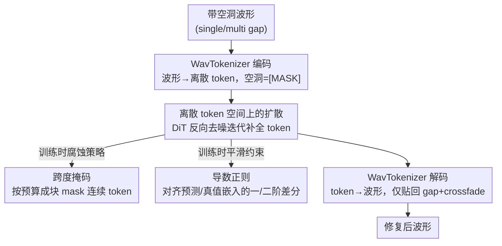

# Token-based Audio Inpainting via Discrete Diffusion

**会议**: ICLR 2026  
**OpenReview**: [https://openreview.net/forum?id=9ZogqiyWXm](https://openreview.net/forum?id=9ZogqiyWXm)  
**代码**: https://github.com/iftachShoham/AIDD  
**领域**: 音频语音 / 扩散模型 / 音频修复  
**关键词**: 音频 inpainting、离散扩散、音频 tokenizer、跨度掩码、平滑正则

## 一句话总结
本文提出 AIDD，把音频先用预训练 tokenizer（WavTokenizer）压成离散 token 序列，再在这个离散 token 空间上做吸收态扩散（discrete diffusion）来填补缺失片段，配合跨度掩码与导数平滑正则两项训练改进，在 MusicNet / MAESTRO 上对 150–750 ms 的中长 gap 比强扩散基线（CQT-Diff+ 等）更稳、失真更低，且模型更小、推理更快。

## 研究背景与动机

**领域现状**：音频 inpainting（修复录音中缺失/损坏片段）是经典的逆问题。早期靠自回归、稀疏表示、线性预测等信号建模方法，只在很短的 gap（< 100 ms）且局部平稳假设下管用。近年深度生成模型接管了这个任务：VAE、GAN（GACELA、bin2bin），尤其是扩散模型（DiffWave 在波形上、CQT-Diff+/MAID 在 CQT/频谱上）凭借迭代去噪和强生成先验，把可修复的 gap 推到了几百毫秒。

**现有痛点**：这些方法在长 gap 上都各有软肋。波形级扩散（DiffWave）跑在原始采样率上，要捕捉长程结构需要极大的感受野；频谱/CQT 方法（MAID、CQT-Diff+）依赖相位重建，gap 一长就容易丢失跨区域的连贯性；VAE 能保住局部连续性，但 gap 越长语义一致性越差。本质上，**连续音频表示里"细粒度时间细节"和"高层结构"很难同时照顾好**。

**核心矛盾**：连续域扩散对实数做平滑插值，gap 大了就缺乏高层语义约束，越填越"糊"或越跑偏。

**本文目标**：找到一种表示，既能压掉高维波形的冗余、又能保留语义结构，让模型在长 gap 上依然填得稳、填得连贯。

**切入角度**：作者观察到离散扩散（discrete diffusion）在自然语言生成上已经很能打——它把 token 当作类别变量做"掩码/替换"式扩散，天然适合"序列补全"这类任务。如果把音频也变成离散 token，inpainting 就转化成一个**离散序列补全**问题，可以借语言里成熟的离散扩散机制。

**核心 idea**：用预训练音频 tokenizer 把波形量化成紧凑 token 序列，然后**完全在离散 token 空间里做吸收态扩散**来补全缺失 token，再解码回波形——这是首个把离散扩散用于（音乐）音频 inpainting 的工作。

## 方法详解

### 整体框架
AIDD 把音频 inpainting 重写成"离散 token 序列补全"：输入是带有静音空洞（single 或 multiple gap）的波形，输出是把空洞处填好的完整波形。整条管线分三段——**编码（WavTokenizer Encoder 把波形量化成离散 token，空洞处对应 [MASK]）→ 离散扩散补全（DiT 通过反向扩散迭代预测被 mask 的 token）→ 解码（WavTokenizer Decoder 把补好的 token 还原成波形，且只把修复段贴回原 gap，边界做 10 ms crossfade）**。核心创新集中在中间那段离散扩散，以及为它定制的两项训练手段：跨度掩码（span masking）改造前向腐蚀过程，导数正则（derivative loss）约束预测 token 的时序平滑。

推理时只在 gap 处替换、保留完好区域不重编码；训练时则在随机 timestep 用跨度掩码腐蚀 token 序列，让 DiT 用 DWDSE 目标 + 导数正则学着把腐蚀序列还原。

### 关键设计

**1. 离散 token 空间上的吸收态扩散：把 inpainting 变成 token 补全**

针对"连续域扩散在长 gap 上丢高层结构"这个痛点，AIDD 干脆离开连续域。它先用预训练的 **WavTokenizer**（单 quantizer、码本约 4k）把高分辨率波形压成紧凑的离散 token 序列（训练时截到固定 300 token ≈ 4 秒），在极致压缩下仍保留高保真重建和丰富语义；空洞片段自然对应一串 [MASK] token。补全引擎是一个 **DiT**（Diffusion Transformer，encoder-only transformer + 时间条件 + 旋转位置编码 RoPE），跑在离散 token 上。

扩散过程用的是**吸收态（absorbing）离散扩散**：前向过程中每个 token 要么以概率 $e^{-\bar\sigma(t)}$ 保持不变，要么以概率 $1-e^{-\bar\sigma(t)}$ 被替换成终止态 [MASK]，其中 $\bar\sigma(t)=\int_0^t \sigma(s)\,ds$ 是累积噪声。反向过程要估计的是 concrete-score $s_\theta(x,t)\approx [p_t(y)/p_t(x)]$，用 DWDSE（Diffusion Weighted Denoising Score Entropy）目标训练。这样做的好处是：token 空间维度低、带语义，模型不必硬啃原始波形或频谱的相位，长程语义一致性自然更好——这也是它在中长 gap 上反超 CQT-Diff+ 的根本原因。

**2. 跨度掩码（span-based masking）：让腐蚀过程贴近"成块缺失"的真实场景**

朴素的离散扩散（如 SEDD/Lou et al.）在前向过程里对每个 token **独立**采样是否 mask，腐蚀出来是零散的孔洞；可真实的音频 gap 是**一整段连续缺失**。训练腐蚀和推理任务不匹配，模型就没学好"补一整块"。AIDD 改成结构化的跨度掩码：在每个 timestep 先定一个预算 $B(t)=\big(1-e^{-\bar\sigma(t)}\big)\cdot L$（期望要腐蚀掉的 token 数，$L$ 为序列长），然后**迭代地采样连续跨度**直到填满预算，一个 timestep 内可以产生多个不相连的 mask 段。

每段长度按几何分布采样 $\ell\sim \mathrm{Geo}(p_\sigma)$，其中 $p_\sigma=\dfrac{p_0}{1+\alpha\sigma}$——基参数 $p_0$ 与缩放因子 $\alpha$ 控制跨度长度随噪声水平 $\sigma$ 的变化：**早期 timestep（噪声小）偏向短跨度做细粒度局部腐蚀，后期偏向长跨度做更大范围的语义扰动**，跨度上限 $\ell_{max}$（实验取 30）封顶；每段起点在 $[1, L-\ell]$ 上均匀采。这种"从局部到语义"的渐进腐蚀，让前向过程的腐蚀比例与扩散诱导的转移概率对齐，也让模型在训练里反复见到"成块缺失"，从而更擅长真实 inpainting。

**3. 导数正则损失（derivative-based regularization）：约束补出来的 token 时序平滑**

DWDSE 只保证 score 学对了被 mask token 的转移比率，但它**不约束相邻位置预测 token 嵌入之间的时序连续性**，补出来的片段可能出现不自然的局部抖动。AIDD 加了一项导数正则，直接在嵌入空间约束 token 轨迹的平滑度。设位置 $i$ 的真值嵌入为 $e_i$、预测嵌入为 $\hat e_i$，定义一阶差分 $\Delta_1 e_i=e_{i+1}-e_i$ 与二阶差分（捕捉局部曲率）$\Delta_2 e_i=e_{i+1}-2e_i+e_{i-1}$，正则项对齐 mask 位置上预测与真值的差分：

$$\mathcal{L}_{deriv}=\frac{1}{|M|}\sum_{i\in M}\big\|\Delta_k\hat e_i-\Delta_k e_i\big\|^2,\quad k\in\{1,2\}$$

其中 $M$ 是涉及 mask token（及其邻居）的索引集合。总目标是 $\mathcal{L}_{total}=\mathcal{L}_{DWDSE}+\lambda\,\mathcal{L}_{deriv}$，$\lambda>0$ 调平衡（实验 $\lambda$ 取 200–800）。它惩罚预测嵌入里不规则的局部波动，鼓励反向过程重建出"尊重自然音频 token 轨迹固有平滑性"的序列，让填充段在感知上更自然连贯。

### 损失函数 / 训练策略
总损失 $\mathcal{L}_{total}=\mathcal{L}_{DWDSE}+\lambda\,\mathcal{L}_{deriv}$。训练时波形先 tokenize 截到 300 token（≈4 s），随机选 timestep 按跨度掩码腐蚀，DiT 学着预测 concrete score。优化器 AdamW（学习率 $10^{-6}$），batch size 128；MusicNet 上 base 模型（仅 DWDSE）训 400k 步（单卡 A6000，约两天），其他变体 100k 步；MAESTRO 训 150k 步（约 24 h）。

## 实验关键数据

### 主实验
MusicNet 上对比 LPC、A-SPAIN-L、CQT-Diff+（≤300 ms 的 SOTA）；指标 FAD↓ / LSD↓ / ODG↑（ODG：0 最好、-4 最差）。

| 数据集 / gap | 指标 | AIDD | CQT-Diff+ | 说明 |
|--------------|------|------|-----------|------|
| MusicNet 300 ms | FAD ↓ | **3.549** | 4.652 | 长 gap 下 FAD 降约 25% |
| MusicNet 300 ms | LSD ↓ | **0.297** | 0.324 | 失真更低 |
| MusicNet 300 ms | ODG ↑ | **-3.284** | -3.711 | 感知质量明显更好 |
| MusicNet 150 ms | FAD ↓ | 1.866 | **1.525** | 短 gap CQT-Diff+ 的 FAD 略优 |
| MusicNet 150 ms | ODG ↑ | **-3.215** | -3.559 | 但 AIDD 的 ODG/LSD 仍更好 |

MAESTRO（ODG PEA-Q，单 gap）：AIDD 在 375 ms / 750 ms 分别为 **-2.303 / -2.596**，全面优于 GACELA(-3.232/-3.318)、bin2bin(-2.892/-3.039)、bin2bin-MIDI(-2.800/-2.976)。主观 MOS（MAESTRO）AIDD 3.64 > GACELA/CQT-Diff+ 的 3.51（Original 4.12）。

效率上 AIDD（WavTokenizer）约 90M（编码侧 81M）、训练 1 天、平均推理 5.25 s；CQT-Diff+ 242M、训 4 天、推理 12.54 s——更小更快。

### 消融实验
MusicNet 上拆解三种训练策略（base DWDSE / 跨度掩码 / 导数正则 / 组合），取 200 ms、300 ms：

| 配置 | 200 ms FAD ↓ | 300 ms FAD ↓ | 说明 |
|------|--------------|--------------|------|
| Base（仅 DWDSE） | 2.802 | 4.015 | 无两项改进 |
| + 跨度掩码（$p_0{=}0.6,\alpha{=}0.5$） | 2.438 | 3.573 | 单加 span 即大幅降 FAD |
| + 导数正则（$\lambda{=}200,\Delta_1e$） | 2.455 | 3.439 | 单加 deriv 同样有效 |
| 组合（$\lambda{=}500,p_0{=}0.8,\alpha{=}0.5,\Delta_1e$） | **2.391** | 3.549 | 组合整体最佳 |

tokenizer 对比（MAESTRO，Table 5）：WavTokenizer 全面优于 UniCodec（如 375 ms FAD 0.042 vs 0.12、ODG -2.303 vs -2.753）。作者推测 UniCodec 码本（~16k）相对模型太大，WavTokenizer（~4k）反而更合适、过渡更平滑。

### 关键发现
- 两项改进**各自单独**都能把 FAD 从 base 明显拉低，组合后整体最稳——说明跨度掩码（解决训练/推理腐蚀不匹配）和导数正则（解决时序抖动）是互补的。
- gap 越长，AIDD 相对 CQT-Diff+ 的优势越大（300 ms FAD 降约 25%）；短 gap（150 ms）CQT-Diff+ 的 FAD 略好，但 AIDD 的 ODG/LSD 仍占优——离散扩散的语义先验在长 gap 上价值更高。
- tokenizer 是上限：码本大小要和模型容量匹配，盲目换"更高音质"的大码本反而掉点。
- AIDD 是所有对比方法里**唯一不要求固定输入长度**的。

## 亮点与洞察
- **把音频 inpainting 重写成离散序列补全**：借 WavTokenizer 把波形变 token，直接搬来语言领域成熟的吸收态离散扩散，绕开了波形/频谱相位重建的老大难——这个"换表示换战场"的思路很干净。
- **跨度掩码让训练腐蚀贴近真实任务**：朴素离散扩散独立 mask 出零散孔洞，与"成块缺失"的真实 gap 不符；按预算迭代采连续跨度、并让跨度长度随噪声从短到长，是个可迁移到其它"成块缺失"补全任务的小而有效的 trick。
- **导数正则是即插即用的平滑约束**：在嵌入空间对齐一/二阶差分，几乎零额外结构成本就压住了填充段的时序抖动，可直接迁移到其它离散扩散生成任务。
- 更小的模型 + 更短训练却在中长 gap 上反超 SOTA，说明"选对表示空间"比"堆模型规模"更关键。

## 局限与展望
- **受限于 tokenizer 质量与带宽**：性能上限被底层 codec 卡住；AIDD 继承 WavTokenizer 的 24 kHz 带宽，高采样率录音要降采样、输出也限于 24 kHz，可能损失保真度。
- **跨域比较有偏**：AIDD 生成离散 token，基线生成波形/频谱，重建带宽与预处理的差异会引入偏差，作者呼吁建立横跨 token/latent/连续模型的统一 benchmark。
- **训练-推理 mismatch**：训练用跨度掩码腐蚀、推理面对真实 gap，二者分布仍可能不完全一致（作者在 Discussion 中点到）。
- 评测集中在古典/钢琴音乐（MusicNet、MAESTRO），对人声、复杂混音、强非平稳音频的泛化未充分验证。

## 相关工作与启发
- **vs CQT-Diff+（连续域 CQT 扩散，≤300 ms SOTA）**：它在 CQT 频谱上做连续扩散、依赖相位重建，长 gap 易失连贯；AIDD 在离散 token 上做扩散，中长 gap 失真更低、模型更小更快，短 gap FAD 略逊。
- **vs DiffSound（离散扩散于量化频谱 token）**：同为离散扩散，但 DiffSound 作用于量化频谱 token；AIDD 直接用单 quantizer 的 WavTokenizer 波形 token，并定制跨度掩码 + 导数正则面向 inpainting。
- **vs GACELA / bin2bin（GAN 系长 gap inpainting）**：GAN 靠多尺度判别器或 pix2pix + STFT/MIDI loss；AIDD 用扩散生成先验，MAESTRO 上 ODG/MOS 更优，且不需固定输入长度。
- **vs SEDD（Lou et al. 离散扩散）**：AIDD 沿用其 DWDSE 与 concrete-score 框架，但把独立 mask 改成跨度掩码、并加导数正则，把通用离散扩散适配到音频 inpainting。

## 评分
- 新颖性: ⭐⭐⭐⭐⭐ 首个把离散扩散用于（音乐）音频 inpainting，表示空间选择有洞见
- 实验充分度: ⭐⭐⭐⭐ 双数据集 + 客观/主观 + 消融 + tokenizer/延迟分析较完整，但任务集中在古典/钢琴
- 写作质量: ⭐⭐⭐⭐ 动机清晰、公式与图齐全，个别表述略冗
- 价值: ⭐⭐⭐⭐ 中长 gap 修复更稳更省，且给离散扩散训练提供了可迁移的两项改进

<!-- RELATED:START -->

## 相关论文

- [\[ICLR 2026\] VibeVoice: Expressive Podcast Generation with Next-Token Diffusion](vibevoice_expressive_podcast_generation_with_next-token_diffusion.md)
- [\[ICLR 2026\] Efficient Audio-Visual Speech Separation with Discrete Lip Semantics and Multi-Scale Global-Local Attention](efficient_audio-visual_speech_separation_with_discrete_lip_semantics_and_multi-s.md)
- [\[ICLR 2026\] Scaling Speech Tokenizers with Diffusion Autoencoders](scaling_speech_tokenizers_with_diffusion_autoencoders.md)
- [\[ICLR 2026\] Hierarchical Semantic-Acoustic Modeling via Semi-Discrete Residual Representations for Expressive End-to-End Speech Synthesis](hierarchical_semantic-acoustic_modeling_via_semi-discrete_residual_representatio.md)
- [\[ICLR 2026\] The Devil behind the Mask: An Emergent Safety Vulnerability of Diffusion LLMs](the_devil_behind_the_mask_an_emergent_safety_vulnerability_of_diffusion_llms.md)

<!-- RELATED:END -->
