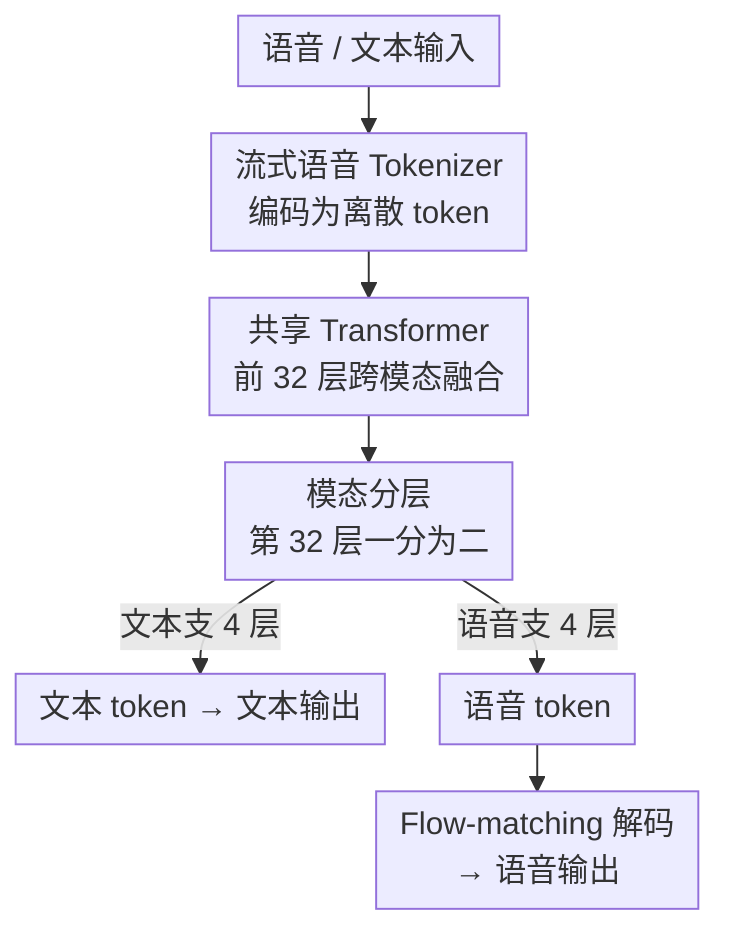

# Towards True Speech-to-Speech Models Without Text Guidance

**会议**: ICLR 2026  
**OpenReview**: [https://openreview.net/forum?id=zjaV5zmlkl](https://openreview.net/forum?id=zjaV5zmlkl)  
**代码**: 待开源（作者声明将释放 code 与 models）  
**领域**: 语音对话 / 语音大模型 / 多模态对齐  
**关键词**: 语音到语音、端到端语音 LLM、模态分层、冻结预训练、流式 tokenizer

## 一句话总结
本文提出一个**真正的语音到语音大模型**：它从预训练文本 LLM（Qwen3-8B）出发，靠"模态分层（modality-based layer split）+ 冻结预训练（frozen pre-training）"两招，在不依赖任何中间文本的情况下直接听懂并说出语音，语音问答上达到 SOTA，同时把扩展新模态时常见的文本能力退化几乎补回来。

## 研究背景与动机
**领域现状**：口语对话系统目前主流是两类。一类是级联管线（ASR → 文本 LLM → TTS），先转文字、再让文本模型回答、再合成语音；另一类是近期的端到端"文本引导"语音模型（SpeechGPT、Moshi、GLM-4-Voice 等），它们直接吃语音输入，但**生成时仍以文本为中介**——边生成文本边生成语音。

**现有痛点**：级联管线把原始语音里的副语言信息（语气、重音、情绪）在转文字那一步全丢了，而且只能说出"能被文字忠实表示"的内容。文本引导的端到端模型虽然保住了语音输入端的副语言线索，但生成端依赖文本中介带来三个问题：增加延迟、降低效率、限制表达力——像笑声、迟疑这种非言语发声根本没有自然的文字对应。更关键的是，由于语音和文本模态本身存在鸿沟，现有方法往往**以牺牲文本能力为代价**换语音能力，例如 SpiritLM 加入语音建模后 MMLU 从 45.3 掉到 36.9。

**核心矛盾**：想要"真·语音到语音"（生成端也不靠文本），就必须把文本 LLM 里的推理与世界知识迁移到语音模态；但简单地把语音 token 塞进词表或全量联合训练，会让文本表征被语音训练冲垮，文本能力随之退化。即便是支持直接生语音的 GLM-4-Voice，其 direct 模式也明显弱于 text-guided 模式。

**本文目标**：造一个原生支持文本/语音双向输入输出的模型，既要让**直接语音生成**逼近文本引导的质量，又要**保住文本骨干**的推理与知识。

**切入角度**：作者对 speechgpt2-preview 做了一个关键观测——逐层比较同一句话的语音表征与文本表征的隐状态相似度，发现在 28 层模型里相似度在前 11 层稳步上升、中间 14 层波动趋稳、最后 3 层明显下降。也就是说语音与文本表征在中低层逐渐融合、却在顶层重新分叉。

**核心 idea**：既然顶层天然要分叉，就**顺势在靠近顶部的某层把网络劈成两支**——共享的底层负责跨模态融合，分叉后的语音支/文本支各自负责本模态生成；再配合"先冻结文本骨干、只训语音组件"的预训练策略，把文本能力的迁移和保留一起解决。

## 方法详解

### 整体框架
模型在一个 36 层自回归 Transformer（从 Qwen3-8B 初始化）上做改造。输入可以是语音也可以是文本；语音先经一个**流式单码本 tokenizer** 编码成离散 token，和文本 token 一起喂进前面的**共享 Transformer 层**做跨模态深度融合；走到第 32 层时做**模态分层**，隐状态被路由进两条平行的四层分支：一支继续预测文本 token，另一支预测语音 token；语音 token 最后由 flow-matching 解码器还原成波形输出。训练上分两步走：先用**冻结预训练**把语音模态注入又不破坏文本骨干，再用**合成 SFT 数据**做四种模态配对的监督微调，让一套模型统一处理文本/语音的单模态与跨模态交互。

### 关键设计

**1. 模态分层：顺着"顶层表征自然分叉"在第 32 层劈成双支**

针对"语音能力和文本能力互相打架、塞进同一套层会让文本退化"这个痛点，作者没有去扩词表或上 Depth Transformer，而是从一个表征层面的观测出发：同一句话的语音与文本隐状态相似度在中低层逐层升高（深度融合）、却在最后几层重新下降（开始为各自模态做专属生成）。既然顶层本就要"分家"，那就在 36 层网络的第 32 块插入模态分层——前 32 层作为共享主干承担跨模态融合，第 32 层之后把共享隐状态路由进两条平行的四层栈：一条预测文本 token，一条预测语音 token，两支都从同一个预训练文本骨干初始化。这种"先共享、后专精（split-then-specialize）"的好处是，绝大多数语言知识仍存在共享主干里，语音支只需学会把这些知识"用语音说出来"，从而把文本 LLM 的推理与世界知识原生地表达到语音模态，也让模型不再依赖大规模、知识密集的语音数据集。消融里这一点是涨幅来源之一：相比不分层直接把语音 token 塞进文本词表（NF–NoSplit），加上分层后语音建模和文本保持都更好。

**2. 冻结预训练：先锁死文本骨干只训语音，再小心解冻**

即便分了支，若一上来就全量联合训练，文本参数照样会被语音训练带偏。本文用两阶段预训练化解：**Stage 1** 冻结 Qwen3-8B 骨干的全部参数，只训新引入的语音相关组件——语音 token 嵌入、语音专属 Transformer 层、语音 LM head，用约一个 epoch 把语音参数初始化好、并和已有文本表征建立稳定对齐（AdamW + cosine，学习率 $4\times10^{-4}$，batch 2.2M tokens，上下文 14,336）。**Stage 2** 再解冻更大一部分做跨模态自适应，但因为解冻文本参数有退化风险，训练里掺入纯文本预训练数据（FineWeb-Edu / 中文 FineWeb-Edu V2.1，质量分 $\ge 3$）来护住语言能力，学习率降到 $6\times10^{-5}\!\to\!6\times10^{-6}$、batch 增到 2.8M。作者试了三种解冻配置——全解冻、只解冻共享层、从后往前逐层解冻——结果**三者差异很小**，最终默认用全解冻。消融显示冻结预训练带来的增益"substantial"，是比解冻策略更关键的一招：它让模型在学语音的同时把文本知识稳稳留住，对应正文里 MMLU/CMMLU 几乎不掉甚至更高的结果。

**3. 流式单码本语音 Tokenizer：语义优先、低码率、真流式**

要把文本知识迁到语音，token 必须"语义浓、码率低、能流式、还能高保真重建"。编码器上，作者不走纯重建目标（重建最优的 token 对 LLM 学习常常次优），而是仿 CosyVoice 2 用 **ASR 作为唯一训练目标**最大化语义含量，并在 GLM-4-Voice tokenizer 基础上把它从 block-causal 改成**完全因果**，从而支持真正的流式（而非 2 秒分块）；最终做到 12.5 Hz 帧率、175 BPS 的单码本表示。解码器沿用 CosyVoice 2 的 flow-matching 架构，但把 chunk size 压小以削减 chunk-attention 带来的时延，在几乎不损重建质量的前提下显著降延迟。评测里这套 tokenizer 在纯流式条件下 WER 10.80%，虽略高于 GLM-4-Voice 的 9.17%（后者是 2 秒分块、非纯流式），但明显优于 Mimi-8（14.45%）、CosyVoice 2（13.78%）等非流式 codec；解码端在更低帧率下英中两个 benchmark 的可懂度（WER）和音质（DNSMOS）都超过 CosyVoice 2，只在说话人相似度上有微小折损。

**4. 合成 SFT 数据 + 四模态配对：把文本 SFT 语料"翻译"成可朗读的多模态对话**

语音助手的高质量监督数据天然稀缺，作者用合成方式构建。先拿开源文本 SFT 数据，用 GPT-5 做**文本适配**：把数学式、表格、Markdown 这类"念不出来"的内容转成 TTS 友好形式，过滤掉无法朗读的样本（长代码、密集 LaTeX），同时缩短过长回答、纠正明显事实错误、给 TTS 标注合适的情绪语气。再用多套 TTS 做**语音合成**：用户角色用多种音色提升鲁棒性，助手角色固定单一音色建立稳定的"系统人格"，并用 MOSS-TTSD 增强对话多样性与风格可控性。最后用 SenseVoice-Small ASR 做**质量过滤**，丢掉 WER $\ge 0.2$ 的样本，最终得到 150 万+ 问答对（英文约 65 万、中文约 86 万）。微调时刻意覆盖**四种输入-输出模态配对**——语音问→语音答、语音问→文本答、文本问→语音答、文本问→文本答——配对由 system prompt 控制、底层内容保持一致，从而强化语音↔文本跨模态对齐，让一套模型统一胜任单模态与跨模态交互。

### 损失函数 / 训练策略
全流程为自回归语言建模目标（文本支预测文本 token、语音支预测语音 token）。预训练两阶段共享语音数据集：Stage 1 约 1 epoch、Stage 2 在同一语音数据上 2 epoch 并掺 0.1 epoch 纯文本数据；SFT 在合成多模态数据上训 2 epoch（AdamW + cosine，$1\times10^{-5}\!\to\!1\times10^{-6}$，batch 8，上下文 10,240，序列打包）。预训练语料规模约 400 万小时语音（从 900 万小时原始音频经 VAD 清洗），含播客来源的交错语音-文本数据与视频来源的无监督语音数据，并用 CosyVoice 2 把高质量文本语料合成成额外交错数据以补足语音语料的低知识密度。

## 实验关键数据

### 主实验

预训练模型在语音建模与文本保持上同时领先（StoryCloze 系列衡量语音续写、MMLU/CMMLU 衡量文本知识）：

| 模型 | tS.C. | sS.C. | zh-tS.C. | zh-sS.C. | MMLU | CMMLU |
|------|-------|-------|----------|----------|------|-------|
| Moshi | 83.60 | 62.70 | - | - | 49.8 | - |
| GLM-4-Voice | 82.90 | 62.40 | 83.27 | 69.10 | 57.49 | 54.39 |
| SpiritLM | 82.90 | 61.00 | - | - | 36.90 | - |
| **Ours** | **84.87** | **63.17** | **90.32** | **71.94** | **67.19** | **69.53** |

语音问答（SFT 后）上，本文在**不用文本引导**的情况下达到 SOTA，多数指标超过用了文本引导（∗ 标记）的 GLM-4-Voice：

| 模型 | LlamaQA S→S | TriviaQA S→S | WebQA S→S | UTMOS |
|------|-------------|--------------|-----------|-------|
| GLM-4-Voice∗（text-guided） | 65.67 | 43.20 | 38.34 | 4.25 |
| Moshi∗（text-guided） | 62.30 | 22.80 | 26.60 | - |
| **Ours（无文本引导）** | 63.67 | 28.80 | **36.71** | **4.37** |

注：S→S 为语音问→语音答；GLM-4-Voice∗ 的 S→S 结果是用文本引导得到的，本文是纯直接生成，故在 TriviaQA 上略低、但 WebQA 与音质 UTMOS 反超。

### 消融实验

| 配置 | 分支层 | sS.C. | zh-sS.C. | MMLU | CMMLU | 说明 |
|------|--------|-------|----------|------|-------|------|
| FP–Full | 4 | 63.12 | 72.10 | 66.50 | 69.15 | 冻结预训练 + 全解冻（默认） |
| FP–Shared | 4 | 63.50 | 72.69 | 67.26 | 69.27 | 只解冻共享层 |
| FP–Layerwise | 4 | 62.64 | 71.51 | 68.82 | 69.26 | 逐层从后往前解冻 |
| NF | 4 | 56.60 | 67.56 | 62.11 | 64.11 | 不冻结、直接全量训练 |
| NF–NoSplit | 0 | 55.80 | 67.02 | 60.97 | 63.73 | 无分层（语音 token 直入词表） |
| Qwen3-8B | - | - | - | 76.60 | 77.35 | 纯文本骨干上限 |

### 关键发现
- **模态分层与冻结预训练都不可少**：从 NF–NoSplit → NF（加分层）→ FP（再加冻结）逐级上升，语音与文本指标同步改善；冻结预训练带来的增益比分层更"实"。
- **解冻策略差异很小**：FP–Full / FP–Shared / FP–Layerwise 三者结果接近，所以作者图省事默认用全解冻——这说明真正起作用的是"先冻后解"这件事本身，而非解冻的细粒度调度。
- **文本能力几乎保住**：相比 Qwen3-8B 上限（MMLU 76.60 / CMMLU 77.35），本文 MMLU 67.19 / CMMLU 69.53，远好于 SpiritLM 这类加语音后 MMLU 暴跌到 36.9 的方案。
- **tokenizer 在流式约束下有竞争力**：纯流式 WER 10.80% 略逊 GLM-4-Voice 的 9.17%（非纯流式），但优于一众非流式 codec；解码端在更低帧率下可懂度与音质反超 CosyVoice 2。

## 亮点与洞察
- **用表征分析驱动架构决策**：先逐层量出"语音-文本相似度先升后降、顶层分叉"，再据此决定在第 32 层切分支。这种"先看模型内部发生了什么、再据此设计结构"的做法，比拍脑袋加模块更有说服力，也很容易迁移到其他多模态融合场景。
- **"split-then-specialize" 是个轻巧又通用的迁移范式**：共享底层做融合、顶层分支做模态专属生成，让大部分知识留在原骨干里，从而绕开"必须有大规模知识密集语音数据"的依赖——这套思路可推广到视觉、动作等其他模态的 LLM 扩展。
- **冻结预训练把"学新模态"和"不忘旧能力"解耦**：先锁骨干稳住文本、只训语音组件做对齐，再小心解冻，是对抗灾难性遗忘的实用配方，且实验证明解冻细节不敏感、工程上很友好。

## 局限与展望
- **依赖海量数据与重型合成管线**：约 400 万小时语音预训练、150 万+ 条 SFT 全靠 GPT-5 适配 + 多套 TTS 合成 + ASR 过滤堆出来，复现成本与数据获取门槛很高。
- **直接生成在部分任务仍落后文本引导**：如 TriviaQA S→S 仍低于用了文本引导的 GLM-4-Voice，说明"无文本中介"在知识密集型问答上还没完全追平。
- **分层位置较启发式**：第 32 层切分来自一次对 speechgpt2-preview 的观测，是否对所有骨干/层数都最优、切分点该如何自适应确定，论文未深入。
- **安全风险**：解码器可被滥用做声音克隆/仿冒，作者在伦理声明里也承认这点，未释放面向滥用优化的工具或数据。

## 相关工作与启发
- **vs 级联管线（ASR→LLM→TTS）**：级联在转文字那步丢掉副语言线索且只能说"可文字化"的内容；本文端到端直接建模语音，保住语气情绪与非言语发声。
- **vs 文本引导端到端（Moshi / GLM-4-Voice / SpeechGPT）**：它们生成时仍以文本为中介，带来延迟、效率与表达力限制，且 direct 模式弱于 text-guided；本文做到**生成端也无文本中介**，并在语音问答上达到 SOTA，缩小了 direct 与 text-guided 的差距。
- **vs SpiritLM**：SpiritLM 加语音后文本能力大幅退化（MMLU 45.3→36.9）；本文靠分层 + 冻结预训练把退化压到很小（MMLU 仍 67.19）。
- **vs CosyVoice 2 / GLM-4-Voice tokenizer**：复用了它们的 ASR 编码目标与 flow-matching 解码，但改成完全因果、压小 chunk 以支持真流式低延迟。

## 评分
- 新颖性: ⭐⭐⭐⭐ 用逐层表征分析推出"模态分层"+"冻结预训练"，是端到端语音 LLM 里少见的"无文本中介还保住文本能力"的清晰范式。
- 实验充分度: ⭐⭐⭐⭐ tokenizer、预训练、SFT、消融四块齐全，含解冻策略对比；但数据/算力规模极大，外部复现验证有限。
- 写作质量: ⭐⭐⭐⭐ 动机—观测—设计—验证链条顺，图 2 的相似度分析很有说服力。
- 价值: ⭐⭐⭐⭐ 为"真·语音到语音"基础模型提供了一条可落地的范式，且承诺开源 code 与 models。

<!-- RELATED:START -->

## 相关论文

- [\[ICLR 2026\] ParaS2S: Benchmarking and Aligning Spoken Language Models for Paralinguistic-Aware Speech-to-Speech Interaction](paras2s_benchmarking_and_aligning_spoken_language_models_for_paralinguistic-awar.md)
- [\[ICLR 2026\] Latent Speech-Text Transformer](latent_speech_text_transformer.md)
- [\[ICLR 2026\] Scalable Multilingual Multimodal Machine Translation with Speech-Text Fusion](scalable_multilingual_multimodal_machine_translation_with_speech-text_fusion.md)
- [\[ACL 2025\] Leveraging Unit Language Guidance to Advance Speech Modeling in Textless Speech-to-Speech Translation](../../ACL2025/audio_speech/leveraging_unit_language_guidance_to_advance_speech_modeling_in_textless_speech-.md)
- [\[ACL 2025\] Autoregressive Speech Synthesis without Vector Quantization](../../ACL2025/audio_speech/autoregressive_speech_synthesis_without_vq.md)

<!-- RELATED:END -->
