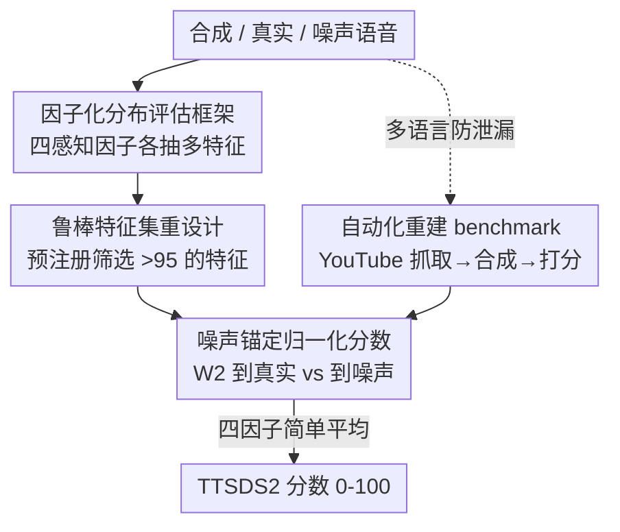

# TTSDS2: Resources and Benchmark for Evaluating Human-Quality Text to Speech Systems

**会议**: ICLR 2026  
**OpenReview**: [https://openreview.net/forum?id=uGai5lYHlV](https://openreview.net/forum?id=uGai5lYHlV)  
**代码**: https://github.com/ttsds/pipeline （有）  
**领域**: 语音合成 / TTS 评测  
**关键词**: TTS 评测, 分布相似度, Wasserstein 距离, 多语言 benchmark, 主观-客观相关性

## 一句话总结
针对现代 TTS 已逼近真人、传统 MOS/客观指标失效的问题，本文提出 TTSDS2——一个把语音切成四个感知因子、用 2-Wasserstein 距离衡量「合成分布离真实有多近、离噪声有多远」的无监督客观指标；它是 16 个对比指标里唯一在所有域、所有主观分上 Spearman 相关都 >0.5（平均 0.67）的指标，并配套发布了 1.1 万条主观评分、可防数据泄漏的多语言重建管线和覆盖 14 种语言的 benchmark。

## 研究背景与动机
**领域现状**：TTS 模型近年突飞猛进，合成语音常常已让人听不出与真人的差别，多个系统报告 MOS/CMOS 与真人持平甚至被听众更偏好。由于主观听测（MOS、CMOS、SMOS）昂贵又耗时，越来越多工作改用客观指标来评估。

**现有痛点**：主观指标在不同论文之间不可比——听众群体、问卷设计、样本各不相同，A 论文的 MOS 4.1 和 B 论文的 4.1 根本不是一回事。客观指标则很少拿主观分去验证：信号类指标（PESQ/STOI/MCD）是为电话/降噪场景设计的、需要逐句对齐的参考波形；MOS 预测网络（UTMOS 等）在域外相关性骤降；FAD 这类分布指标动辄要上千样本。更糟的是，当合成已逼近真人时，这些指标到底还能不能可靠预测「持续更新」的人类评分，没人验证过。

**核心矛盾**：评估的根本困难在于语音合成是**一对多**问题——同一段文本没有唯一正确的语音，因此「逐样本比对参考」的范式天然不成立。而单一隐空间的分布指标又对域、说话人、录音条件这些混杂因素敏感，换一个域相关性就崩。

**本文目标**：造一个既稳健（跨域、跨语言相关性都高）、又无需训练/调参、还能持续更新防泄漏的客观指标，并补齐这个方向最缺的公共资源（大规模主观评分、多语言 benchmark）。

**切入角度**：把评估重新框定为**分布相似度**问题——不比单句，而比合成语音的特征分布离真实分布有多近；同时引入「噪声」作为统一锚点，使分数对域/说话人不可知。作者还把评估**因子化**成 Generic/Speaker/Prosody/Intelligibility 四个感知维度，既提升鲁棒性又给出可解释的细分诊断。

**核心 idea**：用「到真实分布的 Wasserstein 距离 vs 到噪声分布的距离」之比，把每个感知因子的分布相似度归一化到 0–100，再对因子取简单平均——一个不依赖任何标注、靠多特征集成实现稳健的分布式 TTS 评测指标。

## 方法详解

### 整体框架
TTSDS2 的输入是一组合成语音（以及对应的真实参考语音和一组固定噪声参考），输出是一个 0–100 的标量分数（越高越接近真人）。它不做逐句比对，而是把「一整批合成语音的特征分布」和「真实语音的特征分布」「噪声分布」三者放在一起比较。整个计算分四步：先对语音抽取多种特征表示，这些特征被归到四个感知因子（Generic / Speaker / Prosody / Intelligibility）；每个特征都计算合成分布到真实分布的 2-Wasserstein 距离 $W_2^{\text{REAL}}$ 和到噪声分布的最小距离 $W_2^{\text{NOISE}}$；用这两个距离归一化出一个 0–100 的特征分；同一因子下的多个特征分取平均得到因子分，四个因子分再取简单平均得到最终 TTSDS2 分数。正因为是分布对分布、且靠多个表示集成，每个因子只需 50–100 个样本就够，远少于单一隐空间分布指标动辄上千的要求。

### 关键设计

**1. 因子化分布评估框架：把一对多评估变成可解释的分布相似度**

针对「逐样本比参考」在一对多生成下天然失效、且单一隐空间分布指标对域敏感的痛点，TTSDS2 把评估拆成四个感知动机明确的因子：Generic（SSL embedding 衡量整体分布相似度）、Speaker（说话人身份真实度）、Prosody（音高、时长、节奏）、Intelligibility（ASR 派生特征）。每个因子用**多个**特征表示分别打分再平均，因子分再平均成总分。这样设计有两重好处：一是「集成多表示」让单个特征的噪声被平均掉，使得很少样本就能稳定估计分布距离；二是因子分本身就是一份可解释的诊断报告——能直接看出某系统是 prosody 差还是 speaker 像不像，这正是单标量 MOS 给不了的。

**2. 噪声锚定归一化分数：用「离真实 vs 离噪声」之比消除域/说话人偏差**

如果直接报 Wasserstein 距离，不同特征、不同域的距离尺度完全不可比。本文的做法是为每个特征定义一个 0（等同噪声）到 100（等同真实）的归一化分数。记合成分布到真实分布的距离为 $W_2^{\text{REAL}}$，到一组干扰噪声集（均匀噪声、高斯噪声、全 1、全 0）中最近者的距离为 $W_2^{\text{NOISE}} = \min_{D_{\text{NOISE}}} W_2(\tilde{D}, D_{\text{NOISE}})$，则分数为：

$$\text{TTSDS2}(D, \tilde{D}, \mathcal{D}_{\text{NOISE}}) = 100 \times \frac{W_2^{\text{NOISE}}}{W_2^{\text{REAL}} + W_2^{\text{NOISE}}}$$

分数 >50 意味着合成语音「更像真实而非噪声」。选噪声当锚点的关键在于它**对域、说话人等混杂因素不可知**——不管换什么数据集、什么说话人，噪声都是同一个绝对参照，从而把不同特征/因子的分数拉到同一可比尺度。距离用 2-Wasserstein（即 Earth Mover's Distance）：高维下用多元高斯近似得到 Fréchet 形式 $W_2^2 = \lVert \mu - \tilde{\mu} \rVert_2^2 + \mathrm{Tr}(\Sigma + \tilde{\Sigma} - 2(\tilde{\Sigma}^{1/2}\Sigma\tilde{\Sigma}^{1/2})^{1/2})$，一维下有基于逆 CDF 的闭式解。选 $W_2$ 而非 KL 或 JS，是因为它对称、且在两个分布完全不重叠时仍能给出有意义的差异。

**3. 鲁棒特征集重设计：用预注册的「真实数据自检」筛掉脆弱特征**

这是 TTSDS2 相对初代 TTSDS 的主要升级，针对「换个域分数就崩」的脆弱性。作者定了一条**先于任何主观相关性实验**就确定的筛选准则（避免对主观分过拟合）：把每个真实数据集对半切，用一半去算另一半的 TTSDS 分，任何平均分低于 95、或跨数据集标准差过大的候选特征都被剔除。按此准则更新后：Intelligibility 因子弃用原来导致真实数据分数偏低的 WER，改用语音识别模型的末层激活；Prosody 弃用会让真实语音得低分的 HuBERT token 长度，改用「去重 HuBERT token 数 / 帧数」算出的发音速率（Allosaurus 同理），并保留 WORLD F0 与 prosody embedding；Generic 在 HuBERT、wav2vec 2.0 基础上加入 WavLM 增加多样性；多语言场景则把 HuBERT 换成 mHuBERT-147、wav2vec 2.0 换成 XLSR-53。这一系列替换的统一逻辑是：保证**真实数据本身能拿到接近满分**，否则指标的「100 = 真实」这个锚点就不成立。

**4. 自动化多语言防泄漏 benchmark 管线：让评测随时间持续重建、避免数据污染**

为支撑一个长期可信的公共 benchmark，本文把 WILD 域的数据采集全自动化（Algorithm 1），核心目标是**防数据泄漏**——只用比被评系统发布时间更晚的数据。管线对每种语言：把十个强调脚本化/对话式语音的关键词翻译过去，按观看量排序搜索 YouTube（只保留时长 >20 分钟、发布时间晚于评测集中最新模型的视频），剪掉片头片尾后用 Whisper 做说话人分离；用 FastText 做语种过滤、只取单说话人片段；再用 XNLI（把潜在争议话题当 entailment）过滤敏感内容、Pyannote 检测串音、Demucs 检测背景音乐；最后选 50 对说话人匹配样本拆成 REFERENCE 和 SYNTHESIS 两份，对每个待评系统用 REFERENCE 的音色合成 SYNTHESIS 的文本，再算多语言 TTSDS2。由于每轮都重新抓最新视频，被评系统在训练时不可能见过这些数据，从根本上杜绝了「benchmark 被刷进训练集」的污染。

### 损失函数 / 训练策略
TTSDS2 是**完全无监督**的，不训练、不调参、不需要任何标注数据——这点本身就是论文用消融验证的设计选择（见实验「简单平均 vs 学习权重」）。最终分数就是四个因子分的无加权算术平均；作者证明这个简单平均比用主观分回归学到的权重泛化更好，相当于一个正则化器。

## 实验关键数据

### 主实验
在 CLEAN / NOISY / WILD / KIDS 四个英语域上，对 20 个系统的人类 MOS/CMOS/SMOS 评分（共 11,846 条评分、200 名 Prolific 标注者、每域 50 人）算 Spearman 相关，对比 16 个客观指标。TTSDS2 是唯一在所有 12 个（域 × 主观分）组合上相关都 >0.5、平均 0.67 的指标，比初代 TTSDS 相对提升约 10%。

| 指标 | 四域平均 Spearman | 备注 |
|------|------|------|
| **TTSDS2（本文）** | **0.67** | 唯一所有组合均 >0.5 |
| TTSDS（初代） | ~0.61 | 本文基线，KIDS 域反而略好 |
| RawNet3（说话人相似度） | ~0.60 | 仅在 WILD/NOISY 强，CLEAN 弱 |
| X-Vector（说话人相似度） | ~0.59 | 有聚类/疑似过拟合行为 |
| SQUIM-MOS | 0.57 | 唯一表现好的 MOS 预测网络 |
| 其余（DNSMOS/UTMOSv2/FAD/UTMOS/STOI/PESQ/NISQA/MCD/WER…） | <0.3 | 多数在 KIDS、域外失效甚至负相关 |

跨域平均后，TTSDS2 对 MOS 和 CMOS 的「前 4 名」「后 3 名」系统排序完全一致。散点图还显示 TTSDS2 最接近连续刻度，而 SQUIM、X-Vector 呈现聚类（疑似过拟合特定系统）。

### 消融实验
验证「四因子简单平均」优于「学习权重」：用留一域交叉验证（LOOCV，在三个域上拟合线性回归权重、在第四个留出域测试）。

| 留出域 | 简单平均（本文） | 学习权重（LOOCV） |
|--------|------|------|
| CLEAN | **0.747** | 0.645 |
| NOISY | **0.590** | 0.514 |
| WILD | **0.752** | 0.658 |
| KIDS | 0.606 | **0.853** |

简单平均在 4 个未见域中的 3 个上胜出。进一步看学到的权重（Table 5）极不稳定：随训练域剧烈变化，甚至给出负系数（如在 CLEAN/WILD 上训练时 Generic 因子拿到负权重），尽管该因子单独看是正相关的——说明学习权重在过拟合训练分布。

### 关键发现
- **简单平均即正则化**：无加权平均充当了正则器，抵消了单特征表示在域漂移下的噪声，这也是 TTSDS2 能完全无监督、无需任何域内调参的根本原因。
- **指标在 KIDS（儿童语音）上最难**：所有指标都掉点最多，因为它离 TTS 常见训练域最远；Audiobox Aesthetics、UTMOSv2 等在 CLEAN/NOISY（朗读有声书）上还行，一到域外就崩。
- **多语言有效性**（无金标 MOS 下的间接验证）：用 Uriel+ 的语言类型学距离做参照，真实语言数据集间的 TTSDS2 分数与语言距离相关 $\rho = -0.39$（常规）、$\rho = -0.51$（多语言版，均 $p<0.05$，负号符合预期因为分越高距离越小）；且低资源语言得分如预期下降，14 语言的真实数据分都落在窄区间内。

## 亮点与洞察
- **「噪声锚点」是点睛之笔**：用域无关的噪声当 0 分参照，巧妙地把不同特征、不同域、不同说话人的 Wasserstein 距离全部拉到同一可比尺度，绕开了「绝对距离不可比」这个分布指标的老大难——这个 trick 可迁移到任何「没有唯一正确答案、需要跨域可比」的生成评测（如 TTS 之外的音乐、语音转换）。
- **预注册特征筛选防过拟合**：「先于看主观分就敲定特征、且要求真实数据自检 >95」这个流程，把「指标设计者偷看标签调特征」的风险堵死了，是值得借鉴的评测方法学纪律。
- **「简单平均打败学习权重」反直觉但有力**：在域漂移场景下，越简单越稳——少量域上学的权重一定过拟合，这个结论对所有想给评测指标加权的工作都是警示。
- **把「防数据泄漏」做进管线**：用「只抓晚于模型发布时间的视频 + 可重复重建」从机制上保证 benchmark 不被污染，而不是靠承诺，这是 benchmark 论文里少见的严谨。

## 局限与展望
- **计算开销大**：每句要抽多种特征、且 Wasserstein 距离是 CPU 密集计算，比其他指标更耗算力；作者建议未来用 MMD（最大均值差异）等更省算的方法替代。
- **相关性有天花板**：TTSDS2 的 Spearman 始终没超过 0.8，说明听测里要么存在内在噪声、要么有任何客观指标都预测不了的成分——因此它**不等价于、也不能替代**主观评估，只能作为高效近似。
- **多语言验证是间接的**：14 语言没有真实金标 MOS，只能借语言类型学距离做侧面验证，多语言下的真实可靠性仍待更直接的人类听测确认。
- **覆盖系统有边界**：只比较了用说话人参考 + 文本控制的 voice-cloning 类 TTS（20 个，2022–2024），且某些现代 TTS 的失败模式可能任何客观指标都识别不出。

## 相关工作与启发
- **vs 初代 TTSDS (Minixhofer et al., 2024)**：本文沿用其「感知因子 + 分布相似度」骨架，但重设计了特征集（去掉脆弱的 WER token-length、Environment 因子，换更鲁棒的 ASR 激活/发音速率/WavLM），并扩展到多语言和自动化重建管线；相关性平均从 ~0.61 提到 0.67，且首次做到所有域全 >0.5。
- **vs MOS 预测网络（UTMOS/UTMOSv2/DNSMOS/SQUIM）**：它们把单条音频映射到 MOS，域内好但域外掉得厉害（只有需非匹配参考的 SQUIM 平均 0.57 还行）；TTSDS2 比分布、靠集成，跨域稳得多。
- **vs FAD/FID 类分布指标**：同样比分布，但 FAD 用单一隐空间、需上千样本且对域敏感；TTSDS2 用多因子多特征集成，50–100 样本即可，且噪声锚点让分数可解释、可比。
- **vs 信号类指标（PESQ/STOI/MCD）**：它们需逐句对齐的参考波形，本就为电话/降噪设计，在一对多 TTS 上几乎全线失效（多为负相关）；TTSDS2 的非匹配、分布式范式从根上更契合 TTS 评测。

## 评分
- 新颖性: ⭐⭐⭐⭐ 噪声锚点 + 因子化分布相似度的组合很巧，但整体是在初代 TTSDS 上的稳健性扩展而非全新范式。
- 实验充分度: ⭐⭐⭐⭐⭐ 20 系统、16 指标、4 域、1.1 万条主观评分、14 语言 + LOOCV 消融，覆盖极广。
- 写作质量: ⭐⭐⭐⭐ 动机清晰、公式与算法完整，部分多语言验证略带间接。
- 价值: ⭐⭐⭐⭐⭐ 既给出可信客观指标，又开源了大规模主观评分、防泄漏管线和多语言 benchmark，是 TTS 评测的重要基础设施。

<!-- RELATED:START -->

## 相关论文

- [\[ICLR 2026\] EchoMind: An Interrelated Multi-level Benchmark for Evaluating Empathetic Speech Language Models](echomind_an_interrelated_multi-level_benchmark_for_evaluating_empathetic_speech_.md)
- [\[AAAI 2026\] HPSU: A Benchmark for Human-Level Perception in Real-World Spoken Speech Understanding](../../AAAI2026/audio_speech/hpsu_a_benchmark_for_human-level_perception_in_real-world_spoken_speech_understa.md)
- [\[ICML 2026\] MultiBreak: A Scalable and Diverse Multi-turn Jailbreak Benchmark for Evaluating LLM Safety](../../ICML2026/audio_speech/multibreak_a_scalable_and_diverse_multi-turn_jailbreak_benchmark_for_evaluating_.md)
- [\[ICLR 2026\] Towards True Speech-to-Speech Models Without Text Guidance](towards_true_speech-to-speech_models_without_text_guidance.md)
- [\[ACL 2025\] It's Not a Walk in the Park! Challenges of Idiom Translation in Speech-to-text Systems](../../ACL2025/audio_speech/its_not_a_walk_in_the_park_challenges_of_idiom_translation_in_speech-to-text_sys.md)

<!-- RELATED:END -->
