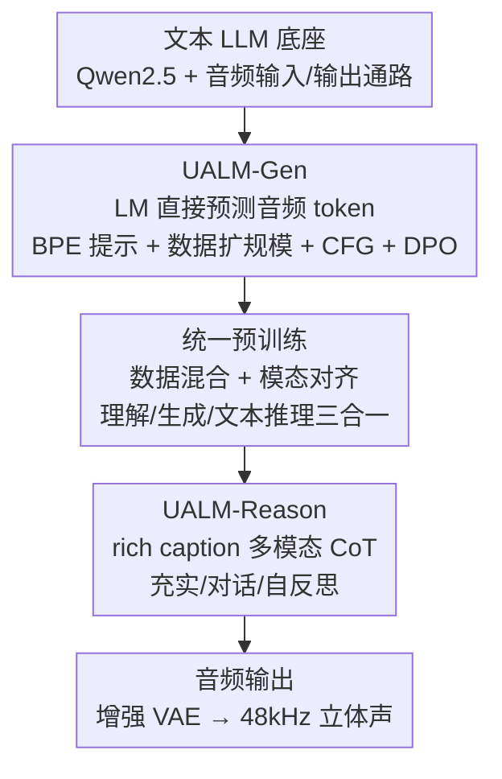

# UALM: Unified Audio Language Model for Understanding, Generation and Reasoning

**会议**: ICLR 2026  
**OpenReview**: [https://openreview.net/forum?id=TsdlOjcQNu](https://openreview.net/forum?id=TsdlOjcQNu)  
**代码**: https://github.com/NVIDIA/audio-intelligence/tree/main/UALM  
**领域**: 音频语音 / 多模态 / 统一生成理解  
**关键词**: 统一音频语言模型, 文本到音频生成, 多模态推理, 音频 token, 自反思

## 一句话总结
UALM 用单个自回归语言模型同时打通音频理解、文本到音频生成和多模态推理三件事——先证明纯 LM 直接预测音频 token 就能追平扩散模型的生成质量（UALM-Gen），再靠数据混合 + 模态对齐把三种能力塞进一个模型（UALM），最后让模型用「文字+音频交错」的思维链在生成前规划、生成后自听自评再重做（UALM-Reason）。

## 研究背景与动机

**领域现状**：当前音频语言建模（ALM）把「音频理解」和「文本到音频生成」当成两条互不相干的赛道，而且连建模范式都分裂——理解任务普遍用自回归大语言模型（AF3、Qwen2.5-Omni 这类），而 SOTA 的生成模型几乎清一色是扩散模型（Stable Audio、ETTA）。

**现有痛点**：两套范式各自为政带来三个问题。其一，没有一个模型能像人类作曲家那样「边生成边听边改」，理解和生成的能力没法互相反哺。其二，音频领域的推理研究极度欠缺，现有的「推理」全都局限在纯文本轨迹、且只服务于理解任务，没人做过用于「指导生成」的多模态思考。其三，业界普遍认为 LM 做音频生成质量打不过扩散模型，于是大家干脆放弃了用统一 LM 框架去囊括生成的念头。

**核心矛盾**：要统一，就得让生成也跑在自回归 LM 上（这样才能和理解、文本推理共享一个 token 空间）；但 LM 生成被认为质量不行。这个「统一的必要前提」恰恰卡在「LM 生成被判定为劣势」这一点上。

**本文目标**：拆成三个递进子问题——(1) 让纯 LM 的文本到音频生成追平扩散模型；(2) 在一个 LM 里平衡理解、生成、文本推理三种任务且都不掉队；(3) 实现超越纯文本的「生成式多模态推理」。

**切入角度**：作者发现 LM 生成之所以差，不是范式本身的天花板，而是工程配方没做对——数据规模不够、没用分类器自由引导（CFG）、codec 与采样方式不当、缺少偏好优化。把这些补齐，LM 生成就能起来。

**核心 idea**：用「一个解码器 LM + 离散音频 token 输出」统一三种能力，并引入 rich caption 作为生成的中间蓝图，让模型在思维链里交错使用文字和音频来规划、批判、改写自己的生成结果。

## 方法详解

### 整体框架

UALM 的底座是一个解码器架构的文本 LLM（Qwen2.5-7B），在它上面扩展音频输入和音频输出两条通路：**音频输入**走 Encoder-Adapter-LLM 路线（25Hz 声学编码器 + 单层 MLP adapter，用连续表示避免离散化的信息损失）；**音频输出**则预测离散 codec token（X-codec，50Hz、每帧经 RVQ 产生 8 个 token，用 delay pattern 做帧内自回归），最后再接一个增强 VAE 把 16kHz 单声道波形升到 48kHz 立体声。训练时只在输出 token 上算 loss，一个音频帧等价于一个文本 token（每个音频 token 的 loss 缩放 1/8）。

整个系统按三个阶段递进搭起来：先单独训出一个会生成的 LM（**UALM-Gen**），再把三种数据混合做统一预训练得到 **UALM**，最后用两轮 SFT-DPO 后训练注入推理能力得到 **UALM-Reason**。三者共享同一套模型骨架，能力逐级叠加。

### 关键设计

**1. UALM-Gen：把「LM 做音频生成不行」这个共识打掉**

这一步针对的痛点是统一的前提——只有让自回归 LM 的生成质量追平扩散模型，才有资格谈把生成并入统一 LM。作者系统补齐了四件工程上的事。首先是**去掉外部文本编码器**：以往无论 LM 还是扩散方法都靠 T5 这类外部编码器把 caption 编码后做交叉注意力，但这和「从文本 LLM 初始化」的架构不兼容；作者首次证明 LM 生成可以直接把文本提示当普通 BPE token 喂进去，复用 LLM 本身的语言知识。其次是**数据规模**：LM 生成比扩散模型「吃数据」得多，扩散模型常在 <2M 样本（<4k 小时）就能出好结果，而 LM 必须放大到 30M 样本（约 80k 小时、17B token）才追得上，降到 1/32 数据量时会明显过拟合。第三是**CFG**：分类器自由引导在扩散里常见、在多模态 LM 里却罕用，UALM-Gen 在训练和采样时都用它，按

$$\pi^{\text{CFG}}_\theta(y_t\mid y_{1:t-1},x)=\lambda\cdot\pi_\theta(y_t\mid y_{1:t-1},x)+(1-\lambda)\cdot\pi_\theta(y_t\mid y_{1:t-1},\varnothing)$$

在条件与无条件分布间插值（最优 $\lambda=3.0$），不用 CFG 时质量严重崩坏。第四是 **DPO + 自适应**：交叉熵训完后再用 DPO 做偏好优化，但因为基座只见过真实音频，直接拿合成样本做 DPO 会因分布外问题让 loss 早期飙升，所以必须先用「赢样本」做交叉熵微调（约 1k 步）把模型适配到合成域，并在 DPO 时叠加交叉熵正则压住模型对参考分布的偏离 $\pi_\theta(y_w\mid x)-\pi_{\text{ref}}(y_w\mid x)$。

**2. 统一预训练：靠数据配比与模态对齐让三种能力共处一室**

视觉、纯语音领域已有统一生成-理解模型，但作者发现它们的配方搬到更广的音频域不奏效，三种任务之间很难平衡。解法有两点。一是**数据混合配比**：把音频理解、音频生成、纯文本推理三类数据按 token 量 27.7%/33.1%/39.2% 混合，关键是因为生成任务收敛明显更慢、且数据量相对小，对它做 2 倍上采样补偿。二是**模态对齐阶段**：直接全参训练会让新加入的音频嵌入和 adapter 拖累已训好的 LLM 主干，所以先冻结 Transformer 主体和声学编码器，只用「少步数 + 大 batch」热身更新 MLP adapter 和音频嵌入表，之后再解冻全部参数（声学编码器始终冻结）。这两招让单个 UALM 在文本到音频生成、音频理解、文本推理三方面都能贴近各自的专用 SOTA，文本能力仅有边际下降。

**3. UALM-Reason：用 rich caption 把「生成前规划 + 生成后自评」做成多模态思维链**

音频生成的推理此前几乎是空白——连任务定义、数据、训练配方都没有。本文的核心抓手是 **rich caption**：一种结构化的详细文本蓝图，含 Keywords（核心声学事件列表）、Layout（事件的时间排布）、Description（每个事件的声学属性细节），它比简短提示提供了远更细致、机器可用的生成指引。围绕它构造三种推理模式：**充实（Enrichment）**——把用户抽象、简短、欠规约的提示自动翻译成完整 rich caption，甚至能处理只描述场景/情绪/曲风的「想象型」提示；**对话（Dialogue）**——多轮追问用户细节，在合成前消除歧义协作搭出 rich caption；**自反思（Self-Reflection）**——最高级形式，模型先按计划生成音频，再「听」自己的输出生成一份描述实际结果的新 rich caption，对比计划与结果写出文字批判，据此生成第二版改进音频，形成「生成-理解-批判-改写」闭环。这三种能力靠**两轮交错 SFT-DPO**注入：第 1 轮用 250k rich caption-音频对、由文本 LLM 合成多样用户提示与对话扩成 750k SFT 样本训出 SFT-1，再对 250k 子集用 CLAP 分数做偏好排序、阈值过滤出约 60k DPO 对得到 DPO-1，建立充实与对话能力；第 2 轮从首轮取 60k 样本，用 DPO-1 生成初版音频并curate rich caption、由文本 LLM 写出对比批判构造自反思数据，与首轮 SFT 合并训出 SFT-2，最后对 20k 样本（含/不含自反思）做一次按「是否更贴合原始 rich caption 细节」选偏好的 DPO，得到最终 UALM-Reason。

### 一个完整示例：自反思如何纠正时序错误

以提示「生成包含铜管乐、随后是打击乐的音乐」为例走一遍自反思：模型先**充实**出 rich caption（Keywords: 铜管乐、打击乐；Layout: 铜管乐在前、打击乐随后；Description: 铜管乐为欢快有节奏的旋律、突出小号长号，打击乐为稳定鼓点），并据此**生成**第一版音频；接着模型**听**自己的输出、生成一份描述实际结果的 rich caption，发现「铜管乐和打击乐是同时响起的」；于是写下**批判**——「两者并发了，应当先出铜管乐再出打击乐」，并据此**改写**生成第二版音频，修正了时序。整个过程把理解能力（听自己）和生成能力（重做）在一条思维链里串起来，正是纯文本推理做不到的。

## 实验关键数据

### 主实验

音频生成（SongDescriber / AudioCaps 测试集，FD/KL 越低越好，CL/AES/OVL/REL 越高越好）：

| 模型 | SongDescriber FD↓ | SongDescriber CL↑ | AudioCaps FD↓ | AudioCaps IS↑ | 类型 |
|------|------|------|------|------|------|
| ETTA | 95.66 | 0.44 | 80.13 | 14.36 | 扩散 SOTA |
| Stable Audio Open | 138.58 | 0.42 | 100.93 | 11.80 | 扩散 |
| TangoFlux | 235.61 | 0.41 | 103.04 | 15.13 | 扩散 |
| MusicGen-stereo-L | 228.94 | 0.36 | — | — | LM |
| **UALM-Gen (本文)** | **74.43** | **0.54** | **75.14** | 14.52 | LM |
| **UALM (本文)** | 83.69 | **0.54** | **65.87** | **15.62** | 统一 LM |

纯 LM 的 UALM-Gen 在 FD、CL、AES 等多项上反超所有扩散基线，统一后的 UALM 在 AudioCaps FD 上进一步降到 65.87，证明 LM 范式不仅能追平、还能超越扩散模型。

音频理解（MMAU / MMAR）与文本能力：

| 模型 | MMAU Mean↑ | MMAR↑ | 说明 |
|------|------|------|------|
| Audio Flamingo 3 | 72.3 | 58.5 | 理解专用 SOTA |
| Qwen2.5-Omni | 71.0 | 56.7 | 统一语音 |
| **UALM (本文)** | **74.1** | 55.2 | 单模型 |

| 模型 | MMLU↑ | GSM8K↑ | HumanEval↑ |
|------|------|------|------|
| Qwen2.5-7B-Instruct | 74.5 | 91.6 | 84.8 |
| **UALM (本文)** | 71.6 | 92.1 | 81.1 |

UALM 的音频理解 MMAU 均值 74.1 超过理解专用的 AF3，文本推理相对原始 Qwen2.5-7B-Instruct 仅边际下降（GSM8K 甚至略升），远好于 Chameleon、Liquid 这类视觉统一模型的文本表现（MMLU 仅 52 左右）。

### 消融实验

| 配置 | 现象 | 说明 |
|------|------|------|
| 无 CFG | 生成质量严重崩坏 | CFG 对 LM 生成是必需项，最优 $\lambda=3.0$ |
| 数据降到 1/32（≈1M） | 明显过拟合 | 数据规模是 LM 生成成功的关键，量级需远超扩散 |
| DPO 不做自适应 | 早期 loss 飙升后才收敛 | 必须先用赢样本适配合成域 |
| DPO 不加 CE 正则 | 偏离参考分布过大 | CE 正则压住 $\pi_\theta-\pi_{\text{ref}}$ 的发散 |

UALM-Reason vs UALM 的主观评分（5 分制，95% CI）：

| 模型 | 充实 | 对话 | 自反思 |
|------|------|------|------|
| UALM | 3.77±0.11 | 3.92±0.11 | 3.82±0.11 |
| UALM-Reason | **4.01±0.10** | **4.02±0.10** | **4.04±0.09** |

三种推理模式下 UALM-Reason 都稳定优于无推理的 UALM，验证「生成式多模态推理」确实提升了生成质量与可控性。

### 关键发现
- **数据规模是 LM 生成的命门**：扩散模型在 1-2M 样本就能出好结果，LM 必须放大约一个数量级（30M）才追得上，这与自回归 vs 扩散的 scaling law 差异一致。
- **理解收敛远快于生成**：训练曲线显示音频理解很快到位、生成迟迟才起来，这也是要把生成数据 2 倍上采样的直接原因。
- **DPO 的坑在分布外**：真实音频训出的基座直接吃合成偏好对会崩，自适应 + CE 正则两道保险缺一不可。
- **rich caption 带来细粒度可控性**：UALM-Reason 能区分数量（一只狗叫 vs 多只）、空间（远处）、时序（A 在 B 之后）、纹理（失真音频）这些以往模型难拿捏的细节。

## 亮点与洞察
- **「LM 生成打不过扩散」是配方问题不是范式问题**：作者没有发明新架构，而是把数据规模、CFG、codec+delay pattern、DPO 自适应这几件被扩散圈视作理所当然、却在 LM 圈被忽略的工程要素补齐，就把共识掀翻了——这种「把别人领域的成熟技巧搬过来」的洞察很有迁移价值。
- **rich caption 作为「可批判的中间表示」很巧妙**：它既是生成蓝图，又因为是结构化文本，让模型能「听完自己的输出再写一份 caption」并和原计划逐项对比，把抽象的「自我反思」落成了可执行的文字 diff。
- **统一 token 空间是多模态推理的前提**：正因为生成也跑在自回归 token 上，理解、生成、文本推理才能在同一条思维链里交错，这是扩散范式天然做不到的——这条思路可迁移到任何想做「生成式推理」的多模态任务。

## 局限与展望
- **生成式推理缺客观指标**：作者承认这块还很初生，评估主要靠定性分析和主观打分，没有公认的客观 benchmark，结论的说服力受限于人评。
- **数据成本极高**：30M 音频对、660k 步、16 节点 ×8 张 A100 的训练规模，复现门槛很高，且大量 caption 是开源模型生成的伪标签，质量天花板受伪标签影响。
- **文本能力仍有边际损失**：MMLU 从 74.5 降到 71.6、HumanEval 从 84.8 降到 81.1，统一训练对原生文本能力还是有些拖累，如何完全无损地融合仍是开放问题。
- **自反思深度有限**：目前自反思只做一轮「生成-批判-改写」，是否能多轮迭代逼近更高质量、以及批判信号本身的可靠性，文中未深入。

## 相关工作与启发
- **vs 扩散音频生成（ETTA / Stable Audio Open）**：它们靠扩散的归纳偏置和数据效率拿到高质量但无法并入统一 LM；UALM-Gen 证明 LM 加足数据与 CFG/DPO 后能追平甚至反超，且天然兼容统一框架，代价是吃数据多得多。
- **vs 音频理解专用模型（Audio Flamingo 3 / Qwen2.5-Omni）**：它们只做理解、不会生成；UALM 在一个模型里同时拿下理解（MMAU 74.1 反超 AF3）和生成，是真正的统一。
- **vs 视觉/语音统一模型（Chameleon / Liquid / OpusLM）**：这些模型的配方搬到广义音频域失效、且文本能力损失严重（MMLU 仅 52 左右）；UALM 靠数据配比 + 模态对齐把文本能力保到 71.6，并首次在音频域实现跨模态的生成式推理。
- **vs 纯文本音频推理（Audio Reasoner 等）**：它们的推理轨迹局限在文本、只服务理解；UALM-Reason 让音频本身进入思维链（生成-自听-批判），是音频研究里首批超越纯文本推理的工作。

## 评分
- 新颖性: ⭐⭐⭐⭐⭐ 首次在音频域实现跨模态生成式推理，并系统证明 LM 生成可反超扩散。
- 实验充分度: ⭐⭐⭐⭐ 生成/理解/文本三线对比 + 多项消融扎实，但推理部分客观评估偏弱。
- 写作质量: ⭐⭐⭐⭐⭐ 三大挑战递进式叙述清晰，rich caption 与自反思的例子很有画面感。
- 价值: ⭐⭐⭐⭐⭐ 给「统一音频智能」立了可复现的工程范式，rich caption + 自反思思路迁移性强。

<!-- RELATED:START -->

## 相关论文

- [\[ICLR 2026\] MMSU: A Massive Multi-task Spoken Language Understanding and Reasoning Benchmark](mmsu_a_massive_multi-task_spoken_language_understanding_and_reasoning_benchmark.md)
- [\[ICLR 2026\] SmartDJ: Declarative Audio Editing with Audio Language Model](smartdj_declarative_audio_editing_with_audio_language_model.md)
- [\[ICLR 2026\] OWL: Geometry-Aware Spatial Reasoning for Audio Large Language Models](owl_geometry-aware_spatial_reasoning_for_audio_large_language_models.md)
- [\[ICLR 2026\] Human Behavior Atlas: Benchmarking Unified Psychological and Social Behavior Understanding](human_behavior_atlas_benchmarking_unified_psychological_and_social_behavior_unde.md)
- [\[ICLR 2026\] AudioX: A Unified Framework for Anything-to-Audio Generation](audiox_a_unified_framework_for_anything-to-audio_generation.md)

<!-- RELATED:END -->
