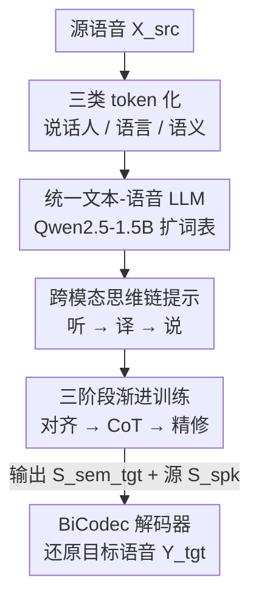

# UniSS: Unified Expressive Speech-to-Speech Translation with Your Voice

**会议**: ICLR 2026  
**OpenReview**: [https://openreview.net/forum?id=5o0ZvYzh6B](https://openreview.net/forum?id=5o0ZvYzh6B)  
**代码**: 无（仅有 Demo 页 https://cmots.github.io/uniss-demo/）  
**领域**: 语音翻译 / 语音生成  
**关键词**: 语音到语音翻译, 表现力保留, 跨模态思维链, 统一语言模型, S2ST 数据集

## 一句话总结
UniSS 把语音离散成「说话人 / 语言内容 / 语义」三类 token 直接塞进预训练文本 LLM（Qwen2.5-1.5B），用一个单阶段自回归模型、加上「听-译-说」跨模态思维链提示，把 LLM 现成的文本翻译能力迁移到语音上，做到既翻得准、又保住原说话人的音色、情感和时长——并顺手放出了 44.8k 小时的中英表现力 S2ST 数据集 UniST。

## 研究背景与动机

**领域现状**：语音到语音翻译（S2ST）要把一种语言的口语转成另一种语言的口语。传统做法是级联三件套——ASR 转写、文本机器翻译、TTS 合成；近年则转向端到端，并开始借助 LLM 把语音离散成 token 后自回归生成。

**现有痛点**：作者点出这个方向被三个问题卡住。其一，能同时保留情感与音色的成对语音数据极度稀缺，要么规模太小训不动大模型，要么从网上爬来的质量参差。其二，现有 LLM-based 方法架构太复杂——要么多头并行预测多流声学 token，要么先生成语义 token 再接一个非自回归（NAR）模型补全声学信息，Hibiki 这类多流架构甚至要嵌套 Transformer 从头训练。其三，这些方法只把 LLM 当成一个通用的序列转换器，完全没用上它预训练时学到的文本翻译知识。

**核心矛盾**：表现力 S2ST 想要的三件事——单阶段简洁架构、语音文本模态统一、显式复用 LLM 文本翻译能力——此前没有任何一个方法能同时满足。架构复杂度和「真正榨干 LLM 翻译潜力」之间存在张力：越是为了补全声学细节而堆模块，就越偏离纯文本 LLM 的简洁形态，也越难直接调用它的翻译先验。

**本文目标**：用一个不改架构的预训练文本 LLM，单阶段完成「内容翻准 + 音色/情感/时长保住」，并把数据稀缺这块短板一起补上。

**切入角度**：作者的关键观察是——如果能把语音也表示成 LLM 词表里的离散 token，那么 S2ST 本质上就和文本翻译同构，可以像 CoT 一样让模型先「在脑子里转成文字翻译」再「说出来」，从而把文本翻译能力顺势迁移到语音。

**核心 idea**：用「三类语音 token + 单阶段自回归 LLM + 跨模态思维链」替代「多流/两阶段+NAR 的复杂架构」，让一个 1.5B 的文本 LLM 直接承担表现力 S2ST。

## 方法详解

### 整体框架

UniSS 的输入是源语音 $X_{src}$，输出是目标语言、但保留源说话人音色情感的语音 $Y_{tgt}$，整条管线建模条件分布 $P(Y_{tgt}|X_{src})$。它把语音切成三类离散 token：说话人 token $S^{spk}$（固定 32 个，编码音色/韵律/情感等全局风格）、语言内容 token $S^{ling}$（编码源话语的内容）、语义 token $S^{sem}$（表示目标话语、可直接解码回波形）。整体走一条单阶段自回归流程：

$$X_{src} \xrightarrow{\text{Tokenize}} (S^{spk}_{src}, S^{ling}_{src}) \xrightarrow{\text{Speech Translate}} (S^{spk}_{src}, S^{sem}_{tgt}) \xrightarrow{\text{Detokenize}} Y_{tgt}.$$

也就是说，把源语音的说话人 token 和语言 token 当 prompt 喂给 LLM，模型自回归吐出目标语义 token，再连同源说话人 token 一起送进 codec 解码器还原成波形——全程没有中间声学表示、没有级联系统。生成过程由「听-译-说」跨模态思维链组织，模型靠三阶段渐进训练习得这套能力。

### 关键设计

**1. 三类语音 token 化：把音色、内容、语义解耦成 LLM 能吃的离散序列**

直接拿一种语音 token 既当内容理解又当波形重建，会顾此失彼——作者的前期实验发现 BiCodec 的语义 token 重建波形很好，但自监督性质让它不擅长内容理解。UniSS 因此用三套 tokenizer 分工：说话人 tokenizer 用 BiCodec 的全局编码器，把音色/情感/韵律抽成定长 32 个 token $S^{spk}$；语义 tokenizer 也来自 BiCodec，以每秒 50 个 token 编码可直接解码回波形的 $S^{sem}$；语言内容 tokenizer 则换成 GLM-4 的语音 tokenizer（基于量化后的 Whisper 编码器），以每秒 12.5 个 token 产出变长的 $S^{ling}$，专门负责稳健的内容理解。源语音用 $(S^{spk}_{src}, S^{ling}_{src})$ 表示、目标语音只用 $S^{sem}_{tgt}$ 表示，这样把说话人身份、语言内容、生成导向的语义彻底拆开，才让单模型既翻得准又控得住风格。消融里把 GLM-4 内容 token 换回 BiCodec 自监督 token（w/o GLM），Speech-BLEU 直接掉 15.01 / 8.73，印证了「内容理解必须用面向内容的 token」。

**2. 统一文本-语音语言模型：不改架构，把语音并进 LLM 词表**

为了显式复用 LLM 的翻译先验，UniSS 不去设计多流或嵌套 Transformer，而是直接拿预训练的 Qwen2.5-1.5B-Instruct 当骨干，把词表扩到 180,407 以容纳语音和控制 token，从此语音和文本被一视同仁地当作 token 序列，在同一个 Transformer 里处理。模型吃下由说话人 token 和语言 token 拼成的 prompt，自回归生成目标语义 token，训练用最朴素的下一 token 预测目标：

$$L_{AR} = -\sum_{t=1}^{|\tau_{out}|} \log P_\theta(\tau_{out,t}\mid P, \tau_{out,<t}),$$

其中 $P$ 是含 $(S^{spk}_{src}, S^{ling}_{src})$ 的输入 prompt，$\tau_{out}$ 视任务模式不同可以是文本 token、语义 token 或两者的拼接。解码端则用 BiCodec 解码器，把 LLM 生成的 $S^{sem}_{tgt}$ 连同源说话人 token 简单拼接 $Y_{tgt} = \text{Decoder}([S^{spk}_{src}, S^{sem}_{tgt}])$，一步还原 16kHz 高保真音频、同时把音色情感锚回源说话人——不需要额外的 NAR 第二阶段。这正是它「单阶段」的关键：声学保真度靠解码器条件化于源说话人 token 直接拿到，而不是再训一个声学补全网络。

**3. 跨模态思维链提示：让模型先在文字里翻译，再开口说**

直接做语音到语音翻译太难，UniSS 借鉴 CoT，把任务拆成「听-译-说」三步，从而把 LLM 的文本翻译本事迁过来。输入是一段结构化 prompt $P = [c_{task}, c^{tgt}_{lang}, c_{speed}, S^{spk}_{src}, S^{ling}_{src}]$，分别指定任务模式、目标语言、源/目标时长比，再由 BOT 触发生成、EOD 终止。它给出两档可控模式权衡保真与效率：**Quality Mode** 走完整 CoT，先「听」出源转写 $T_{src}$、再「译」成目标文本 $T_{tgt}$、最后「说」出语义 token，输出 $\tau_{out} = [T_{src}, T_{tgt}, S^{sem}_{tgt}]$，靠显式的文字中间链最大化翻译保真；**Performance Mode** 压缩这条链、跳过转写直接 $\tau_{out} = [T_{tgt}, S^{sem}_{tgt}]$，换取更快推理。消融中把中间文本全去掉做纯直连 S2ST（Direct S2ST），Speech-BLEU 暴跌 14.94 / 14.40，说明正是这条文字思维链把文本翻译专长导入了语音域。其中 $c_{speed}$ 把源/目标时长比按 0.1 间隔离散成 speed token，使模型能做精细时长对齐（默认 1.0 即 1:1 时长匹配），这也是它时长一致性突出的来源。

**4. 三阶段渐进训练：先对齐、再上 S2ST、最后精修，防止遗忘翻译能力**

把语音硬塞进 LLM 容易灾难性遗忘掉原有的文本翻译能力，UniSS 用三阶段递进缓解。**Phase 1 语音-文本对齐**：多任务训 ASR、TTS、S2TT、MT 四件基础任务——前三者负责把语音和文本对齐，MT 则专门保住模型的文本翻译底子。**Phase 2 带 CoT 的 S2ST**：引入核心 S2ST 任务，用 CoT 提示格式（外加一个跳过中间文本的简化直连模式）训练，把 Phase 1 的对齐能力转成语音域翻译，并与 Phase 1 数据按 2:1 混合。**Phase 3 精修**：仅用高质量子集 UniST High-Quality，配退火学习率稳定已学到的 CoT 模式、优化最终性能。消融显示去掉 Phase 1 对齐（UniST only）会让 Speech-BLEU 崩掉 7.18 / 10.15，证明对齐是后续 S2ST 学习的地基；补上 Phase 3 还能再涨 0.90 / 2.06。

### 损失函数 / 训练策略

训练目标始终是上面的下一 token 预测 $L_{AR}$，区别只在不同阶段/模式下 $\tau_{out}$ 的构成不同。优化用 AdamW（权重衰减 0.1，动量 (0.9, 0.95)），batch 2.3M token，音频统一 16kHz，在 16 张 H800 上用 Megatron-LM 训练。学习率从 Phase 1 的 8e-4 降到 Phase 2 的 2e-4，Phase 3 再从 5e-5 退火到 5e-6。

数据侧贡献 UniST：从公开中英 TTS 语料出发，先用 Paraformer 重识别算 WER 清洗（丢弃 WER>0.05），再用 Qwen2.5-72B 翻译成目标文本、SparkTTS 以源语音为条件合成保音色的目标语音，并算时长比离散成 speed token；最后用 ASR 对目标语音再过滤（WER>0.01 丢弃）、时长比限制在 [0.5, 2.0]，得到 44.8k 小时的 UniST General；再加 VAD 去首尾静音、更严的 [0.7, 1.5] 时长比过滤，得到 19.8k 小时的 UniST High-Quality（专供 Phase 3）。

## 实验关键数据

### 主实验

在 CVSS-T 测试集上（结果为 EN-ZH | ZH-EN），UniSS 用 1.5B 参数全面刷新翻译保真、时长一致性和语音质量：

| 类别 | 模型 | #参数 | Speech-BLEU | SLC 0.2 | UTMOS |
|------|------|-------|-------------|---------|-------|
| 级联 | 2-Stage (SeamlessM4T+CosyVoice2) | 2.8B | 26.94 \| 20.86 | 0.67 \| 0.52 | 3.79 \| 3.48 |
| MLLM | GPT-4o | - | 31.64 \| 19.27 | 0.47 \| 0.37 | 3.46 \| 4.18 |
| 端到端 | Seamless-L | 2.3B | 25.05 \| 17.67 | 0.67 \| 0.36 | 2.69 \| 4.04 |
| 端到端 | Seamless-Ex（表现力变体） | 1.7B | 24.45 \| 15.84 | 0.68 \| 0.52 | 2.46 \| 2.90 |
| **本文** | **UniSS (P)** | 1.5B | 30.28 \| 23.61 | 0.98 \| 0.84 | 3.77 \| 3.86 |
| **本文** | **UniSS (Q)** | 1.5B | **32.20 \| 24.28** | **0.98 \| 0.87** | 3.76 \| 3.86 |

UniSS (Q) 的 Speech-BLEU 显著超过所有端到端和级联基线；时长一致性 SLC 0.2 比此前最佳端到端系统 Seamless-Ex 提升约 44%（EN-ZH）/67%（ZH-EN），逼近近乎完美；语音质量 UTMOS 在端到端阵营里也最高、与级联系统持平。主观 MOS 上 UniSS (Q) 情感相似度 4.51、说话人相似度 4.42（全场最高）、自然度 4.45，均大幅超过表现力基线 Seamless-Ex（3.56 / 2.94 / 3.10）。

### 消融实验

| 配置 | Speech-BLEU (EN-ZH \| ZH-EN) | 说明 |
|------|------------------------------|------|
| Phase 1+2（Base） | 29.38 \| 21.55 | 基线 |
| w/ Phase 3 | 30.28 \| 23.61 | 精修再涨 +0.90 / +2.06 |
| UniST only（去 Phase 1） | 22.20 \| 11.40 | 去对齐，崩 -7.18 / -10.15 |
| w/o GLM（换回自监督 token） | 14.37 \| 12.82 | 内容 token 退化，掉 -15.01 / -8.73 |
| Direct S2ST（去 CoT 中间文本） | 14.44 \| 7.15 | 去思维链，暴跌 -14.94 / -14.40 |

### 关键发现
- **跨模态 CoT 是命脉**：去掉中间文本做纯直连 S2ST 掉点最狠（约 -15），说明「先翻成文字再说」才是把 LLM 文本翻译能力迁到语音的核心机制。
- **内容 token 选型决定上限**：把 GLM-4 内容 token 换回 BiCodec 自监督 token 同样崩 8~15 点，印证「生成友好的 token ≠ 理解友好的 token」，必须分工。
- **效率-质量可调**：Performance Mode 比 Quality Mode 提速 1.07×，仅掉 1.84 Speech-BLEU；进一步用 0.5B 的 UniSS-Small (P) 可提速 1.25× 并保住 25.68 Speech-BLEU，适配资源受限部署。

## 亮点与洞察
- **「把语音并进文本 LLM」而非「为语音改 LLM」**：不动 Qwen 架构、只扩词表，就把单阶段 S2ST 做成纯 next-token 预测，工程上极简，还天然继承了文本翻译先验——这是全文最聪明的一拍。
- **CoT 从纯文本推理迁到跨模态生成**：把「听-译-说」当成显式中间链，用 LLM 早已学会的「先想再答」习惯桥接模态鸿沟，思路可迁移到任何「源/目标都是非文本、但中间能落到文本」的翻译/转换任务。
- **三 token 解耦给了可控性**：说话人 token 定长 32 个、解码端简单拼接就能锚回音色情感，省掉了别人都要的 NAR 声学补全，却拿到全场最高说话人相似度，是「用表示设计换架构复杂度」的范例。
- **speed token 做时长对齐**：把时长比离散成控制 token 喂进 prompt，让时长一致性这个老大难指标直接刷到近满分，是个轻量却好用的 trick。

## 局限与展望
- **仅支持中英双语**：受资源限制只训了中英，作者称数据管线和训练框架可直接扩展到多语，但这只是规划、尚未验证多语场景下的迁移效果。
- **三套 tokenizer 来源不一、词表膨胀**：语言/说话人/语义 token 来自两个不同的音频 tokenizer，导致词表扩到 18 万，作者也承认未来需训练统一 tokenizer 来合并组件、压缩词表。
- **数据为合成而非真实平行语料**：UniST 的目标语音是 SparkTTS 合成、目标文本是 Qwen2.5-72B 翻译，表现力和翻译质量都受这两个上游模型上限约束；真实人声、真实情感的平行 S2ST 数据仍是缺口。
- **伦理风险**：保留声纹的翻译有被滥用于音频深伪、冒充诈骗的风险，作者在伦理声明中明确点出。

## 相关工作与启发
- **vs 级联系统（ASR→MT→TTS）**：级联会累积误差、并在文本瓶颈处丢失副语言特征；UniSS 单阶段直出语义 token、解码端锚回说话人，既免误差累积又保住音色情感，主观说话人相似度反超精心设计的 2-Stage TTS 管线。
- **vs Hibiki / 多流 LLM-S2ST**：它们靠嵌套 Transformer、多流声学 token 或额外 NAR 模型补全声学，架构复杂且需从头训；UniSS 不改 LLM 架构、无 NAR 第二阶段，用更小的 1.5B 反而翻得更准。
- **vs Seamless / SeamlessExpressive**：Seamless 系列靠专门的韵律编码器和 PRETSSEL vocoder 保表现力；UniSS 不用专门模块，韵律 A.PCP 仅差 0.10~0.12，却在 Speech-BLEU、时长一致性、自然度上全面领先。
- **vs 把 LLM 当通用序列转换器的方法**：以往工作只把 LLM 当 seq2seq，浪费了预训练翻译知识；UniSS 用跨模态 CoT 显式调用这份知识，这是它与同类 LLM-based S2ST 最本质的区别。

## 评分
- 新颖性: ⭐⭐⭐⭐⭐ 「三 token 解耦 + 跨模态 CoT 把文本 LLM 直接变成单阶段表现力 S2ST」是干净且站得住的新范式。
- 实验充分度: ⭐⭐⭐⭐ 客观+主观、多基线、关键消融齐全；但仅中英、且评测多依赖合成/转写指标。
- 写作质量: ⭐⭐⭐⭐⭐ 三大挑战→三大原则→三大设计的逻辑闭环清晰，图表对照到位。
- 价值: ⭐⭐⭐⭐⭐ 范式更简单有效，外加 44.8k 小时开源数据集 UniST，对后续表现力 S2ST 研究有实打实的推动。

<!-- RELATED:START -->

## 相关论文

- [\[ICLR 2026\] Scalable Multilingual Multimodal Machine Translation with Speech-Text Fusion](scalable_multilingual_multimodal_machine_translation_with_speech-text_fusion.md)
- [\[ICLR 2026\] MambaVoiceCloning: Efficient and Expressive Text-to-Speech via State-Space Modeling and Diffusion Control](mambavoicecloning_efficient_and_expressive_text-to-speech_via_state-space_modeli.md)
- [\[ACL 2026\] Computational Narrative Understanding for Expressive Text-to-Speech](../../ACL2026/audio_speech/computational_narrative_understanding_for_expressive_text-to-speech.md)
- [\[ACL 2026\] StressTest: Can YOUR Speech LM Handle the Stress?](../../ACL2026/audio_speech/stresstest_can_your_speech_lm_handle_the_stress.md)
- [\[ICLR 2026\] Pay Attention to CTC: Fast and Robust Pseudo-Labelling for Unified Speech Recognition](pay_attention_to_ctc_fast_and_robust_pseudo-labelling_for_unified_speech_recogni.md)

<!-- RELATED:END -->
