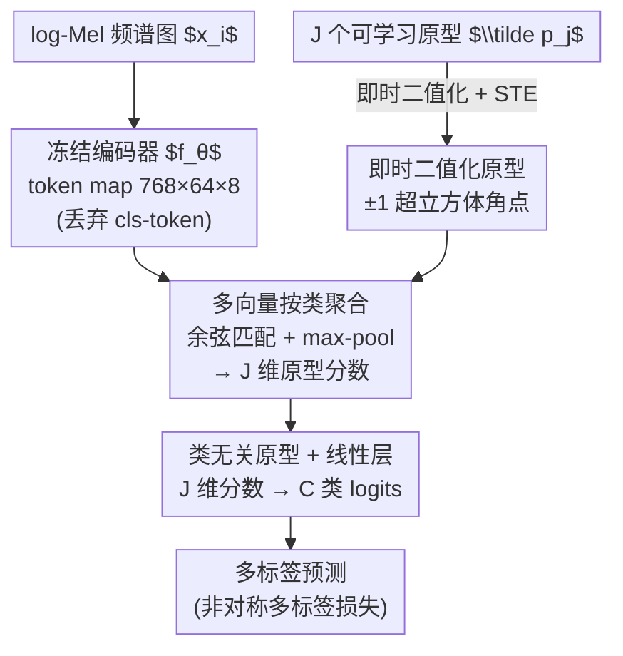

# Unmute the Patch Tokens: Rethinking Probing in Multi-Label Audio Classification

**会议**: ICLR 2026  
**OpenReview**: [https://openreview.net/forum?id=FbY5Co2NWk](https://openreview.net/forum?id=FbY5Co2NWk)  
**领域**: 音频/语音 / 自监督表示  
**关键词**: 音频自监督, 探针评估, 多标签分类, 原型池化, AudioSet

## 一句话总结
作者指出音频自监督模型在 AudioSet 上不得不靠昂贵 fine-tuning 拿 SOTA、而轻量 linear probe 表现差，根因不是 embedding 不行而是「全局池化瓶颈」——`[cls]`-token 把分散、局部的声音事件压成一个向量丢了信息；他们提出**二值化原型探针（protobin）**，用一组即时二值化的类无关原型对完整 token map 做按类、多向量聚合，简单到只加一个原型层却显著超过 linear 与 attentive 探针，把探针重新确立为评估音频 SSL 的高效、可信范式。

## 研究背景与动机

**领域现状**：在视觉自监督里，冻结骨干 + 轻量探针（probing）早已是标准评估范式——它绕开 fine-tuning 的混杂因素，忠实反映 embedding 的内在质量。音频自监督也用探针，但仅限于 HEAR 这类多类基准；一旦要在多标签的 AudioSet 上冲 SOTA，几乎所有 spectrogram-based 模型（BEATs、EAT、ASiT、SSLAM 等）都退回到资源密集的 fine-tuning。

**现有痛点**：这些模型大多用 MIM / 掩码-蒸馏式预训练，本质上把信息编码在**逐 token 的上下文表示**里。可是标准探针只取最后一层的 `[cls]`-token（或对所有 token 做 mean）当作单一描述子喂给线性分类器。论文用可视化指出：在 MIM 模型里 `[cls]`-token 的注意力在深层变得弥散、不聚焦关键区域，于是它根本无法概括「稀疏、局部、且在时频图上彼此重叠」的多声源事件——较弱但重要的声音会被更显著的声音盖过，线性分类器难以把混叠信号解开。

**核心矛盾**：探针差不是因为 embedding 差，而是**预训练目标（token 级、局部）与池化方式（单向量、全局）之间的错配**。预训练学到了 token 级信息，单向量池化却在评估时把它压扁丢掉，于是探针既低估了 embedding 的真实潜力，又会扭曲不同骨干之间的排名（即「不可信代理」）。

**本文目标**：(1) 系统量化这个池化瓶颈到底有多大、是否由多标签 polyphony 引起；(2) 设计一种轻量池化方法，既能榨干 token map 的信息，又保持探针「便宜、无混杂」的优势。

**切入角度**：作者从「按类、多向量聚合」出发——既然不同类别的证据天然定位在时频图的不同区域，那就别再逼一个向量概括全场，而是为每个类维护多个可学习「原型」，让不同原型各自激活不同声音事件。

**核心 idea**：用一组**即时二值化、类无关的可学习原型**对完整 token map 做余弦匹配 + max-pool，得到逐原型的分数向量，再用一层线性分类器映射到类别 logits——以极小代价（仅一个原型层、还省 32× 内存）替换信息瓶颈式的单向量池化。

## 方法详解

### 整体框架
给定冻结编码器 $f_\theta$，输入一张 log-Mel 频谱图 $x_i$，编码器输出 token map $z_i \in \mathbb{R}^{D\times S_t\times S_f}$（论文设定 $D{=}768$、$S_t{=}64$、$S_f{=}8$），同时也有一个最后一层 `[cls]`-token $s_i^{cls}\in\mathbb{R}^{D}$。标准探针只用 $s_i^{cls}$，本文则**丢开 `[cls]`、直接吃整张 token map**。protobin 维护 $C\cdot J$ 个可学习原型（$C$ 是类数、$J$ 是每类原型数），前向时把它们二值化成 $\pm 1$，对 token map 里每个时频位置的 token 做余弦相似度打分，再在时频网格上做 max-pool 得到逐原型的分数向量 $\bar{s}_i\in\mathbb{R}^{J}$，最后一层线性分类器把这 $J$ 维分数映射到 $C$ 个类别 logits，用非对称多标签损失训练。整个方法只在冻结骨干之外加一个原型层 + 一个线性层，三步串行、无反馈，是一条清晰的池化-评分-分类流水线。

### 关键设计

**1. 多向量按类聚合：用一组原型替代单向量池化瓶颈**

这一步直击「`[cls]` 把多声源压成一个向量」的痛点。protobin 不再求一个全局描述子，而是让每个原型 $p_j$ 对 token map 上的每个 token $z_i^{t,f}\in\mathbb{R}^{D}$ 算余弦相似度，再在整个时频网格上取最大值，把「这个原型有没有在某处匹配上」聚成一个标量：

$$s_j(t,f) := \frac{p_j^\top z_i^{t,f}}{\lVert p_j\rVert_2\,\lVert z_i^{t,f}\rVert_2},\qquad \bar{s}_j := \max_{t,f}\, s_j(t,f).$$

把所有 $J$ 个原型的 $\bar{s}_j$ 堆起来得到 clip 级描述子 $\tilde{z}_i := \bar{s}_i\in\mathbb{R}^{J}$。这样做的好处是：同一段音频里不同声音事件可以**激活不同的专门原型**——一个原型负责定位「狗叫」、另一个负责「警笛」，互不挤占；而 mhca 这类 attentive 池化仍要把多个事件的局部证据压进同一个向量。用余弦匹配还让分数天然对尺度和维度不变，便于跨不同骨干公平比较。max-pool 则对「稀疏、局部」很友好：原型只要在时频图某一处对上就能拿到高分，不会被大量背景 token 稀释。

**2. 即时二值化 + STE：把原型推到超立方体角点，免掉显式正交损失**

原型多样性是这类方法的关键——如果原型彼此塌缩成同一方向，多向量就退化回单向量。先前工作（Rauch et al. 2025a）靠一个**显式正交损失**来强制多样性，作者认为可以更简单。每次前向，他们把实值原型 $\tilde{p}_j$ 即时二值化：

$$p_j = \mathrm{sign}(\tilde{p}_j)\in\{-1,+1\}^{D}.$$

二值化把每个原型钉到 $D$ 维超立方体的角点上，角点之间天然有大的角度间隔，于是「近似正交」成为一种**涌现属性**而非显式约束：优化器为了最小化分类损失会自发挑选互不冗余、近正交的原型解。`sign(·)` 不可导，用直通估计器（STE）处理——反向传播时近似 $\partial\,\mathrm{sign}(x)/\partial x\approx 1$，前向用硬 $\pm 1$、梯度照常流回实值 $\tilde{p}_j$。额外红利是内存：二值原型相对 32-bit float 直接省 **32×** 存储，对生物声学等内存受限、端侧场景很合适。

**3. 类无关原型 + 线性层学类绑定：让原型自由协作，语义交给最后一层学**

先前原型探针把原型绑定到具体类别（每个原型「属于」某一类）。本文反其道而行，让 $C\cdot J$ 个原型**全部类无关（class-agnostic）**，不预先指派归属。原型与类别之间的关联完全交给最后那层线性分类器去学：它把 $J$ 维原型分数映射到 $C$ 个类 logits，等于根据「某原型对分类有多大用处」来给它赋予语义。这样解耦的动机是——多标签场景里类别共享底层声学模式（很多类都含某种瞬态/谐波结构），强行让原型从属单一类会割裂这种共享；放开后原型可以**跨类协作地去解开任务信息**。这也是 protobin 相对 float、类相关的 `proto` 的取舍：full-precision + 类相关的 `proto` 在需要捕捉细粒度细节时（如强 polyphony 的 urban、或 ASiT 骨干）偶有优势，而类无关 + 二值化的 protobin 更鲁棒、更适合做通用评估。

### 损失函数 / 训练策略
所有探针统一训练 30 epoch，AdamW + cosine 退火学习率，batch size 128，损失用**非对称多标签损失（ASL）**（适配多标签、缓解正负样本不平衡）。原型数 $J$ 固定为每类 20 个（as20k 用 10），附录敏感性分析确认 $J{=}20$ 稳健。为公平只调两个标量（学习率、weight decay），用两阶段流程：先 50 trial（前 25 Sobol 探索 + 后续 TPE）配 successive-halving，再对 top-k 配置跑 5 个随机种子选验证 mAP 最高者，最后在 held-out 测试集报告。所有 embedding 预先缓存到磁盘（无增强的一次前向），既避免重复推理也隔离出 embedding 质量本身。

## 实验关键数据

基准规模：**13 个数据集 × 6 个冻结编码器 × 11 种池化方法**，多标签报 mAP、多类报 accuracy，五个种子取均值。数据集分三组：通用多标签音频（as20k / fsd50k / desed / spass / urban）、细粒度小样本生物声学（birdset 的 7 个子集，64-shot）、多类对照（esc50 / sc-2）。

### 主实验：池化层级（Q1）

| 池化类别 | 代表方法 | as20k·EAT (mAP) | fsd50k·BEATs (mAP) | 相对 linear 平均 |
|----------|----------|------|------|------|
| `[cls]` 单向量 | linear | 17.29 | 46.89 | 基准 |
| `[cls]` 单向量 | mlp | 20.59 | 49.58 | 略升 |
| token map | linpre | 26.49 | 39.93 | 中等 |
| token map·attentive | mhca | 26.11 | 48.51 | 较强，但仍落后原型 −4.59 %p |
| token map·原型 | proto | 31.06 | 57.17 | 强 |
| token map·原型 | **protobin（本文）** | **31.67** | **58.27** | **通用音频 +14.41 %p、小样本生物声学 +12.16 %p** |

存在稳定、强的层级：**原型 > attentive > token-map 朴素方法 > `[cls]` 基线**。protobin 多数情况下胜出，平均比 linear 高 +14.41 %p（通用音频）/ +12.16 %p（生物声学）。

### `[cls]` 是不可信代理（Q2）

| 骨干 | linear 排名 | protobin 排名 | 含义 |
|------|------|------|------|
| ASiT (2024) | #2（看似第二强） | 末位 | 排名被完全反转 |
| SSLAM (2025, FT SOTA) | 中游 | #2 | 真实质量被揭示 |

`[cls]`-token 探针不仅是性能瓶颈，更是**不可信代理**——换 protobin 后骨干排名彻底洗牌。且在 as20k 上 protobin 把到 fine-tuning 的差距**填补了 63%**，说明标准探针丢掉了多少信息。

### 多标签 vs 单标签对照（Q3）

| 任务 | linear | mhca | protobin | FT |
|------|--------|------|----------|----|
| sc-2（单标签，EAT） | 69.1 | 93.2 | 90.4 | 98.3 |
| esc50（单标签，EAT） | 75.3 | 89.8 | 86.8 | 95.9 |
| as20k（多标签，EAT） | 17.3 | 26.1 | **31.7** | 40.2 |

### 关键发现
- **瓶颈来自池化而非 embedding**：单标签下 mhca 常能追平甚至超过 protobin（单声源时一个学好的单向量就够用）；但一进入多标签 polyphony，protobin 的多向量优势就稳定显现，因为 attentive 必须把多个事件压进一个向量，而原型能为不同事件激活不同原型——这正面印证了核心假设。
- **supervised+ 只补强单向量、补不了 token 级（Q4）**：对 EAT/BEATs/SSLAM 的 fine-tuned 变体，in-domain 时 `[cls]` 方法收益最大（linear 从 #10 升到 #6、mlp 从 #7 升到 #3），说明监督把类信息注入了全局 token；但 out-of-domain 生物声学上层级完全不变、linear 仍垫底。即监督微调强化的是单向量描述子、而非可迁移的 token 级信息，原型方法在两种设置下都稳居前列。
- **proto vs protobin 取舍**：full-precision、类相关的 proto 在强 polyphony（urban）或 ASiT 上偶尔更好；类无关 + 二值化的 protobin 更鲁棒、内存省 32×，更适合做通用评估代理。

## 亮点与洞察
- **「unmute the patch tokens」点题极准**：诊断出问题不在 embedding、而在评估时的池化把 token「静音」了——把一个长期被归因为「模型不行所以要 fine-tune」的现象，重新归因为「评估协议有偏」，这是方法之外更有价值的认识论贡献。
- **二值化一石三鸟**：用 `sign` + STE 同时拿到大角度间隔（多样性）、近正交涌现（免掉显式正交损失项）、32× 内存压缩——把「需要额外正则」的设计简化成「免费副产品」，很优雅。
- **类无关 + 线性层学语义**：把「原型该归哪类」这个本来要人为设计的约束，交给一层线性分类器端到端学，是一种把归纳偏置从结构里挪到优化里的思路，可迁移到其他「多 slot/多 query」聚合设计。
- **缓存 embedding 做大规模基准**：13×6×11 的网格能跑起来，靠的是一次无增强前向把 token map 缓存到磁盘，隔离 embedding 质量、避开重复推理——做表示评估基准的可复用工程范式。

## 局限与展望
- 作者承认只用了**编码器最后一层**的 token map，多层特征聚合可能解锁更丰富的 embedding（列为 future work）。
- 缓存策略牺牲了 on-the-fly 数据增强带来的训练分布多样性，作者明确接受这个折中以保住「便宜」这一探针核心优势；这意味着报告的探针上限可能仍被低估。
- 只做 clip 级分类，尚未扩展到 event detection / 时频定位等更细粒度任务（而多向量聚合在那里收益可能更大）。
- $J$ 在全基准固定为 20，作者假设它本应随类内多样性 / polyphony 程度调，但未对每个应用单独优化；跨数据集/骨干横比时仍需注意任务难度不同、绝对数值不可直接比大小。

## 相关工作与启发
- **vs linear / mlp（`[cls]` 单向量探针）**：它们只吃压缩后的全局描述子，在 MIM 模型上注意力弥散、概括不了稀疏局部事件；protobin 直接吃 token map 做多向量聚合，通用音频上平均高 +14.41 %p。
- **vs attentive 池化（mhca / simpool / ep / abmilp）**：attentive 仍是单向量加权摘要，多声源时必须把多事件证据压进一个向量；protobin 的按类多原型能为不同事件分配专门 slot，polyphony 下更优（−4.59 %p 是 attentive 落后原型的幅度）。
- **vs proto（Rauch et al. 2025a，float + 类相关原型 + 显式正交损失）**：本文做两点简化——原型类无关（解耦类约束、让原型协作）+ 去掉显式正交损失（靠二值化涌现近正交），再叠加 32× 内存压缩，在保持竞争力的同时更轻、更鲁棒。
- **vs fine-tuning**：FT 虽强但混淆 embedding 内在质量、且昂贵；protobin 把到 FT 的差距填补 63%，把探针重新确立为评估音频 SSL 的有竞争力、可信替代。

## 评分
- 新颖性: ⭐⭐⭐⭐ 方法是已有原型探针的简化变体，但「池化瓶颈」诊断 + 二值化/类无关两点简化的组合很有洞见
- 实验充分度: ⭐⭐⭐⭐⭐ 13 数据集 × 6 骨干 × 11 池化，附带单/多标签对照与 supervised+ 分析，论证链条完整
- 写作质量: ⭐⭐⭐⭐⭐ 以「焦点问题 Q1–Q4」组织结果、假设框 + 可视化对照，逻辑清晰
- 价值: ⭐⭐⭐⭐ 挑战「AudioSet 必须 fine-tune」的默认实践，为音频 SSL 评估提供轻量可信范式

<!-- RELATED:START -->

## 相关论文

- [\[ICLR 2026\] STAR-Bench: Probing Deep Spatio-Temporal Reasoning as Audio 4D Intelligence](star-bench_probing_deep_spatio-temporal_reasoning_as_audio_4d_intelligence.md)
- [\[ACL 2026\] When Misinformation Speaks and Converses: Rethinking Fact-Checking in Audio Platforms](../../ACL2026/audio_speech/when_misinformation_speaks_and_converses_rethinking_fact-checking_in_audio_platf.md)
- [\[ICML 2026\] Probing Cross-modal Information Hubs in Audio-Visual LLMs](../../ICML2026/audio_speech/probing_cross-modal_information_hubs_in_audio-visual_llms.md)
- [\[ECCV 2024\] Label-Anticipated Event Disentanglement for Audio-Visual Video Parsing](../../ECCV2024/audio_speech/label-anticipated_event_disentanglement_for_audio-visual_video_parsing.md)
- [\[ICLR 2026\] PrismAudio: Decomposed Chain-of-Thought and Multi-dimensional Rewards for Video-to-Audio Generation](prismaudio_decomposed_chain-of-thought_and_multi-dimensional_rewards_for_video-t.md)

<!-- RELATED:END -->
