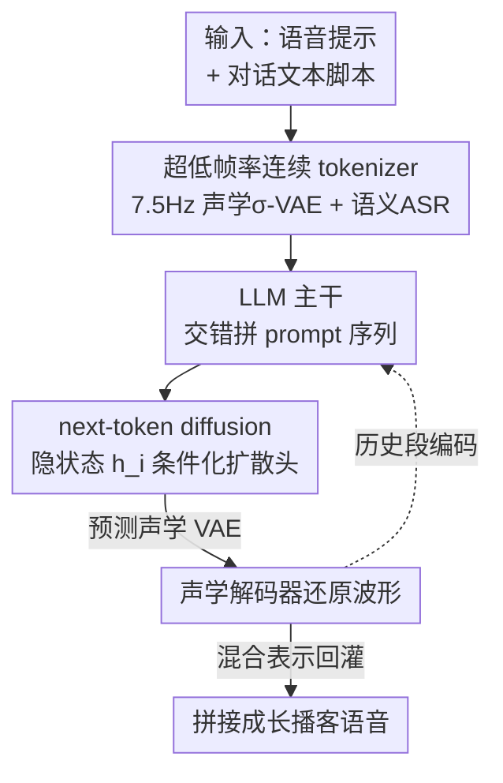

# VibeVoice: Expressive Podcast Generation with Next-Token Diffusion

**会议**: ICLR 2026  
**OpenReview**: [https://openreview.net/forum?id=FihSkzyxdv](https://openreview.net/forum?id=FihSkzyxdv)  
**代码**: https://github.com/microsoft/VibeVoice  
**领域**: 语音合成 / 多说话人 / 扩散模型  
**关键词**: 播客生成, 长时语音合成, next-token diffusion, 连续语音 tokenizer, 多说话人 TTS

## 一句话总结
VibeVoice 用一个超低帧率（7.5 Hz）的连续语音 tokenizer 把长音频压成极短序列，再让 LLM 以「next-token diffusion」方式逐段预测声学隐变量，从而零样本合成最长 90 分钟、最多 4 个说话人、带自然轮流和呼吸/咂嘴等非词汇细节的播客级对话语音。

## 研究背景与动机

**领域现状**：现有 TTS 在单说话人、短句场景下已经能合成高保真自然语音，商业产品（如 Google NotebookLM）也能做播客，但技术方案不公开。

**现有痛点**：把短句逐条合成再拼接（concatenation）虽然技术上能凑出多说话人长音频，但有三个硬伤——长对话里每个说话人的音色会漂移、说话人之间的轮流（turn-taking）和节奏很僵硬、呼吸和咂嘴这类「让人觉得是真人在聊天」的非词汇线索几乎丢失。前作 MoonCast 证明了播客合成可行，但只支持 2 个说话人、约 10 分钟，且在长音频/多说话人时频繁崩溃。

**核心矛盾**：长音频意味着超长 token 序列，传统离散语音 token 帧率高（动辄几十上百 Hz），90 分钟的对话会爆掉 LLM 的上下文，效率和保真度之间存在尖锐的 trade-off；而要维持音色一致和内容连贯，又必须同时保留细粒度声学信息和高层语义信息。

**本文目标**：在可扩展（长时长、多说话人）、说话人一致、对话自然这三件事上同时做到端到端可训练。

**切入角度**：作者的关键观察是——如果能把语音压到极低帧率又不丢保真度，长序列问题就缓解了；而声学和语义本就该解耦，分别用两个 tokenizer 提取再融合，能兼顾「听起来像谁」和「说了什么」。

**核心 idea**：用 7.5 Hz 连续（非离散码本）的声学+语义双 tokenizer 把长音频压成紧凑混合表示，再用 LLM + 轻量扩散头的 next-token diffusion 框架逐段生成声学隐变量。

## 方法详解

### 整体框架
VibeVoice 的输入是每个说话人的语音提示（voice prompt 波形）+ 对话文本脚本，输出是一整段多说话人长语音。整体是一个「LLM 主干 + 扩散头解码」的端到端架构：语音提示经声学 tokenizer 编码成连续 VAE 特征、文本脚本经 embedding 层编码，两者交错拼成 LLM 的 prompt 序列；之后 LLM 自回归地一段一段往下生成，每一步它的隐状态 $h_i$ 去条件化一个轻量扩散头 $D$，由扩散头预测当前语音段的声学 VAE 隐变量，再由声学解码器还原成波形；同时 LLM 还判断当前段是否该结束（发射终止 token）。生成下一段时，已生成段会被同时编码成声学和语义特征融合后回灌进 LLM，形成流式生成。

### 关键设计

**1. 超低帧率连续语音 tokenizer：把 90 分钟压成 LLM 吃得下的序列**

长音频建模的第一道坎是序列太长，VibeVoice 用两个共享 7.5 Hz 帧率的 tokenizer 把这道坎抹平。声学 tokenizer 采用镜像对称的编码-解码结构，编码器用 7 级改造 Transformer block（把 self-attention 换成 1D 深度可分离因果卷积以支持流式），经 6 层下采样实现从 24 kHz 输入累计 3200 倍下采样，最终每秒只有 7.5 个 token——这是它能塞进 90 分钟对话的根本原因。关键在于它不是离散码本，而是工作在连续隐空间：借鉴 LatentLM 的 σ-VAE，编码器只预测均值 $\mu$，方差 $\sigma$ 取预定义分布 $\mathcal{N}(0, C_\sigma)$ 而非可学习量，隐变量通过重参数化 $z = \mu + \sigma \odot \epsilon$ 采样。这样设计是为了规避普通 VAE 在自回归建模下的方差坍缩问题，保证下游 LLM 拿到的声学特征数值稳定。语义 tokenizer 复用同样的编码器结构但去掉 VAE 分量，以 ASR（自动语音识别）为代理任务训练，强迫编码器抽出与文本对齐的语义/音素信息，训练完毕后用于辅助解码的 Transformer 解码层被丢弃。

**2. 混合语音表示：声学管「像谁」、语义管「说什么」**

只用声学特征能保住音色却撑不住内容连贯——消融显示纯声学模型多说话人 WER 高达 6.22。VibeVoice 因此在生成全程同时用上声学和语义两路表示。每一步生成的隐变量按 $z_{p,i} = W_a z_{a,i} + W_s\,\mathrm{SemanticEnc}(y_i)$ 融合：$W_a, W_s$ 是可学习投影矩阵，$z_{a,i}$ 是当前段声学 VAE，$\mathrm{SemanticEnc}(y_i)$ 是把已生成波形过语义编码器得到的语义特征。由于语义特征更贴近文本 prompt，把它引入输入能在长音频生成时稳定整个过程、抑制内容漂移。值得注意的是，语音提示（voice prompt）只经声学编码器进入序列，承担提供目标说话人音色和韵律的职责；而生成回路里则是声学+语义双路回灌，这种「提示纯声学、生成走混合」的不对称设计正好让模型既复刻得了音色又守得住内容。

**3. Next-token diffusion 与轻量扩散头：LLM 出条件、扩散头出声音**

VibeVoice 不让 LLM 直接吐离散语音 token，而是借鉴 LatentLM，在 LLM 之上挂一个轻量扩散头（1.5B 版仅 4 层、约 123M 参数）专门负责高保真声学生成。训练时扩散过程对干净声学 VAE $z_{a,i}$ 加噪 $z_{a,i}(t) = \sqrt{\bar\alpha_t}\,z_{a,i} + \sqrt{1-\bar\alpha_t}\,\epsilon$，扩散头 $\epsilon_\theta$ 以噪声特征、时间步 $t$ 和 LLM 隐状态 $h_i$ 为条件，最小化 L2 噪声预测损失 $\mathcal{L}_{\mathrm{Diff}} = \mathbb{E}\,\|\epsilon - \epsilon_\theta(z_{a,i}(t), t, h_i)\|^2$；扩散头只预测声学 VAE，而 LLM 在产生 $h_i$ 的同时还要判断该段是否结束。推理时用 Classifier-Free Guidance 增强条件：

$$\hat\epsilon = \epsilon_\theta(z_{a,i}(t), t, h_{<S>}) + w\,\big(\epsilon_\theta(z_{a,i}(t), t, h_i) - \epsilon_\theta(z_{a,i}(t), t, h_{<S>})\big)$$

其中无条件分支用起始 token `<S>` 的隐状态，$w$ 是引导系数；再用 DPM-Solver++ 等高效采样器加速去噪。因为每段都只依赖历史上下文生成，VibeVoice 天然是流式模型。

**4. 无增强的长程标注数据管线：保住表达性线索**

训练这种模型需要带长程一致标注（转写 + 说话人轮次）的语音，但以往管线只面向短音频。作者自建自动标注管线，三步走：分段与转写、说话人聚类（diarization）、质量过滤，为海量原始播客生成伪转写和轮流标签。一个反直觉但关键的取舍是——管线刻意不做语音增强（speech enhancement）：作者观察到去噪虽能降噪，却会扭曲信号，尤其是叹词、语气词这类情感韵律线索极易被磨平，反而损害自然度。保留这些「脏」细节正是 VibeVoice 能渲染呼吸、咂嘴等沉浸感线索的前提。

### 损失函数 / 训练策略
训练时声学和语义 tokenizer 冻结，只训 LLM（Qwen2.5 的 1.5B / 7B 版）和扩散头。核心目标是扩散头的 L2 噪声预测损失 $\mathcal{L}_{\mathrm{Diff}}$。LLM 输入长度用课程学习渐进拉长：4,096 → 16,384 → 32,768 → 65,536 token，跨 110k 步（7B 版因资源限制省略最后一阶段）。1.5B 模型在约 800 亿 token 的内部伪标注播客数据上训练，用 64 张 AMD MI300X 约 170 小时。推理时 CFG 取 1.3、去噪步数 10。

## 实验关键数据

### 主实验
在自建的 VibeVoice-Eval（108 条 1–30 分钟播客）上对比专有/开源 SOTA。主观由 24 名标注者打 MOS（真实感 / 丰富度 / 偏好），客观用 WER 和说话人相似度 SIM-O。

| 模型 | 主观平均↑ | WER-W↓ | SIM-O↑ |
|------|-----------|--------|--------|
| Higgs Audio V2 | 2.99 | 5.94 | 0.543 |
| Elevenlabs v3 alpha | 3.40 | 2.39 | 0.623 |
| Gemini 2.5 Pro preview TTS | 3.66 | 1.73 | - |
| VibeVoice-1.5B | 3.54 | **1.11** | 0.548 |
| VibeVoice-7B | **3.76** | 1.29 | **0.692** |

7B 版主观平均最高（3.76），在真实感（3.71）、丰富度（3.81）、偏好（3.75）三维全面领先，超过 Gemini 2.5 Pro 和 Elevenlabs v3；1.5B 版 WER 最低（1.11）说明可懂性极强；7B 版 SIM-O 最高（0.692）说明音色复刻最准。

### 消融实验

| 配置 | 多说话人 WER-W↓ | SIM-O↑ | 说明 |
|------|------|------|------|
| Acoustic-only (1.5B) | 6.22 | 0.68 | 纯声学，音色稳但内容散 |
| Hybrid (1.5B) | 1.84 | 0.64 | 声学+语义融合 |
| VibeVoice-1.5B (64K) | 1.22 | 0.60 | 完整模型 |
| VibeVoice-7B (32K) | **0.66** | **0.75** | 放大到 7B |

### 关键发现
- **语义路是内容连贯的命门**：纯声学模型 SIM-O 还不错（0.68）但 WER 飙到 6.22，加入语义混合后 WER 直接降到 1.84，证明声学特征单独撑不住多说话人对话的内容一致。
- **规模收益巨大**：1.5B → 7B，主观从 3.54 升到 3.76，总体 WER-W 从 2.11 降到 0.66、SIM-O 从 0.59 升到 0.75。
- **可扩展性碾压前作**：长时长（12–30 分钟）下 7B 版仍保持 WER-W 1.24 / SIM-O 0.75，而 MoonCast 在长音频和 ≥3 说话人时频繁崩溃；VibeVoice 支持最多 4 说话人、最长 30 分钟（论文标题宣称可达 90 分钟）。
- **推理超参敏感**：CFG=1.25、去噪 10 步时 WER 最优（1.55）；步数太少（5 步）明显恶化，太多则收益递减。

## 亮点与洞察
- **7.5 Hz 连续 tokenizer 是整个系统的地基**：3200 倍下采样把长序列问题从根上化解，且用连续 σ-VAE 而非离散码本，既避开码本量化损失又规避自回归方差坍缩——这个「极低帧率 + 连续表示」的组合可迁移到任何长音频/长视频生成任务。
- **声学/语义解耦再融合的不对称用法很巧**：voice prompt 只走声学（要音色），生成回路走声学+语义（要连贯），把「像谁」和「说什么」拆给两条路分别负责。
- **「不做语音增强」是反直觉的数据洞察**：业界惯例是先去噪，但作者发现去噪会磨掉情感韵律线索，宁可保留噪声也要留住表达性——提醒做表达性生成时别盲目套用清洗管线。
- **next-token diffusion 让 LLM 只管语义流、扩散头只管声学细节**，分工清晰且扩散头极轻（123M），是把 LLM 接入连续模态的可复用范式。

## 局限与展望
- **数据闭源**：80B token 的播客数据是内部伪标注集合，外部难以复现训练。
- **长度宣称与实测有落差**：标题称 90 分钟、4 说话人，但主表实测多在 30 分钟内，90 分钟更接近上限能力而非充分验证。
- **依赖伪标注质量**：转写和轮次标签由自动管线生成，标注噪声对最终自然度的影响未充分剖析。
- **推理超参需调**：CFG 和去噪步数对 WER/SIM-O 影响明显，部署时要针对场景调参。

## 相关工作与启发
- **vs MoonCast**：同做播客合成，但 MoonCast 限 2 说话人、约 10 分钟且长音频易崩；VibeVoice 靠低帧率连续 tokenizer + next-token diffusion 把规模扩到 4 说话人、更长时长且稳定。
- **vs 拼接式多说话人 TTS（如 CosySvoice2-Concat）**：拼接能凑出多说话人音频但轮流僵硬、音色漂移；VibeVoice 端到端生成，轮流和非词汇线索自然得多。
- **vs LatentLM**：借鉴其 σ-VAE 连续表示和扩散头思路，但针对长时多说话人播客做了混合语义表示和无增强数据管线的专门化。

## 评分
- 新颖性: ⭐⭐⭐⭐ 7.5 Hz 连续 tokenizer + next-token diffusion 用于长时多说话人播客的组合很新，单点多借鉴 LatentLM。
- 实验充分度: ⭐⭐⭐⭐ 主客观对比 + tokenizer/规模/推理超参消融齐全，但数据闭源、90 分钟宣称未充分实证。
- 写作质量: ⭐⭐⭐⭐ 结构清晰、公式完整，部分细节（diarization、附录评估）需翻附录。
- 价值: ⭐⭐⭐⭐⭐ 开源代码+权重，填补了公开播客级长时多说话人 TTS 的空白。

<!-- RELATED:START -->

## 相关论文

- [\[ICLR 2026\] Token-based Audio Inpainting via Discrete Diffusion](token-based_audio_inpainting_via_discrete_diffusion.md)
- [\[ICLR 2026\] MambaVoiceCloning: Efficient and Expressive Text-to-Speech via State-Space Modeling and Diffusion Control](mambavoicecloning_efficient_and_expressive_text-to-speech_via_state-space_modeli.md)
- [\[ICLR 2026\] Scaling Speech Tokenizers with Diffusion Autoencoders](scaling_speech_tokenizers_with_diffusion_autoencoders.md)
- [\[ICLR 2026\] UniSS: Unified Expressive Speech-to-Speech Translation with Your Voice](uniss_unified_expressive_speech-to-speech_translation_with_your_voice.md)
- [\[CVPR 2026\] Hierarchical Codec Diffusion for Video-to-Speech Generation](../../CVPR2026/audio_speech/hierarchical_codec_diffusion_for_video-to-speech_generation.md)

<!-- RELATED:END -->
