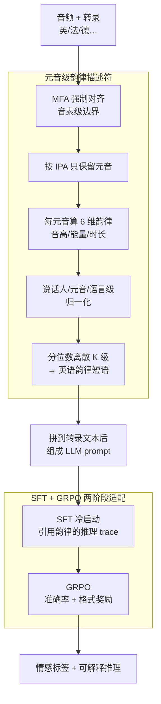

# VowelPrompt: Hearing Speech Emotions from Text via Vowel-level Prosodic Augmentation

**会议**: ICLR 2026  
**arXiv**: [2602.06270](https://arxiv.org/abs/2602.06270)  
**代码**: 无  
**领域**: 语音情感识别  
**关键词**: 语音情感识别, 韵律特征, 元音级, LLM推理, GRPO

## 一句话总结
提出 VowelPrompt，基于语音学证据提取元音级韵律描述符（音高/能量/时长），转为自然语言增强 LLM 的情感识别 prompt，配合 SFT+GRPO 两阶段训练，在零样本/微调/跨域/跨语言条件下一致超越 SOTA，同时生成可解释的情感推理。

## 研究背景与动机

**领域现状**：语音情感识别（SER）经历了 openSMILE 手工特征 → wav2vec/HuBERT 深度自监督特征 → LLM 基于文本 prompt 做情感识别的三代演进。当前两条技术路线并存：Audio LLM（如 Qwen2-Audio）直接处理音频嵌入但不透明；Text-only prompting（如 SpeechCueLLM）用自然语言描述韵律但粒度粗（"说话声很大"）。

**现有痛点**：深度特征不可解释，无法告诉用户"为什么判断为愤怒"；文本 prompt 方法用句子级韵律描述（如"高音、快语速"），丢失了逐音节的细粒度韵律变化——而情感往往集中表达在特定的重读音节上。

**核心矛盾**：如何在保持可解释性的同时达到甚至超越不透明深度特征的性能？

**语音学依据**：元音是情感韵律的主要载体——它们是浊音、声学稳定（有清晰的 F0 和共振峰），且在时间和能量上占据话语的主体部分。相比之下，辅音的韵律贡献较小。

**核心 idea**：提取元音级（逐音素）韵律特征描述符，转为自然语言嵌入 prompt，让 LLM 在词汇语义和局部韵律信息上联合推理。

## 方法详解

### 整体框架
VowelPrompt 把"听情感"重新定义成"读情感"：先从音频里抽出逐个元音的韵律特征，翻译成自然语言挂到转录文本后面，再让一个纯文本 LLM 在词义和局部韵律上联合推理出情感标签和理由。整条链路前半段是确定性的信号处理（对齐、抽特征、归一化、离散化），后半段是 SFT 冷启动加 GRPO 强化的两阶段训练，最终模型只吃文本就能给出带推理痕迹的判断。由于对齐用的 MFA、表示用的 IPA 都是语言无关的，同一条流水线换语言几乎零改造就能跑，这是它跨语言扩展能力的来源。

### 关键设计

**1. 元音级韵律描述符：把情感锚定到最稳的声学载体上**

句子级 prompt（"声音很大、语速快"）丢掉了情感真正爆发的位置——往往是某个重读元音上音高的陡升。VowelPrompt 反其道而行，先用 Montreal Forced Aligner（MFA）把音频和转录对齐到音素级时间边界，再按 IPA 元音集只保留元音段，因为元音是浊音、声学稳定（有清晰的 F0 和共振峰）、且在时长和能量上占据话语主体，是情感韵律的主要载体，辅音贡献相对很小。每个元音段上计算 6 个低层描述符（LLD）：音高均值、音高斜率、音高方差、能量均值、能量方差、时长。为了消除说话人和元音固有差异带来的干扰，特征先做说话人级 z-score 再做元音类型级归一化，这样"这个 /a/ 偏高"才是相对该说话人、该元音的偏高而非绝对值。最后把连续值按分位数离散成 K 级（"非常低/低/中/高/非常高"），映射成自然语言短语，得到逐元音的可读韵律描述，拼接到转录文本之后送进 LLM。离散化既让 LLM 容易消化，也天然产出了可解释的中间表征。

**2. SFT + GRPO 两阶段适配：先学会引用韵律，再学会推得准、答得规整**

直接让 LLM 面对陌生的韵律描述很难自发地把它们用进推理。第一阶段 SFT 用少量训练数据配上 GPT-4o 生成的推理 trace 做冷启动，这些 trace 明确引用了哪个元音的哪个韵律特征导致了判断，用标准交叉熵让 LLM 学会"边读韵律边讲理由"的范式。第二阶段 GRPO 用可验证奖励进一步打磨：总奖励 $R = R_{acc} + R_{format}$，其中 $R_{acc}$ 是预测标签与真值精确匹配的准确率奖励，$R_{format}$ 检查 `<think>`/`<answer>` 标签是否完整，同时加 KL 约束把策略拉住、防止偏离 SFT 参考策略漂走。准确率奖励提升判断质量，格式奖励保证输出结构稳定可解析——后者在消融里贡献了跨域泛化的主要增益（+2.7% WA）。

**3. 多语言零改造扩展：用统一 IPA 和英语描述借多语言 LLM 的跨语言能力**

SER 的跨语言迁移通常要重训，VowelPrompt 几乎零改造就能跨语言。MFA 本身支持 20+ 语言的对齐，元音统一用 IPA 表示，归一化改成语言级，于是法语、德语的音频也能抽出同构的元音韵律描述。关键技巧是即便输入是法语或德语，韵律描述仍用英语书写，从而直接复用多语言 LLM 已有的跨语言对齐能力，无需为每种语言单独训练情感模型。这也是它在法语 CaFE（+8.3%）、德语 EmoDB（+7.7%）上仍大幅领先的原因。

## 实验关键数据

### 主实验

| 数据集 | 条件 | VowelPrompt | 之前SOTA | 提升 |
|--------|------|-----------|---------|------|
| IEMOCAP | 微调 | 72.8% WA | 68.5% | +4.3% |
| MELD | 零样本 | 52.1% WA | 46.3% | +5.8% |
| CaFE (法语) | 跨语言 | 62.4% | 54.1% | +8.3% |
| EmoDB (德语) | 跨语言 | 78.9% | 71.2% | +7.7% |

### 消融实验

| 配置 | IEMOCAP WA | 说明 |
|------|-----------|------|
| VowelPrompt 完整 | 72.8% | full |
| w/o 韵律描述符 | 65.3% | 仅文本 |
| w/o GRPO | 70.1% | 仅 SFT |
| 辅音级特征 | 68.7% | 元音 > 辅音 |
| 随机打乱韵律 | 58.2% | 确认非伪相关 |

### 关键发现
- 元音级韵律比句子级粗粒度描述显著更好（IEMOCAP zero-shot: +1.2% UACC over SpeechCueLLM）
- GRPO 阶段提升 +2.7% WA，主要改善格式遵从和跨域泛化
- 反事实实验（打乱韵律描述顺序、置换韵律到错误元音）确认模型真的在用韵律信息而非伪相关
- 元音级特征优于辅音级特征（消融对比），且两者组合无显著提升——说明元音已捕获主要情感线索
- 跨语言泛化：从英语微调的模型在法语 CaFE（+8.3%）和德语 EmoDB（+7.7%）上均有效
- 匹配边缘分布的安慰剂实验排除了统计假象——随机韵律描述性能降至随机水平
- 人工评估：推理 trace 中的韵律引用被标注者评为"语言学合理"的比例 >85%

## 亮点与洞察
- **可解释的情感推理**：LLM 输出的 \<think\> 推理 trace 明确引用了哪个元音的哪个韵律特征导致了判断——人工评估认为 >85% 的推理在语言学上合理
- **text-only 部署**：推理时只需转录+韵律描述文本，无需音频编码器在 GPU 上运行——大幅降低部署复杂度
- **GRPO 的价值**：不仅提升准确率，更关键的是保证输出格式一致性（\<think\>/\<answer\> 标签）——这对生产环境至关重要
- **元音作为情感锚点**的语言学假设被实验充分验证——元音级 > 辅音级 > 句子级
- **无需音频编码器的部署优势**：推理时仅需文本 LLM，韵律信息以文本形式传入，大幅简化部署架构

## 局限与展望
- 依赖强制对齐质量——MFA 在嘈杂环境或非标准语音中的对齐精度会下降
- 韵律描述从音频提取，推理时仍需音频输入（虽然 LLM 推理本身是 text-only，但前处理需要音频）
- 仅测试了 IEMOCAP、MELD 等少数 SER 基准，更多领域（如客服、心理健康）待验证
- 元音级特征在声调语言（如中文）中的表现未探索——声调与情感的交互可能更复杂
- GRPO 的超参数（如 KL 系数）对跨域泛化的影响需要系统性消融

## 相关工作与启发
- **vs SpeechCueLLM**：同样用自然语言描述韵律，但 SpeechCueLLM 仅用句子级粗粒度描述，VowelPrompt 精确到每个元音
- **vs Emotion-LLaMA**：Emotion-LLaMA 直接融合音频嵌入到 LLM，不可解释；VowelPrompt 的中间表征完全可读
- **vs wav2vec/HuBERT**：深度特征性能强但不透明；VowelPrompt 在部分基准上超越它们且提供推理解释
- **启发**：text-augmented speech understanding 是值得深入的范式——将音频信息"翻译"为自然语言，利用 LLM 的推理能力

## 评分
- 新颖性: ⭐⭐⭐⭐⭐ 元音级韵律+LLM 推理的巧妙结合，语言学动机明确
- 实验充分度: ⭐⭐⭐⭐⭐ 5 数据集+15 个消融/反事实实验，覆盖零样本/微调/跨域/跨语言
- 写作质量: ⭐⭐⭐⭐ 详细全面但篇幅略长
- 价值: ⭐⭐⭐⭐⭐ 可解释+高性能+跨语言，对 SER 领域有实质推动

<!-- RELATED:START -->

## 相关论文

- [\[ICLR 2026\] Beyond Instance-Level Alignment: Dual-Level Optimal Transport for Audio-Text Retrieval](beyond_instance-level_alignment_dual-level_optimal_transport_for_audio-text_retr.md)
- [\[ACL 2026\] Data-efficient Targeted Token-level Preference Optimization for LLM-based Text-to-Speech](../../ACL2026/audio_speech/data-efficient_targeted_token-level_preference_optimization_for_llm-based_text-t.md)
- [\[ICLR 2026\] Towards True Speech-to-Speech Models Without Text Guidance](towards_true_speech-to-speech_models_without_text_guidance.md)
- [\[ICLR 2026\] EchoMind: An Interrelated Multi-level Benchmark for Evaluating Empathetic Speech Language Models](echomind_an_interrelated_multi-level_benchmark_for_evaluating_empathetic_speech_.md)
- [\[ICLR 2026\] Scalable Multilingual Multimodal Machine Translation with Speech-Text Fusion](scalable_multilingual_multimodal_machine_translation_with_speech-text_fusion.md)

<!-- RELATED:END -->
