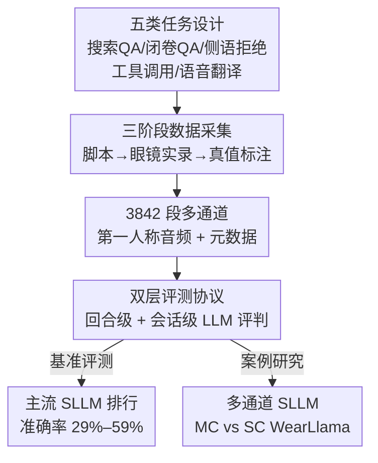

# WearVox: An Egocentric Multichannel Voice Assistant Benchmark for Wearables

**会议**: ICLR 2026  
**OpenReview**: [https://openreview.net/forum?id=QpaNErg7ug](https://openreview.net/forum?id=QpaNErg7ug)  
**代码**: https://github.com/facebookresearch/wearvox  
**领域**: 语音 / 语音大模型 / 基准测试  
**关键词**: 可穿戴语音助手, 第一人称音频, 多通道音频, 语音大模型, 基准测试

## 一句话总结
WearVox 用 AI 眼镜采集了 3842 段第一人称、多通道的真实佩戴场景音频，覆盖搜索问答、闭卷问答、侧语拒绝、工具调用、语音翻译五类任务，系统评测了主流语音大模型（SLLM），发现实时模型准确率只有 29%–59% 且在户外噪声下严重退化，并通过一个多通道 SLLM 案例研究证明空间音频线索能显著提升抗噪与设备定向语音判别能力。

## 研究背景与动机
**领域现状**：语音助手正从手机、智能音箱上的"按需触发"工具，演化成 AI 眼镜这类随身佩戴、始终在线、解放双手的协作者。用户一边走路、通勤、社交，一边对眼镜下达指令，交互变得高频、碎片化，而且发生在真实开放的声学环境里。

**现有痛点**：现有语音助手基准（VoiceBench、Spoken-CoQA、Spoken-SQuAD、AudioBench、MMAU 等）几乎都用 TTS 合成语音或干净的通用对话音频，且都是单通道。它们完全不覆盖可穿戴场景特有的复杂性——运动和风噪污染的第一人称音频、对延迟极度敏感的微交互、以及把"对设备说的话"从旁人闲聊和背景噪声里区分出来的需求。

**核心矛盾**：评测数据与真实部署环境之间存在巨大的分布鸿沟。模型在干净合成语音上"看起来很强"，但一旦面对眼镜麦克风阵列采到的、混着风声/车流/旁人对话的多通道音频，能力会断崖式下降——而现有基准根本测不出这种退化。

**本文目标**：构建第一个面向可穿戴计算的语音助手基准，要同时满足第一人称、多通道、含真实对话动态（侧语、非设备定向语音）、环境多样四个条件，并据此系统刻画当前 SLLM 的能力边界。

**切入角度**：作者认为可穿戴语音助手的核心难点不在"听清一句干净的话"，而在"在嘈杂多人场景里判断哪句话是对我说的、并据此正确响应"。多通道（空间）音频线索恰恰是单通道基准丢掉、却对这一判别至关重要的信息。

**核心 idea**：用真实 AI 眼镜采集多通道第一人称音频，把任务、说话人角色、声学条件三个维度都做满，做成可严格评测可穿戴语音助手的测试床；再用一个多通道 SLLM 案例验证空间音频确实带来增益。

## 方法详解

### 整体框架
WearVox 本质是一套"数据集 + 评测协议 + 多通道案例研究"的基准。数据侧用三阶段流水线产出 3842 段眼镜实录对话：先做脚本收集确定五类任务和真实场景，再请母语者戴眼镜在室内外多环境实录多通道音频，最后做真值标注。评测侧把五类任务统一形式化为"文本输入 + 语音输入 → 文本输出"$f(T_I, S_I) \to T_O$，分回合级（turn-based）和会话级（session-based）两种打分。最后作者自己训练一个多通道 SLLM（MC WearLlama）与其单通道版本（SC WearLlama）对比，回答"多通道音频相比波束成形后的单通道是否还有额外价值"这一核心研究问题。

### 关键设计

**1. 五任务体系：把可穿戴助手的真实功能拆成可评测的题型**

现有基准多停留在通用问答，测不出佩戴场景特有的能力。WearVox 设计了五类任务，覆盖从信息获取到设备控制再到多语沟通的完整谱系：搜索增强问答（长尾、时效性强的事实问题，需结合外部检索结果回答）、闭卷问答（仅靠模型内部知识回答的热门静态事实）、工具调用（根据请求生成 JSON 格式的 API 调用，提供日历、网搜、本地搜索、音乐播放器等 8 个预定义工具）、侧语拒绝（识别并忽略非设备定向语音，输出特殊控制 token 如 `[Mute]` 来抑制下游 TTS）、双向语音翻译（佩戴者与不同语言的对话伙伴交流，模型需同时做说话人分离和翻译）。五类任务都统一成 $f(T_I, S_I) \to T_O$ 的形式，其中文本输入 $T_I$ 给任务描述和必要上下文（检索结果、工具定义），语音输入 $S_I$ 是真实录音，输出 $T_O$ 是答案/工具调用/控制 token/带说话人标注的译文。这套设计的价值在于：侧语拒绝和工具调用共享同一提示，模型必须对有效请求生成工具调用、对侧语生成控制 token，直接逼出"是否对我说话"的判别能力——这正是单通道通用基准缺失的维度。

**2. 三角色 × 多声学条件：在数据里灌入真实的对话动态与噪声谱**

要测出真实退化，数据本身必须脏得真实。WearVox 引入三类说话人角色：佩戴者（发起大部分设备定向请求，在翻译任务中作为双语对话的一方）、对话伙伴（与佩戴者多轮交流、说不同语言，是翻译任务里说话人分离的关键）、旁观者（贡献偶发的背景语音，是侧语拒绝任务的主要干扰源）。三者在不同角度和距离就位，自然制造出直接提问、打断、侧语、非助手定向语音等真实对话动态。声学维度上，约 31% 对话录于室内（办公室、咖啡馆、走廊），63% 录于户外（街道、公园、停车场、车内、施工区），58% 在嘈杂环境、42% 在安静环境，含 13 种噪声类型（落叶沙沙声到施工噪声），并系统性地变化信噪比从安静耳语到地铁/摩托车的高噪场景。每段音频都附带参与者位置、距离、环境的细粒度元数据，使得后续能按环境/噪声切片做精细分析。

**3. 三阶段采集流水线：让实录音频既真实又可标注**

数据来自三个串行阶段。脚本收集阶段，问答类问题直接复用 CRAG 和 Head-to-tail 数据集（按热门静态/长尾时变切成闭卷与搜索两类），其余三类任务先设计代表性场景再由标注者借助 LLM（Llama 3.3 70B）扩写成多轮对话。第一人称录音阶段，针对翻译任务雇佣意大利语/西班牙语/葡萄牙语/德语/法语母语者（同时懂英文脚本），其余任务用英语母语者；每段 2–3 人协作，脚本只作参考、鼓励"松散跟读"以保证语音自然口语化而非逐字朗读。真值标注阶段，翻译任务转写并提供译文，工具任务标注对应 API 调用，问答任务复用 CRAG/Head-to-Tail 原标签，非设备定向样本统一标 `[Mute]` token。这条流水线的巧妙之处在于把"真实性"和"可标注性"两个常相互矛盾的目标分阶段解耦：脚本保证可控可标注，松散跟读保证自然真实。

**4. 多通道 SLLM 案例研究：验证空间音频线索的增益**

现有 SLLM 都在单通道上训练，作者把多通道录音波束成形（beamforming）成单通道喂给它们评测，但这丢掉了空间信息。为回答"多通道是否还有额外价值"，作者基于 Llama-4-Scout-17B-16E 加一个 1B 参数、用 BEST-RQ 预训练的 Conformer 语音编码器，按 AudioChatLlama 的语音对齐方法训练：从 ASR 数据出发让 Llama-4 据转写生成回复，配成合成语音问答数据，与 ASR 数据一起训练 LLM 和音频投影层（编码器冻结）。为支持原生多通道，作者把单通道音频按 AI 眼镜麦克风阵列配置仿真成五通道，用真实房间冲激响应（RIR）建模空间差异，并在 −5 dB 到 40 dB 随机信噪比下加室内噪声、混入不同重叠比例的旁人语音。波束成形单通道训练出 SC WearLlama，多通道训练出 MC WearLlama——后者交错处理通道 0（通常信噪比最高的通道 $c_0$）和波束成形通道 $c_x$，而前者只处理 $c_x$。对比直接量化了空间线索对"把用户语音从背景干扰里分出来"的贡献。

## 实验关键数据

### 主实验
回合级任务（搜索QA/闭卷QA/工具调用/侧语拒绝）报告微平均准确率，语音翻译为会话级评分。问答用 LLM 评判（沿用 CRAG 自动评测，与人工一致率 >98%），工具调用用 AST 结构比对，侧语拒绝用二分类准确率，翻译由 LLM 评判说话人分离+翻译质量并对缺失/幻觉轮次扣分（与人工评分 Pearson $r=0.89$）。

| 模型 | 搜索QA | 闭卷QA | 工具调用 | 侧语拒绝 | 回合级微平均 | 语音翻译 |
|------|--------|--------|---------|---------|------------|---------|
| Gemma 3n | 29.4 | 20.4 | 5.7 | 59.9 | 29.7 | 14.8* |
| Kimi-Audio | 10.1 | 31.5 | 6.3 | 47.0 | 43.6 | 41.8* |
| Qwen2.5-Omni | 35.8 | 29.8 | 7.3 | 60.4 | 33.1 | 43.9* |
| GPT-4o Audio | 50.5 | 59.4 | 8.9 | 66.0 | 43.1 | 76.0 |
| GPT-5 w/ Whisper | 57.8 | 70.6 | 35.7 | 73.8 | 57.8 | 92.9* |
| Gemini 2.5 Flash | 49.0 | 46.8 | 44.4 | 88.2 | 59.8 | 50.3 |
| Gemini 2.5 Flash Thinking | 48.8 | 61.4 | 68.1 | 91.4 | **71.3** | 70.1 |

开源模型（均 <8B）整体偏弱，尤其搜索问答和工具调用；GPT-4o Audio 因偏向音频输入输出、结构化文本能力未充分优化，工具调用仅 8.9%。Gemini 2.5 Flash 开启思考模式后五项里四项提升、回合级从 59.8% 升到 71.3%、翻译从 50.3% 升到 70.1%，但代价是首 token 延迟（TTFT）从平均 1592 ms 飙到 5546 ms，对可穿戴实时体验是硬伤。

### 多通道案例研究（消融）
| 模型 | 搜索QA | 闭卷QA | 工具调用 | 侧语拒绝 | 回合级微平均 |
|------|--------|--------|---------|---------|------------|
| SC WearLlama（单通道） | 43.3 | 42.5 | 58.5 | 85.4 | 61.9 |
| MC WearLlama（多通道） | 43.3 | 42.2 | 63.9 | **93.9** | **66.4** |

多通道在工具调用（58.5%→63.9%）和侧语拒绝（85.4%→93.9%）上明显提升，整体从 61.9% 升到 66.4%；两个 QA 任务几乎持平。作者解释：多通道增益主要体现在"把设备定向语音从背景干扰里分出来"的场景，而 QA 多录于安静室内，空间线索价值被稀释。

### 关键发现
- **空间音频是设备定向判别的关键**：MC WearLlama 在侧语拒绝上 +8.5 个点，且在户外噪声下比 SC 高约 5% 准确率、室内安静则持平——增益高度集中在噪声/多人干扰场景。
- **户外噪声普遍掉点**：Gemma 3n、Qwen2.5-Omni、GPT-4o、Gemini 2.5 Flash、GPT-5 w/Whisper 在户外掉 3%–15%，Gemma 因模型最小退化最大；Kimi-Audio 因预训练含噪声/干净均衡数据反而户外更强。
- **推理模型天生抗噪**：Gemini 2.5 Flash Thinking 在户外嘈杂条件下准确率甚至略超室内安静，提示推理增强的语音模型对真实噪声更鲁棒——但延迟是代价。

## 亮点与洞察
- **多通道 vs 波束成形的对照实验设计很干净**：通过仿真五通道 + RIR + 噪声/旁人增强，把"空间信息"作为唯一变量单独剥离出来评测，直接量化了被现有单通道范式丢弃的那部分价值。
- **侧语拒绝任务把"是否对我说话"显式题面化**：让它和工具调用共享提示、要求模型在工具调用与 `[Mute]` token 间二选一，是个可迁移的评测构造——任何需要意图门控的多人语音系统都能借用。
- **"松散跟读"采集策略**：用脚本保证可标注、用宽松跟读保证自然，是真实人声数据集在"可控"与"真实"间常见两难的一个务实折中，可复用到其他实录语音/对话数据集构建。
- **延迟-质量权衡被量化点名**：思考模式 +12 个点准确率却 3.5 倍延迟，直接把"可穿戴端实时性 vs 响应质量"这一未解权衡摆上台面，为后续研究指明方向。

## 局限与展望
- **单一硬件平台**：全部数据来自 Meta AI 眼镜的一种麦克风阵列几何，跨设备/跨阵列的可迁移性未验证；作者将多硬件平台列为未来工作。
- **纯音频、缺多模态**：未纳入摄像头视觉、IMU 运动等可穿戴设备天然具备的信号——视觉可辅助说话人识别与物体接地，IMU 可通过头部朝向/手势辅助判别设备定向语音。
- **翻译任务简化为离线整段**：以"离线与同传性能高度相关"为假设只评测整段对话翻译，回避了同传场景；同时部分开源模型因音频编码器上下文限制把翻译输入截断到 30 秒，跨模型翻译分数不完全可比。
- **规模相对小**：3.8K 对话小于多数合成基准（动辄数万到二十万），胜在真实多通道；但统计功效和长尾覆盖受限。

## 相关工作与启发
- **vs VoiceBench / AudioBench / MMAU**：它们扩展到指令跟随、副语言、声学场景感知乃至音乐推理，但仍是单通道、非第一人称、以合成或通用对话音频为主；WearVox 首次聚焦可穿戴、用第一人称多通道真实录音补上对话动态这一维度。
- **vs CAVA / FDX-bench**：这两者强调实时对话（轮流、延迟、双工），WearVox 与之互补——不主打双工时序，而主打空间音频与真实声学环境下的设备定向判别。
- **vs Spoken-SQuAD / Spoken-CoQA / HeySQuAD / LibriSQA**：早期工作把 SQuAD/CoQA 用 TTS 或朗读扩展到语音域，本质仍是干净单通道问答；WearVox 的难度来自真实噪声与多人干扰而非问题本身。
- **vs Moshi / SALMONN-omni / SyncLLM 等全双工 SLLM**：这些模型推动"边听边说"，WearVox 则从评测侧引入多通道 SLLM，补上空间音频角色的洞察，为全双工模型提供更真实的可穿戴测试床。

## 评分
- 新颖性: ⭐⭐⭐⭐⭐ 首个第一人称多通道可穿戴语音助手基准，空间音频维度此前被普遍忽略。
- 实验充分度: ⭐⭐⭐⭐ 覆盖 7 个主流 SLLM + 自建多通道案例 + 按环境/噪声切片分析，但规模偏小、单一硬件。
- 写作质量: ⭐⭐⭐⭐ 任务、角色、声学条件三维度组织清晰，评测协议交代到位。
- 价值: ⭐⭐⭐⭐⭐ 直指可穿戴语音 AI 真实部署的核心痛点，开源数据与代码可直接推动社区研究。

<!-- RELATED:START -->

## 相关论文

- [\[ACL 2026\] Still Between Us? Evaluating and Improving Voice Assistant Robustness to Third-Party Interruptions](../../ACL2026/audio_speech/still_between_us_evaluating_and_improving_voice_assistant_robustness_to_third-pa.md)
- [\[ACL 2025\] Does Your Voice Assistant Remember? Analyzing Conversational Context Recall and Utilization in Voice Interaction Models](../../ACL2025/audio_speech/does_your_voice_assistant_remember_analyzing_conversational_context_recall_and_u.md)
- [\[ACL 2025\] Distilling an End-to-End Voice Assistant Without Instruction Training Data](../../ACL2025/audio_speech/distilling_an_end-to-end_voice_assistant_without_instruction_training_data.md)
- [\[ICLR 2026\] SiNGER: A Clearer Voice Distills Vision Transformers Further](singer_a_clearer_voice_distills_vision_transformers_further.md)
- [\[ICLR 2026\] UniSS: Unified Expressive Speech-to-Speech Translation with Your Voice](uniss_unified_expressive_speech-to-speech_translation_with_your_voice.md)

<!-- RELATED:END -->
