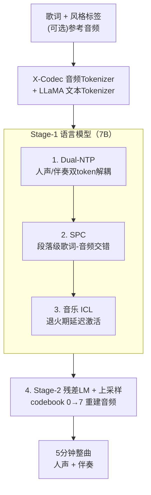

# YuE: Scaling Open Foundation Models for Long-Form Music Generation

**会议**: ICLR 2026  
**OpenReview**: [https://openreview.net/forum?id=hZy6YG2Ij8](https://openreview.net/forum?id=hZy6YG2Ij8)  
**项目页**: [map-yue.github.io](https://map-yue.github.io/)  
**代码**: https://github.com/multimodal-art-projection/YuE （⚠️ 以原文/项目页为准）  
**领域**: 音频生成 / 音乐生成 / 自回归语言模型  
**关键词**: 长篇音乐生成、歌词到歌曲、轨道解耦、上下文学习、X-Codec

## 一句话总结
YuE 把 LLaMA2 架构扩到万亿 token、训练出首个开源「歌词→整首歌」基础模型，靠**双 token 轨道解耦**（人声/伴奏分开预测）、**结构化渐进式条件**（歌词与音频按段落交错）和**为音乐重设计的上下文学习**三招，生成长达 5 分钟、歌词对齐且人声生动的歌曲，音乐性上追平甚至超过部分商用系统（如 Udio、Tiangong）。

## 研究背景与动机

**领域现状**：神经音乐生成里，「lyrics-to-song」（从歌词生成带人声和伴奏的完整歌曲）是最难的任务之一。商用系统 Suno、Udio 已展示出可观效果，但闭源、技术不透明；开源侧（Jukebox、MusicLM 等）大多只能生成约 30 秒的纯器乐片段，一旦加人声就歌词语义混乱。

**现有痛点**：作者把 lyrics-to-song 的难点归为四点——① **长程依赖**：音乐结构跨越数分钟，模型难以保持长时连贯；② **信号复杂**：音乐是多声部的，人声与多种乐器要精确协调，不像语音或环境声那么单一；③ **语言畸变**：演唱会改变音素、时长和韵律，和说话差异巨大，歌词-旋律对齐困难；④ **数据稀缺**：缺少大规模高质量的「歌词-人声-伴奏」配对数据。

**核心矛盾**：现有 LM-based 方法用**单个 codebook-0 token 表示每一帧音频**，强行让一个 token 同时承载人声和伴奏两路差异极大的信号。在伴奏能量远大于人声的曲风（如金属乐，VAR 很低）里，残差量化（RVQ）压缩会严重丢失人声的语言信息，导致歌词听不清。而长上下文条件（把歌词全文 prefix 在前面）也会随音频 token 变长而失效——实测约 3K token 开始退化，6K token 后彻底崩。

**本文目标**：造一个开源、可扩展、能生成 5 分钟整曲且歌词对齐的基础模型，同时解决「双轨信号纠缠」和「长程歌词跟随」两个核心问题，并赋予风格克隆/双向创作等可控能力。

**切入角度**：与其魔改 LM 架构或把人声/伴奏做成串行两阶段（带来延迟和误差传播），不如**在不改 LLaMA2 架构的前提下**，用「显式源分离先验」和「音乐结构先验」去重塑 token 序列的组织方式——把先验编进数据/序列，而非编进模型。

**核心 idea**：每个时间步输出**两个 token**（人声 + 伴奏）来解纠缠；把全曲按 intro/verse/chorus 等段落切开、让**歌词文本和音频 token 交错排列**来维持长程对齐；再为音乐**重新定义 ICL**（去掉参考文本、支持双向、退火期才注入）来获得风格迁移与可控性。

## 方法详解

### 整体框架

YuE 是基于 LLaMA2 的自回归语言模型框架，整体是**两阶段**：给定指令、风格标签、歌词（以及可选的参考音频），先由 **Stage-1 LM（7B）** 把它建模成自回归的「下一 token 预测」任务，生成语义最丰富的底层音频 token（RVQ 的 codebook-0）；再由 **Stage-2 LM（2B）** 在严格时间对齐的前提下，把 codebook-0 补全为全部 8 个 codebook（0–7）的残差 token；最后经反 token 化与轻量上采样还原成波形，输出最长 5 分钟、人声+伴奏齐全的整曲。

Stage-1 内部正是三项核心贡献的发生地：**Dual-NTP** 决定每个时间步吐两个 token（人声/伴奏），**SPC** 决定歌词与音频 token 在全曲尺度如何交错排布，**音乐 ICL** 决定如何在退火期注入参考音频以激活风格克隆/双向创作。音频用 **X-Codec**（语义-声学融合 token，收敛更快）做 tokenizer，文本用扩展过的 LLaMA 词表。

### 关键设计

**1. Track-Decoupled Next-Token Prediction（Dual-NTP）：把一帧拆成人声+伴奏两个 token**

针对「单 token 同时扛人声和伴奏、低 VAR 曲风下歌词被伴奏淹没」的痛点。标准 NTP 把音频序列 $x_{1:T}$ 因子化为 $P(x_{1:T})=\prod_{t=1}^{T} P(x_t\mid x_{<t};\theta)$，每个 $x_t$ 是一帧的单个 token——这在纯 TTS 或纯 TTM 上没问题，但 lyrics-to-song 要同时编码人声和伴奏时就崩了。YuE 引入**源分离先验**，把每个时间步显式拆成两个 token：人声 $v_t$ 和伴奏 $a_t$，序列变成 $(v_1,a_1,v_2,a_2,\dots,v_T,a_T)$，联合概率因子化为

$$P(v_{1:T},a_{1:T})=\prod_{t=1}^{T} P(v_t\mid v_{<t},a_{<t};\theta)\times P(a_t\mid v_{\le t},a_{<t};\theta).$$

这个分解的好处是**无需改 LM 架构**就能在标准自回归解码框架里实现，从而直接复用成熟的预训练基建、天然可扩展；同时人声和伴奏在同一次前向里被联合建模，避免了串行两阶段方法的轨道同步问题、延迟与误差传播。实验上 Dual-NTP 收敛到更低的训练 loss（同数据同算力下比标准 NTP 低约 0.4），并在金属乐这类难例上保持稳健的歌词可懂度。

**2. Structural Progressive Conditioning（SPC）：用音乐段落结构把歌词和音频交错排布**

针对「prefix 歌词条件随音频变长失效（>3K token 退化、>6K token 崩溃）」的痛点。作者试过加大 RoPE base（10K→100K）和课程学习（逐步加长音频）都无效。SPC 的思路是利用音乐天然的**段落结构先验**：歌曲由 intro / verse / chorus / bridge / outro 等段落组成，用 all-in-one 工具自动把歌曲切成段（多数段短于 30 秒）。**每个段落内**把对应的文本条件（歌词 + 结构标签）与该段音频配对；从全曲视角看，结构化文本与音频 token 是**交错（interleaved）**排列的——一个文档先给出指令、标签、完整歌词，随后是一串「歌词段-音频段」交替。这样每段的歌词条件离它要约束的音频很近，避免了把全部歌词堆在最前面、再让模型隔几千 token 去对齐的难题。消融里 SPC 在 30s–150s 各时间区间的 WER 都稳定优于 Vanilla / Curriculum / ABF。

**3. Redesigned Music In-Context Learning（ICL）：去参考文本、双向、退火期延迟激活**

针对「语音式 ICL 直接搬到音乐上水土不服」的痛点。语音 ICL 通常用「参考文本+输入文本+参考音频+生成音频」的续写式构造，但放到音乐上有三个问题：① 要求参考音频配文本转写，而音乐里歌词常常不可得或难获取；② 续写是单向的，限制了「从一小段动机写出整曲」这类双向创作；③ 续写强约束风格与内容，音乐又多结构性重复，模型容易直接复刻参考旋律甚至整段，带来版权风险。YuE 把 ICL 重新定义为在 SPC 数据前**直接拼一段随机采样的 30s 参考音频 token**：$D_{icl}=A_{ref}\circ D_{spc}$，去掉了参考文本、支持双向。关键的工程经验是**延迟激活策略**：ICL 是强条件、属于「容易」数据，过早注入会诱发捷径学习（模型直接抄参考音频、连歌词控制都失灵，且一旦发生难以恢复），所以只在**退火阶段**注入少量 ICL 数据（约 10B token，约占总预训练成本的 2%），此前完全不用。这样才换来文本与参考音频之间的**解耦控制**——例如用日语 city pop 女声做参考，可把歌词换成英文、保留同一歌手与曲风，甚至生成男声 rap 版本。

**4. Tokenization 与 Stage-2 残差建模：把 codebook-0 补全为全分辨率音频**

针对「Stage-1 只产出语义底层 token、还原不出高保真音频」的需求。文本词表用 LLaMA tokenizer（处理指令、曲风、歌词），并扩展词表容纳音频 token；音频 tokenizer 用 **X-Codec**，把语义与声学信息融进同一 token 以加快收敛，外加一个轻量上采样模块。**Stage-2 LM** 在严格时间对齐的流上联合预测全部 $K=8$ 个 codebook：它先读完整条 codebook-0，再逐帧吐出 8 元组，让语义与残差细节对齐；训练用 teacher forcing，推理时把 codebook-0 钳制为 Stage-1 的输出、只生成残差 codebook 1–7，从而在精修音质的同时保持时间对齐不被破坏。

### 损失函数 / 训练策略
- **多任务预训练**：联合 TTS、lyrics-to-song、无条件音乐生成三类任务，共同培养人声与器乐建模能力；数据用 70k 小时语音 + 650k 小时 CC 授权音乐。退火前混合比例 条件:无条件 = 3:1、音乐:语音 = 10:1；退火阶段只用 SPC 与 ICL 数据，比例 SPC:ICL = 2:1。
- **规模化**：多数 Stage-1 实验用 0.5B 模型 + 100B token；放大时 token 预算增到 500B、模型扩到 0.5B/2B/7B。最终 7B 模型用 1.75T token、16K 上下文训练，再加 40B token 退火；Stage-2 用 2T token、8K 上下文。全局 batch size 768，最大学习率 3e-4 线性 warmup，退火期降到 3e-5。
- **测试期技巧**：采样 + Classifier-Free Guidance（CFG）提升「好样本率」；ICL 用歌曲副歌作为前缀增强音乐性与稳定性。

## 实验关键数据

### 主实验（模型客观指标对比，Table 1）

| 系统 | KL↓ | FAD↓ | CE↑ | CU↑ | PC↑ | PQ↑ | CLAP↑ | CLaMP 3↑ |
|------|------|------|------|------|------|------|--------|----------|
| Hailuo | 0.756 | 2.080 | 7.350 | 7.737 | 6.793 | 8.132 | 0.265 | 0.106 |
| SunoV4 | 0.620 | 1.544 | 7.474 | 7.813 | 6.601 | 8.120 | 0.265 | 0.160 |
| Tiangong | 0.708 | 2.547 | 7.421 | 7.766 | 6.060 | 8.220 | 0.244 | 0.114 |
| Udio | 0.503 | **1.222** | 7.112 | 7.520 | 6.626 | 7.803 | **0.310** | 0.156 |
| **YuE** | **0.372** | 1.624 | 7.115 | 7.543 | 6.280 | 7.894 | 0.118 | **0.240** |

- **人类评测**：40 位评委（含 12 位语音/音乐 AI 专家、7 位受训音乐人）做 A/B 测试。YuE 在平均人类偏好与音乐性上**与 Tiangong、Udio 打平，明显超过 Hailuo，落后于最强的 Suno V4**。
- **分布匹配**：YuE 的 KL（0.372）最优、FAD（1.624）有竞争力；CLaMP 3 对齐分（0.240）最高，但 CLAP 分（0.118）偏低——作者归因于 CLAP 对歌唱/音乐内容暴露不足，未必反映人类感知（⚠️ 以原文为准）。
- **人声灵活度 / 时长**：YuE 的歌曲级人声音域中位数约 27 个半音，逼近 Suno V4 等顶级闭源系统；生成时长分布最长最宽，体现长程结构建模能力。

### 消融实验

| 配置 | 关键指标 | 说明 |
|------|---------|------|
| **Dual-NTP** vs 标准 NTP | 训练 loss 低约 **0.4** | 同 20B token、同算力的两个 0.5B 模型；Dual-NTP 收敛更快、低 VAR 曲风歌词更稳 |
| **SPC** vs Vanilla/Curriculum/ABF | 30–150s 各区间 WER 全面更低 | Vanilla/Curriculum 失败主因是生成器乐前奏、演唱起点漂移偏离歌词条件 |
| 模型规模 0.5B→7B（SPC） | WER 从 ~70% 降到 ~20% | scaling 同时提升音乐性与歌词跟随 |
| **ICL** vs SPC（测试期，YuE-7B） | 音乐性胜率 0.63 vs 0.21 | ICL 把解码 token 空间限制到「音乐友好子空间」 |
| **ICL+CFG** | 胜率 **0.79**（最高） | CFG 放大文本条件对 next-token logits 的影响，进一步对齐 prompt |

### 关键发现
- **Dual-NTP 的收益来自源分离先验**：作者定义 VAR（人声-伴奏能量比，$\text{VAR}=10\log_{10}\sum v^2(n)-10\log_{10}\sum a^2(n)$ dB），发现混音轨重建在 VAR 越低时 WER 涨得越猛（约 -8.0 dB 时 ΔWER 超 20%），而人声轨重建对 VAR 退化更鲁棒（最坏约 10%），证明把人声单独建模能保住歌词可懂度。
- **ICL 必须延迟到退火期**：过早注入会诱发捷径学习（直接抄参考音频、歌词控制失灵且难恢复），这是把 ICL 仅放进退火期的根本原因。
- **scaling 是硬道理**：0.5B→7B 在音乐性和歌词跟随上都有清晰增益，7B 还涌现出颤音、美声、死亡金属嘶吼、即兴 scat、跨语言换唱等能力。
- **记忆化测试**：用 ByteCover2 算 Ref(训练)–Gen(ICL 输出) 的旋律感知余弦相似度，Ref–Gen 相似度远低于已知重复集 Covers80、与同曲风对 GTZAN 相当，未见整段照抄，主要是重组学到的模式生成新内容。

## 亮点与洞察
- **把先验编进序列而非模型**：Dual-NTP 和 SPC 都没改 LLaMA2 架构，只是改 token 的组织方式（一帧两 token、歌词音频交错），就能复用成熟 LM 基建并保持可扩展性——这是「最小架构改动 + 最大先验注入」的典范，思路可迁移到任意需要多源/长程对齐的序列建模。
- **VAR 这个度量很聪明**：用一个能量比把「为什么金属乐歌词听不清」量化成可分析的曲线，把一个模糊的工程直觉（伴奏淹没人声）变成可消融的科学问题。
- **延迟激活对抗捷径学习**：发现强条件数据（ICL）会让模型偷懒抄答案、且一旦学坏难纠正，于是只在退火末期小剂量注入——这个「强条件数据要晚注入」的经验对其他多条件生成任务很有借鉴价值。
- **首个开源整曲 lyrics-to-song 基础模型**：在音乐性上追平 Udio/Tiangong，把开源与商用的差距显著缩小。

## 局限与展望
- **仍落后最强商用系统**：人类评测里整体仍不及 Suno V4，差距未完全抹平。
- **客观指标与人类感知错位**：CLAP 分异常低但人评不差，说明现有自动指标（尤其 CLAP）对歌唱/音乐内容评估不可靠，YuE 的「好」部分依赖人评，自动评测的可复现性打折扣（⚠️ 指标解释以原文 Appendix H 为准）。
- **依赖自动段落切分**：SPC 建立在 all-in-one 的结构切分质量上，若切分错误可能影响歌词-音频对齐。
- **数据与版权**：虽用 CC 授权音乐且记忆化测试未见整段照抄，但偶有短动机（如打击乐 loop）复现，风格克隆能力也潜在带来版权与滥用风险。
- **改进思路**：探索更贴合人类感知的音乐对齐指标；把延迟激活推广到多种强条件数据的课程编排；进一步 scaling 缩小与 Suno 的差距。

## 相关工作与启发
- **vs Jukebox / MusicLM**：它们主要生成约 30 秒纯器乐、加人声后歌词语义混乱；YuE 用 Dual-NTP+SPC 把整曲（5 分钟）的人声-伴奏-歌词三者一起建模。
- **vs MelodyLM / SongCreator（双轨建模）**：先前双轨方法要么大改 base LM、要么把两轨做成串行 pipeline（带延迟和误差传播）；YuE 用一帧两 token 在单次前向里联合建模两轨，改动最小且无串行依赖。
- **vs 语音式 ICL（VALL-E 等续写范式）**：续写需参考文本、单向、且强约束易导致抄袭；YuE 去掉参考文本、支持双向、并用退火期延迟激活换来解耦的风格/内容控制。
- **vs MusicGen（单阶段 delay/parallel 解码）**：作者发现 parallel 解码在其数据上不收敛、delay 模式序列更长，故选择多阶段 + Dual-NTP 路线。

## 评分
- 新颖性: ⭐⭐⭐⭐⭐ Dual-NTP / SPC / 音乐 ICL 三招都针对 lyrics-to-song 的具体病灶，且首个开源整曲基础模型
- 实验充分度: ⭐⭐⭐⭐⭐ 对 4 个商用系统做人评+客观多指标，外加 VAR/收敛/scaling/记忆化等多角度消融
- 写作质量: ⭐⭐⭐⭐ 动机—方法—消融链条清晰，但部分依赖 demo 听感与 Appendix
- 价值: ⭐⭐⭐⭐⭐ 把开源音乐生成推到商用可比水平，模型+经验对社区价值很高

<!-- RELATED:START -->

## 相关论文

- [\[ICLR 2026\] Music Flamingo: Scaling Music Understanding in Audio Language Models](music_flamingo_scaling_music_understanding_in_audio_language_models.md)
- [\[ICML 2025\] Long-Form Speech Generation with Spoken Language Models](../../ICML2025/audio_speech/long-form_speech_generation_with_spoken_language_models.md)
- [\[ACL 2026\] Comprehensive Benchmarking of Long-Form Speech Generation in Diverse Scenarios](../../ACL2026/audio_speech/comprehensive_benchmarking_of_long-form_speech_generation_in_diverse_scenarios.md)
- [\[CVPR 2026\] AudioStory: Generating Long-Form Narrative Audio with Large Language Models](../../CVPR2026/audio_speech/audiostory_generating_long-form_narrative_audio_with_large_language_models.md)
- [\[ICLR 2026\] Scaling Speech Tokenizers with Diffusion Autoencoders](scaling_speech_tokenizers_with_diffusion_autoencoders.md)

<!-- RELATED:END -->
