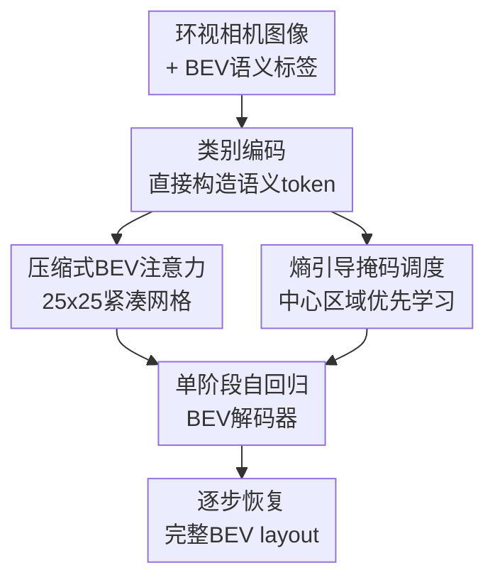

# ARINBEV: Bird's-Eye View Layout Estimation with Conditional Autoregressive Model

**会议**: ICLR2026  
**OpenReview**: [https://openreview.net/forum?id=l9i6q2bXnj](https://openreview.net/forum?id=l9i6q2bXnj)  
**代码**: 未提供公开代码  
**领域**: 自动驾驶 / BEV地图估计  
**关键词**: BEV布局估计, 自回归模型, 语义地图, 掩码调度, 多视角感知  

## 一句话总结

ARINBEV 把自动驾驶中的 BEV 语义地图看成已经离散化的结构化 token 序列，用类别编码替代 VQ-VAE tokenization，并用熵引导的掩码自回归解码在 nuScenes 和 Argoverse2 上取得更高 mIoU、更少参数和更快训练。

## 研究背景与动机

**领域现状**：BEV 感知的常见目标，是把环视相机图像对齐到统一的鸟瞰坐标系，再在这个平面上预测可行驶区域、人行横道、车道线、停止线、停车区等地图元素。传统方法主要围绕几何投影、深度估计、cross-view attention 或 BEV encoder 设计展开，代表思路是先从多视角图像中抽取特征，再把这些特征融合成密集 BEV 表示，最后用分割头或地图解码器输出 layout。

**现有痛点**：近两年生成式 BEV map 方法试图利用 VQ-VAE、VQGAN、扩散模型或 generative decoder 来增强结构一致性，但这些方法往往把 BEV map 当作普通图像处理。两阶段 VQ 系列要先训练离散 codebook，再训练 transformer 预测 token；encoder-decoder 生成模型虽然省掉了部分 tokenization，但又引入额外 decoder 或扩散迭代。问题在于 BEV map 不是自然图像，它大面积是背景，少量结构元素又带有明确语义约束，强行学习一个视觉 codebook 很容易把计算花在低信息区域上。

**核心矛盾**：BEV 交通元素之间确实存在条件依赖，例如停止线通常出现在人行横道之前，车道分隔线沿道路曲率延展，人行横道又和人行道、路口结构相互对齐；这些依赖适合用自回归方式建模。但如果为了使用自回归 transformer 先做 VQ-VAE 离散化，就会碰到 BEV map 低熵、codebook 利用率不足、监督信号变弱的问题。也就是说，任务需要结构依赖建模，却不一定需要自然图像式的离散表征学习。

**本文目标**：作者想回答两个具体问题：第一，BEV map 是否真的需要第一阶段离散表示学习；第二，如果不依赖 VQ-VAE token，怎样构造可供自回归模型使用的语义 token，并让模型优先学习最有信息量的区域依赖。

**切入角度**：论文先从 VQ-VAE 的 codebook utilization 和 Shannon entropy 入手，验证 BEV map 的语义信息主要集中在道路、路口、边界等中心区域，背景和外围区域的熵很低。这个观察给出一个很直接的设计方向：既然标签本身已经是稀疏、离散、语义明确的结构，就可以直接从类别标签构造 embedding，而不是先学习一个不充分利用的 codebook。

**核心 idea**：用“类别编码 + 熵引导掩码调度”取代两阶段离散 tokenization，把 BEV map 估计改写成单阶段 decoder-only 条件自回归预测问题。

## 方法详解

### 整体框架

ARINBEV 的输入是环视相机图像和训练时可用的 ground-truth BEV 语义地图，输出是 $200\times200$ BEV 网格上的多类二值语义 layout。模型不再训练 VQ-VAE 或单独的生成式 decoder，而是把 BEV 语义标签通过轻量 embedding 变成初始 token，按掩码调度遮住部分位置，再让 decoder-only 自回归 BEV 解码器在多视角图像条件下逐步恢复完整地图。

训练时，类别编码提供带语义的 BEV token；熵引导 Halton 掩码把更多学习压力放到中心高信息区域，同时保留随机掩码防止过拟合固定先验；自回归解码器在压缩后的 BEV 网格上做全局 self-attention，并通过 deformable cross-attention 读取多视角图像特征。推理时，模型从全 mask 的 BEV map 出发，经过少量采样步骤逐步填充 layout，论文默认使用 3 步采样。

这张图里的四个贡献节点，对应下面四个关键设计：类别编码负责替代 VQ token，压缩式 BEV 注意力负责控制计算成本，单阶段自回归 BEV 解码器负责建模地图元素之间的条件依赖，熵引导掩码调度负责决定训练和采样时哪些位置更值得优先学习。

### 关键设计

**1. 类别编码：把 BEV 标签直接变成语义 token**

两阶段 VQ 方法的隐含假设是：必须先把视觉信号压成离散 code，再让 transformer 在这些 code 上建模。但 BEV map 的输入标签本来就是 $M\in\{0,1\}^{C\times H\times W}$ 的类别栅格，和自然图像像素不同，每个通道已经对应明确交通语义。ARINBEV 因此用一个可学习 embedding table $E\in\mathbb{R}^{(C+1)\times D}$ 直接查表，其中额外的 1 个 entry 留给 mask token。

具体做法是先用类别索引权重 $F\in\mathbb{R}^{1\times C\times1\times1}$ 对二值标签图加权，得到 $C=M\odot F$，再把每个位置的类别索引用于查表，得到 $S\in\mathbb{R}^{C\times H\times W\times D}$。多通道类别 embedding 经过类别维平均后，再用有界非线性归一化：$Z=(2\cdot\sigma(S_{avg})-1)\cdot\beta$，其中 $\beta=0.01$。这个缩放看似细节，其实很重要：附录实验显示 $\beta=0.01$ 达到 64.3 mIoU，而更大的缩放或可学习缩放都会让训练稳定性和精度下降。

这一步解决的是“没有 VQ-VAE，token 从哪里来”的问题。它不是把地图当作图像压缩，而是承认 BEV layout 已经是语义离散结构，直接把类别标签投影到 transformer 可处理的连续 embedding 空间。相比 VQ codebook，它没有 codebook under-utilization，也不会让背景区域消耗大量离散码容量。

**2. 压缩式 BEV 注意力：在紧凑网格上保留全局依赖**

原始 BEV map 是 $200\times200$ 网格，如果直接在全分辨率上做自注意力，计算会很重。ARINBEV 把类别编码后的 $Z$ 压缩到 $25\times25$，也就是空间尺度缩小 8 倍，再在这个紧凑网格上做 global self-attention。由于压缩后的 token 数显著降低，模型可以用全局 self-attention 捕捉道路结构、车道边界和横向元素之间的长程关系，而不必依赖局部窗口或复杂稀疏策略。

压缩不是简单下采样了事。论文比较了三层 $3\times3$ 卷积、单个 $8\times8$ stride-8 卷积、纯双线性下采样，以及“双线性下采样 + $3\times3$ 卷积”的混合方案。最终采用的混合方案达到 64.3 mIoU，高于纯插值的 62.8，也略高于卷积方案。这说明平滑插值能保留 layout 的连续几何形态，而后接卷积又能补回局部上下文，两者组合更适合把稀疏 BEV 语义压成可计算的 token 网格。

**3. 单阶段自回归 BEV 解码器：用一个 decoder 同时做感知条件融合和 layout 恢复**

ARINBEV 的自回归目标是学习在多视角图像条件 $c$ 下的 token 分布 $p(x\mid c)$，并按照掩码调度 $S$ 分步预测被遮住的位置：$p(x\mid c)=\prod_{s=1}^{S}p(x_s\mid x_{<s},c)$。这里的 $x_s$ 不是固定从左到右的一维序列，而是由 mask schedule 指定的一组 BEV 位置；$x_{<s}$ 表示前面步骤已经恢复出来的地图 token。

结构上，模型继承 BEVFormer 和 DETR 的一些设计，但把 BEV encoder 与 generative decoder 合到一个 decoder-only 框架里。压缩后的 BEV token 先通过 pre-normalized attention blocks 做全局 self-attention，再通过 deformable cross-attention 借助相机参数和 learned offsets 访问多视角图像特征。这样一来，模型既能看见图像证据，也能利用已恢复的地图元素作为上下文，逐步补齐被遮住的交通结构。

这个设计和两类基线的区别很清楚：相对 MapPrior、VQ-Map 这类两阶段模型，它不需要先训练一个离散表征学习模块；相对 DDP、DiffBEV 这类 encoder-decoder 或扩散框架，它不需要额外的重型生成过程。论文报告 ARINBEV 参数量为 63.4M，训练时间 73 GPU hours，而 MapPrior 为 719.1M 参数且训练超过 200 小时，DDP 的 MACs 高达 614.1G。也就是说，ARINBEV 的自回归并不是用更大的生成器换性能，而是在任务结构上减少了不必要的阶段。

**4. 熵引导掩码调度：让模型把容量花在高信息 BEV 区域**

BEV map 的背景区域非常多，随机掩码会把大量训练预算分配给容易预测的空白位置。论文先用 VQ-VAE 特征和 codebook 的 cosine similarity 构造 soft assignment，再计算每个空间位置的 Shannon entropy：$H(h,w)=-\sum_{i=1}^{K}p_i(h,w)\log p_i(h,w)$。平均熵图显示，高熵区域主要集中在中心道路、路口、边界等语义变化强的位置，外围和大面积背景熵较低。

ARINBEV 没有直接记住数据集平均熵图，而是用中心 Gaussian prior $S\in\mathbb{R}^{H\times W}$ 作为更稳健的近似，标准差默认 $\sigma=0.5$。每个 batch 先采样 $r\sim U(0,1)$，通过 arccos 分布得到遮挡比例 $\rho_b=\frac{2}{\pi}\arccos(r)$；再用随机 Halton sequence 产生候选坐标，并按 $p_k=\frac{S_{y_k,x_k}}{\sum_j S_{y_j,x_j}}$ 的概率无放回采样要遮住的位置。为了不让模型只适应中心先验，这种熵引导掩码以 $p=0.5$ 的概率与普通随机 arccosine masking 混合使用。

这个策略的价值在消融里很直观：纯随机 arccosine masking 得到 62.9 mIoU，纯 entropy-guided masking 反而只有 61.1，而混合策略达到 64.3。说明中心高信息区域确实值得重点建模，但完全依赖先验会损害泛化；一半熵引导、一半随机的组合，既鼓励模型学习交通结构依赖，又保留了对非典型区域的覆盖。

### 一个完整示例

可以把一次推理想象成从“空白地图草稿”开始补图。第 0 步，输入六个环视相机图像，BEV token 全部是 mask，模型只能依靠图像特征和 learned camera geometry 判断哪里可能有道路、人行横道和分隔线。

第 1 步，调度器先恢复一批高置信 token，例如车道中心附近的可行驶区域和明显道路边界。此时模型得到的不是孤立像素，而是一组已经具有语义含义的 BEV token。第 2 步，解码器利用已恢复的道路轮廓和图像特征，继续填充车道分隔线、人行道或停车区域。第 3 步，模型根据已经形成的局部道路结构补齐停止线、人行横道等更依赖上下文的元素。论文的采样步数实验也显示，mIoU 从 1 步的 59.8 提升到 2 步的 63.4，再到 3 步的 64.3；继续增加到 4 步没有收益，说明主要结构依赖在前几轮已经被捕捉。

这个例子也解释了为什么自回归建模适合 BEV layout：它不只是逐像素分类，而是在“已经预测出的地图元素”条件下继续预测剩余元素。道路、横道、停止线、分隔线之间的工程约束，就通过这种条件恢复过程进入模型。

### 损失函数 / 训练策略

训练目标采用 per-token classification，并使用 binary focal loss 缓解 BEV 语义类别的不平衡。论文没有把损失设计作为主要创新，关键在于如何构造输入 token、如何安排 masking，以及如何用单阶段 decoder-only 结构承接多视角图像条件。

数据与实现上，nuScenes 和 Argoverse2 都使用 camera-only 设置。BEV 感知范围为 X/Y 方向 $[-50m,50m]$，分辨率为每像素 0.5m，因此输出网格为 $200\times200$。主干网络使用 Swin-Tiny，优化器为 AdamW，weight decay 为 0.01；训练 20 个 epoch，其中 8 个 warm-up epoch，在 4 张 A100 上以每卡 batch size 8 训练，初始学习率 $5\times10^{-5}$，采用 one-cycle schedule。推理默认使用 3 个 Halton scheduler 采样步骤。

作者还在最后 1 个 epoch 采用类似 DDP 的策略缓解 sampling drift：先用未遮挡输入得到模型预测 $Z_{model}$，再对 $Z_{model}$ 施加 masking 训练，让模型在一定程度上适应“输入来自自己预测”的推理分布。不过实验显示 3 步之后性能基本不再上升，更多迭代反而可能引入累计误差。

## 实验关键数据

### 主实验

| 数据集 | 指标 | 本文 | 之前SOTA | 提升 |
|--------|------|------|----------|------|
| nuScenes validation | mIoU | 64.3 | VQ-Map 62.2 | +2.1 |
| Argoverse2 validation | mIoU | 65.6 | DDP 63.5 | +2.1 |
| nuScenes validation | Drivable IoU | 85.0 | VQ-Map 83.8 | +1.2 |
| nuScenes validation | Stopline IoU | 60.8 | VQ-Map 57.7 | +3.1 |
| Argoverse2 validation | Ped. Cross. IoU | 61.4 | DDP 58.1 | +3.3 |
| Argoverse2 validation | Divider IoU | 51.6 | DDP 48.8 | +2.8 |

| 方法 | Params (M) | MACs (G) | Train Time (h) | nuScenes mIoU |
|------|------------|----------|----------------|---------------|
| BEVFusion | 50.1 | 155.5 | 100 | 56.6 |
| MapPrior | 719.1 | 396.0 | >200 | 56.7 |
| DDP | 53.6 | 614.1 | 160 | 59.4 |
| VQ-Map | 108.3 | 231.6 | 131 | 62.2 |
| ARINBEV | 63.4 | 215.8 | 73 | 64.3 |

nuScenes 的逐类结果显示，ARINBEV 在六个类别上都优于 VQ-Map，包括可行驶区域 85.0、人行横道 62.4、人行道 66.5、停止线 60.8、停车区 59.7 和分隔线 51.2。更值得注意的是，提升最大的并不只是大面积 drivable area，而是停止线、人行横道这类强依赖上下文的结构元素，这和论文强调的交通元素条件依赖相吻合。

Argoverse2 上的结果也支持“去掉 VQ tokenization 更稳”的结论。MapPrior 和 VQ-Map 在这个数据集上只有 3 个语义类别可用，离散表征学习更容易受类别少、信息低熵的影响；ARINBEV 不依赖第一阶段 codebook，因此在 drivable、pedestrian crossing 和 divider 上都保持领先。

### 消融实验

| 配置 | 关键指标 | 说明 |
|------|---------|------|
| Random arccosine masking | 62.9 mIoU | 随机遮挡覆盖广，但没有突出中心高信息区域 |
| Pure entropy-guided masking | 61.1 mIoU | 过度依赖中心先验，泛化不如混合策略 |
| Hybrid entropy-guided masking | 64.3 mIoU | 最终方案，以 $p=0.5$ 混合熵引导和随机掩码 |
| 3 个 $3\times3$ 卷积压缩 | 63.9 mIoU | 可学习压缩有效，但略低于混合插值方案 |
| 单个 $8\times8$ stride 卷积 | 64.0 mIoU | 直接大步幅卷积接近最终效果 |
| 纯双线性下采样 | 62.8 mIoU | 缺少可学习局部修正，性能明显下降 |
| 双线性下采样 + $3\times3$ 卷积 | 64.3 mIoU | 最终方案，兼顾平滑几何和局部上下文 |
| Channel-wise binary encoding | 61.0 mIoU | 简单二进制索引不能充分表达多类结构 |

| 附加分析 | 设置 | mIoU | 结论 |
|----------|------|------|------|
| Class encoding scale | 0.01 | 64.3 | 最佳缩放，训练最稳定 |
| Class encoding scale | 0.1 | 63.2 | 数值变大后性能下降 |
| Class encoding scale | 1.0 | 61.2 | embedding 幅度过大影响优化 |
| Class encoding scale | learned | 57.2 | 可学习缩放最差，说明稳定边界很关键 |
| Gaussian $\sigma$ | 0.3 | 62.1 | 中心过窄，掩码先验过强 |
| Gaussian $\sigma$ | 0.5 | 64.3 | 最佳设置 |
| Sampling steps | 1 / 2 / 3 / 4 | 59.8 / 63.4 / 64.3 / 64.3 | 3 步已足够，继续迭代没有收益 |

### 关键发现

- 类别编码不是一个小替换，而是 ARINBEV 能够摆脱两阶段训练的关键。替代方案 channel-wise binary encoding 只有 61.0 mIoU，比最终方案低 3.3，说明“直接把多通道标签压成整数”不如学习式类别 embedding 稳定。
- 熵引导掩码必须和随机掩码混合。纯熵引导低于纯随机，说明中心先验本身不是万能答案；真正有效的是把模型的注意力拉向道路结构密集区域，同时保留对非中心区域和长尾布局的训练覆盖。
- 计算效率是本文很强的卖点。ARINBEV 的训练时间为 73 小时，低于 BEVFusion 的 100、VQ-Map 的 131、DDP 的 160 和 MapPrior 的 200+，同时 mIoU 最高；这说明论文的改进不是靠堆更大的生成式模型得到的。
- 可视化结果显示，ARINBEV 在白天、雨天和夜间条件下都能生成更连贯的道路结构，尤其在遮挡和低光照场景中，比 BEVFusion 更少出现断裂和局部伪影。

## 亮点与洞察

- **把 BEV map 当作结构化 token，而不是普通图像**：这篇论文最有价值的观察，是 BEV layout 的稀疏、离散和工程约束属性，让它天然不同于自然图像生成。这个判断使作者敢于去掉 VQ-VAE，而不是继续优化 codebook。
- **用熵分析支撑架构简化**：论文没有直接宣称“两阶段太复杂”，而是先通过 codebook utilization 和 Shannon entropy 说明离散表征学习在 BEV map 上信息利用不足。这个分析让后续类别编码和掩码调度显得很自然。
- **自回归建模对应交通元素依赖**：停止线、人行横道、车道分隔线等元素不是独立像素类别，它们遵循道路设计规范和空间邻接关系。用已预测 token 条件化下一批 token，比单次 dense segmentation 更贴近 layout 的生成过程。
- **效率提升来自删除错误抽象层**：许多生成式感知工作容易把复杂生成框架当成性能来源，ARINBEV 反过来证明，在 BEV map 这种低熵结构化输出上，去掉不必要的 tokenization 和 decoder stage 反而更好。
- **可迁移启发**：类似思想可以迁移到语义占据栅格、在线 HD map、道路拓扑补全等任务。只要输出空间本身已经是离散结构，就应该先问“是否真的需要学习一个视觉 tokenizer”，而不是默认套用图像生成 pipeline。

## 局限与展望

- 推理速度仍受自回归采样步数影响。论文附录提到 1 步时 FPS 最高，可接近实时，但最佳 64.3 mIoU 对应 3 步、约 7.5 FPS；对严格实时的车载系统来说，还需要进一步优化采样或蒸馏。
- 当前工作只处理 2D BEV map，没有直接扩展到 3D occupancy。自回归依赖建模对 3D voxel grid 很有吸引力，但直接在稠密 3D 空间上生成会带来更高计算成本，可能需要 sparse voxel、层级解码或 2D-3D 混合表示。
- 熵引导先验主要基于中心区域更重要这一统计规律，在不同国家道路结构、不同相机配置或非城市道路场景中可能需要重新校准。虽然作者用随机掩码混合降低过拟合，但跨域泛化仍值得进一步验证。
- 论文对失败案例的量化讨论还不够细。可视化展示了雨天、夜间、遮挡场景的鲁棒性，但如果能单独按天气、交通密度、路口类型、遮挡程度统计 IoU，会更容易判断自回归依赖到底在哪些场景最有帮助。
- 离散扩散是作者提到的未来方向。ARINBEV 使用 mask token 和自回归恢复，而离散 diffusion 或连续噪声过程可能提供更强的全局生成能力；如何在效率和生成质量之间取舍，是后续值得探索的问题。

## 相关工作与启发

- **vs BEVFusion / BEVFormer**: BEVFusion 和 BEVFormer 主要解决多视角图像到 BEV 表示的几何融合问题，ARINBEV 继承了这类 cross-view 条件融合能力，但把输出端改成自回归 layout 恢复，更强调地图元素之间的语义依赖。
- **vs MapPrior**: MapPrior 使用 VQGAN 风格生成模型引入地图先验，但需要两阶段训练和较大的模型复杂度。ARINBEV 认为 BEV map 标签本身已经足够离散，直接类别编码可以避免 codebook under-utilization，同时参数量和训练时间都显著降低。
- **vs VQ-Map**: VQ-Map 同样面向 tokenized BEV map layout，但仍依赖第一阶段 vector quantization。ARINBEV 的实验证明，在 nuScenes 和 Argoverse2 上省掉第一阶段不仅没有损失，反而提升 mIoU，尤其在类别更少的 Argoverse2 上更稳。
- **vs DDP / DiffBEV**: DDP 和 DiffBEV 代表扩散式 dense prediction 或 BEV perception 思路，生成能力强但计算较重。ARINBEV 用 masked autoregressive decoding 达到更低 MACs 和更短训练时间，适合对效率敏感的自动驾驶感知任务。
- **对后续工作的启发**: 对结构化感知输出，不应机械套用自然图像生成的 tokenizer、diffusion 或 encoder-decoder 范式。更好的起点可能是分析输出空间的熵、稀疏性和条件依赖，再决定生成模型该简化还是扩展。

## 评分

- 新颖性: ⭐⭐⭐⭐☆ 从 BEV map 低熵和 token-like 标签出发去掉 VQ 阶段，思路清晰且针对性强，但核心组件仍借鉴 MaskGIT、BEVFormer、DETR 等成熟模块。
- 实验充分度: ⭐⭐⭐⭐☆ 两个数据集、主结果、效率分析、masking、压缩、class encoding 和采样步数消融都比较完整；如果有更细的场景分组鲁棒性会更强。
- 写作质量: ⭐⭐⭐⭐☆ 论文动机和效率对比讲得清楚，熵分析也能支撑方法选择；部分公式和实现细节略显工程化，失败模式展开不多。
- 价值: ⭐⭐⭐⭐⭐ 对自动驾驶 BEV layout 估计很实用，提供了一个更轻、更快、性能更高的生成式建模方案，也提醒后续工作重新审视 BEV 输出是否真的需要复杂 tokenizer。

<!-- RELATED:START -->

## 相关论文

- [\[ICLR 2026\] Bird's-eye-view Informed Reasoning Driver (BIRDriver)](birds-eye-view_informed_reasoning_driver.md)
- [\[CVPR 2026\] CycleBEV: Regularizing View Transformation Networks via View Cycle Consistency for Bird's-Eye-View Semantic Segmentation](../../CVPR2026/autonomous_driving/cyclebev_regularizing_view_transformation_networks_via_view_cycle_consistency_fo.md)
- [\[CVPR 2026\] BEV-CAR: Enhancing Monocular Bird's Eye View Segmentation with Context-Aware Rasterization](../../CVPR2026/autonomous_driving/bev-car_enhancing_monocular_birds_eye_view_segmentation_with_context-aware_raste.md)
- [\[CVPR 2026\] Spe-BEVHead: Rethinking the Detection Head Design for Bird's-Eye-View Object Detection](../../CVPR2026/autonomous_driving/spe-bevhead_rethinking_the_detection_head_design_for_birds-eye-view_object_detec.md)
- [\[ICLR 2026\] Astra: General Interactive World Model with Autoregressive Denoising](astra_general_interactive_world_model_with_autoregressive_denoising.md)

<!-- RELATED:END -->
