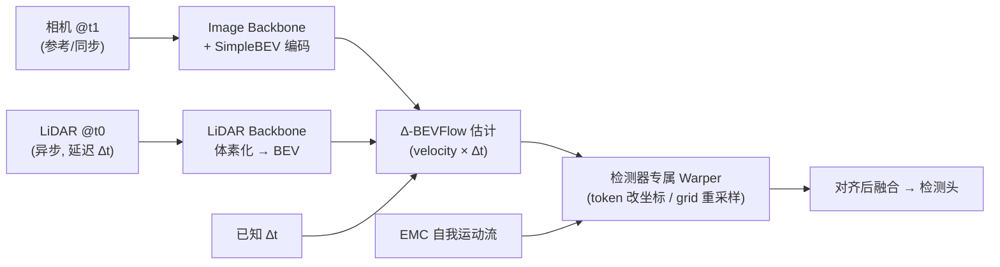

# AsyncBEV: Cross-modal Flow Alignment in Asynchronous 3D Object Detection

**会议**: ICLR 2026  
**OpenReview**: [https://openreview.net/forum?id=JINemP2BQP](https://openreview.net/forum?id=JINemP2BQP)  
**代码**: [https://github.com/tudelft-iv/AsyncBEV](https://github.com/tudelft-iv/AsyncBEV)  
**领域**: 自动驾驶 / 多模态 3D 目标检测 / 传感器异步  
**关键词**: BEV 检测, 传感器异步, 跨模态对齐, 场景流, LiDAR-相机融合, 特征 warp  

## 一句话总结
针对车载多传感器无法完美同步的现实问题，AsyncBEV 提出一个轻量、通用的即插即用模块——通过新任务 ∆-BEVFlow 直接从异步多模态 BEV 特征预测稠密 2D 流场，把延迟传感器的特征 warp 对齐到参考时刻，在 0.5s 极端异步下把动态目标的 NDS 相比 EMC 基线提升 16.6%（CMT）。

## 研究背景与动机
**领域现状**：车载 3D 目标检测依赖 LiDAR、相机等多传感器融合，几乎所有检测器（无论是 grid-based 的 BEVFusion/UniBEV 还是 token-based 的 CMT）都默认输入是**完美同步**的——训练数据集（如 nuScenes）经过精心策划，专门剔除了同步质量差的场景。

**现有痛点**：现实中完美同步几乎不可能。传感器采样频率不同（很多雷达无法被触发同步）、计算资源竞争导致丢帧/延迟、传感器崩溃甚至对抗攻击，都会在传感器间引入时间偏移 ∆t。一旦某个模态延迟，在同步数据上训练的检测器会产生严重的**空间错位**——对动态目标尤其致命，0.5s 偏移下 CMT 的动态目标 NDS 从 47.5% 暴跌到 26.1%。

**核心矛盾**：现有的补偿手段各有死角。**自我运动补偿（EMC）** 只能根据已知车体运动对齐**静态目标**，对动态目标完全无效（0.5s 下 CMT 动态目标 mAP 仅从 9.0% 升到 11.9%）；**场景流（scene flow）** 虽能估计动态目标运动，但它要求输入**两帧点云**且假设**固定时间间隔**，无法处理「跨模态、∆t 连续变化」的异步设定；协同感知里的异步融合（CoBEVFlow/UniV2X）则依赖目标提案质量、且只验证过单模态同构特征，不适用于车载多模态。

**本文目标**：设计一个能无缝嵌入任意多模态检测器、对任意时间偏移鲁棒、特别针对动态目标的轻量对齐模块。

**核心 idea**：**把"场景流"概念从点云搬到 BEV 特征空间**——定义新任务 ∆-BEVFlow，直接从异步的多模态 BEV 特征 + 已知 ∆t 预测稠密 2D 流场，用它来 warp 对齐延迟传感器的特征，补上 EMC 漏掉的「动态目标运动」那部分。

## 方法详解

### 整体框架
AsyncBEV 插在检测器的**多模态融合之前**：参考传感器（如相机）在 t1 触发推理，异步传感器（如 LiDAR）只能拿到更早 t0 的最新数据，∆t = t1 − t0。模块先用 EMC 对齐静态部分，再用 ∆-BEVFlow 预测动态目标在 BEV 平面的额外运动，最后用「检测器专属 warper」把异步特征空间对齐到 t1。整个检测器可被冻结，只训 AsyncBEV，靠常规检测损失反传。

### 关键设计

**1. ∆-BEVFlow：把场景流改造成「条件于 ∆t 的 BEV 特征流」** —— 这是全文的核心任务定义。传统场景流形式化为 $V^{t\to t+\Delta t}=\theta_{\text{SceneFlow}}(P^t, P^{t+\Delta t})$，需要两帧点云、且 ∆t 固定。AsyncBEV 把它重写为 $V^{t_0\to t_1}_{\text{BEV}}=\theta_{\Delta\text{-BEVFlow}}(F^{m_0,t_0}_{\text{BEV}}, F^{m_1,t_1}_{\text{BEV}}, \Delta t)$，三处关键改动：流**显式条件于任意 ∆t**（运行时可连续变化）、输入是**多模态 BEV 特征图**而非原始点云、输出只需 **2D BEV 流**而非 3D 点级运动。这让它天然支持任意模态组合、不预设哪个传感器是参考，且 ∆t 可在线变化而无需重训。

**2. 速度估计（BEV-VE）优于运动估计（BEV-ME）：用物理常识做正则** —— 这是把任务「学好」的关键技巧。最直接的做法是运动估计，直接从拼接特征和 ∆t 回归出位移：$E_{\text{me}}=\phi(\text{cat}(F^{C,t_1}_{\text{BEV}}, F^{L,t_0}_{\text{BEV}}, \Delta t)),\ V^{t_0\to t_1}_{\text{BEV}}=\psi(E_{\text{me}})$，其中 $\phi$ 是压缩特征的编码器、$\psi$ 是输出流场的 U-Net。但本文改成**先预测与 ∆t 无关的逐格速度，再乘以 ∆t** 得到位移：$E_{\text{ve}}=\phi(\text{cat}(F^{C,t_1}_{\text{BEV}}, F^{L,t_0}_{\text{BEV}})),\ V^{t_0\to t_1}_{\text{vel}}=\psi(E_{\text{ve}}),\ V^{t_0\to t_1}_{\text{BEV}}=V^{t_0\to t_1}_{\text{vel}}\times\Delta t$。这一步利用「位移 = 速度 × 时间」的物理关系做正则：当 ∆t→0（接近同步）时位移被**强制归零**，从而几乎不损害同步场景性能，同时简化了学习任务。消融显示 BEV-VE 在 0s 同步下只掉 1.0% NDS（BEV-ME 掉 2.5%），在 0.5s 异步下反而更高。

**3. 检测器专属 Warper：让同一套流适配 token / grid 两类架构** —— 这是「通用性」的落点。AsyncBEV 输出的是统一的 BEV 流，但不同检测器消费特征的方式不同，所以 warp 的实现要分两路。**Token-based**（如 CMT）把空间位置编码在 token 的 3D 位置编码里，于是直接用预测流 $V^{t_0\to t_1}_{\text{BEV}}$ 加上 EMC 流去**修正每个稀疏 token 的 3D 坐标** $C^{m,t_1}_{3D}$，再据此生成新的位置编码。**Grid-based**（如 UniBEV）把位置隐式编码在网格索引里，于是构建一张查找表：从 t1 标准网格 $G^{t_1}_{\text{BEV}}$ 出发，先加 EMC 流得 $G^{t_1,\text{EMC}}_{\text{BEV}}$，再加反向流得 $G^{t_1\to t_0}_{\text{BEV}}$，最后用 grid sample 从 t0 特征里**重采样**出对齐到 t1 的伪特征 $\hat{F}^{m,t_1}_{\text{BEV}}=f_{\text{grid sample}}(F^{m,t_0}_{\text{BEV}}, G^{t_1\to t_0}_{\text{BEV}})$。注意 grid 路径学的是 $V^{t_1\to t_0}$ 反向流。

**4. 轻量图像 BEV 编码 + 可选流监督** —— 为支持 token-based 检测器（它们不显式建图像 BEV 特征），AsyncBEV 用 **SimpleBEV** 直接用相机内外参把图像特征投到 BEV，避开深度估计/可变形注意力等重操作，保证模块轻量（FPS 几乎不掉：CMT 6.7→6.3，UniBEV 2.8→2.7）。训练上除常规分类 focal loss、回归 L1 loss 外，还可**选配**来自 DeFlow 的流损失 $\mathcal{L}_{\text{flow}}$（用标注 3D 框生成稠密 GT 流，按 v≤0.4 / 0.4–1 / >1 m/s 三档速度算 L2），总损失 $\mathcal{L}_{\text{total}}=\omega_1\mathcal{L}_{\text{flow}}+\omega_2\mathcal{L}_{\text{cls}}+\omega_3\mathcal{L}_{\text{reg}}$。

## 实验关键数据

数据集 nuScenes（750/150/150 scenes），LiDAR-相机融合，报告 NDS / mAP，并按动态/静态目标（0.2 m/s 阈值）分别统计。训练时 ∆t 在 0–0.5s 均匀采样，单次训练评估多个偏移。

### 主实验表格（nuScenes val，LiDAR 异步，相机为参考）

| 方法 | All NDS 0s | All NDS 0.5s | Dynamic NDS 0s | Dynamic NDS 0.5s | FPS |
|------|:--:|:--:|:--:|:--:|:--:|
| CMT（vanilla） | 72.9 | 43.2 | 47.5 | 26.1 | 6.7 |
| CMT + EMC | 72.9 | 63.3 | 47.5 | 26.8 | 6.7 |
| CMT + DA | 71.5 | 67.6 | 45.8 | 41.5 | 6.7 |
| Fan et al. (2025) | 70.6 | 66.2 | 43.5 | 37.9 | 6.7 |
| **CMT + AsyncBEV** | 72.5 | **70.0** | 47.1 | **43.4** | 6.3 |
| CMT + AsyncBEV (FD) | 73.0 | 68.7 | 47.7 | 39.6 | 6.3 |
| UniBEV（vanilla） | 66.7 | 39.7 | 42.4 | 25.3 | 2.8 |
| UniBEV + EMC | 66.7 | 58.9 | 42.4 | 25.9 | 2.8 |
| StreamingFlow | 64.2 | 54.1 | 41.3 | 34.4 | 1.0 |
| **UniBEV + AsyncBEV** | 65.7 | **63.3** | 41.0 | **37.8** | 2.7 |

- 0.5s 极端异步下，CMT+AsyncBEV 的 All NDS 比 vanilla 提升 26.8%、比 EMC 提升 6.7%；动态目标 NDS 比 EMC 大涨 **16.6%**（UniBEV 上为 11.9%）。
- AsyncBEV 仅引入边际延迟（FPS 几乎不变），而 StreamingFlow 因 GRU-ODE 处理长序列只有 1.0 FPS。

### 消融实验表格（∆-BEVFlow 设计，UniBEV）

| EMC+DA | Motion(ME) | Velocity(VE) | All NDS 0s | All NDS 0.5s |
|:--:|:--:|:--:|:--:|:--:|
| ✗ | ✗ | ✗ | 66.7 | 39.7 |
| ✓ | ✗ | ✗ | 63.1 | 61.1 |
| ✓ | ✓ | ✗ | 64.2 | 62.5 |
| ✓ | ✗ | ✓ | **65.7** | **63.3** |

### 关键发现
- **EMC 只救静态、不救动态**：0.5s 下 EMC 把 CMT 静态 NDS 拉回 67.5%（接近同步的 69.0%），但动态目标几乎纹丝不动。
- **速度形式是关键正则**：BEV-VE 相比 BEV-ME 在同步场景少掉性能（0s 仅 −1.0% vs −2.5%）、异步场景反而更强，验证「∆t→0 强制零位移」的设计有效。
- **FD 变体保住同步性能**：冻结整个检测器只训 AsyncBEV，可使 0s 同步场景完全不退化，但动态目标提升幅度略小——微调检测头是在两者间的权衡。
- AsyncBEV 在 0.5s 极端异步下的 All NDS 甚至超过 vanilla CMT 在 50ms 轻度异步下的表现。

## 亮点与洞察
- **问题定义本身就是贡献**：把"传感器异步下的多模态 3D 检测"形式化、并提出 ∆-BEVFlow 这个新任务，填补了 EMC（只管静态）与场景流（要两帧点云、固定 ∆t）之间的空白。
- **物理先验做正则的巧思**：velocity × ∆t 的分解让模型在同步时自动「无害」，是一个低成本却显著的设计，值得迁移到其他时序对齐任务。
- **真·即插即用**：同一套 BEV 流通过两种 warper 适配 token-based 与 grid-based 两大检测范式，且检测器可整体冻结，工程落地友好。
- **可解释性**：预测的 ∆-BEVFlow 可视化后与 GT 流高度吻合，能直接解释框校正了多少，对自动驾驶安全审查有价值。

## 局限与展望
- **只处理「一同步一异步」两传感器**：现实中可能 >2 个传感器、且多个同时异步，本文设定仍是简化。
- **依赖固有传感周期采样**：因无法真正插值任意时刻数据，评估只能取传感器周期的整数倍（相机 83ms、LiDAR 50ms），无法测任意小 ∆t。
- **异步数据靠人工构造**：nuScenes 已剔除同步差的场景，只能用更早的旧帧来「模拟」异步，与真实丢帧分布可能有差距。
- **未含雷达 / 全流式**：作者计划做能始终融合多传感器最新数据（含雷达）的全流式框架。

## 相关工作与启发
- **EMC 时序聚合**（nuScenes / BEVDet4D / SOLOFusion 等）：奠定了用已知车体运动对齐静态特征的范式，AsyncBEV 正是补上它对动态目标的盲区。
- **场景流估计**（DeFlow / FastFlow3D 等前馈网络）：提供了动态运动建模与流损失监督的工具，本文将其从点云搬到 BEV 特征、并条件化于 ∆t。
- **协同感知异步融合**（CoBEVFlow、UniV2X）：思路相近但依赖目标提案、且只验证单模态同构特征；本文指出其在多模态车载场景的局限并给出特征级替代方案。
- **车载异步融合**（StreamingFlow、TimeAlign、Fan et al. 2025）：StreamingFlow 用 GRU-ODE 处理长序列、计算重；Fan et al. 把 ∆t 拼进逐点特征让网络隐式补偿。AsyncBEV 只用最新一帧异步观测、显式建流，更轻更准。
- **启发**：「把已有概念（场景流）迁移到新表示空间（BEV 特征）+ 用物理关系做条件化正则」是一条低成本高回报的设计路线，可推广到雷达-相机异步、V2X 时序对齐等场景。

## 评分
- **新颖性**: ⭐⭐⭐⭐ — 首次系统形式化「传感器异步 3D 检测」并提出 ∆-BEVFlow 新任务，velocity×∆t 的正则化设计有巧思；属于已有概念（场景流/EMC）的创造性组合迁移而非全新范式。
- **实验充分度**: ⭐⭐⭐⭐ — 覆盖 token/grid 两类架构、多档时间偏移、动静态分解、与 4 类基线对比 + 关键消融，论证扎实；但仅限 nuScenes 单数据集、且异步数据为人工构造。
- **写作质量**: ⭐⭐⭐⭐ — 问题动机清晰，公式与图（pipeline + warper + 定性流可视化）配合到位，two-formulation 对比讲得明白。
- **价值**: ⭐⭐⭐⭐ — 直击自动驾驶落地的真实痛点，轻量即插即用、几乎不掉 FPS，工程价值高；受限于两传感器假设，离全流式多传感器还有距离。

<!-- RELATED:START -->

## 相关论文

- [\[CVPR 2026\] Look Before You Fuse: 2D-Guided Cross-Modal Alignment for Robust 3D Detection](../../CVPR2026/autonomous_driving/look_before_you_fuse_2d-guided_cross-modal_alignment_for_robust_3d_detection.md)
- [\[ECCV 2024\] GraphBEV: Towards Robust BEV Feature Alignment for Multi-Modal 3D Object Detection](../../ECCV2024/autonomous_driving/graphbev_towards_robust_bev_feature_alignment_for_multi-modal_3d_object_detectio.md)
- [\[CVPR 2026\] LiDAR-to-4DRadar Diffusion Bridge via Cross-Modal Alignment and Translation in Latent Space](../../CVPR2026/autonomous_driving/lidar-to-4dradar_diffusion_bridge_via_cross-modal_alignment_and_translation_in_l.md)
- [\[AAAI 2026\] DriveFlow: Rectified Flow Adaptation for Robust 3D Object Detection in Autonomous Driving](../../AAAI2026/autonomous_driving/driveflow_rectified_flow_adaptation_for_robust_3d_object_detection_in_autonomous.md)
- [\[CVPR 2026\] x2-Fusion: Cross-Modality and Cross-Dimension Flow Estimation in Event Edge Space](../../CVPR2026/autonomous_driving/x2-fusion_cross-modality_and_cross-dimension_flow_estimation_in_event_edge_space.md)

<!-- RELATED:END -->
