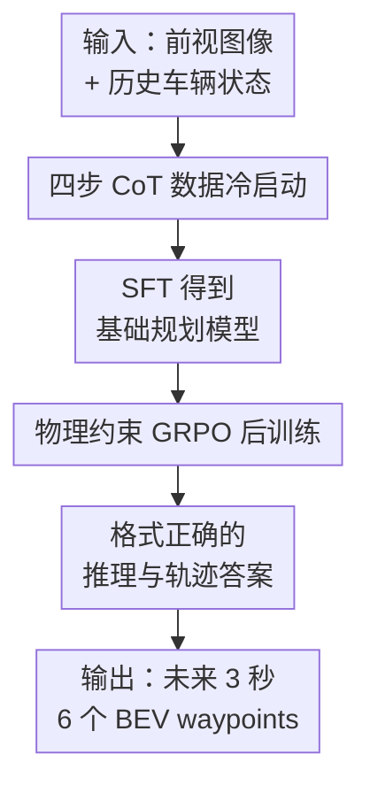

# AutoDrive-R²: Incentivizing Reasoning and Self-Reflection Capacity for VLA Model in Autonomous Driving

**会议**: ICLR2026  
**OpenReview**: [https://openreview.net/forum?id=KVWaCzJrrq](https://openreview.net/forum?id=KVWaCzJrrq)  
**代码**: 待确认  
**领域**: 自动驾驶 / VLA 推理 / 轨迹规划  
**关键词**: 自动驾驶, VLA, Chain-of-Thought, 自反思, GRPO, 物理约束奖励  

## 一句话总结
AutoDrive-R² 用四步 CoT + 自反思数据给自动驾驶 VLA 做冷启动，再用带空间、动力学和时序平滑约束的 GRPO 后训练，让模型既能解释自己的驾驶决策，也能输出更符合车辆物理约束的未来轨迹。

## 研究背景与动机
**领域现状**：自动驾驶规划正在从传统的感知、预测、规划分模块流水线，转向端到端模型。传统模块化系统容易在模块之间累积误差，也很难让感知和规划被同一个目标联合优化；端到端方法则把图像、历史车辆状态和规划输出放到同一个学习框架里，能减少手工接口带来的信息损失。近两年，VLM/VLA 模型进一步把语言推理接入驾驶决策，希望模型不仅能给出轨迹，还能说明为什么这样开。

**现有痛点**：问题在于，许多 VLM/VLA 驾驶模型会把轨迹当成普通文本答案生成：它们可能看懂了图像里的红灯、车道线或前车，却在最后输出的 waypoint 上出现物理不可执行的跳变，比如突然横移、速度不连续、转向角变化过猛。另一类方法引入 meta-action 或 latent action token 来缓解崩塌，但这会牺牲端到端简洁性，也把系统重新推向复杂的中间表示设计。

**核心矛盾**：自动驾驶 VLA 需要同时满足两个条件：一方面要像语言模型那样有可读的情境推理，能把“看见什么”转成“为什么该停车/转弯/减速”；另一方面又不能只停在语义层，最终轨迹必须服从车辆运动学、速度变化和时间连续性。只做 SFT 容易学到表面格式，只做 RL 又很难在高维推理空间里自己探索出可靠的多步逻辑链。

**本文目标**：本文要解决的是“会解释”和“会开车”之间的断裂：先让 VLA 在监督阶段学会围绕驾驶场景组织观察、计算、逻辑判断和自我检查，再在强化学习阶段把轨迹误差、转向、速度和平滑性显式放进奖励里，使模型在优化答案格式和推理质量的同时，真正减少物理不可行的轨迹。

**切入角度**：作者的观察很直接：驾驶规划里的 CoT 不应只是泛泛地说“道路安全、注意行人”，而应该把图像观察、历史状态的运动学计算、交通规则推断和反向验证串成固定链条。这样 SFT 阶段给模型一个可模仿的认知骨架，GRPO 阶段再用可验证的物理奖励筛选更好的候选答案。

**核心 idea**：用“结构化 CoT 冷启动 + 物理约束 GRPO”替代单纯轨迹回归或纯文本推理，让自动驾驶 VLA 同时获得可解释推理、自反思修正和可执行轨迹生成能力。

## 方法详解

### 整体框架
AutoDrive-R² 的输入是前视图像 $F$ 和历史 ego 状态 $H$，包括过去位置、加速度、速度、转向角等信息；输出是未来 3 秒、每 0.5 秒一个点的 BEV 轨迹 $T=M(H,F)$。训练分成两段：第一段构建 nuScenesR²-6K，把每个图像-轨迹样本扩展成“观察→计算→逻辑→反思”的 CoT 答案，用来监督微调 Qwen2.5-VL；第二段在 SFT 模型上做 GRPO，候选答案通过格式奖励和物理约束准确性奖励打分，推动模型输出更稳、更准、更像真实车辆能执行的轨迹。

整体上，论文不是重新设计一个自动驾驶感知骨干，而是把通用 Qwen2.5-VL 变成驾驶 VLA。它让模型在 `<think>` 中写出推理过程，在 `<answer>` 中写出 waypoint 序列；训练时既要求答案格式可解析，也要求 waypoint 在位置、转向、速度和时序上接近真实轨迹。

### 关键设计
**1. 四步 CoT 数据冷启动：先把驾驶推理拆成可模仿的认知链**

作者构建了 nuScenesR²-6K，包含 6000 个图像-轨迹样本，每个样本不只给最终轨迹，还给一条高质量 CoT。生成流程是“先生成、再验证”：从 nuScenes 训练集筛出约 8000 个图像-轨迹对，用 Qwen2.5-VL-72B 生成初始推理，再让 Qwen-VL-Max 作为专家验证器打分和审阅，剔除事实错误或逻辑不一致的样本，保留 6000 条用于 SFT。

这批数据的关键不在规模，而在格式。每条推理都固定经过 Observation、Calculation、Logic、Reflection 四步：Observation 负责识别车道、障碍物、信号灯等视觉事实；Calculation 用历史速度、加速度和转向角做运动学估计；Logic 把交通规则和场景语义接到动作选择上；Reflection 再检查前面假设和轨迹是否自洽。这样模型学到的不是“遇到行人要小心”这种空泛话术，而是从图像和历史状态推导 waypoint 的中间过程。

**2. 自反思验证：让模型在输出前检查自己的驾驶假设**

自动驾驶场景里，一个看似合理的第一判断经常会被局部视觉线索推翻。例如道路边坡可能被误判成死路，前方障碍也可能只是路侧设施。AutoDrive-R² 在 CoT 的最后加入 Reflection，让模型显式回看：预测位置需要的速度是否可达？轨迹会不会越过车道线？有没有忽略红灯、前车、行人或施工区？如果发现矛盾，就在答案前修正轨迹。

这种自反思不是额外的后处理模块，而是写进训练答案里的推理习惯。论文附录中的 “Aha Moment” 展示了类似现象：模型先按直行或停车作出初步计划，随后重新检查图像边缘的车道线或物理障碍，意识到原计划不符合道路结构，再修正为停车或平滑转弯。对于 VLA 驾驶模型，这种机制的价值在于让错误被暴露在文本推理中，而不是直接藏进一个不可解释的 waypoint 序列里。

**3. 物理约束 GRPO 后训练：把“轨迹像不像车能开出来”写进奖励**

第二阶段采用 GRPO。对同一个输入 $q$，策略模型采样 $G$ 个候选输出 $o_1,\ldots,o_G$，每个候选都会得到奖励 $r_i=r_i^{acc}+r_i^{format}$。格式奖励检查模型是否按 `<think>...</think><answer>...</answer>` 输出；准确性奖励不是单一 L2 位置误差，而是物理约束组合。

GRPO 不训练额外 critic，而是在同组候选内部做相对比较：

$$
A_i=\frac{r_i-\mathrm{mean}(\{r_i\}_{i=1}^{G})}{\mathrm{std}(\{r_i\}_{i=1}^{G})}.
$$

然后用类似 PPO 的 clipped ratio 更新策略，并用 KL 项约束新策略不要偏离参考模型。这个选择很适合本文任务：轨迹规划可以设计规则奖励直接验证，没必要再训练一个价值网络；同一场景下多条候选轨迹的相对优劣，也比绝对打分更稳定。

**4. 多维物理奖励：位置、转向、速度和平滑性共同约束轨迹**

论文把准确性奖励拆成四项。空间对齐项 $r_{pos}$ 是预测点和真值点的平均平方欧氏距离，用来保证全局路径不要偏离真实路线：$r_{pos}=\frac{1}{N}\sum_i((x_i-x_i^{gt})^2+(y_i-y_i^{gt})^2)$。但只压位置误差会诱导不舒服甚至不可执行的路径，所以作者继续加入转向角误差 $r_{ste}$ 和速度误差 $r_{vel}$，分别约束方向控制和纵向速度。

最后的时序平滑项 $r_{tem}$ 惩罚相邻时间步之间转向角和速度的突变：$r_{tem}=\frac{1}{N}\sum_j(\theta_j-\theta_{j-1})^2+\frac{1}{N}\sum_k(v_k-v_{k-1})^2$。完整奖励写成 $r_{acc}=\lambda_{pos}r_{pos}+\lambda_{ste}r_{ste}+\lambda_{vel}r_{vel}+\lambda_{tem}r_{tem}$，实验中四个权重都设为 1。虽然论文把这些项称为 reward，但公式形式更像待最小化的误差项，具体符号方向需以实现为准；笔记中理解为“物理约束打分”更稳妥。

### 一个完整示例
设模型看到一个前视图像，历史状态显示 ego 车过去 3 秒一直在减速，当前速度约 $3\,m/s$，前方有路口和行人。普通 VLM 可能只写“注意行人并继续前进”，然后直接输出几个向前的坐标点。AutoDrive-R² 的推理会先在 Observation 中确认红灯、前车和行人位置；Calculation 中根据速度和加速度估计下一步位移；Logic 中判断红灯优先级高于继续跟车；Reflection 中检查如果继续前进是否会违反交通规则或产生碰撞风险。

如果反思发现“虽然前车在动，但红灯和横穿行人要求停车”，模型就会把后续 6 个 waypoint 改成接近 $[0,0]$ 的停止轨迹。反过来，如果初步判断为停车，但重新检查发现道路其实是向右连续弯曲而非封闭，反思阶段会把轨迹从停住改成低速右转。这正是本文想要的行为：不是让 CoT 变成长篇解释，而是让解释能约束并修正最后的行动。

### 损失函数 / 训练策略
第一阶段使用 nuScenesR²-6K 对 Qwen2.5-VL 做监督微调，让模型学会生成 `<think>` 与 `<answer>` 的结构化输出。第二阶段使用 TRL 框架做 GRPO，最大 completion length 为 4096，单个输入采样 $G=6$ 个候选答案，训练 750 个 iteration，约 18 小时。论文在 3B 和 7B 两种 Qwen2.5-VL 尺度上都验证了该流程。

GRPO 目标包含两部分：一部分根据候选答案的相对优势更新策略，另一部分用 $D_{KL}(\pi_\theta\Vert\pi_{ref})$ 保持模型不偏离参考策略。论文采用 $\beta=0.04$ 作为 KL 系数，消融显示过小会让策略漂移、过大又会限制优化空间。学习率在两个阶段都设为 $5\times10^{-7}$，累计 batch size 为 8。

## 实验关键数据

### 主实验
主实验覆盖 nuScenes 开环轨迹预测、Waymo 零样本泛化，以及 NAVSIM 闭环规划。nuScenes 指标包括 1s/2s/3s 和平均 L2 Error，以及碰撞率；Waymo 主要报告 L2 Error；NAVSIM 报告安全、舒适性、进度和综合 PDMS。

| 数据集 / 设置 | 指标 | AutoDrive-R² 7B | 强基线 | 提升 |
|--------|------|------|----------|------|
| nuScenes | Avg. L2 Error ↓ | 0.19 m | EMMA+ 0.29 m | 约 34.5% 更低 |
| nuScenes | Avg. Collision Rate ↓ | 0.07% | DriveVLM-Dual 0.10% | 碰撞率更低 |
| Waymo zero-shot | Avg. L2 Error ↓ | 0.20 m | EMMA+ 0.30 m | 约 33.3% 更低 |
| Waymo zero-shot | Avg. L2 Error ↓ | 0.20 m | Qwen2.5-VL-7B 2.13 m | 约 90.6% 更低 |
| NAVSIM closed-loop | PDMS ↑ | 89.1 | TransFuser 84.1 / Para-Drive 84.0 | 提升约 5 分 |

nuScenes 上，AutoDrive-R² 7B 的 1s/2s/3s L2 Error 分别是 0.13、0.19、0.25，平均 0.19，是表中最强结果。它比 EMMA+ 用更少数据取得更低误差：论文称 EMMA+ 使用约 103k 内部场景，而 AutoDrive-R² 的 SFT 和 RL 数据各约 6k。

Waymo 上的零样本结果更能说明泛化：AutoDrive-R² 7B 的平均 L2 Error 为 0.20，明显优于 EMMA+ 的 0.30 和 DriveVLM 的 0.42。闭环 NAVSIM 中，AutoDrive-R² 的 NC/DAC/TTC/Comfort/EP/PDMS 分别为 98.5、95.9、95.4、100、82.7、89.1，说明开环轨迹误差降低能够转化为更好的闭环驾驶质量。

### 消融实验
| 配置 | nuScenes Avg. L2 Error ↓ | 说明 |
|------|---------|------|
| Qwen2.5-VL-7B | 1.45 | 通用 VLM 直接做轨迹规划，误差很大 |
| Qwen2.5-VL-7B + SFT | 0.27 | CoT 数据冷启动带来主要收益 |
| Qwen2.5-VL-7B + RL | 0.33 | 只做 RL 不如先 SFT，说明推理链难以纯探索出来 |
| SFT: w/o Four-step | 0.25 | 去掉四步结构后劣于完整模型 |
| SFT: w/o Self-reflection | 0.23 | 去掉自反思后也会退化 |
| RL: w/o $r_{pos}$ | 0.53 | 空间位置约束最关键，去掉后误差显著变大 |
| RL: w/o $r_{ste}$ | 0.21 | 转向约束影响较小但稳定有效 |
| RL: w/o $r_{vel}$ | 0.22 | 速度约束帮助保持纵向动态合理 |
| RL: w/o $r_{tem}$ | 0.24 | 平滑性约束减少控制突变 |
| AutoDrive-R² 7B | 0.19 | 完整两阶段训练和四项奖励最好 |

| 超参数 | 设置 | Avg. L2 Error ↓ | 结论 |
|------|------|------|------|
| 奖励权重 $\lambda$ | $(0.4,0.3,0.2,0.1)$ | 0.22 | 衰减权重不如均匀权重 |
| 奖励权重 $\lambda$ | $(1,1,1,1)$ | 0.19 | 四个物理维度都重要 |
| KL 系数 $\beta$ | 0.02 | 0.21 | 约束偏弱，效果下降 |
| KL 系数 $\beta$ | 0.04 | 0.19 | 论文采用的最佳设置 |
| KL 系数 $\beta$ | 0.06 | 0.20 | 约束偏强，略微限制优化 |
| 采样数 $G$ | 2 / 4 / 6 / 8 | 0.23 / 0.20 / 0.19 / 0.19 | $G=6$ 后收益饱和 |

### 关键发现
- SFT 是不可省的冷启动阶段。只用 RL 的平均 L2 Error 为 0.33，差于 SFT 的 0.27，说明驾驶 CoT 的多步逻辑和运动学计算很难靠奖励从零探索出来。
- 四项物理奖励里，$r_{pos}$ 贡献最大；去掉空间对齐后误差升到 0.53，说明轨迹几何位置仍是规划任务的核心约束。
- 自反思不是装饰性文字。去掉 self-reflection 后平均误差从 0.19 升到 0.23，表明反向检查对复杂场景中的轨迹修正有实际作用。
- 7B 明显优于 3B，但 3B 经过同样框架后也大幅改善，说明两阶段训练方法并不完全依赖大模型规模。
- 定性可视化显示，AutoDrive-R² 在车道曲率、障碍物和光照变化场景下的蓝色预测轨迹更贴近绿色真值轨迹，偏离和不连续更少。

## 亮点与洞察
- 把 CoT 写成驾驶任务专用结构，而不是照搬通用推理模板。Observation、Calculation、Logic、Reflection 分别对应视觉事实、运动学、交通规则和自检，和轨迹规划的真实决策链条贴得很近。
- 论文抓住了 VLA 驾驶的核心失败模式：不是模型完全看不懂图像，而是“看懂之后的动作”没有物理约束。用 GRPO 奖励把速度、转向和平滑性加入优化，比单纯比较 waypoint L2 更符合车辆执行需求。
- 自反思机制很适合安全关键任务。它让模型在输出前显式检查“我的假设是否错了”，这比只给最终答案更容易被人审计，也更容易发现模型到底在哪里误判。
- 数据效率是一个有价值的信号。相较于使用大规模内部驾驶数据的 EMMA+，本文用 6k CoT 样本和 6k RL 样本取得很强结果，说明高质量推理标注可能比盲目堆数据更有效。
- 这个范式可以迁移到其他具身任务，例如机器人导航、移动操作或无人机路径规划：先构建任务专用的观察-计算-逻辑-反思链，再用物理可验证奖励做后训练。

## 局限与展望
- 论文主要围绕前视图像和历史 ego 状态展开，虽然评估数据集本身有多相机信息，但方法描述中的输入形式相对简化。真实自动驾驶还需要更强的多视角、多传感器融合，尤其是激光雷达、地图和动态目标预测。
- CoT 数据由强 VLM 生成并由闭源模型验证，质量较高但复现成本不低。若验证器偏好某种推理风格，SFT 模型也可能继承这种风格偏差。
- 物理奖励仍然是基于真值轨迹的离线约束，和真实闭环驾驶中的交互风险不完全等价。NAVSIM 闭环结果很强，但还不能替代真实道路或高保真仿真的安全验证。
- 奖励公式中多个项以误差形式出现，论文表述为 reward 时没有充分解释符号方向和归一化细节；实现中如何把误差变成可最大化奖励，会影响复现稳定性。
- 自反思文本会增加生成长度和推理成本。安全关键场景中可解释性很重要，但实时系统还需要研究如何压缩 CoT、缓存中间状态，或把长推理蒸馏成更快的策略。
- 未来可以把多车交互和多智能体博弈纳入 CoT 与奖励设计，让模型不仅规划 ego 轨迹，还能显式推断其他交通参与者对 ego 行为的反应。

## 相关工作与启发
- **vs UniAD / VAD / BEV-Planner**: 这些方法主要是端到端或规划导向的自动驾驶模型，强在 BEV 表示和轨迹回归，但通常不把语言化推理和自反思作为核心训练目标。AutoDrive-R² 的优势是可解释推理和物理约束后训练，劣势是依赖 VLM 生成，实时成本可能更高。
- **vs DriveVLM / DriveMLM**: 这些工作把 VLM/LLM 引入驾驶场景，用语言推理增强行为规划。AutoDrive-R² 更进一步，把推理过程直接对齐到最终 waypoint，并通过 GRPO 奖励约束轨迹物理可行性，而不是只生成解释或高层行为。
- **vs EMMA / EMMA+**: EMMA 系列是强大的端到端多模态驾驶模型，实验中也是本文最重要的强基线。AutoDrive-R² 用更小规模的 CoT/RL 数据超过 EMMA+，说明结构化推理和物理奖励可以补足数据规模上的差距，但两者数据来源和训练规模并不完全可比。
- **vs AutoVLA / OpenDriveVLA / DriveMoE**: 这些 VLA 驾驶工作同样关注从视觉语言输入到动作输出。本文的区别是把自反思 CoT 数据集和 GRPO 物理奖励作为主要贡献，强调“推理链质量”和“动作可执行性”的联合优化。
- **vs DeepSeek-R1 式 GRPO 推理训练**: AutoDrive-R² 借鉴了 RL 激励推理能力的思想，但把 reward 从数学答案正确性改成轨迹物理可验证性。这个转化很有启发：对具身 AI 来说，reward 不应只看语义对错，还要看动作是否符合环境物理。

## 评分
- 新颖性: ⭐⭐⭐⭐☆ 把自反思 CoT 和物理约束 GRPO 结合到自动驾驶 VLA 上，方向清晰且任务贴合，单个组件并非全新但组合有效。
- 实验充分度: ⭐⭐⭐⭐☆ 覆盖 nuScenes、Waymo 和 NAVSIM，并有训练阶段、奖励项和超参数消融；真实闭环部署和多传感器分析仍可加强。
- 写作质量: ⭐⭐⭐⭐☆ 方法主线清楚，图表完整；奖励符号和部分复现细节解释略显粗糙，需要读者自行判断误差项如何转成优化奖励。
- 价值: ⭐⭐⭐⭐⭐ 对自动驾驶 VLA 很有参考价值，尤其是“结构化推理冷启动 + 可验证物理奖励”的训练范式，可迁移到多种具身规划任务。

<!-- RELATED:START -->

## 相关论文

- [\[CVPR 2026\] Counterfactual VLA: Self-Reflective Vision-Language-Action Model with Adaptive Reasoning](../../CVPR2026/autonomous_driving/counterfactual_vla_self-reflective_vision-language-action_model_with_adaptive_re.md)
- [\[CVPR 2026\] Unleashing VLA Potentials in Autonomous Driving via Explicit Learning from Failures](../../CVPR2026/autonomous_driving/unleashing_vla_potentials_in_autonomous_driving_via_explicit_learning_from_failu.md)
- [\[CVPR 2026\] MindDriver: Introducing Progressive Multimodal Reasoning for Autonomous Driving](../../CVPR2026/autonomous_driving/minddriver_introducing_progressive_multimodal_reasoning_for_autonomous_driving.md)
- [\[ICLR 2026\] $AutoDrive\text{-}P^3$: Unified Chain of Perception-Prediction-Planning Thought via Reinforcement Fine-Tuning](autodrivetext-p3_unified_chain_of_perceptionpredictionplanning_thought_via_reinf.md)
- [\[ICLR 2026\] DriveMamba: Task-Centric Scalable State Space Model for Efficient End-to-End Autonomous Driving](drivemamba_task-centric_scalable_state_space_model_for_efficient_end-to-end_auto.md)

<!-- RELATED:END -->
