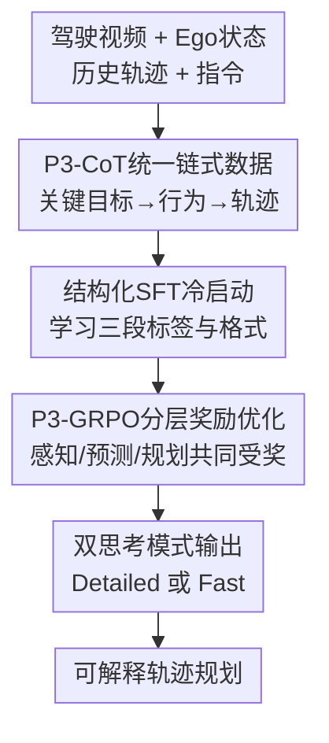

# $AutoDrive\text{-}P^3$: Unified Chain of Perception-Prediction-Planning Thought via Reinforcement Fine-Tuning

**会议**: ICLR 2026  
**OpenReview**: [https://openreview.net/forum?id=CMU8GxwpUL](https://openreview.net/forum?id=CMU8GxwpUL)  
**论文**: OpenReview 会议论文  
**代码**: https://github.com/haha-yuki-haha/AutoDrive-P3  
**领域**: 自动驾驶  
**关键词**: 端到端自动驾驶, 视觉语言模型, 感知预测规划, 强化微调, Chain-of-Thought  

## 一句话总结
AutoDrive-P3 把自动驾驶 VLM 的感知、预测、规划组织成统一的 $P^3$ 链式推理，并用覆盖三阶段的 GRPO 奖励做强化微调，在 nuScenes 与 NAVSIM 上同时提升轨迹精度、碰撞率和闭环规划分数。

## 研究背景与动机
**领域现状**：自动驾驶系统长期在两条路线之间演化。一条是传统模块化管线，先做感知，再做轨迹预测，最后做规划；另一条是端到端模型，把传感器输入直接映射到未来轨迹。近几年 VLM 被引入驾驶任务后，系统获得了更强的语义理解和长尾场景适应能力，可以用自然语言或结构化文本表达驾驶场景中的物体、行为和决策。

**现有痛点**：现有 VLM 驾驶方法的核心问题不是“能不能输出轨迹”，而是“轨迹从哪里推出来”。一类方法直接从图像和 ego 状态生成规划结果，中间缺少可检查的感知与预测推理，模型很容易把驾驶决策变成黑箱猜测。另一类方法虽然能分别回答感知、预测、规划问题，但这些问题通常是拆开的 QA，感知结果不会自然成为预测依据，预测结果也不会自然约束规划。

**核心矛盾**：真实驾驶决策需要阶段依赖：先找出会影响自车的关键目标，再判断这些目标接下来怎么动，最后结合自车状态和交通指令生成轨迹。只优化最终规划误差会把前两步当成副产品，导致模型可能用不可靠的中间理解“碰巧”得到轨迹；而只做分散 QA 又缺少端到端规划目标的牵引。

**本文目标**：本文要解决三个具体问题：第一，构造一种适合 VLM 训练的感知-预测-规划统一 CoT 格式；第二，让模型在冷启动阶段学会驾驶领域输入、输出标签和链式推理格式；第三，在强化微调阶段不只奖励规划，还显式奖励关键目标感知和行为预测，使规划收益建立在正确中间结果上。

**切入角度**：作者把自动驾驶推理看成一条 $P^3$ 链：Perception 提供关键目标与位置，Prediction 判断这些目标未来行为，Planning 再生成自车未来轨迹。这个角度的好处是，VLM 的可解释文本输出不再只是附属说明，而是被写进监督数据和强化学习奖励里的中间结构。

**核心 idea**：用统一的 $P^3$-CoT 数据和三阶段 P3-GRPO 奖励，把“会说感知、预测、规划”的 VLM 训练成“按感知→预测→规划顺序协同决策”的端到端驾驶模型。

## 方法详解

### 整体框架
AutoDrive-P3 的输入包括驾驶视频、ego 车辆状态、历史轨迹、导航指令和提示词，输出不是单一轨迹，而是一串结构化的感知、预测、规划 CoT 与对应答案。模型先通过 P3-CoT 数据学会统一输出格式，再用 SFT 做驾驶领域冷启动，最后用 P3-GRPO 对三阶段结果一起做强化微调，并在推理时提供 detailed thinking 与 fast thinking 两种模式。

整体流程可以理解为：先把现有 nuScenes/NAVSIM 样本整理成只关注关键物体的三阶段标签，再借助强 VLM 生成连贯 CoT；随后用这些样本把 Qwen2.5-VL-3B 调成能产出 $\langle perception,prediction,planning\rangle$ 序列的驾驶模型；最后对每个问题采样多条回答，分别计算格式、感知、预测、规划奖励，并用组内相对优势更新策略。

### 关键设计
**1. P3-CoT统一链式数据：把关键目标、未来行为和自车轨迹放进同一条推理链**

这篇论文首先补的是数据形态，而不是单纯换一个模型。已有驾驶 VLM 数据常见问题是目标太泛、QA 太碎：一个样本可能问“图里有什么车”，另一个样本问“应该怎么开”，但模型没有被要求把前一个答案当作后一个答案的依据。P3-CoT 因此从每个场景中筛出真正影响驾驶的关键目标，给出二维框作为感知标签，再根据这些目标的未来轨迹生成 stop、straight、left、right 等预测标签，最后用自车未来 waypoints 作为规划标签。

更重要的是，作者要求合成 CoT 时保持阶段依赖：预测阶段只能基于感知阶段已经识别出的关键目标，规划阶段则必须同时利用感知与预测结果。这样得到的训练样本不只是“带解释的答案”，而是一种可被模型模仿的驾驶认知过程。数据规模也不小：nuScenes 部分包含 25,303 帧、850 个场景，NAVSIM 部分包含 115,434 帧、1,382 个场景，足够支撑 SFT 与后续 GRPO 采样。

**2. 结构化SFT冷启动：先让 VLM 学会驾驶域的三段输出语法**

直接对通用 VLM 做强化学习很容易不稳定，因为模型一开始既不熟悉驾驶坐标、历史轨迹、ego 指令，也未必会稳定输出可解析的三阶段标签。AutoDrive-P3 因此先用 P3-CoT 做监督微调，把输入组织成 $x=[x_{ego};x_{video};x_{cmd};x_{prompt}]$，把输出组织成 $y=[y_{perception};y_{prediction};y_{planning}]$，其中每个模块又分为 $y_{module}=[y_{thinking};y_{answer}]$。

SFT 目标仍是标准负对数似然 $L_{SFT}=-\sum_{t=1}^{T}\log P(y_t|y_{<t},x)$，但它训练出的能力很具体：模型要按固定标签输出 `<perception_thinking>`、`<perception_answer>`、`<prediction_thinking>`、`<prediction_answer>`、`<planning_thinking>`、`<planning_answer>` 这类结构。这个冷启动阶段降低了 VLM 与自动驾驶任务之间的格式和语义域差距，也让后续奖励函数可以可靠解析每个模块的结果。

**3. P3-GRPO分层奖励优化：不只奖最终轨迹，也奖轨迹背后的理解是否正确**

论文最核心的训练设计是把 GRPO 从“规划-only”扩展成三阶段联合奖励。对一个问题 $q$ 和回答 $a$，总奖励写成 $R(q,a)=\lambda_{format}R_{format}+\lambda_{perc}R_{perc}+\lambda_{pred}R_{pred}+\lambda_{plan}R_{plan}$，实验里权重比例为 $1:2:2:5$。这表示规划仍是最终目标，但感知和预测不是可有可无的解释文本，而是会直接影响策略更新的中间任务。

感知奖励 $R_{perc}$ 根据预测框与真值框的平均 IoU、precision、recall 计算；没有目标且模型也不报目标时给满分，有目标却漏检或误报则受罚。预测奖励 $R_{pred}$ 进一步要求匹配框上的未来动作标签正确，并用 IoU 加权动作正确性，因此“框找准但动作错”和“动作碰巧对但框偏了”都拿不到高分。规划奖励 $R_{plan}=2/(1+e^{clip(L2,0,L2_{max})})$ 用预测轨迹与真值轨迹的 L2 距离衡量，在 NAVSIM 上还加入 PDMS 相关信号。

GRPO 的组内相对优势也适合这里的多样回答采样。模型对同一场景生成 $G$ 个 P3-CoT 候选，分别计算奖励，再用 $\hat{A}_i=(R_i-mean(R))/std(R)$ 判断哪些回答相对更好。相比只看最终 L2 的 RL，这种奖励会逼模型修正“看错目标但轨迹看似还行”的样本，因为感知和预测模块已经把错误暴露出来。

**4. 双思考模式输出：把可解释性和实时性拆成可切换的推理预算**

自动驾驶部署不能只追求长 CoT，推理延迟同样重要。AutoDrive-P3 因此提供 detailed thinking 和 fast thinking 两种模式。Detailed 模式完整输出每个模块的 reasoning 与 answer，适合分析、调试和需要更强解释性的场景；Fast 模式保留 P3-CoT 的三段结构，但把 thinking 留空或极简，只输出感知、预测和规划答案。

这个设计不是简单“少生成一些字”，而是在同一训练框架下保留阶段化输出接口。也就是说，Fast 模式仍然按感知→预测→规划产出结构化结果，只是把显式推理文本压缩掉。实验显示 Fast 模式在 nuScenes 上平均 L2 从 Detailed 的 0.33 轻微变为 0.34，平均碰撞率从 0.06% 变为 0.08%，但 FPS 从 0.5 提到 1.0，更接近实时驾驶需求。

### 一个完整示例
假设前视视频最后一帧里有一名行人位于右侧人行道，ego 车辆当前速度为 0，历史轨迹显示过去 3 秒基本静止，驾驶指令是继续直行。AutoDrive-P3 的 Detailed 模式会先在感知阶段输出行人的二维框，例如 `[400,110,448,235]` 与 label `pedestrian`，并说明它是当前需要关注的关键目标。

接着预测阶段只围绕这个已识别目标判断未来行为。如果行人不在 ego 车辆行驶方向上，模型会输出 `future_action: straight`，同时说明它短期内不会直接影响自车路径。最后规划阶段结合“自车静止但指令直行”和“关键目标不构成直接冲突”，生成 0.5s 到 3.0s 的六个未来轨迹点，例如从 `[0.0,0.03]` 逐渐前进到 `[0.0,4.23]`。这个例子体现了论文强调的依赖关系：规划不是凭空给出，而是由感知到的目标与预测到的行为共同约束。

### 损失函数 / 训练策略
训练分两阶段。第一阶段是 SFT 冷启动，使用 P3-CoT 数据最小化序列负对数似然，使 Qwen2.5-VL-3B 学会驾驶输入、模块标签、CoT 格式和结构化答案。nuScenes 输入为前视相机 3 秒视频、6 帧、分辨率 $448\times252$，ego 信息只包含速度；NAVSIM 输入为前、左前、右前三视角 2 秒视频、4 帧、分辨率 $672\times168$，ego 信息包含 $v_x,v_y,a_x,a_y$。

第二阶段是 P3-GRPO。每个场景采样 8 个 P3-CoT 回答，按格式、感知、预测、规划计算总奖励，并用 clipped surrogate objective 加 KL 约束更新策略。论文保留 KL 正则，权重为 0.01；附录显示去掉 KL 后训练会逐渐偏离基模型并发生性能坍塌。优化器使用 AdamW，主要实验在 8 张 A100 上训练；推理时间测试使用 vLLM 0.8.0 和 H100。

## 实验关键数据

### 主实验
论文在 open-loop 的 nuScenes 与 closed-loop 风格的 NAVSIMv1/v2 上评估。nuScenes 主要看 L2 轨迹误差与碰撞率，NAVSIMv1 使用 PDMS，NAVSIMv2 使用更扩展的 EPDMS。PDMS 由 NC、DAC、EP、TTC、Comfort 组合而成，NAVSIMv2 还加入 DDC、TLC、LK、HC、EC 等更细约束。

| 数据集 / 指标 | 本文 Detailed | 本文 Fast | 代表性之前方法 | 主要提升 |
|--------|------|------|----------|------|
| nuScenes Avg. L2 ↓ | 0.33 | 0.34 | OmniDrive / OpenDriveVLA: 0.33 | L2 持平 SOTA，模型更小且训练数据更少 |
| nuScenes Avg. Collision ↓ | 0.06% | 0.08% | OpenDriveVLA: 0.10%, OmniDrive: 0.11% | Detailed 相对 0.10% 降到 0.06%，碰撞率优势明显 |
| NAVSIMv1 PDMS ↑ | 90.6 | 90.2 | WoTE: 88.3, DiffusionDrive: 88.1 | 视觉-only 输入下超过强 BEV/世界模型方法 |
| NAVSIMv2 EPDMS ↑ | 86.2 / 89.9 | 85.2 / 88.7 | DiffusionDrive: 84.7 / 88.2 | 在 false/true human penalty filter 两种设置下都更高 |

从主结果看，AutoDrive-P3 的优势主要体现在安全性和闭环评估分数上。nuScenes 的 L2 已经与 OmniDrive、OpenDriveVLA 等方法接近天花板，但碰撞率从 0.10%-0.11% 区间进一步降到 0.06%。NAVSIMv1/v2 上，模型不用 LiDAR，仅用视觉输入就超过需要更强传感器或专门 BEV 模块的规划方法，说明三阶段 CoT 与奖励确实对规划质量有帮助。

### 消融实验
| 配置 | 关键指标 | 说明 |
|------|---------|------|
| Only SFT | Perception 0.33, Prediction 0.23, Avg Collision 0.17% | 只学格式和监督标签，已经能规划，但中间任务较弱 |
| SFT + Only Planning GRPO | Avg Collision 0.12% | 只奖励规划能改善 3s 碰撞，但感知/预测没有直接收益 |
| SFT + P3-GRPO | Perception 0.64, Prediction 0.54, Avg Collision 0.06% | 三阶段奖励同时提升中间理解和最终规划 |
| Group size 4 | Avg L2 0.38, Avg Collision 0.13% | 候选回答少，组内相对优势信号较弱 |
| 无历史轨迹 | Avg L2 0.39, Avg Collision 0.14% | 缺少 ego 过去运动趋势，规划上下文变差 |
| 单帧 Image | Avg L2 0.36, Avg Collision 0.12% | 不如视频输入，说明时间动态对预测/规划重要 |
| 完整 P3-GRPO | Avg L2 0.33, Avg Collision 0.06% | group size 8、历史轨迹、视频输入共同组成最佳设置 |

### 关键发现
- P3-GRPO 的主要价值不是把最终轨迹再调一点，而是显著修复感知与预测模块：Perception 从 0.33 提到 0.64，Prediction 从 0.23 提到 0.54，最终碰撞率也随之下降。
- 只做 Planning GRPO 的效果有限，平均碰撞率只能回到 UniAD 量级；这支持作者的核心判断：规划质量依赖可靠的关键目标识别和未来行为预测。
- Fast 模式的性能退化很小，但速度从 0.5 FPS 到 1.0 FPS；在真实系统里，这种可切换推理预算比单一长 CoT 更实用。
- 奖励权重不能过度偏向规划。附录中 $1:1:1:7$ 比 $1:2:2:5$ 的感知、预测和 L2 都略差，说明前两阶段权重太低会削弱规划所需的中间基础。

## 亮点与洞察
- **把 CoT 变成可训练的驾驶中间结构**：论文没有停留在“让 VLM 解释一下为什么这么开”，而是把感知框、预测动作、规划轨迹统一放进一个可监督、可奖励的格式里。这样 CoT 既能解释，也能被评估和优化。
- **奖励设计贴合驾驶因果链**：P3-GRPO 的关键不是奖励项多，而是奖励项顺着驾驶决策链排列。感知错会影响预测，预测错会影响规划，训练信号也按这个逻辑压回模型。
- **只关注关键对象是一个实用取舍**：自动驾驶不需要对画面里所有东西做开放词汇检测，真正影响规划的是少量关键目标。P3-CoT 的稀疏关键对象标注降低了噪声，也更接近人类驾驶注意力。
- **Detailed/Fast 模式给部署留下空间**：长推理有助于可解释和分析，短推理更接近实时需求。两种模式共享同一三阶段接口，后续可以按场景风险动态切换。

## 局限与展望
- 论文承认模型仍会出现 reasoning hallucination。对安全关键系统而言，CoT 看起来合理并不等于事实正确，尤其当感知框或交通灯理解出错时，后续预测和规划可能被连锁带偏。
- 强化学习仍在离线数据或伪闭环环境中完成，缺少真实世界交互。NAVSIM 能提供更强的闭环指标，但还不能完全替代真实交通参与者对 ego 行为的反应。
- 当前输入设置相对简化。nuScenes 只用前视相机和速度，NAVSIM 只用三视角视觉与 ego kinematics；在复杂城市道路、恶劣天气、多传感器融合场景下，方法是否同样稳定还需要更多验证。
- 评估主要展示轨迹指标和少量可视化案例，对失败模式的系统归因还不够。后续可以按“感知漏检导致失败”“预测动作错导致失败”“规划保守/激进导致失败”拆开统计。
- Fast 模式虽然接近 1 Hz，但对于高频控制仍偏慢。更现实的路径可能是让 VLM 负责低频语义决策或风险场生成，再由轻量规划器做高频控制。

## 相关工作与启发
- **vs UniAD / ST-P3 / VAD**: 这些方法把感知、预测、规划放在端到端神经网络里联合训练，优势是轨迹优化直接，缺点是世界知识和语言可解释性有限。AutoDrive-P3 借助 VLM 的语义能力处理长尾场景，但也需要额外解决 VLM 输出格式、幻觉和实时性问题。
- **vs OmniDrive / OpenDriveVLA**: 这些 VLM 驾驶方法已经能回答多种驾驶 QA 或生成轨迹，但多任务之间常是分散调用。AutoDrive-P3 的区别是把感知、预测、规划写成同一条链，并在训练时显式约束三者依赖。
- **vs AutoVLA / AutoDrive-R² / Plan-R1**: 这些工作也使用强化学习提升驾驶 VLM 或轨迹规划，但多偏向最终规划奖励或自反思能力。P3-GRPO 的启发是，驾驶 RL 不应只奖励结果轨迹，还应奖励产生轨迹的中间可验证状态。
- **对其他任务的启发**: 医疗诊断、机器人操作、视频问答等任务也有类似“中间识别→状态预测→行动决策”的结构。AutoDrive-P3 的范式可以迁移为“把可验证中间结果写入 CoT，再为每个中间结果设计奖励”，避免只优化最终答案。

## 评分
- 新颖性: ⭐⭐⭐⭐☆ 把 P3-CoT 数据、三阶段奖励和驾驶 VLM 结合得比较完整，概念不复杂但落点清晰。
- 实验充分度: ⭐⭐⭐⭐⭐ 覆盖 nuScenes、NAVSIMv1/v2、SFT/GRPO 消融、训练设置消融、速度对比和可视化，证据链较完整。
- 写作质量: ⭐⭐⭐⭐☆ 方法主线清楚，奖励公式和数据构建都交代了；少量表述和附录示例略显冗长。
- 价值: ⭐⭐⭐⭐⭐ 对 VLM 自动驾驶很有参考价值，尤其是“只优化规划不够，必须监督感知和预测”的训练观点。

<!-- RELATED:START -->

## 相关论文

- [\[ICLR 2026\] SMART-R1: Advancing Multi-agent Traffic Simulation via R1-Style Reinforcement Fine-Tuning](advancing_multi-agent_traffic_simulation_via_r1-style_reinforcement_fine-tuning.md)
- [\[AAAI 2026\] WorldRFT: Latent World Model Planning with Reinforcement Fine-Tuning for Autonomous Driving](../../AAAI2026/autonomous_driving/worldrft_latent_world_model_planning_with_reinforcement_fine-tuning_for_autonomo.md)
- [\[CVPR 2026\] RLFTSim: Realistic and Controllable Multi-Agent Traffic Simulation via Reinforcement Learning Fine-Tuning](../../CVPR2026/autonomous_driving/rlftsim_realistic_and_controllable_multi-agent_traffic_simulation_via_reinforcem.md)
- [\[ICLR 2026\] RAP: 3D Rasterization Augmented End-to-End Planning](rap_3d_rasterization_augmented_end-to-end_planning.md)
- [\[CVPR 2026\] DrivePI: Spatial-aware 4D MLLM for Unified Autonomous Driving Understanding, Perception, Prediction and Planning](../../CVPR2026/autonomous_driving/drivepi_spatial-aware_4d_mllm_for_unified_autonomous_driving_understanding_perce.md)

<!-- RELATED:END -->
