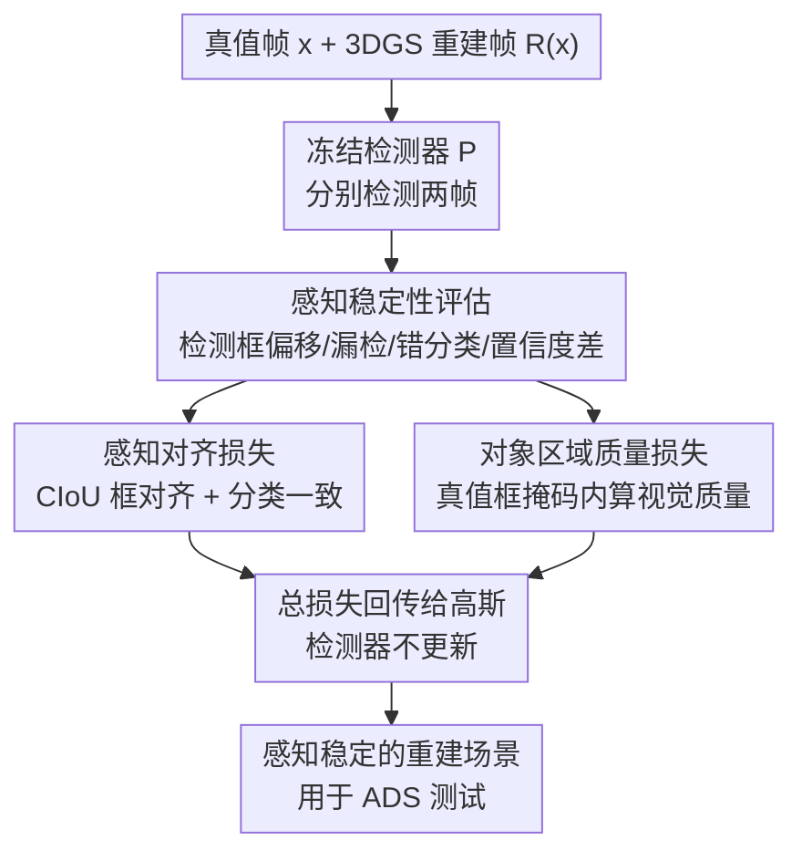

# Beyond Visual Reconstruction Quality: Object Perception-aware 3D Gaussian Splatting for Autonomous Driving

**会议**: ICLR2026  
**OpenReview**: [https://openreview.net/forum?id=PmQlMTBmpa](https://openreview.net/forum?id=PmQlMTBmpa)  
**代码**: https://github.com/Shanicky-RenzhiWang/Perception-aware-3DGS  
**领域**: 自动驾驶 / 3D 重建  
**关键词**: 3D 高斯泼溅, 自动驾驶仿真, 感知稳定性, 对象区域重建, 场景生成

## 一句话总结
这篇论文指出"重建得越像就越能复现自动驾驶系统行为"是一个未经验证的强假设，提出用**感知稳定性**（同一感知模型在重建图与真值图上输出是否一致）取代纯视觉相似度作为优化目标，并给出两个即插即用的损失——感知对齐损失与对象区域质量损失——在不损失视觉质量的前提下显著提升了重建场景的感知一致性。

## 研究背景与动机
**领域现状**：3D 高斯泼溅（3DGS）因为能从多视角图像快速重建出照片级真实的场景，已经成为给自动驾驶系统（ADS）造测试场景的主力工具。但现有的街景 3DGS 方法（StreetGaussian、DrivingGaussian、S3Gaussian、OmniRe、EMD 等）几乎都沿用了通用重建领域的优化目标，盯着 SSIM、PSNR、LPIPS 这类全局图像相似度指标做优化。

**现有痛点**：把全局图像相似度做高，并不等于重建场景对自动驾驶有用。ADS 的决策最终取决于视野内**物体**（尤其是 NPC 车辆/行人）的位置、尺度、类别，而这些物体在画面里往往只占很小一块面积，全局相似度指标会系统性地低估它们的重要性。作者做了一组前置实验：用 YOLOv8 / Faster R-CNN / RT-DETR 三种检测器去测现有方法，发现它们视觉指标都很漂亮（SSIM 0.92~0.96），但检测器在重建图上的输出和在真值图上的输出经常对不上——也就是说"看起来很像"的场景，喂给感知模块却会得到不一样的检测结果。

**核心矛盾**：现有工作建立在一个**从未被验证的隐含假设**上——图像越相似 → ADS 行为越一致。作者统计了像素指标（SSIM/PSNR/LPIPS）和检测稳定性（mAP/mean IoU）之间的 Pearson 相关系数，发现虽然统计显著（$p<5\times10^{-3}$），但相关系数只在 $0.3\sim0.6$ 之间，关系很弱：视觉变好和感知变稳大方向一致，但远谈不上能互相预测。这就把那个强假设直接证伪了。

**本文目标**：重建的目标不该只是"像"，而该是让同一个感知模型在重建场景上的输出和在原始场景上的输出**保持一致**——哪怕原图上感知模型本身就检测错了，重建也应该把这个错误如实复现出来（因为 ADS 测试的目的恰恰是暴露感知模块的缺陷，而不是替它修 bug）。

**切入角度**：既然 ADS 的入口是感知模块，那就直接把感知模块的输出差异搬进重建的优化目标里。作者把这个原则称为**感知感知重建（perception-aware reconstruction）**，并形式化为一个约束优化问题：在保证视觉质量不低于某阈值的前提下，最小化感知输出差异。

**核心 idea**：用"感知稳定性"代替"视觉相似度"作为重建的优化对象，并用两个互补的损失项（一个直接对齐检测输出、一个专门加强物体区域的重建）把这个目标灌进 3DGS 训练，感知模型全程冻结、只回传梯度给高斯。

## 方法详解

### 整体框架
论文把问题形式化为约束优化：给定真值图 $x$ 和 3DGS 重建模型 $R$，传统目标只是最小化渲染图 $R(x)$ 与 $x$ 的视觉差异 $L_{recon}=d_{img}(R(x),x)$；本文额外要求最小化感知差异 $L_{perc}=d_{perc}(P(R(x)),P(x))$，其中 $P$ 是冻结的检测模型，整体写成

$$\min_{R}\ \mathbb{E}_x\big[d_{perc}(P(R(x)),P(x))\big]\quad \text{s.t.}\quad \mathbb{E}_x\big[d_{img}(R(x),x)\big]\le\varepsilon$$

围绕这个目标，作者先用一套**感知稳定性评估**把"输出不一致"拆成四种可量化的退化（检测框偏移、漏检、错分类、置信度差），再给出两条互补的优化路线。**方法一（感知对齐损失）**是最直接的做法：每次迭代都把当前重建帧喂进检测器，直接惩罚它和真值帧检测结果的差异，思路直白但要在线跑检测、训练慢。**方法二（对象区域质量损失）**是对方法一的反思与提效：它不在线跑检测，而是离线拿到真值图的检测框当掩码，只在物体区域内额外算一份视觉质量损失，几乎不增加训练开销。两条损失都可单用，也可叠加，且都只回传给 3DGS，检测器始终冻结。

### 关键设计

**1. 感知稳定性：把"重建有没有用"重新定义成感知输出一致性**

这是整篇论文的概念基石，针对的痛点是"图像相似 ≠ ADS 行为一致"这个被证伪的假设。作者不再拿重建图去对齐真值物体的标注，而是定义：重建是否合格，看同一个感知模型 $P$ 喂真值帧 $x$ 和喂重建帧 $R(x)$ 时，输出是否一致——即 $L_{perc}=d_{perc}(P(R(x)),P(x))$。这里有个反直觉但很关键的取舍：参照系是 $P(x)$ 而不是数据集真值标注。也就是说，如果检测器在原图上本来就漏检或错分了某个物体，理想的重建应当**把这个错误也复现出来**，而不是"修正"它。原因是 3DGS 在 ADS 里的用途是高效暴露感知模块的缺陷、做系统测试，如果重建反而让检测器看到比原图更多的物体（论文图 1 里 EMD+OmniRe 就出现了这种"检测出比真值更多物体"的情况），对想通过重建场景去压测感知性能的开发者反而是误导。前置实验里作者用 SSIM 量视觉质量、用 mean IoU 量检测框一致性、用 mAP@[0.5:0.95] 量置信度与错分、再统计漏检数，正是这套指标体系证明了"视觉好但感知不稳"的普遍存在。

**2. 感知对齐损失：直接把检测器的输出差异写进训练目标**

针对感知不稳，最直接的解法就是让重建过程"看着检测结果学"。作者把感知对齐损失定义为预测框与类别标签两部分误差之和：

$$L_{perc}=\sum_i\big(\lambda_{box}\cdot L_{box}(B(x),B(R(x)))+\lambda_{cls}\cdot L_{cls}(C(x),C(R(x)))\big)$$

框回归这部分没有用普通 IoU，而是选了 **CIoU（Complete IoU）**：因为在自动驾驶里，物体框不仅要和真值充分重叠，中心点位置还要准（直接影响后续跟踪与轨迹预测），长宽比也要对（影响目标类型判断和决策）；CIoU 恰好同时惩罚重叠度、中心点距离、长宽比三项，天然契合 ADS 需求，写成 $L_{box}=1-\frac{1}{n}\sum_{i=1}^{n}\mathrm{CIoU}(B_i(x),B_i(R(x)))$。分类损失则简单地看预测类别在真值帧与重建帧上是否一致：$L_{cls}=1-\frac{1}{n}\sum_{i=1}^{n}\mathbb{1}(C_i(x)=C_i(R(x)))$。最终并入总损失 $L_{total}=\lambda_{visual}\cdot L_{visual}+\lambda_{perc}\cdot L_{perc}$，且只在 3DGS 的 fine 阶段施加、检测器全程冻结。这个设计的好处是直接对症下药，缺点也明显（下一个设计正是为修它而生）：可解释性弱（改善来自检测器黑箱输出）、且每次迭代都要在线跑一遍检测，显著增加训练时间和显存。

**3. 对象区域质量损失：用真值检测框当掩码，只补物体区域的重建质量**

这是对方法一的反思与提效。作者分析了大量重建后感知翻车的案例，发现两类典型退化：静态物体上出现**区域断裂/建模裂缝**，动态物体上出现**区域模糊**——根因是 3DGS 依赖 LiDAR/点云，在物体边缘天生缺乏细粒度重建，加上物体区域面积本来就比天空、建筑这些层小得多，现有方法对它的重建质量更没保障。既然问题出在"物体区域重建得不够好"，那就直接给物体区域单独加一份视觉质量损失：

$$L_{obj\text{-}vis}=d_{vis}(R(x)\odot B(x),\ x\odot B(x))$$

其中 $\odot$ 用检测框生成的掩码把物体区域抠出来、$d_{vis}$ 是视觉相似度度量，并入总损失 $L_{total}=\lambda_{visual}\cdot L_{visual}+\lambda_{obj\text{-}vis}\cdot L_{obj\text{-}vis}$。它和方法一的本质区别在于：掩码 $B(x)$ 来自**离线**的真值帧检测结果，训练时不再需要每步在线跑检测器，因此几乎不增加运行开销；同时它把训练注意力显式聚焦到"感知模型认为重要"的区域，强化边缘和纹理的保真度，从而间接提升感知稳定性。论文里所有 $\lambda$ 都简单设为 1，以排除调参对结论的干扰。两条损失可叠加使用，多数情况下同时上效果最好。

### 损失函数 / 训练策略
全部权重 $\lambda_{box},\lambda_{cls},\lambda_{visual},\lambda_{perc},\lambda_{obj\text{-}vis}$ 均设为 1，刻意不调参以凸显损失本身的有效性。训练沿用 3DGS 惯例：coarse 阶段 5,000 步 + fine 阶段 30,000 步，两个新损失都只在 fine 阶段加入。感知模型在整个训练中冻结，损失只回传给高斯参数。作者也在 Discussion 里承认权重 trade-off 没充分探索——例如交通场景里物体多但每个面积小，而机器人操作场景里关键物体少但占画面大，两者理应需要不同的 $\lambda$ 组合。

## 实验关键数据

实验全部基于 Waymo 数据集，沿用 S3Gaussian 与 EMD 的场景选择，重建基座取 S3Gaussian、OmniRe、EMD(S3G)、EMD(OmniRe) 四种；指导模型用 YOLOv8，再用 Faster R-CNN 和 RT-DETR 当**黑盒**检测器验证泛化（即损失只对着 YOLOv8 训，看换检测器还灵不灵）。

### 主实验：感知对齐损失（方法一）

| 基座 | 检测器 | mAP↑（原始→+Lperc） | mean IoU↑（原始→+Lperc） | 漏检↓ |
|------|--------|------|------|------|
| S3Gaussian | YOLOv8 | 0.550 → 0.593 | 0.803 → 0.840 | 1.5 → 0.83 |
| S3Gaussian | Faster R-CNN | 0.171 → 0.229 | 0.620 → 0.632 | 2.0 → 0.7 |
| EMD(S3G) | RT-DETR | 0.518 → 0.674 | 0.770 → 0.875 | 0.0 → 0.0 |
| OmniRe | Faster R-CNN | 0.320 → 0.360 | 0.718 → 0.722 | 0.3 → 0.0 |

关键点：加了感知对齐损失后，不仅训练用的 YOLOv8 上 mAP / mean IoU 普遍上升，**没参与训练的 Faster R-CNN 和 RT-DETR 也同步改善**，说明提升的是重建质量本身而非过拟合到某个检测器；同时视觉质量（SSIM）波动仅 $\pm<1\%$，代价可接受。

### 主实验：对象区域质量损失（方法二）

| 基座（YOLOv8） | SSIM↑ | Obj SSIM↑ | mAP↑ | mean IoU↑ | 漏检↓ |
|------|------|------|------|------|------|
| S3Gaussian | 0.924 | 0.877 | 0.550 | 0.803 | 1.5 |
| S3Gaussian + Lobj-vis | 0.937 | 0.921 | 0.672 | 0.862 | 0.4 |
| S3Gaussian + Lperc + Lobj-vis | 0.941 | 0.924 | **0.700** | **0.872** | **0.0** |
| EMD(OmniRe) + Lperc + Lobj-vis | 0.969 | 0.940 | 0.510 | 0.856 | 0.0 |

对象区域质量损失把 Obj SSIM（物体区域的 SSIM）显著拉高，并且**全局 SSIM 也跟着涨**（不像方法一会略微牺牲视觉质量）；两损失叠加在多数情况下最优，例如 S3Gaussian 上 mAP 从 0.550 一路升到 0.700、漏检从 1.5 降到 0。

### 运行时分析

| 基座 | 每 100 epoch（秒）原始 / +Lperc / +Lobj-vis | 总时长（分）原始 / +Lperc / +Lobj-vis |
|------|------|------|
| S3G | 25.20 / 26.67 / 25.30 | 204.4 / 232.2 / 205.4 |
| EMD(OmniRe) | 44.94 / 46.45 / 45.00 | 364.5 / 413.2 / 364.9 |

方法一因为每步要多跑一次 YOLO 推理，总训练时间明显变长（S3G 上 +13.6%）；方法二只多算一份损失，开销几乎可忽略——这正是方法二相对方法一的核心优势（测试用 RTX A5000，YOLOv8n 轻量检测器；换重检测器差距会更大）。

### 关键发现
- **黑盒泛化是最强证据**：只对 YOLOv8 训的损失，能让 Faster R-CNN、RT-DETR 上的指标一起涨，说明改善的是"物体区域重建得更好"这件实事，而非讨好某个检测器。
- **方法二既快又稳**：对象区域质量损失靠离线掩码避开在线推理，开销可忽略，且对全局视觉质量是正贡献；但在个别场景下其 IoU 精度不一定胜过方法一。
- **漏检几乎清零**：多个配置下漏检数从 1.5~2.0 降到 0，对安全攸关的 ADS 测试意义重大。

## 亮点与洞察
- **证伪一个领域默认假设**：用一组相关性统计（Pearson $r$ 仅 0.3~0.6）直接戳破"视觉相似度高 = 感知行为一致"的隐含前提，这种"先证伪再立靶"的论证比单纯刷指标更有说服力。
- **"要复现错误而非修正错误"的反直觉立场**：把参照系定为 $P(x)$ 而非数据集真值标注，主张重建应忠实复现感知模型自身的缺陷——这恰恰贴合 ADS 测试"暴露问题"的本质，是很容易被做反的关键判断。
- **方法二的提效思路可迁移**：把"在线跑昂贵模型的输出当监督"换成"离线缓存该模型的输出当掩码/伪标签"，是个通用的省算力技巧，可迁移到任何需要冻结大模型做引导的训练场景。
- **即插即用**：两个损失不改 3DGS 架构、只加损失项且检测器冻结，能直接套到 S3Gaussian / OmniRe / EMD 等现有方法上。

## 局限与展望
- **权重 trade-off 未探索**：所有 $\lambda$ 都设为 1，没有研究视觉真实度与感知稳定性之间的权衡；作者自己指出交通场景（物体多但小）和机器人场景（物体少但大）应需不同权重，留作未来的自适应/可学习加权工作。
- **只验证了检测一种感知任务**：论文把感知模块特指为检测模型，分割、深度估计、跟踪等下游模块是否同样受益没有验证。
- **依赖检测框作监督**：方法一的可解释性弱（提升来自检测器黑箱输出），方法二的掩码质量取决于真值帧检测结果，若原图检测本身很差，掩码也会跟着偏。
- **数据集单一**：实验全在 Waymo 上，跨数据集（nuScenes、KITTI）泛化性未测。

## 相关工作与启发
- **vs StreetGaussian / DrivingGaussian / DeSiRe-GS**：它们都在通用重建目标（SSIM/PSNR/LPIPS）上做优化，本文证明这条路对 ADS 不够，转而优化感知稳定性。
- **vs S3Gaussian / OmniRe / EMD**：这些是当前重建性能与可扩展性的领跑者，本文不与它们竞争而是把自己的损失即插即用地叠加在它们之上，把它们的感知稳定性进一步抬高。
- **vs Huang et al. / Wei et al.（增强 NPC 特征的工作）**：它们也意识到物体重要，并试图专门增强 NPC，但只保证"正确识别的物体"被复现；本文更进一步，主张连"原图上已存在的检测错误"都要忠实复现，直击 ADS 测试要暴露缺陷的根本诉求。

## 评分
- 新颖性: ⭐⭐⭐⭐ 用感知稳定性取代视觉相似度作为重建目标、并主张"复现错误"，视角新且有说服力
- 实验充分度: ⭐⭐⭐⭐ 四种基座 × 三种检测器（含黑盒泛化）+ 运行时分析，证据链完整；但限于 Waymo 单数据集、单一感知任务
- 写作质量: ⭐⭐⭐⭐ 动机—证伪—方法—验证逻辑顺畅，前置研究尤其扎实
- 价值: ⭐⭐⭐⭐ 即插即用、几乎零额外开销（方法二），对自动驾驶仿真测试有直接实用价值

<!-- RELATED:START -->

## 相关论文

- [\[ICCV 2025\] AD-GS: Object-Aware B-Spline Gaussian Splatting for Self-Supervised Autonomous Driving](../../ICCV2025/autonomous_driving/ad-gs_object-aware_b-spline_gaussian_splatting_for_self-supervised_autonomous_dr.md)
- [\[CVPR 2026\] ParkGaussian: Surround-view 3D Gaussian Splatting for Autonomous Parking](../../CVPR2026/autonomous_driving/parkgaussian_surround-view_3d_gaussian_splatting_for_autonomous_parking.md)
- [\[ICCV 2025\] EMD: Explicit Motion Modeling for High-Quality Street Gaussian Splatting](../../ICCV2025/autonomous_driving/emd_explicit_motion_modeling_for_high-quality_street_gaussian_splatting.md)
- [\[ICLR 2026\] GaussianFusion: Unified 3D Gaussian Representation for Multi-Modal Fusion Perception](gaussianfusion_unified_3d_gaussian_representation_for_multi-modal_fusion_percept.md)
- [\[AAAI 2026\] LiDAR-GS++: Improving LiDAR Gaussian Reconstruction via Diffusion Priors](../../AAAI2026/autonomous_driving/lidar-gsimproving_lidar_gaussian_reconstruction_via_diffusion_priors.md)

<!-- RELATED:END -->
