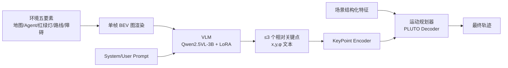

# Bird's-eye-view Informed Reasoning Driver (BIRDriver)

**会议**: ICLR 2026  
**OpenReview**: [https://openreview.net/forum?id=TuU95FWkyH](https://openreview.net/forum?id=TuU95FWkyH)  
**代码**: 待确认  
**领域**: 自动驾驶 / VLM 运动规划  
**关键词**: 自动驾驶, 运动规划, BEV, 视觉语言模型, 长尾场景, 关键点, 加权 SFT  

## 一句话总结
BIRDriver 把整个驾驶场景压缩成一张单帧 BEV 俯视图喂给 VLM，让 VLM 只输出不超过 3 个相对坐标关键点来表达驾驶意图，再由运动规划器据此生成轨迹，从而把 VLM 的常识推理能力低成本地嫁接到长尾驾驶场景上。

## 研究背景与动机
- **领域现状**：自动驾驶运动规划目前以规则法和模仿学习为主，在常见场景上已有很强的闭环表现（如 PLUTO、Diffusion Planner 在 nuPlan 上接近 SOTA）。
- **现有痛点**：这些规划器只基于结构化输入（物体状态、地图元素）决策，缺乏人类式的语境理解，遇到训练数据里没有的长尾场景（绕行抛锚车、施工区）就会失败。
- **核心矛盾**：VLM/LLM 有强大的常识与零样本泛化能力，但接入规划器的三种已有范式各有硬伤——meta-action（如 Senna）粒度太粗、隐特征（如 AsyncDriver）抽象不可解释、直接输出 waypoint 序列（如 DriveVLM）冗余且无法吃到互联网预训练红利（轨迹能力主要来自领域数据而非通用语料）。
- **本文目标**：设计一个分层框架，既保留实时规划器的安全性，又让 VLM 以一种"既能利用预训练知识、又不依赖领域专用编码器和昂贵对齐"的方式注入高层意图。
- **核心 idea**：**用单帧 BEV 图替代文本场景描述 + 用 ≤3 个相对关键点替代密集轨迹**——BEV 图作为 VLM 唯一视觉输入承载全部场景信息（文本里不含任何场景细节），既绕开跨车型传感器对齐难题，又让 VLM 充分发挥俯视图理解能力；稀疏关键点则用最少的"语言"传达意图，把繁重的轨迹细化交还给专业规划器。

## 方法详解

### 整体框架
BIRDriver 是一个 VLM + 运动规划器的两段式分层架构，通过**解耦训练、串行推理**实现闭环驾驶。VLM 输入为单帧 BEV 图 + system/user prompt，输出文本形式的关键点；关键点经 KeyPoint Encoder 编码后，与场景结构化特征一起送入运动规划器（基于 PLUTO）解码出最终轨迹。

### 关键设计

**1. 单帧 BEV 表征：把场景全塞进一张图，文本零场景细节**
BIRDriver 不用多帧环视相机，而是把环境的五类信息——地图（车道、连接线、人行道、离散路点）、Agent（自车橙、他车蓝、自行车粉、行人棕的 bounding box 加朝向箭头，非自车 Agent 还用绿实线画出过去 2 秒轨迹）、红绿灯（编码为路口停止线颜色）、路线（可行驶区淡蓝填充 + 紫色箭头参考线）、障碍（施工标志/路障/锥桶为黑框）——统一渲染成一张俯视图。所有元素的符号含义都在 system prompt 里向 VLM 解释清楚。这样做的好处是：VLM 只需理解一张图就掌握全场景，避免了跨车型异构传感器对齐，部署到不同真实平台时大大简化。

**2. RDP 关键点提取：用稀疏几何点压缩驾驶意图**
未来轨迹本是密集位姿序列 $(x_i, y_i, \phi_i)_{i=1}^N$，BIRDriver 用经典的 Ramer–Douglas–Peucker 曲线简化算法从中抽出稀疏关键点。RDP 递归地用首尾连线，计算中间点到该线的垂距 $d_i = \frac{|(P_N - P_1)\times(P_i - P_1)|}{\|P_N - P_1\|}$，若最大垂距 $d_{max}$ 超过容差 $\epsilon$（论文取 0.02）就在该点切分递归，否则只保留端点。由于不同机动（保持/变道/转弯）复杂度不同，关键点上限按轨迹类型自适应调整，但轨迹终点必定保留。除终点（代表轨迹结束位置）外，其余关键点都是**时间无关**的，只刻画轨迹几何形状，且全部以相对自车的 $(x, y, \phi)$ 表示。

**3. 三任务复合数据集：补足 VLM 的空间感与场景理解短板**
直接微调发现关键点预测误差偏大，根因有二：VLM 不懂 BEV 像素距离与真实物理距离的对应关系，以及对驾驶场景的分类理解不足。BIRDriver 用 LoRA 微调（解冻语言模型、所有线性层加 adapter），并构造三类数据集对症下药——**Key Point 数据集**（主任务，BEV+prompt→关键点）打底；**Spatial Localization 数据集**让 VLM 预测随机车辆相对自车的位姿，弥合像素-物理距离差；**Driving Scene Stepwise 数据集**要求 VLM 先判定场景类型再预测关键点，强化场景理解。三者按 10:1:2 的比例混合（共 83.8 万样本）联合微调。

**4. 加权 SFT 损失：让数字 token 的精度被重点照顾**
标准 SFT 把每个 token 一视同仁，但关键点任务里数字 token 的精度才是关键。BIRDriver 给数字、小数点、符号三类 token 加权，且考虑到高位数字比低位更重要，设计了**分层线性衰减**权重：一个数字段内权重从最高位的 $(\alpha + d_n)$ 线性衰减到末位的 1，符号位默认最高权重，非数字 token 权重为 1：

$$\mathcal{L}_{SFT}(\theta) = \frac{1}{T}\sum_{t=1}^{T} w_t \big(-\log p_\theta(y_t \mid y_{<t}, X)\big)$$

其中 $\alpha>0$（论文取 5），$d_n$ 为数字段 $n$ 的位数，$L_n$ 为其 token 长度，所有浮点标签四舍五入到两位小数。相比 PDCE 损失，它无需生成软标签或标准化数字格式，只调权重而不改目标分布，因此实现更简单、也更不易损伤 VLM 的通用语言能力。

**5. 带噪声增强的规划器微调：让规划器学会容忍 VLM 误差**
运动规划器（PLUTO）独立于 VLM 微调，目标是准确跟随关键点。训练时用 RDP 从真实轨迹抽关键点，并加入零均值、标准差等于 VLM 预测平均绝对误差的高斯噪声 $\epsilon_i \sim \mathcal{N}(0, \Sigma)$、$\Sigma = \mathrm{diag}(\sigma_x^2, \sigma_y^2, \sigma_\phi^2)$ 做增强，使规划器对 VLM 的预测偏差更鲁棒（联合推理时不再加噪）。此外推理阶段把上一时刻的最终规划点作为额外关键点喂入，增强决策的时序一致性。选 PLUTO 而非 Diffusion Planner 是因为同样设置下后者跟踪多关键点能力更弱。

## 实验关键数据

### 主实验表格（nuPlan，闭环得分 CLS，0-100）

| 类型 | 方法 | T14-rand NR | T14-rand R | T14-hard NR | T14-hard R | InterPlan R |
|------|------|------|------|------|------|------|
| Rule | PDM-Closed | 90.05 | 91.64 | 65.07 | 75.18 | 43.51 |
| IL | PLUTO（基线） | 91.87 | 90.03 | 80.03 | 76.92 | 48.92 |
| IL | Diffusion Planner | 93.85 | 91.73 | 78.82 | 81.42 | 39.85 |
| LLM | InstructDriver | 70.31 | 66.96 | 57.37 | 52.95 | 32.31 |
| VLM | PlanAgent | - | - | 72.51 | 76.82 | - |
| **VLM-IL** | **BIRDriver (PLUTO)** | 91.46 | **91.26*** | **80.56*** | **80.33*** | **55.29*** |

\* 表示超过基线 PLUTO。在长尾的 InterPlan 上 BIRDriver 取得 SOTA，比 PLUTO、Diffusion Planner 分别高 **13.0%** 和 **38.8%**；除 Test14-random 的 CLS-NR 外，全面优于基线。VLM 基座为 Qwen2.5VL-3B。

### 消融实验表格
数据集设计 + 加权损失对关键点预测误差的影响（Qwen2.5VL-3B，Test14-hard 272 clip）：

| 配置 | x 误差 | y 误差 | φ 误差 |
|------|------|------|------|
| 仅 KeyPoint | 4.27m | 1.35m | 4.23° |
| +Driving Scene Stepwise | 4.17m | 1.28m | 4.20° |
| ++Spatial Localization | **3.76m** | **1.08m** | **3.80°** |
| 全量但无加权 SFT 损失 | 4.22m | 1.19m | 4.13° |

三数据集叠加后 x/y/φ 误差较仅 KeyPoint 分别降 11.9%/20.0%/10.2%；加权损失再额外降 10.9%/9.2%/8.0%。

关键点提取方式（InternVL2.5-4B，InterPlan）：

| 方法 | InterPlan |
|------|------|
| RDP（本文） | **53.81** |
| 仅终点 | 34.72 |

### 关键发现
- **Spatial Localization 数据集贡献最大**：说明弥合 BEV 像素与物理距离的鸿沟，比增强场景理解更能降低关键点误差。
- **只用终点会比基线更差**（34.72 < PLUTO 的 48.92）：缺少中间关键点引导，规划器无法生成抵达单一终点的合理轨迹，反而失败——证明稀疏中间点的必要性。
- **VLM 参数量存在拐点**：InternVL2.5 从 2B→4B 误差骤降 43.7%/48.4%/56.3%，但 Qwen2.5VL 从 3B→7B 仅 x 方向降 4.3%、y/φ 几乎不变；综合精度与推理效率最终选 3B。

## 亮点与洞察
- **BEV 即"通用语言"**：把场景压成一张俯视图、文本零场景细节，是本文最巧妙的一招——既让 VLM 吃满互联网级预训练的图像理解能力，又天然规避跨车型传感器对齐，是"用对模型的强项"的典范。
- **≤3 个关键点的极简意图接口**：在 meta-action（太粗）和 waypoint 序列（太冗）之间找到甜点，相对坐标 + 时间无关的几何点既可解释又轻量。
- **加权 SFT 损失针对性极强**：精准命中"VLM 不擅长生成精确数字"这一痛点，且以"只改权重不改分布"的克制方式避免伤害通用能力，工程上比 PDCE 更易落地。

## 局限与展望
- **单帧 BEV 丢失时序动态**：虽用绿线画了过去 2 秒轨迹，但单帧表征对高速/快速变化场景的预测能力可能受限。
- **依赖上游 BEV 构建质量**：BEV 图渲染需要准确的感知输出，感知误差会直接传导到 VLM 推理。
- **仅在 nuPlan 仿真验证**：尚未有真车闭环或跨数据集泛化结果；且串行推理（VLM 后接规划器）的实时性在高频规划下仍需关注。
- **关键点数 ≤3 的上限是否对所有复杂机动够用**仍有探索空间。

## 相关工作与启发
- **VLM 接入规划器的三范式**：meta-action（Senna）、隐特征（AsyncDriver）、waypoint（DriveVLM），本文以"BEV+关键点"开辟第四条路。
- **BEV grounding VLM**：PlanAgent、Choudhary 等已用 BEV 增强 VLM，但多依赖额外模态或聚焦场景查询；本文是首个纯 BEV 输入的分层 VLM-规划框架。
- **启发**：当通用大模型不擅长某种精确输出（数字坐标）时，"换一种它擅长的表征（图像）做输入 + 用最少的符号做输出 + 损失层面定向加权"是一套可复用的低成本嫁接思路。

## 评分
- **新颖性**: ⭐⭐⭐⭐ — 单帧 BEV 作 VLM 唯一输入 + ≤3 相对关键点接口的组合是规划领域的新范式，加权 SFT 损失也有针对性创新。
- **实验充分度**: ⭐⭐⭐⭐ — 三个 benchmark + 四组消融（数据集/损失/提取方式/VLM 选型）较完整，但仅限 nuPlan 仿真、缺真车与跨集泛化。
- **写作质量**: ⭐⭐⭐⭐ — 动机层层递进、三范式对比清晰、方法与公式表述严谨。
- **价值**: ⭐⭐⭐⭐ — 长尾场景 SOTA 且部署友好（绕开传感器对齐），对工业界落地有较强参考价值。

<!-- RELATED:START -->

## 相关论文

- [\[CVPR 2026\] CycleBEV: Regularizing View Transformation Networks via View Cycle Consistency for Bird's-Eye-View Semantic Segmentation](../../CVPR2026/autonomous_driving/cyclebev_regularizing_view_transformation_networks_via_view_cycle_consistency_fo.md)
- [\[CVPR 2026\] BEV-SLD: Self-Supervised Scene Landmark Detection for Global Localization with LiDAR Bird's-Eye View Images](../../CVPR2026/autonomous_driving/bev-sld_self-supervised_scene_landmark_detection_for_global_localization_with_li.md)
- [\[CVPR 2026\] Spe-BEVHead: Rethinking the Detection Head Design for Bird's-Eye-View Object Detection](../../CVPR2026/autonomous_driving/spe-bevhead_rethinking_the_detection_head_design_for_birds-eye-view_object_detec.md)
- [\[CVPR 2026\] BEV-CAR: Enhancing Monocular Bird's Eye View Segmentation with Context-Aware Rasterization](../../CVPR2026/autonomous_driving/bev-car_enhancing_monocular_birds_eye_view_segmentation_with_context-aware_raste.md)
- [\[ICLR 2026\] Loc²: Interpretable Cross-View Localization via Depth-Lifted Local Feature Matching](loc2_interpretable_cross-view_localization_via_depth-lifted_local_feature_matchi.md)

<!-- RELATED:END -->
