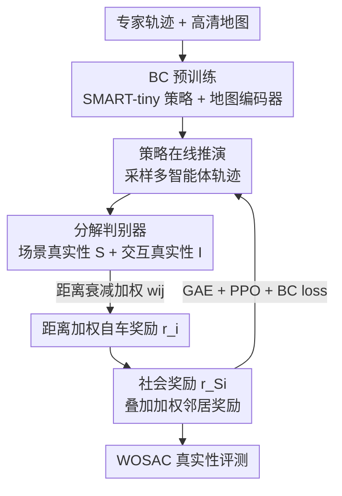

# DecompGAIL: Learning Realistic Traffic Behaviors with Decomposed Multi-Agent Generative Adversarial Imitation Learning

**会议**: ICLR 2026  
**OpenReview**: [https://openreview.net/forum?id=AcDx2tUZPb](https://openreview.net/forum?id=AcDx2tUZPb)  
**代码**: 无  
**领域**: 自动驾驶 / 交通仿真 / 多智能体模仿学习  
**关键词**: 交通行为仿真, 多智能体 GAIL, 判别器分解, 社会化 PPO, WOMD Sim Agents

## 一句话总结
针对多智能体 GAIL 在交通仿真中训练不稳定的问题，本文指出根因是判别器被「邻居—邻居」这类与自车动作弱相关的交互误导（irrelevant interaction misguidance），提出把真实性显式拆成「自车—地图」与「自车—邻居」两路、并配以距离加权社会奖励的 DecompGAIL，在 WOMD Sim Agents 2025 榜单上取得 SOTA 真实性。

## 研究背景与动机
**领域现状**：真实的交通仿真是自动驾驶评测与城市出行规划的基石。主流做法把它建模成多智能体模仿学习：要么用行为克隆（BC）把模仿当成监督学习，从专家轨迹回归动作；要么用逆强化学习（IRL），其中 GAIL 最常用——训练一个判别器去区分专家轨迹和策略轨迹，再把判别器打分当作奖励驱动策略去「骗过」判别器。

**现有痛点**：BC 存在协变量偏移（covariate shift）——策略上线后产生的状态分布逐渐偏离专家分布，误差随时间累积，导致碰撞、驶出路面等不合理行为。GAIL 理论上能对齐分布从而缓解协变量偏移，但在多智能体场景中训练极不稳定。已有工作用参数共享、课程学习（逐步增加车辆数或推演时长）来缓解，但都是治标，没触及根因。

**核心矛盾**：本文识别出不稳定的真正来源——**无关交互误导**。在去中心化设置下，每个自车有一个判别器，它评估的是自车的局部观测，而局部观测里包含了邻居。当一个策略控制的邻居车行为不真实（比如和另一辆车相撞）时，判别器会因为「专家数据里很少出现这种邻居相撞」而给自车一个很低的真实性分数——即便自车本身开得完全真实。于是出现荒谬的矛盾：**真实的自车行为反而被惩罚**。更糟的是，这类邻居—邻居交互的数量随邻居规模近似二次增长，邻居越多奖励越噪、越没用。

**本文目标**：让判别器只奖励/惩罚与自车动作真正因果相关的信号，把弱相关的高阶交互从奖励里剔除，从而获得稳定且信息量足的奖励。

**切入角度**：把判别器隐式表征的信号在概念上拆成四项——自车—地图（场景真实性 $\phi_1$）、自车—邻居（交互真实性 $\phi_2$）、邻居—地图/邻居—邻居（$\phi_3$）、更高阶项（$\phi_4$）。其中 $\phi_3$ 与自车动作弱相关却随邻居数二次膨胀，是噪声的主要来源。

**核心 idea**：用一个「分解判别器」从输入设计上就只看 $\phi_1$ 和 $\phi_2$、天然屏蔽 $\phi_3/\phi_4$，再用距离加权的社会奖励让各智能体在不拖累邻居的前提下提升自身真实性。

## 方法详解

### 整体框架
DecompGAIL 建立在轻量的 SMART-tiny 主干之上，把交通仿真当成「token 化的多智能体序列预测 + 对抗微调」。整体分两阶段：先用 BC 预训练地图编码器和策略网络得到强初始化（在线交互昂贵，预训练能省算力），再用 DecompGAIL 在线微调。微调时，**分解判别器**分别对「自车—地图」算场景真实性 $S_t^i$、对每个「自车—邻居」对算交互真实性 $I_t^{ij}$，显式略去邻居—邻居和邻居—地图项；自车奖励是场景分与所有成对交互分的加权和；最后 **Social PPO** 用一个在自车奖励上叠加距离加权邻居奖励的「社会奖励」来优化策略。

整条管线是「预训练 → 推演采样 → 分路判别打分 → 距离加权拼奖励 → 社会化拼奖励 → PPO 更新」的串行回环：

### 关键设计

**1. 分解判别器：从输入上切断无关交互，根治 misguidance**

针对「真实自车被邻居拖累而遭惩罚」这一痛点，本文不再用单一的整体判别器（PS-GAIL）。PS-GAIL 把地图 token 和所有邻居 token 融成单个自车特征再打分，等于让判别器隐式表征了 $\phi_1+\phi_2+\phi_3+\phi_4$ 全部四项，信号纠缠在一起。DecompGAIL 改用两路独立的 MLP 头：**场景真实性**只吃自车与地图的注意力特征 $S_t^i = \phi_1(a^i_{\le t}, m) = \text{MLP}(\text{map}^i_t)$；**交互真实性**对每个自车—邻居对单独算 $I_t^{ij} = \phi_2(a^i_{\le t}, a^j_{\le t}) = \text{MLP}([\text{temp}^i_t, \text{RPE}^{ij}_t, \text{temp}^j_t])$。由于输入里根本不包含「邻居—邻居」的成对组合，判别器在设计上就无法表征 $\phi_3$ 与高阶项 $\phi_4$，从而把那条随邻居数二次膨胀的噪声通道彻底掐断。判别器损失对两路分别用 BCE 对齐专家与策略样本：

$$L_D = \mathbb{E}_{\pi_E}\Big[\log S_t^i + \sum_{j\in N_i} w_{ij}\log I_t^{ij}\Big] + \mathbb{E}_{\pi_\theta}\Big[\log(1-S_t^i) + \sum_{j\in N_i} w_{ij}\log(1-I_t^{ij})\Big].$$

**2. 距离衰减加权：让奖励聚焦于因果上更相关的近邻**

即便只保留自车—邻居交互，远处邻居与自车动作的因果关联也很弱。本文给每个交互项乘上距离衰减权重 $w_{ij} = \alpha\exp(-d(i,j)/\beta)$，其中 $d(i,j)$ 是车间距、$\alpha,\beta$ 为超参，从而强调更可能与自车动作因果相关的近邻、淡化远邻。自车的最终奖励就是场景分与全部加权交互分之和：

$$r_t^i = -\log(1-S_t^i) - \sum_{j\in N_i} w_{ij}\log(1-I_t^{ij}).$$

实验表明性能对衰减范围 $\beta$ 比对尺度 $\alpha$ 更敏感，过小/过大都会过度强调极近或极远邻居而损害真实性；消融里把距离加权换成均匀平均（mean interact realism）会明显掉点，印证了距离感知加权的必要性。

**3. Social PPO：用社会奖励避免「各自为政」损害群体真实性**

如果直接用独立 PPO（IPPO）把每辆车当单智能体优化各自目标，容易出现「自己变好却把邻居挤坏」、群体真实性整体下降的情况。本文为每个自车定义一个**社会奖励**，在自身奖励上叠加距离加权的邻居奖励：

$$r_{S_t}^i = r_t^i + \sum_{j\in N_i}\lambda_{ij} r_t^j,$$

其中 $\lambda_{ij}$ 同样是距离衰减权重。训练仍走 IPPO 流程，只是把个体奖励替换为社会奖励，用 GAE 估计优势，价值函数用策略网络最后一层 agent–agent 注意力特征接 MLP 给出；为稳住训练，PPO 损失里再混入 BC 损失。这样每个智能体在提升自身真实性时会顾及邻居，鼓励整群智能体的整体真实性。

### 损失函数 / 训练策略
- **预训练**：BC 最大化专家联合动作的对数似然 $L_{BC}=\mathbb{E}_{\pi_E}[\log\pi_\theta(a_t\mid a_{<t}, m)]$，所有智能体共享一个策略 $\pi_\theta$，动作是共享 motion-token 词表上的独立类别分布。
- **微调**：交替更新判别器（BCE，式 9）与策略（PPO 的裁剪代理损失 + 价值损失 + BC 损失），奖励用分解后的代理奖励，超参在交互权重上取 $\alpha=10,\beta=2.5$ 最优。

## 实验关键数据

### 主实验
WOSAC 2025 排行榜 test split（真实性 metametric 为主指标，越高越好；minADE 越低越好）：

| 模型 | Metametric ↑ | Kinematic ↑ | Interactive ↑ | Map-based ↑ | minADE ↓ |
|------|------|------|------|------|------|
| **SMART-tiny-DecompGAIL（本文）** | **0.7864** | 0.4919 | **0.8152** | 0.9176 | 1.4209 |
| SMART-R1 | 0.7858 | 0.4944 | 0.8110 | 0.9201 | 1.2885 |
| SMART-tiny-RLFTSim | 0.7857 | 0.4927 | 0.8129 | 0.9183 | 1.3252 |
| TrajTok | 0.7852 | 0.4887 | 0.8116 | 0.9207 | 1.3179 |
| SMART-tiny-CLSFT | 0.7846 | 0.4931 | 0.8106 | 0.9177 | 1.3065 |
| SMART-tiny（基线） | 0.7814 | 0.4854 | 0.8089 | 0.9153 | 1.3931 |

DecompGAIL 拿到最高的真实性 metametric，并在交互（Interactive）指标上一致领先所有基线；minADE 偏高是因为方法优先对齐专家与策略的特征分布，而非优化基于距离的相似度。

### 消融实验
WOSAC 2% 验证集上的逐组件消融：

| 配置 | Metametric ↑ | Interactive ↑ | Collision Likelihood ↑ | 说明 |
|------|------|------|------|------|
| DecompGAIL（完整） | **0.7889** | 0.8283 | 0.9837 | 完整模型 |
| w/o DecompGAIL | 0.7836 | 0.8204 | 0.9667 | 只 BC 预训练、不做对抗微调 |
| w/o scene realism | 0.7801 | 0.8248 | 0.9794 | 去掉场景真实性，map-based 0.8795 明显掉 |
| w/o interact realism | 0.7772 | 0.8132 | 0.9573 | 去掉交互真实性，交互与碰撞双双大降 |
| mean interact realism | 0.7819 | 0.8153 | 0.9635 | 交互项均匀平均替代距离加权 |
| w/o neighborhood reward | 0.7871 | 0.8258 | 0.9788 | 去掉社会奖励里的邻居项 |
| mean neighborhood reward | 0.7882 | 0.8282 | 0.9812 | 邻居奖励均匀平均替代距离加权 |

### 关键发现
- **交互真实性贡献最大**：去掉它后交互指标从 0.8283 跌到 0.8132、碰撞似然从 0.9837 跌到 0.9573，说明显式建模「自车—邻居」对多智能体真实性最关键。
- **场景真实性主管地图合规**：去掉它主要拖垮 map-based（0.8795 vs 0.8948），与「驶出路面/压实线」类错误对应。
- **距离加权一致有效**：无论交互项还是邻居奖励，把距离衰减换成均匀平均都掉点，验证「近邻更因果相关」的假设。
- **稳定性（Q1）**：PS-GAIL 随邻居数（5→10→all）增加，判别器打分方差变大、均值变低，仿真性能退化；DecompGAIL 用全邻居仍把打分方差压低、均值贴近均衡点 0.5，真实性 metametric 在训练中稳步上升。

## 亮点与洞察
- **把"为什么不稳定"做成了可分解的数学结构**：式 (6) 把判别器信号拆成 $\phi_1\!\sim\!\phi_4$ 四项，并指出 $\phi_3$ 随邻居数二次膨胀是噪声主因——这种「先定位根因再对症下药」比堆课程学习/参数共享的工程修补更有说服力。
- **靠输入设计而非正则去屏蔽噪声**：不引入额外的 Wasserstein 正则或手工奖励，而是让判别器的输入里压根没有邻居—邻居成对组合，从结构上保证 $\phi_3$ 不可表征——干净、零额外先验偏置。
- **可迁移**：「把多智能体奖励按交互对象分解 + 距离衰减加权」的思路，可迁移到无人机集群、博弈仿真等任何「自身行为被弱相关他者交互误导」的多智能体模仿/对抗学习场景。

## 局限与展望
- **minADE 偏高**：方法优先匹配分布而非点对点距离，在需要精确轨迹复现的下游用途上可能不占优；作者已坦承这一取舍。
- **依赖距离作为相关性代理**：用车间距 $d(i,j)$ 衰减来近似「因果相关性」，但近距离不等于强交互（如并排同向行驶），真正的交互强度未被显式建模。
- **判别器分解是人为设计的两路**：只显式保留 $\phi_1,\phi_2$，对确实存在有效高阶协同（如多车协商让行）的场景，$\phi_4$ 被一并丢弃可能损失表达力。
- **仅在 SMART-tiny 单一主干、单一数据集（WOMD）上验证**，跨主干/跨数据集的普适性待考。

## 相关工作与启发
- **vs PS-GAIL（参数共享 GAIL）**：PS-GAIL 用单一判别器吃自车局部观测、隐式纠缠四项信号，邻居越多越不稳；本文用分解判别器从输入上切断 $\phi_3/\phi_4$，全邻居下仍稳定。
- **vs 中心化多智能体 GAIL（Song et al. 2018）**：中心化判别器输出全体共享奖励，信用分配困难、扩展性差；本文去中心化 + 分解，奖励对每个自车既稀疏又可解释。
- **vs BM3IL（均场近似）**：BM3IL 把其他智能体动作做均场平均当判别器输入以降方差，但牺牲细粒度交互；本文保留逐对自车—邻居交互、再用距离加权，兼顾低方差与细粒度。
- **vs 手工奖励派（加 off-map/碰撞惩罚）**：手工奖励引入先验偏置、难覆盖人类驾驶复杂性；本文不加手工项，纯靠分解后的对抗奖励 + 社会奖励。

## 评分
- 新颖性: ⭐⭐⭐⭐ 把多智能体 GAIL 不稳定的根因形式化为「无关交互误导」并用判别器分解对症根治，角度清晰
- 实验充分度: ⭐⭐⭐⭐ WOSAC 榜单 SOTA + 稳定性曲线 + 逐组件消融 + 超参敏感性，证据链完整，但仅单主干单数据集
- 写作质量: ⭐⭐⭐⭐ 从矛盾现象到四项分解再到方法，逻辑顺滑、图示到位
- 价值: ⭐⭐⭐⭐ 交通仿真真实性直接服务自动驾驶评测，且思路可迁移到一般多智能体对抗模仿

<!-- RELATED:START -->

## 相关论文

- [\[CVPR 2026\] RLFTSim: Realistic and Controllable Multi-Agent Traffic Simulation via Reinforcement Learning Fine-Tuning](../../CVPR2026/autonomous_driving/rlftsim_realistic_and_controllable_multi-agent_traffic_simulation_via_reinforcem.md)
- [\[ICLR 2026\] SMART-R1: Advancing Multi-agent Traffic Simulation via R1-Style Reinforcement Fine-Tuning](advancing_multi-agent_traffic_simulation_via_r1-style_reinforcement_fine-tuning.md)
- [\[ICLR 2026\] Map as a Prompt: Learning Multi-Modal Spatial-Signal Foundation Models for Cross-scenario Wireless Localization](map_as_a_prompt_learning_multi-modal_spatial-signal_foundation_models_for_cross-.md)
- [\[ICLR 2026\] EgoDex: Learning Dexterous Manipulation from Large-Scale Egocentric Video](egodex_learning_dexterous_manipulation_from_large-scale_egocentric_video.md)
- [\[CVPR 2026\] Beyond Rule-Based Agents: Active Markov Games for Realistic Multi-Agent Interaction in Autonomous Driving](../../CVPR2026/autonomous_driving/beyond_rule-based_agents_active_markov_games_for_realistic_multi-agent_interacti.md)

<!-- RELATED:END -->
