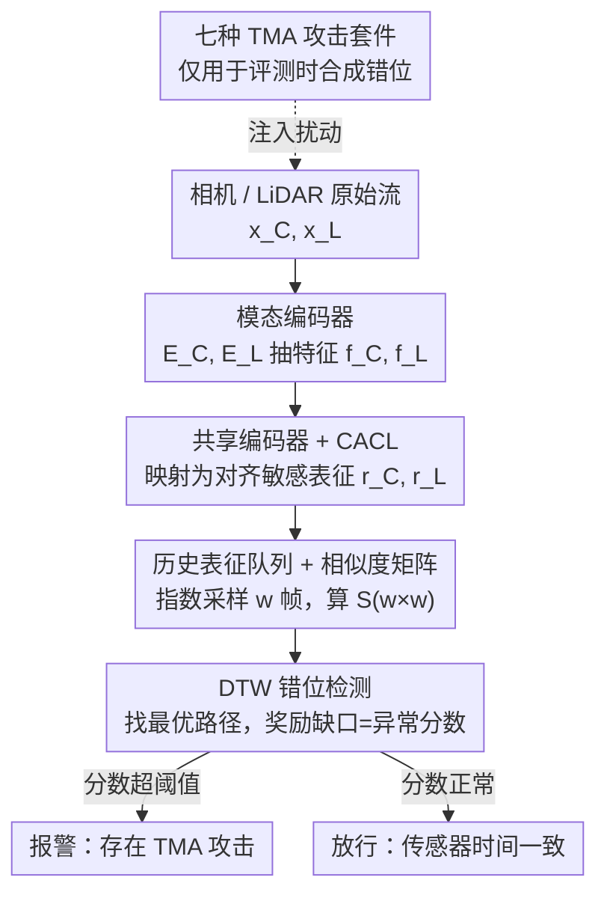

# Detecting Temporal Misalignment Attacks in Multimodal Fusion for Autonomous Driving

**会议**: ICLR2026  
**OpenReview**: [https://openreview.net/forum?id=SWlCJab9gZ](https://openreview.net/forum?id=SWlCJab9gZ)  
**代码**: https://github.com/shahriar0651/AION  
**领域**: 自动驾驶 / AI安全 / 多模态感知  
**关键词**: 时序错位攻击, 多模态融合, 动态时间规整, 对比学习, 自动驾驶安全

## 一句话总结
针对自动驾驶相机-LiDAR 融合依赖精确时间同步这一隐患，本文提出轻量级即插即用防御 AION：用"连续性感知对比学习"训练一个共享多模态编码器，再用动态时间规整（DTW）追踪两路传感器表征的对齐路径，把偏离对角线的程度转成异常分数，在 KITTI / nuScenes 上对七类时序错位攻击平均 AUROC 达 0.92~0.95，且推理只增加约 3.26 ms。

## 研究背景与动机

**领域现状**：自动驾驶感知普遍依赖多模态融合（Multimodal Fusion, MMF），把相机的语义纹理和 LiDAR 的几何深度拼起来做可靠的场景理解。融合的前提是两路传感器在时间上精确对齐——ROS 2 这类中间件通常用一个"近似时间同步器"（approximate-time synchronizer），只要两条消息的时间戳差落在容忍窗口 $\tau$ 内就把它们配成一对送进融合模块。

**现有痛点**：这个"看时间戳配对"的机制本身是个攻击面。攻击者不需要篡改任何传感器原始数据（图像、点云）或模型参数，只要给消息注入时间戳扰动 $\delta_t^{(i)}$，让系统收到 $\tilde t_S^{(i)} = t_S^{(i)} + \delta_S^{(i)}$，就能诱导同步器把真实时间差很大的相机帧和 LiDAR 帧配成一对。表面上报告的时间差 $|\tilde t_C - \tilde t_L|$ 仍在容忍窗口内，但真实时间差 $\Delta_{\text{true}}$ 可能很大，融合出来的特征语义错位，导致漏检、虚检——作者前序工作显示，仅仅让 LiDAR 延迟一帧，多个检测模型的平均精度就能下降 88% 以上。

**核心矛盾**：现有处理时序不一致的工作几乎全部假设"善意场景"。一类是标定/抖动补偿（滤波、离线时间戳对齐），只对时钟漂移、噪声有效，默认各方合作、时间戳可信；另一类对抗防御则盯着对抗样本、传感器欺骗、空间/语义一致性，唯独把"时间维度"的融合安全留了空白。换句话说，所有防御都默认时间戳是诚实的，恰恰对网络层的时延操纵束手无策。

**本文目标**：造一个能直接挂在现有感知模型之上、下游任务无关的检测器，专门盯住跨模态的时间一致性，满足三条：准确检出失同步、跨架构跨模态泛化、开销极小不拖垮实时管线。

**切入角度**：作者的关键观察是——在自动驾驶里，相邻帧时间上接近、语义上相似，所以**跨模态的语义连贯性可以替代不可信的网络时间戳**当作对齐的真值。但标准对比学习把样本对硬性二分为正/负，抓不到"差一帧"这种细微错位。

**核心 idea**：用"连续性感知对比学习"让编码器学会平滑的时间过渡（时间上越近的负对惩罚越轻），再用 DTW 在跨模态相似度矩阵上找最优对齐路径——良性时最优路径走对角线、奖励高；被攻击时路径偏离对角线、奖励下跌，跌幅就是异常分数。

## 方法详解

### 整体框架

AION 是一个独立的"检测补丁"，可以与任意 MMF 感知模型并行或串行运行，不碰下游任务。它的核心只有一个共享多模态表征编码器（Multimodal Representation Encoder, MRE）$E_{mm}$，把任意一路模态的特征映射到同一个潜空间，目标是让时间对齐的跨模态对在该空间里相似、错位的对不相似。整条流程分两个阶段：

- **开发阶段（development）**：用对比学习训练 MRE。给定相机/LiDAR 编码器抽出的特征 $f_C, f_L$，MRE 投影成共享表征 $r_C^{(i)} = E_{mm}(f_C^{(i)})$、$r_L^{(j)} = E_{mm}(f_L^{(j)})$，并在良性数据上跑一遍检测来标定阈值。
- **部署阶段（deployment）**：对每路模态维护一个最近 $w$ 帧的历史表征队列，实时算一个 $w\times w$ 的跨模态相似度矩阵 $S$，每来一条新消息就更新 $r_C, r_L, S$，然后跑 DTW 找最优对齐路径，把"理想对角线奖励 - 实际路径奖励"作为异常分数判定是否遭遇攻击。

整体数据流如下（节点名对应下面的关键设计）：

### 关键设计

**1. 连续性感知对比学习（CACL）+ 三类样本对：让编码器学会"差几帧"的细粒度差异**

标准对比学习把样本对一刀切成正/负，但自动驾驶里相邻帧语义高度重叠，"差一帧"的负对和"差十帧"的负对被同等推远，编码器就学不出对细微时序错位敏感的表征。作者据此把样本对按时间错位程度分三类：**正对** $T_p$（来自同一时刻 $i=j$）、**近负对** $T_{nn}$（$i\neq j$ 但 $i\approx j$，语义部分重叠）、**远负对** $T_{fn}$（$|i-j|\gg 0$，无语义重叠）。

训练时先对一个 batch 算跨模态余弦相似度矩阵 $S_{ij} = \frac{r_C^{(i)}\cdot r_L^{(j)}}{\lVert r_C^{(i)}\rVert\,\lVert r_L^{(j)}\rVert}$。正对损失把对角线拉向 1：$L_{pos} = \sum_i (S_{ii}-1)^2$；负对损失则按时间距离分级惩罚：

$$L_{neg} = \sum_{\substack{i,j\\ i\neq j}} \big(\max(0, S_{ij})\big)^2 \cdot \lambda_{ij}, \qquad \lambda_{ij} = \tanh\!\Big(\frac{|i-j|}{\tau}\Big)$$

这里的权重 $\lambda_{ij}$ 是 CACL 的精髓：它是时间距离的平滑可微函数，$|i-j|$ 越大惩罚越重、越小惩罚越轻，于是"差一帧"被温柔对待、"差很远"被狠推开，编码器因此学到连续的时间过渡而非硬边界。总损失 $L_{total} = L_{pos} + L_{neg}$。该写法基于 relaxed contrastive（ReCo）放宽对比硬度的思想，但把"放宽程度"显式绑定到时间距离上，这正是它能捕捉细粒度错位、而普通 InfoNCE 做不到的原因。

**2. 历史表征队列 + 指数采样相似度矩阵：在窗口内把"对齐"变成一张可分析的图**

部署时光有单帧表征不够，要看一段时间内的对齐演化。AION 为每路模态维护长度 $w$ 的历史表征队列，但不用均匀采样，而是**指数采样**：采样下标 $n_i = \psi^i$（$\psi$ 是采样基数），近处密、远处稀——这样既保住最近时刻的细粒度变化，又用少量样本覆盖较长历史以增强泛化。窗口内得到序列 $r_C = \{r_C^{(n_1)},\dots,r_C^{(n_w)}\}$ 和 $r_L$ 同理，据此构造 $w\times w$ 相似度矩阵 $S$（与训练同一个 $S_{ij}$ 公式）。

这张矩阵的对角线 $S_{ii}$ 表示时间对齐的配对，偏离对角线越远代表错位越大。良性时高相似度落在对角线上；被攻击时（如延迟相机流）高相似度会在攻击窗口内偏离对角线、攻击结束后再回到对角线。每来一条新消息就增量更新 $r_C, r_L, S$，把"是否同步"这个抽象问题转成"矩阵的高相似度有没有偏离对角线"这个可视、可算的几何问题。窗口很短（$w=3\sim5$）就够用，这也是后面 DTW 开销可控的前提。

**3. 基于 DTW 的错位检测与异常分数：用最优对齐路径的奖励缺口量化攻击**

有了相似度矩阵 $S$，怎么把"偏离对角线的程度"压成一个标量？作者用动态时间规整（DTW）。DTW 本是衡量两条可能不同相位、不同速度的时序序列相似度的经典方法，它不假设均匀时序、允许沿时间轴非线性弯折，恰好对延迟、漂移、抖动这些 TMA 攻击制造的畸变天然鲁棒。这里作者把它反过来用：在 $S$ 上找一条**最大化累积相似度（定义为奖励 $\phi$）**的最优弯折路径 $P$，而不是传统的最小化代价。

理想（完全对齐）时最优路径就是对角线 $P^* = \{(1,1),(2,2),\dots,(w,w)\}$，因为对角元 $S_{ii}$ 相似度最高，对应最优奖励 $\phi^* = \sum_i S_{ii} \approx w$。良性场景下实际奖励 $\phi_{ben} \approx \phi^*$、异常分数 $a_{ben}\approx 0$；一旦存在恶意错位，最优路径必然包含 $i\neq j$ 的项、其 $S_{ij}\ll 1$，于是 $\phi_{mal} < \sum_i S_{ii}$、异常分数 $a_{mal} = \phi^* - \phi_{mal} \gg 0$。错位越严重，奖励缺口越大、异常分数越高——这条单调关系就是检测的理论依据。DTW 跑在 CPU 上、复杂度 $O(w^2)$，因为窗口很小所以几乎零开销。

**4. 七种 TMA 攻击套件：把"网络时延威胁"系统化成可复现的评测基准**

防御要有说服力，得先有像样的攻击面。作者把现实中各种时延/失同步成因抽象成七种 TMA 攻击，每种对应一类工程故障：**Constant**（帧冻结/丢帧，$\delta_j=j$）、**Random**（随机替换/损坏帧，从 $[i-m,i]$ 随机取）、**Jitter**（概率抖动/网络抖动，$\delta_t=\mu+\varepsilon_t$）、**Reversal**（乱序/包乱序，$\delta_j=2j$）、**Burst**（间歇冻结/突发拥塞）、**Drift**（渐进失同步/时钟偏移，$\delta_j=\lfloor r\times j\rfloor$）、**Scheduler**（CPU 调度，轮询/优先级 $\delta_j=f(q,d_{max})$）。这套攻击既覆盖良性故障也覆盖对抗模式，并支持只攻相机、只攻 LiDAR、同时攻两路三种设置，是后续评测 AION 鲁棒性与泛化性的统一标尺。

### 损失函数 / 训练策略
训练目标即 CACL 的 $L_{total} = L_{pos} + L_{neg}$（正对拉向相似度 1，负对按 $\lambda_{ij}=\tanh(|i-j|/\tau)$ 分级推远）。KITTI 上 MRE 用双分支 CNN + 全局平均池化 + 共享投影头，输入端用现成的 ResNet-50（相机 $f_C\in\mathbb{R}^{2048\times12\times39}$）和 PointPillars（LiDAR $f_L\in\mathbb{R}^{384\times248\times216}$），输出 256 维表征；nuScenes 上 MRE 建在 BEVFusion 之上，先用共享 CNN 把 BEV 特征压成 $256\times23\times23$，再接一个带位置编码、全局自注意力的轻量 Transformer，均值池化得到 256 维表征。部署超参：窗口 $w=3$、采样基 $\psi=2$，窗口内过半配对含错位样本即判该窗口为恶意。

## 实验关键数据

### 主实验
评测在 KITTI 与 nuScenes 两套数据集、相机/LiDAR/双模态三种攻击设置下进行，以 AUROC 为主指标（论文摘要汇总：相机攻击均值 0.9493、LiDAR 攻击均值 0.9495、多数双模态攻击 0.9195）。

| 设置（nuScenes） | Constant | Random | Drift | Jitter | Reversal | Burst | Scheduler |
|--------|--------|--------|--------|--------|--------|--------|--------|
| 攻相机 | 0.9791 | 0.9572 | 0.9463 | 0.9283 | 0.9554 | 0.9541 | 0.9494 |
| 攻 LiDAR | 0.9781 | 0.9577 | 0.9497 | 0.9280 | 0.9552 | 0.9505 | 0.9518 |
| 攻双模态 | **0.0983** | 0.9394 | 0.9433 | 0.9060 | **0.5095** | 0.9365 | 0.9369 |

KITTI 上趋势一致（单模态 AUROC 普遍 0.92~0.97），两套数据集结果高度接近，说明 AION 不依赖特定数据集的运动统计或传感器特性，泛化性好。

### 消融 / 开销分析

| 组件 | 延迟 | 吞吐 | GPU 显存 |
|------|------|------|---------|
| MRE 推理 | 1.74 ms | 574 inf/s | 42.5 MB |
| DTW 检测 | 1.52 ms | 659 inf/s | —（跑在 CPU） |
| **合计** | **3.26 ms** | 307 inf/s | 42.5 MB |

AION 仅约 197 万参数（FP32 约 7.9 MB），相比 BEVFusion 这类超 3000 万参数（约 127 MB）的感知主干极其轻量；典型 MMF 管线在 10–20 Hz（每帧 50–100 ms），3.26 ms 只占帧预算的 3.3%~6.5%，且能与下游任务并行。

### 关键发现
- **DTW 对 Drift 攻击尤其敏感**：缓慢演化、低方差的扰动（时钟偏移）反而 AUROC 很高，体现 DTW 累积奖励对渐变错位的捕捉力。
- **致命盲区——双模态完美同步攻击**：当 Constant / Reversal 同时同等地施加到相机和 LiDAR 时，AUROC 暴跌到 0.098 / 0.51。原因是这类攻击让两路被同样平移，跨模态相似度仍沿对角线最高，AION 赖以检测的时间差被"抹平"了——这恰恰是只靠多模态数据本身无法绕过的根本局限。
- **窗口宜短不宜长**：$w=3\sim5$ 足够检出错位且开销可忽略；窗口过大不仅增加 $O(w^2)$ 成本，还会稀释时间粒度反而掉性能。

## 亮点与洞察
- **把不可信的时间戳替换成可信的语义连贯性**：核心洞察是"相邻帧语义相似"这一物理先验比网络时间戳更可靠，于是用跨模态语义对齐当真值来反查时间错位——这是绕开"时间戳本身被篡改"困境的巧招。
- **DTW 反向用作异常检测器**：传统 DTW 求最小代价对齐，这里改成在相似度矩阵上求最大奖励路径，并把"理想对角奖励 - 实际奖励"当异常分数，给了一个有单调性保证、零训练、可解释的检测信号，思路可迁移到任何"应当严格对齐却可能被错位攻击"的多流场景（如音视频同步、多传感器时序校验）。
- **CACL 的分级负对惩罚很通用**：$\lambda_{ij}=\tanh(|i-j|/\tau)$ 把对比学习的"硬负"软化成"按距离分级"，凡是相邻样本天然有序、需要细粒度区分的任务都能借用。
- **即插即用、下游无关**：作为独立补丁挂在 ResNet+PointPillars 或 BEVFusion 之上都能用，且只增 3 ms，工程落地友好。

## 局限与展望
- **作者承认的核心局限**：对"双模态完全同步的 Constant / Reversal 攻击"几乎失效（AUROC ≈ 0.1/0.5），因为这类攻击保持了对角线最高相似度。作者提出引入 IMU、CAN 等额外参考源做交叉验证作为未来工作。
- **攻击为合成注入**：七种 TMA 攻击都是在测试序列上按固定周期合成的，尚未在真实被攻陷的 ROS 2 / ECU 部署中端到端验证，真实网络环境的复杂时延分布可能与合成模式有差异。
- **威胁模型偏强假设**：假定攻击者已拿到融合节点上游的 ECU/中间件读写权限；现实中获得该权限本身是一道门槛，防御的"前提条件"边界值得进一步讨论。
- **只用了相机-LiDAR 两模态**：方法依赖跨模态语义冗余，模态进一步增多或某些模态语义弱时，相似度矩阵的判别力如何变化未充分探究。

## 相关工作与启发
- **vs 标定 / 抖动补偿（Taylor & Nieto 2016; Zhao 2021）**：它们做时钟漂移、噪声的离线时间戳对齐，假设各方合作、时间戳可信；本文针对的是"故意伪造时间戳"的对抗失同步，是合作假设之外的盲区。
- **vs 时空一致性检测（Man 2023; Li 2020; Xu 2024）**：Man 强制 track-label 一致但忽略时间戳有效性；Li 检测上下文违例却对时移数据失效；Xu 抓得住粗暴欺骗但漏掉容忍窗口内的细微失同步。AION 专攻"容忍窗口内、内容未改、仅时间戳被动手脚"这一最隐蔽的时间维度。
- **vs ReCo（Lin 2023）**：本文 CACL 借鉴 ReCo 放宽对比硬度的思想，但把放宽程度显式绑定到时间距离 $|i-j|$，从"软化对比"升级为"按时序连续性分级"，专门服务于细粒度时序错位检测。
- **vs 前序 TMA 攻击工作（Shahriar 2026; Kuhse 2024; Finkenzeller 2025）**：那些工作论证了时序失同步是真实攻击向量（单帧延迟即可掉 88% AP），本文是配套的"防御侧"答卷，把检测做成轻量补丁。

## 评分
- 新颖性: ⭐⭐⭐⭐ 首次系统针对融合"时间维度"的对抗失同步做防御，DTW 反向当异常检测器 + CACL 分级负对的组合很巧。
- 实验充分度: ⭐⭐⭐⭐ 两数据集、两主干、七攻击、三模态设置覆盖全面，并诚实暴露双模态同步攻击的失效；但攻击为合成注入、缺真实部署验证。
- 写作质量: ⭐⭐⭐⭐ 威胁模型、公式推导（异常分数单调性）、开销分析清晰自洽。
- 价值: ⭐⭐⭐⭐ 即插即用、3 ms 开销、下游无关，对安全攸关的自动驾驶感知有直接落地意义。

<!-- RELATED:START -->

## 相关论文

- [\[ICLR 2026\] UniSplat: Unified Spatio-Temporal Fusion via 3D Latent Scaffolds for Dynamic Driving Scene Reconstruction](unisplat_unified_spatio-temporal_fusion_via_3d_latent_scaffolds_for_dynamic_driv.md)
- [\[ICLR 2026\] ResWorld: Temporal Residual World Model for End-to-End Autonomous Driving](resworld_temporal_residual_world_model_for_end-to-end_autonomous_driving.md)
- [\[AAAI 2026\] CaTFormer: Causal Temporal Transformer with Dynamic Contextual Fusion for Driving Intention Prediction](../../AAAI2026/autonomous_driving/catformer_causal_temporal_transformer_with_dynamic_contextual_fusion_for_driving.md)
- [\[CVPR 2026\] MindDriver: Introducing Progressive Multimodal Reasoning for Autonomous Driving](../../CVPR2026/autonomous_driving/minddriver_introducing_progressive_multimodal_reasoning_for_autonomous_driving.md)
- [\[ECCV 2024\] Detecting As Labeling: Rethinking LiDAR-camera Fusion in 3D Object Detection](../../ECCV2024/autonomous_driving/detecting_as_labeling_rethinking_lidar-camera_fusion_in_3d_object_detection.md)

<!-- RELATED:END -->
