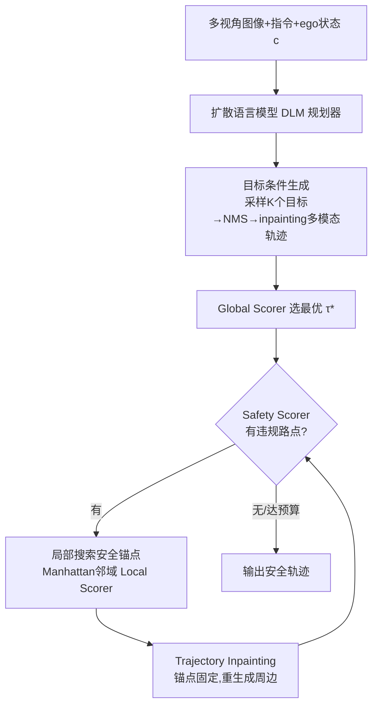

# Discrete Diffusion for Reflective Vision-Language-Action Models in Autonomous Driving

**会议**: ICLR 2026  
**OpenReview**: [https://openreview.net/forum?id=XJxXSMLDoZ](https://openreview.net/forum?id=XJxXSMLDoZ)  
**代码**: 待确认  
**领域**: 自动驾驶 / VLA / 离散扩散规划  
**关键词**: ReflectDrive, 离散扩散, 反思机制, 安全轨迹生成, NAVSIM, 轨迹 inpainting  

## 一句话总结
ReflectDrive 把二维驾驶空间离散化成动作码本，用预训练扩散语言模型做 VLA 轨迹规划，再叠加一个无需梯度的"反思机制"——通过对不安全 token 做局部搜索得到安全锚点、再用扩散 inpainting 重生成周边轨迹，在 NAVSIM 闭环上把 PDMS 推到 91.1（接近人类 94.8）。

## 研究背景与动机
- **领域现状**: 端到端（E2E）已成为自动驾驶主流，VLA 模型进一步引入 VLM 的预训练世界知识，能读懂视觉场景与人类指令直接输出规划轨迹，提升长尾场景泛化。
- **现有痛点**: 这些方法本质仍是模仿学习/行为克隆，**无法在训练中内禀地编码物理规则**（碰撞规避、可行驶区域约束）。一条轨迹在模型分布下概率很高，却可能违反关键安全约束。现有补救手段各有硬伤：① 依赖轨迹锚点/规则路径做大量后处理；② 用强化学习但多停留在仿真，实车需要不安全的在线 rollout 且大模型上训练不稳定；③ 用扩散 guidance 做推理期可控生成，但要算梯度、采样慢、对超参敏感、数值易不稳。
- **核心矛盾**: 想要"可验证、可控"的安全保证，又不想引入昂贵梯度计算或脱离真实数据的仿真训练——连续动作空间天然难以注入硬约束。
- **本文目标**: 在一个**离散动作空间**里完成规划，使安全约束能通过搜索、掩码、采样这些离散操作无缝注入，把黑盒规划变成可信、可解释的决策。
- **核心 idea**: **【离散化 + 反思】** 先把轨迹量化成码本 token，让预训练扩散语言模型（DLM）做规划；再设计一个**无梯度的反思机制**——评估→局部搜索安全锚点→inpainting 重生成，迭代自我纠错直到轨迹安全。

## 方法详解

### 整体框架
ReflectDrive 分三步：(a) **轨迹离散化 + DLM 规划器**——把 2D 路点量化成码本 token，用预训练扩散语言模型微调成 VLA planner；(b) **目标条件生成**——先采样多个空间多样的目标点，inpainting 出多模态候选轨迹并打分选优；(c) **安全引导重生成**——对选中轨迹反复做"安全评估→锚点搜索→inpainting 修复"，无梯度迭代到安全。

### 关键设计

**1. 轨迹离散化为动作码本：让规划能复用扩散语言模型**。把连续路点 $(x,y)$ 拆成 x、y 两个独立的一维码本，在空间范围 $[-M,M]$ 上以分辨率 $\Delta g$ 均匀量化，量化器 $Q$ 把实数值映射到最近 token，整条轨迹被展平成 token 序列 $y=Q(\tau)=(y_{1,x},y_{1,y},\dots,y_{N,x},y_{N,y})\in \mathcal{A}^{2N}$。论文取 $\Delta g=0.3$ 米、范围 $[-100,100]$，每维码本约 667 个 token。离散化看似牺牲精度，但分辨率可调；更关键的是它让轨迹变成"语言序列"，从而能直接拿预训练 DLM 微调，且**便于在 BEV 空间里对可行解做高效搜索**——这是后面整个反思机制能离散注入约束的前提。

**2. 离散扩散 VLA 规划器：双向 inpainting 是地基**。规划器基于离散扩散框架（前向按 cosine/线性噪声调度逐步把 token 掩成 `[MASK]`，反向学一个 $p_\theta$ 在掩码位置预测原 token），训练目标是掩码位置的负对数似然 $L(\theta)=\mathbb{E}\big[-\sum_{i:m_i^{(s)}=1}\log p_\theta(y_i\mid \tilde y^{(s)},c,s)\big]$，其中条件 $c$ 包含多视角图像、ego 状态、语言指令。planner 用预训练 DLM（LLaDA-V）初始化做监督微调。推理时从全掩码序列出发，并行解码：每步固定置信度最高的一批 token、其余重掩，迭代 $S$ 步补全。这种非自回归结构天然支持**双向 inpainting**——能在保持上下文一致的前提下重建任意被掩段，正是后面"围绕安全编辑修复轨迹"的能力来源。

**3. 目标条件生成：先建多模态意图再局部修**。反思阶段的局部搜索为了效率被刻意限制，无法处理"路口换个方向转弯"这种大尺度改动，所以必须先在生成阶段把全局意图铺开。先让模型输出终点 token 分布 $p_\theta(y_N\mid c,s)$，取 Top-$K'$ 后做 NMS 得到空间上多样的 $K$ 个候选目标 $G=\mathrm{NMS}(\mathrm{TopK}_{K'}(p_\theta(y_N\mid c,s)),d_{\text{NMS}},K)$；再对每个目标 $G_k$ 通过 inpainting 采样出完整轨迹 $\tau_k$，用 Global Scorer 评分并选出最优 $\tau^*=\arg\max_{\tau_k} S(\tau_k)$。这一步保证后续只需做安全微调，不必让局部搜索承担大范围探索。

**4. 安全引导重生成：无梯度的"模型↔安全 oracle 对话"闭环**。选中的 $\tau^*$ 虽连贯但仍可能违反物理约束，于是进入迭代修复循环，由三类打分函数驱动（Global / Safety / Local Scorer，按既有驾驶评测原则设计）。每轮：① **评估**——Safety Scorer 找出违规路点集合 $V=\{t\mid S_{\text{safe}}(\tau^*)_t<\tau_{\text{safe}}\}$，按局部时间窗内最严重违规给路点打安全分；② **锚点搜索**——对最早违规路点，在原 token 的小 Manhattan 邻域 $N_\delta$（$\delta\le 10$）内做高效局部搜索，解 $(y'_{t,x},y'_{t,y})=\arg\max_{(a_x,a_y)\in N_\delta}S_{\text{local}}(a_x,a_y)$，得到最大化局部安全分的修正 token 作为**安全锚点**；③ **inpainting 修复**——固定锚点，让扩散模型单次重生成周边轨迹段，自然恢复全局连贯。整个过程不算梯度、可并行，循环直到轨迹全安全或达预算（最多 10 次迭代，超限则回退到搜索中安全分最高的候选）。实测多数违规在 1–3 轮内解决，推理开销可控。

## 实验关键数据

### 主实验表格（NAVSIM 闭环，PDMS↑）

| 方法 | 范式 | 输入 | NC↑ | DAC↑ | TTC↑ | Comf.↑ | EP↑ | PDMS↑ |
|---|---|---|---|---|---|---|---|---|
| UniAD | E2E | Cam | 97.8 | 91.9 | 92.9 | 100.0 | 78.8 | 83.4 |
| Transfuser | E2E | C&L | 97.7 | 92.8 | 92.8 | 100.0 | 79.2 | 84.0 |
| Hydra-MDP | Augmented | C&L | 98.3 | 96.0 | 94.6 | 100.0 | 78.7 | 86.5 |
| DiffusionDrive | Diffusion | C&L | 98.2 | 96.2 | 94.7 | 100.0 | 82.2 | 88.1 |
| GoalFlow | Diffusion | C&L | 98.4 | 98.3 | 94.6 | 100.0 | 85.0 | 90.3 |
| AutoVLA (Post-RFT) | 自回归 | Cam | 98.4 | 95.6 | 98.0 | 99.9 | 81.9 | 89.1 |
| **ReflectDrive (w/o R.I.)** | 离散扩散 | Cam | 96.9 | 95.4 | 92.2 | 100.0 | 79.0 | 84.8 |
| **ReflectDrive (Ours)** | 离散扩散 | Cam | 97.7 | **99.3** | 93.5 | 100.0 | **86.9** | **91.1** |
| ReflectDrive† (GT oracle) | 离散扩散 | Cam | 99.7 | 99.5 | 99.1 | 99.9 | 88.9 | 94.7 |
| Human | – | – | 100.0 | 100.0 | 100.0 | 99.9 | 87.5 | 94.8 |

- **仅用相机**就把 PDMS 做到 91.1，超过用 Camera+LiDAR 的所有 augmented planner（GoalFlow 90.3）和最强 VLA AutoVLA（89.1）。
- 反思机制（R.I.）相对 base 版带来：DAC +3.9、TTC +1.3、NC +0.8、EP +7.9——安全与进度同时提升。
- 用 ground-truth agent 的上界版 ReflectDrive† 达 94.7，几乎追平人类 94.8（EP 88.9 甚至超过人类 87.5）。

### 消融实验表格

| 模块 | 消融维度 | 观察 |
|---|---|---|
| Base (w/o R.I.) | 生成步数 1→19 | PDMS 在 ~84.5 附近，步数过多收益饱和 |
| G.C.G. | 目标点数 / NMS 阈值 | 适当数量目标点 + 合理 NMS 距离把分数从 ~84 抬到 ~88 |
| S.G.R. | 探索步数 / 最大迭代数 | 增加探索步与迭代上限把 PDMS 从 89.5 推到 ~91 |

### 关键发现
- **离散表示是安全可注入的根本**：把规划放进离散 token 空间，才让搜索/掩码/inpainting 这些无梯度操作能直接施加硬约束。
- **多数违规 1–3 轮收敛**，反思开销可控，满足实时性。
- TTC/NC 略低于预期源于用**恒速假设的 agent**做安全估计；换成真值 agent（ReflectDrive†）后 TTC +5.6、NC +2.0，说明上限主要受感知/预测精度限制，而非规划框架本身。

## 亮点与洞察
- **把"安全"从训练目标变成推理期可搜索的离散问题**：不再指望模仿学习内化物理规则，而是在离散空间用 oracle 评估 + 局部搜索 + inpainting 显式修复，黑盒规划变成可解释闭环。
- **复用扩散语言模型做驾驶规划**：轨迹离散化让 DLM 的并行解码 + 双向 inpainting 能力直接迁移到 planning，省去专门设计扩散去噪器。
- **无梯度 guidance**：相比 Diffusion Planner 等需算梯度的 guidance，反思机制纯靠离散搜索，避免采样慢与数值不稳。
- 仅相机输入超越多模态 baseline，部署友好。

## 局限与展望
- **安全估计依赖 agent 运动假设**：恒速假设导致 TTC/NC 偏低，真实部署需接更准的检测/预测模块（论文以 ReflectDrive† 验证了上限）。
- **base 模型尚无显著优势**：作者归因于训练数据规模有限与基座 VLM 能力仍有提升空间。
- **局部搜索能力受限**：刻意约束的小邻域搜索无法处理大尺度改向，强依赖目标条件生成阶段把意图铺好；失败案例分析显示搜索算法仍有优化空间。
- **goal 与 planning 共用同一模型**为求简单，专用 goal 生成模型可能进一步提升。

## 相关工作与启发
- **超越模仿学习的三条路线**：轨迹锚点/规则路径（Hydra-MDP、DiffusionDrive）、强化学习（GIGAFLOW 自博弈但困于仿真与 sim-to-real）、扩散 guidance（Diffusion Planner 需梯度）。ReflectDrive 用离散扩散 + 搜索/掩码/inpainting 走出第四条无梯度路线。
- **离散扩散**（Austin et al. 2021 等）作为非自回归结构化序列生成范式，其 inpainting 能力被本文创造性用于"围绕安全锚点修复轨迹"。
- 对其他需要硬约束的生成式规划任务（机器人运动规划、约束序列生成）有启发：把动作离散化后，约束可作为离散搜索/掩码注入，避开连续空间的梯度 guidance。

## 评分
- **新颖性**: ⭐⭐⭐⭐ 首次把离散扩散用于 E2E 驾驶轨迹生成并集成进 VLA，反思机制（搜索+inpainting 的无梯度自纠错）设计巧妙。
- **实验充分度**: ⭐⭐⭐⭐ NAVSIM 闭环对比覆盖 E2E/augmented/VLA 三类范式，含 GT oracle 上界与三组消融；但仅单一基准、缺多数据集与真实路测。
- **写作质量**: ⭐⭐⭐⭐ 结构清晰、图示到位，方法动机层层递进；个别拼写小错。
- **价值**: ⭐⭐⭐⭐ 提供了一条"可验证、可控、无梯度"的安全规划范式，相机-only 即超多模态 baseline，部署潜力大。

<!-- RELATED:START -->

## 相关论文

- [\[CVPR 2026\] Counterfactual VLA: Self-Reflective Vision-Language-Action Model with Adaptive Reasoning](../../CVPR2026/autonomous_driving/counterfactual_vla_self-reflective_vision-language-action_model_with_adaptive_re.md)
- [\[CVPR 2026\] DriveMoE: Mixture-of-Experts for Vision-Language-Action Model in End-to-End Autonomous Driving](../../CVPR2026/autonomous_driving/drivemoe_mixture-of-experts_for_vision-language-action_model_in_end-to-end_auton.md)
- [\[ICLR 2026\] DriveVLA-W0: World Models Amplify Data Scaling Law in Autonomous Driving](drivevla-w0_world_models_amplify_data_scaling_law_in_autonomous_driving.md)
- [\[CVPR 2026\] HybridDriveVLA: Vision-Language-Action Model with Visual CoT reasoning and ToT Evaluation for Autonomous Driving](../../CVPR2026/autonomous_driving/hybriddrivevla_vision-language-action_model_with_visual_cot_reasoning.md)
- [\[CVPR 2026\] Unifying Language-Action Understanding and Generation for Autonomous Driving](../../CVPR2026/autonomous_driving/unifying_language-action_understanding_and_generation_for_autonomous_driving.md)

<!-- RELATED:END -->
