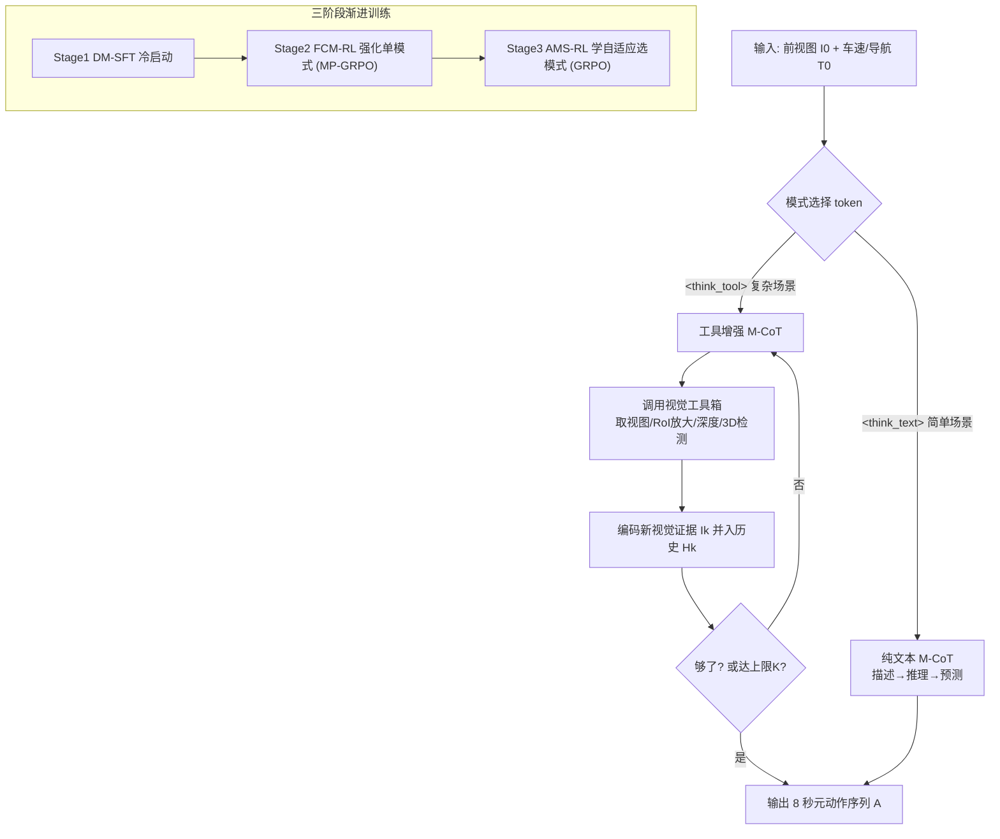

# DriveAgent-R1: Advancing VLM-based Autonomous Driving with Active Perception and Hybrid Thinking

**会议**: ICLR 2026  
**OpenReview**: [https://openreview.net/forum?id=r2g8TV4nJy](https://openreview.net/forum?id=r2g8TV4nJy)  
**项目主页**: [https://tsinghua-mars-lab.github.io/DriveAgent-R1/](https://tsinghua-mars-lab.github.io/DriveAgent-R1/)  
**代码**: 待确认  
**领域**: 自动驾驶 / VLM Agent / 主动感知  
**关键词**: 视觉语言模型, 自动驾驶, 主动感知, 工具调用, 混合思考, GRPO, 高层行为规划  

## 一句话总结
DriveAgent-R1 让一个 3B 的 VLM 在驾驶规划时学会"看不清就主动调工具看仔细"——通过视觉工具箱实现主动感知，并用混合思考框架在"纯文本快推理"和"调工具慢推理"之间按场景复杂度自适应切换，靠三阶段渐进训练（含级联 RL）做到与 GPT-5、人类司机相当的性能。

## 研究背景与动机
**领域现状**：VLM 把感知、推理、规划统一进一个框架，推动了端到端自动驾驶，尤其擅长高层行为决策（预测"减速直行/停车"这类语义意图，而非回归连续轨迹）。主流做法是基于多模态思维链（M-CoT）让模型"边想边规划"。

**现有痛点**：绝大多数工作停留在 **Text-based M-CoT** 的被动感知范式——只对默认视图（通常是前视相机）做文本推理。这带来一对相互矛盾的困境：(1) 当默认视图信息不足时，模型无法主动获取额外视觉证据来消解歧义；(2) 若一股脑塞进全部多视角数据，又会让模型处理大量冗余输入、增加算力开销并被无关线索干扰。

**核心矛盾**：人类司机开车本质是**主动消解不确定性**的过程——会回头看盲区、再确认一次模糊的信号灯；而且这种主动探索是**有选择**的，简单路况靠直觉，复杂路况才会刻意细看。现有 VLM 既不会主动求证，也不会按场景自适应地决定"要不要费劲去看"。

**本文目标**：把基于工具的主动感知引入高层行为规划这一核心任务（此前未被探索），并赋予 agent 按场景复杂度自适应切换思考模式的能力。

**核心 idea**：
- **【主动感知】** 给 agent 配一套视觉工具箱，让它在推理中途按需调用工具去"放大看 / 换视角看 / 看深度 / 做 3D 检测"，把决策牢牢锚定在可验证的视觉证据上。
- **【混合思考】** 用一个 mode token 让 agent 自己决定走"纯文本 M-CoT"（高效）还是"工具增强 M-CoT"（稳健），并通过三阶段渐进训练把这种自适应选择能力练出来。

## 方法详解

### 整体框架
DriveAgent-R1 以 Qwen2.5-VL-3B 为底座，先做驾驶域对齐得到 DriveAlign-3B，再经历"打基础 → 强化单模式 → 学会选模式"的三阶段渐进训练。推理时，给定初始前视图像 $I_0$ 和文本上下文 $T_0$（车速 + 导航指令），agent 输出未来 8 秒、每 2 秒一步的元动作序列 $A=(a_1,a_2,a_3,a_4)$，每个元动作 $a_t=(s_t,j_t)$ 由速度 token（加速/保速/减速/停车）和轨迹 token（直行/右转/左转）组成。模型先生成一个模式 token（`<think_text>` 或 `<think_tool>`）来选择推理路径，两条路径都遵循"描述→推理→预测"统一 CoT 结构。

### 关键设计

**1. 视觉工具箱 + 多轮交互的主动感知：让决策落到证据上。** 工具增强模式下，agent 不再被动接受默认视图，而是在推理中途按需调工具获取新视觉信息。工具箱含四件套：**Retrieve View**（取任意相机的清晰图，含 5 秒记忆池里的历史帧）、**RoI Inspection**（在高分辨率图上裁剪并放大指定感兴趣区域，看清细节）、**Depth Estimation**（生成深度图提供 3D 空间感）、**3D Object Detection**（开放词表的 3D 目标定位）。交互过程把历史上下文迭代更新为 $H_k = H_{k-1} \oplus T_k \oplus I_k$，其中第 $k$ 步由解码器根据当前历史生成文本思考 $T_k$ 与可能的工具调用请求，执行工具拿到新图后经视觉编码器变成图像嵌入 $I_k$ 并入历史，直到生成最终动作序列或达到最大交互次数 $K$（实现里设为 3）。这套"think-while-seeing"让 agent 像人一样"看不清就再看一眼"，论文图 1 的例子里它正是通过 RoI 放大发现前方车辆轻微剐蹭，从而把初判修正为"减速后停车"。

**2. 混合思考框架：用一个 mode token 把快慢两种推理统一进来。** 对简单常见场景，agent 生成 `<think_text>`，完全靠内部知识和初始输入做纯文本推理，省算力省延迟；对复杂或不确定场景，生成 `<think_tool>` 进入主动感知。两种模式共享"描述（初步感知场景）→推理（逻辑分析）→预测（汇总成序列）"的统一结构，差别只在中途是否插入工具调用。这个自适应开关是论文相对此前"一刀切被动感知"方法的关键升级——既不像纯文本那样遇到歧义束手无策，也不像无脑塞多视角那样浪费算力。

**3. 驾驶域对齐 DriveAlign-3B：先治好"重文本轻视觉"的捷径病。** 作者指出通用 VLM 在驾驶规划里有"走捷径"倾向——依赖低维文本线索而忽视高维视觉输入。为此先在规划训练前做域对齐：用真实路况图像构建 530K 问答对的驾驶 VQA 数据集（涵盖场景描述、交通实体识别、关键目标定位、交通常识与规则四类），全参微调 Qwen2.5-VL-3B 得到对视觉证据高度敏感的 DriveAlign-3B，作为后续三阶段训练的统一初始化。消融显示对齐后去掉图像时性能跌得更狠（-15.8% vs. -11.0%），说明决策真的扎根在视觉证据上而非文本捷径。

**4. 三阶段渐进训练 + 级联 RL：从打基础到学会自适应选模式。** 遵循"foundation building → mode strengthening → intelligent selection"范式。**Stage 1 DM-SFT** 冷启动：用三阶段自动流水线把数据切成"无需工具"集 $D_{text}$（3B 模型不用工具就高准确率）和"需要工具"集 $D_{tool}$（72B 模型只有用工具才提升），由 Qwen2.5-VL-72B 生成模式专属 CoT 标注并经判别模型打分过滤，得到 4K 高质量样本（两集各 2K）。**Stage 2 FCM-RL（强制对比模式 RL）**：基于 GRPO，提出 **Mode-Partitioned GRPO（MP-GRPO）**防止 agent 偏向某一初始较弱的模式——对每个输入强制各生成 $G/2$ 条文本模式和 $G/2$ 条工具模式响应，组成统一组 $O(q)=\{o^{text}_i\}_{i=1}^{G/2}\cup\{o^{tool}_j\}_{j=1}^{G/2}$ 一起做奖励归一化与优势计算，从而同时获得模式内对比和模式间对比信号，奖励为 $R=R_{acc}+R_{fmt}$（准确率用对 ground-truth 序列的加权 Levenshtein 距离，格式奖励惩罚结构错误和错误模式使用）。**Stage 3 AMS-RL（自适应模式选择 RL）**：用原生 GRPO 让 agent 自己生成模式选择 token，奖励加入条件工具使用项 $R = R_{acc}+R_{fmt}+\mathbb{I}(\text{mode}=M_{tool})\cdot R_{tool}$，其中 $R_{tool}$ 是对比式的——只有工具轨迹准确率超过本组所有纯文本轨迹平均值 $\bar{Acc}_{text}$ 一个 margin 时才给奖励（$R_{tool}\propto Acc-\bar{Acc}_{text}-\text{margin}$），显式惩罚多余工具调用，逼 agent 只在工具确有增益时才主动感知。

## 实验关键数据

### 主实验表格
Drive-Internal 与 nuScenes 上的联合准确率（括号为用工具相对不用工具的绝对增益）：

| Model | Drive-Internal 首帧 w/o→w/ Tools | Drive-Internal 序列平均 | nuScenes 首帧 | nuScenes 序列平均 |
|---|---|---|---|---|
| Human | 49.59 | 49.29 | 50.48 | 48.24 |
| Qwen2.5-VL-3B | 24.06 → 23.64 (-0.42) | 24.98 → 22.63 (-2.35) | 30.18 → 28.17 | 23.48 → 21.58 |
| Qwen2.5-VL-72B | 32.76 → 32.97 (+0.21) | 38.80 → 39.61 | 43.26 → 43.87 | 39.13 → 40.47 |
| GPT-4.1 | 39.99 → 43.18 (+3.19) | 42.14 → 43.43 | 46.84 → 48.25 | 43.63 → 44.72 |
| GPT-5 | 56.30 → 56.48 (+0.18) | 47.19 → 47.97 | 48.75 → 49.11 | 44.85 → 45.14 |
| **DriveAgent-R1 (3B)** | **45.27 → 51.34 (+6.07)** | 43.29 → 45.42 (+2.13) | **52.58 → 52.96** | 44.43 → **47.10 (+2.67)** |

- 仅 3B 参数，工具增益最大（Drive-Internal 首帧 +6.07%），整体与 GPT-5 和人类司机相当；nuScenes 序列准确率（47.10%）甚至超过 GPT-5（45.14%）。
- **工具是把双刃剑**：GPT-4.1、Gemini 用工具能涨，但 Qwen2.5-VL-3B/7B 用工具反而掉点，说明会用工具是门需要专门训练的非平凡技能。

低层运动规划（nuScenes 开环，外接轻量 MLP 运动头回归轨迹）：ADE 平均 0.28m，优于 DriveVLM-Dual（0.31m）、UniAD（0.69m），碰撞率与强基线相当，证明高层推理能转化为有效的低层控制。

### 消融实验表格
渐进训练策略消融（Drive-Internal，序列平均联合准确率 / MSA 模式选择准确率）：

| Variant | 训练阶段 | $M_{adaptive}$ Acc | MSA (%) |
|---|---|---|---|
| Variant-1 (仅 SFT) | DM-SFT | 40.88 | 45.00 |
| Variant-2 (+FCM) | +FCM-RL ×1 | 44.64 | 56.64 |
| Variant-4 (+AMS) | +AMS-RL ×1 | 43.43 | 57.55 |
| Variant-5 (+AMS ×2) | +AMS-RL ×2 | 44.13 | 61.61 |
| **DriveAgent-R1 (FCM→AMS)** | 三阶段全开 | **45.42** | **68.52** |

- 完整三阶段（FCM→AMS）在准确率和 MSA 上都显著领先；即使把单个 RL 阶段训两个 epoch（匹配总 epoch 数）也比不过"先强化单模式再学选模式"的级联设计，MSA 从 61.61% 跃升到 68.52%。

域对齐消融：DriveAlign-3B 在驾驶 VQA 上 +11.7、通用 VLM benchmark 上 +2.0；下游规划 +1.86，且去图像后跌幅更大（-15.8%），证明视觉锚定有效。

### 关键发现
- 主动感知确实捕捉到被动范式遗漏的关键视觉细节：DriveBench 上 Perception 得分 34.07，是 DriveLM（16.85）的两倍；Behavior 得分 43.69 居首。
- 级联 RL 的"先分模式强化、再学自适应选"顺序是 MSA 大涨的关键，单纯堆 RL epoch 无法替代。

## 亮点与洞察
- **把"主动感知"从感知任务推进到高层行为规划**：以往工具调用多用于 VQA / 检测，本文首次系统地让规划 agent 在决策中途主动求证，且用对比式工具奖励抑制"为调而调"。
- **混合思考对齐人类认知效率**：用一个 mode token 统一快慢推理，简单场景省算力、复杂场景才慢下来细看，3B 模型由此兼顾性能与部署友好（推理延迟显著低于全程被动多视角）。
- **MP-GRPO 解决模式偏置**：强制各生成一半文本/工具响应放进同一组归一化，巧妙制造模式间对比信号，避免 RL 早期因某模式弱就把它学没了。
- **小模型打平闭源巨头**：3B 对标 GPT-5 / 人类，且消融严格证明增益来自视觉证据而非文本捷径，可信度高。

## 局限与展望
- **依赖内部数据集 Drive-Internal**（35K 长尾片段）和自建 530K VQA、4K CoT 数据，复现门槛高；元动作标签由规则 + GPT-4.1 自动生成，标注质量受流水线影响。
- **工具集与最大调用次数有限**（K=3，四类工具），更开放的工具空间和更长交互链下的稳定性未充分探索。
- **评测以高层元动作离散准确率为主**，低层运动规划只用轻量 MLP 外挂验证，闭环安全性、真实路测表现仍待检验。
- 工具对弱基础模型反而掉点，说明该范式对底座能力或专门训练有要求，迁移到更小/其他模型时需重新调教。

## 相关工作与启发
- **承接 Drive-R1 等域对齐思路**：先用驾驶 VQA 治"视觉忽视"再做规划，是本文 DriveAlign-3B 的直接来源。
- **延续 Tool-based M-CoT / "think-while-seeing"**：把多模态工具推理的范式落到自动驾驶规划，可启发其他需要主动求证的具身/机器人决策任务。
- **GRPO 系列 RL 的领域定制**：MP-GRPO 的"分模式强制采样 + 统一归一化"和对比式工具奖励，对任何需要训练 agent 在多种推理策略间自适应选择的场景都有借鉴意义。

## 评分
- **新颖性**: ⭐⭐⭐⭐ 首次把工具式主动感知引入高层行为规划，并配混合思考 + MP-GRPO 级联 RL，组合新颖、动机清晰。
- **实验充分度**: ⭐⭐⭐⭐ 主实验对标 GPT-5/人类、跨 Drive-Internal 与 nuScenes，DriveBench、开环运动规划、域对齐与训练策略消融齐全；扣分在于核心数据集为内部私有、闭环测试缺失。
- **写作质量**: ⭐⭐⭐⭐ 动机—方法—实验逻辑顺畅，图 1/2/3 把主动感知与三阶段训练讲得清楚。
- **价值**: ⭐⭐⭐⭐ 3B 部署友好且性能对标巨头，为可解释、可落地的 VLM 自动驾驶提供了一条务实路径。

<!-- RELATED:START -->

## 相关论文

- [\[ICLR 2026\] SMART-R1: Advancing Multi-agent Traffic Simulation via R1-Style Reinforcement Fine-Tuning](advancing_multi-agent_traffic_simulation_via_r1-style_reinforcement_fine-tuning.md)
- [\[ICLR 2026\] Plan-R1: Safe and Feasible Trajectory Planning as Language Modeling](plan-r1_safe_and_feasible_trajectory_planning_as_language_modeling.md)
- [\[CVPR 2026\] SpaceDrive: Infusing Spatial Awareness into VLM-based Autonomous Driving](../../CVPR2026/autonomous_driving/spacedrive_infusing_spatial_awareness_into_vlm-based_autonomous_driving.md)
- [\[CVPR 2026\] ActiveAD: Planning-Oriented Active Learning for End-to-End Autonomous Driving](../../CVPR2026/autonomous_driving/activead_planning-oriented_active_learning_for_end-to-end_autonomous_driving.md)
- [\[CVPR 2026\] LiDAS: Lighting-driven Dynamic Active Sensing for Nighttime Perception](../../CVPR2026/autonomous_driving/lidas_lighting-driven_dynamic_active_sensing_for_nighttime_perception.md)

<!-- RELATED:END -->
