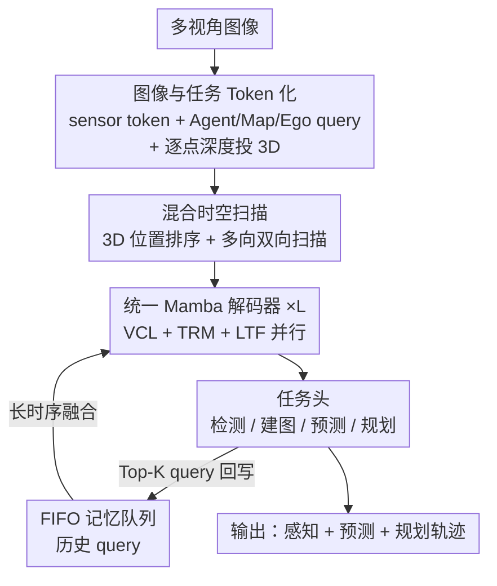

# DriveMamba: Task-Centric Scalable State Space Model for Efficient End-to-End Autonomous Driving

**会议**: ICLR2026  
**OpenReview**: [https://openreview.net/forum?id=MY0NHvqzi2](https://openreview.net/forum?id=MY0NHvqzi2)  
**代码**: 待确认  
**领域**: 自动驾驶 / 端到端规划  
**关键词**: 端到端自动驾驶, 状态空间模型, Mamba, 任务关系建模, 时空扫描  

## 一句话总结
DriveMamba 抛弃传统端到端驾驶里"感知→预测→规划"的串行 Transformer 范式与昂贵的稠密 BEV 特征，把图像特征和各任务 query 全部稀疏化成 token，按 3D 空间位置排序后送进一个统一的 Mamba 解码器，用线性复杂度同时完成视图对应、任务关系建模与长时序融合，最小的 Tiny 版在 nuScenes 上把平均 L2 误差降到 0.44m、碰撞率 0.15%，并跑到 17.9 FPS（比 UniAD 快约 10 倍）。

## 研究背景与动机
**领域现状**：端到端自动驾驶（E2E-AD）的主流是把检测、建图、预测、规划等模块塞进一个可微分框架联合优化。代表作 UniAD/VAD 走的是"感知-预测-规划"的串行 Transformer 路线，依赖稠密 BEV 特征来编码场景；后来 ParaDrive 改用并行 Transformer 解码器让模块更灵活。

**现有痛点**：串行设计有两个硬伤——一是模块按人为顺序串起来，信息在逐级传递中不断损失、误差累积；二是任务之间的关系被这条固定连接锁死，没法灵活地学到"哪些任务该互相帮忙"。而 ParaDrive 虽然并行了，却仍然不显式建模任务间的多样关系，且只做开环评测、无法反映真实闭环驾驶表现。

**核心矛盾**：除了串行/并行的结构问题，还有一对效率矛盾。BEV-Centric 方法要生成稠密 BEV 特征、靠堆历史 BEV 做时序融合，长距离感知和长时序建模都极其昂贵；Query-Centric 稀疏方法虽然轻一些，但注意力是二次复杂度，scale up 时算力和显存吃不消，而且缺乏面向自车规划的高效交互顺序。也就是说，**要同时拿到"灵活的任务关系 + 可扩展性 + 高效率 + 长时序记忆"这四样，现有范式总会丢掉至少一项**。

**本文目标**：设计一个不依赖稠密 BEV、不靠人为模块顺序、又能线性复杂度处理时空输入的统一框架，让感知/建图/预测/规划在同一个解码器里并行学习、动态建模彼此关系。

**切入角度**：作者注意到 Mamba（选择性状态空间模型 S6）在 NLP/视觉里已经验证了"线性复杂度处理长序列 + 动态选择性"的优势。如果把图像 token 和任务 query 统一序列化成一串时空 token，就能用 Mamba 一次性扫过去，把视图对应、任务关系、时序融合都做了，天然规避二次注意力的瓶颈。

**核心 idea**：用一个统一的双向 Mamba 解码器替代串行 Transformer——先把图像与任务都 token 化并按 3D 位置排序，再用线性复杂度算子并行建模任务间依赖；同时设计一套轨迹引导的"局部到全局"扫描，把自车视角的空间局部性保留下来，专门服务规划。

## 方法详解

### 整体框架
DriveMamba 的输入是多视角相机图像，输出是检测框、矢量地图、多模态运动轨迹和自车规划轨迹。整条流水线不再生成任何稠密 BEV 特征，而是分四步走：① **Token 化**——多视角图像被现成视觉编码器（ResNet/ViT/ViM）编成 sensor token，同时预定义 Agent / Map / Ego 三类任务 query；每个 token 都配上空间 PE、时间 PE、任务 PE，并用预测的逐点深度把图像 token 投到 3D 空间以便排序。② **混合时空扫描**——按 token 的 3D/时间位置把它们排成 1D 序列，用若干种双向扫描顺序（含轨迹引导的局部到全局）喂给 Mamba。③ **统一 Mamba 解码**——堆 L 层双向 Mamba，每层同时做视图对应学习（VCL）、任务关系建模（TRM）、长时序融合（LTF），并通过 FIFO 记忆队列拉历史 query 进来。④ **任务头输出**——增强后的 query 分别送进检测/建图/预测/规划头，逐块迭代优化。

整个范式的精髓是"任务中心"：所有任务平权、无先后依赖，统一在一个解码器里并行交互，因此可以单阶段端到端训练，并通过简单堆层来 scale up。

### 关键设计

**1. 图像与任务 Token 化：把整个驾驶场景压成可排序的稀疏 token**

这一步直接针对"稠密 BEV 太贵"的痛点。作者不再渲染 BEV，而是把感知端和任务端都拆成 token：多视角图像编码成 sensor token $T_{sensor}\in\mathbb{R}^{N_c\times H\times W\times C}$，序列长度 $G=N_c\times H\times W$；任务端预定义三类 query——Agent query 管动态物体（检测+运动预测）、Map query 管车道/路口等静态地图、Ego query 编码自车的行为意图与环境交互。每个 token 由语义 embedding + 位置 embedding 两部分构成，其中 Ego query 的语义部分由 canbus 信息经 MLP 编码而来。位置编码把三件事拼在一起：$PE_o=\mathrm{Cat}(SE(P_o), SE(T_o), TE_o)$，分别是 BEV 参考位置的正弦编码、时间戳编码、任务类型 embedding。关键的一笔是给每个 sensor token 加一个深度预测分支，用 $P_{sensor}(i,k)=R_kK_k^{-1}[u_id_{i,k}, v_id_{i,k}, d_{i,k}]^T$ 把像素投到 3D 真实位置——有了精确 3D 坐标，token 才能按空间位置排序，进而被 Mamba 这种"顺序敏感"的算子有意义地扫描（这点区别于 DriveTransformer 用均匀分布的 ray-level 位置、没法直接排序）。

**2. 混合时空扫描：用轨迹引导的局部到全局顺序，把自车视角的空间局部性喂给 Mamba**

Mamba 本是 1D 序列模型，扫描顺序直接决定它能保留多少空间局部性，所以"怎么排 token"是这篇的核心创新而非附属细节。作者把 2D 扫描扩展成多种 3D 双向扫描：水平/空间优先、垂直/时间优先、Ego-Centric 局部到全局（绕自车原点螺旋遍历），以及最关键的 **Trajectory-Centric 局部到全局**——它根据自车未来插值航点 $\psi'$ 与周围任务 query 3D 位置 $P_{task}$ 的相对距离，动态调整扫描顺序。某个 query $Q_i$ 的重要性定义为

$$w_i = 1 - \min(\{\|P_i-\psi'_j\|_2\}_{j=1}^{T'_e}) / \max(\{\min(\|P_i-\psi'\|_2)\}_{i=1}^{N_a+N_m})$$

含义是：离自车规划路径最近的"挡路" query 重要性最高，这恰好符合人类司机的注意力分布——先看会撞上的东西。实验（Tab. 7）进一步发现：相邻解码层交替用水平/垂直优先扫描，最利于任务 query 与 sensor token 的视图对应；轨迹引导扫描最利于任务关系建模与运动规划；而历史记忆 token 用最简单的空间优先扫描就够了。作者特别强调动机是"为不同任务保留合适的空间局部性"，而非为了复杂而复杂——Transformer 规划器恰恰忽略了这种自车视角的交互顺序。

**3. 统一 Mamba 解码器：一个解码器里并行做视图对应、任务关系、时序融合**

这是把"任务平权、无串行依赖"落地的核心模块，由三类双向 Mamba（B-Mamba）层组成、共享同一套机制。**视图对应学习（VCL）**让任务 query 直接从带 3D 位置编码的原始 sensor 特征里抽语义，$\hat Q_{task}=\mathrm{VCL}([Q_{task}\!+\!PE_{task}, T_{sensor}\!+\!PE_{sensor}])$，完全绕开稠密 BEV，避免信息损失。**任务关系建模（TRM）**靠并行 query 设计，用一层额外 B-Mamba 显式学任务间的动态关系 $\hat Q_{task}=\mathrm{TRM}(Q_{task}\!+\!PE_{task})$，既能学 Agent-Agent 这类同类交互、也能学 Ego-Agent/Ego-Map 这类跨类交互，且无需人为连线（这正是面向规划的感知）。**长时序融合（LTF）**维护一个 FIFO 记忆队列，存各任务的历史 query 而非历史 BEV：$\hat Q^{t_0}_{task}=\mathrm{LTF}(\{Q^t_{task}\!+\!PE^t_{task}\}_{t=t_0-T_{queue}}^{t_0})$，每层解码都能融合时序，上一帧 Top-K query 入队，历史 query 还会经 Motion-aware LayerNorm 做隐式运动补偿后转到当前自车坐标系。消融显示用单层 B-Mamba 联合建模（Joint Dec.）比分层划分建模（Divided Dec.）效果更好、且不增加参数。得益于线性复杂度，这个解码器可以靠简单堆层无痛 scale up。

**4. 迭代优化的任务头 + 单阶段端到端训练：让平权任务一次性联合优化**

由于各任务平权、无先后依赖，DriveMamba 用单阶段端到端训练。每类任务头一般是 2 层 FC：Agent token 先过检测头出 3D 框，再加 mode embedding 过运动头出多模态轨迹；Map token 回归出含 20 点的矢量地图实例；Ego 用一串 waypoint token 经规划头预测 $T_e=6$ 个连续航点。解码器每个 block 的输出都被对应 loss 显式监督，且每块预测相对偏移、更新参考点和位置编码供下一块用（迭代优化 IO）；输出前还把任务位置编码做残差相加（残差学习 RL），让任务头更准地预测位置偏移。总损失把各 block 各任务的 loss 加起来：$L=\sum_{i=1}^{L}(L_{det}^i+L_{map}^i+L_{depth}^i+L_{motion}^i+L_{plan}^i)$，其中规划 loss 还纳入碰撞、越界、方向等矢量化约束做正则，各任务权重经验性调到同一量级。消融里去掉 IO 会让碰撞率从 0.15% 飙到 0.38%，说明迭代监督对安全规划至关重要。

### 损失函数 / 训练策略
单阶段端到端，总损失为各解码 block、各任务损失之和（见上式）；规划损失内含碰撞/越界/方向等矢量化约束做正则，各任务权重经验调至同量级，无需多阶段预训练。

## 实验关键数据

### 主实验
nuScenes 开环规划（ST-P3 metric，不含 ego-status）：

| 方法 | L2 Avg.(m)↓ | Collision Avg.(%)↓ | FPS↑ |
|------|-------------|--------------------|------|
| UniAD | 0.76 | 0.17 | 1.8 |
| VAD-Base | 0.72 | 0.22 | 4.5 |
| DriveMamba-Tiny | 0.44 | 0.15 | 17.9 |
| DriveMamba-Small | 0.42 | 0.12 | 11.1 |
| DriveMamba-Large | 0.40 | 0.09 | 1.7 |

Tiny 版相比 UniAD/VAD 把平均 L2 降低 42.1% / 38.9%、平均碰撞率降低 11.8% / 31.8%，推理仅 55.8ms（约 10× / 4× 加速）。

Bench2Drive 闭环规划：

| 方法 | Driving Score↑ | Success Rate(%)↑ | Latency(ms) |
|------|----------------|------------------|-------------|
| UniAD-Base | 45.81 | 16.36 | 663.4 |
| DriveTransformer-Large | 63.46 | 35.01 | 211.7 |
| DriveMamba-Tiny | 53.54 | 27.27 | 55.8 |
| DriveMamba-Base | 65.50 | 36.82 | 164.3 |
| DriveMamba-Large | 66.82 | 37.73 | 599.1 |

DriveMamba-Base 用更少参数、更高效率就超过了 DriveTransformer-Large，体现强 scaling 能力。

### 消融实验
统一 Mamba 解码器各模块（nuScenes 开环）：

| 配置 | L2 Avg.(m)↓ | Coll. Avg.(%)↓ | 说明 |
|------|-------------|----------------|------|
| Joint Dec.（完整） | 0.44 | 0.15 | 联合建模最优 |
| Divided Dec. | 0.46 | 0.16 | 分层建模略差，参数还更多 |
| w/o VCL | 0.61 | 0.39 | 去掉视图对应，掉点最狠 |
| w/o LTF | 0.45 | 0.18 | 去时序融合 |
| w/o TRM | 0.44 | 0.20 | 碰撞率明显升高 |
| w/o IO | 0.47 | 0.38 | 去迭代优化，碰撞率飙升 |

扫描方式（Tab. 7，Hybrid 空间优先最佳）：Hybrid+Spatial-First 取得 L2 0.44 / Coll. 0.15，优于单一水平/垂直/EC/TC 扫描，且优于 Temporal-First 排列。

### 关键发现
- **VCL 是最关键的模块**：去掉后 L2 从 0.44 涨到 0.61、碰撞率从 0.15% 涨到 0.39%——随机初始化的 query 没有 VCL 就无法从 sensor token 抽到足够上下文。
- **迭代优化（IO）对安全至关重要**：去掉后碰撞率从 0.15% 暴涨到 0.38%，说明逐块显式监督是稳住规划安全的关键。
- **编码器与解码器分工不同**：scale up 视觉骨干主要提升开环感知（mAP/NDS 大涨），而堆解码器层主要提升闭环规划（Driving Score 从 51 提到 66.5），感知反而略降——印证"任务中心"范式下规划吃解码器深度。
- **效率优势来自线性复杂度**：直接放大输入分辨率时，相比 Transformer 方法处理速度快 3.2×、GPU 显存少 68.8%。

## 亮点与洞察
- **"任务中心"取代"模块串行"**：把感知/预测/规划全部平权、丢进一个 Mamba 解码器并行交互，从根上消除串行范式的信息损失与误差累积——这是范式级而非模块级的改动，很可能被后续 E2E-AD 工作借鉴。
- **扫描顺序即归纳偏置**：作者把 Mamba 的"1D 序列顺序"这一看似缺点变成可设计的优点——轨迹引导的局部到全局扫描让模型天然关注"挡路"目标，把人类驾驶注意力先验编码进了序列顺序里，这个思路可迁移到任何需要空间局部性的序列建模任务。
- **抛弃稠密 BEV 的彻底性**：连时序融合都改成存历史 query（FIFO 队列）而非历史 BEV 特征，长时序建模的存储与算力代价大幅下降，是把"稀疏化"做到底的范例。
- **scale up 路径清晰**：线性复杂度让"堆解码器层"成为可行的扩展方向，论文给出 Tiny→Large 四档，且明确了"加骨干提感知、加解码器提规划"的经验规律，对工程落地很友好。

## 局限与展望
- **闭环极致精度仍有差距**：DriveMamba-Tiny 闭环 Driving Score（53.54）低于 DriveTransformer-Large（63.46），需要 Base/Large 档才反超，最轻量档在闭环交互场景下并非绝对最强。
- **Comfortness/Efficiency 指标偏弱**：Bench2Drive 上 DriveMamba 的 Comfortness（~20）明显低于 UniAD（43.58）、VAD（46.01），说明轨迹平顺性可能因强调局部交互而有所牺牲，作者未深入讨论。
- **深度预测分支是隐含依赖**：token 排序强依赖逐点深度预测的准确性，深度估计在远距离/恶劣天气下的退化会如何影响排序与最终规划，论文未给鲁棒性分析。
- **scan 方式靠实验搜索**：哪种扫描配哪个任务、相邻层怎么交替，目前是经验试出来的（Tab. 7），缺乏理论指导，换数据集/传感器配置时可能需要重新调。

## 相关工作与启发
- **vs UniAD / VAD（BEV-Centric 串行）**：它们靠稠密 BEV + "感知-预测-规划"人为顺序串行解码，信息逐级损失且任务关系被锁死；DriveMamba 不建 BEV、任务平权并行，L2 与 FPS 全面碾压（0.44m/17.9FPS vs 0.76m/1.8FPS）。
- **vs ParaDrive（BEV-Centric 并行）**：ParaDrive 用并行 Transformer 解码器提升灵活性，但不显式建模任务关系、只做开环；DriveMamba 用 TRM 层显式学任务间动态关系，并补齐闭环评测。
- **vs DriveTransformer（Query-Centric 稀疏）**：两者都走稀疏 query 路线，但 DriveTransformer 用二次复杂度注意力、且用均匀 ray-level 位置无法排序；DriveMamba 用线性 Mamba + 逐点深度可排序 token，效率（3.2× 速度、省 68.8% 显存）和可扩展性更优。
- **vs Vision Mamba / VMamba（视觉 SSM）**：它们为 2D 语义提取设计结构化扫描；DriveMamba 把双向 Mamba 扩展成统一任务解码器，并从自车视角设计交互顺序，把 SSM 从视觉感知迁移到端到端规划。

## 评分
- 新颖性: ⭐⭐⭐⭐⭐ 首个把 Mamba 做成端到端驾驶统一任务解码器、并用轨迹引导扫描编码驾驶注意力的工作，范式级创新。
- 实验充分度: ⭐⭐⭐⭐⭐ nuScenes 开环 + Bench2Drive 闭环双 benchmark，四档模型、模块/范式/可扩展性/扫描多维消融齐全。
- 写作质量: ⭐⭐⭐⭐ 动机与方法讲得清楚，图示丰富；个别指标（Comfortness 偏低）未充分讨论。
- 价值: ⭐⭐⭐⭐⭐ 效率与精度兼顾、scale up 路径清晰，对工业级端到端驾驶落地有直接参考价值。

<!-- RELATED:START -->

## 相关论文

- [\[ICLR 2026\] ResWorld: Temporal Residual World Model for End-to-End Autonomous Driving](resworld_temporal_residual_world_model_for_end-to-end_autonomous_driving.md)
- [\[CVPR 2026\] E3AD: An Emotion-Aware Vision-Language-Action Model for Human-Centric End-to-End Autonomous Driving](../../CVPR2026/autonomous_driving/e3ad_an_emotion-aware_vision-language-action_model_for_human-centric_end-to-end_.md)
- [\[CVPR 2026\] DriveMoE: Mixture-of-Experts for Vision-Language-Action Model in End-to-End Autonomous Driving](../../CVPR2026/autonomous_driving/drivemoe_mixture-of-experts_for_vision-language-action_model_in_end-to-end_auton.md)
- [\[CVPR 2025\] DiffusionDrive: Truncated Diffusion Model for End-to-End Autonomous Driving](../../CVPR2025/autonomous_driving/diffusiondrive_truncated_diffusion_model_for_end-to-end_autonomous_driving.md)
- [\[CVPR 2026\] Percept-WAM: Perception-Enhanced World-Awareness-Action Model for Robust End-to-End Autonomous Driving](../../CVPR2026/autonomous_driving/percept-wam_perception-enhanced_world-awareness-action_model_for_robust_end-to-e.md)

<!-- RELATED:END -->
