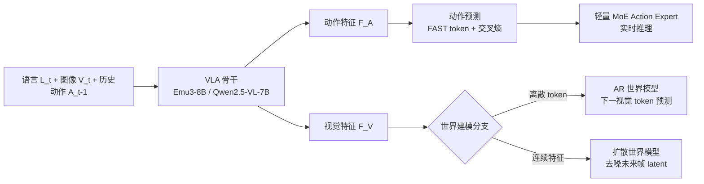

# DriveVLA-W0: World Models Amplify Data Scaling Law in Autonomous Driving

**会议**: ICLR 2026  
**代码**: [https://github.com/BraveGroup/DriveVLA-W0](https://github.com/BraveGroup/DriveVLA-W0)  
**领域**: 自动驾驶 / 端到端规划 / VLA  
**关键词**: Vision-Language-Action, 世界模型, 数据规模律, 自监督, 自动驾驶, NAVSIM  

## 一句话总结
DriveVLA-W0 给自动驾驶 VLA 加上"预测未来图像"的世界模型任务，用稠密的视觉自监督信号补上稀疏动作监督留下的"监督赤字"，从而在 70M 帧的海量数据上把数据规模律真正"放大"，让模型越喂越强而不是早早饱和。

## 研究背景与动机
- **领域现状**：自动驾驶端到端规划当前有两条主线。一条是围绕 BEV 表征、带几何先验的专用模型（UniAD、TransFuser），紧凑高效但架构小、难吃下海量数据、也难借力非驾驶数据集；另一条是基于互联网级预训练 VLM 的 VLA 模型（Orion、ReCogDrive、AutoVLA），模型容量大、天然有 scaling 潜力。
- **现有痛点**：VLA 的 scaling 潜力大多没兑现。标准范式只用专家动作（waypoint）做监督，让一个 8B 级大模型把高维感知输入压缩成几个低维控制信号，留下大量表征能力被浪费——作者称之为**"监督赤字"（supervision deficit）**。这种稀疏监督学不出丰富的世界表征，单纯堆动作数据也补不上；实测中大 VLA 甚至会输给更小的专用 BEV 模型。
- **核心矛盾**：模型容量巨大 ↔ 监督信号稀疏低维。数据再多，只要监督还是"几个 waypoint"，scaling 的红利就吃不到。
- **本文目标**：找到一种稠密、可随每帧产生的监督信号，让大 VLA 真正把大规模数据转化为性能，并能在跨域（不同动作分布）下泛化。
- **核心 idea**：**[世界建模即稠密自监督]** 让 VLA 在预测动作之外，再预测未来图像。未来帧预测每个时刻都提供稠密、自监督的信号，逼模型学环境的潜在动力学；并针对离散视觉 token 和连续视觉特征两类主流 VLA 分别给出 AR 世界模型与扩散世界模型两种实例化。

## 方法详解

### 整体框架
DriveVLA-W0 在一个标准 VLA 骨干（输入语言指令 $L_t$、前视图像 $V_t$、历史动作 $A_{t-1}$ 交错成序列 $S_t$）上叠加世界建模分支：骨干照常用交叉熵预测动作 token，同时被要求重建/生成视觉未来。针对两类 VLA 视觉表征分别实例化——离散 token 走 AR 世界模型（Emu3-8B 骨干），连续特征走扩散世界模型（Qwen2.5-VL-7B 骨干）。训练后世界建模分支在推理时被旁路以保证实时，最后用一个轻量 MoE Action Expert 把动作生成从大骨干解耦、压低延迟。

### 关键设计

**1. AR 世界模型：把未来帧当下一 token 序列预测。** 对于已经把图像量化成离散视觉词表的 VLA（VQ 范式），世界建模是最自然的延伸——直接让模型在动作预测之外，再自回归地生成当前/未来图像的视觉 token 序列 $V_t=(v_1,\dots,v_N)$。损失就是标准的下一 token 预测 $L_{\text{WM-AR}}=-\sum_{i=1}^{N}\log P(v_i\mid S_{<V_t}, v_{<i})$，与动作损失加权求和 $L_{\text{Total}}=L_{\text{Action}}+\alpha L_{\text{WM-AR}}$。推理时显式生成视觉 token 会拖慢速度，所以默认旁路，只在需要可视化时才采样 token 喂给 MoVQGAN 解码器渲染图像。这套即 DriveVLA-W0 (VQ)，因架构简洁被选为消融默认模型。

**2. 扩散世界模型：给连续特征 VLA 补一个像素级未来监督。** ViT 范式的 VLA 没有离散视觉词表，没法做 next-token 预测，于是引入潜空间扩散世界模型：以骨干当前输出的视觉特征 $F^V_t$ 和动作特征 $F^A_t$ 为条件，去噪生成**未来帧** $I_{t+1}$ 的 latent，目标为 MSE $L_{\text{WM-Diff}}=\mathbb{E}_{z_{t+1},\epsilon,k}\big[\lVert\epsilon-\hat\epsilon(z_{t+1,k},k,F^V_t,F^A_t)\rVert^2\big]$。这里"预测未来而非重建当前"是关键设计动机：由于条件里已经包含了当前全部特征，只有预测下一帧才能逼模型学到预测性动力学，否则退化成平凡重建。整体损失 $L_{\text{Total}}=L_{\text{Action}}+\beta L_{\text{WM-Diff}}$，推理同样旁路扩散过程。

**3. 视觉-动作交错序列：让世界模型学因果而非凭空想象。** 骨干输入并非只喂视觉，而是把语言、视觉、动作按历史 $H$ 步深度交错成 $S_t=[L_{t-H},V_{t-H},A_{t-H-1},\dots,L_t,V_t,A_{t-1}]$。这种"视觉+动作"条件（6VA 配置）逼模型预测的是"在某个具体动作下会看到什么样的未来"，而不是一个泛泛、含糊的未来——把视觉预测锚定在自车动作上，从而学到环境的因果动力学。消融显示 6VA 比纯视觉 6V 把 PDMS 从 84.1 抬到 85.6，序列越长（VA→2VA→6VA）效果越好。

**4. 轻量 MoE Action Expert：解耦动作生成、压低延迟，并当作 decoder 试验台。** 大骨干擅长表征但体量太大不适合实时控制，于是配一个 500M 的 Action Expert 与 8B VLA Expert 组成 MoE：两者结构相似但隐藏维度小很多，通过 Joint Attention 深度融合——各自算出 Q/K/V 后沿序列维拼接 $Q=[Q_{\text{VLA}};Q_{\text{AE}}],\,K=[K_{\text{VLA}};K_{\text{AE}}],\,V=[V_{\text{VLA}};V_{\text{AE}}]$，注意力输出再切回各自专家。它把推理延迟降到基线 VLA 的 63.1%（117.8ms→74.3ms）同时把 PDMS 从 85.6 提到 88.4。更妙的是它成了系统比较三类动作解码器（query-based / 自回归 / flow matching）的统一试验台，三者都预填上一步动作 $A_{t-1}$ 作时序先验。

## 实验关键数据

### 主实验表格（NAVSIM v1，PDMS）

| 方法 | 传感器 | NC↑ | DAC↑ | EP↑ | PDMS↑ |
|------|--------|-----|------|-----|-------|
| TransFuser | 3×Cam+L | 97.7 | 92.8 | 79.2 | 84.0 |
| WoTE | 3×Cam+L | 98.5 | 96.8 | 81.9 | 88.3 |
| AutoVLA | 3×Cam | 98.4 | 95.6 | 81.9 | 89.1 |
| ReCogDrive | 3×Cam | 98.2 | 97.8 | 83.5 | 89.6 |
| **DriveVLA-W0**† | **1×Cam** | 98.7 | 99.1 | 83.3 | **90.2** |
| AutoVLA† | 3×Cam | 99.1 | 97.1 | 87.6 | 92.1 |
| **DriveVLA-W0**‡ | **1×Cam** | 99.3 | 97.4 | 88.3 | **93.0** |

仅用单前视相机即超越依赖多视+LiDAR 的 SOTA；NAVSIM v2 上 EPDMS 达 86.1，同样领先 DiffusionDrive（84.5）。

### 消融实验表格（数据规模律，In-house 70k/700k/70M）

| 模型 | 70M ADE↓ | 70M Collision↓ |
|------|----------|----------------|
| VLA (VQ) 基线 | 1.4829 | 0.0488 |
| + World Model | **1.0563** (↑28.8%) | **0.0392** (↑19.7%) |
| VLA (ViT) 基线 | 1.1051 | 0.0359 |
| + World Model | 1.0640 (↑3.7%) | **0.0302** (↑15.9%) |

基线在大数据下早早饱和，加世界模型后持续改进，且数据越大增益越显著。

### 关键发现
- **世界建模放大数据规模律**：从 70k→70M，纯动作监督趋于平台，世界模型增益反而随数据量加速放大（VQ 模型 ADE 在 70M 上提升 28.8%）。
- **跨域泛化逆转**：NuPlan 预训练对纯动作基线（TransFuser-7B、VLA-VQ）是"负迁移"（过拟合动作分布），但对 VLA-W0 变成正迁移——因为它学的是可迁移的视觉表征。
- **动作解码器的规模律反转**：小数据（NAVSIM）上 query-based/flow-matching 占优；70M 海量数据上自回归解码器反超（Collision 比 query-based 再降 34.9%），因其建模容量强、teacher-forcing 样本高效。
- **效率**：MoE Action Expert 把延迟降到 63.1% 同时涨点。

## 亮点与洞察
- **问题命名精准**："监督赤字"一词把"大模型+稀疏动作监督"的结构性矛盾讲透，给出了一个比"数据不够"更本质的解释。
- **一招通吃两类 VLA**：AR 世界模型与扩散世界模型分别服务离散/连续视觉表征，证明范式的通用性而非单点 trick。
- **真·scaling 实验**：用 70M 帧（比学术基准大 680 倍）的自有数据集做规模律研究，结论可信度远高于只在小基准上跑。
- **反直觉发现有工程价值**：动作解码器随数据量发生优劣反转，提示"小数据选 flow matching、大数据选 AR"的实务取舍。

## 局限与展望
- **单前视相机**：虽用单相机超 SOTA 很亮眼，但缺多视/LiDAR 也意味着环视感知、远距遮挡场景仍可能受限。
- **HC/EC 偏低**：NAVSIM v2 上 History Comfort（93.2）尤其 Extended Comfort（58.9）明显偏低，舒适性/平滑性是短板。
- **未来帧预测开销**：世界建模仅在训练用、推理旁路，训练成本（64 GPU、50k+30k 步）较高，且未充分探讨多步未来或更长 horizon。
- **自有数据闭源**：70M 帧关键结论依赖未公开的 in-house 数据集，复现规模律结论门槛高。

## 相关工作与启发
- **VLA in driving**：从 DriveGPT4（仅解释）→ 模块化语言到动作 → 端到端 VLA（Orion、ReCogDrive、AutoVLA）；本文属端到端一支并补上稠密视觉监督。
- **世界模型两条路线**：作数据合成器（GAIA-1、DrivingGPT、Doe-1）vs 作表征学习的自监督目标（VaVAM、UniVLA、WorldVLA、LAW）；本文属后者，但与 LAW 的 latent 预测不同，直接监督预测未来**图像像素**，提供更直接稠密的信号。
- **启发**：当模型容量远超监督信号维度时，引入稠密自监督辅助任务（未来预测）可能是解锁 scaling 的通用钥匙，思路可迁移到机器人、具身等同样"动作稀疏"的领域。

## 评分
- **新颖性**: ⭐⭐⭐⭐ — "监督赤字"视角清晰，世界建模+VLA 在驾驶上虽非全新，但同时覆盖 AR/扩散两范式并系统验证 scaling 与解码器反转，组合有新意。
- **实验充分度**: ⭐⭐⭐⭐⭐ — NAVSIM v1/v2 + 70M 帧海量数据三尺度，主实验/规模律/跨域/解码器/延迟/序列长度消融齐备。
- **写作质量**: ⭐⭐⭐⭐ — 动机—方法—实验逻辑顺，图表清晰；个别符号密集，舒适性指标偏低未深究。
- **价值**: ⭐⭐⭐⭐⭐ — 给"大数据驱动驾驶智能"提供了可落地的稠密监督范式与若干反直觉的实务结论，对端到端 VLA 社区参考价值高。

<!-- RELATED:START -->

## 相关论文

- [\[CVPR 2026\] Scaling-Aware Data Selection for End-to-End Autonomous Driving Systems](../../CVPR2026/autonomous_driving/scaling-aware_data_selection_for_end-to-end_autonomous_driving_systems.md)
- [\[ICLR 2026\] Rethinking Driving World Model as Synthetic Data Generator for Perception Tasks](rethinking_driving_world_model_as_synthetic_data_generator_for_perception_tasks.md)
- [\[ICLR 2026\] ResWorld: Temporal Residual World Model for End-to-End Autonomous Driving](resworld_temporal_residual_world_model_for_end-to-end_autonomous_driving.md)
- [\[ICLR 2026\] Discrete Diffusion for Reflective Vision-Language-Action Models in Autonomous Driving](discrete_diffusion_for_reflective_vision-language-action_models_in_autonomous_dr.md)
- [\[ICML 2025\] DriveGPT: Scaling Autoregressive Behavior Models for Driving](../../ICML2025/autonomous_driving/drivegpt_scaling_autoregressive_behavior_models_for_driving.md)

<!-- RELATED:END -->
