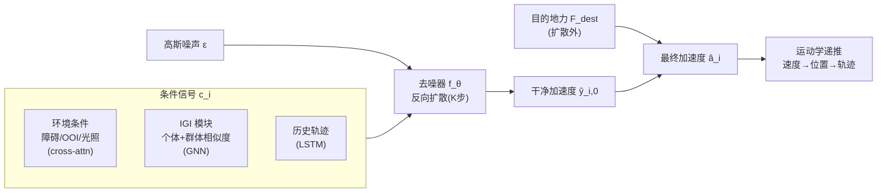

# EnvSocial-Diff: A Diffusion-Based Crowd Simulation Model with Environmental Conditioning and Individual-Group Interaction

**会议**: ICLR 2026  
**OpenReview**: [https://openreview.net/forum?id=2XBAm3Dbnt](https://openreview.net/forum?id=2XBAm3Dbnt)  
**代码**: 待确认  
**领域**: 行人轨迹预测 / 人群仿真  
**关键词**: 人群仿真, 扩散模型, 社会力模型, 环境条件, 行人轨迹预测, 图神经网络  

## 一句话总结
在 SPDiff 的"社会力 + 扩散"框架上，显式把环境拆成障碍物 / 兴趣物体(OOI) / 光照三类结构化条件，并用图网络补上"个体—群体"两级社交建模，让人群轨迹仿真在室外复杂场景上更真实。

## 研究背景与动机
- **领域现状**：人群仿真要同时考虑社交互动与环境约束。从规则法(Boids)、社会力模型(SFM)到数据驱动法(Social LSTM/GAN、STGCNN)，再到物理信息生成式方法。最新代表 SPDiff 把条件扩散过程塞进社会力模型，用扩散模块基于历史运动和个体级社交互动来精修预测加速度。
- **现有痛点**：(1) **社交建模只到个体级**——只算两两碰撞/对齐，忽略了强烈影响集体运动的"群体从众"；(2) **环境处理过度简化**——包括 SPDiff 在内的方法大多只用排斥力或二值可通行地图表示障碍，没有显式编码更丰富的上下文，比如作为"吸引子"引导路径选择的兴趣物体(商店、报刊亭)，以及心理学/城市设计证实会影响安全感和步行偏好的光照。
- **核心矛盾**：人群行为由"多种异质因素"共同塑造(避障、群体凝聚、路径选择、光照感知)，但现有框架要么把环境压成单一排斥力，要么把社交压成个体级，缺一个能把**结构化环境条件**和**多级社交建模**统一进生成式扩散过程的框架。
- **本文目标**：在长时程人群仿真中，既显式建模环境(障碍/OOI/光照)又建模个体+群体两级社交，且保持物理可解释。
- **核心 idea**：**[结构化环境条件 + 个体-群体交互]** 把环境分解成"障碍(排斥)、OOI(吸引)、光照(全局上下文)"三类条件信号，再叠加一个图结构的 IGI 模块捕获个体相似度与群体从众，与历史轨迹一起作为扩散去噪的条件，目的地驱动力则保留在扩散外、rollout 时注入以维持长期意图。

## 方法详解

### 整体框架
EnvSocial-Diff 沿用社会力模型(SFM)的"力的叠加"视角，把行人净力分解为四项：目的地驱动力 $\vec{F}^{dest}_i$、历史力 $\vec{F}^{hist}_i$、社交力 $\vec{F}^{social}_i$、环境力 $\vec{F}^{env}_i$。其中后三项拼成条件信号 $c^t_i=[\vec{F}^{env}_i\oplus\vec{F}^{social}_i\oplus\vec{F}^{hist}_i]$，在**加速度空间**上跑条件扩散：前向加噪、反向去噪由网络 $f_\theta$ 还原干净加速度 $\hat{y}^t_{i,0}$；目的地力 $\vec{F}^{dest}_i$ 单独放在扩散过程之外、rollout 时再加上，以保留长期意图。最终加速度经运动学公式递推出速度和位置。

### 关键设计

**1. 加速度空间的条件扩散：把社会力当作去噪目标** 由于加速度正比于净力($\vec{F}=m\vec{a}$)，本文预测的是未来加速度而非位置，从而获得物理上 grounded 的运动表示。前向过程对真值加速度 $y^t_{i,0}$ 逐步加噪 $q(y_{i,k}|y_{i,k-1})=\mathcal{N}(\sqrt{1-\beta_k}\,y_{i,k-1},\beta_k I)$，反向过程从高斯噪声出发、在条件 $c^t_i$ 下迭代去噪 $p_\theta(y_{i,k-1}|y_{i,k},c^t_i)$。关键在于把 SFM 里"难以学习的三项力"统一交给去噪器输出，而把唯一有明确解析式、负责长期意图的目的地力 $\vec{F}^{dest}_i=m_i\frac{v'_i n_i-v_i}{\mu}$ 留在扩散之外，避免扩散噪声污染长程目标，这是它相对纯端到端预测器在长时程上更稳的根因。

**2. 结构化环境条件：障碍排斥 / OOI 吸引 / 光照上下文三路异构编码** 这是本文相对 SPDiff 的核心增量。障碍和 OOI 先用 GPT 生成文字描述、ResNet-50 编码裁剪图块、BERT 编码文本，拼接投影成特征。**障碍**走两段 cross-attention：先用全局场景特征 $f^{sc}$ 增强每个障碍特征得 $\tilde{f}^{obs}_l$，再让行人状态去 attend 障碍并带上相对位置偏置 $f^{ped\text{-}obs}_i=\sum_{l\in O}\text{softmax}_l\big(\frac{Q_i^\top K^{obs}_l}{\sqrt{d_1}}+b(\vec{p}^{rel}_{i,l})\big)V^{obs}_l$，捕获细粒度避障。**OOI** 因为只提供全局语义吸引(引导路径选择)、不需要精细避让，所以只把位置编码和全局场景拼进特征再做 cross-attention。**光照**被当作全局上下文：把 BEV 图在 HSV 空间的 V 通道按网格池化成空间光照向量 $f^{raw}_{light}$，过轻量 MLP 得 $f^{enc}_{light}$。三路最后拼接过 MLP 融合成 $\vec{F}^{env}_i=\text{MLP}(f^{ped\text{-}obs}_i\oplus f^{ped\text{-}ooi}_i\oplus f^{enc}_{light})$。这种"按环境实体角色差异化建模"(排斥 vs 吸引 vs 全局)正是它比二值可通行地图更细的地方。

**3. 个体-群体交互(IGI)：两级相似度 + GNN 聚合出社交力** 针对"社交只到个体级"的痛点，IGI 在两个层级建模。**个体级**用两个相似度：接近趋势 $sim^1_{ij}=\frac{1}{2}\big(\frac{\Delta\vec{p}_{ij}}{\|\Delta\vec{p}_{ij}\|}\cdot\frac{\vec{v}_j}{\|\vec{v}_j\|}+1\big)$ 衡量邻居 $j$ 是否正朝 $i$ 靠近(碰撞风险)，运动对齐 $sim^2_{ij}$ 衡量两者速度方向一致性。**群体级**引入从众相似度 $sim^3_i=\frac{1}{2}\big(\frac{w_i}{\|w_i\|}\cdot\frac{g_i}{\|g_i\|}+1\big)$，其中 $w_i=\vec{v}_i\oplus\vec{a}_i$ 是 $i$ 的运动状态、$g_i$ 是邻居平均运动，反映 $i$ 对周围群体动态的顺从程度。这些连同相对运动描述子 $r_{ij}=\Delta\vec{p}_{ij}\oplus\Delta\vec{v}_{ij}$ 一起进多层 GNN：节点初始化 $h^0_i=\text{MLP}_{init}(S^t_i\oplus\epsilon^t_i\oplus g_i)$，边特征 $e_{ij}=r_{ij}\oplus sim^1_{ij}\oplus sim^2_{ij}\oplus sim^3_i$，节点更新时拼接自身、邻居均值消息和归一化群体特征，最终输出社交力 $\vec{F}^{social}_i$。注意 $sim^3_i$ 把"群体均值"显式注入节点初始化和更新，这是它能建模群体从众的关键。

## 实验关键数据

### 主实验表格
GC(室内)与 UCY(室外)两个真实数据集，指标含 MAE/OT/FDE/MMD/DTW/Col(碰撞数)，越低越好。

| 类别 | 方法 | GC MAE↓ | GC OT↓ | GC MMD↓ | UCY MAE↓ | UCY OT↓ | UCY MMD↓ |
|------|------|---------|--------|---------|----------|---------|----------|
| 物理 | SFM | 1.2590 | 2.1140 | 0.0150 | 2.5390 | 6.5710 | 0.1290 |
| 物理信息 | PCS | 1.0320 | 1.5963 | 0.0126 | 2.3134 | 6.2336 | 0.1070 |
| 物理信息 | NSP | 0.9884 | 1.4893 | 0.0106 | 2.4006 | 6.3795 | 0.1199 |
| 物理信息 | SPDiff | 0.9116 | 1.3925 | 0.0092 | 1.8760 | 4.0564 | 0.0671 |
| 本文 | **EnvSocial-Diff** | **0.8861** | **1.3339** | **0.0087** | **1.8182** | **3.7292** | **0.0598** |

### 消融实验表格
环境因子(Obs/OOI/Light)逐项叠加 + IGI 相似度项逐项叠加(UCY)：

| 消融 | 配置 | UCY MAE↓ | UCY OT↓ | UCY MMD↓ |
|------|------|----------|---------|----------|
| 环境 | Ours 无环境 | 1.8597 | 3.8945 | 0.0626 |
| 环境 | +Obs | 1.8337 | 3.8550 | 0.0604 |
| 环境 | +Obs+OOI | 1.8271 | 3.8541 | 0.0586 |
| 环境 | +Obs+OOI+Light(全) | **1.8182** | **3.7292** | 0.0598 |
| IGI | 仅 r_ij(≈SPDiff) | 1.9055 | 4.0101 | 0.0628 |
| IGI | +sim¹ | 1.8846 | 3.8502 | 0.0588 |
| IGI | +sim¹+sim²+sim³(全) | **1.8182** | **3.7292** | 0.0598 |

### 关键发现
- **室外增益更明显**：在更具挑战的 UCY 上，相对 SPDiff 在 MAE/OT/MMD/DTW 分别提升 3.1%/8.1%/10.9%/3.9%；而 GC 是室内裁剪子场景、环境变化小，已被 PCS/SPDiff 饱和拟合，提升有限——印证"显式环境建模在复杂室外更有价值"。
- **环境因子逐个有用**：障碍→OOI→光照逐项加都带来稳定提升；但 UCY 上加光照略增 MMD/DTW(室外光照与局部行人动态相关性弱),其余关键指标仍下降。
- **群体从众不可单独成立**：IGI 消融显示 $sim^3_i$ 单独能降 GC 的 MMD，但缺 $sim^1/sim^2$ 会削弱其他指标，三项互补才最优。
- **长时程优势**：误差曲线显示在更长预测时域上对 SPDiff 的优势更大。

## 亮点与洞察
- **环境的"角色解耦"很有洞见**：把环境实体按"障碍=排斥、OOI=吸引、光照=全局"差异化建模，而非一刀切地图，符合行人真实决策(避让 vs 被吸引 vs 感知)。
- **把光照引入轨迹预测**是少见而有据的尝试，引用了心理物理学证据(光照改善步行性、利于障碍检测)。
- **目的地力放扩散外**这一继承自 SPDiff 的设计很关键：让扩散只负责"短期可学习的力"，长期意图不被噪声干扰。
- **物理可解释**：所有条件都对应 SFM 中可命名的"力"，比黑箱端到端预测更易诊断。

## 局限与展望
- **数据集偏小**：只在 GC(5 分钟)和 UCY(216 秒 Students003)上评测，规模有限、泛化到大规模/多场景未验证。
- **依赖外部大模型标注**：OOI/障碍描述靠 GPT 生成 + ResNet/BERT 编码，pipeline 重且引入额外不确定性。
- **光照建模较粗**：仅用 HSV V 通道网格池化，室外场景中其增益不稳定(MMD/DTW 偶有上升)。
- **展望**：作者提出未来基于预测轨迹做视频级生成，服务真实人群仿真、安全规划与智能基础设施。

## 相关工作与启发
- **直接基线 SPDiff**：本文是其直系扩展，继承"社会力+加速度扩散+目的地力外置+多帧 rollout 训练"，主要补上结构化环境与群体级社交。
- **场景感知方法(NSP/UniTraj)**：用语义地图或全局嵌入引入场景，但 NSP 的环境只是二值可通行/不可通行排斥力，社交仍停在个体级；本文用 OOI/光照做了更结构化的替代。
- **启发**：把"领域先验(SFM 的力分解)"作为扩散条件的组织骨架，比让扩散自由生成更可控、可解释——这种"物理结构 × 生成模型"的范式可迁移到其他有强先验的预测任务。

## 评分
- **新颖性**: ⭐⭐⭐½ — 在 SPDiff 框架上做增量(结构化环境 + 群体从众),思路清晰但属"补全已有框架缺口",非全新范式。
- **实验充分度**: ⭐⭐⭐ — 两数据集、消融完整且逐项可解释,但数据集规模小、缺大规模/跨场景泛化与更多 SOTA 对比。
- **写作质量**: ⭐⭐⭐⭐ — 动机—方法—实验逻辑顺畅,公式与图示清晰,环境角色解耦讲得有说服力。
- **价值**: ⭐⭐⭐½ — 对人群仿真/行人轨迹预测社区有实用价值,尤其"环境角色解耦"和"引入光照"的视角值得借鉴,但提升幅度在室内场景有限。

<!-- RELATED:START -->

## 相关论文

- [\[ICCV 2025\] LangTraj: Diffusion Model and Dataset for Language-Conditioned Trajectory Simulation](../../ICCV2025/autonomous_driving/langtraj_diffusion_model_and_dataset_for_language-conditioned_trajectory_simulat.md)
- [\[ICCV 2025\] RESCUE: Crowd Evacuation Simulation via Controlling SDM-United Characters](../../ICCV2025/autonomous_driving/rescue_crowd_evacuation_simulation_via_controlling_sdm-united_characters.md)
- [\[AAAI 2026\] DiffRefiner: Coarse to Fine Trajectory Planning via Diffusion Refinement with Semantic Interaction for End to End Autonomous Driving](../../AAAI2026/autonomous_driving/diffrefiner_coarse_to_fine_trajectory_planning_via_diffusion_refinement_with_sem.md)
- [\[AAAI 2026\] Drive As You Like: Strategy-Level Motion Planning Based on A Multi-Head Diffusion Model](../../AAAI2026/autonomous_driving/drive_as_you_like_strategy-level_motion_planning_based_on_a_multi-head_diffusion.md)
- [\[CVPR 2025\] SceneDiffuser++: City-Scale Traffic Simulation via a Generative World Model](../../CVPR2025/autonomous_driving/scenediffuser_city-scale_traffic_simulation_via_a_generative_world_model.md)

<!-- RELATED:END -->
