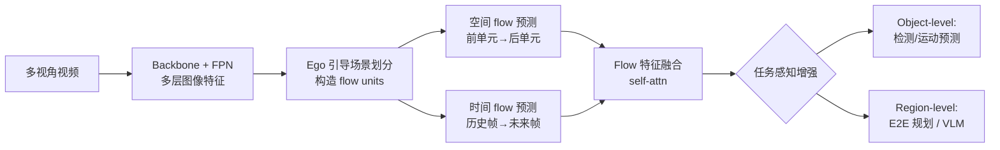

# FlowAD: Ego-Scene Interactive Modeling for Autonomous Driving

**会议**: ICLR 2026  
**OpenReview**: [https://openreview.net/forum?id=m4JpoJRgAr](https://openreview.net/forum?id=m4JpoJRgAr)  
**代码**: 待开源（论文承诺 Code/model/configs 将释出）  
**领域**: 自动驾驶 / 端到端规划 / 世界模型  
**关键词**: 自动驾驶, ego-scene 交互, scene flow, 世界模型, 端到端规划, 闭环评测  

## 一句话总结
FlowAD 把"自车运动对未来观测的反馈"建模成自车相对的 **scene flow**，用 ego 引导的场景划分 + 时空 flow 预测在隐空间学习这种交互动态，从而在感知、端到端规划和 VLM 分析上一致涨点，并提出 FCP 指标专门度量场景理解速度。

## 研究背景与动机
**领域现状**：自动驾驶正从模块化设计走向端到端（E2E）架构，UniAD、VAD、SparseDrive 等用 Transformer/稀疏 query 把感知-预测-规划串成一条以规划为中心的链路，最近又把 LVLM（DriveVLM、Senna）引入做高层推理。但无论哪种范式，规划模块始终是流水线的**最后一步**：每个时刻吃前序模块给的环境信息吐出一条 ego-plan，然后流水线复位进入下一帧。

**现有痛点**：这种结构几乎完全忽略了**自车自身已执行的运动对后续感知与决策的影响**。一个完整的驾驶过程应包含两部分——基于当前观测做规划，以及更关键的、执行控制后塑造未来的感官输入。缺失第二部分（ego motion 的反馈）正是开环/闭环环境割裂的根源：开环用固定预录数据训练，规划轨迹不会被真正执行，动作与后续观测之间的链路被切断。论文用一个反直觉实验佐证（Tab.1）：在 UniAD 上去掉时序融合，对规划几乎无影响（L2 仅退化 5%），却严重拖垮 tracking（AMOTA -16%）——说明现有时序建模根本没在为规划建立 ego 反馈闭环。

**核心矛盾**：闭环环境能真实交互但只用于评测、不便于大规模训练；开环数据规模大却没有 ego-motion 反馈。要在开环数据上学到闭环式的交互能力，必须找到一个不依赖仿真、能从 log-replay 数据里学出 ego 反馈的表征。

**本文目标**：提出一种 ego-scene 交互建模范式，把 ego 运动的反馈显式编码进隐空间特征学习里，让系统理解"自己怎么动会让环境怎么变"，进而增强规划。

**核心 idea**：**[相对运动 → scene flow]** 借鉴人类感知-运动机制——人移动时环境会朝相反方向"流动"，这种 optic flow 对预判和导航至关重要。论文把 ego-scene 交互建模成自车相对的可学习 **scene flow**，于是 ego-motion 反馈就能用现成的预录数据在 latent space 里学习，绕开了仿真生成多样观测的难题。

## 方法详解

### 整体框架
FlowAD 是一个通用的 flow-based 框架，分三段：**输入**（多视角视频经 backbone+FPN 提特征）→ **Ego-Scene 交互建模**（ego 引导场景划分构造 flow units，再做空间/时间 flow 预测得到时空 flow 特征）→ **任务感知增强**（用 flow 特征以 object-level / region-level 两种策略增强下游任务）。它不替换具体 baseline，而是作为插件接到 SparseBEV（感知）、SparseDrive/DiffusionDrive（规划）、Senna（VLM）上。

### 关键设计

**1. Ego 引导的场景划分：把"自车怎么动"写进划分几何**。整体 scene flow 难以直接量化，论文沿多视角图像的**宽度方向**把特征切成若干 flow units（相对运动主要体现在水平方向），再让 ego motion 通过两个旋钮塑造划分。一是**划分起点**：把 t 时刻自车放在坐标原点、六个相机平面排在感知范围边缘，用 t-1/t 两帧位置构造前向向量，向量与多视角平面的交点即划分起点，自然把场景分成 ego-左/右两侧。二是**动态调整划分尺寸**：转向时左右两侧的 flow 速度不同，等尺寸划分不符合运动学。论文假设转向轨迹是圆弧的一段，用 $\{(x_{t-2},y_{t-2}),(x_{t-1},y_{t-1}),(x_t,y_t)\}$ 三帧位置解出圆心与半径 $r$，再结合车宽 $w_{ego}$ 得到左右侧的划分尺寸 $P_{left}=P\times\frac{(r+w_{ego}/2)^2}{r^2}$、$P_{right}=P\times\frac{(r-w_{ego}/2)^2}{r^2}$。此外用多层特征 $\{F^l_{img}\}$ 配不同划分尺寸 $\{P^l\}$ 捕捉不同感受野，并做**局部聚合**——把每个 unit 与相邻两个拼成 $f^{k-1:k+1}_{unit}$ 在 $3P$ 维上做 self-attention 再降维 $\tilde f^k_{unit}=\mathrm{MLP}(\mathrm{SelfAttention}(f^{k-1:k+1}_{unit}))$，缓解物体被切碎、并增强跨视角关联。

**2. 空间 flow 预测：在单帧内"由前推后"学位移动态**。scene flow 的第一种形态是空间位移——场景从一个 flow unit 流到另一个。模块初始化可训练的空间 flow query $Q_{spat}$ 表示单元间的转移动态，按划分起点把单元和 query 拆成左右两侧。对第 $j$ 个 query，用前一个单元 $\tilde f^{j-1}_{unit}$ 经 GRU 自回归地更新缓存的运动信息 $\hat q^j_{spat}=\mathrm{GRU}(q^j_{spat},\tilde f^{j-1}_{unit})$，再用 cross-attention 预测后一个单元 $\hat f^j_{unit}=\mathrm{CrossAttention}(q=\tilde f^{j-1}_{unit},kv=\hat q^j_{spat})$。借鉴世界模型的做法，把预测/真值单元各映射成 latent state 的均值方差，最小化 KL 散度 $L_{spat}=\mathrm{KL}(\{\hat\mu^j_{spat},\hat\sigma^j_{spat}\}\,\|\,\{\mu^j_{spat},\sigma^j_{spat}\})$，让模型学会从已观测区域推断尚未流到的区域。

**3. 时间 flow 预测：跨帧"由历史推未来"学时序变化**。scene flow 的第二种形态是时间变化——同一个 flow unit 的内容随时间改变。与空间模块在单帧内做不同，时间模块吃一段多视角视频序列与可训练时序 query $Q^t_{tem}$，每次迭代用上一帧单元 $\tilde F^{t-1}_{unit}$ 经 GRU 更新 query $\hat Q^t_{tem}=\mathrm{GRU}(Q^t_{tem},\tilde F^{t-1}_{unit})$，再 cross-attention 预测下一帧单元 $\hat F^t_{unit}$，同样以 KL 散度 $L_{tem}$ 监督。最后一次迭代的输出携带时序动态，与空间 flow 特征按 unit 拼接后用 self-attention 融合成 $\hat F_{fuse}$。

**4. 任务感知增强：把 flow 动态按粒度注入下游**。下游任务分两类，增强策略也分两套。**Object-level**（检测、运动预测）：object query 回归出采样点投影到多视角平面，用覆盖这些采样点的 flow units 经 cross-attention 把时空动态注入 query embedding。**Region-level**（E2E 规划的 ego query、VLM 的场景描述）：直接把区域特征与对应 flow units 拼接，再用卷积降通道。这样无论 object 还是 region 任务都能拿到"自车运动如何改变环境"的先验，做出更敏捷稳健的决策。

此外论文提出 **FCP（Frames before Correct Planning）** 指标专门量化场景理解速度：给定指令后，统计规划器需要多少帧才发起符合指令的合理动作，$\mathrm{FCP}=\frac{1}{N_{cmd}}\sum_n\sum_f\prod_h \mathbb{1}\{|P^h_{3s}-G^h_{3s|}\ge 0.5m\}$，越小说明对驾驶过程的理解越快。

## 实验关键数据

### 主实验表格

| 任务 | 数据集 | 基线 | 基线指标 | FlowAD | 提升 |
|------|--------|------|----------|--------|------|
| 3D 检测 | nuScenes (R50) | SparseBEV | mAP 0.445 / NDS 0.553 | mAP 0.475 / NDS 0.574 | +3.0% / +2.1% |
| 3D 占据 | Occ3D-nuScenes | SparseOcc | RayIoU 35.7 | RayIoU 38.4 | +2.7% |
| E2E 规划(开环) | nuScenes (R50) | SparseDrive | L2 0.61 / Col 0.08 / FCP 2.55 | L2 0.56 / Col 0.06 / FCP 1.03 | Col -19% / FCP -60% |
| E2E 规划(闭环) | Bench2Drive | SparseDrive | DS 44.54 / SR 16.71 | DS 51.77 / SR 22.02 | DS +7.23 / SR +5.31 |
| VLM 高层规划 | nuScenes | Senna* | Acc 88.54 | Acc 90.99 | +2.45% |

闭环 Bench2Drive 上 FlowAD 的多能力均分（合流/超车/急刹/让行/交规）从 18.60 提到 25.42，全面领先 UniAD/VAD/SparseDrive。

### 消融实验表格

| # | Start | Multi | Aggre. | Adjust | Spatial | Temporal | mAP↑ | L2@3s↓ | FCP↓ |
|---|-------|-------|--------|--------|---------|----------|------|--------|------|
| ① | | | | | | | 0.445 | 0.96 | 2.55 |
| ② | | | | | ✓ | | 0.454 | 0.93 | 2.23 |
| ③ | | | | | ✓ | ✓ | 0.459 | 0.91 | 1.87 |
| ④ | ✓ | | | | ✓ | ✓ | 0.463 | 0.88 | 1.31 |
| ⑤ | ✓ | ✓ | | | ✓ | ✓ | 0.466 | 0.87 | 1.16 |
| ⑥ | ✓ | ✓ | ✓ | | ✓ | ✓ | 0.471 | 0.86 | 1.13 |
| ⑦ | ✓ | ✓ | ✓ | ✓ | ✓ | ✓ | 0.475 | 0.84 | 1.03 |

### 关键发现
- **空间+时间 flow 预测是核心收益来源**：①→③ 把 FCP 从 2.55 砍到 1.87，证明"感知 scene flow"确实帮助理解驾驶过程、提升规划。
- **ego 引导划分的四个旋钮逐项叠加均有效**：④→⑦ 把 FCP 进一步压到 1.03、mAP 升到 0.475，说明把 ego motion 写进划分几何（起点+多层+局部聚合+动态尺寸）确有意义。
- **VLM 转向场景增益最大**：Turn Left/Right 的 F1 从 30.53%/46.94% 飙到 60.71%/68.17%，正好对应论文"相对运动在转向时最显著"的动机。
- **FPS 代价可控**：⑦ 相比 ① 仅从 21.7 降到 18.9，整体增强是轻量插件。

## 亮点与洞察
- **把"动作→观测"的因果反馈转译成可学习的 scene flow**，巧妙地用开环 log-replay 数据逼近了闭环交互能力，避开了昂贵仿真——这是方法论上最有价值的一步。
- **用运动学几何（圆弧转向、车宽）直接塑造特征划分**，让 ego motion 不是作为额外输入拼接，而是改变了特征切分的几何结构，先验注入得很"硬"。
- **FCP 指标补齐了评测盲区**：传统 L2/碰撞率只看终态准确度，FCP 量化"多快理解并响应指令"，更贴近真实驾驶对反应速度的要求。
- **通用性强**：同一框架插到检测、占据预测、稀疏规划、扩散规划、VLM 五类 baseline 上都涨点，证明 scene flow 是一种任务无关的场景动态表征。

## 局限与展望
- **依赖较准的 ego 位姿做划分几何**：起点和动态尺寸都基于 t-2/t-1/t 三帧位置与圆弧假设，位姿噪声或非圆弧机动（如急变道、倒车）下划分可能失真，论文未讨论鲁棒性。
- **水平方向假设的边界**：相对运动"主要体现在水平方向"是简化，俯仰/上下坡/竖直结构（如限高、信号灯）的 flow 可能被弱化。
- **VLM 推理速度偏低**：FlowAD 在 Senna 上 FPS 0.38，离实时仍有距离，region-level 增强对大模型的开销值得进一步优化。
- **闭环只在 CARLA/Bench2Drive 验证**：真实世界闭环、长尾交互场景下 scene flow 表征是否依然稳定，还需更多证据。

## 相关工作与启发
- **端到端自动驾驶**：从 ALVINN、ST-P3 到 UniAD/VAD 的 Transformer 流水线，再到 SparseDrive 的稀疏建模、VADv2 的概率规划，FlowAD 站在它们之上补上了"ego motion 反馈"这一缺失环节。
- **世界模型**：MILE、DriveDreamer、Drive-WM 等用扩散/想象学习驾驶世界模型预测未来。FlowAD 没有显式生成未来帧，而是借用世界模型的 latent-state KL 监督思想，在特征空间学时空动态——更轻、更适配下游任务。
- **启发**：把"自车-环境交互"显式化为相对运动表征的思路，可迁移到具身导航、机器人操作等所有 agent 自身动作会改变观测的场景；FCP 这类"响应速度"指标也提示我们评测应超越终态准确度，关注理解与反应的时效性。

## 评分
- **新颖性**: ⭐⭐⭐⭐ 把 ego 反馈建模成 scene flow、用运动学几何塑造特征划分，是一个新颖且自洽的视角，FCP 指标也有原创性。
- **实验充分度**: ⭐⭐⭐⭐ 覆盖检测/占据/开环规划/闭环规划/VLM 五类任务、五个 baseline、开闭环双评测，消融逐项拆解清晰。
- **写作质量**: ⭐⭐⭐⭐ 动机讲得有画面感（人类相对运动），图示丰富，方法分层清楚。
- **价值**: ⭐⭐⭐⭐ 作为任务无关的通用插件一致涨点，且闭环 DS +7.23 含金量高，对工业界端到端方案有直接借鉴意义。

<!-- RELATED:START -->

## 相关论文

- [\[AAAI 2026\] AdaptiveAD: Decoupling Scene Perception and Ego Status for End-to-End Autonomous Driving](../../AAAI2026/autonomous_driving/decoupling_scene_perception_and_ego_status_a_multi-context_fusion_approach_for_e.md)
- [\[NeurIPS 2025\] Flow Matching-Based Autonomous Driving Planning with Advanced Interactive Behavior Modeling](../../NeurIPS2025/autonomous_driving/flow_matching-based_autonomous_driving_planning_with_advanced_interactive_behavi.md)
- [\[ICLR 2026\] Astra: General Interactive World Model with Autoregressive Denoising](astra_general_interactive_world_model_with_autoregressive_denoising.md)
- [\[ICLR 2026\] WorldSplat: Gaussian-Centric Feed-Forward 4D Scene Generation for Autonomous Driving](worldsplat_gaussian-centric_feed-forward_4d_scene_generation_for_autonomous_driv.md)
- [\[ICCV 2025\] DriveX: Omni Scene Modeling for Learning Generalizable World Knowledge in Autonomous Driving](../../ICCV2025/autonomous_driving/drivex_omni_scene_modeling_for_learning_generalizable_world_knowledge_in_autonom.md)

<!-- RELATED:END -->
