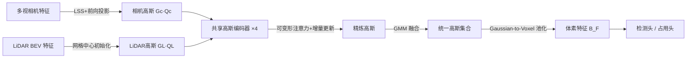

# GaussianFusion: Unified 3D Gaussian Representation for Multi-Modal Fusion Perception

**会议**: ICLR 2026  
**OpenReview**: [https://openreview.net/forum?id=7jXxQ9bGoU](https://openreview.net/forum?id=7jXxQ9bGoU)  
**代码**: 待确认  
**领域**: 自动驾驶 / 多模态融合感知  
**关键词**: 3D Gaussian Splatting, 多模态融合, BEV, 3D 目标检测, 语义占用预测, nuScenes  

## 一句话总结
用连续的 3D 高斯表征取代离散 BEV 栅格作为相机-LiDAR 多模态融合的统一空间，在量化之前完成跨模态对齐与交互，从而在 3D 检测和占用预测两个任务上同时刷新精度并大幅降低显存/时延。

## 研究背景与动机
**领域现状**：自动驾驶感知普遍把多传感器特征投到共享的鸟瞰图（BEV）空间做融合，BEVFusion、UniTR、MetaBEV 等都是在 BEV 栅格上用 CNN 拼接或交叉注意力完成相机与 LiDAR 的统一表征，因为 BEV 天然支持检测、分割、占用等多种下游任务。

**现有痛点**：BEV 的本质是把数据离散化、量化到固定分辨率的栅格里，这一步过早地压缩了空间信息，边缘和细纹理细节不可逆地丢失；分辨率越低损失越严重，而提高分辨率又会带来无法承受的显存开销（论文 Table 1：BEVFusion 从 100×100 提到 400×400，显存从 3.2 GB 暴涨到 20.5 GB）。更糟的是 BEV 融合常用简单的特征拼接或加权求和，跨模态交互能力弱，导致融合次优。

**核心矛盾**：BEV 想要细粒度表征就必须提高栅格分辨率，但分辨率与计算开销成平方级膨胀——精度和效率在离散栅格范式里无法兼得，且量化造成的信息损失发生在融合之前，跨模态对齐先天受限。

**本文目标**：跳出 BEV 范式，找到一个既能保留连续几何/语义细节、又能让跨模态特征在量化之前充分交互的统一表征，并且要任务无关（detection 与 occupancy 共用一套）。

**核心 idea**：**[连续高斯统一空间]** 借鉴 3D Gaussian Splatting，用一组连续的 3D 高斯分布表征整个场景，相机和 LiDAR 各自初始化高斯集合，在共享高斯编码器里迭代对齐，最后用高斯混合模型自然融合、再体素化喂给任务头——把"量化"这一步推迟到融合之后，让跨模态交互发生在更高维的连续空间。

## 方法详解

### 整体框架
GaussianFusion 分三段走：先为相机和 LiDAR 在统一 3D 空间各自初始化高斯集合 $G_c{\leftrightarrow}Q_c$、$G_L{\leftrightarrow}Q_L$（高斯属性 + query 特征）；再把两组高斯并到 batch 维送进一个**共享**高斯编码器，堆叠 4 层做带高斯先验的可变形注意力 + 增量式属性更新，让两模态逐层收敛到一致的高斯分布；最后用高斯混合模型把相机/LiDAR 高斯融成统一集合，经 Gaussian-to-Voxel 池化转成体素特征 $B_F$，接入与 BEVFusion 同款的检测头或占用头。

### 关键设计

**1. 前向投影的相机高斯初始化：给高斯一个有依据的几何先验。** 每个 3D 高斯由均值 $\mu\in\mathbb{R}^3$、尺度 $s\in\mathbb{R}^3$、旋转 $r\in\mathbb{R}^4$ 描述，其在椭球空间内对点 $p$ 的响应为 $g_c(p;\mu,s,r)=\exp\!\big(-\tfrac{1}{2}(p-\mu)^T\Sigma^{-1}(p-\mu)\big)\,q_c$，协方差 $\Sigma=RSS^TR^T$。与 GaussianFormer 在空间里随机撒高斯不同，本文把相机特征送进 LSS 预测深度分布 $D_i$，直接用深度点的 3D 位置作为高斯均值 $\mu$，尺度和旋转才随机初始化；再用深度分布与上下文网络的语义特征做内积得到每个深度点的 query $Q_c$。这样高斯一出生就锚定在合理的 3D 位置上，避免了随机初始化导致的优化困难。LiDAR 侧则更直接——BEV 栅格每个体素中心天然提供了均值 $\mu$，BEV 特征过 MLP 得到 LiDAR query $Q_L$。

**2. 带高斯先验的可变形注意力：让采样点贴合物体形状。** 普通可变形注意力（Zhu et al. 2020）从一个近似"方块/卷积核"的规则区域出发学偏移，缺乏物体形状的几何先验。本文反过来直接利用高斯本身的形状属性：把 3D 高斯投影到 BEV 特征图上，得到一个编码了朝向、尺度、协方差结构的先验采样分布——采样点不再是栅格上均匀排布，而是沿着与物体几何（长宽比、朝向、空间不确定性）对齐的高斯分布展开。具体地，根据协方差算出一组偏移 $\Delta\mu=(\Delta x,\Delta y,\Delta z)$，参考点 $\mu+\Delta\mu$ 投到 BEV 后做注意力 $\mathrm{DeformAtt}(q_i,B_i)=\sum_{k=1}^{K}A_k\cdot W_kB_i(\mu+\Delta\mu)$，使跨模态特征更好地对齐到"物体的可能范围"。消融显示该高斯先验比方块初始化高 +0.4 NDS。

**3. 共享高斯编码器 + 增量式属性更新：在统一空间里逐层抹平模态差异。** 关键在于相机和 LiDAR 用**同一套**编码器参数（合并到 batch 维），因为两模态最终都该收敛到相似的高斯分布，共享既能学到跨模态互补的不确定性又让模型更精简——消融里 shared 比 separate 高 +0.7 mAP。更新策略上，不像 GaussianFormer 每轮重新预测一整套新高斯，而是用 MLP 预测属性的**增量** $\hat{G}_i=\mathrm{MLP}(\hat{Q})+G_i=(\Delta\mu+\mu,\Delta s+s,\Delta r+r)$。增量式更新让模型跨层逐步缩小两模态在感知同一物体时的差异，对深度预测不确定性、信号衰减等融合不确定性更鲁棒（消融里预测偏移而非属性本身带来 +0.9 mAP）。query 还会把高斯属性经 MLP 编码成位置嵌入 PE 加回去（$\hat{Q}_i=\mathrm{MLP}(G)+Q_i$，+0.5 mAP）。

**4. 高斯混合融合与 Gaussian-to-Voxel 池化：把连续表征落地成任务无关特征。** 由于高斯点分布不规则，需要体素化才能接通用任务头。把统一高斯集合划进 $H\times W$ 体素网格，对含 $M$ 个高斯的非空体素用 MeanVFE 下采样，使每个体素只保留一个高斯 $\hat{g}=\tfrac{1}{M}[\sum\mu_m,\sum s_m,\sum r_m]$、$\hat{q}=\tfrac{1}{M}\sum\hat{q}_m$。覆盖某点 $p$ 的所有 $J$ 个高斯按混合模型累加得到融合特征 $f(p)=\sum_{i=1}^{J}\hat{g}_i(p;\mu,s,r)\hat{q}_i$，再过一个轻量卷积网络优化得到 $B_F$。GMM 天然能把多个高斯聚合成更细粒度的分布，优雅地统一了多模态表征；最终 $B_F$ 可直接喂给 BEVFusion 式检测头或 BEVDet 式占用头，实现任务无关感知。

## 实验关键数据

### 主实验表格
nuScenes 3D 目标检测（C+L，704×256，Swin-T + VoxelNet）：

| 方法 | val NDS | val mAP | test NDS | test mAP |
|------|---------|---------|----------|----------|
| BEVFusion(M) | 71.4 | 68.5 | 72.9 | 70.2 |
| MetaBEV | 71.5 | 68.0 | - | - |
| EA-LSS | 73.1 | 71.2 | 74.4 | 72.2 |
| UniTR | 73.3 | 70.5 | 74.5 | 70.9 |
| **GaussianFusion** | **74.0** | **71.7** | **74.9** | **72.4** |

相比 BEVFusion 在 val 上 +2.6 NDS / +3.2 mAP；时延 132 ms vs 156 ms、显存 4271 MB vs 5140 MB（Table 3），更快更省。时序版 GaussianFusion-T 达 77.6 NDS / 75.0 mAP，超过 SparseLIF-T。Waymo 上 mAPH-L2 80.75 vs BEVFusion 76.33。

nuScenes 语义占用预测（val）：

| 方法 | 模态 | IoU | mIoU |
|------|------|-----|------|
| GaussianFormer | C | 29.83 | 19.10 |
| GaussianFusion-C | C | 32.48 | 20.65 |
| OccFusion | C+L | 43.53 | 27.55 |
| **GaussianFusion** | C+L | **44.75** | **28.65** |

### 消融实验表格
高斯初始化策略（Table 8）与编码器组件（Table 9）：

| 初始化策略 | NDS | mAP |
|------------|-----|-----|
| 随机初始化 | 71.2 | 68.3 |
| 反向投影 | 72.4 | 70.0 |
| LiDAR 投影 | 73.6 | 71.1 |
| **前向投影** | **74.0** | **71.7** |

| 编码器配置 | NDS | mAP |
|------------|-----|-----|
| 完整（Share+DA.G+PE+Offset） | 74.0 | 71.7 |
| Separate 替换 Share | 73.6 | 71.1 |
| 去 DA.G（用 vanilla） | 73.6 | 71.2 |
| 去 PE | 73.4 | 71.0 |
| 去 Offset（直接预测属性） | 73.2 | 70.8 |

### 关键发现
- 前向投影初始化比随机初始化猛涨 +2.8 NDS，说明给高斯一个深度先验的位置是优化能否收敛的关键。
- 与 GaussianFormer 对比（Table 7）：GaussianFusion-C 仅用 43K 高斯（30%）、105 ms（vs 475 ms，约 4.5× 提速）就把 mIoU 从 19.10 提到 20.65，证明前向初始化 + 增量更新远比"随机撒+重预测"高效。
- 共享编码器、高斯先验注意力、PE、增量更新四个组件各自都有正贡献，增量更新（+0.9 mAP）和共享（+0.7 mAP）贡献最大。

## 亮点与洞察
- **把"量化"推后**是核心洞察：BEV 的根本问题不是栅格本身，而是量化发生在融合之前。GaussianFusion 让跨模态交互在连续高斯空间完成，量化（体素化）放到融合之后，于是低分辨率 BEV 也能保住细节（Table 1 里 100×100 的 GaussianFusion 73.1 NDS 已超过 400×400 的 BEVFusion 72.7）。
- **协方差矩阵 = 自适应不确定性建模**：高斯的协方差天然刻画了物体形状和边界的不确定性，既给可变形注意力提供形状先验，又让两模态在融合时对齐"不确定性"，这是离散栅格做不到的。
- **任务无关 + 第一个用 GMM 做多模态高斯融合**：检测和占用共用一套表征，且把相机/LiDAR 高斯当成混合模型分量自然聚合，比拼接/加权优雅得多。

## 局限与展望
- 仍需把连续高斯**体素化**才能接通用任务头，MeanVFE 把一个体素内多高斯平均成一个，这一步又引入了量化损失，连续表征的优势在末端被部分抵消，有进一步设计无损读出头的空间。
- 实验主要在 nuScenes（外加 Waymo 检测），占用预测只在单帧/nuScenes 验证；高斯数量、编码器层数等超参对不同传感器配置的鲁棒性论文未充分展开。
- 时序版 GaussianFusion-T 只是把历史高斯 warp 后塞进同样的融合公式，属于"简单时序"，与 SparseLIF-T 等专门时序方法相比设计还较朴素，时序建模仍有挖掘空间。

## 相关工作与启发
- **多模态 3D 感知**：分 object-centric（PointPainting、各种 query-based 检测）与 dense BEV（BEVFusion、UniTR、MetaBEV）两派；前者难泛化到占用等密集任务，后者受离散栅格信息损失之限。GaussianFusion 属于 dense 派但换了连续载体。
- **3D Gaussian Splatting**：从 3D 重建走向感知，GaussianFormer/相关工作把 3DGS 用于纯视觉占用预测，但都依赖随机初始化、每轮重预测，且没利用 GMM 做多模态融合——本文正是补上"前向投影初始化 + 增量更新 + GMM 多模态融合"三块。
- **启发**：连续表征 + 延迟量化的思路可推广到其他"先融合后离散"的多传感器系统；用生成式表征（高斯/NeRF）的几何属性反哺判别式注意力的采样先验，是一个值得复用的设计模式。

## 评分
- **新颖性**: ⭐⭐⭐⭐ 首个用统一 3D 高斯表征做相机-LiDAR 多模态融合的框架，"延迟量化 + GMM 融合 + 前向投影初始化"组合有清晰动机，虽然单个组件（3DGS、可变形注意力、LSS）都来自已有工作。
- **实验充分度**: ⭐⭐⭐⭐ 覆盖检测+占用两任务、nuScenes+Waymo 两数据集，含时延/显存对比和细致消融，与 GaussianFormer 的效率对比尤其有说服力；缺更大规模或更多传感器配置的泛化验证。
- **写作质量**: ⭐⭐⭐⭐ 动机—方法—实验逻辑清晰，Table 1 的 BEV 分辨率-显存权衡开篇即点中痛点；部分公式符号（如 query 维度）表述略粗糙。
- **价值**: ⭐⭐⭐⭐ 在精度、时延、显存三方面同时改善且任务无关，对自动驾驶融合感知有直接工程价值，连续表征延迟量化的范式有较强启发性。

<!-- RELATED:START -->

## 相关论文

- [\[ECCV 2024\] UniM2AE: Multi-modal Masked Autoencoders with Unified 3D Representation for 3D Perception in Autonomous Driving](../../ECCV2024/autonomous_driving/unim2ae_multi-modal_masked_autoencoders_with_unified_3d_representation_for_3d_pe.md)
- [\[CVPR 2026\] GaussianDWM: 3D Gaussian Driving World Model for Unified Scene Understanding and Multi-Modal Generation](../../CVPR2026/autonomous_driving/gaussiandwm_3d_gaussian_driving_world_model_for_unified_scene_understanding_and_.md)
- [\[ICLR 2026\] UniSplat: Unified Spatio-Temporal Fusion via 3D Latent Scaffolds for Dynamic Driving Scene Reconstruction](unisplat_unified_spatio-temporal_fusion_via_3d_latent_scaffolds_for_dynamic_driv.md)
- [\[CVPR 2026\] RPGFusion: 4D Radar Prior-Guided Multi-Modal Fusion for 3D Detection](../../CVPR2026/autonomous_driving/rpgfusion_4d_radar_prior-guided_multi-modal_fusion_for_3d_detection.md)
- [\[ICLR 2026\] SiMO: Single-Modality-Operable Multimodal Collaborative Perception](simo_single-modality-operable_multimodal_collaborative_perceptio.md)

<!-- RELATED:END -->
