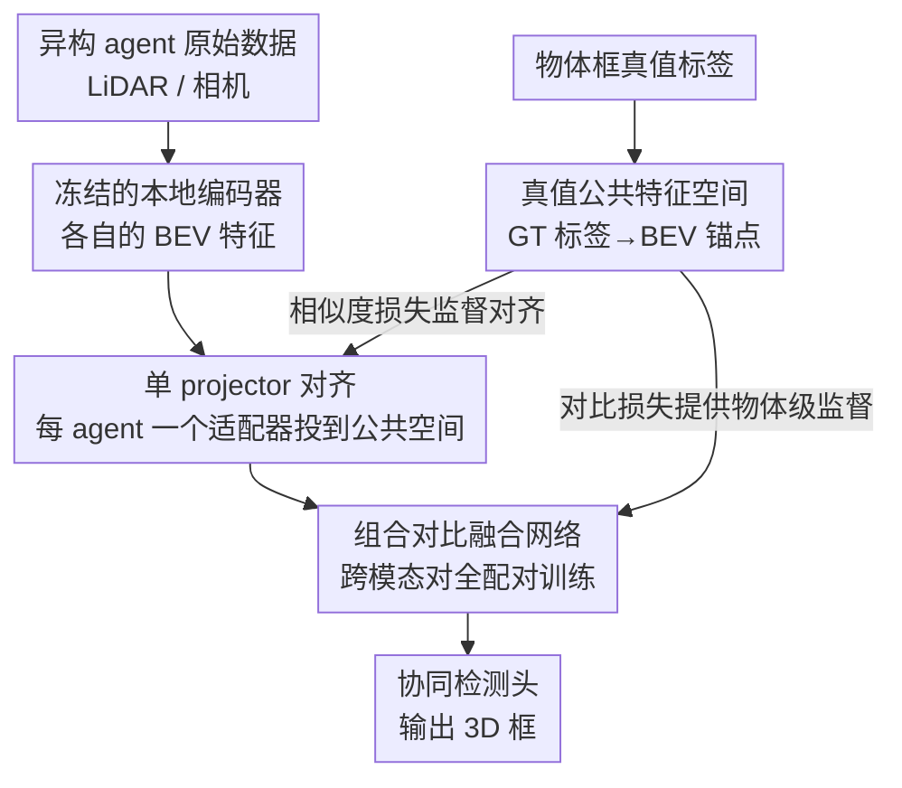

# GT-Space: Enhancing Heterogeneous Collaborative Perception with Ground Truth Feature Space

**会议**: ICLR 2026  
**OpenReview**: [https://openreview.net/forum?id=fwTRpXMsxB](https://openreview.net/forum?id=fwTRpXMsxB)  
**代码**: https://github.com/KingScar/GT-Space (有)  
**领域**: 自动驾驶 / V2X 协同感知  
**关键词**: 协同感知, 异构特征对齐, 公共特征空间, 对比学习, BEV 检测

## 一句话总结
GT-Space 用真值标注（物体框）构造一个统一的 BEV「公共特征空间」作为对齐锚点，让每个异构智能体只需训练一个轻量 projector 就能把自己的特征投到这个空间里融合，配合跨模态组合对比损失，在 OPV2V / V2XSet / RCooper 上的异构协同 3D 检测精度全面超过需要重训编码器或两两适配的现有方法。

## 研究背景与动机
**领域现状**：多智能体协同感知（如车车 V2V、车路 V2X）通过共享感知信息扩大单车视野。出于通信效率，主流做法是**中间融合**——智能体之间交换压缩后的 BEV 特征，而不是原始点云/图像。当各智能体用同一套编码器、特征语义和粒度都对齐时，叫**同构协同**；但现实中不同车辆/路侧单元的传感器模态（LiDAR vs 相机）和模型结构往往不同，这就是**异构协同**，特征无法直接拼到一起融合。

**现有痛点**：现有异构融合方案在融合前都要做一步特征适配，主要两条路都不可扩展：（1）**重训编码器**（如 HEAL）——协作方为了对齐 ego 的特征空间，需要重训自己的 encoder，开放环境里要为每个潜在伙伴维护多套编码器，代价极高，而且重训还可能损害原编码器本身的感知能力；（2）**特征解释器**（如 PnPDA）——ego 端要为每个异构伙伴配一个专属 interpreter 做两两投影，伙伴数一多就爆炸，且 PnPDA 只能处理点云、忽略了传感器模态异构。

**核心矛盾**：这两类方法的对齐都是**以 ego 为锚、两两配对**的，导致两个问题——一是部署成本随智能体种类组合爆炸（O(N²) 量级的适配模块）；二是协同上限被 ego 模型能力卡住，如果 ego 模型弱，伙伴再好的特征也只能带来有限收益。

**本文目标**：找一个**与具体 agent 无关、可一次对齐多方**的参照系，让 (a) 新 agent 加入只需训练一个自己的适配器、(b) 融合质量不再被某个弱 agent 拖累。

**切入角度**：作者注意到——既然检测任务的「标准答案」（物体的位置、尺寸、朝向、类别）对所有 agent 都是同一份真值，那为什么不直接**把真值标注本身编码成一个 BEV 特征空间**，让所有异构特征都向这份「上帝视角」的特征对齐？真值提供的是精确的物体级空间+语义信息，天然是一个干净、共享、准确的锚点。

**核心 idea**：用**真值标签构造的公共特征空间**取代「以 ego 为锚的两两对齐」——每个 agent 只学一个 projector 把自身特征投到这个公共空间，再用跨模态组合对比损失训练一个模态无关的融合网络。

## 方法详解

### 整体框架
GT-Space 的输入是多个异构 agent 各自编码出的 BEV 特征图（来自不同传感器/模型），输出是融合后送入协同检测头得到的 3D 检测框。关键在于中间插入了一个由**真值标签生成的公共特征空间**（GT Space）作为所有特征的统一坐标系：训练分三步走——先把单 agent 的感知网络（编码器+检测头）预训练好并冻结；再单独训练一个「真值编码器」把物体框标签映射成 GT BEV 特征，定义出公共空间；最后训练融合网络时，各 agent 的特征经各自的 projector 投到公共空间，用对比损失和相似度损失对齐，并在多种模态组合上联合优化。推理时每个异构 agent 用自己的 projector 把特征对齐到公共空间，再过融合 transformer 和协同检测头出结果。当一个全新模态的 agent 加入时，冻结所有已有参数、**只训练它专属的 projector** 即可接入。

### 关键设计

**1. 真值公共特征空间：把标准答案编码成统一对齐锚点**

针对「两两对齐不可扩展 + 协同上限被 ego 卡住」的痛点，GT-Space 不再让异构特征互相对齐，而是构造一个所有 agent 共享的参照系。具体做法：每个 3D 框写成向量 $B_i=(x,y,z,l,w,h,r,c)$（中心、尺寸、朝向角、类别），先用两层带 LayerNorm 的全连接编码成物体表示 $\beta_i=\mathrm{LayerNorm}(\mathrm{FC}(B_i))$；再把物体铺到 BEV 网格上，每个格子 $c$ 的特征为 $U_c=\mathrm{MLP}(\beta_i,\mathrm{PE}(x_c,y_c))$，其中 PE 是正弦位置编码。一个物体会覆盖多个格子，若多个物体覆盖同一格子则把它们的特征**求和**叠加，从而保留重叠物体信息，最终拼成整张真值 BEV 图 $F_{GT}$。为保证这张图确实承载了可解码的物体信息，作者把它送进检测头解码出框，并用 IoU 损失监督：

$$L_{GT}=\frac{1}{K}\sum_{k=1}^{K}\big(1-\mathrm{IoU}_k\big),\quad \mathrm{IoU}_k=|P_k\cap G_k|/|P_k\cup G_k|.$$

这样得到的 $F_{GT}$ 只含与物体相关的干净特征，比起「只靠最终检测输出反传的监督」，它提供了**特征级的中间监督**，能更直接地弥合异构 agent 之间的域差。区别于把特征投进一个纯学出来的隐空间，这个空间是有明确物理含义、对所有 agent 都一致的。

**2. 单 projector 异构特征对齐：每个 agent 只学一个适配器**

针对「为每对 agent 维护专属 interpreter / 重训编码器」的不可扩展性，GT-Space 让每个 agent 只配**一个** projector $\Phi_a$，把本地 BEV 特征 $F_a$ 投到公共空间，用特征相似度损失对齐到 $F_{GT}$：

$$\Phi_a=\arg\min_\eta L_\eta(F_{GT},F_a),\quad L_\eta=\|F_{GT}-\eta(F_a)\|^2.$$

因为对齐目标是固定的公共空间而不是某个具体伙伴，适配器数量从「两两组合」降到「每 agent 一个」（O(N) 而非 O(N²)），开放环境里新 agent 接入的部署成本被压到最低。消融显示去掉 projector 掉点最严重（OPV2V mAP@70 从 0.814 跌到 0.683），印证了异构特征不先对齐到统一语义、直接喂给融合网络根本融不动。

**3. 组合对比融合：在所有模态对上训练一个模态无关的融合网络**

为了让一个融合网络能吃任意模态组合、并真正聚焦于物体相关特征，作者用 transformer（多头自注意力 + FC + LN）做融合，并用对比学习监督。对融合后的特征 $F_{m,m'}$，按物体框内的格子做池化得到物体级表示，计算它与真值特征的温度控制余弦相似度 $s_{B,c,P}=(F^{B,c}_{m,m'})^\top \bar U_P/\tau$，再用交叉熵把**同一物体**的融合特征与真值特征拉近、**不同物体**推远：

$$L_{m,m'}=-\sum_{B\in\mathcal{B}}\sum_{c\in \mathrm{cells}(B)}\log\frac{\exp(s_{B,c,B})}{\sum_{l\in\mathcal{B}}\exp(s_{B,c,l})}.$$

关键的「组合」在于：不是只在一对模态上算，而是对**所有可能的模态对**求和 $L_E=\sum_{m,m'}L_{m,m'}$（如 LiDAR-PointPillar / LiDAR-SECOND / 相机-EfficientNet 三者两两配对全算一遍）。这种组合式联合优化让融合网络在推理时能处理任意模态组合，而不是只会融训练时见过的那一对。这是 GT-Space 实现「即插即用、模态无关」的训练侧核心。

### 损失函数 / 训练策略
训练时各 agent 的本地编码器与检测头**预训练后全程冻结**（保证不影响单车原有感知能力，实现即插即用）。为避免空间错位带来的噪声，融合训练用的是**单个 agent 的同源观测数据**（天然空间对齐）。总损失由三项组成：特征对齐损失 $L_{\Phi_a}$（式 6）、异构组合对比损失 $L_E$（式 9）、基础 BEV 检测损失 $L_B$：

$$L=\sum_a L_{\Phi_a}+L_E+L_B.$$

真值 BEV 特征**只在训练时**通过 $L_\Phi$ 和 $L_E$ 参与，推理时不引入任何额外网络或参数——这是它「零额外部署成本、可扩展」的关键。

## 实验关键数据

### 主实验
数据集：OPV2V、V2XSet（仿真）、RCooper（真实路侧）。指标为 AP@0.5 / AP@0.7。设定 4 类 agent：A1=SECOND(LiDAR)、A2=PointPillar(LiDAR，OPV2V 中为车、V2XSet 中为路侧)、A3=EfficientNet(相机)、A4=ResNet50(相机)。

不同异构模态对融合（ego 固定 A1，分别与 A2/A3/A4 协同），OPV2V 上的 AP@70：

| ego A1 协同对象 | 指标 | 本文 | 之前最好 | 提升 |
|--------|------|------|----------|------|
| A2 (LiDAR-LiDAR) | AP@70 | 0.810 | 0.806 (STAMP) | +0.004 |
| A3 (LiDAR-相机) | AP@70 | 0.766 | 0.734 (STAMP) | +0.032 |
| A4 (LiDAR-相机) | AP@70 | 0.762 | 0.738 (STAMP) | +0.024 |

可见**模态异构度越高（LiDAR×相机）增益越大**，说明 GT-Space 在弥合跨域表示差距上更有优势。

四 agent 同时协同（OPV2V，AP@70，看每个 agent 视角）：

| 方法 | A1 | A2 | A3 | A4 |
|------|----|----|----|----|
| 无协同 | 0.614 | 0.620 | 0.354 | 0.337 |
| HEAL | 0.806 | 0.801 | 0.726 | 0.733 |
| STAMP | 0.815 | 0.801 | 0.718 | 0.716 |
| GT-Space | 0.814 | 0.803 | **0.758** | **0.750** |

提升主要体现在**弱的相机 agent（A3/A4）**上——PnPDA/STAMP 这类 interpreter 方法对相机增强有限（点云空间信息在解释过程中丢失、冻结的相机检测头难以恢复），而 GT-Space 靠公共空间这一可靠参照把弱 agent 显著抬高。

### 消融实验
Agent 1 视角下各组件的影响：

| 配置 | OPV2V mAP@50 | OPV2V mAP@70 | 说明 |
|------|---------|---------|------|
| Full version | 0.892 | 0.814 | 完整模型 |
| w/o-GT feature | 0.868 | 0.795 | 用 PointPillar 特征空间替代真值空间 |
| w/o-projector | 0.791 | 0.683 | 不对齐直接喂融合网络，掉点最严重 |
| w/o-contrastive loss | 0.845 | 0.721 | 只用检测损失，去掉组合对比损失 |

### 关键发现
- **projector 贡献最大**：去掉后 mAP@70 从 0.814 暴跌到 0.683，证明异构特征不先对齐到统一语义就无法有效融合。
- **GT 特征空间对 LiDAR ego 影响相对小**（mAP@70 仅从 0.814 降到 0.795）：因为 A1 本身是 LiDAR，点云特征空间已保留丰富几何线索；但对相机这类弱 agent，真值空间的作用会明显得多。
- **组合对比损失同时管两件事**：既做跨模态对齐，又强化物体相关特征表示，去掉后 mAP@70 掉到 0.721。
- **鲁棒性好**：对位姿误差（高斯噪声）和通信时延（最高 500ms）都保持领先；可视化显示融合后物体特征激活显著增强、噪声被抑制。

## 亮点与洞察
- **「用标准答案当锚点」的视角很巧**：检测任务的真值对所有 agent 是同一份，把它编码成 BEV 特征空间，天然解决了「以谁为锚」的争议，还把对齐复杂度从 O(N²) 降到 O(N)。这个思路可迁移到任何「多源异构特征需要对齐、且存在共享 ground truth」的场景（如多传感器融合、多视角重建）。
- **真值特征只在训练时用、推理零额外参数**：相当于把「上帝视角监督」蒸馏进 projector 和融合网络，部署时完全不需要真值，既轻量又实用。
- **组合对比损失实现模态无关融合**：在所有模态对上联合训练，让一个融合网络泛化到任意模态组合，避免了端到端方法「只会融训练见过的组合」的死板。

## 局限与展望
- **强依赖真值标注**：公共特征空间的构造完全建立在精确的物体框标签上，作者也承认未来要转向弱监督学习以提升真实世界适用性。
- **理想通信/位姿假设**：虽然做了位姿噪声和时延的鲁棒性实验，但训练融合网络时刻意用单 agent 同源数据来规避空间错位，真实多 agent 的空间错位影响讨论得不够深。
- **相机 projector 不增强特征**：可视化中作者指出 projector 对相机特征没有增强能力，投影后的相机特征物体信息仍不如 LiDAR 丰富，跨大模态差距的对齐质量仍有天花板。
- 自己观察：实验主要在仿真（OPV2V/V2XSet）+ 单个真实数据集上，RCooper 结果还放在附录，真实路侧大规模异构场景的验证可以更充分。

## 相关工作与启发
- **vs HEAL（重训编码器）**: HEAL 固定金字塔融合模块、只重训编码器来造异构模型，本文不动任何编码器/检测头、只训一个 projector，避免了重训损害原编码器感知能力且需维护多套编码器的问题。
- **vs PnPDA（特征解释器）**: PnPDA 用即插即用域适配器做两两对齐，但只能处理点云、忽略传感器模态异构；本文用真值公共空间一次对齐多模态，且天然支持相机。
- **vs HM-ViT / 端到端方法**: 端到端方法要为特定模态组合训练整个模型，新模态加入就得重训；本文靠公共空间 + 组合对比损失实现模态无关、即插即用。
- **vs STAMP**: 同为 interpreter 思路对 LiDAR 提升明显但对相机有限，本文在弱相机 agent 上的增益是核心差异点。

## 评分
- 新颖性: ⭐⭐⭐⭐⭐ 「用真值标签构造公共特征空间当对齐锚点」是个干净且少见的切入点，把 O(N²) 适配降到 O(N)。
- 实验充分度: ⭐⭐⭐⭐ 三数据集 + 模态对/多 agent/鲁棒性/消融齐全，但真实数据集验证（RCooper）偏弱、放附录。
- 写作质量: ⭐⭐⭐⭐ 框架清晰、图示到位，公式表述完整。
- 价值: ⭐⭐⭐⭐ 即插即用、推理零额外成本，对开放环境异构 V2X 协同有实际部署价值，主要受限于对真值标注的依赖。

<!-- RELATED:START -->

## 相关论文

- [\[ICLR 2026\] Rate-Distortion Optimized Pragmatic Communication for Collaborative Perception](rate-distortion_optimized_pragmatic_communication_for_collaborative_perception.md)
- [\[ICLR 2026\] SiMO: Single-Modality-Operable Multimodal Collaborative Perception](simo_single-modality-operable_multimodal_collaborative_perceptio.md)
- [\[CVPR 2026\] IntrinsicWeather: Controllable Weather Editing in Intrinsic Space](../../CVPR2026/autonomous_driving/intrinsicweather_controllable_weather_editing_in_intrinsic_space.md)
- [\[ICLR 2026\] DriveMamba: Task-Centric Scalable State Space Model for Efficient End-to-End Autonomous Driving](drivemamba_task-centric_scalable_state_space_model_for_efficient_end-to-end_auto.md)
- [\[CVPR 2026\] CATNet: Collaborative Alignment and Transformation Network for Cooperative Perception](../../CVPR2026/autonomous_driving/catnet_collaborative_alignment_and_transformation_network_for_cooperative_percep.md)

<!-- RELATED:END -->
