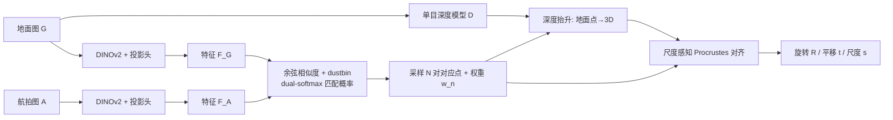

# Loc²: Interpretable Cross-View Localization via Depth-Lifted Local Feature Matching

**会议**: ICLR 2026  
**OpenReview**: [https://openreview.net/forum?id=2ciXKn2UlS](https://openreview.net/forum?id=2ciXKn2UlS)  
**代码**: [https://github.com/vita-epfl/Loc2](https://github.com/vita-epfl/Loc2)  
**领域**: 自动驾驶 / 跨视角视觉定位  
**关键词**: 跨视角定位, 局部特征匹配, 单目深度, Procrustes 对齐, 弱监督, 可解释性  

## 一句话总结
Loc² 直接在**地面图像与航拍图像的像素平面**上学习局部特征对应，再用单目深度把匹配点抬升到 BEV、用**尺度感知 Procrustes 对齐**解析地解出 3-DoF 位姿与深度尺度——只靠相机位姿弱监督，无需像素级标注，在跨区域和未知朝向等难场景下取得 SOTA，且匹配点本身就是定位质量的可视化解释。

## 研究背景与动机
**领域现状**：细粒度跨视角定位（fine-grained cross-view localization）用一张地面图配上粗 GNSS 圈出的航拍图，估计相机的 3-DoF 位姿（2D 平面位置 + 偏航角），是 GNSS 在密集城区误差达数十米时的有力补充。主流做法分两类：一类比对**全局描述子**（如 CCVPE），一类把地面图 warp 成 BEV 再与航拍图对齐（如 HC-Net、DenseFlow）。

**现有痛点**：这些方法几乎都不显式给出"地面视图里哪个物体对应航拍图里哪个物体"，可解释性差——出了错也说不清错在哪。最近的 FG2 第一次实现了地面-航拍局部特征对应，但它在 **BEV 空间里做匹配**：把地面图 warp 到 BEV 会引入射线方向畸变、丢掉高度维信息，匹配质量受损，尤其在**朝向未知**时定位严重退化。

**核心矛盾**：想要可解释（显式对应）+ 想要鲁棒（跨区域、未知朝向）+ 又没有地面-航拍像素级真值可用来微调通用匹配器。BEV 匹配天然牺牲信息，全局描述子天然不可解释。

**本文目标**：在**原始像素平面**而非 BEV 上直接建立地面-航拍对应，既保住可解释性又避免 warp 失真，并只用相机位姿这一弱监督就能端到端训练。

**核心 idea**：
- **像素平面直接匹配**：两支共享结构的特征提取分支分别给地面图和航拍图出特征图，用余弦相似度 + dustbin + dual-softmax 得到匹配概率，避免 BEV warp。
- **深度抬升 + 尺度感知 Procrustes**：匹配到的地面点用单目深度（度量或相对都行）抬升到 3D，再用可微的尺度感知 Procrustes 一次性解出旋转、平移**和深度尺度**，把"位姿求解"做成解析、可微、可反传的环节。

## 方法详解

### 整体框架
Loc² 是"匹配 → 抬升 → 解析对齐"的三段流水线，全程可微，仅用 3-DoF 位姿监督端到端训练。先在地面图 $G$ 与航拍图 $A$ 之间求局部特征对应（Sec 3.1），再用现成单目深度 $D=\mathcal{D}(G)$ 把匹配到的地面点抬升进 BEV，最后用尺度感知 Procrustes 对齐解出 3-DoF 位姿（Sec 3.2）。位姿是从对应点**解析**算出来的，所以对应质量直接等价于定位质量。

### 关键设计

**1. 像素平面局部特征匹配：用 dustbin 拒绝噪声，dual-softmax 求互信对应。** 两个分支共享架构，每支是冻结的 DINOv2 特征提取器接一个轻量投影头（几层卷积 + 一个自注意力层），把 $A$、$G$ 映成特征图 $F_A$、$F_G$。匹配分数用带温度的余弦相似度 $M=\mathrm{cosine}(F_A,F_G)/\tau$。借鉴 SuperGlue 的做法，给 $M$ 的行列各加一个可学习的 **dustbin**，让模型把不确定/无匹配的点"扔进垃圾桶"；在扩展后的矩阵 $M'$ 上做行列 dual-softmax 得到匹配概率
$$\hat{M}'_{ij}=\frac{e^{M'_{ij}}}{\sum_k e^{M'_{ik}}}\cdot\frac{e^{M'_{ij}}}{\sum_l e^{M'_{lj}}}.$$
最后丢掉 dustbin 行列，采样 $N=1024$ 对对应点，其匹配概率 $w_n$ 作为后续对齐的权重——好匹配天然权重大。这一步绕开了 BEV warp，保住了高度维信息和原始像素几何。

**2. 深度抬升 + 坐标赋值：同时吃度量深度和相对深度。** 单目深度本质是病态的（单图到绝对度量深度无唯一解）：度量深度模型（Unik3D 等）给绝对尺度，相对深度模型（Depth Anything 等）只准到一个**未知的逐图尺度**。Loc² 两者都支持——航拍图第 $n$ 个特征对应的度量平面坐标记为 $(x^A_n,y^A_n)$（原点在航拍图中心）；地面特征则按其深度和射线方向算出 3D 位置 $(x^G_n,y^G_n,z^G_n)/s$（原点在地面相机），$s$ 是从地面坐标系到航拍度量空间的未知尺度，用度量深度时 $s=1$。注意它**保留所有匹配点而不按高度筛选**（消融证明只取最高点反而更差，因为物体顶部的侧视语义未必和航拍最一致）。

**3. 尺度感知 Procrustes 对齐：把位姿求解做成可微解析解。** 拿到对应 $\{(x^A_n,y^A_n),(x^G_n,y^G_n,z^G_n)/s\}$ 和权重 $w_n$ 后，用 2D 尺度感知 Procrustes 解出满足 $Q=s(R\cdot P)+t$ 的尺度 $s$、旋转 $R$、平移 $t$。先算加权质心，再算加权协方差矩阵 $C=\sum_n w_n\tilde P_n\tilde Q_n^\top$，对 $C$ 做 SVD（$C=U\Sigma V^\top$）取 $R=VU^\top$ 得偏航角，尺度与平移为
$$s^*=\frac{\mathrm{Tr}(\Sigma)}{\sum_n w_n\|\tilde P_n\|^2},\quad t=\bar Q-s^*(R\cdot\bar P).$$
关键推导：由于 $P=P'/s$，代入后可证 $s^*=s$——**无论地面点尺度未知与否，对齐都给出一致的位姿估计并能恢复出真实尺度 $s$**。整个过程可微，于是局部特征匹配可以只靠位姿监督反传学习，推理时也能只用相对深度。

**4. 弱监督训练：VCE 位姿损失 + 对应级 infoNCE。** 位姿用 Virtual Correspondence Error（VCE）损失：在 2D 度量空间放 $N_v$ 个虚拟点，分别施加真值变换和估计变换，最小化对应虚拟点的平均欧氏距离
$$\mathcal{L}_{\mathrm{VCE}}=\frac{1}{N_v}\sum\|(R_{gt}P_v+t_{gt})-(RP_v+t)\|_2.$$
有度量深度时再加双向 infoNCE（$\mathcal{L}_{G2S}+\mathcal{L}_{S2G}$）直接监督对应关系，总损失 $\mathcal{L}=\mathcal{L}_{\mathrm{VCE}}+\lambda(\mathcal{L}_{G2S}+\mathcal{L}_{S2G})/2$。全程无需任何像素级地面-航拍对应标注。

## 实验关键数据

### 主实验表格
KITTI（前视、有限视场，DepthAnythingV2 度量深度）跨区域测试，定位均值误差（米）：

| 朝向噪声 | 方法 | →Loc Mean (m) | →Loc Median (m) |
|---|---|---|---|
| ±10° | FG2 | 7.31 | 4.15 |
| ±10° | DenseFlow | 7.97 | 3.52 |
| ±10° | **Ours** | **5.60** | **3.01** |
| ±180° | CCVPE | 13.94 | 10.98 |
| ±180° | **Ours** | **11.71** | **9.11** |

同区域 ±180° 难设定下，把均值误差从 CCVPE 的 6.88 m 大幅降到 **1.85 m**。

VIGOR（全景，Unik3D 训练）未知朝向：

| 设定 | 方法 | →Loc Mean (m) | →Ori Mean (°) |
|---|---|---|---|
| 未知朝向 cross-area | FG2 | 8.95 | 15.02 |
| 未知朝向 cross-area | CCVPE | 3.74 | 12.83 |
| 未知朝向 cross-area | **Ours** | **3.94** | **9.54** |
| 未知朝向 same-area | **Ours** | 4.23 | **11.67** |

未知朝向下大幅超过 FG2，方向误差在同/跨区域均为最低。

### 消融实验表格
VIGOR 同区域验证集、未知朝向：

| 设计选择 | Mean loc (m) | Median loc (m) | Mean ori (°) |
|---|---|---|---|
| (1) 只取最高点 | 3.95 | 1.78 | 9.37 |
| (2) 不考虑尺度（正交 Procrustes） | 5.47 | 2.75 | 19.92 |
| **Ours（全部点 + 尺度感知）** | **3.86** | **1.75** | 9.30 |

### 关键发现
- **尺度不变性极强**：把度量深度人为乘 0.001~1000 的任意尺度，定位误差变化 <1 cm；换成不重训的相对深度模型（BiFuse++/UniFuse），误差仅增 <0.2 m，可即插即用。
- **内点比例 ↔ 定位误差强负相关**：内点比从 10% 升到 50% 时位姿误差骤降，50% 后趋缓，使 RANSAC 内点数可直接当定位置信度做异常检测。
- **跨数据集泛化**：VIGOR 训练的模型直接用到澳洲 CVACT（乡野场景、域差大）仍能给出合理对应和良好的布局叠加对齐。
- **可解释性副产物**：叠加重缩放后的地面布局到航拍图，甚至帮作者发现了 VIGOR 真值标注的错误（车应在斑马线前而非线上）。

## 亮点与洞察
- **"在哪个空间匹配"是核心抉择**：FG2 在 BEV 匹配引入畸变、丢高度信息；Loc² 退回原始像素平面匹配，反而既保信息又保可解释，朝向未知时优势尤为明显。
- **把几何求解从网络里拆出来**：位姿不是网络回归出来的，而是 Procrustes 解析算出来的，因此对应质量 = 定位质量，天然可解释、可 RANSAC、可视化。
- **尺度感知 Procrustes 的推导很漂亮**：证明 $s^*=s$ 意味着可微对齐对地面点的未知尺度免疫，一举打通"训练用度量深度、推理用任意相对深度"的部署灵活性。
- **匹配体现语义而非纯外观**：高速路重复标线时模型转而用路牌、路灯当锚点，遮挡的"bus"字样也能匹配对，说明学到的是语义对应。

## 局限与展望
- **方向估计不占优**：因为朝向是从对应解析算出的，无法利用"KITTI 地面图大多沿道路方向"这类先验，朝向精度逊于专门建模的 SliceMatch/CCVPE。
- **依赖单目深度质量**：虽对尺度鲁棒，但深度的几何形状错误仍会经抬升传入对齐；远处/天空靠固定阈值粗暴过滤。
- **前视场景信息少**：KITTI 前视视场窄、可匹配信息有限，增益不如 VIGOR 全景明显；全景下"信息越多增益越大"也提示其更适合宽视场。
- **假设相机视轴与重力正交**：依赖可靠的 IMU/标定来保证该假设成立。

## 相关工作与启发
- **对比对象**：全局描述子派（CCVPE、SliceMatch）、几何变换派（GGCVT、HC-Net、DenseFlow），以及最接近的 FG2（首个地面-航拍局部对应，但在 BEV 做、朝向未知时差）。
- **技术血缘**：匹配借鉴 SuperPoint/SuperGlue 的 dustbin + dual-softmax；位姿求解承袭经典视觉定位"对应 + 几何 solver"的可解释流水线，把 PnP 类 solver 换成可微尺度感知 Procrustes（Umeyama 1991）。
- **启发**：当任务有"可解释 vs 鲁棒"的张力时，把几何求解从黑箱网络里解析地拆出来，往往同时换来可解释性和对未知尺度/朝向的鲁棒性；"在哪个表示空间做匹配"本身是值得反复审视的设计变量。

## 评分
- **新颖性**: ⭐⭐⭐⭐ — 像素平面直接匹配 + 尺度感知 Procrustes 的组合在跨视角定位里是清晰且有说服力的新解法，$s^*=s$ 的推导让"训度量、测相对"成为可能。
- **实验充分度**: ⭐⭐⭐⭐ — KITTI/VIGOR 双数据集、同/跨区域、已知/未知朝向、多种深度模型、CVACT 跨数据集泛化、内点-误差相关性都覆盖到，消融聚焦关键设计。
- **写作质量**: ⭐⭐⭐⭐ — 动机—方法—解释逻辑顺畅，Procrustes 推导交代清楚，可视化解释令人信服。
- **价值**: ⭐⭐⭐⭐ — 可解释 + 即插即用深度 + 弱监督，对自动驾驶/机器人定位落地很实用，代码开源。

<!-- RELATED:START -->

## 相关论文

- [\[CVPR 2026\] ELiC: Efficient LiDAR Geometry Compression via Cross-Bit-depth Feature Propagation and Bag-of-Encoders](../../CVPR2026/autonomous_driving/elic_efficient_lidar_geometry_compression_via_cross-bit-depth_feature_propagatio.md)
- [\[ICLR 2026\] Map as a Prompt: Learning Multi-Modal Spatial-Signal Foundation Models for Cross-scenario Wireless Localization](map_as_a_prompt_learning_multi-modal_spatial-signal_foundation_models_for_cross-.md)
- [\[ICCV 2025\] Where am I? Cross-View Geo-localization with Natural Language Descriptions](../../ICCV2025/autonomous_driving/where_am_i_cross-view_geo-localization_with_natural_language_descriptions.md)
- [\[CVPR 2026\] VIRD: View-Invariant Representation through Dual-Axis Transformation for Cross-View Pose Estimation](../../CVPR2026/autonomous_driving/vird_view-invariant_representation_through_dual-axis_transformation_for_cross-vi.md)
- [\[ECCV 2024\] DVLO: Deep Visual-LiDAR Odometry with Local-to-Global Feature Fusion and Bi-directional Structure Alignment](../../ECCV2024/autonomous_driving/dvlo_deep_visual-lidar_odometry_with_local-to-global_feature_fusion_and_bi-direc.md)

<!-- RELATED:END -->
