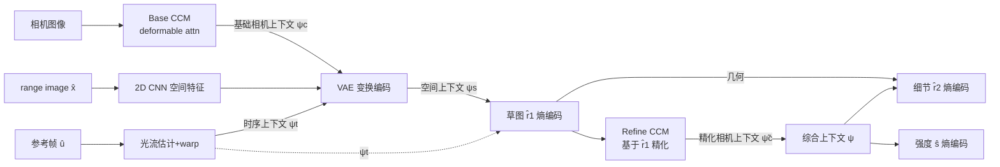

# Low-Latency Neural LiDAR Compression with 2D Context Models

**会议**: ICLR 2026  
**OpenReview**: [https://openreview.net/forum?id=y1REtB4olw](https://openreview.net/forum?id=y1REtB4olw)  
**代码**: [https://github.com/rrui-song/RangeCM](https://github.com/rrui-song/RangeCM)  
**领域**: 自动驾驶 / LiDAR 点云压缩  
**关键词**: LiDAR 点云压缩, 2D 上下文模型, range image, 时序-跨模态上下文, 几何-强度联合压缩  

## 一句话总结
RangeCM 把 LiDAR 点云压缩从昂贵的 3D 上下文（voxel/octree）整体搬到 2D range image 域，用 CNN 在 2D 上同时聚合空间、时序、相机三种上下文，并用一个混合上下文统一预测几何与强度，在 BD-Rate 比 SOTA 还好的同时把编解码延迟压到约 0.1 秒、强度压缩比基线快 100 倍以上。

## 研究背景与动机
**领域现状**：上下文建模是 LiDAR 点云无损/有损压缩的核心——给定已解码的上下文特征预测当前符号的概率分布，比特数由真值与估计分布之间的交叉熵决定，因此上下文越准、码率越低。为追求估计精度，SOTA 方法（RIDDLE、Unicorn、RICNet 等）普遍使用信息量丰富的 **3D 上下文**（octree、voxel、或在 range image 上仍套 3D 特征提取器）来刻画局部几何。

**现有痛点**：3D 特征的计算负担极重，单帧编解码动辄数百毫秒，而 Velodyne HDL-64E 等传感器以 10 FPS 产数据，3D 方案根本满足不了实时低延迟需求。少数实时方法（RENO）速度够快，但压缩率明显落后。更糟的是，几何和强度（intensity/反射率）通常用**两套独立网络**各算一遍上下文，强度压缩还要在几何解码完后重算特征，进一步拖慢速度（Unicorn 强度推理约 5 秒）。

**核心矛盾**：低延迟（要 2D、要轻）与高压缩率（传统上靠 3D 上下文换来的）之间难以兼得。直接把 3D 上下文换成 2D backbone 会因为缺少精确的 3D 局部上下文而性能严重退化。

**本文目标**：构建一个全程在 2D 域运算、同时支持高效率、快速编码、几何-强度通用压缩的神经 LiDAR 压缩器。

**核心 idea**：**用更丰富的上下文弥补 2D 表示的信息损失**——把点云表示成 range image 后，不在空间维度上"挖更深的 3D 几何"，而是在 2D 域里横向聚合**多尺度空间 + 光流时序 + 跨模态相机**三类上下文；再用**一个混合上下文统一预测几何和强度**，省掉重复计算。结果是 2D 模型反而大幅超过 3D 同行。

## 方法详解

### 整体框架
RangeCM 把连续 range image $x=\{r,s\}$（range 值图 $r$ + 强度图 $s$）量化为 $\hat{x}=\{\hat{r},\hat{s}\}$，其中 range 值经两段量化拆成"草图层 + 细节层" $\hat{r}=\{\hat{r}_1,\hat{r}_2\}$。整套编码基于 VAE 在 2D range 视图上做变换编码与熵建模，按 $\hat{r}_1 \to \hat{r}_2 \to \hat{s}$ 顺序编码，每一步都喂入聚合好的空间/时序/相机上下文。

### 关键设计

**1. 全 2D range-view 范式 + 草图/细节多尺度：把 3D 算子彻底拿掉。** RangeCM 的根基是放弃 voxel/octree 这类 3D 算子，所有变换和上下文模型都用 2D CNN 在 range image 上完成，从结构上消除了延迟瓶颈。为弥补 2D 表示的精度，range 值用两段量化分成草图与细节两层：$\hat{r}_1=\lceil r/b_1\rfloor$ 给出粗糙的草图层，$\hat{r}_2=\lceil(r-\hat{r}_1)/b_2\rfloor$ 给出增强的细节层，重建为 $\hat{r}=\hat{r}_1+\hat{r}_2$。多尺度上下文采用 coarse-to-fine 的 next-scale 策略——细节层 $\hat{r}_2$ 的估计以已解码的草图 $\hat{r}_1$ 为额外条件，并对每层再用棋盘格（checkerboard）划分 anchor/non-anchor 两组做并行的因果建模。训练时随机采样量化步长 $b_2$，从而单模型覆盖多码率，免去为每个码率单独训模型。

**2. 跨模态相机上下文（CCM）：用图像语义补点云的"缺信息"，并保证因果性。** 自动驾驶中相机几乎总与 LiDAR 共同部署，图像提供稠密语义（同一语义实例的点往往 range 值相近），正好补足稀疏点云缺失的歧义判别能力。CCM 用 2D CNN 分别提 range 图与相机图特征，再用 **deformable attention** 对齐：以 LiDAR 特征作 query $q_n$、相机特征作 key，自适应采样 $N$ 个 key token 做交叉注意力

$$\tilde{q}_n=\sum_{i=1}^{M} U_i \sum_{j=1}^{N} A_{ijn} V_i^T K(p_n+\Delta P_{ijn})$$

其中参考点 $p_n$ 通过 LiDAR-相机变换矩阵把 range 像素 lift 到 3D 再投影到相机系得到，给注意力一个"采样空间邻近相机像素"的归纳偏置。关键约束是**因果性**：生成 query 和参考点需要 LiDAR 几何，而接收端拿不到完整 $\hat{r}$，所以先用全精度几何算出基础相机上下文 $\psi_c$ 当 side information 传过去；待解出草图 $\hat{r}_1$ 后，再用另一个 deformable attention 基于 $\hat{r}_1$ 算精化相机上下文 $\tilde{\psi}_c$，既不破坏因果又保住对齐精度。

**3. 光流时序上下文：借鉴上下文视频压缩做帧间预测。** 把连续 LiDAR 帧类比视频帧，用轻量光流网络在 range 视图上估计当前帧 $\hat{x}$ 与参考帧（已解码前帧）$\hat{u}$ 之间的运动 $v$；由于 $v$ 接收端不可得，用 VAE 把它当 side information 编码（latent $\hat{y}_v$ + 超先验 $\hat{z}_v$），解出 $\hat{v}$ 后把 $\hat{u}$ 的特征 warp 到当前视图，得到时序上下文 $\psi_t$。空间先验的变换编码本身也以 $\psi_t$ 为条件：$y=g_a(\hat{x},\psi_c,\psi_t)$，熵模型形如 $p(\hat{y}|\hat{z},\psi_t)=\prod_i (\mathcal{N}(\mu_i,\sigma_i^2)*\mathcal{U}(-0.5,0.5))(\hat{y}_i)$，合成变换给出空间上下文 $\psi_s=g_s(\hat{y})$。

**4. 混合上下文驱动的几何-强度联合压缩：一套上下文喂两个模态。** 这是省时间的关键。综合上下文 $\psi$ 聚合了空间 $\psi_s$、时序 $\psi_t$ 与精化相机 $\tilde{\psi}_c$，本身已同时包含几何与强度相关特征。因此细节层 $\hat{r}_2$ 和强度 $\hat{s}$ 共享同一个 $\psi$：强度只用一个轻量预测头基于 $\psi$、几何上下文 $\hat{r}$ 和因果上下文 $\hat{s}_{<i}$ 直接推断，无需像以往那样另起一张重网络重算上下文。整体训练目标是最小化 range 值、强度、空间 latent 与光流的总码率：

$$\mathcal{L}=-\mathbb{E}_{x\sim p(x)}\Big(\sum_{i=1}^{2}\log p(\hat{r}_1^i|\pi_1^i,\psi_s,\psi_t)+\sum_{i=1}^{2}\log p(\hat{r}_2^i|\pi_2^i,\psi)+\sum_{i=1}^{2}\log p(\hat{s}^i|\hat{s}_{<i},\hat{r},\psi)+\dots\Big)$$

其中 $\hat{r},\hat{s}$ 用离散 Logistic 混合分布拟合，latent 用高斯卷积均匀分布，超先验用全因子分解密度模型。

## 实验关键数据

数据集：Waymo Open Dataset（WOD，提供原始 range 图、5 视角相机、精确发射角）与 SemanticKITTI（2 视角相机，但测试集无 LiDAR-相机变换矩阵，故 KITTI 上不使用相机先验）。指标：D1/D2 PSNR；硬件：单张 RTX A6000。训两个模型：RangeCM-G（仅几何）与 RangeCM-GI（几何-强度联合）。

### 主实验表格（BD-Rate vs G-PCC，%，越低越好；运行时间单位秒）

| 方法 | 上下文类型 | KITTI BD-Rate | WOD BD-Rate | 编码 Infer. | 解码 Infer. |
|---|---|---|---|---|---|
| G-PCC | 空间 | 0 | 0 | — | — |
| EHEM（octree） | 空间 | -31.12 | — | 1.38 | — |
| RENO（实时 voxel） | 空间 | -12.47 | — | 0.04 | — |
| Unicorn | 时空 | -27.34 | — | 2.65 | 2.36 |
| RICNet（range） | 空间 | -45.82 | — | 0.40 | 0.40 |
| RIDDLE（range，SOTA） | 时空 | -48.05 | -54.21 | — | — |
| **RangeCM-G** | 综合 | **-56.07** | **-61.96** | **0.04** | **0.03** |
| RangeCM-GI | 综合 | -51.56 | -59.94 | 0.04 | 0.03 |

- 几何压缩：相比 SOTA 的 RIDDLE，RangeCM-G/GI 在 WOD 上分别取得 **17.14% / 12.59%** 的 BD-Rate 增益；编码延迟约 0.1 秒，满足实时（10 FPS）要求，与实时基线 RENO 速度相当但压缩率远好。
- 强度压缩：RangeCM-GI 强度推理仅约 **10 毫秒**，而 Unicorn 需重算上下文约 5 秒——**快 100 倍以上**，压缩率仍与 Unicorn 相当（WOD 上 -20.93% vs Unicorn 在 KITTI -12.16%）。

### 消融实验表格（逐步移除模块，BD-Rate 相对完整模型的退化）

| 移除模块 | 几何（vs RangeCM-G） | 强度（vs RangeCM-GI） |
|---|---|---|
| w/o 相机上下文 CC | +6.85% | +2.30% |
| w/o CC + 时序 TC | +22.02% | +21.88% |
| w/o CC + TC + 多尺度 MSC | +34.19% | +31.75% |

### 关键发现
- **三类上下文都有效**：相机上下文对几何贡献 6.85% BD-Rate，时序上下文贡献最大（几何/强度各 15.17% / 19.58%），多尺度上下文同样显著。
- **相机对强度帮助小（仅 2.30%）**：反射率与材质强相关，难从相机图像识别，跨模态相关性弱——符合直觉。
- **结构互补性**：octree/voxel 在低码率更优（粗重建只需少量符号），range image 方法在高码率更稳（符号数固定），RangeCM 在高码率段优势明显。
- 联合 GI 模型在几何上略逊于纯 G 模型（训练通用模型更难），但换来的速度收益远大于这点微小损失，值得。

## 亮点与洞察
- **"换维度而非加深度"的反直觉路线**：业界默认 2D range 域信息不足、必须靠 3D 算子补，本文证明只要横向聚合够丰富的空时跨模态上下文，纯 2D 反而能大幅超越 3D，同时把延迟打到实时区间。
- **混合上下文复用是真正的提速杠杆**：把几何和强度的上下文建模合并，省掉强度侧的重网络重算，这是 100× 加速的来源，而非简单堆算力。
- **因果性处理优雅**：相机上下文需要几何当 query，但接收端无几何——用"基础 $\psi_c$ 传 side info + 解出草图后再精化 $\tilde{\psi}_c$"两段式既守住因果又拿到精度。
- **首个真正用好相机上下文的点云压缩**：此前唯一尝试（Lin et al. 2023）靠深度估计 lift 图像到 3D，受不准深度与对齐拖累只有约 2% 提升；本文用 deformable attention 在 2D 域直接对齐，相机上下文带来 6.85% 几何增益。

## 局限与展望
- **相机-LiDAR 必须串行编码**：因为依赖相机上下文，无法像纯 LiDAR 方法那样并行处理两模态；作者论证 GPU JPEG 编 5 路相机仅 2ms，串行总延迟仍远低于基线，但这确实引入了对相机可用性与标定的依赖。
- **KITTI 上无法用相机先验**：测试集缺 LiDAR-相机变换矩阵，主结果的相机增益主要在 WOD 上验证，泛化到无标定/单模态场景的收益未充分展示。
- **联合 GI 略损几何精度**：通用模型训练更难导致几何 BD-Rate 略退，未来可探索更好的几何-强度解耦或多任务训练策略。
- **强度对相机几乎无收益**：跨模态先验对反射率帮助有限，如何引入材质/语义级先验提升强度压缩仍是开放问题。

## 相关工作与启发
- **点云压缩三大数据结构**：octree（G-PCC、OctAttention、EHEM）、voxel（Unicorn、RENO）、range image（RICNet、RIDDLE）。本文站在 range image 一侧，但摒弃了以往 range 方法仍偷偷用 3D 特征提取器的做法。
- **上下文视频压缩**（Li et al. 2021/2024）：把时序帧当条件做条件 VAE 编码，本文几乎直接移植这套范式到 LiDAR 帧间预测——提示"把点云序列当视频"是一条值得继续挖的迁移路线。
- **LiDAR-相机融合**：感知领域的多模态融合思路（deformable attention、BEVFusion 类）被迁移到压缩任务，启发是"融合不仅能提感知精度，也能直接降码率"。
- 对从业者的启发：在延迟敏感的车载/机器人场景，**先问"能不能降维"再问"要不要加深"**；丰富的跨模态/时序上下文常常比更精细的几何算子更划算。

## 评分
- 新颖性: ⭐⭐⭐⭐ — "全 2D 域 + 多尺度空时跨模态混合上下文 + 几何强度联合"组合拳路线清晰，跨模态相机上下文与因果两段式处理有真创新，但每个组件（deformable attn、光流时序、checkerboard、上下文视频框架）多为成熟模块迁移组合。
- 实验充分度: ⭐⭐⭐⭐ — WOD+KITTI 双数据集、几何与强度双任务、对比 6+ 强基线、含 BD-Rate 与延迟双维度及逐模块消融，较充分；不足是相机增益主要靠 WOD，缺更多传感器/数据集泛化。
- 写作质量: ⭐⭐⭐⭐ — 动机—矛盾—方法递进清楚，公式与图配套，消融解释到位（含相机为何对强度无效的合理分析）。
- 价值: ⭐⭐⭐⭐ — 把 SOTA 压缩率与实时延迟首次较好统一，对自动驾驶/机器人车载存储传输有直接落地价值，且已开源。

<!-- RELATED:START -->

## 相关论文

- [\[CVPR 2025\] RENO: Real-Time Neural Compression for 3D LiDAR Point Clouds](../../CVPR2025/autonomous_driving/reno_real-time_neural_compression_for_3d_lidar_point_clouds.md)
- [\[ICLR 2026\] Multi-Head Low-Rank Attention (MLRA)](multi-head_low-rank_attention.md)
- [\[AAAI 2026\] CompTrack: Information Bottleneck-Guided Low-Rank Dynamic Token Compression for Point Cloud Tracking](../../AAAI2026/autonomous_driving/comptrack_information_bottleneckguided_lowrank_dynamic_token_compres.md)
- [\[ICLR 2026\] MARC: Memory-Augmented RL Token Compression for Efficient Video Understanding](marc_memory-augmented_rl_token_compression_for_efficient_video_un.md)
- [\[CVPR 2026\] Neural Distribution Prior for LiDAR Out-of-Distribution Detection](../../CVPR2026/autonomous_driving/neural_distribution_prior_for_lidar_ood_detection.md)

<!-- RELATED:END -->
