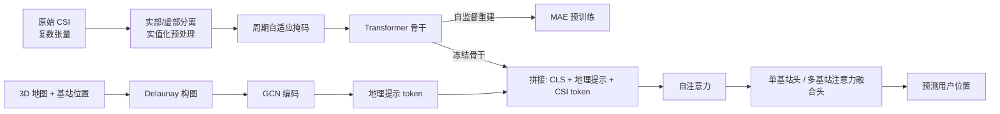

# Map as a Prompt: Learning Multi-Modal Spatial-Signal Foundation Models for Cross-scenario Wireless Localization

**会议**: ICLR 2026  
**OpenReview**: [https://openreview.net/forum?id=0aBAAS0rRT](https://openreview.net/forum?id=0aBAAS0rRT)  
**代码**: 待确认  
**领域**: 无线定位 / 多模态基础模型  
**关键词**: 无线定位, 信道状态信息 (CSI), 自监督预训练, 掩码建模, 提示微调, 3D 地图, 基础模型  

## 一句话总结
提出 **SigMap**：一个把 3D 地图当作"软提示"喂给无线信道基础模型的方法，用周期自适应掩码做自监督预训练、用地图条件化的图神经网络提示做参数高效微调，在跨场景无线定位上实现零样本/少样本的强泛化。

## 研究背景与动机
**领域现状**：无线定位（5G/6G 时代的核心能力，支撑自动驾驶、XR、智能制造）正从传统的基于几何/信号强度的模型方法（ToA/TDoA/AoA/RSS + MUSIC/OMP），走向数据驱动的深度学习，再到近年的基础模型与 LLM 范式（如 LWM、WirelessGPT、WirelessLLM）。

**现有痛点**：传统模型方法假设理想传播条件，在城市多径与非视距 (NLoS) 场景下误差常超过 100 米；监督深度模型（MLP/CNN/LSTM）需要大量标注且跨环境泛化差；现有自监督方法用通用掩码策略，反而让模型钻"周期捷径"（CSI 本身有强周期性，模型靠局部插值就能重建，学不到全局表征）；地图信息即使被引入也只是浅层拼接，没真正利用 3D 空间拓扑关系，且缺乏可解释性。

**核心矛盾**：无线信号既高度依赖环境几何（地图能提供 LoS/NLoS 拓扑约束），又对环境变化极度敏感——如何既学到可迁移的通用信号表征，又能把环境几何作为约束注入、并在换场景时低成本适配，是关键难题。

**本文目标**：构建一个跨场景的无线定位基础模型，做到少标注、强零样本泛化、参数高效适配新环境与新基站配置。

**核心 idea**：**[地图即提示]** 把 3D 地图与基站位置编码成一组可学习的"地理提示 token"前置到冻结的信道 Transformer 输入里，配合 **[周期自适应掩码]** 的自监督预训练破除周期捷径，实现"信号通用表征 + 环境几何约束"的解耦与融合。

## 方法详解

### 整体框架
SigMap 走两阶段范式：先在无标注 CSI 上做自监督预训练学通用信号表征，再用地图条件化的提示微调适配具体定位任务。框架由三块组成——捕获 CSI 长程依赖的 Transformer 骨干、防止周期捷径的周期自适应掩码模块、把环境约束注入的地理提示微调机制；微调时骨干全程冻结，只更新极少量参数。

### 关键设计

**1. 周期自适应掩码 (Cycle-Adaptive Masked Modeling)：让模型学全局表征而非周期捷径。** CSI 沿子载波/天线维度天然带强周期性，普通随机掩码下模型靠局部插值就能重建，学不到有意义的传播表征。SigMap 先对每个样本用行间互相关分析检测出主导周期偏移 $d_{final}$，再生成沿该偏移方向"斜条带"的掩码：$M_{cycle}[i,j]=0$ 当 $|j-(j_0+i\cdot d_{final})|\le w$ 时（被掩），否则为 1，其中 $j_0$ 是起始偏移、$w$ 控制条带宽度。这种与周期对齐的动态掩码恰好打断了可被插值利用的重复结构，逼模型从全局结构去恢复信号。重建目标为标准 MAE 损失 $L_{MAE}=\mathbb{E}_X\|X-f_{\theta_{dec}}(X_{masked})\|^2$。实践中还衍生出 Strip-Mask 与 Grid-Mask 两种解码器分支。

**2. 地理提示微调 (Geographic Prompt Tuning)：把 3D 地图编成软提示注入冻结骨干。** 这是"map-as-prompt"的核心。先把场景的 3D 建筑网格顶点 $\{v_i\}$ 与 $T$ 个基站位置 $\{p_t\}$ 合并为节点集，用 **Delaunay 三角剖分**在 3D 空间里构出邻接边，得到异构图 $G=(V,E)$；顶点与基站位置各经 MLP 编码为初始节点特征，再过两层 GCN 传播：$H^{(l+1)}=\sigma(\tilde{D}^{-\frac12}\tilde{A}\tilde{D}^{-\frac12}H^{(l)}W^{(l)})$（$\tilde{A}=A+I$ 带自环）；全局平均池化后经投影 MLP 得到地理提示 $g_{prompt}\in\mathbb{R}^{D_p}$。该提示被前置进 Transformer 输入序列：$T_{input}=[t_{cls};T_{geo};T_{CSI}]+E_{pos}$，其中 CLS token 与 CSI token 都冻结，只有地理提示 token $T_{geo}=g_{prompt}$ 可训练。自注意力照常用冻结的 $W_Q,W_K,W_V$ 计算，让地理约束通过注意力影响整条序列。微调时只更新 GNN 参数 $\theta_{gnn}$、投影 MLP $\theta_{proj}$ 和任务头 $\theta_{task}$，仅占总参数约 0.4%–0.7%，因而换场景只需重新生成提示即可低成本适配。

**3. 任务自适应头 (Task-Specific Adaptation)：单/多基站两种定位模式。** 单基站时直接从最终 CLS token 经 MLP 回归位置 $\hat{p}_{UE}=MLP_{single}(t_{cls})$。多基站时设计注意力融合：从 $T$ 个基站各取 CLS token，用学习到的注意力函数算权重 $\alpha_t=\frac{\exp(v^T\tanh(W_{attn}t_{cls}^{(t)}))}{\sum_j\exp(v^T\tanh(W_{attn}t_{cls}^{(j)}))}$，再对各基站独立 MLP 头给出的初步估计加权融合 $\hat{p}_{UE}=\sum_{t=1}^T\alpha_t\cdot MLP_{multi}^{(t)}(t_{cls}^{(t)})$。这样信号质量更好、几何关系更有利的基站会获得更高权重，自动利用空间多样性克服 NLoS 限制。

## 实验关键数据

数据集为 DeepMIMO（O1_3p5 城市场景，射线追踪生成），指标为 MAE、RMSE、CDF@1m，结果 5 次独立运行取平均。基线包括 OMP、CNN、SWiT、LWLM。

### 主实验表格

单基站 NLoS 定位（最具挑战场景）：

| 方法 | MAE (m) | RMSE (m) | CDF@1m (%) |
|------|---------|----------|------------|
| **SigMap (w/ map)** | **1.564** | **5.675** | **60.5** |
| SigMap (w/o map) | 2.275 | 8.532 | 31.0 |
| LWLM | 2.382 | 5.822 | 25.3 |
| SWiT | 2.586 | 8.967 | 24.3 |
| CNN | 2.943 | 9.423 | 21.7 |
| OMP | 3.287 | 9.851 | 15.4 |

带地图的 SigMap 比最强基线 LWLM 的 MAE 低 34.4%，CDF@1m 翻倍以上。

多基站（4-BS）协同定位：

| 方法 | MAE (m) | RMSE (m) | CDF@1m (%) |
|------|---------|----------|------------|
| **SigMap (w/ map)** | **0.673** | **1.099** | **84.5** |
| SigMap (w/o map) | 0.789 | 1.285 | 77.5 |
| LWLM | 0.828 | 1.178 | 75.6 |
| SWiT | 1.102 | 1.368 | 68.1 |
| CNN | 1.398 | 1.731 | 59.3 |
| OMP | 1.685 | 2.089 | 50.6 |

### 消融实验表格

掩码策略消融（多基站设置）：

| 掩码策略 | MAE (m) | RMSE (m) | CDF@1m (%) |
|----------|---------|----------|------------|
| 仅 Grid 掩码 | 0.770 | 1.176 | 80.3 |
| 仅 Strip 掩码 | 0.753 | 0.972 | 75.3 |
| **周期自适应掩码** | **0.673** | 1.099 | **84.5** |

地图模态消融（单基站）：

| 地图模态 | MAE (m) | RMSE (m) | CDF@1m (%) |
|----------|---------|----------|------------|
| 3D 网格 | 1.564 | 5.675 | 60.5 |
| 2D 鸟瞰多边形 | 1.692 | 6.128 | 55.7 |
| 无地图 (CSI-only) | 2.275 | 8.532 | 31.0 |

2D 鸟瞰图相比完整 3D 网格仅退化约 8% MAE，说明大部分增益来自拓扑/LoS 线索，提示机制对几何简化鲁棒。

### 关键发现
- **跨环境泛化**：在完全未见的 DeepMIMO O2 与 WAIR-D Scenario-2（100 个真实城市场景）上，仅用约 100 个目标样本微调任务头、冻结骨干，SigMap (w/ map) 达 1.026 m（O2）和 1.880 m（WAIR-D）MAE，比 LWLM 分别好 53.2% 与 44.3%，且只更新 0.4% 参数。
- **参数效率**：预训练可训练参数 11.73M、200 epoch 共 36 小时；微调仅 0.085M（约 0.7%），1000 epoch 仅 30 分钟；推理 0.83 ms/样本。
- **地图增益显著**：单基站场景下"有图 vs 无图"MAE 从 2.275 m 降到 1.564 m，地图提供的几何/LoS 约束是定位精度的关键来源。

## 亮点与洞察
- **"地图即提示"是个漂亮的跨域类比**：把 NLP/视觉里成熟的软提示思想迁移到无线信号，用 GNN 把 3D 几何编码成提示 token，既保持骨干冻结的参数效率，又让环境约束以可解释方式进入注意力——换场景只需重生成提示，这是跨场景泛化的关键工程优势。
- **周期自适应掩码切中无线信号的痛点**：通用掩码在 CSI 上会被周期捷径"作弊"，作者用互相关检测周期并沿周期方向斜掩，直接打断捷径，思路简单却对症。
- **2D 鸟瞰图几乎不掉点**这一发现很实用：现实中拿不到完整 3D 网格时，用低成本 2D 多边形甚至街景照片就能保留大部分增益，给落地留了余地。

## 局限与展望
- **仅在仿真/射线追踪数据上验证**（DeepMIMO、WAIR-D 均为合成），缺乏真实采集 CSI 的验证，sim-to-real gap 未知。
- **依赖较准的 3D 地图与基站位置**：地图缺失或不准时地理提示的有效性会下降，论文也把"用视觉模态（图像/点云）替代或补全地图"列为未来方向。
- **任务范围限于定位**：作者计划扩展到信道估计、波束成形等更通用的无线基础模型任务。
- 单基站 RMSE 仍偏大（5.675 m），说明少数离群预测仍存在，鲁棒性有提升空间。

## 相关工作与启发
- **无线基础模型**：LWM、WirelessGPT 用掩码信道建模学通用表征，SWiT 用对比学习抽不变特征，但都非为定位设计、缺乏任务感知语义；本文专门面向定位并引入地图。
- **SSL 定位**：CrowdBERT、信号引导的 MAE 用掩码重建 RSS/CIR，但常局限于单一配置与单一 SSL 目标；本文用周期自适应掩码提升表征多样性。
- **无线 LLM**：WirelessLLM 用提示工程+RAG 注入领域知识，擅长高层协议推理但在底层信号处理上易幻觉；本文走"软提示注入几何"而非语言提示，更贴合低层信号任务。
- **启发**：用领域结构（这里是 3D 几何拓扑）经图网络编成软提示注入冻结基础模型，是一种通用且参数高效的"结构条件化"范式，可迁移到其他需要把物理/几何约束注入大模型的场景。

## 评分
- **新颖性**: ⭐⭐⭐⭐ "地图即提示" + 周期自适应掩码两个创新都切中无线定位的真实痛点，跨域类比有巧思，虽然各组件（GNN 提示、掩码自监督）本身不新，但组合与问题适配度高。
- **实验充分度**: ⭐⭐⭐ 主实验、两类消融、跨环境零/少样本、参数效率都覆盖了，跨数据集泛化有说服力；但全部基于仿真数据、缺真实 CSI 验证，基线偏少。
- **写作质量**: ⭐⭐⭐⭐ 结构清晰、动机—研究空白—贡献链条紧凑，公式与算法伪代码完整，图示到位。
- **价值**: ⭐⭐⭐⭐ 5G/6G 定位是高价值应用，参数高效 + 强跨场景泛化的范式对实际部署吸引力大，地图条件化提示的思路也有外溢价值。

<!-- RELATED:START -->

## 相关论文

- [\[AAAI 2026\] Backdoor Attacks on Open Vocabulary Object Detectors via Multi-Modal Prompt Tuning](../../AAAI2026/autonomous_driving/backdoor_attacks_on_open_vocabulary_object_detectors_via_multi-modal_prompt_tuni.md)
- [\[ICLR 2026\] Loc²: Interpretable Cross-View Localization via Depth-Lifted Local Feature Matching](loc2_interpretable_cross-view_localization_via_depth-lifted_local_feature_matchi.md)
- [\[ICLR 2026\] AsyncBEV: Cross-modal Flow Alignment in Asynchronous 3D Object Detection](asyncbev_cross-modal_flow_alignment_in_asynchronous_3d_object_detection.md)
- [\[ICML 2026\] TSRBench: A Comprehensive Multi-task Multi-modal Time Series Reasoning Benchmark for Generalist Models](../../ICML2026/autonomous_driving/tsrbench_a_comprehensive_multi-task_multi-modal_time_series_reasoning_benchmark_.md)
- [\[CVPR 2026\] Towards Balanced Multi-Modal Learning in 3D Human Pose Estimation](../../CVPR2026/autonomous_driving/towards_balanced_multi-modal_learning_in_3d_human_pose_estimation.md)

<!-- RELATED:END -->
