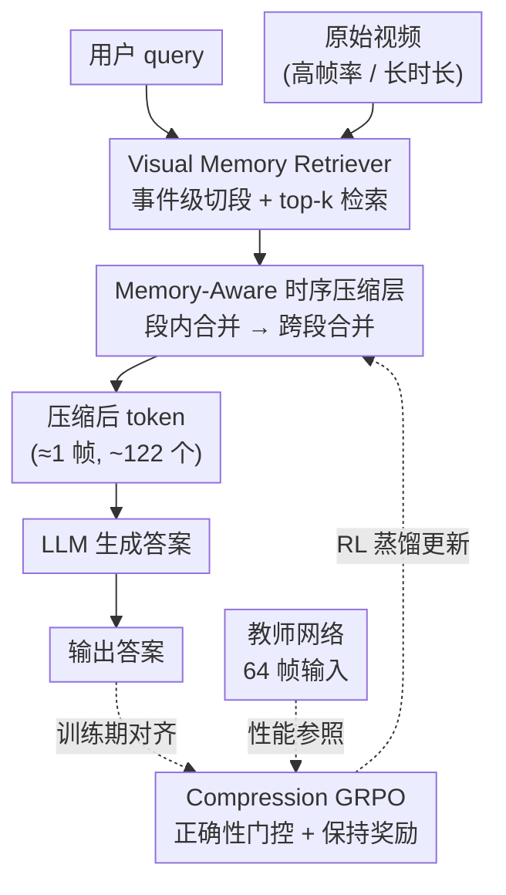

# MARC: Memory-Augmented RL Token Compression for Efficient Video Understanding

**会议**: ICLR 2026  
**arXiv**: [2510.07915](https://arxiv.org/abs/2510.07915)  
**代码**: 有 (Project Web / Code / Model 均提供)  
**领域**: 自动驾驶  
**关键词**: 视频 token 压缩, 强化学习蒸馏, 视觉记忆检索, GRPO, 高效推理  

## 一句话总结

提出 MARC 框架，通过"先检索再压缩"策略——用 Visual Memory Retriever (VMR) 选出与查询最相关的视频片段，再用 Compression GRPO (C-GRPO) 将 64 帧教师模型的推理能力蒸馏到仅用 1 帧 token 的学生模型——实现视觉 token 95% 压缩，GPU 显存降低 72%，推理延迟降低 23.9%，性能几乎无损（42.20 vs 42.21）。

## 研究背景与动机

**视频理解的计算瓶颈**：VLM 从图像扩展到视频后，高帧率和长时长视频带来的 token 数量激增，推理成本急剧上升，严重限制了在自动驾驶、监控等延迟敏感场景的部署。

**现有 token 压缩方法的局限**：主流压缩方法（如 MovieChat、VidCom、ByteVideoLLM）多基于 training-free 的 token 合并策略，在空间或时间维度独立处理冗余信息，不可避免地在压缩过程中丢失关键信息，导致显著性能下降。

**时空冗余的独立处理问题**：现有方法忽略了人类视觉记忆的时序组织和上下文感知特性——认知科学研究表明，人类将连续经验分割为离散事件，通过情景记忆进行回忆和检索。

**极端压缩下的性能保持难题**：将视频压缩到仅相当于单帧 token 数量时，朴素的几何 token 缩减启发式方法难以保持教师模型级别的推理质量。

**缺少训练式压缩方案**：现有方法大多是 training-free 的推理时技巧，缺乏通过学习来优化压缩质量的端到端方案。

**检索与压缩的割裂**：视频检索增强生成（Video-RAG）与 token 压缩通常是割裂的两条技术路线，本文首次将结构化检索与 RL 压缩紧密整合。

## 方法详解

### 整体框架

MARC 要解决的是一个很实际的矛盾：视频 token 一多，VLM 推理就贵，但简单粗暴地砍 token 又会丢关键信息、掉性能。它的思路是「先检索、再压缩」（retrieve then compress）——不去盲目压整段视频，而是先把和问题真正相关的片段挑出来，再在这一小块里做有意义的压缩。

整个流程是这样转的：原始视频先经 **Visual Memory Retriever (VMR)** 切成事件级片段并检索出与 query 最相关的 top-k 片段，这些片段进入 **Memory-Aware Temporal Compression Layer** 做两阶段时序压缩，把帧数压到目标预算，压缩后的少量 token 喂给 LLM；训练阶段则用 **Compression GRPO (C-GRPO)** 以 64 帧输入的教师网络为参照，通过强化学习把推理能力蒸馏进只用 1 帧 token 的学生网络。

### 关键设计

**1. Visual Memory Retriever (VMR)：先把相关片段捞出来，再压缩**

直接压缩整段视频的问题在于：大量与问题无关的冗余会被一起塞进压缩流程，稀释掉真正重要的信息、拉低压缩质量。VMR 的做法借鉴了认知科学的观察——人类并不是把连续经历当成一条无差别的流，而是通过情景记忆把它切成一个个离散事件来回忆和检索。于是 VMR 先用一个深度事件检测网络（Soucek & Lokoc, 2024）识别场景切换、话题转变这类时序边界，把视频切成语义连贯的短片段（而不是固定长度的窗口）；再用嵌入模型（Bolya et al., 2025）把 query 和所有片段映射到同一个高维潜空间，靠对比学习训练出的近邻搜索选出 top-k 个最相关片段（实验里 top-k=3）。这一步等于在压缩前先把搜索空间大幅收窄，让后续压缩只针对真正有用的证据。

**2. Memory-Aware Temporal Compression Layer：顺着事件边界先合冗余最多的相邻帧**

挑出片段后还得把帧数真正压下来，关键是别把重要证据也一起合掉。这一层利用 VMR 给出的事件边界结构，优先在同一事件内部合并高度相似的相邻帧——因为冗余最集中的地方就在同一事件里连续的相似帧。具体分两阶段：阶段 1（段内合并）对每个检索片段，在短期记忆窗口 $m$ 内迭代合并余弦相似度最高的相邻帧对，用均值表示 $\mathbf{H}_{merge} = \frac{1}{2}(\mathbf{H}_a + \mathbf{H}_b)$，一直合到满足压缩比 $\rho$ 对应的帧预算为止；阶段 2（跨段合并）则在段内合并后总帧数仍超过目标 $N_{target}$ 时，再做一次轻量级的全局合并兜底。相似度用 patch 对齐的余弦得分均值来度量：

$$\text{sim}(\mathbf{H}_a, \mathbf{H}_b) = \frac{1}{P}\sum_{p=1}^{P} \frac{\mathbf{h}_a^{(p)} \cdot \mathbf{h}_b^{(p)}}{\|\mathbf{h}_a^{(p)}\| \|\mathbf{h}_b^{(p)}\|}$$

这样压缩是「先合最该合的」，而不是无差别地几何缩减。

**3. Compression GRPO (C-GRPO)：把压缩从几何缩减变成对齐教师的奖励问题**

把视频压到只剩单帧 token 时，靠启发式的几何缩减根本保不住教师级的推理质量。标准 GRPO 又只盯着答案对不对、格式合不合规，并不显式地把学生的表现和教师挂钩。C-GRPO 的改动就是引入一个「保持对齐」的奖励信号，把压缩重新定义成一个对齐问题。它先定义**保持比率** $\eta = a_{comp} / a_{full}$，量化学生到底保住了教师多少性能；再据此给出**压缩奖励** $r_c = \alpha \cdot \max(0, \eta - \tau)$，其中 $\tau$ 是最低可接受的保持率阈值。关键的一步是**正确性门控** $R_i = r_i + \mathbb{1}[\text{correct}] \cdot r_c$——只有语义答对的生成才有资格拿到保持奖励，这样能挡住 reward hacking，避免模型为了凑高 $\eta$ 而放大虚假模式。之后照常做组内优势归一化 $A_i = (R_i - \bar{R}) / \sigma_R$，最终优化一个带 KL 锚的裁剪目标。

### 损失函数 / 训练策略

$$\mathcal{L}_{\text{C-GRPO}} = \mathbb{E}\left[\frac{1}{G}\sum_{i=1}^{G}\left(\text{clip}\left(\frac{\pi_\theta(o_i|q)}{\pi_{\theta_{old}}(o_i|q)}, 1-\epsilon, 1+\epsilon\right) A_i\right) - \beta \text{KL}(\pi_\theta \| \pi_{ref})\right]$$

- **教师网络**：Qwen2.5-VL-3B，64 帧输入
- **学生网络**：同架构，压缩至 1 帧 token（~122 tokens）
- **训练数据**：仅从 Video-R1-260K 中随机采样 5K 样本（含视频和图像）
- **Group size** $G=8$，阈值 $\tau=0.6$
- 图像数据不参与压缩奖励计算，但辅助建立静态场景下的通用推理能力

## 实验关键数据

### 主实验

| 模型 | 帧数 | VSI-Bench | VideoMMMU | MMVU | MVBench | TempCompass | VideoMME | 均值 |
|------|------|-----------|-----------|------|---------|-------------|----------|------|
| Qwen2.5-VL-3B (baseline) | 64 | 32.93 | 35.33 | 48.64 | 44.77 | 38.05 | 53.55 | 42.21 |
| Qwen2.5-VL-3B | 16 | 27.63 | 30.78 | 45.28 | 43.89 | 37.95 | 44.37 | 38.32 |
| InternVL3.5-4B | 64 | 28.96 | 33.33 | 47.51 | 44.71 | 58.34 | 39.15 | 42.00 |
| Gemma-3-4B | 64 | 26.83 | 26.78 | 41.76 | 36.82 | 55.04 | 46.00 | 38.87 |
| ByteVideoLLM-3B | 64 | 21.33 | 22.33 | 28.63 | 22.56 | 35.55 | 22.70 | 25.52 |
| MovieChat-3B | 1 | 25.14 | 25.78 | 39.35 | 37.10 | 38.79 | 26.41 | 32.10 |
| VidCom2-3B | 64 | 25.50 | 23.89 | 31.08 | 29.88 | 35.23 | 21.48 | 27.84 |
| **MARC-3B** | **1** | **27.55** | **33.11** | **51.99** | **45.82** | **55.34** | **39.44** | **42.20** |

**关键数据**：MARC-3B 使用仅 4.71% 的视觉 token（122.69 vs 原始 2589.93），均值 42.20 与 64 帧 baseline 42.21 几乎一致。

### 消融实验

**τ 阈值消融**：

| τ | VSI-Bench | VideoMMMU | MMVU | MVBench | TempCompass | VideoMME | 均值 |
|---|-----------|-----------|------|---------|-------------|----------|------|
| 0.4 | 28.27 | 31.66 | 49.12 | 45.21 | 54.72 | 39.07 | 41.34 |
| **0.6** | **27.55** | **33.11** | **51.99** | **45.82** | **55.34** | **39.44** | **42.20** |
| 0.8 | 28.23 | 31.78 | 49.34 | 45.89 | 54.12 | 39.03 | 41.40 |

**VMR 与训练策略消融**：

| 方法 | 帧数 | 均值 |
|------|------|------|
| Baseline (无 VMR) | 64 | 42.21 |
| Baseline + VMR | 64 | 45.56 |
| SFT | 1 | 38.50 |
| SFT + VMR | 1 | 40.16 |
| **MARC (C-GRPO + VMR)** | **1** | **42.20** |

### 关键发现

1. **极端压缩下性能近乎无损**：95% token 压缩率（64帧→1帧 token），均值性能 42.20 vs 42.21
2. **效率提升显著**：GPU 显存降低 72.4%（41.63GB → 11.48GB），LLM 生成延迟降 23.9%，端到端延迟降 11.1%
3. **VMR 单独即提升性能**：不加压缩时 VMR 将 baseline 从 42.21 提升至 45.56（+7.9%），在 MVBench 上提升高达 27.85%
4. **C-GRPO 显著优于 SFT**：MARC 均值 42.20 vs SFT 38.50（+9.6%）
5. **在部分 benchmark 上超越 baseline**：MMVU、MVBench、TempCompass 三个 benchmark 上 MARC 均超过 64 帧 baseline
6. **超越更大模型**：MARC-3B 均值超过 InternVL3.5-4B（42.20 vs 42.00）和 Gemma-3-4B（42.20 vs 38.87）
7. **τ=0.6 最优**：太低（0.4）约束过松导致保持不足，太高（0.8）信号稀疏限制学习

## 亮点与洞察

- **认知科学启发的检索设计**：VMR 的事件级分割模拟了人类情景记忆的编码与检索机制，比固定窗口或均匀采样更符合视频内容的自然结构
- **将压缩转化为对齐问题**：C-GRPO 的核心洞察是把 token 压缩从几何/启发式操作重新定义为教师-学生对齐问题，利用 RL 的奖励塑形来引导压缩方向
- **正确性门控设计精妙**：只有答对的生成才能获得压缩保持奖励，避免了奖励黑客行为和虚假模式的放大
- **仅用 5K 训练样本**：训练数据极少（从 260K 中采样 5K），表明 C-GRPO 的数据效率极高
- **retrieve-then-compress 范式**：先检索再压缩的流水线设计，让压缩模块不是盲目压缩全视频，而是针对已筛选的关键片段进行有意义的压缩

## 局限与展望

1. **长视频性能损失**：在 VideoMME 上 MARC 仅保留 baseline 74% 性能（39.44 vs 53.55），极端压缩对长视频理解仍有明显代价
2. **仅在 3B 模型上验证**：所有训练实验基于 Qwen2.5-VL-3B，未验证 MARC 在 7B+ 模型上的泛化性
3. **VMR 依赖事件分割质量**：如果事件检测模块误判边界或 query 语义匹配不佳，downstream 压缩质量会受影响
4. **固定 top-k=3**：检索片段数量固定，未探索自适应选择策略
5. **压缩比固定**：ρ 没有按视频复杂度自适应调整，对不同类型视频可能不是最优
6. **端到端训练分离**：VMR 和 C-GRPO 分开训练，未实现完全端到端的联合优化

## 相关工作与启发

- **Video-RAG 方向**：MARC 的 VMR 模块本质上是一种 video corpus retrieval 方案，可以与 Agent-Based 系统（如 VideoAgent）结合
- **GRPO 的可扩展性**：C-GRPO 中的压缩奖励设计思路可推广到其他模态的 token 压缩场景（如 3D 点云、长文档）
- **Token Merging 方法族**：MovieChat 的短期记忆合并是 MARC 时序压缩层的直接前身，MARC 通过 VMR 提供的事件结构显著改进了合并质量
- **知识蒸馏新范式**：传统 KD 用 KL 散度对齐 logits/features，C-GRPO 开创了用 RL 奖励信号进行"行为级"蒸馏的新路径

## 评分

| 维度 | 评分 | 说明 |
|------|------|------|
| 新颖性 | ⭐⭐⭐⭐ | 首次将 RL (GRPO) 应用于视频 token 压缩，retrieve-then-compress 组合新颖 |
| 实验充分度 | ⭐⭐⭐⭐ | 6 个 benchmark、多组对比/消融、效率评估完整；但缺少大模型验证 |
| 写作质量 | ⭐⭐⭐⭐ | 结构清晰，公式推导完整，动机阐述充分 |
| 价值 | ⭐⭐⭐⭐⭐ | 95% 压缩率 + 性能无损，对实际部署价值极高 |

<!-- RELATED:START -->

## 相关论文

- [\[NeurIPS 2025\] StreamForest: Efficient Online Video Understanding with Persistent Event Memory](../../NeurIPS2025/autonomous_driving/streamforest_efficient_online_video_understanding_with_persistent_event_memory.md)
- [\[ICLR 2026\] Low-Latency Neural LiDAR Compression with 2D Context Models](low-latency_neural_lidar_compression_with_2d_context_models.md)
- [\[ICLR 2026\] EgoDex: Learning Dexterous Manipulation from Large-Scale Egocentric Video](egodex_learning_dexterous_manipulation_from_large-scale_egocentric_video.md)
- [\[ICML 2026\] Mitigating Error Accumulation in Continuous Navigation via Memory-Augmented Kalman Filtering](../../ICML2026/autonomous_driving/mitigating_error_accumulation_in_continuous_navigation_via_memory-augmented_kalm.md)
- [\[ICLR 2026\] Plan-R1: Safe and Feasible Trajectory Planning as Language Modeling](plan-r1_safe_and_feasible_trajectory_planning_as_language_modeling.md)

<!-- RELATED:END -->
