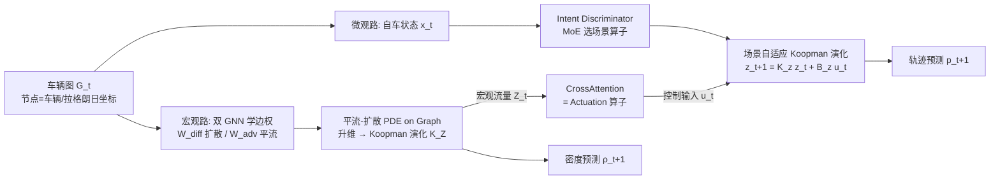

# Micro-Macro Coupled Koopman Modeling on Graph for Traffic Flow Prediction

**会议**: ICLR 2026  
**OpenReview**: [https://openreview.net/forum?id=fhDqFk4DgI](https://openreview.net/forum?id=fhDqFk4DgI)  
**代码**: 论文承诺开源（匿名仓库）  
**领域**: 自动驾驶 / 交通流预测 / 动力系统建模  
**关键词**: Koopman 算子, 车辆轨迹预测, 交通流 PDE, 图神经网络, 微观-宏观耦合, 无历史预测  

## 一句话总结
把"微观车辆轨迹"和"宏观交通流密度"统一升维到 Koopman 线性观测空间，用一张以车辆为节点的拉格朗日动态图离散 LWR 方程，仅靠当前时刻快照（无需历史轨迹）就能做到与依赖历史的 SOTA 相当甚至更优的轨迹预测。

## 研究背景与动机
**领域现状**：交通系统天生是多尺度的——微观层面是单车之间的博弈与交互，宏观层面是车流密度的波动传播，两者非线性地耦合演化。现有方法几乎都只站在一边：微观方法（多智能体交互、因果时序推断）能刻画局部行为和随机事件，但守不住全局流量守恒、车数一多就吃不消；宏观方法用 LWR 这类偏微分方程（PDE）保证守恒律和流量连续性，却对单车级别的扰动事件几乎"失明"。

**现有痛点**：少数试图打通微观-宏观的工作（博弈论框架、运动学极限）要么假设驾驶员同质、要么只在渐近极限下成立，落不了地。更要命的是，主流轨迹预测器（BAT、MS-STGCN 等）都依赖过去 3–8 秒的历史轨迹，这意味着系统必须持续跟踪、存储、做连续目标检测，实时性和工程开销都是负担。

**核心矛盾**：如何在**一个统一、计算可行、物理可解释**的框架里建模微观与宏观之间那条非线性、双向的耦合关系？

**本文目标**：提出 MMCKM（Micro-Macro Coupled Koopman Modeling），在单一 Koopman 架构内联合预测车辆未来轨迹和交通流密度演化，且不依赖任何历史轨迹。

**核心 idea**：**① Koopman 升维线性化**——微观轨迹和宏观流量都能被升到各自的高维观测空间，在那里动力学近似线性，而 Koopman 算子在观测函数时不变时具有马尔可夫性，因此只需当前状态即可外推；**② 拉格朗日车辆图离散**——不再在固定欧氏网格上离散 PDE，而是把车辆本身当成图节点（网格随车流移动），从而保住被网格平均掉的高频微观扰动；**③ 双向耦合**——微观扰动通过 LWR 上新增的扩散项影响宏观流量，宏观流量又通过 Koopman 控制项作为外部输入反作用于单车。

## 方法详解

### 整体框架
MMCKM 把交通环境建成一张以车辆为节点的带权有向图 $G_t=(V_t,E_t,W_t)$，再分宏观、微观两路升维：宏观侧把车流密度演化升到观测空间 $Z$ 做线性 Koopman 演化；微观侧把自车状态升到观测空间 $z$ 做带控制的 Koopman 演化，控制输入由宏观状态经 CrossAttention 注入，形成"微观→宏观（扩散项）、宏观→微观（控制项）"的双向闭环。

### 关键设计

**1. 车辆中心的图上平流-扩散 PDE：把守恒律搬到拉格朗日坐标。** 传统 PDE 在固定欧氏网格里离散，每个格子内的随机行为被平均掉，高频微观扰动彻底丢失。本文转而把车辆当节点、在拉格朗日坐标上离散，得到图上演化 $\dot\rho = -C_{adv}\rho + L_{diff}\rho$，其中平流算子 $C_{adv}=B^\top W_{adv}B$ 是反对称矩阵（描述车流方向传播、能量守恒），扩散算子 $L_{diff}=B^\top W_{diff}B$ 是半正定矩阵（描述周围车辆带来的扰动）。两个边权矩阵 $W_{adv},W_{diff}$ 由两个 GNN 从节点特征学出，并用结构化设计保证物理性质：扩散边初始化为无向且对 $W_{diff}$ 用 Softplus 激活保半正定；平流边重建成与速度场对齐的有向图，再给每条边补一条等权反向边以保证反对称。这样每辆车如何影响流量传播被显式写出来，边权本身就是可解释的车间交互强度。

**2. 统一的无历史 Koopman 建模 + 谱对齐：让 Koopman 算子和图-PDE 算子说同一种语言。** 受投影空间里 $\dot{\hat\rho}=(\mathrm{Diag}(\eta)-j\mathrm{Diag}(\xi))\hat\rho$ 这种线性结构启发，把图特征经 GNN 编码器 $\phi_Z$ 升到观测空间、用可学习矩阵 $K_Z$ 线性演化、再用 MLP 解码回密度。由于真实交通里 $L_{diff}$ 与 $C_{adv}$ 一般不可交换、无法同时对角化，作者不强行假设交换，而是惩罚两者的对易子 $L_{JAD}=\|L_{diff}C_{adv}-C_{adv}L_{diff}\|_F^2$，从而在 Lie-Trotter 算子分裂 $e^{\Delta t(L_{diff}-C_{adv})}\approx e^{\Delta t L_{diff}}e^{-\Delta t C_{adv}}$ 下提升数值稳定性，且全程可微、无需特征分解。进一步设 $\theta=\frac{1}{\Delta t}\log(K)$（主矩阵对数，经实 Schur 形式 + Tikhonov 正则数值稳定地求），用谱对齐损失 $L_{spec}$ 把 $\theta$ 的实部对齐 $L_{diff}$ 的特征值、虚部对齐 $C_{adv}$ 的频率，使 Koopman 动力学与学到的图-PDE 算子在谱层面一致，兼顾稳定与可解释。

**3. 物理引导的多模态微观动力学：用一族小算子 + Intent 门控覆盖驾驶场景。** 驾驶意图是离散且会突变的（自由流、跟车、变道、汇入、紧急），单个 Koopman 算子既要覆盖所有模态又要做特征分解，计算上不可承受。本文构造一族 Koopman 算子，每个由若干 $2\times2$ 复值块和实值对角块拼成，并用三种方式拉开差异：对谱半径设不同上界（反映稳定裕度）、调复块控制项 $\theta$ 调振荡频率、约束最大作动强度 $B_{max}$，使每个算子对应一种驾驶模态。一个用 MoE 实现的 Intent Discriminator 读自车状态 $x_t^e$ 和宏观观测 $Z_t$，作为门控选出最匹配当前场景的算子，其监督标签在预处理时由加速度、车头时距、横向位移等确定性规则自动生成、无需人工标注。宏观流量则通过 Koopman 控制路径 $z_{t+1}=K_z z_t + B_z u_t$ 注入，其中 $u_t=\mathrm{CA}(z_t,Z_t)$ 由 CrossAttention 充当作动算子；为保证输入-状态稳定（ISS），约束 $u_t$ 有界且谱半径 $\kappa(K_z)<1$，从理论上保证误差几何衰减、长时不发散。

## 实验关键数据

### 主实验表格（NGSIM，轨迹 RMSE，越低越好）

| 预测时长 (s) | BAT (含历史) | MS-STGCN (含历史) | Vit-Traj (含历史) | CV (无历史) | Ours 1.0s | Ours 0.1s |
|---|---|---|---|---|---|---|
| 1 | 0.27 | 0.42 | 0.39 | 0.64 | 0.54 | **0.33** |
| 2 | 0.90 | 1.00 | 0.95 | 1.48 | **0.98** | 0.92 |
| 3 | 1.43 | 1.66 | 1.58 | 2.63 | **1.57** | 1.63 |
| 4 | 2.76 | 2.44 | 2.22 | 4.33 | 2.26 | 3.17 |
| 5 | 3.80 | 3.05 | 2.89 | 5.62 | **2.93** | 4.65 |

完全无历史的 MMCKM 在所有时长上都显著优于同为无历史的 CV 基线，并在多个时长上达到甚至超过依赖 3–8 秒历史的 SOTA。

### 算子间隔对比（HighD，ADE）

| 间隔 | 0.04s | 0.1s | 0.2s | 0.4s(*) | 1s |
|---|---|---|---|---|---|
| ADE | 2.84 | 2.06 | 1.88 | **1.65** | 2.90 |

间隔存在"高频保真 vs 数值稳定"的权衡：过小（0.04s）使特征值聚在单位圆附近、病态且需大量迭代放大误差；过大（1s）抓不住高频机动；0.4s 最优。

### 消融实验表格（HighD，间隔 0.2s，轨迹 RMSE）

| 模型 | 1s | 2s | 3s | 4s | 5s |
|---|---|---|---|---|---|
| MMCKM（完整） | **0.29** | **0.60** | **1.21** | **1.72** | **2.73** |
| MMCKM-I（去 Intent） | 0.74 | 1.39 | 1.96 | 2.90 | 3.81 |
| MMCKM-C（去 Koopman 控制） | 0.41 | 1.01 | 1.89 | 2.50 | 3.46 |
| MMCKM-IC（两者都去） | 0.80 | 1.74 | 2.54 | 3.48 | 4.62 |

扩散项消融（NGSIM，宏观密度误差）：完整 LC 在 1–5s 为 3.2%→9.5%，仅平流 C 为 6.1%→14.1%，去掉扩散后误差大幅退化。

### 关键发现
- **Intent Discriminator 主管短时**：1s 提升 29%，但长时随宏观状态独立演化、意图分类精度衰减而收益递减。
- **Koopman 控制主管长时稳定**：5s 误差较 MMCKM-C 降低 37%，是维持双向耦合、约束轨迹落在物理合理流型内的关键。
- **误差随迭代近似线性增长**，区别于循环架构的指数级放大，因此长时段反而可能反超依赖历史的方法。
- **KDE 带宽是把双刃剑**：25m 最优；带宽过小（10m）密度标签被高频噪声主导，$W_{diff}$ 反而放大噪声、扰乱对易子与谱对齐，使 LC 比纯 C 还差——揭示"扩散只有在密度监督携带物理意义的梯度时才有益"。

## 亮点与洞察
- **首次用统一 Koopman 框架联合建模车辆轨迹与交通流密度**，且无需历史轨迹，把"实时单快照预测"做成了可行方案。
- **拉格朗日车辆图离散是真正的物理贡献**，不是简单换坐标系——它保住了欧氏网格必然平均掉的微观高频扰动，并让"扩散项把微观随机性注入宏观 PDE"第一次落地。
- **谱对齐 + 对易子惩罚**把深度学习的 Koopman 矩阵和经典图-PDE 算子在特征值层面绑定，兼顾数值稳定性和可解释性，工程上还规避了特征分解。
- **边权可解释性**：学到的边权直接量化车间交互强度并随驾驶条件动态变化，可供下游规划/控制模块使用，是网格法给不了的。

## 局限与展望
- **密度真值是 KDE 估计的"操作性真值"**，缺乏传感器标定的密度标签，跨论文的宏观密度 SOTA 对比留给未来基准。
- **仅在 NGSIM/HighD 两个高速公路数据集验证**，城市场景下的异质图结构（路口、行人、信号灯）尚未覆盖，作者将其列为未来方向。
- **Intent Discriminator 长时失效**：维持精确意图判别需同步更新所有周围车辆状态，计算上不可行，目前靠 Koopman 控制弥补长时稳定。
- 小算子间隔的数值病态、带宽敏感性都说明该框架对超参（间隔、KDE 带宽）较敏感，落地需仔细调参。

## 相关工作与启发
- **Koopman 算子理论**（DMD、Lusch 等神经参数化、Koopman 控制理论）是方法地基，本文创新在于把它与图-PDE 算子做谱对齐，并用马尔可夫性实现无历史预测。
- **宏观 LWR/PDE 交通流模型**给了守恒律框架，本文用拉格朗日图离散 + 扩散项补上其对微观事件"失明"的短板。
- **微观轨迹预测**（BAT、MS-STGCN、Vit-Traj）代表依赖历史的范式，本文反其道而行证明无历史也能打平甚至反超。
- **启发**：对于任何"多尺度、双向耦合、跨尺度交互缺乏显式数学形式"的系统，"升维线性化 + 把抽象的跨尺度影响建成控制输入"是一条值得借鉴的通用思路。

## 评分
- **新颖性**: ⭐⭐⭐⭐⭐ — 首个统一 Koopman 框架联合建模微观轨迹与宏观流量，拉格朗日车辆图离散 + 谱对齐 + 无历史预测都很有想法。
- **实验充分度**: ⭐⭐⭐ — 两个标准数据集 + 算子间隔/组件/扩散项/带宽多组消融较扎实，但缺城市场景、缺与更多近期 SOTA 的密度对比，密度真值为 KDE 估计而非标定值。
- **写作质量**: ⭐⭐⭐⭐ — 物理动机清晰、公式与设计动机讲得透，图示到位；个别符号与表述略密集。
- **价值**: ⭐⭐⭐⭐ — 无历史 + 实时单快照 + 可解释边权对自动驾驶 ITS 落地很有吸引力，物理可解释性是相对纯数据驱动法的差异化优势。

<!-- RELATED:START -->

## 相关论文

- [\[AAAI 2026\] Meta Dynamic Graph for Traffic Flow Prediction](../../AAAI2026/autonomous_driving/meta_dynamic_graph_for_traffic_flow_prediction.md)
- [\[ICLR 2026\] Plan-R1: Safe and Feasible Trajectory Planning as Language Modeling](plan-r1_safe_and_feasible_trajectory_planning_as_language_modeling.md)
- [\[AAAI 2026\] RAST: A Retrieval Augmented Spatio-Temporal Framework for Traffic Prediction](../../AAAI2026/autonomous_driving/rast_a_retrieval_augmented_spatio-temporal_framework_for_traffic_prediction.md)
- [\[ICLR 2026\] FlowAD: Ego-Scene Interactive Modeling for Autonomous Driving](flowad_ego-scene_interactive_modeling_for_autonomous_driving.md)
- [\[ICLR 2026\] NeMo-map: Neural Implicit Flow Fields for Spatio-Temporal Motion Mapping](nemo-map_neural_implicit_flow_fields_for_spatio-temporal_motion_mapping.md)

<!-- RELATED:END -->
