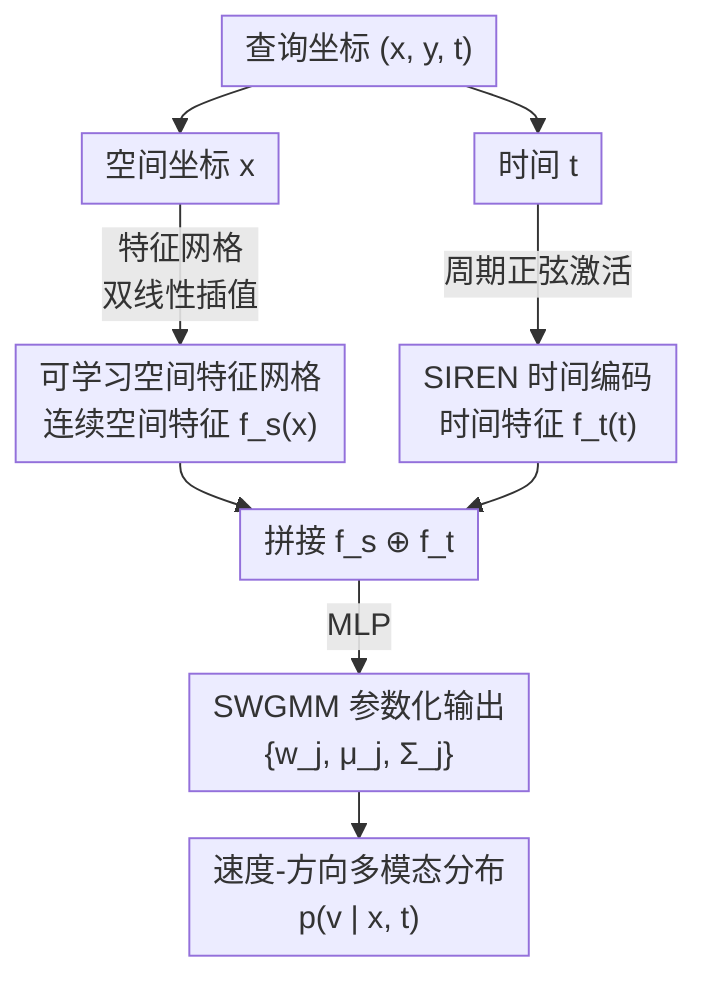

# NeMo-map: Neural Implicit Flow Fields for Spatio-Temporal Motion Mapping

**会议**: ICLR 2026  
**arXiv**: [2510.14827](https://arxiv.org/abs/2510.14827)  
**代码**: 无  
**领域**: 自动驾驶  
**关键词**: 动态地图, 神经隐式表示, 半包裹高斯混合, 人类运动模式, 时空连续  

## 一句话总结
提出 NeMo-map——基于神经隐式函数的连续时空动态地图，将空间-时间坐标直接映射为半包裹高斯混合模型（SWGMM）参数，消除传统方法的空间离散化和时间分段限制，在真实行人追踪数据上实现更低 NLL 和更平滑的速度分布。

## 研究背景与动机

**领域现状**：动态地图（MoD）通过编码环境中的统计运动模式帮助机器人在拥挤场景中导航。现有方法如 CLiFF-map 和 STeF-map 在离散网格上拟合局部运动分布。

**现有痛点**：网格离散化导致信息丢失和边界不连续；时间通常按小时分段，无法建模跨时段的平滑过渡；手动选择网格分辨率依赖环境。

**核心矛盾**：离散表示无法在任意空间-时间坐标上查询运动分布，且稀疏区域需要插值或填充。

**本文目标**：(a) 消除空间离散化；(b) 实现空间和时间的连续平滑查询；(c) 保持运动方向的多模态特性。

**切入角度**：用神经隐式表示将 $(x, y, t) \to$ SWGMM 参数的映射建模为连续函数。

**核心 idea**：用可学习空间特征网格 + SIREN 时间编码 + MLP 直接输出连续时空运动分布参数。

## 方法详解

### 整体框架

这篇论文要解决的是动态地图（MoD）被网格和时段切碎的问题：传统方法把环境拆成离散网格、把一天分成若干时段，分别拟合局部运动分布，结果是边界不连续、稀疏区域要靠插值、还得手调网格分辨率。NeMo-map 的思路是把整张动态地图当成一个连续函数 $\Phi_\theta:(\mathbf{x}, t) \to$ SWGMM 参数来学，任意时空坐标都能直接查询。

整条管线这样转：查询坐标 $(\mathbf{x}, t)$ 进来后，空间分量 $\mathbf{x}$ 在一张可学习特征网格上做双线性插值，取出连续的空间特征 $\mathbf{f}_s(\mathbf{x})$；时间分量 $t$ 经过一个 SIREN 网络编码成 $\mathbf{f}_t(t)$；两段特征拼接后送进 MLP，输出 $J$ 组半包裹高斯混合（SWGMM）参数 $\{w_j, \bm{\mu}_j, \bm{\Sigma}_j\}$，描述该时空点上速度-方向的多模态分布。

### 关键设计

**1. 可学习空间特征网格：让空间连续又不丢局部细节**

直接把坐标 $\mathbf{x}$ 喂给 MLP，很难表达局部运动模式的剧烈变化；而离散网格虽然能存局部信息，却在边界处断裂。NeMo-map 折中地维护一张特征网格 $\mathbf{G}_s \in \mathbb{R}^{H \times W \times C_s}$，在查询位置 $\mathbf{x}$ 处对相邻格点特征做双线性插值，得到连续的空间特征 $\mathbf{f}_s(\mathbf{x})$。网格保留了"每个区域有自己的运动特征"这种局部性，双线性插值则保证了跨格点的平滑过渡——既比纯坐标 MLP 更能捕捉局部差异，又消除了硬网格的边界不连续。

**2. SIREN 时间编码：用周期激活对齐运动的日周期性**

人流的运动模式天然带有一天之内的周期规律（早晚高峰、午休等），传统方法按小时把时间切成离散段，跨段之间没有平滑过渡。NeMo-map 把连续时间 $t$ 送进一个以周期性正弦函数为激活的 SIREN 网络编码成 $\mathbf{f}_t(t)$。正弦激活本身就是周期函数，与"一天内运动模式循环往复"这一先验高度契合，因此能在任意时刻连续查询，而不再受时段切分的束缚。

**3. SWGMM 参数化输出：建模速度-方向的多模态联合分布**

行人在同一位置可能朝多个方向行进，且速度和方向相互关联，所以输出不能是单峰分布。MLP 为每个混合分量输出权重、均值与协方差，建模速度 $\rho$ 和方向 $\theta$ 的**联合**分布；方向维度按 $2\pi$ 周期"半包裹"处理，引入卷绕数（winding number）$k \in \{-1,0,1\}$ 来正确表达环形拓扑。这样既比 STeF-map 用离散方向直方图（如 8-bin）更精细、还顺带建模了速度，又比 VMGMM 假设速度与方向独立更灵活——速度-方向相关性被显式保留下来。

### 损失函数 / 训练策略

训练用负对数似然，让网络预测的 SWGMM 分布尽量贴合观测到的速度向量 $\mathbf{v}_i$：

$$\mathcal{L}(\theta) = -\frac{1}{N}\sum_i \log p(\mathbf{v}_i \mid \Phi_\theta(\mathbf{x}_i, t_i))$$

整套是端到端训练，全天数据训练不到 20 分钟。

## 实验关键数据

### 主实验（ATC 购物中心数据集 NLL↓）

| 方法 | NLL↓ | vs NeMo NLL增量 |
|------|------|-----------------|
| **NeMo-map** | **0.775** | — |
| Online CLiFF-map | 1.527 | +0.752 |
| CLiFF-map | 1.964 | +1.189 |
| STeF-map | 5.576 | +4.801 |

### ETH/UCY 数据集对比

| 场景 | NeMo NLL | CLiFF NLL | 提升 |
|------|----------|-----------|------|
| ETH | -0.384 | 0.112 | +0.496 |
| HOTEL | -0.838 | 0.701 | +1.539 |
| UNIV | 0.404 | 0.518 | +0.114 |
| ZARA | -0.342 | 0.068 | +0.410 |

训练效率：NeMo-map 全天数据训练不到 20 分钟。

### 关键发现
- NeMo 在所有数据集和场景上均显著优于基线（p<0.001）
- 在稀疏区域 NeMo 产生更平滑的速度分布，避免了离散方法的不连续性
- 模型在轨迹预测下游任务中也表现更好

## 亮点与洞察
- **连续时空查询**的能力消除了 MoD 的核心限制：不再需要预定义网格分辨率，不再有时间分段的不连续性。
- SWGMM 的圆柱体可视化（方向包裹在圆上，速度沿圆柱轴）非常直观，有助于理解多模态运动模式。

## 局限与展望
- 仅在行人场景验证，未测试车辆或自行车等其他动态物体
- 可学习空间网格的分辨率仍需手动设定
- 未与基于深度学习的轨迹预测模型进行全面对比

## 相关工作与启发
- **vs CLiFF-map**: CLiFF 离散化空间+离线批处理，NeMo 连续空间+端到端训练
- **vs STeF-map**: STeF 离散化方向（8-bin）且不建模速度，NeMo 连续方向+速度联合建模

## 评分
- 新颖性: ⭐⭐⭐⭐ 将神经隐式表示引入动态地图是自然但有效的创新
- 实验充分度: ⭐⭐⭐ 两个数据集，有统计显著性检验，但场景类型有限
- 写作质量: ⭐⭐⭐⭐ 清晰简洁，SWGMM 的数学描述严谨
- 价值: ⭐⭐⭐⭐ 对机器人导航中的运动建模有实用贡献

<!-- RELATED:START -->

## 相关论文

- [\[AAAI 2026\] I-INR: Iterative Implicit Neural Representations](../../AAAI2026/autonomous_driving/i-inr_iterative_implicit_neural_representations.md)
- [\[ICLR 2026\] UniSplat: Unified Spatio-Temporal Fusion via 3D Latent Scaffolds for Dynamic Driving Scene Reconstruction](unisplat_unified_spatio-temporal_fusion_via_3d_latent_scaffolds_for_dynamic_driv.md)
- [\[CVPR 2026\] SG-NLF: Spectral-Geometric Neural Fields for Pose-Free LiDAR View Synthesis](../../CVPR2026/autonomous_driving/sgnlf_spectralgeometric_neural_fields_for_posefre.md)
- [\[AAAI 2026\] Rethinking the Spatio-Temporal Alignment of End-to-End 3D Perception](../../AAAI2026/autonomous_driving/rethinking_the_spatio-temporal_alignment_of_end-to-end_3d_perception.md)
- [\[ICLR 2026\] Low-Latency Neural LiDAR Compression with 2D Context Models](low-latency_neural_lidar_compression_with_2d_context_models.md)

<!-- RELATED:END -->
