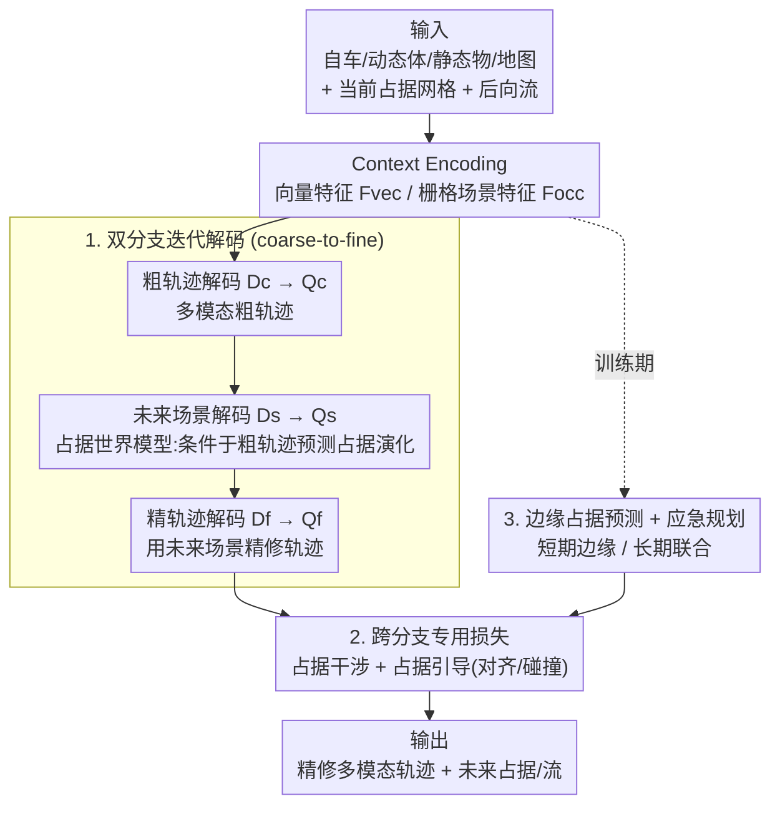

# OccDriver: Future Occupancy Guided Dual-branch Trajectory Planner in Autonomous Driving

**会议**: ICLR 2026  
**OpenReview**: [https://openreview.net/forum?id=abJCjkIwi5](https://openreview.net/forum?id=abJCjkIwi5)  
**代码**: 待确认  
**领域**: 自动驾驶 / 轨迹规划  
**关键词**: 轨迹规划, 占据预测, 世界模型, 双分支, 应急规划(contingency planning)

## 一句话总结
OccDriver 用一个「向量化分支出粗轨迹 → 栅格化分支以占据流(occupancy flow)预测每条粗轨迹引发的未来场景演化 → 向量化分支据此精修轨迹」的双分支 coarse-to-fine 框架，把占据空间当成 2D 世界模型来引导规划，并配上一套跨分支损失与应急规划策略，在 nuPlan 闭环 benchmark 上取得 SOTA。

## 研究背景与动机
**领域现状**：模仿学习的轨迹规划主要分两种表征范式。栅格化(rasterized)方法把场景投到 BEV 网格上、预测时空占据，天然抗遮挡、能给出联合未来状态的概率视角；向量化(vectorized)方法用向量+DETR 风格 query 解码多模态轨迹，个体语义精细、轨迹精度高。

**现有痛点**：栅格化离散化会丢失个体细节和几何精度；向量化则倾向于把未来交互过度简化，需要大量手工特征工程去逼近不确定性。更关键的是，绝大多数规划方法是「forward-only」——一口气把轨迹解码出来，没有在 rollout 变差时纠错的能力，因此往往要外挂一个很强的轨迹打分模块来兜底。

**核心矛盾**：场景级联合建模（概率、抗遮挡）与个体级精细建模（高精度轨迹）之间存在表征 trade-off，单一范式只能拿一头；同时，规划缺乏对「我这么开会让未来场景怎么变」的显式预判。

**本文目标**：(1) 同时保留栅格联合建模的概率优势和向量表征的个体保真度；(2) 让规划显式利用「未来场景演化」作为引导，而不是盲目 forward。

**切入角度**：世界模型的思路——先预测自车行为带来的后果，再据此做更明智的决策。作者把这个思路落到占据空间：让栅格分支扮演一个「2D 占据世界模型」，对每条候选粗轨迹预测它会诱发的未来占据/流，再把这份交互先验蒸馏回向量分支去精修轨迹。

**核心 idea**：栅格-向量双分支 + coarse-to-fine——向量分支先出粗轨迹，栅格分支条件于粗轨迹预测未来占据演化，再用这份未来场景信息精修出 scene-consistent 的轨迹。

## 方法详解

### 整体框架
OccDriver 的输入 $X$ 包含自车 $E$、动态体 $A$ 的历史状态、静态物 $S$ 和高精地图 $M$；同时把当前帧投影成占据网格 $\{O_e^0, O_a^0, O_m\}$ 与后向流 $FL^0$ 作为栅格分支输入 $X_{occ}$。输出是 $M$ 模态的自车未来轨迹 $Y=\{(y_i,\pi_i)\}$ 以及对应的多模态未来占据/流 $Y_{occ}$，整体写成 $Y, Y_{occ}=f(X,X_{occ}\,|\,\theta)$。

整条 pipeline 分三大块：**Context Encoding** 把异构输入分别编码成向量个体特征 $F_{vec}$ 和栅格联合场景特征 $F_{occ}$；**双分支迭代解码结构**用三个串行解码器把粗轨迹、未来占据、精轨迹依次解出来，构成 coarse-to-fine；**边缘占据分布预测**额外预测单个交互体的短期边缘占据，给应急规划打基础。三者通过一组专用损失把占据分支的空间信息显式注入轨迹分支。

### 关键设计

**1. 双分支迭代解码：粗轨迹→占据世界模型→精轨迹的 coarse-to-fine 闭环**

这是为了解决「forward-only 规划无纠错能力 + 单一表征拿不全概率与精度」的痛点。框架保留向量特征 $F_{vec}$ 和占据特征 $F_{occ}$ 两路，用三个串行解码器迭代解码：

$$Q_c = D_c(Q=Q_{vec},\,K,V=F_{occ},\{F_S,F_M\})$$
$$Q_s = D_s(Q=F_{occ},\,K,V=Q_c,\{F_S,F_M\})$$
$$Q_f = D_f(Q=Q_c,\,K,V=Q_s,\{F_S,F_M\})$$

粗轨迹解码器 $D_c$ 先在每个模态内做自注意力抽取多体社交交互，再交叉注意力融入静态障碍/地图 $\{F_S,F_M\}$，最后 query $F_{occ}$ 建立空间场景理解，得到多模态粗轨迹 query $Q_c$。未来场景解码器 $D_s$ 是关键——它扮演 BEV 视角下的世界模型，以 $F_{occ}$ 为 query、$Q_c$ 为 key/value，把「条件于自车粗轨迹会发生什么场景演化」解码进 $Q_s$。精轨迹解码器 $D_f$ 和 $D_c$ 结构相同，只是第三次交叉注意力的 key/value 换成携带未来场景演化先验的 $Q_s$，从而把 $Q_c$ 精修成 future-informed 的 $Q_f$。这样规划不再是一口气盲解，而是「先预判后果、再据后果纠正」，是这套方法的骨架。自车和周边体的未来轨迹联合解码，以保证场景演化的一致性；预测头还把未来占据解耦成自车 $O_e$ 和周边体 $O_a$，方便后续损失分别监督。

**2. 跨分支专用损失：把占据空间的交互/安全先验显式注入轨迹**

光靠特征交叉注意力，占据与轨迹两个分支的预测未必一致，信息传递不充分。作者设计两类损失桥接。其一是**占据干涉损失(occupancy interference loss)**：自车与他车的占据区域天然互斥，于是用预测占据落在对手 GT 占据区域内的平均值衡量空间干涉程度，$L_{oe}=\mathrm{sum}(O_e^*\cdot O_a^{gt})/\mathrm{sum}(O_a^{gt})$、$L_{oa}$ 对称，$L_{oi}=L_{oe}+L_{oa}$，训练时配 teacher-forcing 保稳定，本质是「让自车在占据空间里做规划」，提升交互感知。其二是**占据引导损失(occupancy guidance loss)**，把自车按形状离散成 $N_v$ 个圆心来近似车身，再在占据网格上做坐标投影+双线性插值：对齐项 $L_{align}=\frac{1}{T_f}\sum_t\sum_i \max(0,\varepsilon-O_i^t)$ 罚那些落在自车低占据区的轨迹点，让轨迹待在自己的高占据区内；碰撞项 $L_{collision}=\frac{1}{T_f}\sum_t\sum_i \max(0,\eta-d_i^t)$ 在轨迹点到他车高占据区的最小距离 $d_i^t$ 小于安全裕度 $\eta$ 时施罚，把轨迹推离他车高概率占据区。最终 $L_{og}=w_1 L_{align}+w_2 L_{collision}$。相比把占据当辅助任务，这套损失直接把 BEV 空间先验「翻译」成对轨迹的显式约束，保证两分支信息有效互传。

**3. 边缘占据预测 + 应急规划：用占据概率建模行为不确定性，安全不牺牲效率**

只建模联合占据无法刻画单个 agent 短期突发行为的不确定性。作者额外加一个**边缘占据编码器**：场景特征图 $F_s$ 只对单个 agent 的向量特征做注意力（而非整张 $F_{vec}$），得到该 agent 的边缘行为特征 $F_{m,i}$，不做模态分解直接预测其 $T_s$（$T_s<T_f$）短期边缘占据 $O_{m,i}$。为省算力，用规则法剪枝（future bbox 与自车未来路径相交的才保留），且该模块仅训练期使用。在此之上做**应急规划**：传统 contingency planning 把轨迹拆成短期安全段+分叉长期段、要构建并剪枝场景树、组合复杂度爆炸还把意图退化成确定性近似；OccDriver 改在稠密概率占据空间里做——计算 $L_{collision}$ 前，先对短期 $t\le T_s$ 用逐元素 max 把边缘占据并入他车联合占据：

$$\tilde{O}_a^{*}=\begin{cases}\max\big(O_a^{t*},\ \max_{i=1}^{N_m} O_{m,i}^t\big), & t\le T_s\\[4pt] O_a^{t*}, & t>T_s\end{cases}$$

于是短期上自车会对 agent 行为不确定性引发的突发风险更敏感（取联合与边缘的较大值，偏保守避险），长期上仍按模态一致的联合占据规划、保持 scene-compliance 不过度保守。这样把场景树式应急规划重写成占据空间里的概率运算，既避开组合爆炸，又保住了轨迹级多模态。

### 损失函数 / 训练策略
总损失为 $L = L_{traj} + L_{occ} + L_{oi} + L_{og}$，分别是轨迹规划损失、占据/流预测损失、占据干涉损失、占据引导损失，全部可微、端到端训练。除粗轨迹外，模型还从 $Q_c$ 解一条粗轨迹 $Y_c$ 提供合理 raw behavior 监督。

## 实验关键数据

### 主实验
nuPlan，1M 帧训练（2s 历史 / 8s 预测），闭环评测非反应式(NR-S)与反应式(R-S)分数，无后处理。

| benchmark | 指标 | OccDriver | 之前最好 | 说明 |
|--------|------|------|----------|------|
| Val14 | NR-S | **0.896** | 0.899 (DiffusionPlanner) / 0.890 (PLUTO) | 学习类 SOTA 级，反应式更优 |
| Val14 | R-S | **0.838** | 0.837 (BeTopNet) | 反应式闭环 SOTA |
| Val14 | Collisions | **0.971** | 0.966 (BeTopNet) | 安全性最佳 |
| Val14 | TTC | **0.938** | 0.933 (PLUTO) | 安全性最佳 |
| Test14-Hard | NR-S | **0.794** | 0.787 (PLUTO) | 困难场景 SOTA |
| Test14-Hard | R-S | **0.759** | 0.753 (PLUTO) | 比 BeTopNet +10.3% |

在 Test14-Hard 上，OccDriver 推理 23.03 ms，比 BeTopNet(70 ms)、DiffusionPlanner(40 ms) 都快，安全与 Progress 的权衡也更好——显式空间占据比隐式拓扑结构(BeTopNet)给出更细粒度、更直观的交互关系，避免过度保守。

### 消融实验
Val14 上逐组件累加（MP=边缘预测, CP=应急规划）：

| 配置 | Collisions | NR-S | R-S | 说明 |
|------|---------|------|------|------|
| 基础双分支 | 0.933 | 0.859 | 0.787 | 无 MP，已近 SOTA |
| + MP | 0.938 | 0.863 | 0.800 | 边缘占据建模个体行为/短期不确定性 |
| + $L_{oi}$ | 0.943 | 0.864 | 0.807 | 占据干涉，提升碰撞与 Comfort |
| + $L_{collision}$ | 0.960 | 0.879 | 0.825 | 碰撞惩罚，安全大涨 |
| + $L_{align}$ | 0.960 | 0.885 | 0.830 | 对齐项提升 Progress |
| + CP（完整） | **0.971** | **0.896** | **0.838** | 应急规划，安全分数登顶 |

### 关键发现
- **$L_{collision}$ 贡献最大**：加入后 Collisions 0.943→0.960、TTC 0.914→0.931，显式碰撞/接近惩罚是安全性的主力。
- **占据引导 horizon $T$ 有甜区**：$L_{og}$ 中联合占据预测 horizon 从 2s 增到 6s 持续涨分（NR-S 在 6s 达 0.845），8s 反而退化——长期占据能捕捉场景动态，但 horizon 过长时未来占据不确定性增大反噬。
- **高占据阈值 $\zeta$ 在 0.7 最佳**：$L_{collision}$ 里 $\zeta=0.7$ 时 NR-S/R-S 最高(0.845/0.801)。
- **应急规划以微小 Progress 代价换安全**：CP 让模型对相关 agent 潜在边缘行为偏谨慎，安全与驾驶分数登顶、Progress 略降。

## 亮点与洞察
- **把世界模型落到占据空间、且做成「条件于候选轨迹」的解码**：未来场景解码器 $D_s$ 不是泛泛预测未来，而是对每条粗轨迹预测它引发的占据演化，再蒸馏回轨迹精修——这是「先想后果再纠正」的 coarse-to-fine，比 forward-only 规划多了纠错回路，思路可迁移到任何「候选-评估-精修」式决策。
- **应急规划改写成占据空间的逐元素 max**：传统 contingency 要建场景树、组合爆炸；这里用短期边缘占据与联合占据取 max 一步搞定，既保住多模态又避开剪枝复杂度，是很巧的工程化重写。
- **占据/轨迹双向一致性靠显式损失而非纯特征融合**：对齐项把轨迹拉进自车高占据区、碰撞项推离他车高占据区，把 BEV 概率先验直接翻译成轨迹约束，可复用到其他「稠密预测引导稀疏决策」的任务。

## 局限与展望
- 边缘占据预测仅在训练期使用、依赖规则法剪枝（future bbox 与自车路径相交），剪枝的归纳偏置可能漏掉非相交但高风险的 agent。
- 占据引导 horizon 超过 6s 即退化，说明长程占据不确定性仍是瓶颈，方法对预测 horizon 较敏感。
- 评测集中在 nuPlan 闭环 benchmark，未见真实车端部署或更多样数据集的泛化验证；占据分支额外的栅格计算相比纯向量方法仍有开销（虽快于扩散/拓扑类）。

## 相关工作与启发
- **vs 栅格化方法（RasterModel 等）**：它们只在时空网格上建联合动态、丢个体细节；OccDriver 保留栅格的概率联合建模，又用向量分支补回个体保真度。
- **vs 向量化方法（PLUTO）**：纯向量方法 forward-only、过度简化未来交互；OccDriver 加占据分支显式预测未来场景作引导，Test14-Hard 上安全与 Progress 双双超越。
- **vs 拓扑引导（BeTopNet）**：BeTopNet 用拓扑连接隐式建模交互、Progress 退化严重；OccDriver 用显式空间占据给出更细粒度交互关系，R-S +10.3% 且不过度保守。
- **vs 扩散类（DiffusionPlanner）**：去噪范式推理慢(40 ms)，OccDriver 23 ms 更适合实车部署，驾驶分数也更高。

## 评分
- 新颖性: ⭐⭐⭐⭐ 把占据世界模型条件于候选轨迹、并在占据空间重写应急规划，组合新颖
- 实验充分度: ⭐⭐⭐⭐ nuPlan Val14 + Test14-Hard 双 benchmark + 逐组件消融 + horizon/阈值分析，较扎实
- 写作质量: ⭐⭐⭐⭐ 框架与损失叙述清晰，公式完整
- 价值: ⭐⭐⭐⭐ 闭环 SOTA 且推理快于扩散/拓扑类，对实车规划有参考价值

<!-- RELATED:START -->

## 相关论文

- [\[AAAI 2026\] Dual-branch Spatial-Temporal Self-supervised Representation for Enhanced Road Network Learning](../../AAAI2026/autonomous_driving/dual-branch_spatial-temporal_self-supervised_representation_for_enhanced_road_ne.md)
- [\[CVPR 2026\] DLWM: Dual Latent World Models enable Holistic Gaussian-centric Pre-training in Autonomous Driving](../../CVPR2026/autonomous_driving/dlwm_dual_latent_world_models_enable_holistic_gaussian-centric_pre-training_in_a.md)
- [\[ICLR 2026\] BridgeDrive: Diffusion Bridge Policy for Closed-Loop Trajectory Planning in Autonomous Driving](bridgedrive_diffusion_bridge_policy_for_closed-loop_trajectory_planning_in_auton.md)
- [\[CVPR 2026\] Dr.Occ: Depth- and Region-Guided 3D Occupancy from Surround-View Cameras for Autonomous Driving](../../CVPR2026/autonomous_driving/drocc_depth_region_guided_3d_occupancy.md)
- [\[ECCV 2024\] OccWorld: Learning a 3D Occupancy World Model for Autonomous Driving](../../ECCV2024/autonomous_driving/occworld_learning_a_3d_occupancy_world_model_for_autonomous_driving.md)

<!-- RELATED:END -->
