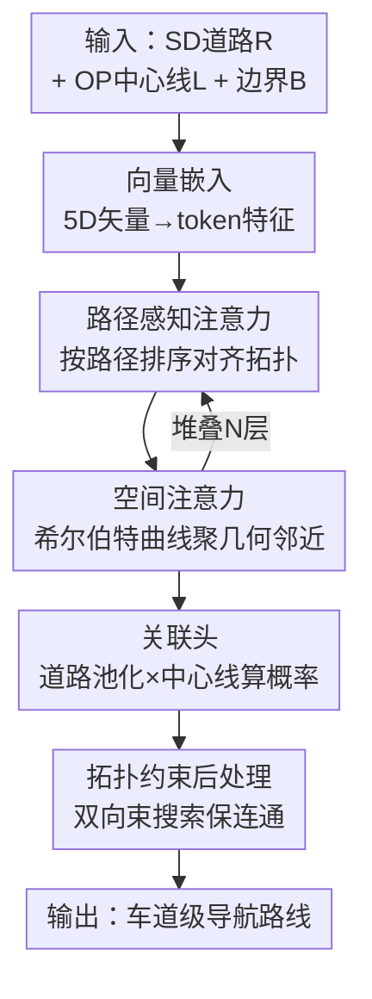

# Online Navigation Refinement: Achieving Lane-Level Guidance by Associating Standard-Definition and Online Perception Maps

**会议**: ICLR 2026  
**OpenReview**: [https://openreview.net/forum?id=epbzV3FLcI](https://openreview.net/forum?id=epbzV3FLcI)  
**代码**: https://github.com/WallelWan/OMA-MAT  
**领域**: 自动驾驶 / 高精地图 / 车道级导航  
**关键词**: 车道级导航, SD地图, 在线感知地图, 地图关联, Transformer

## 一句话总结
本文提出"在线导航精化"(ONR)这一新任务——把基于 SD 地图的道路级路线精化成车道级导航，做法是用一个带路径感知注意力与空间注意力的轻量 Transformer(MAT)，把异构的 SD 地图与车端在线感知地图做"图到图"关联，在自建的 OMA 数据集上以 34ms 延迟超过所有地图匹配基线。

## 研究背景与动机

**领域现状**：车道级导航能给出比道路级导航更细的引导（告诉你"走左边那条车道"而不只是"走这条路"），是 GIS 与自动驾驶导航的关键能力。但今天的车道级导航主要依赖预先离线建好的 HD（高精）地图。

**现有痛点**：HD 地图建图、维护成本高昂，而且更新慢——施工、改道、事故这些真实世界的变化往往没被及时反映，导致导航过期甚至带来安全风险。另一条路线是车端"在线感知地图"(OP map)：靠车载传感器实时生成局部车道几何，新鲜且本地化，但它**只有局部几何、没有全局路网拓扑**，单靠它无法回答"我要走的那条路对应眼前哪条车道"。

**核心矛盾**：SD 地图有全局拓扑但只到道路级、OP 地图有车道级几何但没有全局拓扑，二者**异构且不是一一对应**——一条道路上往往对应多条车道（多对一）。直接把 SD 路径硬贴到 OP 地图上（或反过来），会忽略二者的语义差异。再加上 GPS 漂移、尺度变化带来的空间抖动，以及 OP 地图本身的断裂/漏检/错误噪声，传统的地图匹配(map matching, MM)直接失效。

**本文目标**：(1) 定义并形式化 ONR 任务；(2) 提供第一个带车道-道路对应标注的数据集与评测指标；(3) 设计一个实时、抗噪、能处理多对一的关联模型。

**切入角度**：作者主张不要做 MM 式的"轨迹到地图"匹配，而是改成"**地图到地图**"的关联范式(map association)——把每条 centerline 分类到它所属的那条 road。这样天然支持多对一，也能把空间和拓扑两类约束分开建模。

**核心 idea**：用一个 Transformer 把"道路-车道关联"建成一个多对一分类问题，靠**路径感知注意力**对齐拓扑、靠**空间注意力**融合噪声几何，再用拓扑约束后处理保证路网连通一致。

## 方法详解

### 整体框架

MAT(Map Association Transformer) 的输入是三类矢量化元素：SD 地图里的道路 R、OP 地图里的 centerline L、以及道路边界 B。每个矢量 $\vec{v}_i=[p^x_{i1},p^y_{i1},p^x_{i2},p^y_{i2},\theta_i]$ 由起止两点和朝向 $\theta_i$ 参数化。任务被形式化为学一个映射 $f:\mathcal{L}\to\mathcal{R}$，把每条 centerline 唯一地分到一条 road（唯一性约束），而一条 road 可对应多条 centerline（多重性约束）——即一个类数等于道路数 $|R|$ 的多对一分类问题。

流程是：所有矢量先过一个两层 MLP 的向量嵌入，得到道路/中心线/边界三组 token 特征；然后送进 $N$ 个堆叠的 MAT block，每个 block 串联**空间注意力(SA)**、**路径感知注意力(PA)** 和 FFN，交替地把"几何邻近"和"拓扑连通"两类上下文注入 token；最后**关联头**把同一条 road 的所有 token 池化成一个代表特征，与每个 centerline token 算注意力相似度得到关联概率分布；再用**拓扑约束后处理**把概率解码成满足路网连通性的最终车道路径。形成关联后，SD 地图上的任意一条路线，只需一次拓扑排序就能定位到 OP 地图上所有对应车道路径。

### 关键设计

**1. 路径感知注意力：用拓扑顺序当归纳偏置，让分组注意力只看拓扑相关的邻居**

为了实时推理，框架用**分组注意力(Group Attention)** 把复杂度从 $O(N^2)$ 降到线性 $O(N)$——只在局部窗口内做注意力。但分组注意力好不好用，强烈依赖 token 排列顺序是否语义合理：随机排序会把图打碎成互不相关的段。PA 的做法是把**拓扑顺序**当作显式归纳偏置：从根节点到叶节点构造出所有有效路径，按路径索引重排 token，使拓扑上相邻的前驱/后继节点在序列里也相邻；这样窗口大小为 $k$ 的分组注意力就只聚焦在拓扑相关的邻居上。完成后再把 token 还原回原始顺序，对出现在多条路径里的 token 取特征平均。这一步专治"空间抖动 + 语义差异"——即使 SD 与 OP 之间有空间偏移，沿路径的连通关系仍被保留。

**2. 空间注意力：用空间填充曲线序列化，把几何邻近但拓扑不相连的元素聚到一起**

PA 抓住了拓扑连通性，却会漏掉那些**几何上相邻、拓扑上却不相连**的片段（如平行车道、断开的道路边界）。SA 来补这一块：它不按图连通性排，而是用**向量序列化(Vector Serialization)** 按几何邻近聚类 token。具体三步——先把每个矢量离散成 3D 坐标 $(x,y,r)$（量化的网格位置 + 朝向）；再用空间填充曲线 $\varphi^{-1}$（如希尔伯特曲线）把 3D 坐标映成 1D 索引，相比简单的行优先扫描，它在 1D 域里更好地保留了空间局部性；最后按 1D 索引重排做分组自注意力、再逆操作还原顺序。这样物理上相邻的实体（哪怕属于不同地图层或彼此断开）会落进同一个注意力桶，使模型对 GPS 偏移和地图对齐更鲁棒。

**3. 关联头 + 交叉熵/CTC 联合损失：把多对一关联落成一个归一化概率分类**

关联头对每条道路 $j$ 先把它的 token 特征平均池化成代表特征 $\bar{F}^{road}_j=\frac{1}{N}\sum_n F^{road}_{jn}$，再算 centerline $i$ 与 road $j$ 的关联概率：

$$Prob_{ij}=\exp\!\left(\frac{F^{cl}_i\cdot\bar{F}^{road}_j}{\sqrt{d}}\right)\Big/\sum_{k=1}^{K}\exp\!\left(\frac{F^{cl}_i\cdot\bar{F}^{road}_k}{\sqrt{d}}\right)$$

即对每条 centerline 在所有 $K$ 条道路上做 softmax，得到合法的概率分布。训练用交叉熵 $L_{CE}$ 与 CTC（连接时序分类）损失的加权和 $L_{total}=\alpha L_{CE}+\beta L_{CTC}$（实践取 $\alpha=1,\beta=0.01$），CTC 项帮助约束序列级的连接关系。消融显示 CE+CTC 比单用 CE 提 0.3%、比单用 CTC 提 11.0%。

**4. 拓扑约束束搜索后处理：把逐点概率解码成路网连通的车道路径**

直接对每条 centerline 取最大概率的道路，可能解出一条在路网上"跳来跳去"、不连通的路径。后处理把解码建成对整条 centerline 路径 $P_j$ 的结构化预测：先为每条路径选初始 centerline $T_{max}=\arg\max_{l\in P_j}\max_{r\in R}P(l,r)$（关联最自信的那条作为锚点）；再做**拓扑约束束搜索**——把单向搜索改成从 $T_{max}$ 出发的双向搜索，且生成新预测时不再从所有道路取最大值，而是在路网连通性 $E_r$ 的约束下解码，保证解出的道路序列与真实路网拓扑一致。这一步在精度上再加 +0.2% 且几乎不增加延迟。

### 损失函数 / 训练策略
从头训练 50 个 epoch，AdamW 优化器，余弦衰减学习率 + 2 epoch 线性 warm-up；初始学习率 0.0001、权重衰减 0.05、batch size 128；在 NVIDIA A6000 上训练。MAT-T 与 MAT-L 架构组件、训练配置完全相同，只差 Transformer block 数量，用来在实时效率和模型容量之间权衡。

## 实验关键数据

### 主实验

OMA 数据集源自 nuScenes（Boston/Singapore 的 LiDAR centerline 几何）+ OpenStreetMap（道路拓扑），人工标注 SD-OP 关联，含 30K+ 场景、480K 道路路径、2.6M 车道矢量。验证集用无噪声 GT 的 OP 地图，测试集用 MapTRv2/MapTR/SeqGrowGraph 生成的带噪 OP 地图，分别考验"干净"与"真实噪声"两种条件。指标为本文提出的 NR P-R（F1 在 10 个阈值 0.5:0.05:0.95 上取均值）。

| 数据集 | 指标 | MAT-T | MAT-L | 之前最强(EAM3) | 提升 |
|--------|------|-------|-------|----------------|------|
| OMA Val | NR-F1$_{50:95}$ | 78.2 | **78.7** | 72.9 | +5.3~5.8 |
| OMA Val | 延迟/ms | **34** | 70 | 345 | 快约 10× |
| OMA Test (MapTRv2) | NR-F1$_{50:95}$ | 44.8 | **45.0** | 39.1 | +5.9 |
| OMA Test (SeqGrowGraph) | NR-F1$_{50:95}$ | 54.8 | **54.9** | 50.8 | +4.1 |
| OMA Test (MapTR) | NR-F1$_{50:95}$ | 41.5 | **41.9** | 36.3 | +5.6 |

MAT 不仅同时超过地图匹配(HMM/DeepMM/MTrajRec/GraphMM/EAM3)、图匹配(GMT)、点匹配(FastMAC) 三类方法，而且在三种不同 OP 地图生成器上**无需针对性微调**就稳定领先，说明它对不同噪声分布（MapTR 的碎片化、生长式方法的连通问题）泛化得好。

### 消融实验

| 配置 | NR-F1$_{50:95}$ | 延迟/ms | 说明 |
|------|-----------------|---------|------|
| Baseline (PTv3) | 61.8 | 59 | 不含 SA/PA |
| 仅 SA | 62.1 | 77 | 只有空间注意力 |
| 仅 PA | 74.1 | 61 | 只有路径感知注意力 |
| SA+PA | 77.8 | 64 | 两者结合 |
| + Boundary | 78.5 | 69 | 加边界输入 |
| + 后处理 (Full) | **78.7** | 70 | 完整模型 |

| 配置 | NR-F1$_{50:95}$ | 说明 |
|------|-----------------|------|
| CE + Avg pool (Full) | **78.7** | 完整 |
| 仅 CTC | 67.7 | 掉 11.0% |
| CE + Max pool | 78.5 | 平均池化优于最大池化 +0.2% |

### 关键发现
- **PA 是主力**：仅 PA(74.1) 远超仅 SA(62.1)，证明拓扑感知是核心；SA+PA 比仅 PA 再 +3.7%，说明几何与拓扑两类上下文互补。
- **后处理近乎免费**：拓扑约束束搜索 +0.2% 精度、几乎零延迟代价。
- **对损失/池化不敏感**：各种配置都接近，作者据此论证有效性来自架构本身的鲁棒设计，而非特定 loss 或池化选择。
- **数据效率**：用 5% 训练数据就能达到 77.1(val)，接近满量 78.7；但 1% 时骤降到 24.9，存在最低数据门槛。
- **跨城泛化**：Boston↔Singapore 交叉验证，val 上跨城掉点很小（如 Boston→Singapore 77.3 vs 同城 77.5），但 test（带噪）跨城差异更明显，说明噪声放大了地域差异。

## 亮点与洞察
- **把"导航精化"重新定义成图到图分类**：跳出"GPS 轨迹贴地图"的 MM 老框架，直接承认 SD 与 OP 异构、多对一，从问题定义上就更贴合车道级导航的真实结构——这是最"啊哈"的地方。
- **两种序列化当作归纳偏置**：PA 按"拓扑路径"排序、SA 按"希尔伯特曲线"排序，用排序顺序把全局注意力压成线性的分组注意力，既省算力又把领域先验喂进去——这个"用排序注入先验"的思路可迁移到任何图/点云上的实时 Transformer。
- **指标只依赖 GT 标注**：NR P-R 只用 GT 感知地图的标注，因此可评测任意地图生成方法产出的 OP 地图，让 benchmark 与具体生成器解耦。

## 局限与展望
- **依赖 OP 地图质量**：test 集分数(40~55) 远低于 val(78)，说明真实带噪 OP 地图下精度还有很大缺口，关联结果受上游建图噪声制约较大。
- **数据来源有限**：OMA 仅源自 nuScenes 两座城市(Boston/Singapore)，路网风格、交规多样性有限，更复杂的城市/国家路网下的泛化未验证。
- **存在最低数据门槛**：1% 数据时性能崩塌(24.9)，对标注量仍有依赖，零样本/极低资源场景未解决。
- **改进思路**：可探索把上游 OP 地图生成与关联端到端联合训练，让关联信号反过来指导建图去噪；或引入时序多帧的 OP 地图聚合进一步抗噪。

## 相关工作与启发
- **vs 地图匹配 (HMM / EAM3)**: 它们做"路径到地图"(P-M) 的轨迹匹配、假设一一对应；本文做"图到图"(M-M) 关联、显式处理多对一，并用空间+路径感知注意力替代 EAM3 的标准自注意力，在性能和延迟间取得更好平衡（34ms vs 345ms）。
- **vs 在线建图 (HDMapNet / MapTR 系列 / TopoSD)**: 它们聚焦提升 OP 地图的**生成**质量、或用 SD 先验降噪；本文不碰生成，专攻"关联"这一阶段，用拓扑优化解决残余噪声带来的分配歧义，并直接复用 MapTRv2 产出的地图做测试。
- **vs 图/点匹配 (GMT / FastMAC)**: 它们把地图当成纯图或点云做几何对齐，忽略了 SD-OP 的语义异构；本文显式建模道路-车道的语义层级与拓扑约束，因此在异构匹配上明显更强。

## 评分
- 新颖性: ⭐⭐⭐⭐⭐ 提出 ONR 新任务 + 图到图关联范式 + 首个带车道-道路标注数据集，定义性贡献突出
- 实验充分度: ⭐⭐⭐⭐ 三类基线、三种生成器、跨城与数据效率消融齐全；但仅两城数据、test 分数偏低留有疑问
- 写作质量: ⭐⭐⭐⭐ 任务定义与图示清晰，PA/SA 机制讲得明白；部分细节（束搜索公式）下放附录
- 价值: ⭐⭐⭐⭐⭐ 低成本、可实时更新的车道级导航对自动驾驶与 GIS 落地价值很高，且开源了数据与代码

<!-- RELATED:START -->

## 相关论文

- [\[NeurIPS 2025\] SDTagNet: Leveraging Text-Annotated Navigation Maps for Online HD Map Construction](../../NeurIPS2025/autonomous_driving/sdtagnet_leveraging_text-annotated_navigation_maps_for_online_hd_map_constructio.md)
- [\[CVPR 2026\] DriverGaze360: OmniDirectional Driver Attention with Object-Level Guidance](../../CVPR2026/autonomous_driving/drivergaze360_omnidirectional_driver_attention_with_object-level_guidance.md)
- [\[ICLR 2026\] Stability under Scrutiny: Benchmarking Representation Paradigms for Online HD Map Construction](stability_under_scrutiny_benchmarking_representation_paradigms_for_online_hd_map.md)
- [\[CVPR 2025\] Online Video Understanding: OVBench and VideoChat-Online](../../CVPR2025/autonomous_driving/online_video_understanding_ovbench_and_videochat-online.md)
- [\[AAAI 2026\] PriorDrive: Enhancing Online HD Mapping with Unified Vector Priors](../../AAAI2026/autonomous_driving/priordrive_enhancing_online_hd_mapping_with_unified_vector_p.md)

<!-- RELATED:END -->
