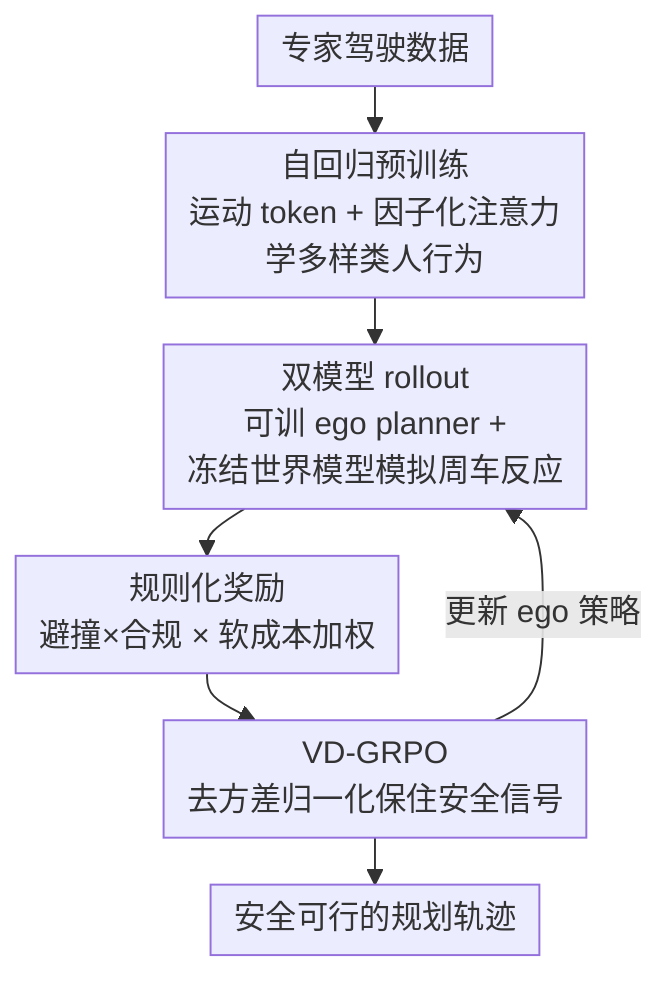

# Plan-R1: Safe and Feasible Trajectory Planning as Language Modeling

**会议**: ICLR 2026  
**OpenReview**: [https://openreview.net/forum?id=uusTA1rBhR](https://openreview.net/forum?id=uusTA1rBhR)  
**代码**: https://github.com/XiaolongTang23/Plan-R1 (有)  
**领域**: 自动驾驶 / 轨迹规划  
**关键词**: 轨迹规划, 自动驾驶, 强化学习微调, GRPO, 安全对齐

## 一句话总结
把自动驾驶轨迹规划当成"语言建模"来做——先用专家数据自回归预训练一个运动 token 预测器学会"像人一样开"，再用规则化奖励 + 改进版 GRPO（VD-GRPO）做强化学习微调，显式对齐安全/舒适/合规等驾驶原则，在 nuPlan 上尤其在交互式 reactive 设定下取得 SOTA。

## 研究背景与动机

**领域现状**：基于学习的轨迹规划（模仿学习 IL 或强化学习 RL）近年很火，因为它适应性强、对手工规则依赖少。无论 IL 还是 RL，主流做法都重度依赖专家示范来监督——直接学人类怎么开车。

**现有痛点**：纯靠专家数据有两个硬伤。一是专家数据几乎不覆盖碰撞、越界这类负样本场景，模型根本没机会学"怎么避免事故"；二是人类示范本身就不完美，作者统计发现 nuPlan 训练场景里**超过 10% 存在超速**，还有不少不舒适机动和危险的低 TTC（time-to-collision）。结果就是模型把这些坏习惯一起学进去了，却没有清晰的"安全"概念。

**核心矛盾**：规划要同时优化**多个相互冲突**的目标（避撞必须永远优先于舒适），而模仿学习把"学会开车的基本行为"和"遵守安全原则"这两件事**耦合**在了同一份专家数据里——你想纠正超速，就得动到学行为的那部分监督信号。

**本文目标**：把"行为学习"和"原则对齐"解耦，让模型既保留人类般的自然驾驶行为，又能显式增强安全意识、丢掉示范里的坏习惯。

**切入角度**：作者借鉴大语言模型的两阶段范式——先 next-token 预测预训练成通用预测器，再用 RL 微调对齐目标。规划本质上也是序列生成，自然可以照搬：先在专家数据上训成轨迹预测器，再用 RL 把轨迹对齐到显式的规划原则上。

**核心 idea**：用"自回归预训练 + 规则奖励 RL 微调"替代"纯专家监督"，并针对规划的安全长尾问题改造 GRPO，让稀有但致命的安全违规样本不被淹没。

## 方法详解

### 整体框架
Plan-R1 是一个两阶段、双模型的框架。**阶段一（预训练）**：把连续轨迹离散成时空"运动 token"，用一个带因子化注意力的 transformer decoder 做多智能体的 next-motion-token 预测，让模型学到多样、像人的驾驶行为分布——这一步只会模仿，不含任何显式原则。**阶段二（微调）**：用一组可解释的规则化奖励（避撞、可行驶区域、限速、舒适、进度）通过强化学习微调 ego 规划器，把轨迹对齐到安全/舒适/合规等原则上。微调阶段的两个关键支撑是：**双模型 rollout**（可训练的 ego planner 与冻结的世界模型协同，模拟周车的真实反应）和 **VD-GRPO**（改造 GRPO 的优势归一化，保住安全信号）。

整体的形式化也对应这个解耦：联合未来运动 $p(Y\mid C,P)$ 被分解为一个 **ego planner** $\pi_e(y_{t,0}\mid y_{<t},C,P)$（额外以规划原则 $P$ 为条件）和一个 **agent predictor** $p_a(y_{t,n}\mid y_{<t},C)$（周车预测，假设与 ego 的原则无关）。$\pi_e$ 由 $p_a$ 初始化后再用 RL 微调。

### 关键设计

**1. 解耦式两阶段范式：预训练学行为，RL 微调学原则**

针对"专家数据把基本驾驶行为和安全原则耦合在一起、无法单独纠正坏习惯"这个痛点，作者把规划拆成两步走。预训练阶段把每个 agent 的轨迹离散成运动 token（时间上按固定间隔切段，空间上用 K-disk 聚类按平均角点距离生成 token 词表，每个 token 代表一个原型位移+朝向变化），然后用 next-motion-token 预测目标 $L_{pretrain} = -\sum_{t=1}^{F}\sum_{n=0}^{N}\log p_a(y_{t,n}\mid y_{<t,0:N},C)$ 训练，让模型逼近人类驾驶行为的隐分布。这一步只负责"开得像人"。微调阶段才用 RL 引入显式原则。这样做的好处是：预训练已经提供了强的行为先验，微调时奖励设计**只需聚焦安全/舒适/合规等具体方面**，不必再从零学"什么是正常驾驶"，既保留了类人行为又能定向纠正超速等坏习惯——这正是它区别于 imitation-regularized RL（如 BC-SAC）和依赖偏好数据的 Gen-Drive/TrajHF 的地方：后者要么仍被专家偏置拖累，要么要昂贵的人类偏好标注。

**2. 规则化奖励：可解释、无偏，安全硬约束乘性优先**

现有 pre-training+fine-tuning 路线（Gen-Drive、TrajHF）靠人类偏好数据训奖励模型，既贵又可能引入新偏置。本文换成一套**可解释的规则化奖励**，覆盖避撞、可行驶区域合规、舒适、限速合规、进度等关键方面，提供一致且无偏的监督。奖励设计的精髓在于它的结构：总奖励是**乘性安全指示项**与**软成本加权和**的乘积

$$R(y_t) = \prod_{k\in I_{safe}} \mathbb{1}_{k,t} \cdot \sum_{j\in I_{cost}} w_j \cdot r_j(y_t),$$

其中 $\mathbb{1}_{k,t}\in\{0,1\}$ 表示第 $k$ 个安全约束在 $t$ 步是否满足，$r_j$ 是软成本项的分数。这个乘性结构让任何一个关键安全条件被违反就直接把总奖励**清零**，而舒适、进度等软目标只有在安全约束满足时才被优化——天然实现了"避撞永远优先于舒适"的优先级关系，不需要靠手调权重去硬凑。

**3. 双模型 rollout：可训 ego planner + 冻结世界模型模拟反应式周车**

RL 微调的一大难点是如何真实模拟周车对 ego 动作的反应。最朴素的做法是回放周车的真值（GT replay）轨迹，但这完全忽略了 ego 的干预，得到的是非反应式、不真实的仿真。作者用双模型设计解决：一个**可训练的 ego planner** $\pi_e$ 去探索不同决策，同时一个**冻结的预训练模型副本** $p_a$ 充当**反应式世界模型**，基于不断演化的联合历史预测周车的响应。这种分离让 ego 的策略更新不会扰动非 ego 动态，产生稳定、真实、交互感知的多智能体 rollout。消融显示它至关重要：GT replay 的 R-CLS 是 87.44，换成反应式世界模型直接涨到 90.04；而把预训练模型参数翻倍只带来 +2.13，远小于世界模型带来的 +7.23，说明收益主要来自双模型设计而非模型容量。

**4. VD-GRPO：去掉方差归一化，保住稀有安全样本的梯度**

直接把 GRPO 用到规划上收益有限，作者定位到根因：GRPO 在每个组内独立归一化奖励 $\tilde{R}(y_t^g)=(R(y_t^g)-\mu_R)/\sigma_R$，这会**抹掉组间的尺度差异**。预训练后近 80% 的轨迹组没有任何安全违规，它们的奖励方差由舒适等次要目标主导；而稀有的安全违规组方差很大。归一化后，稀有高方差的违规组反而被压成和大量低方差安全组**相近的优势值**（图 4 显示两个分布在低优势区几乎完全重叠），安全关键的梯度被稀释，优化逐渐被次要目标带跑。VD-GRPO 的修法很直接：用**中心化 + 固定全局缩放常数 $c$** 替代逐组归一化

$$\tilde{R}_{VD}(y_t^g) = \frac{R(y_t^g) - \mu_R}{c}.$$

把归一化与方差解耦后，绝对奖励尺度被保留，高方差（通常对应稀有灾难性事件）的组自然产生更大梯度，无需手动重加权就放大了安全信号，即使到训练后期这类样本极稀有时仍能持续改进。它受 Dr.GRPO 启发但解决的是不同领域的不同问题：规划里奖励是多目标且冲突的，稀有但灾难性的事件必须被优先。实测 VD-GRPO 把训练中的不安全组比例从 6.7% 降到 4.7%（相对降 29.8%）。

### 损失函数 / 训练策略
微调的目标函数沿用 GRPO 框架，对每个场景从旧策略 $\pi_{e_{old}}$ 采 $G$ 条未来轨迹组成一组：

$$L_{finetune} = -\frac{1}{GF}\sum_{g=1}^{G}\sum_{t=1}^{F}\left(\frac{\pi_e(y_t^g\mid C,P,y_{<t}^g)}{\pi_{e_{old}}(y_t^g\mid C,P,y_{<t}^g)}\hat{A}_t^g - \beta\, D_{KL}[\pi_e\|\pi_{ref}]\right),$$

其中累积优势 $\hat{A}_t^g = \sum_{\tau=t}^{F}\tilde{R}(y_\tau^g)$，归一化用 VD-GRPO 的 $\tilde{R}_{VD}$ 替换。冻结的预训练预测器作为参考策略 $\pi_{ref}$，KL 项约束更新幅度、保留预训练学到的类人行为。预训练用 1M 实例，微调为降低闭环 rollout 成本只用 100K 场景。

## 实验关键数据

### 主实验
nuPlan 基准，闭环仿真，指标为非反应式闭环分 NR-CLS 与反应式闭环分 R-CLS（0–100，越高越好）。Plan-R1 在更具挑战的 reactive 设定下优势最明显。

| 设定 | 拆分 | Plan-R1 (学习型) | Diffusion Planner | 提升 |
|------|------|------|------|------|
| R-CLS | Val14 | **87.69** | 82.80 | +4.89 |
| R-CLS | Test14-hard | **77.20** | 69.22 | +7.98 |
| R-CLS | Test14-random | **90.04** | 82.93 | +7.11 |
| NR-CLS | Test14-hard | **77.45** | 75.99 | +1.46 |

加上后处理 refinement（带 * 的混合类）后，Plan-R1* 在 Val14 取得最高的 NR-CLS 94.72 / R-CLS 93.54。非反应式设定下 Plan-R1 与最强先前方法基本持平，说明 RL 微调没有破坏类人行为；reactive 设定的大幅领先则来自双模型设计 + 原则对齐。

### 消融实验

| 配置 | NR-CLS | Collision | TTC | Drivable | R-CLS |
|------|--------|-----------|-----|----------|-------|
| 仅预训练 | 85.61 | 94.83 | 90.04 | 94.64 | 82.81 |
| + GRPO | 88.65 | 93.87 | 91.57 | 96.93 | 88.35 |
| + VD-GRPO (本文) | **91.23** | **97.32** | **95.02** | **97.32** | **90.04** |

世界模型选择消融（R-CLS）：仅预训练 82.81 → 预训练参数翻倍 84.94 → GT replay 87.44 → 反应式世界模型（本文）90.04。

### 关键发现
- **VD-GRPO 是安全的关键**：标准 GRPO 虽提升 progress(+2.47)、限速(+3.08) 等软目标，却让关键的 collision 指标**掉了 -0.96**；VD-GRPO 相对 GRPO 把 collision +3.45、NR-CLS +2.58、R-CLS +1.69，并把不安全组比例从 6.7% 降到 4.7%。这印证了"组间归一化抹掉尺度差异 → 安全信号被淹没"的诊断。
- **双模型设计 > 单纯加大模型**：反应式世界模型带来 +7.23 R-CLS，而模型翻倍只 +2.13，说明收益来自交互式仿真而非容量。
- **预训练保留类人行为**：定性上专家轨迹存在超速段，PLUTO 和 Diffusion Planner 都"继承"了超速，唯独 Plan-R1 全程合规——直接证明规则化 RL 微调能纠正示范坏习惯。

## 亮点与洞察
- **把规划当语言建模**这个视角很简洁：运动 token 化 + next-token 预训练 + RL 对齐，整套 LLM 范式平移过来，思路干净且可扩展。
- **乘性安全 × 加性软成本**的奖励结构很巧——用结构本身（违规即清零）编码"安全绝对优先"，省去了多目标手调权重的痛苦，可迁移到任何有硬约束+软偏好的多目标 RL。
- **VD-GRPO 的诊断比修法更值钱**：它点破了"组内归一化在长尾安全场景下会抹掉跨组尺度、稀释稀有梯度"这个 GRPO 的隐性缺陷，对任何把 GRPO 用到稀有高方差关键事件的任务都是警示，修法（中心化+固定缩放）几乎零成本。
- 把预训练模型直接冻结当世界模型，一个网络两用、无需额外训练就拿到反应式仿真，工程上很省。

## 局限与展望
- 奖励项（避撞、限速、舒适等）和权重仍是人工设计的规则，作者强调它"无偏一致"，但规则本身的完备性和权重选择仍是潜在瓶颈，复杂场景下可能漏掉某些约束。
- VD-GRPO 的固定缩放常数 $c$ 是个需要选的全局超参，论文未充分讨论其敏感性；选得不好可能影响梯度尺度。
- 全部实验在 nuPlan 仿真闭环（bicycle model + LQR 控制、IDM 反应式周车）下完成，真实路测与 sim-to-real 差距未验证；reactive 周车用 IDM 近似，与真实人类反应仍有距离。
- 世界模型用冻结的预训练副本，假设周车行为与 ego 原则无关；在强博弈/让行场景下这个独立性假设可能不成立。

## 相关工作与启发
- **vs 纯 IL（PLUTO / PlanTF / Diffusion Planner）**：它们只在专家数据上学，会继承超速等坏习惯且缺乏显式安全意识；Plan-R1 用 RL 微调显式对齐安全，reactive 设定大幅领先。
- **vs imitation-regularized RL（BC-SAC / Carplanner）**：把专家距离当奖励/正则虽稳定训练，但仍重度依赖专家数据、继承其偏置；Plan-R1 用规则奖励彻底摆脱对专家监督的二次依赖。
- **vs 偏好数据微调（Gen-Drive / TrajHF）**：同样是两阶段，但它们靠昂贵的人类偏好数据训奖励模型、可能引入新偏置；Plan-R1 换成一致无偏的规则奖励，更可扩展。
- **vs 标准 GRPO / Dr.GRPO**：Dr.GRPO 去掉组内标准差是为减轻语言模型的题目难度偏置；VD-GRPO 借其形但解决的是规划里多目标冲突 + 稀有安全长尾的不同问题。

## 评分
- 新颖性: ⭐⭐⭐⭐ 把 LLM 两阶段范式平移到规划并不算全新，但对 GRPO 安全长尾缺陷的诊断 + VD-GRPO 修法是扎实的原创贡献。
- 实验充分度: ⭐⭐⭐⭐ nuPlan 多拆分 + NR/R 双设定 + 奖励分项消融 + 世界模型/容量对照，证据链完整；缺真实路测。
- 写作质量: ⭐⭐⭐⭐ 动机清晰、图 4/图 5 把 VD-GRPO 的诊断讲得很直观。
- 价值: ⭐⭐⭐⭐ 安全可行规划是落地刚需，规则奖励 + VD-GRPO 的组合实用且可迁移到其他多目标安全 RL。

<!-- RELATED:START -->

## 相关论文

- [\[ICLR 2026\] SMART-R1: Advancing Multi-agent Traffic Simulation via R1-Style Reinforcement Fine-Tuning](advancing_multi-agent_traffic_simulation_via_r1-style_reinforcement_fine-tuning.md)
- [\[ICLR 2026\] DriveAgent-R1: Advancing VLM-based Autonomous Driving with Active Perception and Hybrid Thinking](driveagent-r1_advancing_vlm-based_autonomous_driving_with_active_perception_and_.md)
- [\[ICLR 2026\] BridgeDrive: Diffusion Bridge Policy for Closed-Loop Trajectory Planning in Autonomous Driving](bridgedrive_diffusion_bridge_policy_for_closed-loop_trajectory_planning_in_auton.md)
- [\[NeurIPS 2025\] Future-Aware End-to-End Driving: Bidirectional Modeling of Trajectory Planning and Scene Evolution](../../NeurIPS2025/autonomous_driving/future-aware_end-to-end_driving_bidirectional_modeling_of_trajectory_planning_an.md)
- [\[AAAI 2026\] DriveSuprim: Towards Precise Trajectory Selection for End-to-End Planning](../../AAAI2026/autonomous_driving/drivesuprim_towards_precise_trajectory_selection_for_end-to-end_planning.md)

<!-- RELATED:END -->
