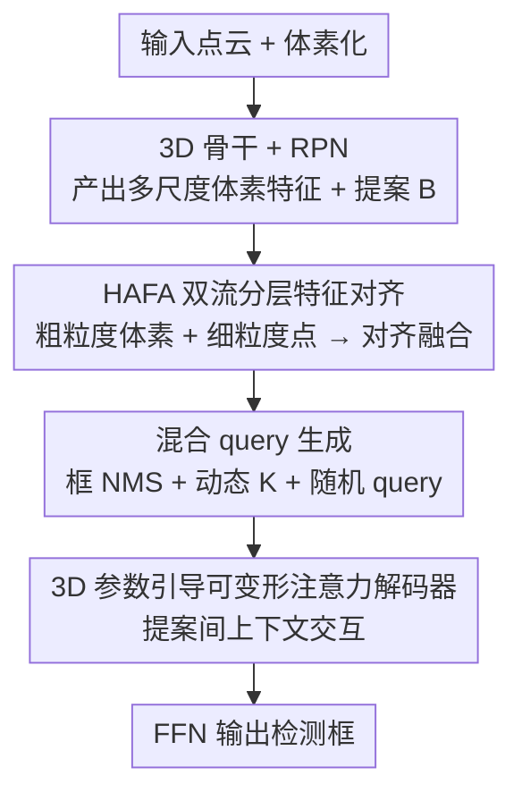

# PTN：面向 3D 目标检测的提案中心化 Transformer 网络

**会议**: ICLR 2026  
**OpenReview**: [https://openreview.net/forum?id=ZOREAbteO5](https://openreview.net/forum?id=ZOREAbteO5)  
**代码**: https://github.com/ZhongJianPing1/ptnet.git  
**领域**: 3D视觉 / 自动驾驶感知  
**关键词**: LiDAR 3D检测, 两阶段检测器, 提案精修, 可变形注意力, Transformer

## 一句话总结
PTN 把两阶段 LiDAR 检测器的瓶颈归结为"提案质量差"——几何细节在池化中丢失、提案各自精修彼此孤立，于是用双流分层特征对齐（HAFA）补回精细几何、用协同提案精修模块（CPRM）让提案之间通过可变形注意力互相交换上下文，在 Waymo、KITTI 上取得 SOTA，尤其大幅提升稀疏点和遮挡场景下的行人、骑行者检测。

## 研究背景与动机
**领域现状**：自动驾驶的 3D 目标检测主流走两阶段范式（如 Voxel R-CNN、PV-RCNN++）：先用 RPN 在 BEV 特征上产生一批提案（ROI），再用 ROI pooling 抽取每个提案的特征，最后在精修阶段对这些提案特征逐个回归出最终框。这条路线在性能与效率之间取得了不错的折中，是当前的事实标准。

**现有痛点**：作者把两阶段检测器的"天花板"精确地定位到**提案质量不足**，并拆成两个具体原因。其一，**几何细节在池化中退化**——为了扩大感受野，检测器层层池化生成提案特征，但对点很少或分布稀疏的目标，池化会把表面细节、边缘锐度这类高频几何信息滤掉，导致提案边界模糊、结构残缺，框就回归不准（论文 Figure 1 用绿框展示了这些错误预测）。即使有方法用前景无关采样补回原始点，也容易漏掉稀疏前景点。其二，**精修阶段没用上周围上下文**——现有方法对每个提案独立优化，只看它自己的局部特征，不去借用相邻、相似目标提案的互补信息。在遮挡场景里这尤其要命：一辆车被树挡住，其点云被切成几段、每段各自被预测成独立提案，缺了彼此交互就都定位不准。

**核心矛盾**：提案特征既要保留精细几何（靠点级细节），又要有判别性的语义（靠体素级感受野），二者来源不同、单流抽取难以兼得；而精修阶段又把本该协同的提案拆成了一个个孤岛。

**本文目标**：(1) 让提案特征同时具备精细几何与语义判别力；(2) 让提案在精修时能跨提案交换互补信息，特别是救回被遮挡、被 NMS 过度抑制的目标。

**核心 idea**：把"提案"显式当成 DETR 框架里的可学习 query，用双流分层特征对齐补回几何细节，再用 3D 参数引导的可变形注意力，让提案 query 在空间邻近、语义相关的提案之间做上下文交互。

## 方法详解

### 整体框架
PTN 是一个挂在 Voxel R-CNN 上的两阶段检测器改进。输入是原始点云 $F_r$，先体素化、用 3D 稀疏卷积骨干抽取 2×/4×/8× 三个尺度的体素特征 $F_v^{N_v}$，转成 BEV 特征后由 RPN 产出一批提案 $B=\{b_i\}_{i=1}^N$。接着每个提案进入 **HAFA（分层注意力特征对齐）**：双流分别抽"粗粒度体素特征"和"细粒度点特征"，再对齐融合，得到增强后的 ROI 特征 $f_b$。然后进入 **CPRM（协同提案精修模块）**：从提案里挑出高质量 query、再补一批随机 query，用可变形注意力让这些 object query 与全部提案的完整上下文交互。最后 FFN 输出检测框。整条链路的关键在于"先把每个提案的特征做厚（HAFA），再让提案之间不再孤立（CPRM）"。

### 关键设计

**1. HAFA 双流分层特征对齐：用粗体素管语义、细点管几何，再对齐融合**

针对"几何细节在池化中丢失、单流难以兼顾语义与几何"的痛点，HAFA 用两条互补的流分别取长。**粗粒度流（CVFE）** 把每个提案 $b=(x,y,z,l,w,h,\theta)$ 均匀切成 $g\times g\times g$ 网格，用三线性插值从多尺度体素特征里取网格点特征 $\{f_g^{b,i}\}$，再把它们当 token 喂进 Transformer encoder 做网格内交互，得到偏语义、利于分类的 $f_b^c=\mathrm{MLP}(\mathrm{Encoder}(Q_c,P_g))$，其中 $P_g$ 是网格点的可学习绝对位置编码。**细粒度流（FPFR）** 直接从未采样的原始前景点里捞几何：先把落在提案框内的前景点平移旋转到提案局部坐标系 $P^*=R_\theta\cdot(P'-T_b)$ 以消除尺寸歧义，再算每个点到框六个面的欧氏距离作为额外特征，拼成 $f_b^p=\mathrm{Concat}((p^*_x,p^*_y,p^*_z),f_a,(d_l,d_r,d_f,d_b,d_t,d_d))$，经 MLP 与 max-pool 得到细粒度点特征 $f_b^r$。最后 **特征对齐（FA）** 把两路拼接后用卷积投到统一空间：$f_b=\mathrm{Conv}(\mathrm{Concat}(f_b^c,f_b^r))$。这样做的关键是直接从原始点而非池化结果取几何，把稀疏目标被池化滤掉的高频细节救回来——消融显示在高 IoU 阈值（0.7）下稀疏目标 TP 提升最多（+10.9%），正是因为 HAFA 补回了定位所需的细节。

**2. 混合 query 生成：框 NMS 选高质量提案 + 动态估计数量 + 随机 query 补漏**

针对"挑提案当 query 时容易误删真目标、固定数量不适配场景"的痛点，CPRM 分三步生成 object query。**第一步用框级 NMS 替代中心 NMS**：传统 Non-Local NMS 用提案中心做后处理过滤，但训练早期分类不准，会把靠得很近的真阳性提案误删（论文 Figure 3 红圈区域）；PTN 改用低阈值（如 0.5）的框 NMS 选出更多样的候选 $B_{nms}$。**第二步动态估计 K**：因 3D 场景目标数本就不定，固定取 top-K 不合理，于是基于 RPN 分类得分热图 $HM$ 估计目标数 $CNT=\varphi(HM)=\mathrm{SUM}(HM>s_t)$（$s_t=0.3$，且仅当 epoch 超过阈值 $\tau$ 后才启用，否则用上限 $C$），再把 $CNT$ 落到三个区间 $[0,20)/[20,40)/[40,200]$，对应取 $K=180/240/300$。**第三步补随机 query**：高质量 query 仍可能漏掉被 NMS 过度抑制或全遮挡的小目标，于是把 BEV 划成 $X\times Y$ 网格，每格中心初始化一个尺度固定为 $(0.05L,0.05W,0.5H)$ 的可学习随机 query $Q_r$。最终 object query 是 $Q=\mathrm{Concat}(Q_p,Q_r)$。消融印证了这套设计的必要性：纯提案 query 时数量上调（300→400）会让 query 相似度升高、特征冗余反而掉点（mAPH 57.79→55.94），下调（300→200）又漏检低分 TP（57.79→55.17），是个"多样性 vs 相似性"的两难；加入 100 个随机 query 后直接把召回拉到新高（mAPH 升到 61.49）。

**3. 3D 参数引导的可变形注意力解码器：让提案只与邻域交互、显式做上下文聚合**

针对"提案各自孤立精修、丢失相邻提案互补信息"的痛点，这一步让 object query 与作为"完整上下文知识"的全部提案特征 $F_b$ 做交互。作者强调不能照搬 DETR 的全局 cross-attention——2D 图像里目标可能占满画面，而 3D 目标空间稀疏、只占极小区域，交互应当只聚焦邻域才能减少冗余、强化几何关系建模。于是对每个 object query，用它的 3D 框参数（位置、尺寸、朝向）生成空间注意力权重，去动态调整可变形卷积核的采样偏移，让网络自主捕捉邻近目标的结构特征、给每个 query 注入场景级依赖：$Q'=\mathrm{Decoder}(Q,P_q,F_b)$，再送入检测头。其效果在遮挡实验里最直观——重遮挡场景下 PTN 相对 Voxel R-CNN 的 Recall@0.5 提升 8.8%，正是因为提案之间能互相借用被遮挡目标的互补片段。

### 损失函数 / 训练策略
方法挂在 Voxel R-CNN 上，训练设置对齐 Deng et al. (2021)；CPRM 中把目标数 $CNT$ 分为 $[0,20)/[20,40)/[40,200]$ 三档，对应 $K_1=180,K_2=240,K_3=300$。动态 K 估计仅在 epoch 超过 $\tau$ 后启用，早期用最大目标数 $C$ 兜底，避免训练初期分类不准导致估计失真。

## 实验关键数据

### 主实验

| 数据集 | 指标 | 本文 PTN | 之前代表 SOTA | 提升 |
|--------|------|----------|---------------|------|
| Waymo val | mAP/mAPH (L2) | 73.5 / 71.2 | DSVT 73.2/71.0 | +0.3/+0.2 |
| Waymo val | Pedestrian AP/APH L2 | 76.8 / 71.4 | DSVT 75.2/69.8 | +1.6/+1.6 |
| Waymo val | Cyclist AP/APH L2 | 75.0 / 73.9 | DSVT 73.6/72.7 | +1.4/+1.2 |
| Waymo test | mAP/mAPH (L2) | 72.7 / 70.6 | PV-RCNN++ 72.4/70.2 | +0.3/+0.4 |
| KITTI test | Car mAP | 84.11 | DPFusion 83.53 | +0.58 |
| KITTI test | Cyclist mAP | 72.11 | PASS-PV 69.93 | +2.18 |

增益主要集中在**行人与骑行者**这类点稀疏、易遮挡的类别上：行人点云分布稀疏，HAFA 补回的细粒度点特征显著改善定位；骑行者区域大量为空，细粒度点补全外观让其更易被检出。多帧输入下（4 帧）PTN 进一步达到 mAP/mAPH(L2) 75.6/74.1，优于 CenterFormer 等。

### 消融实验

| 配置 | mAP/mAPH (L2) | 说明 |
|------|---------------|------|
| baseline | 60.00 / 57.45 | 都不加 |
| + HAFA | 63.52 / 60.19 | 单加 HAFA |
| + CPRM | 64.45 / 61.57 | 单加 CPRM |
| + HAFA + CPRM | 66.40 / 63.58 | 完整模型 |
| Np=300, Nr=0 | 61.75 / 57.79 | 无随机 query |
| Np=300, Nr=100 | 64.45 / 61.57 | 加 100 随机 query |
| Np=400, Nr=0 | 59.78 / 55.94 | query 过多反而冗余掉点 |

（消融用 25% 数据训练/验证以提效，故绝对数值低于主表。）

### 关键发现
- **HAFA 内部消融（Table 8）**：只用细粒度点特征（FPFR）就比只用体素特征（CVFE）好，说明点级几何对定位贡献更直接；三件套 CVFE+FPFR+FA 齐上才达到 63.52，对齐模块不可省。
- **随机 query 是召回关键**：去掉随机 query 时存在"提案 query 多样性 vs 相似性"的两难，加 100 个随机 query 直接把 mAPH 从 57.79 拉到 61.57。
- **稀疏与遮挡场景增益最大**：稀疏场景下高 IoU（0.7）TP +10.9%；重遮挡场景 Recall@0.5 +8.8%，分别验证了 HAFA 补几何、CPRM 补上下文的作用。
- PTN 在 A100 上兼顾性能与速度（Figure 4），并非靠堆算力换点数。

## 亮点与洞察
- **把"提案"显式当 DETR query**：不同于依赖密集特征匹配的 DETR 类方法，PTN 让提案彼此作为可学习 query 通过可变形注意力交互，思路干净且把两阶段范式与 Transformer 自然嫁接。
- **双流分工的取舍很清晰**：粗体素管语义/分类、细原始点管几何/回归，再对齐——这种"按下游任务需要分流抽特征"的拆法可迁移到其他需要兼顾分类与定位的检测任务。
- **随机 query 救漏检**：用空间先验约束的网格随机 query 去召回被 NMS 过抑的真阳性，是个低成本但有效的 trick，对小目标/遮挡目标尤其有用。
- **针对 3D 稀疏性裁剪注意力**：明确指出 3D 目标占比小、交互应只聚焦邻域，从而用 3D 框参数引导可变形采样而非全局注意力，是对 DETR 直接迁移的有针对性修正。

## 局限与展望
- 作者承认未来要用可学习机制以更低成本提升提案质量，暗示当前动态 K 的区间划分、随机 query 数量等仍偏经验设定。
- 方法绑定在 Voxel R-CNN 这一具体两阶段基座上，跨基座/纯单阶段检测器的可迁移性论文未充分验证。
- 动态 K 依赖 RPN 分类热图，早期 epoch 用上限兜底；若 RPN 本身质量差，热图估计目标数可能失真，这部分鲁棒性缺乏专门分析。
- 主表上对 Waymo Vehicle 类别相比部分强基座并无优势（如 PV-RCNN++ test），增益高度集中在行人/骑行者，泛化到所有类别仍有空间。

## 相关工作与启发
- **vs Voxel R-CNN**：同为体素两阶段，但 PTN 通过分层特征对齐与动态感受野调整持续精修提案的几何质量与语义一致性，是其直接增强版（也以它为基座）。
- **vs DETR 类 3D 检测（TransFusion / CMT / ConQueR / FocalFormer3D）**：它们多依赖热图引导 query 或密集特征匹配；PTN 显式把提案当 query 并用可变形注意力做提案间交互，针对 3D 稀疏性把全局注意力裁成邻域交互。
- **vs 前景采样补细节方法（PV-RCNN 系）**：这类方法易漏稀疏前景点；PTN 的 FPFR 直接从未采样原始前景点构造到框面的距离特征，更完整地保留稀疏目标几何。

## 评分
- 新颖性: ⭐⭐⭐⭐ 把提案当 query + 3D 邻域可变形交互 + 双流几何/语义分工，组合清晰且针对性强，但单个组件多为已有思路的精修。
- 实验充分度: ⭐⭐⭐⭐ Waymo/KITTI 双基准、稀疏/遮挡/多帧/数量等多角度消融到位。
- 写作质量: ⭐⭐⭐⭐ 痛点定位精准、图示直观，但部分符号（如 $F_r$ 同时指点云与点特征）略有复用混淆。
- 价值: ⭐⭐⭐⭐ 对两阶段 LiDAR 检测的提案质量瓶颈给出实用且可复现的解法，代码开源。

<!-- RELATED:START -->

## 相关论文

- [\[CVPR 2026\] Efficient Equivariant Transformer for Self-Driving Agent Modeling](../../CVPR2026/autonomous_driving/efficient_equivariant_transformer_for_self-driving_agent_modeling.md)
- [\[AAAI 2026\] CaTFormer: Causal Temporal Transformer with Dynamic Contextual Fusion for Driving Intention Prediction](../../AAAI2026/autonomous_driving/catformer_causal_temporal_transformer_with_dynamic_contextual_fusion_for_driving.md)
- [\[ECCV 2024\] PanoVOS: Bridging Non-panoramic and Panoramic Views with Transformer for Video Segmentation](../../ECCV2024/autonomous_driving/panovos_bridging_non-panoramic_and_panoramic_views_with_transformer_for_video_se.md)
- [\[ICLR 2026\] AsyncBEV: Cross-modal Flow Alignment in Asynchronous 3D Object Detection](asyncbev_cross-modal_flow_alignment_in_asynchronous_3d_object_detection.md)
- [\[ICLR 2026\] GaussianFusion: Unified 3D Gaussian Representation for Multi-Modal Fusion Perception](gaussianfusion_unified_3d_gaussian_representation_for_multi-modal_fusion_percept.md)

<!-- RELATED:END -->
