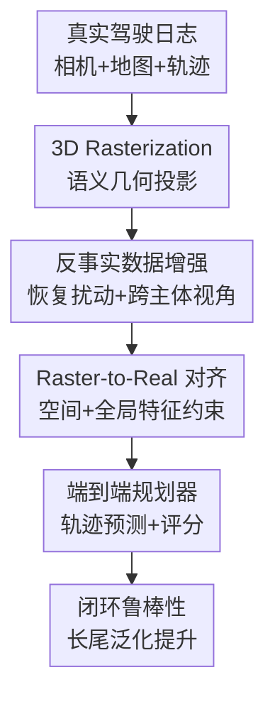

# RAP: 3D Rasterization Augmented End-to-End Planning

**会议**: ICLR 2026  
**OpenReview**: [https://openreview.net/forum?id=a9bOgeqbdB](https://openreview.net/forum?id=a9bOgeqbdB)  
**论文**: [Project Page](https://alan-lanfeng.github.io/RAP/)  
**代码**: 暂未在缓存中给出  
**领域**: 自动驾驶 / 端到端规划  
**关键词**: 端到端自动驾驶, 3D Rasterization, 数据增强, Raster-to-Real 对齐, 闭环鲁棒性

## 一句话总结
RAP 用轻量 3D rasterization 从真实驾驶日志生成可控的反事实视角和恢复场景，再通过特征空间的 Raster-to-Real 对齐把这些合成样本稳定迁移到真实图像规划器上，从而在 NAVSIM、WOD-E2E 和 Bench2Drive 等闭环/长尾基准上显著提升端到端自动驾驶规划鲁棒性。

## 研究背景与动机
**领域现状**：端到端自动驾驶规划通常把多视角相机输入、历史 ego 状态和路线信息直接映射到未来轨迹或控制命令。主流训练方式仍然是离线 imitation learning：模型在大规模真实驾驶日志中模仿专家轨迹，在开放环指标上可以取得很强的结果，也避免了传统模块化系统中感知、预测、规划多级误差传播的问题。

**现有痛点**：离线 imitation learning 的关键短板在于训练分布过窄。模型只看到专家已经走好的轨迹，很少看到“车偏离专家路线之后应该如何恢复”的样本；一旦闭环部署时预测稍微偏了一点，下一帧输入就进入训练集中没有覆盖的状态，小错会不断累积，最终变成碰撞、越界或停滞。这就是自动驾驶规划里典型的 covariate shift 和 recovery data 缺失问题。

**核心矛盾**：一种自然解法是用模拟器或数字孪生生成更多反事实场景，但照片级神经渲染、3D Gaussian Splatting 或游戏引擎式重建都太慢、太贵，而且为了像素外观付出了大量训练成本。对规划来说，真正关键的往往不是纹理、光照和材质，而是车道几何、交通参与者位置、朝向、相对运动和交通信号。论文抓住的矛盾是：端到端规划训练需要大规模、可控、能覆盖偏离状态的数据，但不一定需要照片级真实的像素。

**本文目标**：作者希望构建一个可扩展的数据增强框架，让相机端到端规划器不仅能学习真实 ego 轨迹，还能学习反事实恢复轨迹和其他交通参与者视角；同时，合成输入必须能有效迁移到真实图像推理，而不能因为 rasterized 图像和真实图像外观差异太大而变成无用数据。

**切入角度**：RAP 的切入点是把“渲染真实世界”改成“渲染规划所需语义”。它不追求还原天空、路面纹理或复杂光照，而是把日志中的地图折线、车辆/行人 cuboid、交通灯状态等标注原语投影到相机视角，快速生成带几何和动态信息的 RGB raster 图。然后，它不在像素空间逼近真实图像，而是在特征空间对齐 raster 和 real，让规划器学到可迁移的结构表示。

**核心 idea**：用可控 3D rasterization 替代昂贵照片级渲染来扩展端到端规划训练分布，并用 Raster-to-Real 特征对齐解决合成视角到真实图像的迁移问题。

## 方法详解

### 整体框架
RAP 是一个围绕自动驾驶规划训练数据构建的增强框架。输入是真实驾驶日志中的多视角相机、ego 轨迹、地图标注和交通参与者 3D 状态；输出不是一个新模拟器的最终闭环控制，而是一批可用于训练端到端规划器的真实/合成样本，以及一个能同时吸收真实图像和 rasterized 图像监督的规划模型。

整体流程可以理解为三步：先把日志标注转成可投影的 3D 场景原语，再用 rasterization 生成两类非平凡增强样本，最后用 R2R alignment 把合成样本的结构监督迁移到真实图像特征空间。这样，模型既保留真实图像中的细粒度感知能力，又能从大规模合成几何场景中学习恢复和长尾交互。

### 关键设计
**1. 3D Rasterization：用语义几何替代昂贵照片级渲染**

RAP 的第一层设计是重新定义“合成驾驶视角”应该保留什么。神经渲染和引擎渲染试图在像素空间接近真实图像，但端到端规划真正依赖的是路面拓扑、车道线、可行驶区域、交通参与者姿态和相对距离。因此作者从日志标注重建场景：静态地图元素被表示为世界坐标中的折线集合 $M=\{P_k\}$，车辆、行人、自行车、路障等动态对象被近似为带位姿 $T_i \in SE(3)$ 的 oriented cuboid，交通灯则用固定尺寸 cuboid 并按状态着色。

随后，所有 3D 原语通过相机内参 $K$ 和外参 $T_{w\to c}$ 投影到图像平面。论文采用标准针孔模型，对世界点 $p_w$ 做齐次变换与透视除法，得到像素坐标 $(u,v)$；深度小于近裁剪面的点会被丢弃。rasterization 阶段再用 depth-aware compositing 处理遮挡，并用距离衰减权重 $\alpha=\max(0,1-d/d_{max})$ 表达远近关系。这个表示看起来不像真实照片，却把规划所需的语义、几何和深度线索保留下来，而且不需要为每个场景训练 NeRF 或 3DGS。

这个选择的关键价值在“可扩展”。一旦场景由标注原语组成，生成新视角和新 ego 偏移几乎只是重新投影，而不是重新优化一个照片级世界模型。论文的 PCA 可视化还显示，冻结 DINOv3 提取到的真实图像特征和 rasterized 图像特征在结构上并非完全割裂，这给后续特征对齐提供了经验依据。

**2. 反事实数据增强：把日志从单一路径扩展成恢复和多主体训练分布**

仅有 rasterization 还不够，真正让 RAP 对闭环规划有价值的是它能生成 logged trajectory 之外的训练状态。第一类增强是 recovery-oriented perturbation：作者对专家 ego 轨迹 $\tau^*(t)$ 添加横向偏移、纵向偏移和高斯噪声，构造 $\tilde{\tau}(t)=\tau^*(t)+\delta_{lat}(t)+\delta_{long}(t)+\epsilon_t$。然后再从这个扰动后的 ego 轨迹重新渲染相机视角，让模型看到“车已经偏离专家路径时，该如何回到合理轨迹”的样本。

这类样本直接对准 imitation learning 的脆弱点。传统日志里几乎没有专家犯错后的恢复过程，所以模型在闭环中一旦进入偏离状态就缺少训练经验；RAP 用可控扰动制造这些状态，相当于把训练分布往部署时可能遇到的状态扩出去。消融也印证了这一点：加入扰动对 NAVSIM v1 的开放环式指标几乎没有帮助，但对更接近闭环反事实评估的 NAVSIM v2 EPDMS 从 32.5 提升到 36.9。

第二类增强是 cross-agent view synthesis。nuPlan/OpenScene 日志中并不只有 ego 车辆，还包含大量其他交通参与者的轨迹。RAP 把其他 agent 的轨迹替换成新的 ego 轨迹，并保持原有相机参数约定来重新渲染，从而把一个日志场景扩展成多主体视角数据。这样做既增加样本规模，也让模型看到更多交互角色和相对运动模式。论文报告最终得到超过 50 万个 rasterized 训练样本，其中包括 ego raster、其他车辆视角 raster 和扰动样本。

**3. Raster-to-Real 对齐：在特征空间桥接合成几何和真实图像**

rasterized 图像和真实相机图像的像素差距很大，直接混合训练容易让模型学到域相关捷径，比如黑色背景、简化车体颜色或缺失纹理。RAP 没有把目标设为“让 raster 图像更像照片”，而是在规划器特征空间里让 real 和 raster 学到一致结构。具体来说，给定配对真实样本 $x_r$ 和 rasterized 样本 $x_s$，视觉编码器/投影器输出空间特征 $F^r=\phi(x_r)$ 与 $F^s=\phi(x_s)$，其中 $F\in\mathbb{R}^{N\times d'}$。

空间级对齐用 MSE 约束每个 patch 或 feature-map 位置：$L_{spatial}=\frac{1}{N}\sum_{j=1}^{N}\lVert F^r_j-F^s_j\rVert_2^2$。论文里 raster features 被 detach，当作由高质量标注产生的结构性教师信号；真实分支被推动去对齐这些干净的几何语义特征。这样做的意义不是丢掉真实图像细节，而是让真实图像的中间表示更稳定地编码可规划结构。

全局级对齐进一步处理整体域偏差。作者对特征图平均池化得到全局表示 $g$，再用 domain classifier 判别它来自真实图像还是 raster 图像；通过 gradient reversal layer，编码器被训练成混淆两域，而分类器仍试图区分两域。对应损失为 $L_{global}=-\mathbb{E}_{(g,y)}[y\log D(g)+(1-y)\log(1-D(g))]$。最终训练目标把规划任务损失和两种对齐损失相加：$L=L_{task}+\lambda_sL_{spatial}+\lambda_gL_{global}$。这让 RAP 可以利用大量无配对或弱配对的 rasterized 样本，同时不把模型推离真实图像推理场景。

**4. 模型无关接入：把 RAP 当作训练配方而不是单一规划器**

RAP 不绑定某一个端到端规划架构。论文最强版本 RAP-DINO 使用冻结 DINOv3-H+ 作为视觉骨干，接一个可学习 MLP projector 和来自 iPad 的 iterative deformable attention decoder；规划头包括多模态轨迹头和基于 PDMS 的轨迹评分头。这个版本参数量约 888M，用于 NAVSIM 和 WOD-E2E 等高性能评测。

同时，作者也把 RAP 接到已有方法上，形成 RAP-iPad 和 RAP-DiffusionDrive，并在 Bench2Drive 上使用约 29M 参数的 RAP-ResNet 以满足闭环推理效率。这个设计说明论文贡献主要不是“又提出一个更大的 planner”，而是提出一种可插拔的数据增强与特征对齐训练范式。若同样的 rasterization 和 R2R alignment 能让不同 planner 都受益，说明增益来自训练分布扩展和域对齐，而不只是模型容量。

### 一个完整示例
假设日志中有一个路口场景，真实 ego 车在过去 2 秒内沿车道中心线稳定前进，未来 5 秒专家轨迹是轻微减速后通过路口。传统 imitation learning 只会把这个“正确路径上的相机输入 → 专家未来轨迹”作为训练样本，模型没有机会看到 ego 已经偏到车道右侧或从旁边车辆视角接近路口时应该怎么规划。

RAP 会先把该帧的车道折线、斑马线、交通灯、周围车辆 cuboid 和行人 cuboid 投影成 rasterized 多视角输入。然后，它可以给 ego 轨迹添加一个横向偏移，让模型看到车辆已经偏离中心线的 counterfactual 视角；监督目标仍然鼓励它规划回安全、可行驶的轨迹。与此同时，RAP 还可以把场景中另一辆正在左转的车辆当作新的 ego，重渲染该车辆视角下的相机输入，从同一段日志中得到额外交互样本。

训练时，真实图像样本负责提供照片中的细粒度视觉线索，rasterized 样本负责提供大规模、干净、可控的几何结构。R2R alignment 则把两者的中间特征拉到同一个规划友好的表示空间，使模型在真实相机推理时仍能利用从 raster 增强中学到的恢复策略和交互规律。

### 损失函数 / 训练策略
RAP 的总目标由规划任务损失和 R2R 对齐损失组成。$L_{task}$ 包括未来轨迹监督和轨迹评分监督：前者训练多模态 trajectory head 预测 5 秒未来轨迹，后者用 PDMS 分数训练 scoring head 选择更安全、合规、舒适的轨迹。对齐部分使用 $L_{spatial}$ 和 $L_{global}$，论文给出的超参为 $\lambda_{spatial}=0.002$、$\lambda_{global}=0.1$。

训练数据来自 OpenScene/nuPlan。作者抽取 7 秒 clips，用前 2 秒作为输入、后 5 秒作为输出；ego 轨迹按 NAVSIM 的 PDMS filtering 去掉过于简单或专家质量低的片段，其他车辆则用 constant-velocity baseline 的 ADE 和有效性过滤。最终数据包含 85k real-raster 配对样本、8.5k 扰动 raster 样本、272k ego trajectory raster 样本和 200k other-agent raster 样本。主模型在 4 张 H100 上训练，使用 AdamW、初始学习率 $1e^{-4}$、cosine decay 和 20 个 epoch 的预训练/微调设置。

## 实验关键数据

### 主实验
论文在四个主要端到端驾驶规划基准上验证 RAP：NAVSIM v1、NAVSIM v2、Waymo Open Dataset Vision-based E2E Driving，以及 Bench2Drive。总体结果显示，RAP 不只是改善离线 ADE，而是在闭环鲁棒性、反事实评估和长尾场景上都取得了领先结果。

| 基准 | 模型 | 关键指标 | 本文结果 | 对比强基线 | 提升 / 结论 |
|------|------|----------|----------|------------|-------------|
| NAVSIM v1 navtest | RAP-DINO | PDMS ↑ | 93.8 | Centaur 92.1 / iPad 91.7 | 相机输入方法中最高，整体规划质量领先 |
| NAVSIM v1 navtest | RAP-iPad | PDMS ↑ | 92.5 | iPad 91.7 | 同一架构接入 RAP 后 +0.8 |
| NAVSIM v1 navtest | RAP-DiffusionDrive-Camera Only | PDMS ↑ | 89.2 | DiffusionDrive-Camera Only 86.0 | 同一相机-only setting 下 +3.2 |
| NAVSIM v2 navhard | RAP-DINO | EPDMS ↑ | 36.93 | LTF 23.12 | 两阶段反事实评估显著领先 |
| WOD-E2E | RAP-DINO | RFS Overall ↑ | 8.04 | Poutine 7.99 | 排名第一，同时 ADE@5s 最低 2.65 |
| Bench2Drive | RAP-ResNet | Driving Score ↑ | 66.42 | iPad 65.02 / DriveTransformer 63.46 | 小模型闭环推理仍取得最高 Driving Score |

NAVSIM v1 的细项也能看出 RAP 不是只刷单个指标。RAP-DINO 的 NC 为 99.1、DAC 为 98.9、TTC 为 96.7、EP 为 90.3，说明碰撞、可行驶区域、时间碰撞和前进效率都比较均衡。NAVSIM v2 更重要，因为第二阶段会用 3DGS 合成策略偏离后的反事实视角，更接近闭环错误累积；RAP 在这里的优势更大，说明 recovery-oriented augmentation 确实对闭环鲁棒性有效。

WOD-E2E 强调低频长尾事件，例如施工绕行、行人事故和高速障碍物。RAP-DINO 的 ADE@5s 为 2.65、ADE@3s 为 1.17、RFS Spotlight 为 7.20、RFS Overall 为 8.04，超过了更大规模的视觉-语言-轨迹模型 Poutine。Bench2Drive 则在 CARLA 中跑真实闭环路线，RAP-ResNet 的 Success Rate 达到 37.27%，Driving Score 达到 66.42，说明 raster 增强不是只在 nuPlan 派生基准上有效。

### 消融实验
| 消融项 | 配置 | 指标 | 结果 | 说明 |
|--------|------|------|------|------|
| Rasterization 外观 | colored faces + depth decay + black background | MinADE ↓ | 0.91 | 最佳配置，语义颜色、深度衰减和干净背景都有效 |
| Rasterization 外观 | transparent faces + depth decay + black background | MinADE ↓ | 0.98 | 透明面削弱对象语义，性能下降 |
| Rasterization 外观 | colored faces + no depth decay + black background | MinADE ↓ | 1.05 | 去掉深度衰减后远近关系表达变弱 |
| Rasterization 外观 | colored faces + depth decay + natural background | MinADE ↓ | 1.33 | 自然 sky-ground 背景反而引入干扰 |
| Recovery perturbation | 无扰动样本 | NAVSIM v2 EPDMS ↑ | 32.5 | 缺少偏离状态恢复训练 |
| Recovery perturbation | 加入 8.5k 扰动样本 | NAVSIM v2 EPDMS ↑ | 36.9 | 闭环反事实评估显著提升 |
| R2R alignment | 无对齐 | MinADE ↓ | 见 Fig. 5 | 真实/合成域差距更明显 |
| R2R alignment | spatial alignment | MinADE ↓ | 优于无对齐 | 局部结构对齐有效 |
| R2R alignment | spatial + global alignment | MinADE ↓ | 最优 | 同时约束局部几何和全局域分布 |

另一个关键消融是 cross-agent view synthesis 的 scaling curve。作者从 85k 真实样本出发，逐步加入 1k、10k、100k、500k、1000k 个其他车辆视角 raster 样本，MinADE 与样本量近似满足 $y=-0.021\ln(x)+1.2173$，$R^2=0.9942$。这说明从其他 agent 视角生成的数据并非噪声堆量，而是遵循类似数据 scaling law 的持续收益，只是收益随规模增加逐渐递减。

### 关键发现
- RAP 的收益在更接近闭环的评估中更明显。扰动增强对 NAVSIM v1 几乎不变，但对 NAVSIM v2 大幅提升，说明它主要解决的是偏离状态恢复，而不是简单的开放环拟合。
- rasterization 的“简化”不是随便画线。colored faces、depth decay、black background 都有实证作用：对象语义、距离感和低干扰背景共同构成了适合规划学习的抽象视觉输入。
- R2R alignment 是合成数据可迁移的关键。只靠 raster 样本扩充可能会带来域偏差，而空间级和全局级对齐能让真实图像特征吸收 raster 的结构监督，同时保持真实推理能力。
- RAP 对不同规划器都有增益。RAP-iPad、RAP-DiffusionDrive 和 RAP-ResNet 的结果表明，这篇论文的主要贡献更像是一套可复用训练配方，而不是只服务于单一大模型的工程堆叠。

## 亮点与洞察
- 这篇论文最有价值的判断是“规划不需要照片级真实，训练需要语义级可扩展”。很多驾驶仿真工作默认像素越真实越好，但 RAP 把目标改成保留几何、动态和语义，这让数据生成成本从照片级重建降到标注原语投影。
- recovery-oriented perturbation 对准了 imitation learning 的根因问题。它不是普通图像增强，而是在状态分布上补齐“模型已经犯小错时如何恢复”的训练经验，因此更符合闭环部署时的失效模式。
- Raster-to-Real 对齐的位置选得很巧。论文没有试图把 raster 图像变成照片，也没有让模型完全忽略真实图像，而是在中间特征层把两域拉近，这比像素级 sim-to-real 更符合端到端规划的需求。
- cross-agent view synthesis 是一个高性价比扩数据思路。同一段交通日志里本来就有大量非 ego 轨迹，RAP 把它们转成可训练视角，相当于从已有标注中挖出更多交互角色和长尾行为。
- 对自动驾驶世界模型研究也有启发：如果目标是训练规划策略，未必所有生成模型都要追求视觉逼真；可控、便宜、能覆盖反事实状态的结构化生成可能更直接地服务决策。

## 局限与展望
- RAP 仍然停留在 imitation learning 框架内。它能制造偏离状态和恢复样本，但监督目标仍来自日志或过滤后的专家轨迹，因此没有彻底解决 causal confusion、交互式探索和策略自我改进问题。
- rasterization 依赖高质量场景标注。如果地图、交通灯、对象 3D box 或 agent 轨迹不准确，生成的合成视角会把错误几何当作干净监督传给模型；这在标注稀疏或传感器覆盖较差的数据集上可能更明显。
- 简化视觉可能遗漏未标注的关键线索。作者在附录中展示模型仍能利用真实图像识别 “Keep Left” 标志和 LED 箭头，但这些能力来自真实图像训练和多任务目标；如果真实数据比例过低，细粒度视觉 cue 是否仍能保留需要更系统验证。
- cross-agent view synthesis 对相机参数和车辆语义有近似假设。把其他交通参与者当作 ego 视角生成样本时，传感器安装位置、可见范围和驾驶意图不一定完全等价，极端情况下可能引入不自然样本。
- 未来方向可以把 3D rasterization 扩展成真正闭环 simulator，用于 reinforcement learning 或在线数据聚合。这样 RAP 就不只是离线扩增训练集，而可以让策略在可控、便宜的结构化环境中主动探索和修正。

## 相关工作与启发
- **vs NeRF / 3D Gaussian Splatting 驾驶数字孪生**: 这些方法追求照片级重建，适合高保真评测或可视化，但每个场景优化成本高，难以大规模生成训练样本。RAP 牺牲像素真实，换来训练级别的规模、速度和可控性。
- **vs CARLA / MetaDrive 等引擎模拟器**: 引擎模拟器可闭环交互，但需要手工资产和行为建模，真实日志到仿真世界的匹配成本高。RAP 直接从真实日志标注投影，保留原始交通结构，同时避免复杂渲染资产。
- **vs VISTA / 图像重投影式增强**: 图像重投影能生成邻近 ego 偏移，但通常只适合小范围视角变化。RAP 基于 3D 原语重绘，能支持更大规模的恢复扰动和跨 agent 视角。
- **vs 传统 BEV 安全场景生成**: 许多安全关键场景生成工作只在 BEV 或 mid-to-end planner 上验证。RAP 面向 camera-input E2E planner，把增强后的场景真正接到相机端到端模型训练中。
- **vs 普通数据增强 / domain adaptation**: 普通增强改变颜色、裁剪或噪声，不能创造新的驾驶状态；传统 domain adaptation 只处理域间分布。RAP 同时扩展状态分布和对齐表示空间，两者结合才构成完整训练配方。

## 评分
- 新颖性: ⭐⭐⭐⭐⭐ 把轻量 3D rasterization、恢复扰动、跨主体视角和特征级 sim-to-real 对齐组合到端到端规划训练中，问题定义和工程取舍都很清晰。
- 实验充分度: ⭐⭐⭐⭐⭐ 覆盖 NAVSIM v1/v2、WOD-E2E、Bench2Drive，并有 rasterization 设计、扰动、R2R alignment、cross-agent scaling 等关键消融。
- 写作质量: ⭐⭐⭐⭐☆ 论文主线非常清楚，动机和结果有说服力；少数实现细节如跨 agent 相机近似和部分 alignment 方向表述还可以更展开。
- 价值: ⭐⭐⭐⭐⭐ 对端到端自动驾驶训练很实用，核心启发是用便宜、结构化、可控的合成数据替代昂贵照片级渲染来提升闭环鲁棒性。

<!-- RELATED:START -->

## 相关论文

- [\[ICLR 2026\] VADv2: End-to-End Vectorized Autonomous Driving via Probabilistic Planning](vadv2_end-to-end_vectorized_autonomous_driving_via_probabilistic_planning.md)
- [\[AAAI 2026\] DriveSuprim: Towards Precise Trajectory Selection for End-to-End Planning](../../AAAI2026/autonomous_driving/drivesuprim_towards_precise_trajectory_selection_for_end-to-end_planning.md)
- [\[ICLR 2026\] ResWorld: Temporal Residual World Model for End-to-End Autonomous Driving](resworld_temporal_residual_world_model_for_end-to-end_autonomous_driving.md)
- [\[CVPR 2026\] ActiveAD: Planning-Oriented Active Learning for End-to-End Autonomous Driving](../../CVPR2026/autonomous_driving/activead_planning-oriented_active_learning_for_end-to-end_autonomous_driving.md)
- [\[ICLR 2026\] ReCogDrive: A Reinforced Cognitive Framework for End-to-End Autonomous Driving](recogdrive_a_reinforced_cognitive_framework_for_end-to-end_autonomous_driving.md)

<!-- RELATED:END -->
