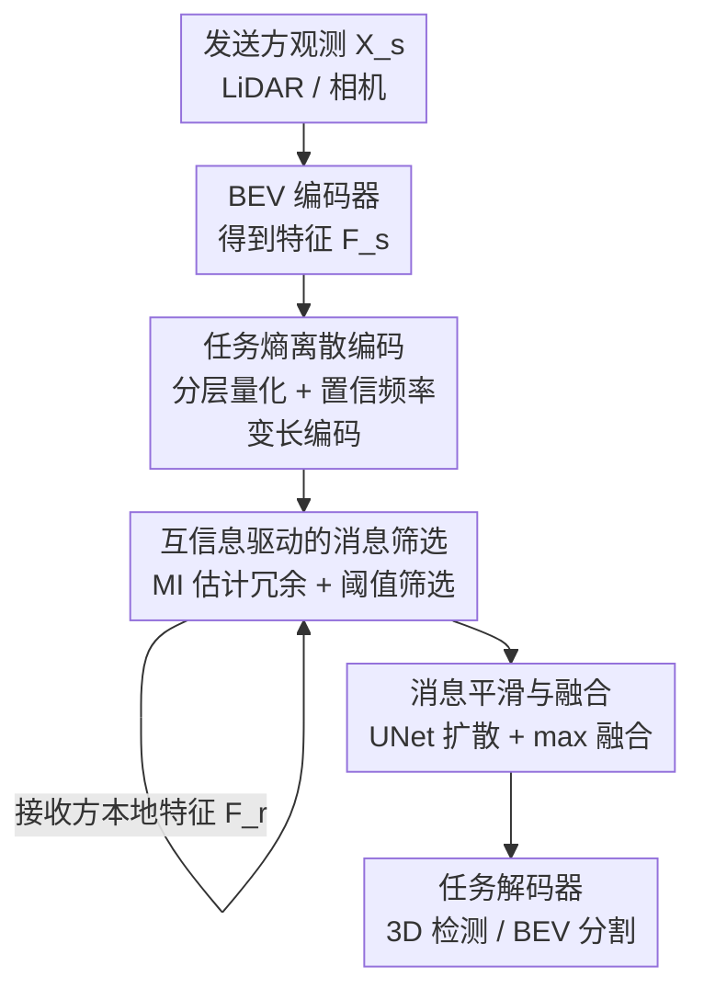

# Rate-Distortion Optimized Pragmatic Communication for Collaborative Perception

**会议**: ICLR 2026  
**OpenReview**: [https://openreview.net/forum?id=920RxFvsMx](https://openreview.net/forum?id=920RxFvsMx)  
**代码**: https://github.com/gjliu9/RDcomm  
**领域**: 自动驾驶 / 协同感知  
**关键词**: 协同感知, 率失真理论, 信息论, 通信压缩, 多智能体

## 一句话总结
本文把 Shannon 经典率失真理论扩展成面向多智能体协同感知的"务实率失真理论"，推导出最优通信策略必须满足的两个条件——只传任务相关信息、不传与接收方观测重复的信息，并据此设计 RDcomm 框架（任务熵离散编码 + 互信息驱动的消息筛选），在 4 个数据集的 3D 检测与 BEV 分割上取得 SOTA 精度的同时把通信量压缩最多 108 倍。

## 研究背景与动机
**领域现状**：多智能体协同感知让车、路侧单元等多个 agent 互相共享视觉特征，从而克服单车视角的遮挡和有限视野，已经在 3D 检测、BEV 分割等任务上展现出明显优势。但它有一个绕不开的核心矛盾：**任务性能 vs 通信量的 trade-off**——共享越多信息感知越准，但带宽开销越大；过度压缩又会丢掉任务关键信息导致掉点。

**现有痛点**：现有方法处理这个 trade-off 基本靠"启发式"。一类是空间选择，只传任务相关区域（如 Where2comm 传高检测置信度区域、CoSDH 传未观测区域）；另一类是神经压缩（VQ 量化、通道缩减、自编码器）。但这些方法都是凭直觉手工设计通信策略，**没有理论支撑**，无法回答两个根本问题：到底该传什么（what to communicate）、在带宽约束下该怎么编码（how to encode）。

**核心矛盾**：经典率失真理论虽然能刻画"压缩比特率 vs 失真"的最优边界，但它有两个不适配协同感知的地方——其一，它用的是基于重建保真度的失真（如 MSE），衡量的是"压缩后还原得像不像原信号"，而协同感知真正关心的是"压缩后下游任务掉不掉点"；其二，它只考虑单信源压缩，没有考虑多个 agent 都在观测同一场景、**agent 之间的观测本身就高度冗余**这一事实。

**本文目标**：建立一套能直接指导协同通信设计的理论，把"该传什么、怎么编码"从拍脑袋变成有最优条件可循。

**切入角度**：从信息论出发，把 Shannon 率失真框架往两个方向扩展——引入"务实失真"（pragmatic distortion，用任务表现而非重建误差度量信息退化），并推广到多 agent 分布式通信（同时考虑发送方和接收方都在观测环境，显式建模 agent 间冗余）。

**核心 idea**：用"务实率失真理论"推导出最优通信的两个充分条件（pragmatic-relevant 与 redundancy-less），再让 RDcomm 的两个模块分别逼近这两个条件。

## 方法详解

### 整体框架
RDcomm 的目标是：在给定任务损失上限 $L_{max}$ 的约束下，最小化所有 agent 之间传输的总比特数。本文先把这个目标写成率失真形式 $\text{Rate}(\delta) = \min_{p(Z_{s\to r}|X_s)} I(X_s; Z_{s\to r})$ s.t. $D_Y[X_s, Z_{s\to r}|X_r] \le \delta$，其中 $I(X_s; Z_{s\to r})$ 度量发送消息保留了原观测多少信息（即通信量），$D_Y$ 是务实失真。

理论的核心结论（定理 1）给出了最小比特率的闭式分解：

$$\text{Rate}(\delta) = H(X_s) - \underbrace{H(X_s|Y)}_{\text{与任务无关的信息}} - \underbrace{I(Y; X_s; X_r)}_{\text{与接收方重复的信息}} - \delta$$

这个分解直接告诉我们：要逼近最小比特率，发送的消息必须同时扣掉"任务无关部分"和"和接收方重复的部分"，由此推出两个最优条件——**Pragmatic-relevant**：$H(Z_{s\to r}|Y)=0$，即给定任务目标后消息不应有任何不确定性，等价于消息里不含任何任务无关信息；**Redundancy-less**：$I(Z_{s\to r}; X_r)=0$，即消息与接收方的本地观测互信息为零，只补接收方缺的那部分。

整个 RDcomm 系统据此搭建（见下图）：感知 pipeline 先用 BEV 编码器把 LiDAR/相机输入统一成 BEV 特征 $F_s$；接着**任务熵离散编码**模块对应 pragmatic-relevant 条件，给任务相关特征分配更短码字；然后**互信息驱动的消息筛选**模块对应 redundancy-less 条件，剔除与接收方重复的区域；最后消息经平滑后与接收方特征融合送入任务解码器。

### 关键设计

**1. 务实率失真理论：把"重建失真"换成"任务失真"，把冗余写进率失真**

现有方法的根本缺陷是没有理论基础，而经典率失真理论又水土不服。本文的第一个贡献就是把它改造适配协同感知。具体做法是重新定义失真：$D_Y[X_s, Z_{s\to r}|X_r] = B_{risk}[Y|Z_{s\to r}, X_r] - B_{risk}[Y|X_s, X_r]$，其中 $B_{risk}[Y|X] = \inf_f \mathbb{E}[L(Y, f(X))]$ 是贝叶斯风险（给定输入时任务的最小可达预测误差）。也就是说，失真不再是"还原得像不像"，而是"用压缩后的 $Z_{s\to r}$ 替代原信号 $X_s$ 时，任务预测误差上升了多少"，且这个度量是**条件在接收方已有观测 $X_r$ 之上**的，从而自然把 agent 间冗余纳入考量。

针对 BEV 分割（逐像素交叉熵）和 3D 检测（CenterPoint 损失），作者把务实失真具体化为任务熵 $H(Y|\cdot)$ 之差的形式，例如分割任务的失真是 $\frac{1}{|Y|}\sum_{i\in S}[H(Y_{(i)}|Z_{s\to r},X_r) - H(Y_{(i)}|X_s,X_r)]$。把这些务实失真代入率失真目标，最终推出上面那个三项分解和两个最优条件——这是整套方法的理论地基，后面两个模块都是它的工程实现。

**2. 任务熵离散编码：让任务相关的码字更短，逼近 pragmatic-relevant 条件**

这一模块要逼近 $H(Z_{s\to r}|Y)\to 0$。它分两步走。第一步是**分层向量量化**：用两个码本对 BEV 特征做残差式量化，粗码本 $B_{base}$（码本小）先近似 $F_s$ 的粗粒度信息，再用细码本 $B_{res}$（码本大）补量化残差，$F_s^q = f_{out}(Z_{res}^q + Z_{base}^q)$，从而先把 $H(Z_{s\to r})$ 压下来。

第二步是**任务感知的优先级与变长编码**，这是和普通 VQ 拉开差距的关键。作者观察到 $\min H(Z_{s\to r}|Y)$ 等价于把 $p(Z_{s\to r}|Y)$ 推向 1，而 $p(Z_{s\to r}|Y)\propto p(Y|Z_{s\to r})p(Z_{s\to r})$，所以应该优先传"任务置信度 $p(Y|Z_{s\to r})$ 高"的消息。实现上用一个置信度生成器 $\Phi_{conf}$（直接复用任务解码器）算出置信图，阈值化得到掩码只选高置信特征。更巧的是编码长度的分配：为每个码本嵌入 $e_i$ 统计**置信频率** $p_c(e_i)=\sum \sum f_{filter}(\Phi_{conf}(F_s)[u,v])$，即把全数据集中被该嵌入量化过的位置的置信度累加起来（用累加而非平均，以区分任务相关度相近但出现频率不同的嵌入；并用 $f_{filter}$ 过滤掉低于 0.2 的低置信值以免噪声拉平区分度）。然后用 Huffman 编码，把 $p_c(e_i)$ 当作权重——置信频率越高的嵌入码字越短。这一步在训练后离散执行，只是重排索引，**对任务表现无损**。它和"按出现频率编码"的经典熵编码的本质区别在于：经典方法可能把短码字浪费在高频但任务无意义的码（如背景）上，而任务熵编码把短码字留给务实价值高的码。

**3. 互信息驱动的消息筛选：用 MI 神经估计剔除与接收方重复的信息，逼近 redundancy-less 条件**

这一模块要逼近 $I(Z_{s\to r}; X_r)=0$，即 $\min_\Omega I(\hat{F}_{sc}^q[\Omega]; F_r)$。难点在于互信息无法直接计算，作者用**互信息神经估计**（MINE）解决：先把粗粒度压缩 $\hat{F}_{sc}^q = B_{base}[D_s^{base}]$ 作为发送方特征的廉价"摘要"预先发给接收方（其通信量比无损消息 $D_s$ 小约 10 倍），再用一个可学习估计器 $\Phi_{MI}$ 逼近 $I(\hat{F}_{sc}^q; F_r)$。估计采用 GAN 式散度而非标准 KL 以便优化，本质上 $\Phi_{MI}$ 充当一个判别器：判断特征对 $(s,r)$ 是来自同一空间位置的联合分布（模式相似、互信息高），还是来自随机配对的边缘分布乘积（模式不同）。

得到冗余图 $R_{s\to r}=\sigma(\Phi_{MI}(\hat{F}_{sc}^q, F_r))$ 后，用阈值得到掩码 $M_{MI}=\mathbb{1}[R_{s\to r}<\tau_{MI}]$，**只保留互信息低（即接收方没看到）的区域**，最终发送 $Z_{s\to r}=M_{MI}\odot \hat{F}_{sc}^q$。这相当于两个 agent 先做一次轻量"握手"，互相确认谁缺哪块信息，再针对性补传，从而避免重复传输已经被接收方覆盖的内容。

**4. 消息平滑与融合：缓解稀疏掩码带来的语义割裂**

经过置信掩码 $M_c$ 和冗余掩码 $M_{MI}$ 双重筛选后，$Z_{s\to r}$ 变得很稀疏，虽然保住了显著信息，但稀疏性会破坏语义完整性。作者用一个 UNet $\Phi_{smth}$ 对消息做平滑和膨胀，把稀疏信号扩散到邻近区域，再用 max 融合把它和接收方特征 $F_r$ 合并送入任务解码器：$\bar{Y}_r = \Phi_{task}(\Phi_{fusion}(F_r, \Phi_{smth}(Z_{s\to r})))$。实验显示这个平滑模块把检测 AP50 提升约 4%、分割 IoU 提升约 10%，且在高筛选率下还能帮助把扰动区域的视觉证据传播回正确空间位置，对延迟和位姿噪声鲁棒性也有帮助。

### 损失函数 / 训练策略
RDcomm 分三阶段训练：① 先用任务损失 $L_{task}$（检测用 CenterPoint、分割用逐像素 CE）训 BEV 编码器和任务解码器；② 再用 $L_{task}$ + 特征重建损失 $L_{recon}=\|F_s^q - F_s\|_2^2$ 训向量量化模块，之后更新置信频率 $p_c(\cdot)$；③ 最后用 $L_{MI}$ 训互信息估计器。训练后期随机变化阈值 $\tau_c, \tau_{MI}$ 以适配不同带宽约束（推理时固定 $\tau_{MI}=0.7$，调 $\tau_c\in[0,1]$ 来控制通信量），并把通信约束和噪声注入训练以增强鲁棒性。

## 实验关键数据

### 主实验
在 4 个数据集（DAIR-V2X、OPV2V、V2XSeq、V2V4Real）的 3D 检测与 BEV 分割上评测，覆盖 LiDAR/相机两种模态、2–5 个 agent。核心结论是 RDcomm 在所有带宽设置下都拿到最优的"性能–通信"trade-off。

| 场景 / 指标 | RDcomm 表现 | 相对优势 |
|--------|------|----------|
| DAIR-V2X 极端带宽 (LiDAR/相机) | 检测 +11.49% / +19.82% | 相对无压缩特征压缩 5 万倍 |
| OPV2V 极端带宽 (LiDAR/相机) | 检测 +12.01% / +22.92% | 同上 |
| OPV2V 分割 | +5.69% mIoU | 1000 倍压缩下 |
| 通信量节省 (vs 高效基线) | DAIR-V2X 15/13×，OPV2V 30/108× | V2XSeq 32×、V2V4Real 4×、分割 8× |

推理开销上 RDcomm 也很轻：通信模块仅 3.75 MB 显存、14.88 ms/次推理，OPV2V LiDAR 检测 AP50 达 0.933，全面优于 V2X-ViT（20.58 MB / 87.19 ms / 0.850）、mmCooper（3.83 MB / 21.72 ms / 0.810）。

### 消融实验

| 配置 | 关键指标 | 说明 |
|------|---------|------|
| 任务熵编码 vs 定长编码 | 通信量省 83%/57% (检测/分割) | 短码字留给务实价值高的码 |
| 任务熵编码 vs 出现频率熵编码 | 通信量省 30%/25% | 经典熵编码会把短码字浪费在高频无意义码上 |
| MI 筛选 vs 置信度/覆盖度筛选 | 通信量省 60%/50% | 摘要提供比一维置信/覆盖更丰富的冗余线索 |
| + 平滑模块 | AP50 +4%、IoU +10% | 缓解高筛选率下的稀疏退化 |

最优条件逼近实验（OPV2V LiDAR 检测）直接验证了理论：MI 筛选去掉 0–90% 冗余时 $I(Z_{s\to r};X_r)$ 从 2.16 降到 0.74、精度几乎不掉；任务熵编码去掉 0–99% 任务无关信息时 $H(Z_{s\to r}|Y)$ 从 0.39 降到 0.08、性能仅轻微损失。无损率失真实验里 RDcomm 用 4 bpp 达到无压缩 95% 的 mIoU，逼近理论上界 2 bpp，而 VQVAE-128 用 14 bpp 才到 87%。

### 关键发现
- 两个模块各司其职、与理论一一对应：任务熵编码负责"传任务相关"、MI 筛选负责"不传冗余"，消融显示二者贡献都很显著且可叠加。
- 摘要传输只占总通信量的 9%–11%（DAIR-V2X 检测），却足以识别冗余，性价比极高。
- 鲁棒性强：在 200/400 ms 延迟和 0.2/0.4 m·° 位姿噪声下 RDcomm 在 V2V4Real、DAIR-V2X 上均第一，得益于 UNet 平滑把扰动证据传回正确位置 + 训练时注入噪声。

## 亮点与洞察
- **把"务实失真"写进率失真**是最核心的洞察：协同感知真正在意的不是重建保真度，而是下游任务掉不掉点，用贝叶斯风险之差来定义失真让理论和任务目标对齐，比 MSE 类失真更贴近本质。
- **置信频率 + Huffman 的组合很巧**：不是简单按出现频率压缩，而是把"任务置信度累加值"当 Huffman 权重，且这一步训练后无损、只重排索引，几乎零代价就把短码字精准分给务实价值高的码。
- **用 MINE 做 agent 间"握手"**：把"该补传哪块"建模成判别同位置特征对是否冗余的二分类，廉价摘要先行、按互信息低优先传，这套思路可迁移到任何多源/多 agent 的去冗余通信场景。
- 理论的三项分解（任务无关 + agent 间冗余 + 失真容差）给"该传什么"提供了可解释的拆解，把启发式设计变成有条件可依的优化。

## 局限与展望
- 作者承认：研究只聚焦感知任务（检测、分割），未来要扩展到导航、操作、场景描述等更广任务，并纳入运动、语言等模态。
- 自己发现的局限：务实失真的具体形式（任务熵之差）依赖对特定任务损失（CE / CenterPoint）的推导，换一类损失/任务需要重新推导失真表达式，并非即插即用。
- 互信息神经估计本身有估计误差，$\Phi_{MI}$ 的判别能力直接影响冗余识别质量；在 agent 数量很多、两两握手时摘要传输成本是否仍可忽略，论文主要在 2–3 agent 验证，更大规模下的可扩展性有待观察。
- 阈值 $\tau_c, \tau_{MI}$ 虽然训练时随机化以适配带宽，但部署时如何在线自适应选阈值仍需工程经验。

## 相关工作与启发
- **vs Where2comm / CodeFilling / CoSDH（空间选择类）**：它们靠检测置信度、移除冗余协作者或瞄准未观测区等启发式准则选要传的区域，缺理论保证；本文给出"传什么"的信息论条件（pragmatic-relevant + redundancy-less），MI 筛选比一维置信/覆盖信号更准，通信量再省 50–60%。
- **vs 神经压缩类（VQVAE / 通道缩减）**：它们只是降低传输特征的尺寸，本文证明"光调码本大小达不到有效的务实压缩"——必须配合选择性传输和给任务相关码分短码字，RDcomm-128 用 4 bpp 就超过 VQVAE-128 的 14 bpp。
- **vs 经典率失真理论（Shannon）**：本文在两个方向扩展了它——引入务实失真（任务驱动而非重建保真）、推广到多 agent 分布式并显式建模 agent 间冗余，从单信源 fidelity 框架走向目标导向的多智能体框架。

## 评分
- 新颖性: ⭐⭐⭐⭐⭐ 把率失真理论务实化并推广到多 agent，给协同通信第一次提供了"该传什么/怎么编码"的理论条件
- 实验充分度: ⭐⭐⭐⭐⭐ 4 数据集 × 2 任务 × 2 模态 + 理论条件逼近 + 鲁棒性 + 推理开销，且直接验证了理论量 $H/I$ 的下降
- 写作质量: ⭐⭐⭐⭐ 理论与方法对应清晰，但务实失真的若干推导放在附录，正文公式密度偏高
- 价值: ⭐⭐⭐⭐⭐ 最多 108× 通信压缩 + SOTA 精度 + 轻量（3.75 MB / 14.88 ms），对车路协同实际部署价值很高

<!-- RELATED:START -->

## 相关论文

- [\[CVPR 2026\] CoLC: Communication-Efficient Collaborative Perception with LiDAR Completion](../../CVPR2026/autonomous_driving/colc_communication-efficient_collaborative_perception_with_lidar_completion.md)
- [\[ICLR 2026\] SiMO: Single-Modality-Operable Multimodal Collaborative Perception](simo_single-modality-operable_multimodal_collaborative_perceptio.md)
- [\[CVPR 2026\] CATNet: Collaborative Alignment and Transformation Network for Cooperative Perception](../../CVPR2026/autonomous_driving/catnet_collaborative_alignment_and_transformation_network_for_cooperative_percep.md)
- [\[CVPR 2026\] AdaRadar: Rate Adaptive Spectral Compression for Radar-based Perception](../../CVPR2026/autonomous_driving/adaradar_rate_adaptive_spectral_compression_for_radar-based_perception.md)
- [\[CVPR 2026\] Hybrid Robust Collaborative Perception with LiDAR-4D Radar Fusion under Adverse Weather Conditions](../../CVPR2026/autonomous_driving/hybrid_robust_collaborative_perception_with_lidar-4d_radar_fusion_under_adverse_.md)

<!-- RELATED:END -->
