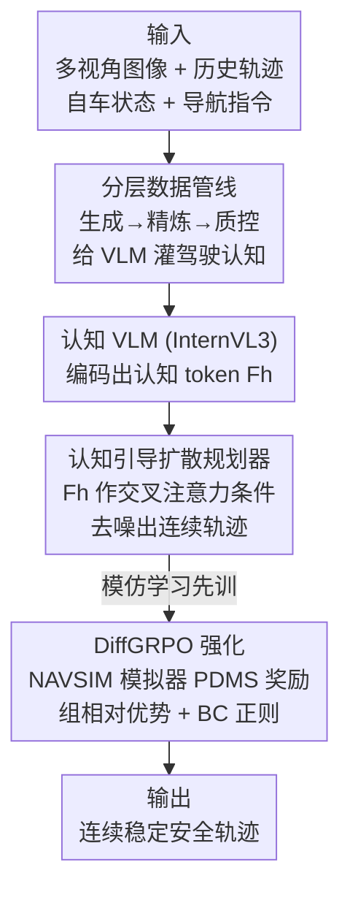

# ReCogDrive: A Reinforced Cognitive Framework for End-to-End Autonomous Driving

**会议**: ICLR 2026  
**OpenReview**: [https://openreview.net/forum?id=JoXwhGbuMi](https://openreview.net/forum?id=JoXwhGbuMi)  
**代码**: https://github.com/xiaomi-research/recogdrive （ReCogDrive GitHub，⚠️ 仓库地址以原文为准）  
**领域**: 端到端自动驾驶 / 视觉语言模型 / 扩散规划 / 强化学习  
**关键词**: 端到端驾驶, VLM 认知先验, 扩散规划器, DiffGRPO, NAVSIM

## 一句话总结
ReCogDrive 用「认知 VLM + 扩散规划器」取代「把轨迹当文本生成」的范式：先用分层数据管线把人类驾驶认知灌进 VLM，再把 VLM 的隐状态作为条件喂给扩散规划器输出连续轨迹，最后用一个为扩散策略量身定制的 DiffGRPO 强化学习阶段在 NAVSIM 模拟器里优化安全与舒适，在 NAVSIM（PDMS 90.8）和 Bench2Drive 上双双刷到 SOTA，并比纯文本输出快 3.5×。

## 研究背景与动机
**领域现状**：端到端自动驾驶把感知、预测、规划串成一条可联合优化的管线，在开环评测上表现亮眼；近期为了解决长尾场景泛化差的问题，大量工作引入视觉语言模型（VLM），借其互联网级世界知识和因果推理能力。这些 VLM 方案分两类——双系统（VLM 出低频轨迹/高层指令引导一个端到端系统）和单系统（VLM 直接回归未来轨迹）。

**现有痛点**：单系统的主流做法是把轨迹规划重写成「语言建模」任务，让 VLM 以文本形式自回归吐出轨迹点。这带来三个硬伤：(1) **预训练知识的领域鸿沟**——VLM 学的是通用网络数据，缺驾驶所需的精细知识；(2) **轨迹生成的模态错配**——VLM 离散的语言空间和规划需要的连续动作空间本质冲突，自回归解码的概率特性会产出物理不可行甚至格式错误（无法解析）的轨迹；(3) **模仿学习的次优策略**——重度依赖行为克隆，在罕见场景下容易收敛到不安全的次优解。

**核心矛盾**：语言空间和动作空间的根本不匹配，加上「只会模仿专家、不会探索更优解」，让纯文本 VLM 规划又慢、又可能不可行、还不够安全。

**本文目标**：在保留 VLM 认知/推理能力的同时，(a) 补上驾驶领域知识，(b) 把认知表征翻译成连续稳定的轨迹，(c) 让规划器能突破专家数据去探索更安全的行为。

**切入角度**：作者把「理解」和「规划」解耦又统一——VLM 负责认知（输出隐状态作为驾驶先验），扩散规划器负责把先验解码成连续轨迹，再用强化学习给规划器一个超越模仿的优化信号。

**核心 idea**：用「认知 VLM 的隐状态 → 扩散规划器 → DiffGRPO 强化」这条流水线，替换「VLM 把轨迹当文本写出来」的旧范式。

## 方法详解

### 整体框架
ReCogDrive 的输入是多视角相机图像、历史轨迹、自车状态（速度/加速度）和高层导航指令，输出是未来若干秒的连续轨迹 $\{(x_t, y_t, \theta_t)\}_{t=1}^{T}$（带朝向角，用于构造碰撞评估的有向车体多边形）。整条管线分三段训练：先用分层数据管线把 VLM 适配成「会驾驶认知」的骨干；再把 VLM 编码出的认知 token 作为条件，训练一个扩散规划器把先验解码成轨迹（模仿学习阶段）；最后用 DiffGRPO 在 NAVSIM 模拟器里给规划器做强化学习，优化碰撞/可行驶区域/舒适等真实指标。VLM 用 InternVL3 作骨干，它编码图文得到隐状态 $F_h$，既作为扩散 Transformer 的交叉注意力条件，又通过均值池化得到全局语义嵌入 $\bar F_h$ 提供稳定上下文。

### 关键设计

**1. 可扩展分层数据管线：给通用 VLM 补上人类驾驶认知**

针对痛点 (1) 的领域鸿沟，作者不直接拿通用 VLM 硬上，而是自动构造一个大规模、分层的驾驶 VQA 数据集（752K 自动标注问答 + 2.3M 开源驾驶数据），灌进 VLM 做驾驶预训练。管线分三阶段：**生成（Generation）** 阶段模仿人类司机的认知顺序，组织成四个层级——L1 基础感知（静/动态场景元素、3D 检测、弱势道路使用者、交通状态）、L2 动态理解（多智能体动力学、近期行为预测）、L3 规划与推理（可执行且安全的驾驶计划 + 简明理由）、L4 高级推理（反事实分析、细粒度权衡、空间推理）；客观任务用真值标注，主观任务用一个强 VLM 标注。**精炼（Refinement）** 阶段整合开源数据集，做归一化、改写和问题模板增广，保证语言和语义一致。**质控（Quality Control）** 阶段按语言准确性、视觉清晰度等做自动评分和过滤，只留高质量样本。这一层级化设计的价值在于：它把「驾驶认知」拆成从感知到反事实推理的递进梯度，让 VLM 学到的不是零散问答而是结构化的人类决策链，消融显示它单独带来 +1.7 PDMS。

**2. 认知引导扩散规划器：用隐状态而非文本搭起认知与连续动作的桥**

针对痛点 (2) 的模态错配，作者放弃让 VLM 写文本轨迹，改用扩散规划器把 VLM 的潜在语义表征解码成连续轨迹。形式上，给定带噪轨迹 $x_t \in \mathbb{R}^{N\times 3}$，去噪步为 $x_{t-1} = D_{act}\big(\text{DiT}_\theta(z_t; F_h; S_{ego}; t)\big)$，其中融合潜变量 $z_t = \text{concat}\big(E_{act}(x_t), E_{his}(I_{hist}), \bar F_h\big)$ 把「带噪动作潜变量、历史轨迹潜变量、VLM 语义先验」拼在一起。扩散网络以 $L_{dif} = \mathbb{E}_{z_t,c}\|\epsilon - \epsilon_\pi(z_t, c)\|^2$ 训练，条件 $c=\{F_h, S_{ego}\}$。规划器主干是 DiT 块，每块交替做自注意力（建模轨迹点两两关系）和交叉注意力（把语义先验 $F_h$ 注入轨迹空间），并加了一批轻量但有效的改进：SwiGLU FFN 提升非线性表达、RoPE 做相对位置编码、QK-Norm 和 RMSNorm 稳训练；自车状态 $S_{ego}$ 通过 AdaLN 调制注入。关键在于：VLM 隐状态作为「认知 token」直接做交叉注意力条件，绕开了离散文本这个瓶颈，既消除了格式错误（Tab. 4 错误率从纯文本仍非零降到 0.00%），又把推理从自回归换成一次前向去噪，带来 3.5× 提速；消融显示扩散规划器相比文本/MLP/query 解码再 +2.4 PDMS。

**3. DiffGRPO：为扩散策略定制的组相对策略优化，让规划器超越模仿**

针对痛点 (3) 的模仿次优，作者引入 DiffGRPO。动机很具体：在罕见的路口转弯场景里专家轨迹本身是多模态的，模仿学习为了全局最优会去学一条「平均轨迹」，结果既不像任何一条专家轨迹、又容易撞或开出可行驶区域。DiffGRPO 把扩散策略 $\pi_\theta$ 看成一个内部马尔可夫决策过程——从高斯噪声出发逐步去噪生成完整轨迹链 $x=(x_T, \dots, x_0)$，每个去噪步是高斯策略 $\pi_\theta(x_{t-1}|x_t)=\mathcal{N}(x_{t-1}; \mu_\theta(x_t,t), \sigma_t^2 I)$。它之所以选 GRPO，是因为 GRPO 天然采样一组候选轨迹，恰好契合「同一场景+同一高层意图下存在多条可行真值轨迹」的驾驶特性。具体地，采 $G$ 条轨迹，每条整体作为一个复合动作，在 NAVSIM 模拟器里评测碰撞、可行驶区域合规、舒适等并聚合成 PDMS 作奖励 $r_i$，再算组内标准化优势 $\hat A_i = (r_i - \mu)/\sigma$。最终损失把策略梯度项 $L_{RL}$ 和一个防探索崩溃的行为克隆正则 $L_{BC}$ 加权相加：

$$L = -\frac{1}{G}\sum_{i=1}^{G}\frac{1}{T}\sum_{t=1}^{T}\gamma^{t-1}\log\pi_\theta\big(x_{t-1}^{(i)}|x_t^{(i)}\big)\hat A_i \;-\; \lambda\,\frac{1}{G}\sum_{i=1}^{G}\frac{1}{T}\sum_{t=1}^{T}\log\pi_\theta\big(\tilde x_{t-1}^{(i)}|\tilde x_t^{(i)}\big)$$

其中 $\gamma$ 是缓解早期去噪步不稳的折扣系数，$\lambda$ 是 BC 权重，$\tilde x$ 采自参考策略 $\pi_{ref}$。作者省去 PPO 式裁剪并把更新迭代设为 1（即 $\pi=\pi_{old}$）。与用简单 $\ell_2$ 轨迹距离作代理奖励的前作不同，这里用真实模拟器反馈，消融显示 DiffGRPO 把 PDMS 从 86.5 推到 90.8（+4.3），且比 REINFORCE/DPPO 收敛更快更稳（EP 从 ~82.9 跳到 87.3）。

### 损失函数 / 训练策略
三阶段训练：(1) **驾驶预训练**——用分层 VQA 数据把 InternVL3 适配成认知骨干；(2) **模仿学习**——固定/微调 VLM，用 $L_{dif}$ 训练扩散规划器拟合专家轨迹；(3) **DiffGRPO 强化学习**——在完整 NAVSIM 上用 PDMS 奖励 + BC 正则优化规划器（损失见式 12）。

## 实验关键数据

### 主实验

NAVSIM navtest 闭环指标（仅用相机输入）：

| 方法 | 输入 | DAC↑ | EP↑ | PDMS↑ |
|------|------|------|-----|-------|
| PARA-Drive | Cam | 92.4 | 79.3 | 84.0 |
| DiffusionDrive | Cam+Lidar | 96.2 | 82.2 | 88.1 |
| WoTE | Cam+Lidar | 96.8 | 81.9 | 88.3 |
| AutoVLA | Cam | 95.6 | 81.9 | 89.1 |
| InternVL3-8B†（复现） | Cam | 92.4 | 78.9 | 83.3 |
| **ReCogDrive** | **Cam** | **97.3** | **87.3** | **90.8** |

ReCogDrive 仅用相机就以 90.8 PDMS 刷到 SOTA，超过用相机+LiDAR 的 DiffusionDrive/WoTE 各 2.7/2.5，比复现的 InternVL3 直接训轨迹高 7.5。Bench2Drive（CARLA 闭环）上成功率 45.45%、Driving Score 71.36，急刹 69.09%、交通标志合规 71.34，均居前列。

### 消融实验

组件消融（Tab. 3，NAVSIM）：

| 配置 | DAC | EP | PDMS | 说明 |
|------|-----|-----|------|------|
| 仅轨迹训练 | 91.3 | 77.2 | 82.4 | InternVL3 直接训轨迹 |
| + 驾驶预训练 | 93.1 | 79.1 | 84.1 | 灌入认知 QA，+1.7 |
| + 扩散规划器 | 94.7 | 80.9 | 86.5 | 连续轨迹，+2.4 |
| + DiffGRPO | 97.3 | 87.3 | 90.8 | 强化学习，+4.3 |

轨迹生成方式对比（Tab. 4）：纯文本输出 1.07s/样本、PDMS 84.1 且仍有 0.01% 格式错误；换成扩散规划器后约 0.31s、PDMS 逐项加架构改进升到 86.5、格式错误 0.00%，整体 3.5× 提速 + 2.4 PDMS。RL 算法对比（Tab. 6）：DiffGRPO 90.8 > DPPO/REINFORCE 89.5，EP 优势最明显（87.3 vs ~82.9）。

### 关键发现
- 贡献最大的单一组件是 DiffGRPO（+4.3 PDMS），且主要拉动的是 EP（自车进度）和 DAC（可行驶区域合规），印证「模仿学不会的安全/进度权衡要靠 RL 探索」。
- 模态从「文本」换成「扩散」同时解决了速度（3.5×）、可行性（格式错误归零）和精度（+2.4）三件事，是性价比最高的一步。
- DiffGRPO 用真实模拟器 PDMS 而非 $\ell_2$ 代理奖励，训练曲线收敛更快更稳——奖励信号的「真实性」比 RL 算法形式更关键。

## 亮点与洞察
- **把 VLM 隐状态当「认知 token」而非文本**：这是全文最巧的一刀——既留住 VLM 的世界知识，又彻底绕过离散语言空间，让连续轨迹生成既快又不会格式崩。这个「隐状态做条件」的思路可迁移到任何「LLM/VLM 输出需要落到连续控制空间」的任务（机器人、操作臂）。
- **DiffGRPO 把扩散去噪链看成 MDP**：把整条去噪轨迹当一个复合动作、用 PDMS 当单步奖励，是 GRPO 向扩散策略迁移的一个干净落地，且 group 采样天然契合「一个场景多条可行轨迹」的多模态性。
- **分层认知数据管线**：用「感知→动态理解→规划→反事实」四级模仿人类司机的认知顺序去造数据，比一锅乱炖的驾驶 QA 更能教会 VLM 决策链。

## 局限与展望
- 强化阶段强依赖 NAVSIM 模拟器给 PDMS 奖励，奖励质量受限于模拟器保真度；模拟器和真实世界的差距可能让学到的「安全」在真车上打折。
- DiffGRPO 省掉了 PPO 裁剪并把更新迭代设为 1，靠 BC 正则防崩，这在更大探索幅度或更长训练下是否稳定，论文未充分压力测试。
- 752K 自动标注问答的主观部分由另一个强 VLM 生成，标注 VLM 自身的偏差/幻觉可能被蒸馏进认知骨干。
- 闭环评测主要在 NAVSIM 和 CARLA Bench2Drive，真实道路长尾的实车验证仍缺。

## 相关工作与启发
- **vs 双系统（DriveVLM / Senna）**: 它们让 VLM 出低频轨迹或高层指令再引导一个端到端系统；ReCogDrive 是单一框架，VLM 只出认知先验、轨迹由扩散规划器一次去噪生成，更紧凑也更快。
- **vs 单系统文本范式（GPT-Driver / EMMA）**: 它们把轨迹当语言建模、靠 CoT 提升可解释性，但慢且会格式崩；ReCogDrive 保留 CoT 认知的同时用扩散输出连续轨迹，3.5× 提速且格式错误归零。
- **vs 扩散规划（DiffusionDrive / GoalFlow / Diffusion Planner）**: 它们用锚点/目标点/未来生成做实时多模态规划；ReCogDrive 的差异是用 VLM 世界知识引导扩散过程，并叠加 DiffGRPO 强化。
- **vs 驾驶 RL（RAD / AlphaDrive / Drive-R1 / TrajHF）**: 多数用 GRPO 增强 VLM 策略或在 3DGS 环境训练；ReCogDrive 首次把 GRPO 适配到扩散规划器（DiffGRPO），并用模拟器 PDMS 取代 $\ell_2$ 代理奖励。

## 评分
- 新颖性: ⭐⭐⭐⭐⭐ 「认知 VLM 隐状态 + 扩散规划器 + DiffGRPO」三件套组合干净，DiffGRPO 是扩散策略 RL 的一个原创落地。
- 实验充分度: ⭐⭐⭐⭐⭐ NAVSIM/Bench2Drive 双榜 SOTA + 组件/速度/RL 算法三类消融 + DriveVQA 验证，覆盖全面。
- 写作质量: ⭐⭐⭐⭐ 动机三痛点对应三创新结构清晰，公式完整；部分架构细节（如 AdaLN/编码器维度）略简。
- 价值: ⭐⭐⭐⭐⭐ 给「VLM 落到连续驾驶动作」提供了一条又快又稳的范式，对端到端驾驶和 VLA 都有借鉴价值。

<!-- RELATED:START -->

## 相关论文

- [\[ICLR 2026\] VADv2: End-to-End Vectorized Autonomous Driving via Probabilistic Planning](vadv2_end-to-end_vectorized_autonomous_driving_via_probabilistic_planning.md)
- [\[ICLR 2026\] ResWorld: Temporal Residual World Model for End-to-End Autonomous Driving](resworld_temporal_residual_world_model_for_end-to-end_autonomous_driving.md)
- [\[CVPR 2026\] ResAD: Normalized Residual Trajectory Modeling for End-to-End Autonomous Driving](../../CVPR2026/autonomous_driving/resad_normalized_residual_trajectory_modeling_for_end-to-end_autonomous_driving.md)
- [\[ICML 2026\] RoCA: Robust Cross-Domain End-to-End Autonomous Driving](../../ICML2026/autonomous_driving/roca_robust_cross-domain_end-to-end_autonomous_driving.md)
- [\[ICLR 2026\] DriveMamba: Task-Centric Scalable State Space Model for Efficient End-to-End Autonomous Driving](drivemamba_task-centric_scalable_state_space_model_for_efficient_end-to-end_auto.md)

<!-- RELATED:END -->
