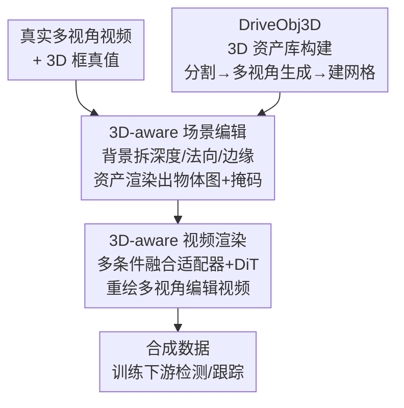

# Rethinking Driving World Model as Synthetic Data Generator for Perception Tasks

**会议**: ICLR 2026  
**OpenReview**: [https://openreview.net/forum?id=z3cFADf6zZ](https://openreview.net/forum?id=z3cFADf6zZ)  
**代码**: https://wm-research.github.io/Dream4Drive/ (项目页)  
**领域**: 自动驾驶 / 世界模型 / 合成数据  
**关键词**: 驾驶世界模型, 合成数据, 3D 感知, 视频编辑, 数据增强

## 一句话总结
本文指出过去用驾驶世界模型造合成数据的实验"训练 epoch 不公平"，并提出 Dream4Drive——把真实视频拆成稠密的 3D-aware 引导图、再把 3D 资产渲染进去微调世界模型生成多视角编辑视频，在 epoch 对齐的公平比较下，只加不到 2% 的合成样本就能稳定提升 3D 检测与跟踪。

## 研究背景与动机

**领域现状**：自动驾驶的 3D 检测、3D 跟踪严重依赖大规模标注数据，而长尾的安全关键场景（corner case）采集和标注极其昂贵。为此社区转向用驾驶世界模型造合成数据：早期方法用 diffusion + ControlNet，以 BEV 地图、3D 框作条件生成配对图像；近期换成更强的 Diffusion Transformer (DiT) 提升画质。

**现有痛点**：作者归纳出三类方法各有硬伤。一是布局生成类方法依赖原始场景布局，对物体位姿/外观控制弱、几何多样性差，难造高质量长尾 corner case；二是基于参考图 + 3D 框的编辑插入类方法多为单视角，无法服务多视角 BEV 感知；三是基于 NeRF/3DGS 的重建类方法虽有几何控制，但稀疏视角下有伪影、缺光照建模，插入物体与背景不一致。

**核心矛盾**：更关键的是评测本身不公平。以往数据增强普遍采用"先在合成数据上预训练、再在真实数据上微调"的策略，这相当于把训练 epoch 翻倍。作者发现，一旦把 baseline 也训练同样多的 epoch，合成数据的收益几乎消失——在 2× epoch 下，纯真实数据训练的模型 mAP 和 NDS 反而高于真实+合成混合训练。也就是说，过去"合成数据有用"的结论可能只是 epoch 红利。

**本文目标**：在 epoch 严格对齐的公平设定下，重新检验并真正坐实合成数据的价值，同时拿出一个能可控批量生成多视角 corner case 的生成框架。

**切入角度**：与其用稀疏的 3D 框/BEV 隐式控制物体放在哪，不如直接在 3D 空间里编辑——把视频分解成稠密的 3D-aware 引导图（深度、法向、边缘、物体图、掩码），让世界模型据此渲染编辑后的视频，既保住原背景的几何外观，又能把任意 3D 资产以任意轨迹塞进场景。

**核心 idea**：用"分解成稠密 3D-aware 引导图 + 渲染 3D 资产 + 微调世界模型重绘"替代"3D 框稀疏条件直接生成"，在公平 epoch 下用 <2% 合成数据撬动感知性能。

## 方法详解

### 整体框架

Dream4Drive 的目标是：给定一段带 3D 框真值标注的真实多视角视频和一个目标 3D 资产，生成可直接用于训练下游感知模型的合成视频。整条管线分两大步：先做 **3D-aware 场景编辑**（把背景拆成稠密引导图、把目标资产渲染进 3D 空间得到物体图与掩码），再做 **3D-aware 视频渲染**（用多条件融合适配器把五路引导图喂进 DiT，重绘出多视角、跨视角一致的逼真编辑视频）。资产本身来自单独构建的 **DriveObj3D** 3D 资产库。整个训练不需要昂贵的 3D 标注，只要 RGB 视频和现成工具实时生成的引导图即可。

### 关键设计

**1. 公平比较：epoch 对齐戳破合成数据的虚假收益**

这是全文的立论起点而非工程模块。作者观察到 Panacea、SubjectDrive 等方法报告的增益建立在"合成预训练 + 真实微调"上，等于偷偷把 baseline 的训练量翻倍。作者把 baseline 也补到 2×、3× epoch 后重测：纯真实数据在 2× 下就能反超混合数据。基于此，本文所有实验都在 1×/2×/3× 同一 epoch 预算下对比，并据此重新定义"合成数据有用"的判据——只有在 epoch 对齐时仍带来提升才算数。正是在这个更苛刻的尺子下，Dream4Drive 用 420 个样本（<2% 真实样本量）超过了用全量合成数据的旧方法，并首次让合成数据在 epoch 相等时超过纯真实数据。

**2. 3D-aware 场景编辑：用稠密引导图替代稀疏框做几何控制**

针对"3D 框/BEV 太稀疏、控不住物体精确位姿和外观"的痛点，本文不再把 3D 框 embedding 当条件，而是直接在 3D 空间编辑。对输入 RGB 图 $I \in \mathbb{R}^{H \times W \times 3}$，用 Depth Anything 取深度图 $D$，由深度推法向图 $N$，用 OpenCV Canny 取边缘图 $E$；前景物体区域内的深度/法向/边缘都被掩掉，逼模型学会"按目标资产重新生成前景"。对目标 3D 资产，按给定 3D 框 $\{B_i\}_{i=1}^{T}$ 放入原视频 3D 空间，再用标定的相机内参 $K_v$、外参 $E_v$ 逐帧逐视角渲染，得到物体图 $O$ 和物体掩码 $M$。这样得到的引导集 $\mathcal{C} = \{D, N, E, O, M\}$ 把资产的精确位姿、几何、纹理都编码进去，保证生成结果几何一致——本质是用"在 3D 空间放好再投影成稠密图"取代"让网络从稀疏框里猜位置"，更直观也更可靠。

**3. 3D-aware 视频渲染：多条件融合适配器驱动 DiT 重绘**

得到五路引导图后，需要让世界模型据此生成既逼真又跨视角一致的视频。本文从 Diffusion Transformer 微调出一个多视角视频 inpainting 模型，核心是多条件融合适配器：先用 VAE 编码五路条件，再用各自的 3D embedder 做 patchify，然后由 FusionNet 沿通道拼接后融合：

$$F_{\text{fusion}} = \text{FusionNet}\left(\bigoplus_{k=1}^{5} \text{3DEmbedder}_k(\text{VAE}(C_k))\right),\quad C_k \in \{D, N, E, O, M\}$$

融合特征注入 DiT 的 control block（权重从 base block 拷贝），再汇入 base block，从而带来实例级空间对齐、时序一致与语义保真；额外的跨视角注意力（spatial view attention）增强多相机一致性，这对驾驶场景尤为关键。采样上用 rectified flow 稳定生成、用 classifier-free guidance 平衡文本与多路几何条件。训练目标在标准扩散 loss $L_{\text{diffusion}} = \mathbb{E}_{t,z_0,\epsilon}\big[\|\epsilon - \epsilon_\theta(z_t,t,c)\|^2\big]$ 之外，叠加前景 Mask Loss 和 LPIPS loss 做实例级精控：$L_{\text{total}} = \lambda_{\text{diffusion}} L_{\text{diffusion}} + \lambda_{\text{mask}} L_{\text{mask}} + \lambda_{\text{lpips}} L_{\text{LPIPS}}$，权重经验设为 $1.0/0.1/0.1$。

**4. DriveObj3D：自动造高质量驾驶 3D 资产库以撑起多样性**

合成场景的多样性上限由资产库决定，因此本文用一条三步管线自动造资产：(i) 2D 实例分割——用 Grounded-SAM 按类别标签从场景图/视频里定位并裁出目标 $I_{\text{target}}$；(ii) 多视角图像生成——用 Qwen-Image 以 $I_{\text{target}}$ 为条件合成多视角图 $\{I_v\}_{v=1}^{N}$，以克服遮挡；(iii) 3D 网格生成——把多视角图喂进 Hunyuan3D 重建出最终 3D mesh。相比 Text-to-3D 方法（如 Trellis）风格与驾驶数据不符、单视角方法（单图 Hunyuan3D）易残缺，本文靠多视角合成即便重遮挡也能得到完整高保真资产。最终构建出覆盖 barrier、bicycle、bus、car、construction vehicle、motorcycle、pedestrian、traffic cone、trailer、truck 等驾驶典型类别的大规模资产集 DriveObj3D 并公开。

### 损失函数 / 训练策略

训练只需 RGB 视频及其 3D-aware 引导图，无需昂贵 3D 标注，引导图可用现成工具实时生成，显著降低成本。损失即上文 $L_{\text{total}}$，由扩散 loss、前景 Mask Loss、LPIPS loss 加权组成（$\lambda$ 分别为 1.0、0.1、0.1）。

## 实验关键数据

数据集为 nuScenes（700/150/150 训练/验证/测试，每场景 20 秒 6 相机多视角视频）；检测指标用 NDS/mAP/mAOE/mAVE，跟踪用 AMOTA/AMOTP/MOTA/Recall。合成样本固定只加 420 个（<2% 真实样本量）。

### 主实验

低分辨率（256×512）检测，对齐 1× epoch：

| 方法 | 样本 | mAP ↑ | mAVE ↓ | NDS ↑ |
|------|------|-------|--------|-------|
| Real | 28130 | 34.5 | 29.1 | 46.9 |
| DriveDreamer | — | 35.8 | – | 39.5 |
| MagicDrive | — | 35.4 | – | 39.8 |
| Panacea | — | 37.1 | 27.3 | 49.2 |
| SubjectDrive | — | 38.1 | 26.4 | 50.2 |
| **Dream4Drive** | +420 | **36.1**(1×)/**38.7** | 28.9/26.8 | 47.8/**50.6** |

注：Panacea/SubjectDrive 的高分对应 2× epoch；在 1× 同 epoch 下，Dream4Drive 仅 +420 样本即把 mAP 从 34.5 提到 36.1、NDS 47.8，并在 2× 设定下达到 mAP 38.7 / NDS 50.6，超过用全量合成数据的旧方法。跟踪（Tab.2）AMOTA 从 30.1→31.2（1×），2× 达 34.4。

高分辨率（512×768）检测，跨 1×/2×/3×：

| 配置 | mAP ↑ | NDS ↑ |
|------|-------|-------|
| Real (1×) | 36.1 | 47.9 |
| Naive Insert (1×) | 40.1 | 51.3 |
| **Dream4Drive (1×)** | **40.7** | **52.0** |
| Real (3×) | 43.1 | 53.6 |
| **Dream4Drive (3×)** | **44.5** | **55.0** |

高分辨率下增益更大：1× 时仅 420 样本带来 mAP +4.6（12.7%）、NDS +4.1（8.6%），增益主要来自 bus、construction vehicle、truck 等大车类别。关键是无论 1×/2×/3×，Dream4Drive 都稳定超过纯真实数据，打破了"epoch 对齐后合成数据无用"的旧结论。

### 消融实验

| 维度 | 配置 | mAP ↑ | NDS ↑ | 结论 |
|------|------|-------|-------|------|
| 插入视角 | 左 vs 右 | 40.2 vs 39.8 | 51.6 vs 50.7 | 左侧增益更大（mAOE 也降 5.7）|
| 插入距离 | 近 / 中 / 远 | 39.7/40.3/40.5 | 50.5/50.9/51.3 | 远处插入最有效 |
| 资产来源 | Trellis/Hunyuan3D/Ours | 39.8/40.2/40.7 | 50.8/50.9/52.0 | 本文多视角资产最优 |
| 渲染方式 | Naive Insert vs Ours(1×) | 40.1 vs 40.7 | 51.3 vs 52.0 | 生成式重绘补足阴影反光 |

### 关键发现
- **复制原布局没用，插入新 3D 资产才有效**：单纯复刻原始布局造合成数据不提升性能，靠插入新资产丰富场景才是有效增强策略。
- **远处插入优于近处**：检测器本就难处理远处物体，增多远处样本能针对性补强；近处插入易遮挡相机视野、干扰其他实例训练，反而掉点。
- **数据集偏置可被利用**：左侧插入收益大于右侧（左侧本就车多），说明强化高频 corner case 比强化稀有侧更划算，也暴露 nuScenes 的左右偏置。
- **资产同源缩小域差**：用与训练集同源、风格一致的资产能缩小合成-真实域差；Trellis 风格不匹配引入伪影，单视角 Hunyuan3D 资产易残缺。
- **高分辨率收益更大**，且生成式重绘相比直接投影（naive insert）能补上阴影、反光等真实感（但 naive insert 因资产与原框朝向完全对齐反而 mAOE 最低）。

## 亮点与洞察
- **"重测 baseline"式的诚实立论**：论文最值钱的不是模型，而是揭穿了"合成预训练+真实微调"偷加 epoch 的评测漏洞，并把所有比较拉回同 epoch 预算——这是一个能直接迁移到所有"合成数据有没有用"研究的方法论提醒。
- **稠密 3D-aware 引导图替代稀疏 3D 框**：把"放在哪/什么姿态"从网络要猜的隐式条件，变成在 3D 空间放好资产再投影成深度/法向/边缘/物体图/掩码的显式稠密信号，几何可控且跨视角一致，思路可迁移到任何需要可控插入的视频编辑任务。
- **<2% 样本撬动性能**：420 个精心编辑的 corner case 胜过全量合成数据，提示"数据增强的质量与针对性远比数量重要"。

## 局限与展望
- 实验只在 nuScenes 上验证，资产同源带来的"低域差"优势在跨数据集/跨城市场景能否保持存疑。
- 增益高度依赖插入策略（视角/距离/来源），需要人工或启发式选择放置位置，论文也承认这些选择利用了数据集偏置——换数据集时偏置方向可能反转。
- 引导图依赖 Depth Anything、Grounded-SAM、Qwen-Image、Hunyuan3D 等多个现成大模型串联，任一环出错（如深度估计在远处不准）都会污染合成数据，鲁棒性边界未充分讨论。
- 只评测了检测与跟踪，对规划、端到端等更下游任务的收益未验证。

## 相关工作与启发
- **vs Panacea / SubjectDrive（布局生成类）**: 它们依赖原始场景布局、用 BEV+3D 框稀疏控制生成，几何多样性受限且评测靠加 epoch；本文用稠密引导图在 3D 空间显式编辑，并在 epoch 对齐下证明真实增益。
- **vs 物体插入编辑类（如 MObI/参考图+3D 框）**: 它们多为单视角、难服务多视角 BEV 感知；本文天生多视角且跨视角一致。
- **vs NeRF/3DGS 重建类**: 它们几何可控但稀疏视角有伪影、缺光照；本文用生成式重绘补足阴影反光，realism 更好。
- **vs Naive Insert（直接投影）**: 直接投影虽优于纯真实数据，但缺真实感，性能逊于本文生成式渲染（mAOE 例外，因朝向与原框完全对齐）。

## 评分
- 新颖性: ⭐⭐⭐⭐ 稠密 3D-aware 引导图 + 公平评测重审视，组合新颖且有方法论价值
- 实验充分度: ⭐⭐⭐⭐ 跨 1×/2×/3× epoch、双分辨率、检测+跟踪、多维消融，较系统
- 写作质量: ⭐⭐⭐⭐ 立论清晰、图表完整，pipeline 讲解到位
- 价值: ⭐⭐⭐⭐ 戳破合成数据评测漏洞 + 公开 DriveObj3D 资产库，对社区实用

<!-- RELATED:START -->

## 相关论文

- [\[ICCV 2025\] Unraveling the Effects of Synthetic Data on End-to-End Autonomous Driving](../../ICCV2025/autonomous_driving/unraveling_the_effects_of_synthetic_data_on_end-to-end_autonomous_driving.md)
- [\[CVPR 2026\] ClimaOoD: Improving Anomaly Segmentation via Physically Realistic Synthetic Data](../../CVPR2026/autonomous_driving/climaood_improving_anomaly_segmentation_via_physically_realistic_synthetic_data.md)
- [\[ICLR 2026\] DriveVLA-W0: World Models Amplify Data Scaling Law in Autonomous Driving](drivevla-w0_world_models_amplify_data_scaling_law_in_autonomous_driving.md)
- [\[ECCV 2024\] Reliability in Semantic Segmentation: Can We Use Synthetic Data?](../../ECCV2024/autonomous_driving/reliability_in_semantic_segmentation_can_we_use_synthetic_data.md)
- [\[ICLR 2026\] ResWorld: Temporal Residual World Model for End-to-End Autonomous Driving](resworld_temporal_residual_world_model_for_end-to-end_autonomous_driving.md)

<!-- RELATED:END -->
