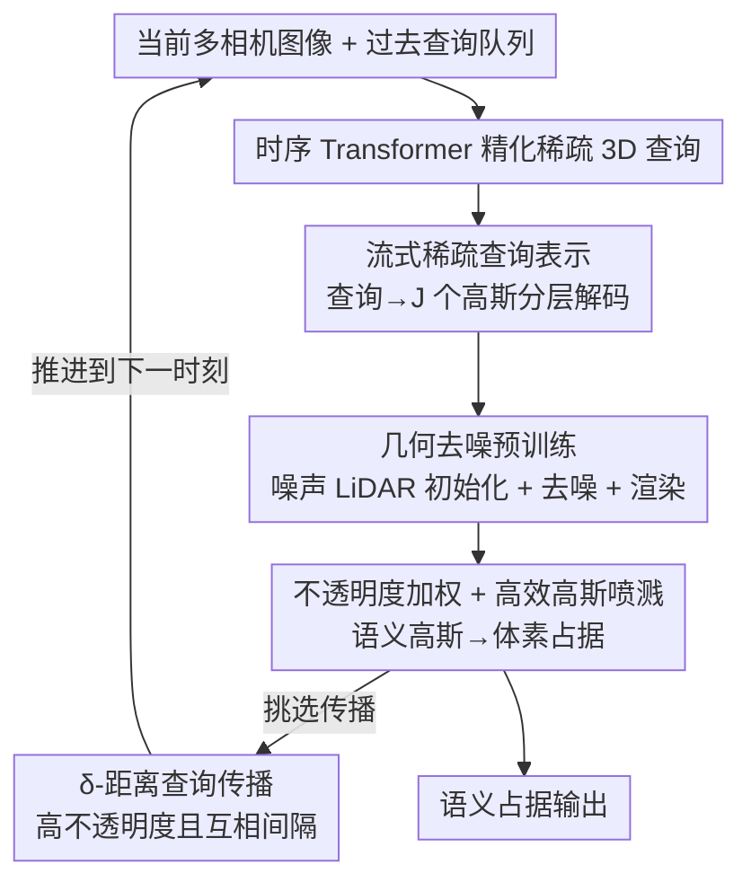

# S2GO: Streaming Sparse Gaussian Occupancy

**会议**: ICLR 2026  
**OpenReview**: [https://openreview.net/forum?id=z8ggdMlSco](https://openreview.net/forum?id=z8ggdMlSco)  
**领域**: 3D视觉 / 自动驾驶 / 占据预测  
**关键词**: 3D占据预测, 稀疏查询, 语义高斯, 流式感知, 去噪预训练

## 一句话总结
S2GO 用一组约 1k 个的稀疏 3D 查询在线流式地概括驾驶场景，每一帧把查询解码成稠密语义高斯再"喷溅"成体素占据，并配一个几何去噪+渲染的预训练让稀疏查询学会移动到占据区域，在 nuScenes / KITTI 上比 GaussianWorld 提升 2.7 IoU 且推理快 4.5×（单卡 4090 实时 26 FPS）。

## 研究背景与动机

**领域现状**：视觉中心的自动驾驶缺少稠密 3D 几何先验，3D 语义占据估计因此成为补充检测、建图的关键任务。当前主流的占据方法要么基于规则体素网格（voxel/BEV），要么基于稠密高斯（GaussianFormer 系列），二者都能拿到高保真细节。

**现有痛点**：稠密表示又慢又不灵活。体素方法要在大量空旷区域做无谓计算、还会带来网格伪影；稠密高斯方法虽然把算力聚焦在占据区域，但动辄需要 2.56 万～14.4 万个高斯，而且因为全局建模代价太高只能退而用局部稀疏卷积，难以高效融合长时序历史，既拖累静态基础设施定位，也限制动态目标建模。

**核心矛盾**：稀疏的、基于查询的表示在检测里早已证明又快又好（DETR 系列），但把它搬到稠密、高保真的占据估计上有三道坎。其一，检测器用几百个查询覆盖约 30 个目标可直接做匈牙利匹配，而占据要覆盖整个场景，稀疏查询→稠密语义高斯的映射本质上是模糊的；其二，体素占据是在固定位置做分类，而查询要先"移动"到感兴趣区域再分类，这就有"鸡生蛋"问题——一个夹在车和路之间的查询该往哪挪，取决于它打算预测成哪个类；其三，越想稀疏越省，查询对齐占据区域就越难。

**本文目标**：用极少（~1k）的稀疏 3D 查询在线流式地概括并传播稠密 3D 世界，既要拿到高斯表示的高保真，又要拿到稀疏查询的高效与时序灵活性。

**切入角度**：作者观察到，纯靠占据标签去监督查询移动是"弱且模糊"的，查询根本学不会挪到占据处（见原文图 2，无预训练时查询几乎不动）。那不如先用一个有明确监督信号的几何去噪任务，把"查询如何在 3D 空间里自组织、移动到表面"这件事提前教会网络。

**核心 idea**：维护一个过去稀疏查询的队列，用历史查询+当前图像精化当前查询，再把查询分层解码成更密的语义高斯；并用"噪声 LiDAR 初始化 + 去噪 + 渲染"的预训练，让稀疏查询学会穿过空旷区、自组织铺到占据表面。

## 方法详解

### 整体框架

S2GO 是一个两阶段、流式的占据估计框架。每个时刻 $t$，场景被表示成一组稀疏 3D 查询 $Q_t=\{q_t^i\}_{i=1}^K$ 及其 3D 位置 $\{p_t^i\}$；当前查询用一个**过去查询队列** $\bar Q_t$ 和当前多相机图像特征 $F_t=\mathrm{CNN}(I_t)$ 经一个时序 Transformer（沿用 PETR / StreamPETR）精化，每个查询预测位置偏移 $o^i$、不透明度 $a^i$、速度 $v^i$，并派生出一簇更细的高斯。最后这些高斯被"喷溅"到附近体素得到语义占据，同时挑一部分查询推进到未来时刻，形成流式循环。

整套"图像→查询精化→高斯解码"的管线在两个阶段共享，区别只在监督目标：**Stage 1 几何去噪预训练**用噪声 LiDAR 初始化查询，靠去噪+深度/RGB 渲染教查询移动和高斯建几何（此时每个高斯独立预测颜色）；**Stage 2 占据估计**查询改为可学习初始化、推理只用 RGB 图像，高斯改为预测共享的语义类别并喷溅成体素占据，期间还引入了三处对高斯公式与喷溅算法的关键改进。

### 关键设计

**1. 流式稀疏查询 + 分层高斯解码：用 ~1k 查询概括并传播稠密世界**

针对"稠密表示慢、时序融合贵"的痛点，S2GO 不再直接维护几万个高斯，而是把场景压缩成约 1k 个稀疏 3D 查询，并让它们在时序上流式传播。每个查询不是直接当一个高斯用，而是**分层**地锚定一块空间区域、再在内部派生 $J$ 个细高斯。派生公式为
$$G_t = \{\{(p^i + o^i + o_j^i,\; v^i,\; r_j^i,\; s_j^i,\; a^i \cdot a_j^i)\}_{j=1}^{J}\}_{i=1}^{K}$$
即每个高斯的位置由"查询位置 $p^i$ + 查询偏移 $o^i$ + 高斯自身偏移 $o_j^i$"三者叠加，速度 $v^i$ 从父查询继承，不透明度则是查询级 $a^i$ 调制高斯级 $a_j^i$。这种"查询定区域、细高斯刻画局部结构"的分层分解，让稀疏查询既能携带长时序上下文做全局交互，又能保留高斯表示的高保真——这也是它能在更高语义层面区分实例、避免像 GaussianWorld 那样把临近物体合并的根因。

**2. 几何去噪与渲染预训练：教稀疏查询穿过空旷、自组织到表面**

这是全文最核心的设计，直击"稀疏查询对齐占据区域难"的痛点。直接拿占据标签训练效果很差，因为在稀疏框架里，一个查询是带着 $J$ 个高斯整体移动后细高斯才局部分叉，所以**查询本身必须先精确对齐几何**；而占据标签里场景部位与查询之间没有明确指派，监督既弱又模糊。作者为此设计了一个有明确监督的预训练：把查询初始化在**加了噪声的 LiDAR 点**上，
$$\{p^i\}_{i=0}^{K} = \mathrm{FPS}_K(\mathrm{pts}) + \epsilon,\quad \epsilon \sim U(-e, e)^{K\times 3}$$
然后用三项损失监督
$$L = \lambda_1 \sum_{i=1}^{K}\|\mathrm{FPS}_K(\mathrm{pts}_t) - (p_t^i + o_t^i)\| + \lambda_2 L_{\text{depth}}(G, D) + \lambda_3 L_{\text{rgb}}(G, I)$$
第一项是**去噪目标**，逼着查询从带噪位置回到真实 LiDAR 点，从而学会"从空旷移动到占据"；后两项把高斯渲染成深度图和 RGB（用预测速度 $v$ 把高斯移到 ±0.5s 的邻帧并补偿自车运动），教高斯刻画查询周围的细几何。这一步同时解决了三件事：监督高斯建模局部结构、让查询自组织均匀铺满场景、显式监督查询从空到占据移动。消融里这是唯一一个在同等算力下显著超过"不预训练"的初始化方式。

**3. 不透明度加权占据 + 高效高斯喷溅：修正高斯公式并把训练砍半**

针对沿用 GaussianFormer-2 喷溅框架带来的两个工程/建模缺陷。其一，原框架里不透明度只用于混合内部加权、对"某点是否被占据"毫无作用，于是空旷区的高斯会一边缩小尺度 $s$、把自己塞到体素中心之间以压低占据贡献，一边却保持很高不透明度，这种反常表示和渲染初始化冲突、伤性能。作者把占据概率直接乘上不透明度：
$$\alpha(x; G) = a\,\exp\!\Big(-\tfrac{1}{2}(x-m)^T \Sigma^{-1}(x-m)\Big)$$
这样空旷区高斯只需老实预测低不透明度，尺度监督也更稳定。其二，原喷溅没有利用"邻近体素处理相似高斯"的局部性，反向传播按高斯并行会在 64 万体素上随机访存。作者借鉴 3DGS，前向把体素分成 4×4×4 块协同加载邻近高斯，反向把线程绑到单个高斯以避免梯度原子操作——在 9k 高斯 / 640k 体素上前向加速 1.5×、反向加速 20.4×，显存降到约 1/3，训练时间直接砍半。

**4. δ-距离查询传播：在置信与覆盖之间取舍着挑查询进队列**

流式管线必须决定把哪些当前查询推进到未来。最直接是按不透明度选 top-k（传播最确信被占据的区域），但这样查询会随时间高度重叠、覆盖不足、浪费模型容量。作者改成：在高不透明度查询里，只挑彼此距离都大于阈值 $\delta$ 的那些，从而既保住高置信区域、又把查询摊开到整个场景。消融显示从"无传播"到"top-k 不透明度"再到"δ-距离 top-k"逐级提升（mIoU 17.92 → 19.94 → 20.51）。

### 损失函数 / 训练策略
两阶段各训练 12 个 epoch。Stage 1 用上文的去噪+深度+RGB 三项损失，查询从噪声 LiDAR 初始化；Stage 2 用真值语义占据监督喷溅后的体素，查询改为可学习初始化、推理只需 RGB。两阶段都对邻帧做监督，并用预测速度把动态区域先移动到位再施加监督。S2GO-Small 用 900 查询 × 10 高斯，S2GO-Base 用 1800 查询 × 20 高斯，骨干为 ResNet50。

## 实验关键数据

### 主实验

nuScenes-SurroundOcc 验证集（S2GO 用 256×704 低分辨率，基线用 900×1600，均在 4090 上测）：

| 方法 | IoU | mIoU | FPS |
|------|-----|------|-----|
| GaussianFormer-2 | 31.7 | 20.8 | 2.8 |
| QuadricFormer | 31.2 | 20.1 | 6.2 |
| GaussianWorld* | 32.8 | 21.8 | 4.4 |
| ALOcc-GF（grid SOTA） | 38.2 | 25.5 | 0.9 |
| **S2GO-Small** | 34.3 | 22.1 | 26.1 |
| **S2GO-Base** | 35.5 | 22.7 | 19.6 |

相比此前高斯 SOTA GaussianWorld，S2GO-Small 提升 1.5 IoU 且快 5.9×，S2GO-Base 提升 2.7 IoU 且快 4.5×。grid 方法 ALOcc-GF 虽 mIoU 最高，但仅 0.9 FPS 落在实时区间之外；S2GO 在实时区间提供了更优的精度-效率折中。

SSCBench-KITTI-360 测试集（单目）：

| 方法 | IoU | mIoU |
|------|-----|------|
| GaussianFormer | 35.4 | 12.9 |
| GaussianFormer-2 | 38.4 | 13.9 |
| **S2GO-Base** | 40.8 | 15.1 |

在单目占据设置下同样取得新 SOTA，显著超过 GaussianFormer-2。

### 消融实验

| 配置 | mIoU | IoU | 说明 |
|------|------|-----|------|
| 直接训占据 12 ep | 13.02 | 25.73 | 无预训练，监督模糊 |
| 直接训占据 24 ep | 15.83 | 28.35 | 同等算力对照 |
| 可学习初始化预训练 | 12.42 | 26.64 | 比不预训练还差 |
| LiDAR 初始化预训练 | 13.62 | 27.08 | 仅略好（查询未被监督移动） |
| LiDAR+ε 初始化 | 20.55 | 32.68 | 噪声初始化质变 |
| + 去噪损失（Full） | 21.60 | 33.91 | 完整预训练 |

| 模块 | mIoU / IoU | 说明 |
|------|-----------|------|
| 无传播 | 17.92 / 29.24 | 不用时序 |
| top-k 不透明度 | 19.94 / 32.03 | 易过度重叠 |
| δ-距离 top-k | 20.51 / 32.51 | 覆盖更广 |

### 关键发现
- **预训练初始化方式是成败关键**：可学习初始化的查询随机散布在 3D 空间、大多远离占据几何拿不到有效监督，反而比不预训练更差；精确放在 LiDAR 点上只监督了高斯没监督查询移动，仅略好；唯有"LiDAR+噪声"同时给查询和高斯有意义监督，mIoU 从 13 跳到 20.55，是唯一在同等算力下显著超过不预训练的方案。
- **去噪损失贡献明显**：深度监督已足够好，RGB 损失补充细节小幅提升，去噪监督带来最后一波显著增益（mIoU 20.55 → 21.60）。
- **速度建模在预训练阶段更重要**：在两阶段都加速度建模最好，其中预训练时的运动建模尤为关键；该模块还能自监督地外推未来占据。
- **不透明度加权 + 高效喷溅**既提性能又把 12 epoch 单卡训练时间砍半（前向 1.5×、反向 20.4× 加速）。

## 亮点与洞察
- **把检测里的"流式稀疏查询"真正搬进稠密占据**：用 ~1k 查询替代几万个高斯，分层解码同时拿到效率与高保真，思路干净且效果硬。
- **用"去噪"给稀疏查询造监督信号**：稀疏查询学不会移动的根因是占据标签监督太模糊，作者巧妙地把"噪声 LiDAR → 复原"当作一个有明确目标的几何预训练任务，等于先教会查询如何在 3D 里自组织，再去做占据——这个"先学几何、再学语义"的解耦很可迁移。
- **诊断出高斯喷溅里"不透明度不参与占据判定"的隐性缺陷**：空旷区高斯会缩尺度躲到体素缝里却保持高不透明度，作者一行公式把不透明度乘进占据概率就修好了，是很到位的工程洞察。
- δ-距离传播这种"置信×覆盖"的取舍策略，对任何流式查询型任务（建图、跟踪）都有借鉴价值。

## 局限与展望
- 预训练强依赖 LiDAR 点云做监督（仅训练用，推理不用），在没有 LiDAR 标注/采集的场景下该预训练范式难以直接套用。
- 性能仍落后于离线、非实时的 grid SOTA（ALOcc-GF mIoU 25.5 vs S2GO-Base 22.7），稀疏表示在追求极致精度时仍有差距，定位在实时高吞吐场景。
- 查询数、每查询高斯数、传播阈值 $\delta$、噪声幅度 $e$ 等超参较多，论文未充分展开其敏感性（部分放在附录）。
- 速度建模虽能外推未来占据，但长时序、复杂交互下的动态预测可靠性仍待验证。

## 相关工作与启发
- **vs GaussianFormer / GaussianFormer-2**：它们逐个精化几万个稠密高斯、用局部稀疏卷积；本文用 ~1k 稀疏查询分层派生高斯，全局交互更高效、时序传播更自然，IoU 与 FPS 双赢。
- **vs GaussianWorld**：同为流式，但 GaussianWorld 直接在低层高斯基元上操作、无对象级表示，局部卷积会把临近物体随时间合并；S2GO 在更高的查询语义层操作，能保持实例独立性。
- **vs QuadricFormer**：用二次曲面更高效，但仍需多达 1.28 万个独立基元；S2GO 查询数低一个量级。
- **vs StreamOcc / ALOcc 等 grid-query 方法**：它们靠体素与实例查询双向聚合拿高精度，但体素-查询交互计算昂贵、FPS 低；S2GO 纯查询路线换来实时吞吐。

## 评分
- 新颖性: ⭐⭐⭐⭐⭐ 把流式稀疏查询引入稠密占据，并用去噪预训练破解稀疏查询对齐难题，路线清晰原创。
- 实验充分度: ⭐⭐⭐⭐ nuScenes/KITTI 多基准 + 细致消融，唯精度仍逊于非实时 grid SOTA。
- 写作质量: ⭐⭐⭐⭐⭐ 三道挑战、动机、预训练设计层层递进，图 2 直观展示问题。
- 价值: ⭐⭐⭐⭐⭐ 实时占据（26 FPS）对量产视觉自动驾驶有直接落地价值。

<!-- RELATED:START -->

## 相关论文

- [\[CVPR 2026\] Generalizing Visual Geometry Priors to Sparse Gaussian Occupancy Prediction](../../CVPR2026/autonomous_driving/generalizing_visual_geometry_priors_to_sparse_gaussian_occupancy_prediction.md)
- [\[CVPR 2025\] GaussianWorld: Gaussian World Model for Streaming 3D Occupancy Prediction](../../CVPR2025/autonomous_driving/gaussianworld_gaussian_world_model_for_streaming_3d_occupancy_prediction.md)
- [\[ICCV 2025\] GaussianFlowOcc: Sparse and Weakly Supervised Occupancy Estimation using Gaussian Splatting and Temporal Flow](../../ICCV2025/autonomous_driving/gaussianflowocc_sparse_and_weakly_supervised_occupancy_estimation_using_gaussian.md)
- [\[CVPR 2026\] SparseWorld-TC: Trajectory-Conditioned Sparse Occupancy World Model](../../CVPR2026/autonomous_driving/sparseworld_tc_trajectory_conditioned_sparse_occupancy_world_model.md)
- [\[ECCV 2024\] Fully Sparse 3D Occupancy Prediction](../../ECCV2024/autonomous_driving/fully_sparse_3d_occupancy_prediction.md)

<!-- RELATED:END -->
