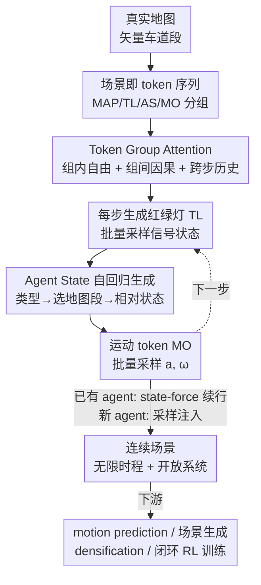

# SceneStreamer: Continuous Scenario Generation as Next Token Group Prediction

**会议**: ICLR 2026  
**OpenReview**: [https://openreview.net/forum?id=IWt4ERrdYp](https://openreview.net/forum?id=IWt4ERrdYp)  
**论文**: [项目页](https://vail-ucla.github.io/scenestreamer/)  
**代码**: 见项目页  
**领域**: 自动驾驶 / 交通场景生成  
**关键词**: 交通仿真, 自回归生成, token group prediction, 闭环仿真, 强化学习规划

## 一句话总结
SceneStreamer 把整个驾驶场景（地图、红绿灯、agent 状态、运动）编码成一条离散 token 序列，用单个自回归 Transformer 逐步"预测下一组 token"地生成它，从而能在无限时长里持续注入和退出 agent，做到真正开放系统的连续交通场景生成，并作为高保真仿真器显著提升下游 RL 规划器的鲁棒性与泛化。

## 研究背景与动机

**领域现状**：自动驾驶的训练与评测高度依赖交通仿真。主流做法要么是 log-replay（直接回放真实数据集里记录的轨迹），要么把仿真当成一个 motion prediction 问题——给定地图、信号和 agent 的初始状态历史，一次性预测所有 agent 的未来轨迹。

**现有痛点**：log-replay 虽然真实，但背景车不会对自车（ego/SDC）的动作做出反应，缺乏交互性，无法支撑闭环评测。而 one-shot 的 motion prediction 模型在仿真里被反复 unroll 时会累积 covariate shift——小的预测误差不断复合，把仿真器带到 out-of-distribution 状态，产生不真实的结果。后来出现的自回归模型缓解了闭环问题，但仍然依赖外部给定的 agent 初始布局，丢失了"初始布局本身带来的多样性"。

**核心矛盾**：另一类方法把"生成初始布局"和"预测运动"拆成两阶段（如 TrafficGen），这种割裂使得两个阶段无法共享上下文，更关键的是 **agent 数量在初始化时就被固定死了**——新的交通参与者无法在中途进入场景。但现实里交通是一个开放系统：车辆不断从支路驶入、又不断离开，agent 群体是动态演化的。

**本文目标**：要一个统一框架，能（1）自己生成初始 agent 布局，（2）持续地、在无限时长里注入新 agent、退出旧 agent，（3）背景 agent 对自车反应、支持闭环。

**切入角度**：作者的关键观察是——既然 LLM 用"预测下一个 token"就能统一处理各种序列任务，那么一个完整的、随时间演化的驾驶场景同样可以被拉平成一条 token 序列：地图 token 打底，之后每一步追加红绿灯、agent 状态、运动三类 token。生成场景就退化成"预测下一组 token"。

**核心 idea**：用一个统一自回归 Transformer 把"场景生成"建模为 **next token group prediction**——把 agent 的初始状态和运动轨迹放进同一条连续 token 序列里逐步生成，靠"采样 vs. state-forcing"灵活切换不同任务，从而支持开放系统、长时程、闭环的连续场景生成。

## 方法详解

### 整体框架

SceneStreamer 是一个 encoder-decoder 自回归模型。一个驾驶场景被拆成静态地图上下文 $M$（车道段、人行横道等矢量元素）和随时间演化的动态实体（红绿灯 $\{l^{(k)}_t\}$ 与 agent $\{a^{(i)}_t\}$）。整条序列被组织成：地图 token `<MAP>` 打底，之后每个时间步追加一组 `(<TL>, <AS>, <MO>)`，即

$$x_{1:T} = \big[\,\texttt{<MAP>};\ (\texttt{<TL>},\texttt{<AS>},\texttt{<MO>})_1;\ (\texttt{<TL>},\texttt{<AS>},\texttt{<MO>})_2;\ \dots\big]$$

模型给定已生成的所有 token $x_{<t}$，预测下一组 token $p_\theta(x_t\mid x_{<t})$ 并采样。

具体到每一步的生成顺序：encoder 先把所有地图段编码成固定的 `<MAP>` token（作为 decoder 的 cross-attention key/value）；然后 decoder 在每个时间步**先**一次性批量生成所有红绿灯 token `<TL>`，**再**逐个生成 agent 状态 token `<AS>`（每个 agent 用 4 个 token：起始符、类型、所在地图段 ID、相对状态），**最后**一次性批量生成所有 agent 的运动 token `<MO>`。这个"红绿灯 → agent 状态 → 运动"的顺序刻意编码了语义因果——运动依赖于 agent 状态，agent 状态依赖于地图。对于从上一步延续下来的已有 agent，模型不再走生成过程，而是直接用重建好的 token **state-force** 进去；对于要新注入的 agent，则走采样过程。正是"采样"和"state-forcing"的自由切换，让同一个模型既能凭空生成布局、又能续行已有 agent，从而在变长 agent 集合上跑闭环仿真。

### 关键设计

**1. 场景即 token 序列：把整个动态场景拉平成一条自回归流，用 next token group prediction 统一生成**

针对两阶段方法"初始化与运动割裂、agent 数量被锁死"的痛点，SceneStreamer 把地图、红绿灯、agent 状态、agent 运动**全部 token 化进同一条序列**，让"生成场景"和 LLM 的"预测下一个 token"同构。四类 token 各有结构：地图段经 PointNet-like 编码后加上可学习的 map-ID embedding，并记录几何信息 $g_i$（中心位置、朝向）参与相对注意力；红绿灯 token 把离散信号状态、灯的 ID、所在地图段 ID 加在一起，$\texttt{<TL>}_{k,t}=\mathrm{Emb_{State}}(s_{k,t})+\mathrm{Emb_{TLID}}(k)+\mathrm{Emb_{MapID}}(\lambda_k)\otimes g_k$；运动 token 则编码运动标签、类型、agent ID、速度、形状。因为所有 agent（车、行人、骑行者）都用同样方式 token 化、只靠类别 embedding 区分，模型能用同一套词表处理异构 agent。这种统一表示的直接好处是：初始状态和运动共享上下文、且新 agent 可以在任意时间步作为新 token 插入序列，从根上解开了"agent 数量固定"的死结。

**2. Agent State 的相对状态自回归生成：先选地图段当锚点，再在局部坐标系下逐字段生成**

如果把一个 agent 的位置、朝向、速度、尺寸全部在全局坐标里离散化，词表会爆炸且难学。本设计针对这一点，把每个 agent 拆成 4 个有序 token——`<SOA>`（起始）、`<TYPE>`（类型）、`<MS>`（所在地图段 ID）、`<RS>`（相对状态），并按因果顺序生成：先采类型 $c\sim\mathrm{Head_{Type}}$，再选一个地图段当"锚点" $\lambda_i\sim\mathrm{Head_{MapID}}$，最后以该锚点的 decoder 输出为条件，调用一个带 AdaLN 的小 Transformer **Relative State Head**，自回归地吐出 8 维相对状态向量 $r_i=(l,w,h,u,v,\delta\psi,v_x,v_y)$——其中 $(u,v)$ 是相对车道段中线的纵/横向偏移，$\delta\psi$ 是相对车道朝向的航向残差，$(v_x,v_y)$ 是局部坐标系下的速度。把状态表达成"相对局部地图段"而非全局绝对值，既得到紧凑、可学的统一词表（无需全局离散化整张地图），又天然保证了"agent 被放在合理车道上"。相比 TrafficGen 那种"用一个扁平输出头同时吐出所有属性"的做法，这种因果约束的逐字段生成能更好地保证语义与物理一致性——消融里去掉 AR 解码后，会出现"行人出现在高速车道上""车辆朝向与横向速度矛盾"这类无效组合。

**3. State-forcing：把"采样新 agent"和"续行已有 agent"统一进同一条自回归流，实现开放系统连续仿真**

要在无限时程里既能注入新车、又能让老车继续动，关键是别把这两件事拆成两套机制。本文用 state-forcing 统一它们：对当前已知状态的已有 agent，直接把重建出的状态 token（地图段 + 相对状态）喂回模型、**绕过生成过程**；对要新注入的 agent，则正常采样生成。作者特别澄清，这里的 "state-force" 不同于序列建模里的 teacher forcing——它喂的是模型自己重建的 token 而非数据里的 ground-truth，因此在推理时**不会引入信息泄露**。这样一来，动态注入（采样）和运动续行（state-forcing）就被无缝缝在同一条变长 agent 集合的自回归序列里，支撑起真正的闭环、开放系统仿真。同一机制还让模型变得多面手：通过选择把哪些 token 组 state-force、哪些采样，同一个权重就能干 motion prediction（state-force 掉初始状态和前两步运动）、从零做场景生成、densification（state-force 已有 agent、不断注入新 agent 直到 128 个）、以及闭环仿真。

**4. Token Group Attention：用分组因果掩码 + 相对注意力，编码语义因果并保证可扩展性**

由于把异构 token 塞进一条序列，普通的 causal mask 会破坏"同一步内多个 agent/灯应能互相看见"的需求。本设计定制了一套分组因果注意力：（1）同组 token 可自由互相 attend（如同一步的所有运动 token 彼此可见，便于建模邻近 agent 交互）；（2）后一步里属于同一对象（某 agent 或某灯）的 token 可以 attend 到该对象更早的 token（agent 看自己的历史）；（3）每组 token 都能 attend 到当前步或上一步已有的上下文（如 `<MO>` 可看当前 `<TL>`）。配合 query-centric 的**相对注意力**——注意力偏置由 $(\Delta x,\Delta y,\Delta\psi,\Delta t)$ 算出，让输入 token 不必感知对象的全局时空绝对信息，降低训练难度——再加一个 KNN mask 把注意力限制在空间近邻上以保证可扩展。这套设计把"运动依赖状态、状态依赖地图"的语义因果直接刻进了注意力结构里。

### 一个完整示例

以"在某一步注入一辆新车"为例走一遍：模型在该步先批量预测好所有红绿灯的信号（绿/黄/红/未知），然后进入 agent 状态生成——遇到要新注入的 agent，先采类型得到 "vehicle"，再从地图段里选一个锚点（如 map segment 546），生成 `<MS>` token；接着以 546 这个锚点的 decoder 输出为条件，Relative State Head 逐字段自回归地生成 8 维相对状态（长宽高 → 纵横偏移 → 航向残差 → 速度），于是这辆车被精确放在 546 号车道上、姿态合理。同一步里其余已存在的 agent 则不走生成，而是被 state-force 进来。等所有 agent 状态就位后，模型再批量为所有 agent 采样运动 token $(a,\omega)$，经一阶自行车模型推到下一步状态。下一步重复这套流程，新车就这样持续地、连续地融入演化中的交通流。

### 损失函数 / 训练策略

所有预测头都输出类别分布（红绿灯状态、agent 类型、地图段 ID、各相对状态字段、运动标签都被离散化/分桶），因此整个模型可以端到端用交叉熵损失训练。运动 token 的 ground-truth 通过枚举所有候选 $(a,\omega)$ 组合、取 Average Corner Error（ACE，候选与 GT 的 2D 包围框平均误差）最小的那个标签得到，以此让位置和航向都紧贴 GT、缓解轨迹 token 化时的复合误差。推理时运动标签用 top-p（nucleus）采样。数据用 Waymo Open Motion Dataset（WOMD），从 10Hz 下采样到 2Hz、每个场景 19 步，用 ScenarioNet 管理。

## 实验关键数据

### 主实验

**初始状态质量（MMD，越低越好）**：在 TrafficGen 的严格协议（只算 ego 50m 内的车辆）下，SceneStreamer 与多个近期方法相比有竞争力，开启自回归解码后尤其明显。

| 方法 | Position | Heading | Size | Velocity |
|------|----------|---------|------|----------|
| TrafficGen | 0.1451 | 0.1325 | 0.0926 | 0.1733 |
| LCTGen | 0.1319 | 0.1418 | 0.1092 | 0.1948 |
| UniGen (Agent-Centric Road) | 0.1217 | 0.1095 | 0.0817 | 0.1679 |
| SceneStreamer w/o AR | 0.1603 | 0.1646 | 0.1172 | 0.2114 |
| **SceneStreamer** | **0.1291** | **0.1270** | **0.0743** | 0.1970 |

注：标 † 的基线（如 UniGen w/ Traj. Inputs）用了未来轨迹信息辅助生成初始状态，与本文"无任何未来信息"的设定不可直接比较。

**Motion Prediction（WOMD 验证集，all agents）**：state-force 掉初始状态和前两步运动后自回归 rollout 8 秒。

| 模型 | ADEavg ↓ | ADEmin ↓ | FDEavg ↓ | ADD ↑ | FDD ↑ |
|------|----------|----------|----------|-------|-------|
| SceneStreamer-Motion | 1.2100 | 0.8730 | 3.5336 | 2.2115 | 0.2459 |
| SceneStreamer-Full | 1.3382 | 0.9339 | 3.8740 | 2.6486 | 0.2567 |

只训运动的 Motion 版精度更高（ADE/FDE 更低），而预测全部动态 token 的 Full 版多样性更高（ADD/FDD 更高）——作者推测是因为运动 token 的部分注意力要分给 agent 状态 token，且模型参数量偏小。

**WOSAC 2025 测试集**：Realism 0.7731，与 UniMM（0.7829）、CAT-K（0.7846）等用了 MoE / 闭环微调的强基线接近；minADE 1.4252 略逊，但多数 realism 指标都保持有竞争力。

### 消融实验

下游 RL 规划器训练（在 SceneStreamer 改造的场景里用 TD3 训 2M 步，在未改动的 log-replay 上测）：

| 训练来源 | Reward ↑ | Success ↑ | Completion ↑ | Cost ↓ |
|----------|----------|-----------|--------------|--------|
| Log-Replay（基线） | 32.24 | 0.7244 | 0.6726 | 0.2852 |
| SceneStreamer-Motion (No Ada) | 37.98 | 0.7355 | 0.6783 | 0.2795 |
| SceneStreamer-Motion (w/ Ada) | 39.23 | 0.7475 | 0.7032 | 0.2637 |
| SceneStreamer-Full (w/ RS, w/ Ada) | 39.07 | **0.7620** | **0.7345** | **0.2610** |

### 关键发现
- **自回归解码是 agent 状态真实性的关键**：MMD 表里去掉 AR 解码（用并行 MLP 头独立预测各属性）后性能明显下滑，且会产出"行人在高速车道""朝向与横向速度矛盾"等无效组合——因果有序生成模仿了 agent 真实进入场景的方式。
- **SceneStreamer 生成的场景全面提升 RL 规划器**：即便只换运动（Motion 版）也优于 log-replay 基线；自适应训练（让背景流响应当前规划器 rollout，实现闭环）进一步提升鲁棒性与 reward；最强配置是"全场景生成 + reject sampling（agent 碰撞就重新生成）"，拿到最高 route completion 和最低 cost。
- **精度 vs. 多样性的取舍**：Motion 版精度高、Full 版多样性高，体现了"专注运动"与"统一建模全部动态"之间的张力。

## 亮点与洞察
- **把"开放系统交通"建模成 next token group prediction**：最 "啊哈" 的点在于——一旦把场景拉平成 token 序列，"agent 数量固定"这个所有两阶段/一次性方法的硬约束就自动消失了，因为新 agent 不过是序列里新插入的几个 token。这是一种用表示统一性换功能灵活性的典型思路。
- **state-forcing 一词统一注入与续行**：用"喂回自己重建的 token"这一个机制同时实现动态注入（采样）和运动续行（state-force），还顺手让同一权重胜任 4 种下游任务，且澄清了它与 teacher forcing 的区别、不会信息泄露——这个抽象很干净，可迁移到任何"变长实体集合 + 闭环 rollout"的序列生成场景。
- **相对状态 token（map anchor + 局部坐标）**：把 agent 状态表达成"相对某个地图段"，既避免全局离散化的词表爆炸，又把"放在合理车道上"这件事变成了天然约束，是把领域先验编进 token 设计的好例子。

## 局限与展望
- **作者承认的局限**：模型参数量偏小，可能限制了 Full 版的精度（运动 token 需分注意力给 agent 状态）；在 WOSAC 的 minADE 上不及最强基线。
- **自己发现的局限**：MMD 严格协议只看 50m 内车辆、且不同基线设定（是否用未来信息）不完全可比，横向比较需谨慎；下游 RL 实验只用了 500 个训练场景、100 个验证场景，规模偏小；运动用一阶自行车模型 + 离散 $(a,\omega)$ 词表，精细操控（如急打方向）可能被分桶粒度限制。
- **改进思路**：扩大模型与数据规模验证 scaling；把红绿灯/agent 之外的更多场景元素（如施工、临时障碍）也纳入 token 流；把闭环自适应训练做得更充分以进一步压低碰撞率。

## 相关工作与启发
- **vs TrafficGen / 两阶段方法**：它们先生成静态快照、再用独立模块预测运动，阶段间不共享上下文且 agent 数量在初始化时锁死；SceneStreamer 把初始化和运动放进同一条自回归序列、共享上下文，并允许任意时刻注入新 agent。
- **vs 自回归 motion prediction（如 MotionLM 一类）**：这些方法假设 agent 集合固定、只做前向 rollout，不修改初始布局；SceneStreamer 额外建模了 agent 状态的生成过程，支持演化中的 agent 群体。
- **vs 扩散式场景生成（如 SceneDiffuser / UniGen）**：用 denoising 学场景级先验；SceneStreamer 走自回归 token 路线，天然适配逐步闭环 rollout 与变长 agent 集合，且与下游 RL 仿真管线（MetaDrive/ScenarioNet）整合更顺。

## 评分
- 新颖性: ⭐⭐⭐⭐⭐ 把"开放系统连续交通生成"统一成 next token group prediction，从表示层解开 agent 数量固定的硬约束，视角新颖。
- 实验充分度: ⭐⭐⭐⭐ 覆盖初始状态质量、motion prediction、WOSAC、下游 RL 四类评测，但 RL 部分场景规模偏小、模型偏小。
- 写作质量: ⭐⭐⭐⭐ token 设计与生成顺序讲得清晰，图示到位；部分细节（相对状态字段、注意力规则）需对照图理解。
- 价值: ⭐⭐⭐⭐⭐ 作为可持续注入 agent 的高保真闭环仿真器，对自动驾驶规划器训练与评测有直接实用价值。

<!-- RELATED:START -->

## 相关论文

- [\[ICLR 2026\] Steerable Adversarial Scenario Generation through Test-Time Preference Alignment (SAGE)](steerable_adversarial_scenario_generation_through_test-time_preference_alignment.md)
- [\[ICCV 2025\] Long-term Traffic Simulation with Interleaved Autoregressive Motion and Scenario Generation](../../ICCV2025/autonomous_driving/long-term_traffic_simulation_with_interleaved_autoregressive_motion_and_scenario.md)
- [\[CVPR 2026\] TrafficAlign: Aligning Large Language Models for Traffic Scenario Generation](../../CVPR2026/autonomous_driving/trafficalign_aligning_large_language_models_for_traffic_scenario_generation.md)
- [\[ICLR 2026\] EnvSocial-Diff: A Diffusion-Based Crowd Simulation Model with Environmental Conditioning and Individual-Group Interaction](envsocial-diff_a_diffusion-based_crowd_simulation_model_with_environmental_condi.md)
- [\[CVPR 2025\] Generating Multimodal Driving Scenes via Next-Scene Prediction](../../CVPR2025/autonomous_driving/generating_multimodal_driving_scenes_via_next-scene_prediction.md)

<!-- RELATED:END -->
