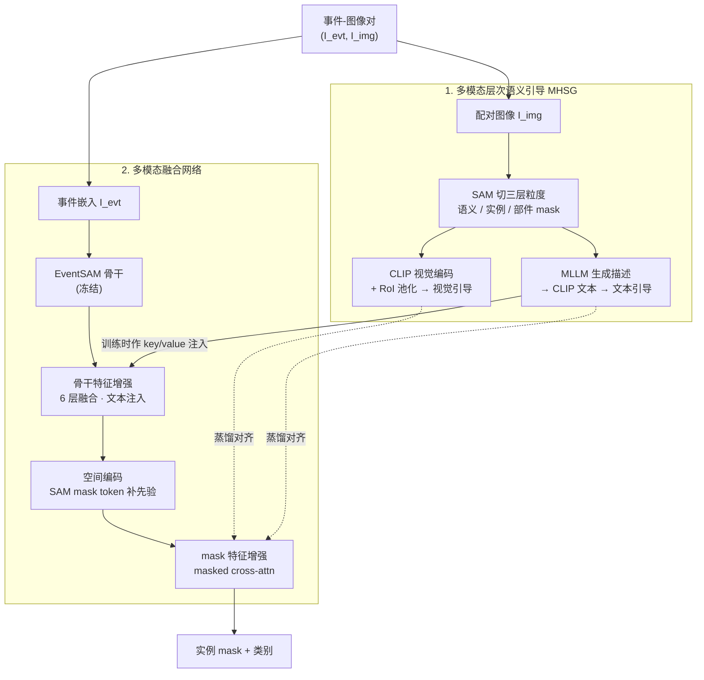

# SEAL: Segment Any Events with Language

**会议**: ICLR 2026  
**arXiv**: [2601.23159](https://arxiv.org/abs/2601.23159)  
**代码**: [https://0nandon.github.io/SEAL](https://0nandon.github.io/SEAL)（即将公开）  
**领域**: 自动驾驶  
**关键词**: 事件相机, 开放词汇实例分割, SAM, CLIP, 多模态融合, 无标注训练  

## 一句话总结

首次提出开放词汇事件实例分割（OV-EIS）任务，设计 SEAL 框架通过多模态层次语义引导（MHSG）和轻量多模态融合网络，在仅使用事件-图像对（无密集标注）的情况下，实现事件流的多粒度（实例级+部件级）语义分割，大幅领先所有基线方法且推理速度最快。

## 研究背景与动机

**事件相机优势**：事件相机具有极高时间分辨率、超低延迟、高动态范围和低功耗，在低光照、过曝等传统相机失效的场景中仍能提供有效信息

**现有事件分割局限**：已有的事件语义分割（ESS）方法局限于闭集词汇表，无法识别训练类别之外的物体，且只能做语义分割而无法区分同类不同实例

**开放词汇事件理解尚处起步**：OpenESS 仅实现了开放词汇语义分割，无法做实例级识别；EventSAM 实现了事件实例分割但不具备语义识别能力

**缺乏评测基准**：此前不存在用于事件实例分割的多语义基准数据集

**效率需求**：事件相机常部署在边缘设备上，需要参数高效、推理快速的模型设计

**领域鸿沟问题**：直接将图像域预训练模型应用于事件流时，即使通过 E2VID 重建图像，由于噪声和伪影仍存在巨大的域差距

## 方法详解

### 整体框架

SEAL 走的是「无标注域适应（AF-DA）」路线：训练时只喂时间同步的事件-图像对 $(I^{evt}, I^{img})$，借配对图像把图像域大模型的语义知识蒸馏给事件分支，全程不碰任何密集事件标注；推理时图像分支退场，只把事件嵌入 $I^{evt}$ 送进网络，根据用户点/框提示输出实例 mask 和类别。整套系统拆成两块——MHSG 模块负责把配对图像加工成多粒度的语义监督信号，多模态融合网络则是一个轻量 mask 分类器，它内部又串起骨干特征增强、空间编码、mask 特征增强三步，把这些监督学进事件特征里。

### 关键设计

**1. 多模态层次语义引导（MHSG）：用免费的图像监督替代昂贵的事件标注**

事件流没有密集标注，但配对图像可以白嫖现成大模型。SEAL 让 SAM 对配对图像自动切出语义级 $M_s^{img}$、实例级 $M_i^{img}$、部件级 $M_p^{img}$ 三层粒度的分割图，再用 CLIP 视觉编码器抽像素级特征、按各层 mask 做 RoI 池化，得到层次视觉引导。光有视觉还不够，分类需要文本锚点，于是再用一个 LLaMA 系的 MLLM 给每个 mask 生成丰富的文字描述，经 CLIP 文本编码器变成层次文本引导。和 OpenESS 死守预定义类名不同，这里的词汇由 MLLM 现场生成，更多样、也天然支持开放词汇——三层粒度恰好对应实例分割与部件分割两种任务需求，监督信号一次到位。

**2. 多模态融合网络：把语义和空间先验同时焊进事件特征**

融合网络在冻结的 EventSAM 骨干上做三件事。第一步是骨干特征增强：叠 6 层多模态融合模块（self-attention + cross-attention + FFN），训练时拿文本引导 $M_l^{text}$ 当 cross-attention 的 key/value 注入语义，推理时无缝换成数据集类名或用户自定义语言，再用 RoI-Align 从语言融合特征里池化出 mask 特征。但纯语义特征有两个硬伤——*死 mask*（小物体的 mask 在下采样后整片消失、变成零向量）和*语义冲突*（低分辨率特征图上不同语义的 mask 落到同一块区域）。为此第二步引入空间编码，借 SAM mask decoder 的 mask token 编码形状与位置先验，把空间特征 $G_l^{evt}$ 和语义特征 $S_l^{evt}$ 拼接后投影回去：$M_l^{evt} = \text{proj}(\text{concat}(G_l^{evt}, S_l^{evt}))$，让小物体和重叠物体重新可分。第三步用 masked cross-attention 做 mask 特征增强，以带位置编码的语言融合骨干特征作 key/value，把注意力强行约束在前景区域，进一步把语义和空间先验拧到一起。这种单骨干设计也省掉了基线常见的「mask 生成 + 分类」双 backbone 冗余，是它推理只要 22.28ms、参数仅 99.1M 的根本原因。

### 损失函数 / 训练策略

训练分两阶段：Stage 1 按原方案先训好 EventSAM，Stage 2 冻结 EventSAM、只训融合网络，数据用合并 DDD17-Seg 与 DSEC-Semantic 训练集得到的 Mixed-24K（共 24,032 对）。优化目标是一条余弦相似度蒸馏损失，把事件 mask 特征在三层粒度上同时对齐视觉引导和文本引导：

$$\mathcal{L}_{distill} = \sum_{l \in \{s,i,p\}} \frac{1}{K_l}(1 - \cos(\hat{M}_l^{evt}, M_l^{img})) + \sum_{l \in \{s,i,p\}} \frac{1}{K_l}(1 - \cos(\hat{M}_l^{evt}, M_l^{text}))$$

两项分别拉近事件特征与图像视觉特征、与 MLLM 文本特征的距离，前者灌入空间结构、后者灌入开放词汇语义，正是这条双对齐损失把「无事件标注」的训练撑了起来。

## 实验关键数据

### 四个评测基准

| 基准 | 来源 | 测试规模 | 分辨率 | 类别数 | 评测维度 |
|------|------|---------|--------|--------|---------|
| DDD17-Ins | DDD17-Seg | 3,890 | 352×200 | 6 | 粗粒度实例分割 |
| DSEC11-Ins | DSEC-Semantic | 2,809 | 640×440 | 11 | 中粒度实例分割 |
| DSEC19-Ins | DSEC-Semantic | 2,809 | 640×440 | 19 | 细粒度实例分割 |
| DSEC-Part | DSEC-Semantic | 2,809 | 640×440 | 9 (5+4) | 部件级分割 |

### 主实验结果（Table 1: Closed-Set 实例分割，Box prompt AP）

| 方法 | 类别 | DDD17-Ins AP | DSEC11-Ins AP | DSEC19-Ins AP | 推理时间(ms) | 参数量(M) |
|------|------|-------------|--------------|--------------|------------|----------|
| OVSAM | AR-CDG | 21.6 | 22.2 | 11.6 | 102.27 | 314.7 |
| OpenSeg | Hybrid | 35.0 | 23.6 | 13.0 | 427.01 | 228.4 |
| MaskCLIP++ | Hybrid | 32.8 | 25.4 | 14.1 | 394.61 | 301.7 |
| frame2recon | AF-DA | 34.8 | 21.2 | 10.5 | 278.35 | 141.7 |
| frame2voxel | AF-DA | 33.6 | 21.3 | 11.3 | 88.19 | 109.1 |
| **SEAL (Ours)** | **AF-DA** | **38.2** | **28.8** | **14.8** | **22.28** | **99.1** |
| 提升 | - | +3.2 | +3.4 | +0.7 | - | - |

### 部件分割结果（Table 2: DSEC-Part）

| 方法 | Point AP | Box AP |
|------|---------|--------|
| VLPart | 12.9 | 16.1 |
| **SEAL** | **13.6** | **18.3** |
| 提升 | +0.7 | +2.2 |

### 消融实验 —— 层次语义引导（Table 3）

- 去掉 part 级引导 → 部件分割 AP 下降（DSEC-Part Box: 14.4~15.4 vs 18.3）
- 去掉 instance/semantic 级引导 → 实例分割 AP 下降
- **三层粒度全用效果最佳**，验证层次引导的必要性

### 消融实验 —— 模型架构（Table 5）

| Fusion | SE | MFE | DDD17 Box AP | DSEC-Part Box AP |
|--------|-----|-----|-------------|-----------------|
| ✓ | | | 35.5 | 14.9 |
| ✓ | ✓ | | 35.7 | 15.7 |
| ✓ | | ✓ | 38.1 | 16.6 |
| ✓ | ✓ | ✓ | **38.2** | **18.3** |

### 效率优势

- SEAL 推理时间 **22.28ms**，远低于所有基线（次优 frame2voxel 88.19ms，快 **~4×**）
- 参数量 **99.1M**，是最参数高效的方案（次优 frame2spike 95.9M 但性能差很多）
- 单骨干架构避免了基线方法需要两个不同 backbone（mask 生成 + 分类）的冗余

## 亮点与洞察

1. **首次定义 OV-EIS 任务**：将开放词汇事件理解从语义级推进到实例级，填补了研究空白
2. **层次语义引导设计精巧**：利用 SAM 内在的三层 mask 机制构建 part/instance/semantic 三级粒度监督，思路自然且有效
3. **无标注训练框架**：仅需事件-图像对，不需要任何人工密集标注，通过 CLIP + MLLM 自动生成监督信号
4. **效率-性能双优**：推理速度比最快基线快 4 倍，参数量最小，同时 AP 全面最高——非常适合事件相机的低功耗边缘部署场景
5. **空间编码模块解决死 mask 和语义冲突**：通过引入 SAM mask token 的空间先验补偿语义特征，UMAP 可视化清晰展示了特征空间的改善
6. **自建四个评测基准**：覆盖标签粒度（6/11/19 类）和语义粒度（实例/部件），为后续研究提供了完整评测体系

## 局限性

1. **依赖事件-图像配对数据**：训练仍需时间同步的事件-图像对，限制了在纯事件数据上的应用
2. **仍需人工视觉提示**：推理时需要用户提供点/框提示，SEAL++ 变体虽可免提示但仅在附录中简要提及
3. **基准局限**：四个基准均来自驾驶场景（DDD17/DSEC），缺乏室内、工业等多样场景的验证
4. **类别数有限**：最多 19 类的闭集评测，尚未展示真正的大规模开放词汇能力
5. **E2VID 重建质量影响**：MHSG 层次引导依赖配对图像质量，在极端事件条件下图像可能也不理想
6. **两阶段训练**：需先训练 EventSAM 再训练融合网络，训练流程相对复杂

## 相关工作

| 方向 | 代表工作 | 与本文关系 |
|------|---------|-----------|
| 事件语义分割 | EV-SegNet, ESS, HALSIE, HMNet | 前置工作，仅做语义分割 |
| 事件实例分割 | EventSAM | 本文基础模型，仅做类别无关分割 |
| 开放词汇事件理解 | OpenESS, EventCLIP, EventBind | 仅语义级，本文推进到实例级 |
| 图像开放词汇分割 | CLIP, MaskCLIP, OpenSeg, OVSeg | 作为基线的 mask 分类器 |
| SAM 及其变体 | SAM, OVSAM, Mask-Adapter | 提供空间先验和基线对比 |

## 评分

- **新颖性**: ⭐⭐⭐⭐ — 首次定义 OV-EIS 任务，MHSG 层次引导设计原创且有效
- **实验充分度**: ⭐⭐⭐⭐ — 4 个基准、11 种基线对比、3 组消融实验，可视化分析到位
- **写作质量**: ⭐⭐⭐⭐ — 结构清晰，问题定义严谨，动机阐述充分
- **价值**: ⭐⭐⭐⭐ — 为事件视觉的开放世界理解开辟了新方向，框架高效实用

<!-- RELATED:START -->

## 相关论文

- [\[CVPR 2026\] HorizonForge: Driving Scene Editing with Any Trajectories and Any Vehicles](../../CVPR2026/autonomous_driving/horizonforge_driving_scene_editing_with_any_trajectories_and_any_vehicles.md)
- [\[ICCV 2025\] SAM4D: Segment Anything in Camera and LiDAR Streams](../../ICCV2025/autonomous_driving/sam4d_segment_anything_in_camera_and_lidar_streams.md)
- [\[CVPR 2025\] Segment Anything, Even Occluded](../../CVPR2025/autonomous_driving/segment_anything_even_occluded.md)
- [\[ICLR 2026\] Plan-R1: Safe and Feasible Trajectory Planning as Language Modeling](plan-r1_safe_and_feasible_trajectory_planning_as_language_modeling.md)
- [\[CVPR 2026\] TerraSeg: Self-Supervised Ground Segmentation for Any LiDAR](../../CVPR2026/autonomous_driving/terraseg_self-supervised_ground_segmentation_for_any_lidar.md)

<!-- RELATED:END -->
