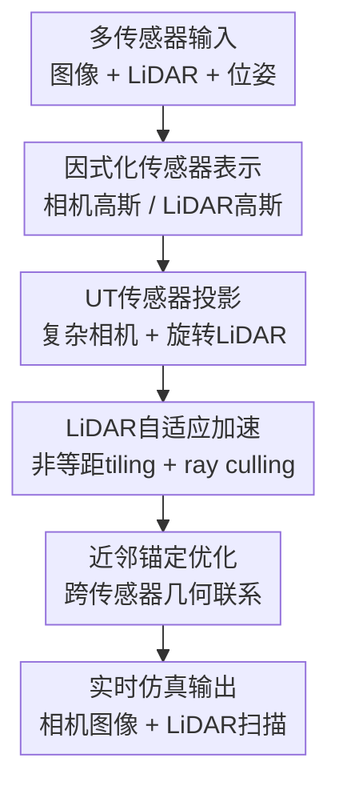

# SimULi: Real-Time LiDAR and Camera Simulation with Unscented Transforms

**会议**: ICLR 2026  
**OpenReview**: [https://openreview.net/forum?id=osxP6FafPZ](https://openreview.net/forum?id=osxP6FafPZ)  
**代码**: 无  
**领域**: 自动驾驶  
**关键词**: LiDAR仿真, 相机仿真, 3D Gaussian Splatting, Unscented Transform, 多传感器重建  

## 一句话总结
SimULi 用因式化的 3D Gaussian 表示分别承载相机与 LiDAR 信息，再把 3DGUT 扩展到旋转式 LiDAR 的非规则采样上，实现了同时支持复杂相机模型和 LiDAR 扫描的实时自动驾驶传感器仿真。

## 研究背景与动机
**领域现状**：自动驾驶系统越来越依赖端到端策略模型和闭环评测，而真实道路数据很难覆盖所有危险、稀有或边界场景。因此，能从真实传感器数据重建场景、再从新视角和新时间戳渲染相机与 LiDAR 观测的神经仿真器，正在成为 AV 开发里的重要基础设施。过去的 NeRF 类方法在质量上有吸引力，3D Gaussian Splatting 类方法则把渲染速度推到实时附近。

**现有痛点**：问题在于自动驾驶不是单个针孔相机渲染任务。真实车载相机常有鱼眼、高畸变、滚动快门，LiDAR 又是稀疏、非均匀、随扫描时间变化的旋转式测量。标准 3DGS 的 rasterization 更适合规则图像平面，难以天然支持这些非线性投影；NeRF 或 ray tracing 路线更灵活，但速度往往不够做大规模仿真。

**核心矛盾**：多传感器联合建模还会遇到另一个更棘手的矛盾：相机和 LiDAR 在真实数据里无法完全对齐。标定误差、时间同步误差、滚动快门、物体运动都会让同一处几何在两个传感器里出现细小冲突。若把相机颜色和 LiDAR 深度硬塞进同一个 NeRF 或同一组 Gaussian，优化时就必须靠 loss 权重在相机质量和 LiDAR 质量之间取舍。

**本文目标**：SimULi 想同时做到三件事：第一，原生支持任意相机模型和旋转式 LiDAR，包括时间相关效应；第二，在相机与 LiDAR 之间不再强行共享同一几何载体，从而减少跨传感器不一致带来的质量牺牲；第三，推理速度要达到实时，使它能真正服务自动驾驶仿真和评测。

**切入角度**：作者选择从 3DGUT 出发，而不是从普通 3DGS 或纯 ray tracing 出发。3DGUT 的关键优势是用 Unscented Transform 近似 Gaussian 在复杂投影下的 2D footprint，因此它比针孔 rasterization 更容易接入鱼眼、滚动快门等非线性传感器模型。本文的观察是：如果把这个思想扩展到 LiDAR 的方位角-俯仰角空间，再配合适合 LiDAR 稀疏采样的 tiling 和 culling，就能兼得灵活传感器模型与高吞吐。

**核心 idea**：用“传感器因式化的 Gaussian 表示 + LiDAR 专用 UT rasterization”替代“所有传感器共享同一表示”，让相机与 LiDAR 各自优化最适合自己的粒子集合，同时通过近邻锚定保持几何联系。

## 方法详解
### 整体框架
SimULi 输入的是自动驾驶场景里的多相机图像、LiDAR 扫描、传感器位姿和动态物体信息，输出是在新视角或新时间戳下的相机图像与 LiDAR 点云。整体上，它先把场景拆成静态背景和动态 actor，再为相机与 LiDAR 分别维护两套 3D Gaussian 粒子；渲染时，相机沿用 3DGUT 的复杂相机投影，LiDAR 则把 Gaussian 投影到方位角-俯仰角网格，并用自动 tiling 与 ray-based culling 加速。

更具体地说，场景表示遵循 Neural Scene Graph 一类动态场景分解：背景是一部分 Gaussian，车辆、行人等动态对象各自带有 3D bounding box 和时间相关的 SE(3) 位姿。属于动态对象的 Gaussian 在对象局部坐标中定义，渲染某个时间戳时再通过对应的位姿变换到世界坐标。这样做保证了仿真器不只是静态重建，还可以在动态场景中按时间和对象状态渲染。

相机渲染使用相机 Gaussian 集合 $G_c$，LiDAR 渲染使用 LiDAR Gaussian 集合 $G_l$。两类 Gaussian 都有中心 $\mu_i$、不透明度 $\alpha_i$ 和协方差 $\Sigma_i$，但它们承载的属性不同：相机 Gaussian 用球谐系数表示视角相关颜色，LiDAR Gaussian 用球谐系数表示强度和 ray drop 相关信息。这样，相机和 LiDAR 的监督不会在同一个粒子上直接互相拉扯。

### 关键设计
**1. 因式化传感器表示：把跨传感器冲突从“硬共享”改成“软关联”**

过去的联合相机-LiDAR 方法常把所有信息压进同一套隐式场或同一组 Gaussian，再用相机 photometric loss 和 LiDAR depth loss 一起训练。这个设置看似共享了几何，实际却把标定误差和时间误差直接变成优化冲突：LiDAR 希望粒子贴近激光返回表面，相机则可能为了颜色、遮挡和视角一致性把粒子推到稍微不同的位置。SimULi 的做法是拆成 $G_c$ 和 $G_l$ 两套粒子，让每个传感器先在自己的表示里解释自己的观测。

这种拆分不是简单地训练两个互不相干的模型。作者用近邻锚定损失让相机 Gaussian 靠近 LiDAR 表示里蒸馏出的表面几何：$L_{anchor}=\frac{1}{n}\sum_i \|\mu_i-NN(\mu_i,G_l)\|_2$。实际训练时，为了避免每步做全量 nearest neighbor，系统会给每个相机 Gaussian 维护 $K=50$ 个 LiDAR 近邻，并每 1000 次迭代更新一次分配。这样相机仍能获得 LiDAR 几何约束，但不是被每条 LiDAR 深度射线硬性压到某个稀疏观测上。

这个设计的好处有两层。质量上，它避免了 loss 权重稍一变化就牺牲某个传感器的现象；速度上，渲染某个传感器时只需要处理对应的 Gaussian 子集。论文的消融显示，因式化加锚定不仅比直接深度监督更稳，还让 LiDAR 渲染从约 $5$ MR/s 提升到 $11$ MR/s 量级。

**2. UT传感器投影：用 sigma points 统一处理鱼眼相机、滚动快门和 LiDAR扫描**

标准 3DGS 的快，来自把 3D Gaussian 投影到规则图像平面后做 tile-based rasterization；但这个投影默认接近针孔相机，面对鱼眼镜头、非线性畸变或时间变化的传感器姿态时会很别扭。SimULi 继承 3DGUT 的做法：不直接假设线性投影，而是对每个 3D Gaussian 取 7 个 sigma points，经传感器投影函数分别投到 2D 空间，再估计投影后的 conic footprint。

对相机而言，这意味着投影函数可以包含任意相机模型和滚动快门运动；对 LiDAR 而言，投影空间从图像平面换成方位角 $\phi$ 与俯仰角 $\theta$。一个 3D 点先变换到 LiDAR 坐标系，再由 $\phi=\arctan2(y,x)$、$\theta=\arcsin(z/r)$、$r=\sqrt{x^2+y^2+z^2}$ 得到球面坐标。由于 sigma points 独立投影，扫描过程中传感器或物体的时间变化也可以被纳入投影函数，而不是事后用静态近似补救。

这个设计让 SimULi 的“传感器泛化能力”比普通 Gaussian rasterization 更强。它不是为某个固定鱼眼模型或某个固定 LiDAR 人工写特例，而是把复杂传感器都抽象成投影函数，再由 UT 近似 Gaussian 在该投影空间里的形状。自动驾驶里传感器型号多、畸变大、扫描时序复杂，这一点比单纯提高 PSNR 更接近实际部署需求。

**3. LiDAR自适应加速：非等距 tiling 和 ray culling 让稀疏扫描不浪费算力**

LiDAR 与相机最大的不同是采样非常不均匀。水平角通常覆盖 $360^\circ$，俯仰角却只有几十度，而且不同 beam 的俯仰分布并不等距。如果照搬图像的均匀 tile，很多 tile 要么没有点，要么点数极不均衡，GPU 工作负载会变得低效。SimULi 因此先根据 LiDAR beam 的俯仰角分布构建归一化 CDF，再在 CDF 过整数边界的位置切分 elevation tile，使每个 tile 里包含的测量数量更接近。

在 elevation tile 确定后，系统再选择 azimuth tile 数，使每个 tile 的 beam 数不超过用户设定的上限 $M$。这个过程对每个传感器定义只做一次，之后所有 rasterization 调用复用同一套 tiling。它比 SplatAD 一类手工指定 tile 边界的做法更可迁移：换一个旋转式 LiDAR，只要给出 beam pattern，就能自动得到适合该传感器的分块方式。

仅仅 tiling 还不够，因为 LiDAR ray 稀疏，许多 Gaussian 即使落在粗 tile 范围内，也根本不会被任何实际射线击中。SimULi 使用两套 tile resolution：粗粒度 $T_r$ 用于最终 rendering，细粒度 $T_c$ 用于 culling。系统先在细网格上建立 ray mask，并用 2D prefix sum 形成 summed-area table；当某个 Gaussian 的投影 extent 与细网格区域相交时，只需常数次内存读取就能判断该区域是否存在射线。没有射线穿过的 Gaussian 会在进入粗渲染前被剔除，从而把 LiDAR 渲染吞吐推到千万 rays/s 级别。

**4. LiDAR物理特性建模：强度、ray drop 和 beam divergence 不只渲染深度**

自动驾驶 LiDAR 仿真如果只输出深度，和真实传感器还有明显差距。SimULi 的 LiDAR Gaussian 不只预测距离，还通过球谐特征输出 beam intensity，并用两个通道经 softmax 得到 hit/drop 概率，从而模拟某条射线是否产生返回。训练时相应地加入 intensity loss 和 binary cross-entropy ray drop loss，使渲染结果更像真实 LiDAR 扫描，而不是稀疏深度图。

论文还特别处理了 beam divergence。现实中的 LiDAR beam 不是零厚度射线，远距离处 footprint 会变大，碰到交通标志等高反射小目标时，只要 beam 的一小部分打到表面就可能产生返回。如果训练时完全按零宽射线理解这些返回，几何会出现膨胀或漂浮伪影。SimULi 用类似 anti-aliased Gaussian smoothing 的思路做 3D 平滑，但避免让深度监督被过度模糊。这个细节说明本文不是把 LiDAR 当成普通 depth map，而是在尽量贴近主动传感器的测量行为。

### 一个完整示例
假设要在 PandaSet 的某个动态街景里渲染一帧新时间戳。系统先根据该时间戳把背景 Gaussian 留在世界坐标，把车辆 actor 的局部 Gaussian 通过对应 SE(3) 位姿变换到世界坐标。若请求的是前视鱼眼相机图像，渲染器只取 $G_c$，对每个候选 Gaussian 的 7 个 sigma points 调用该相机的畸变投影和时间相关姿态，估计 2D conic 后在图像 tile 内 alpha compositing，最后用环境贴图和 bilateral grid 修正背景与曝光变化。

如果请求的是同一时刻的旋转式 LiDAR 扫描，渲染器切换到 $G_l$。每个 Gaussian 的 sigma points 被投到 $\phi$-$\theta$ 空间，先经过该传感器预计算好的非等距 elevation tile，再用细粒度 ray mask 判断是否真的有 LiDAR ray 穿过它的投影范围。保留下来的 Gaussian 在粗 tile 上参与体渲染，输出距离、强度和 ray drop。训练时，若相机 Gaussian 偏离了 LiDAR 表面太远，近邻锚定项会把它温和地拉回，而不是强制它完全匹配某个可能有标定误差的 LiDAR 深度像素。

### 损失函数 / 训练策略
SimULi 每个训练 step 随机采样一张图像和一帧 LiDAR 扫描，联合优化相机 Gaussian $G_c$、LiDAR Gaussian $G_l$、bilateral grid 和环境贴图。总损失写成 $L=L_{recon}+\lambda_{anchor}L_{anchor}+L_{reg}$，其中 $\lambda_{anchor}=0.01$。

重建损失由相机和 LiDAR 两部分组成。相机侧使用 $L_1$ photometric loss 与 SSIM loss，权重分别为 $0.8$ 和 $0.2$；LiDAR 侧使用距离 $L_1$ loss、强度 $L_1$ loss 和 ray drop BCE loss，权重分别为 $0.01$、$0.1$ 和 $0.05$。也就是说，相机 loss 只反传到 $G_c$，LiDAR loss 只反传到 $G_l$，跨传感器联系主要由 $L_{anchor}$ 提供。

正则项主要服务于两个目标：一是让 LiDAR Gaussian 更像真实表面返回，使用 entropy loss 鼓励二值不透明度和稀疏化；二是让新时间戳渲染更稳定，对 affine color transformation、背景、Gaussian scale 和 opacity 做平滑或尺度约束。这些正则不是本文最显眼的贡献，但对减少 floaters、稳定动态场景渲染很重要。

## 实验关键数据

### 主实验
论文在 Waymo Interp、Waymo Dynamic 和 PandaSet 上评估相机图像质量、LiDAR 距离/强度/ray drop 质量，以及渲染吞吐。下表选取最能代表结论的几个场景：Waymo Interp 展示静态 novel view synthesis，Waymo Dynamic 和 PandaSet 展示动态或联合重建能力。

| 数据集 / 设置 | 指标 | SimULi | 主要强基线 | 提升 |
|--------|------|------|----------|------|
| Waymo Interp | PSNR / CD | 30.15 / 0.136 | SplatAD 27.82 / 0.175 | PSNR +2.33 dB，CD 更低 |
| Waymo Interp | 渲染速度 | 156.90 MP/s，11.33 MR/s | SplatAD 49.98 MP/s，2.40 MR/s | 相机约 3.1x，LiDAR 约 4.7x |
| Waymo Dynamic | PSNR / CD | 32.35 / 0.148 | SplatAD 30.60 / 0.223 | PSNR +1.75 dB，CD 更低 |
| Waymo Dynamic | 渲染速度 | 179.45 MP/s，10.56 MR/s | SplatAD 52.28 MP/s，2.94 MR/s | 相机约 3.4x，LiDAR 约 3.6x |
| PandaSet Reconstruction | PSNR / RayDrop / CD | 29.76 / 0.997 / 0.206 | SplatAD 28.58 / 0.974 / 0.336 | PSNR +1.18 dB，LiDAR 更准 |
| PandaSet NVS | PSNR / CD | 27.12 / 0.331 | SplatAD 26.73 / 0.346 | NVS 质量小幅领先 |

这些结果的重点不是单个指标赢一点，而是相机质量、LiDAR 几何、ray drop 和速度同时成立。尤其在 Waymo Interp 上，SimULi 的 PSNR 超过所有基线 2 dB 以上，同时 LiDAR chamfer distance 也优于 LiDAR-only 的 LiDAR-RT，说明它不是靠牺牲 LiDAR 来换相机图像。

### 消融实验
| 配置 | 关键指标 | 说明 |
|------|---------|------|
| Direct $\lambda_d=0$ | PSNR 26.61，CD 6.248，MR/s 5.55 | 不用 LiDAR 深度约束时，相机还可以，但 LiDAR 几何明显崩坏 |
| Direct $\lambda_d=0.01$ | PSNR 26.39，CD 0.475，MR/s 4.97 | 加直接深度监督能改善 LiDAR，但相机质量和速度都受影响 |
| w/o Bilateral Grid | PSNR 25.99，CD 0.337，MR/s 12.07 | 去掉曝光/颜色校正后，相机质量明显下降 |
| w/o Env. Map | PSNR 26.81，CD 0.336，MR/s 11.83 | 环境贴图对背景和远处区域有帮助，但影响小于 bilateral grid |
| Full Method | PSNR 27.12，CD 0.331，MR/s 11.02 | 因式化表示 + 锚定在质量和速度上整体最稳 |

论文还对 LiDAR tiling 做了速度诊断。以 MR/s 为指标，$N_\theta=16$、$M=32$ 的组合达到 15.75 MR/s，是表中最快设置；而更粗或更松的 tile 配置会让很多无效 Gaussian 进入渲染流程。这支持了作者的说法：LiDAR 的 tiling 不是无关紧要的工程参数，而是实时仿真的关键路径。

### 关键发现
- 因式化表示是本文最核心的质量来源。直接把 LiDAR 深度 loss 加到共享表示上，可以让 CD 下降，但会把相机 PSNR、LiDAR 速度和优化稳定性一起拖下去。
- 自动 LiDAR tiling 与 ray culling 是速度来源。SimULi 在 PandaSet 上 LiDAR 渲染达到约 11 MR/s，而 SplatAD 约 1.2 MR/s，说明针对稀疏扫描模式做结构化剔除非常有效。
- 相机侧的收益不只来自继承 3DGUT。相比 3DGUT 在 Waymo Interp 上 27.23 PSNR，SimULi 达到 30.15 PSNR，锚定、bilateral grid 和环境贴图共同减少了稀疏深度监督造成的 floaters。
- 在动态场景中，SimULi 对快速运动和滚动快门的处理明显优于只做简化时序建模的方法。论文的可视化里，文字、车内细节、反射和快速移动物体都更清晰。

## 亮点与洞察
- 最有价值的设计是把“共享几何”从硬约束改成软锚定。很多多模态重建方法默认共享表示一定更好，但 SimULi 说明当传感器存在不可消除的不一致时，适度分家反而能让每个模态都更准。
- 论文把 UT 的价值从复杂相机推广到了 LiDAR。这个角度很自然但不容易做扎实，因为 LiDAR 不只是另一个投影平面，还涉及稀疏 beam pattern、扫描时序、ray drop 和 beam divergence。
- 自动 tiling 是一个很实用的工程创新。它没有引入复杂网络，却把不同 LiDAR 传感器的手工调参问题变成 CDF 均衡和小规模网格搜索，部署价值很高。
- 本文的结果说明“实时 + 高保真 + 多传感器”不一定要靠后处理 CNN。SimULi 没有使用用于 refinement 或 view dependence 的神经网络，反而减少了模糊和文字错误，也降低了推理开销。
- 这套思路可以迁移到其他机器人传感器组合。例如事件相机、毫米波雷达、深度相机也可能存在各自最适合的粒子子集，再通过锚定或局部一致性约束保持场景结构关联。

## 局限与展望
- SimULi 仍然依赖已重建的场景和传感器数据，主要解决 replay / novel view / resimulation，而不是从语义级别自由生成全新交通场景。若要支持大规模闭环仿真，还需要和场景编辑、行为生成或交通参与者规划模块结合。
- 因式化表示虽然缓解了相机-LiDAR 冲突，但也增加了存储和优化对象数量。论文证明渲染时可以只用子集加速，但训练阶段维护两套 Gaussian、近邻分配和多个正则项仍有工程复杂度。
- 近邻锚定默认 LiDAR Gaussian 是更可靠的几何载体。这个假设在大多数 AV 场景里合理，但在雨雾、玻璃、远距离稀疏区域或多径反射场景中，LiDAR 自身也可能有系统偏差，锚定策略可能需要置信度建模。
- 论文主要在 Waymo 和 PandaSet 这类公开自动驾驶数据集上验证。若迁移到不同 LiDAR pattern、更高分辨率鱼眼、多雷达融合或极端天气，自动 tiling 与 beam divergence 模型还需要更多压力测试。
- 后续可以考虑把隐私保护直接纳入表示学习。作者在伦理部分提到训练数据可能包含人脸和车牌，单靠渲染阶段过滤并不能删除模型内部记忆，训练前匿名化或语义蒸馏式脱敏会更稳妥。

## 相关工作与启发
- **vs UniSim / NeuRAD**: 这些 NeRF 式联合仿真方法用统一神经表示适配多传感器，传感器支持较灵活，但渲染速度慢，而且相机和 LiDAR 的不一致会在同一表示里互相干扰。SimULi 用 Gaussian 表示获得实时速度，并用因式化粒子避免硬共享带来的 trade-off。
- **vs SplatAD**: SplatAD 和本文最接近，都是面向自动驾驶的相机-LiDAR Gaussian 仿真。区别在于 SplatAD 仍受普通 3DGS 针孔相机假设限制，LiDAR tiling 依赖手工启发式，并且把传感器信息编码进同一组 Gaussian；SimULi 则基于 3DGUT 支持复杂相机，自动确定 LiDAR tiling，并把相机与 LiDAR 粒子拆开后用锚定连接。
- **vs LiDAR-RT / 3DGRT**: ray tracing 路线天然适合复杂传感器和 secondary rays，但吞吐较低。SimULi 的启发是：只要用 UT 近似复杂投影，再针对 LiDAR 稀疏采样设计 culling，rasterization 路线也可以覆盖相当复杂的传感器模型。
- **vs 3DGUT**: 3DGUT 解决了 distorted camera 和 rolling shutter 的 Gaussian splatting 问题，但没有完整处理旋转式 LiDAR。SimULi 可以看作把 3DGUT 从“复杂相机渲染器”扩展成“自动驾驶多传感器仿真器”。

## 评分
- 新颖性: ⭐⭐⭐⭐⭐ 因式化多传感器 Gaussian 和 LiDAR 专用 UT rasterization 的组合很有辨识度，且直接击中自动驾驶仿真的真实痛点。
- 实验充分度: ⭐⭐⭐⭐⭐ 覆盖 Waymo Interp、Waymo Dynamic、PandaSet，多类相机/LiDAR指标、速度指标和关键消融都比较完整。
- 写作质量: ⭐⭐⭐⭐☆ 方法脉络清晰，图表支撑充分；但部分 LiDAR smoothing 和正则细节放在附录，正文读者需要来回对照。
- 价值: ⭐⭐⭐⭐⭐ 如果实现开源且工程稳定，它对自动驾驶仿真、传感器回放和模型评测都有直接应用价值。

<!-- RELATED:START -->

## 相关论文

- [\[CVPR 2025\] RENO: Real-Time Neural Compression for 3D LiDAR Point Clouds](../../CVPR2025/autonomous_driving/reno_real-time_neural_compression_for_3d_lidar_point_clouds.md)
- [\[CVPR 2026\] SimScale: Learning to Drive via Real-World Simulation at Scale](../../CVPR2026/autonomous_driving/simscale_learning_to_drive_via_real-world_simulation_at_scale.md)
- [\[CVPR 2026\] Unposed-to-3D: Learning Simulation-Ready Vehicles from Real-World Images](../../CVPR2026/autonomous_driving/unposed-to-3d_learning_simulation-ready_vehicles_from_real-world_images.md)
- [\[ICCV 2025\] GS-LIVM: Real-Time Photo-Realistic LiDAR-Inertial-Visual Mapping with Gaussian Splatting](../../ICCV2025/autonomous_driving/gs-livm_real-time_photo-realistic_lidar-inertial-visual_mapping_with_gaussian_sp.md)
- [\[NeurIPS 2025\] ChronoGraph: A Real-World Graph-Based Multivariate Time Series Dataset](../../NeurIPS2025/autonomous_driving/chronograph_a_real-world_graph-based_multivariate_time_series_dataset.md)

<!-- RELATED:END -->
