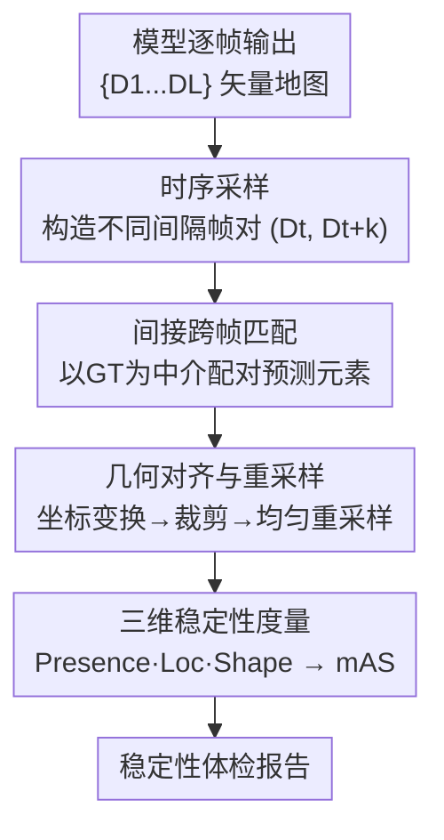

# Stability under Scrutiny: Benchmarking Representation Paradigms for Online HD Map Construction

**会议**: ICLR 2026  
**OpenReview**: [https://openreview.net/forum?id=mxz5RqhCMe](https://openreview.net/forum?id=mxz5RqhCMe)  
**代码**: https://stablehdmap.github.io/ (有)  
**领域**: 自动驾驶 / 在线高精地图  
**关键词**: 在线HD地图, 时序稳定性, 评测基准, mAS, 表征范式

## 一句话总结
这篇论文指出在线高精地图（HD map）领域一直只盯着单帧精度 mAP、却忽视了地图在连续帧之间会"抖动/闪烁"的时序稳定性问题，于是首次提出一套多维稳定性评测框架（Presence / Localization / Shape 三项指标融合成 mAS），在 42 个模型与变体上做了大规模评测，发现 mAP 和 mAS 基本相互独立，并系统分析了传感器、骨干、BEV 编码器、时序融合、训练时长等设计选择各自如何影响精度与稳定性。

## 研究背景与动机

**领域现状**：在线 HD map 是自动驾驶的基础模块——车辆用车载传感器实时构建本地的矢量化地图（车道线、边界、人行横道等），相比离线预建的高精地图省去了昂贵的制作和维护成本，也更能适应动态路况。近几年涌现出大量方法（MapTR、MapTRv2、StreamMapNet、MapTracker、PivotNet、BeMapNet 等），分属不同的表征范式，社区主要用 nuScenes 上的 mean Average Precision（mAP）来排名，精度榜一路刷高。

**现有痛点**：mAP 只衡量**单帧**的几何精度，它完全看不到地图在时间维度上的稳定性。一个 mAP 很高的模型，可能在连续帧之间让车道线忽隐忽现、边界来回抖动、形状突变——就像一个"间歇性失明"的向导。论文用两个具体场景说明危害：场景 A 中本车正在超车，前方车道分隔线在动作中途突然消失，导致本车转向路缘；场景 B 中由于本车感知里车道线闪烁，把旁车的正常变道误判为碰撞航向。这类抖动直接危及下游规划与决策的安全。

**核心矛盾**：精度（per-frame geometric accuracy）和稳定性（inter-frame consistency）是两个不同的东西，但整个领域既缺专门的稳定性**指标**，也缺统一的稳定性**基准**，于是大家默认"精度高 = 可靠"，把稳定性当成精度的免费副产品。这个假设从未被系统验证过。

**本文目标**：(1) 定义能量化时序稳定性的指标；(2) 在大量代表性模型上建立首个稳定性基准；(3) 拆解各类架构设计对精度 vs 稳定性的不同影响。

**切入角度**：稳定性的本质是"同一个地图元素在相邻两帧里长得像不像"。要量化它，就得先把相邻帧里**对应的**地图元素配上对，再在统一坐标系下逐点比较位置和形状的变化。

**核心 idea**：提出"Beyond Accuracy: Under Scrutiny of Stability"主题，构建一套以"跨帧实例匹配 → 几何对齐 → 三维稳定性度量"为骨架的评测框架，把检测一致性、几何抖动、形状保持三个维度融合成单一的 mean Average Stability（mAS）分数，与 mAP 并列作为核心评价标准。

## 方法详解

注意：这是一篇**基准/评测框架**论文，"方法"指的是稳定性评测流水线本身，而不是一个新的地图构建模型。整套框架是给任意已有在线 HD map 模型的输出"做体检"的工具。

### 整体框架

框架的输入是某个模型在一段连续序列上的逐帧输出 $\{D_1, D_2, \dots, D_L\}$（每帧是一组带置信度的矢量化地图元素，即折线 polyline），输出是该模型的稳定性体检报告——Presence / Loc / Shape 三项分数以及综合的 mAS。整条流水线分四个阶段：先**采样帧对**构造不同时间间隔的比较对，再**借助 GT 做中介**把相邻帧里对应的预测元素配对，然后把配对的折线**对齐到同一坐标系并均匀重采样**，最后在对齐后的点集上**计算三维稳定性指标**并融合成 mAS。

### 关键设计

**1. 时序采样：用可调时间间隔造帧对，适配不同应用场景**

稳定性不是看单帧、而是看"隔了多久之后地图变了多少"，所以第一步要把序列拆成一对对帧。给定连续输出 $\{D_1,\dots,D_L\}$ 和一个预设的最大时间间隔 $M$，对每个锚帧 $D_t$（要求 $t \le L-M$），从未来窗口 $\{D_{t+1},\dots,D_{t+M}\}$ 里随机采一帧 $D_{t+k}$，组成评测对 $(D_t, D_{t+k})$；遍历所有合法锚帧得到样本集 $S$，大小 $|S| = L-M$。框架对多个 $M$ 取值（$M \in \{2,3,5,10\}$）分别测试，对应"短时抖动"到"较长时间漂移"等不同的应用关注点——比如紧急避障关心很短间隔的稳定，而路径规划可能容忍更长间隔的缓慢变化。这一设计让稳定性评测不是一个固定数字，而是一条随时间间隔变化的曲线。

**2. 间接跨帧匹配：借 GT 标注当"锚点"，绕开预测本身的不一致**

要比较两帧里"同一条车道线"稳不稳，前提是先知道哪条预测对应哪条。如果直接把 $D_t$ 的预测和 $D_{t+k}$ 的预测两两匹配，恰恰会被预测本身的不一致性污染——模型不稳的时候连"这是不是同一条线"都说不清，匹配就会出错。论文改用**间接匹配**：利用 GT 标注在时间上是持久、稳定的这一事实，把 GT 当作可靠的中介。具体两步：先在每一帧内部用匈牙利算法把预测各自匹配到对应的 GT 实例（代价函数综合几何与语义相似度）；再利用 GT 元素跨帧的持久 ID，把"在不同帧里匹配到同一个 GT 实例"的预测串起来配成对。最终对每个帧对得到一组匹配的实例对 $\{(\text{poly}_{t+k}(e), \text{poly}_t(e)) \mid e \in E\}$，$E$ 是成功跟踪到的元素集合。这里 GT 只作"匹配媒介"而非绝对几何基准，所以即便 GT 标注本身有轻微抖动也不影响评测，因为匹配靠的是持久的 GT 实例 ID 而非精确坐标。

**3. 几何对齐与重采样：把两帧折线搬到同一坐标系再逐点对齐**

配好对的两条折线分属不同时刻、不同自车坐标系，直接比是不公平的，必须先对齐。这一步三个连续操作：**坐标变换**——把历史折线 $\text{poly}_t(e)$ 从 $D_t$ 的自车系经世界系转换到当前帧 $D_{t+k}$ 的自车系，$\text{poly}_{t\to t+k}(e) = T_{\text{world}\to t+k}\cdot T_{t\to\text{world}}\cdot \text{poly}_t(e)$；**感知范围裁剪**——把变换后的折线裁剪到模型在 $D_{t+k}$ 的感知边界内（点 $(x,y)$ 满足 $x_{\min}\le x\le x_{\max}$ 且 $y_{\min}\le y\le y_{\max}$ 才保留），保证比较范围和模型设计一致；**均匀重采样**——对当前折线和变换后的历史折线都均匀重采样，且用一个**动态轴选择**机制按局部几何朝向自适应决定主采样轴（而非固定用 x 轴），这样对任意走向的折线都能稳健重采样，为后续逐点比较打好基础。

**4. 三维稳定性度量：从存在性、定位、形状三个角度量化，再融合成 mAS**

在对齐重采样后的点集 $\text{poly}^{\text{sample}}_{t+k}(e)$ 与 $\text{poly}^{\text{sample}}_t(e)$ 上，论文从三个互补维度刻画稳定性。**Presence Stability（存在稳定性）**衡量检测一致性：设 $\tau$ 为检测阈值，若元素在两帧的置信度同时 $\ge\tau$ 或同时 $<\tau$ 则记 1（一致），一帧有一帧无（闪烁）则记 0.5——它直接对应"车道线忽隐忽现"这类问题。**Localization Stability（定位稳定性）**衡量逐点位置抖动，对 y 坐标取平均 L1 距离再映射到 $[0,1]$ 分数：

$$\text{Loc}(e) = 1 - \frac{1}{\beta}\cdot\frac{1}{N}\sum_{i=1}^{N}\left|y_{t+k}(x_i)-y_t(x_i)\right|,$$

其中缩放参数 $\beta=15$ 取自地图短程半径，代表"完全不稳定"的距离阈值。**Shape Stability（形状稳定性）**比较折线曲率：把曲率 $\kappa$ 近似为相邻线段夹角的均值 $\kappa(\text{poly})=\frac{1}{N-1}\sum_{j=1}^{N-1}\theta_j$（$\theta_j$ 是相邻向量夹角），再用归一化的曲率差定义 $\text{Shape}(e)=1-\frac{|\kappa(\text{poly}^{\text{sample}}_{t+k})-\kappa(\text{poly}^{\text{sample}}_t)|}{\pi}$。三者按下式融合为单实例稳定性：

$$\text{Stability}(e) = \text{Presence}(e)\cdot\left[\omega\cdot\text{Loc}(e) + (1-\omega)\cdot\text{Shape}(e)\right],$$

权重 $\omega$ 默认 0.7（偏重定位）。注意 Presence 作为**乘性门控**：元素如果存在性都不稳，定位和形状再好也会被压低，符合"先得稳定地检测到、才谈得上位置和形状"的直觉。最后对每类取实例平均得到 $\text{Stability}_{\text{class}}$，再对所有类别取平均得到模型级的 mAS。论文强调 mAS 是**补充**而非替代 mAP——光有高 mAS 低 mAP 是"伪稳定"（稳定地输出错的东西），所以两者要联合看。

## 实验关键数据

评测覆盖 **42 个在线 HD map 构造器及变体**，在 nuScenes val 上进行，模型按时序融合机制、输入模态、BEV 编码器、训练轮数等维度分组对比。三个研究问题：RQ1 现有 SOTA 在 mAP 与 mAS 上各自如何、二者是否相关；RQ2 不同表征范式如何影响稳定性；RQ3 各范式在 Presence/Loc/Shape 上的细粒度强弱。

### 主实验：mAP 与 mAS 基本独立

| 模型 | 时序 | 模态 | mAP↑ | Presence↑ | Loc↑ | Shape↑ | mAS↑ |
|------|------|------|------|-----------|------|--------|------|
| MapTR | 否 | C | 44.1 | 91.2 | 65.4 | 90.6 | 71.6 |
| PivotNet | 否 | C | 57.1 | 100.0 | 71.4 | 97.2 | 84.3 |
| MapQR | 否 | C | 66.4 | 91.8 | 75.6 | 91.6 | 77.8 |
| StreamMapNet | 是 | C | 63.3 | 96.6 | 97.7 | 92.3 | **91.9** |
| MapTracker | 是 | C | **75.95** | 93.3 | 98.1 | 95.8 | 90.4 |
| HRMapNet | 是 | C | 67.2 | 92.3 | 70.5 | 91.5 | 75.9 |

两个关键发现：(1) **mAP 高不代表 mAS 高**——MapQR 的 mAP（66.4）高于 PivotNet（57.1），但 mAS（77.8）反而显著低于 PivotNet（84.3），说明稳定性不是精度的自动副产品。(2) **范式间稳定性差距巨大**——mAS 从 MapTR 的 71.6 一路到 StreamMapNet 的 91.9，跨度很大；多数模型聚在 71.6–78.0 的中低段，反映出保持帧间一致性是当前方法的普遍短板。带原生时序设计的模型（StreamMapNet、MapTracker）明显占优。

### 消融实验：各设计选择对精度 vs 稳定性的不同影响

| 设计维度 | 现象 | 典型数据 |
|----------|------|----------|
| 传感器模态（Tab.2） | LiDAR 融合稳提精度，但对稳定性是"模型依赖" | MapTR +LiDAR：mAS 71.6→74.0（+3.4%）；GeMap +LiDAR：mAS 74.7→71.8（−3.9%，精度反升） |
| BEV 编码器（Tab.3） | 不同编码器整体 mAS 接近，但各有专长 | GKT 的 Presence 最高（91.2）；BEVFormer/BEVPool 的 Loc 更好（69.7/69.8） |
| 时序融合（Tab.4） | 效果取决于架构兼容性 | MapTR+GKT 加时序：mAS −7.0%；MapTR+BEVFormer 加时序：mAS +2.4%、mAP +28.1% |
| 2D 骨干（Tab.5） | 强骨干稳提精度，但稳定性不可预测 | MapTR R18→R50：mAP +36.1% 但 mAS −1.6%、Loc −12.8% |
| 训练时长（Tab.6） | 三种行为并存 | 侵蚀（MapTR-50 +110ep：mAP +22.8%、mAS −4.7%）/ 饱和（MapQR +3.2%）/ 敏感（MapTracker −1.0~1.4%） |

### 关键发现
- **精度与稳定性是两个独立维度**：mAS 范围 66.6–91.9，与 mAP 排名错位严重，单看 mAP 会高估很多模型的实际可靠性。
- **原生时序设计 > 事后加挂时序模块**：StreamMapNet、MapTracker 这类把时序融合内生到架构里的模型稳定性最好；给本不为时序设计的架构（如 MapTR+GKT）硬加时序反而掉稳定性（−7.0%），说明时序融合需要"架构协同设计"。
- **强骨干常出现 Presence↑ 但 Loc↓ 的权衡**：MapTR 换强骨干后 Presence +3.4% 但 Loc −12.8%，暗示更强骨干偏向语义一致性而非几何一致性。
- **稳定性不会随精度训练自动涌现**：延长训练几乎总能提精度，但对 mAS 有侵蚀/饱和/敏感三种迥异表现，作者据此主张稳定性必须被**显式优化**。
- **地图先验提精度多、提稳定性少**：HRMapNet 用训练集地图先验把 mAP 拉高 +24.4%，但 mAS 仅 +1.1%，说明动态时序建模比静态先验对一致性贡献更大。

## 亮点与洞察
- **"间接匹配"是整套框架最巧的一步**：用 GT 持久 ID 当跨帧锚点，绕开了"模型自己不稳就匹配不准"的鸡生蛋问题，还顺带让评测对 GT 标注抖动免疫——这个 trick 可迁移到任何需要跨帧/跨视角追踪同一实例的评测任务。
- **Presence 作乘性门控**：把"存在一致性"放在乘法位置，使"地图元素闪烁"这种安全要害被强放大，而不是和位置/形状误差线性平均掉，指标设计直接对齐安全语义。
- **把"评测"本身当成贡献**：论文最大的价值不是某个新模型，而是揭示了一个被整个领域忽视的评价盲区，并用 42 个模型的大规模实证把"mAP≠可靠"钉死，这种"指出皇帝没穿衣服"的工作对社区导向影响很大。
- **三种训练行为的归纳（侵蚀/饱和/敏感）**可直接指导炼丹：如果你的架构属于"侵蚀"型，盲目延长训练会偷偷牺牲稳定性。

## 局限与展望
- **GT 依赖**：间接匹配以 nuScenes 的 GT 标注为中介，框架本身需要高质量 GT 才能评测，难以直接用在没有标注的真实路采序列上做在线监控。
- **只评测、不改进**：论文给出了诊断工具（mAS）和大量分析，但没有提出能同时优化精度与稳定性的新方法，"如何显式优化稳定性"留给了未来工作。
- **指标设计中的若干经验取值**：$\beta=15$、$\omega=0.7$、$M\in\{2,3,5,10\}$ 等均为经验设定（论文称在附录有消融），换数据集/感知范围时这些值未必通用。
- **范式覆盖受限于开源**：因部分方法源码不可得，42 个模型仍未涵盖全部代表性范式，结论的范式普适性还可进一步扩展。

## 相关工作与启发
- **vs 传统精度指标（mAP / mIoU）**：mIoU 和 mAP 都只算单帧的几何/分类精度，完全忽略帧间动态；本文的 mAS 专门补上时序维度，且强调二者互补而非替代。
- **vs 鲁棒性基准（RoboBEV、各类 corruption/天气基准）**：已有鲁棒性工作多是静态、单帧、针对特定传感器故障的分析；本文首次把"在不同表征范式下、序列扰动中的时序稳定性"系统化，填补了空白。
- **vs StreamMapNet / MapTracker 等带时序的方法**：这些方法本身就是为时序一致性设计的，本文的评测正好量化证明了它们在 mAS 上的优势（91.9 / 90.4），并解释了"原生时序设计 vs 事后加挂"的差异来源。

## 评分
- 新颖性: ⭐⭐⭐⭐⭐ 首次为在线 HD map 提出系统化的时序稳定性指标与基准，开辟了一个被忽视的评价维度。
- 实验充分度: ⭐⭐⭐⭐⭐ 42 个模型/变体、五大设计维度的细粒度消融，实证扎实。
- 写作质量: ⭐⭐⭐⭐ 框架与指标定义清晰、动机有具体安全场景支撑；部分结论依赖附录细节。
- 价值: ⭐⭐⭐⭐⭐ "mAP≠可靠"的结论对整个在线建图社区的评测导向有直接影响，且工具将开源。

<!-- RELATED:START -->

## 相关论文

- [\[CVPR 2026\] AMap: Distilling Future Priors for Ahead-Aware Online HD Map Construction](../../CVPR2026/autonomous_driving/amap_distilling_future_priors_for_ahead-aware_online_hd_map_construction.md)
- [\[NeurIPS 2025\] SDTagNet: Leveraging Text-Annotated Navigation Maps for Online HD Map Construction](../../NeurIPS2025/autonomous_driving/sdtagnet_leveraging_text-annotated_navigation_maps_for_online_hd_map_constructio.md)
- [\[CVPR 2025\] MapGCLR: Geospatial Contrastive Learning of Representations for Online Vectorized HD Map Construction](../../CVPR2025/autonomous_driving/mapgclr_geospatial_contrastive_learning_of_representations_for_online_vectorized.md)
- [\[ECCV 2024\] Stream Query Denoising for Vectorized HD-Map Construction](../../ECCV2024/autonomous_driving/stream_query_denoising_for_vectorized_hd-map_construction.md)
- [\[ICML 2025\] SafeMap: Robust HD Map Construction from Incomplete Observations](../../ICML2025/autonomous_driving/safemap_robust_hd_map_construction_from_incomplete_observations.md)

<!-- RELATED:END -->
